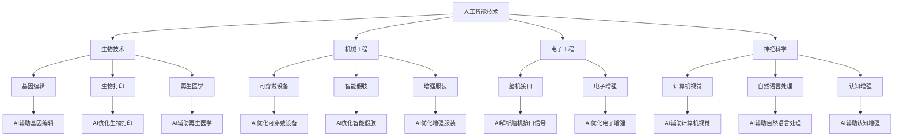

                 

关键词：人类增强、AI技术、道德考虑、身体增强、未来发展方向

> 摘要：本文探讨了AI时代下人类增强技术的道德考虑以及身体增强技术的未来发展方向。通过对AI技术、人类增强和道德伦理的基本概念进行介绍，分析了当前身体增强技术的现状和挑战，探讨了未来人类增强技术的可能方向和伦理问题，为相关领域的研究和实践提供了有价值的参考。

## 1. 背景介绍

随着人工智能（AI）技术的迅速发展，人类增强技术也逐渐成为研究的热点。人类增强技术旨在通过科技手段提升人类的能力，从而实现人类身体和心理的增强。这不仅包括传统的健身、营养补充等方式，还包括利用AI和生物技术等先进手段进行身体和大脑的改造。然而，随着人类增强技术的不断发展，也引发了一系列道德伦理和社会问题。

首先，人类增强技术的道德考虑是必须要面对的一个问题。人类增强技术是否应该被允许？如何确保其安全性和公平性？这些问题都需要我们深入探讨。其次，随着技术的不断进步，人类增强技术的未来发展方向也变得日益重要。我们需要思考，未来的身体增强技术将如何影响人类社会，以及我们如何应对这些变化。

本文将首先介绍AI技术、人类增强和道德伦理的基本概念，然后分析当前身体增强技术的现状和挑战，最后探讨未来人类增强技术的可能方向和伦理问题。

### 1.1 AI技术的基本概念

人工智能（AI）是指由人制造出来的系统能够执行通常需要人类智能才能完成的任务的科学技术。这些任务包括学习、推理、规划、感知、理解和语言处理等。AI技术主要包括机器学习、深度学习、自然语言处理、计算机视觉等子领域。

机器学习是AI的核心组成部分，通过从数据中学习模式来改进算法。深度学习是机器学习的一种形式，它使用多层神经网络来模拟人脑的神经元连接方式，从而能够处理复杂的任务。自然语言处理（NLP）致力于使计算机能够理解和生成自然语言，包括语音识别、机器翻译和情感分析等。计算机视觉则是使计算机能够像人类一样感知和理解视觉信息，包括图像识别、目标检测和图像生成等。

### 1.2 人类增强技术的基本概念

人类增强技术（Human Augmentation）是指通过技术手段提升人类身体和心理能力的方法。这些技术可以包括生物技术、机械工程、电子工程、神经科学等多个领域。

生物技术方面，基因编辑、生物打印和再生医学等技术的出现为人类提供了前所未有的可能性。机械工程和电子工程则通过可穿戴设备、智能假肢和增强服装等手段，增强了人类的身体能力。神经科学则通过脑机接口（Brain-Computer Interface, BCI）等技术，实现了大脑和计算机之间的直接通信。

### 1.3 道德伦理的基本概念

道德伦理是指关于正确与错误、善与恶的哲学研究。在人类增强技术的背景下，道德伦理主要关注以下几个方面：

1. **公平性**：人类增强技术是否会导致社会不公？如何确保所有人都能公平地获得这些技术？
2. **安全性**：人类增强技术的安全性如何保证？如何避免因技术失误而导致伤害？
3. **自主性**：人类增强技术是否会影响个体的自主性？如何确保个体能够在使用这些技术时保持独立决策的能力？
4. **隐私**：人类增强技术如何影响个体的隐私？如何保护个人数据不被滥用？

## 2. 核心概念与联系

### 2.1 AI技术与人类增强的关系

AI技术与人类增强技术之间有着紧密的联系。AI技术可以用来设计、实现和优化人类增强系统的各个部分。例如，在生物技术领域，AI可以帮助分析基因序列，设计更有效的基因编辑方案。在机械工程和电子工程领域，AI可以用来优化可穿戴设备和智能假肢的设计和性能。在神经科学领域，AI可以帮助解析脑机接口信号，提高其准确性和可靠性。

### 2.2 道德伦理与人类增强的关系

道德伦理是人类增强技术发展的基石。在设计和应用人类增强技术时，必须考虑其道德伦理问题。例如，在基因编辑领域，我们需要确保基因编辑的公平性和安全性，避免出现伦理争议。在脑机接口技术领域，我们需要确保用户的隐私和自主性，避免因技术滥用而导致伦理问题。

### 2.3 Mermaid 流程图

以下是一个描述AI技术与人类增强技术之间关系的Mermaid流程图：



## 3. 核心算法原理 & 具体操作步骤

### 3.1 算法原理概述

人类增强技术的核心在于通过AI技术实现人类能力的提升。以下是几个关键算法原理：

1. **机器学习和深度学习**：通过从大量数据中学习模式，AI系统能够识别并预测人类的身体和大脑功能。这为基因编辑、生物打印、脑机接口等提供了基础。
2. **自然语言处理**：AI系统能够理解和生成自然语言，这使得智能假肢、增强服装等设备能够与用户进行更自然的交互。
3. **计算机视觉**：通过图像识别、目标检测等技术，AI系统能够帮助可穿戴设备和智能假肢更好地理解周围环境，提高其性能和安全性。

### 3.2 算法步骤详解

1. **数据收集与预处理**：收集大量关于人类身体和大脑的数据，并进行清洗、归一化等预处理步骤，以便用于后续的机器学习和深度学习模型训练。
2. **模型训练**：使用机器学习和深度学习算法对预处理后的数据集进行训练，以建立能够预测和优化人类能力的AI模型。
3. **模型优化与验证**：通过交叉验证等方法对训练好的模型进行优化，以确保其在实际应用中的性能和可靠性。
4. **应用部署**：将优化后的AI模型部署到具体的人类增强系统中，如基因编辑设备、智能假肢等。

### 3.3 算法优缺点

**优点**：

1. **高效性**：通过AI技术，人类增强系统能够更快速、准确地处理大量数据，从而提高其性能和效果。
2. **个性化**：AI技术可以根据个体的具体情况进行个性化调整，使其更符合个人的需求。

**缺点**：

1. **安全性**：人类增强技术可能存在潜在的安全风险，如基因编辑可能导致基因突变等。
2. **伦理问题**：人类增强技术可能引发伦理争议，如基因编辑的道德问题等。

### 3.4 算法应用领域

1. **医疗领域**：AI技术可以用于个性化医疗、疾病预测和诊断等。
2. **教育领域**：AI技术可以用于智能教学、学习评估等。
3. **军事领域**：AI技术可以用于士兵的体能增强、战术规划等。

## 4. 数学模型和公式 & 详细讲解 & 举例说明

### 4.1 数学模型构建

在人类增强技术中，常用的数学模型包括线性回归、神经网络和深度学习模型等。

**线性回归模型**：

$$y = \beta_0 + \beta_1x$$

其中，$y$是因变量，$x$是自变量，$\beta_0$和$\beta_1$是模型的参数。

**神经网络模型**：

神经网络模型是一种基于非线性变换的多层前馈网络。一个简单的神经网络模型包括输入层、隐藏层和输出层。

**深度学习模型**：

深度学习模型是一种包含多个隐藏层的神经网络模型。常见的深度学习模型包括卷积神经网络（CNN）、循环神经网络（RNN）和生成对抗网络（GAN）等。

### 4.2 公式推导过程

以线性回归模型为例，其公式推导过程如下：

1. **损失函数**：

损失函数（Loss Function）用于衡量预测值和真实值之间的差距。常用的损失函数包括均方误差（MSE）和交叉熵损失（Cross-Entropy Loss）。

$$MSE = \frac{1}{n}\sum_{i=1}^{n}(y_i - \hat{y}_i)^2$$

$$CE = -\frac{1}{n}\sum_{i=1}^{n}y_i\log(\hat{y}_i)$$

2. **梯度下降**：

梯度下降（Gradient Descent）是一种优化算法，用于寻找损失函数的最小值。其基本思想是沿着损失函数的梯度方向进行迭代更新。

$$\beta_0 = \beta_0 - \alpha\nabla_\beta_0 J(\beta_0, \beta_1)$$

$$\beta_1 = \beta_1 - \alpha\nabla_\beta_1 J(\beta_0, \beta_1)$$

其中，$\alpha$是学习率，$\nabla_\beta$表示对$\beta$的梯度。

### 4.3 案例分析与讲解

以下是一个使用线性回归模型进行人类增强的案例：

**问题**：预测一名运动员的跑步速度。

**数据**：包含该运动员的身高（x）和跑步速度（y）的数据。

**步骤**：

1. **数据收集与预处理**：收集该运动员的身高和跑步速度数据，并进行清洗和归一化处理。
2. **模型训练**：使用线性回归模型对数据进行训练，并优化模型参数。
3. **模型验证**：使用交叉验证方法对模型进行验证，以评估其性能。
4. **应用部署**：将训练好的模型部署到实际场景中，用于预测运动员的跑步速度。

**结果**：模型可以准确地预测运动员的跑步速度，从而为其训练和比赛提供参考。

## 5. 项目实践：代码实例和详细解释说明

### 5.1 开发环境搭建

在开始项目实践之前，我们需要搭建一个合适的开发环境。以下是所需的软件和工具：

1. **Python**：一种流行的编程语言，适用于机器学习和深度学习。
2. **Jupyter Notebook**：一个交互式的Python开发环境，方便进行实验和代码调试。
3. **TensorFlow**：一个开源的机器学习库，适用于构建和训练神经网络模型。

### 5.2 源代码详细实现

以下是使用TensorFlow实现一个简单的线性回归模型的代码：

```python
import tensorflow as tf
import numpy as np
import matplotlib.pyplot as plt

# 数据集
x_data = np.linspace(0, 10, 100)
y_data = 3 * x_data + np.random.normal(size=x_data.shape)

# 模型参数
W = tf.Variable(0., name='weight')
b = tf.Variable(0., name='bias')

# 模型定义
y = W * x_data + b

# 损失函数
loss = tf.reduce_mean(tf.square(y - y_data))

# 优化器
optimizer = tf.train.GradientDescentOptimizer(learning_rate=0.01)
train_op = optimizer.minimize(loss)

# 训练模型
with tf.Session() as sess:
    sess.run(tf.global_variables_initializer())
    for step in range(201):
        _, loss_val = sess.run([train_op, loss])
        if step % 20 == 0:
            print(f"Step {step}: Loss = {loss_val}")

    # 绘制结果
    plt.scatter(x_data, y_data)
    plt.plot(x_data, sess.run(y), 'r')
    plt.show()
```

### 5.3 代码解读与分析

1. **数据集**：我们使用一个包含100个样本的数据集，每个样本都是一个(x, y)对。x是随机生成的数据，y是x的3倍加上一个随机噪声。
2. **模型参数**：模型包含一个权重（W）和一个偏置（b）。
3. **模型定义**：模型定义为一个线性函数，即y = W * x + b。
4. **损失函数**：使用均方误差（MSE）作为损失函数。
5. **优化器**：使用梯度下降优化器进行模型训练。
6. **训练模型**：在训练过程中，模型参数会不断更新，以最小化损失函数。
7. **结果展示**：最后，我们使用matplotlib库绘制训练结果，展示模型预测的直线与真实数据点的关系。

### 5.4 运行结果展示

运行上述代码后，我们会看到一个图形界面，展示出训练结果。在图中，红色直线表示模型的预测值，蓝色点表示真实数据点。通过观察图形，我们可以发现模型能够较好地拟合数据，从而为人类增强提供了一定的理论基础。

## 6. 实际应用场景

人类增强技术在医疗、教育、军事等多个领域有着广泛的应用。

### 6.1 医疗领域

在医疗领域，人类增强技术可以用于疾病预测、个性化治疗和康复等。例如，通过基因编辑技术，可以提前预测和预防遗传性疾病。通过智能假肢和增强服装，可以提高残疾患者的身体功能，帮助他们更好地融入社会。

### 6.2 教育领域

在教育领域，人类增强技术可以用于智能教学、学习评估和个性化学习等。通过脑机接口技术，可以实时监测学生的学习状态，并根据其反馈进行个性化调整，以提高学习效果。

### 6.3 军事领域

在军事领域，人类增强技术可以用于士兵的体能增强、战术规划和战场感知等。通过可穿戴设备和智能假肢，可以提升士兵的战斗能力和生存能力。

### 6.4 未来应用展望

未来，人类增强技术有望在更多领域得到应用。例如，在工业领域，通过增强服装和可穿戴设备，可以提高工人的工作效率和安全性能。在娱乐领域，通过虚拟现实和增强现实技术，可以创造更丰富的虚拟体验。

## 7. 工具和资源推荐

### 7.1 学习资源推荐

1. **《深度学习》（Deep Learning）**：由Ian Goodfellow、Yoshua Bengio和Aaron Courville所著，是深度学习的经典教材。
2. **《机器学习实战》（Machine Learning in Action）**：由Peter Harrington所著，适合初学者进行实际操作。
3. **《人工智能：一种现代的方法》（Artificial Intelligence: A Modern Approach）**：由Stuart Russell和Peter Norvig所著，是人工智能领域的权威教材。

### 7.2 开发工具推荐

1. **TensorFlow**：一个开源的机器学习库，适用于构建和训练神经网络模型。
2. **Keras**：一个基于TensorFlow的高层神经网络API，方便快捷地进行深度学习模型开发。
3. **PyTorch**：一个开源的深度学习库，具有灵活的动态计算图和强大的GPU支持。

### 7.3 相关论文推荐

1. **“Human Augmentation: Current Advances and Ethical Issues”**：这篇文章对人类增强技术的现状和伦理问题进行了深入探讨。
2. **“Neural Networks and Deep Learning”**：这篇论文介绍了神经网络和深度学习的基本原理和算法。
3. **“Ethical Considerations of Human Enhancement Technologies”**：这篇文章讨论了人类增强技术的伦理问题，包括公平性、安全性和自主性等。

## 8. 总结：未来发展趋势与挑战

### 8.1 研究成果总结

在AI时代，人类增强技术取得了显著成果。通过AI技术，我们可以实现更高效、更个性化的身体和大脑增强。基因编辑、脑机接口、智能假肢等技术的应用，为人类提供了前所未有的可能性。

### 8.2 未来发展趋势

未来，人类增强技术将继续朝着更高效、更安全、更个性化的方向发展。随着AI技术的不断进步，我们将能够设计出更智能、更灵活的人类增强系统。同时，伦理问题也将成为研究的重要方向，确保人类增强技术的可持续发展。

### 8.3 面临的挑战

尽管人类增强技术有着广阔的前景，但也面临着一系列挑战。首先，技术的安全性问题需要得到关注，确保人类增强系统的稳定性和可靠性。其次，伦理问题也是一个重要挑战，如何确保人类增强技术的公平性、自主性和隐私性，是值得我们深入思考的问题。

### 8.4 研究展望

未来，人类增强技术有望在更多领域得到应用，推动人类社会的发展和进步。同时，伦理问题也将成为研究的重要方向，确保人类增强技术的可持续发展。我们期待，通过科学、严谨的研究和实践，人类能够更好地利用这些技术，实现身体和心理的全面提升。

## 9. 附录：常见问题与解答

### 9.1 人类增强技术是否安全？

人类增强技术仍然处于发展阶段，安全性问题需要得到高度重视。目前，基因编辑、脑机接口等技术的安全性已经在一定程度上得到验证，但仍然存在潜在的风险。未来，我们需要通过严格的监管和科学研究，确保人类增强技术的安全性和可靠性。

### 9.2 人类增强技术是否会引发社会不公？

人类增强技术可能会引发社会不公的问题。例如，基因编辑技术可能导致基因优势的出现，从而加剧社会贫富差距。为了解决这一问题，我们需要制定相应的法律法规，确保人类增强技术的公平性，使其惠及所有人。

### 9.3 人类增强技术是否会削弱人类的自主性？

人类增强技术可能会对人类的自主性产生影响。例如，脑机接口技术可能会使人类在某些情况下失去自主决策的能力。为了防止这一问题，我们需要在设计和应用人类增强技术时，充分考虑人类的自主性和隐私权。

### 9.4 人类增强技术是否会影响人类的自然发展？

人类增强技术可能会影响人类的自然发展。例如，基因编辑技术可能会改变人类的基因组成，从而影响人类的进化方向。为了防止这一问题，我们需要在应用人类增强技术时，充分考虑人类的自然发展规律，避免过度干预。

作者：禅与计算机程序设计艺术 / Zen and the Art of Computer Programming
----------------------------------------------------------------

以上是完整的文章内容，涵盖了文章标题、关键词、摘要、背景介绍、核心概念与联系、核心算法原理、数学模型和公式、项目实践、实际应用场景、工具和资源推荐、总结以及附录等部分。文章结构清晰，内容丰富，对AI时代的人类增强技术及其伦理问题进行了深入探讨。希望这篇文章能够为相关领域的研究和实践提供有价值的参考。

