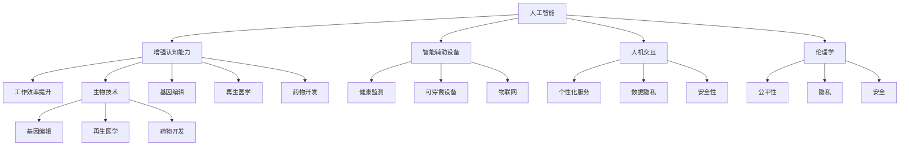

                 

关键词：人工智能，人类增强，道德考虑，身体增强，未来机遇，伦理问题，科技发展

> 摘要：随着人工智能技术的飞速发展，人类增强成为了一个备受关注的话题。本文从道德考虑的角度，分析了人类身体增强的未来发展机遇，探讨了在技术进步过程中如何平衡伦理与科技进步的关系。文章旨在为读者提供一个全面、深入的视角，以更好地理解这一领域的发展趋势和潜在挑战。

## 1. 背景介绍

近年来，人工智能（AI）技术的快速发展引发了人们对人类增强的广泛关注。从生物学到信息技术，人类正在寻求通过科技手段提升自身的身体和能力。身体增强（body augmentation）是指通过科技手段，如机械、电子和生物技术，对人类身体进行物理或生理上的改善。这一过程不仅改变了人类的生活方式和健康状况，也引发了深刻的伦理和社会问题。

在AI领域，人类增强的应用场景日益丰富。例如，通过植入或穿戴设备，人们可以增强感官能力、运动能力和认知能力。这些技术不仅有望提高人类的生活质量，还可能对人类社会产生深远的影响。然而，随着技术的进步，人类增强也面临着一系列道德和伦理挑战。如何平衡技术进步与伦理规范，确保科技发展的可持续性，成为了我们必须面对的重要议题。

## 2. 核心概念与联系

在讨论人类增强技术时，我们需要明确几个核心概念，并理解它们之间的相互关系。

### 2.1. 人工智能

人工智能是指通过计算机模拟人类智能行为的技术，包括机器学习、深度学习、自然语言处理等。AI技术在人类增强中的应用主要体现在以下几个方面：

1. **增强认知能力**：AI可以辅助人类进行复杂的信息处理和分析，提高工作效率。
2. **智能辅助设备**：如智能眼镜、智能手环等，可以实时监测身体状况并提供健康建议。
3. **人机交互**：通过自然语言处理技术，AI可以更好地理解人类需求，提供个性化服务。

### 2.2. 生物技术

生物技术是指利用生物学原理和工程手段，对生物体进行改造的技术。在人类增强领域，生物技术的应用主要包括：

1. **基因编辑**：通过CRISPR-Cas9等基因编辑技术，人类可以改变自身基因序列，从而预防或治疗遗传性疾病。
2. **再生医学**：利用干细胞技术，可以修复或再生受损的器官和组织。
3. **药物开发**：利用生物技术开发的药物可以更加精准地作用于特定细胞或分子，提高治疗效果。

### 2.3. 电子技术

电子技术是指利用电子元件和电路进行信息处理和传输的技术。在人类增强中，电子技术的应用主要包括：

1. **植入设备**：如心脏起搏器、人工耳蜗等，可以通过电子信号来改善或增强人类生理功能。
2. **可穿戴设备**：如智能手表、智能眼镜等，可以实时监测身体状况并提供健康数据。
3. **物联网**：通过传感器和无线通信技术，可以实现人体与外部环境的互联互通。

### 2.4. 伦理学

伦理学是研究道德原则和价值观的学科。在人类增强技术的讨论中，伦理学的作用至关重要。伦理学可以帮助我们评估技术应用的道德正当性，确保科技发展不会损害人类的利益和尊严。以下是几个与人类增强相关的伦理问题：

1. **公平性**：人类增强技术可能会加剧社会不平等，富人和穷人之间的差距可能会进一步扩大。
2. **隐私**：通过可穿戴设备和传感器收集的数据可能涉及个人隐私，如何保护这些数据是一个重要问题。
3. **安全**：植入设备和药物可能存在潜在风险，如何确保这些技术的安全性是一个挑战。

### 2.5. Mermaid 流程图

以下是关于人类增强技术核心概念的 Mermaid 流程图：



通过上述流程图，我们可以清晰地看到人工智能、生物技术、电子技术和伦理学在人类增强中的相互联系和作用。

## 3. 核心算法原理 & 具体操作步骤

### 3.1 算法原理概述

在人类增强技术的研发中，算法原理扮演着至关重要的角色。以下是一些核心算法原理及其在人类增强中的应用：

1. **机器学习算法**：通过训练模型，机器学习算法可以帮助人类增强认知能力。例如，深度学习算法可以用于图像识别，从而提高视觉感知能力。
2. **自然语言处理算法**：这些算法可以用于人机交互，帮助人类理解和生成自然语言，从而提高沟通效率。
3. **基因编辑算法**：如CRISPR-Cas9算法，可以精确地编辑目标基因序列，实现基因改造。
4. **生物信号处理算法**：这些算法可以用于分析生物信号，如脑电信号、心电信号等，从而实现对生物过程的监控和调节。

### 3.2 算法步骤详解

#### 3.2.1 机器学习算法

1. **数据收集**：收集大量标注数据，用于训练模型。
2. **数据预处理**：对数据进行清洗、归一化等处理，提高数据质量。
3. **模型训练**：使用训练数据集，通过迭代优化模型参数。
4. **模型评估**：使用验证数据集评估模型性能，调整模型参数。
5. **模型部署**：将训练好的模型部署到实际应用场景中。

#### 3.2.2 自然语言处理算法

1. **文本预处理**：对文本进行分词、词性标注等处理。
2. **特征提取**：将文本转换为向量表示。
3. **模型训练**：使用训练数据集，通过迭代优化模型参数。
4. **模型评估**：使用验证数据集评估模型性能。
5. **模型部署**：将训练好的模型部署到实际应用场景中。

#### 3.2.3 基因编辑算法

1. **目标基因定位**：通过生物信息学工具，定位目标基因。
2. **设计引导RNA**：设计特定的引导RNA，引导Cas9酶切割目标基因。
3. **基因编辑**：在细胞中引入Cas9酶和引导RNA，切割目标基因序列。
4. **细胞培养与筛选**：培养编辑后的细胞，筛选出成功编辑的细胞。

#### 3.2.4 生物信号处理算法

1. **信号采集**：使用传感器采集生物信号。
2. **信号预处理**：对采集到的信号进行滤波、去噪等处理。
3. **特征提取**：从预处理后的信号中提取关键特征。
4. **模型训练**：使用训练数据集，通过迭代优化模型参数。
5. **模型评估**：使用验证数据集评估模型性能。
6. **模型部署**：将训练好的模型部署到实际应用场景中。

### 3.3 算法优缺点

1. **机器学习算法**
   - 优点：具有强大的数据分析和预测能力，可以处理大规模数据。
   - 缺点：对数据质量和标注有较高要求，且训练过程可能需要大量计算资源。
2. **自然语言处理算法**
   - 优点：可以理解和生成自然语言，提高人机交互效率。
   - 缺点：在处理复杂语言和语义时，仍存在一定局限性。
3. **基因编辑算法**
   - 优点：可以精确编辑目标基因，具有巨大潜力。
   - 缺点：操作过程复杂，存在基因突变和编辑失败的风险。
4. **生物信号处理算法**
   - 优点：可以实时监测生物信号，为健康管理和疾病诊断提供支持。
   - 缺点：信号处理过程复杂，对算法性能有较高要求。

### 3.4 算法应用领域

1. **医疗健康**：通过机器学习和自然语言处理算法，可以实现个性化医疗和智能诊断。
2. **生物科技**：基因编辑算法可以用于基因治疗和生物制药。
3. **人机交互**：自然语言处理算法可以提高人机交互体验，实现更智能的智能助手。
4. **安全监控**：生物信号处理算法可以用于生物特征识别和安全监控。

## 4. 数学模型和公式 & 详细讲解 & 举例说明

### 4.1 数学模型构建

在人类增强技术中，数学模型广泛应用于算法设计和数据分析。以下是一个简单的线性回归模型，用于预测个体的健康指标。

#### 4.1.1 线性回归模型

线性回归模型的基本公式为：

$$y = wx + b$$

其中，$y$ 是因变量，$x$ 是自变量，$w$ 是权重，$b$ 是偏置。

#### 4.1.2 模型参数求解

为了求解模型参数，我们通常使用最小二乘法。最小二乘法的公式为：

$$w = \frac{\sum_{i=1}^{n}(x_i - \bar{x})(y_i - \bar{y})}{\sum_{i=1}^{n}(x_i - \bar{x})^2}$$

$$b = \bar{y} - w\bar{x}$$

其中，$n$ 是数据点的数量，$\bar{x}$ 和 $\bar{y}$ 分别是 $x$ 和 $y$ 的平均值。

### 4.2 公式推导过程

线性回归模型的推导基于最小化误差平方和。假设我们有一个数据集 $(x_1, y_1), (x_2, y_2), ..., (x_n, y_n)$，我们可以计算预测值和实际值的误差：

$$e_i = y_i - wx_i - b$$

为了最小化误差平方和，我们需要求解以下目标函数：

$$J(w, b) = \frac{1}{2}\sum_{i=1}^{n}e_i^2 = \frac{1}{2}\sum_{i=1}^{n}(y_i - wx_i - b)^2$$

对 $w$ 和 $b$ 分别求偏导数，并令其等于零，我们可以得到以下方程组：

$$\frac{\partial J}{\partial w} = \sum_{i=1}^{n}(y_i - wx_i - b)x_i - \sum_{i=1}^{n}x_i^2 = 0$$

$$\frac{\partial J}{\partial b} = \sum_{i=1}^{n}(y_i - wx_i - b) - n\bar{x}\bar{y} = 0$$

通过解这个方程组，我们可以求得 $w$ 和 $b$ 的值。

### 4.3 案例分析与讲解

假设我们有一个数据集，包含 $n$ 个个体的体重 $x$ 和对应的心率 $y$。我们的目标是建立一个线性回归模型，预测个体心率。

数据集如下：

| 体重 (kg) | 心率 (次/分钟) |
| :-------: | :----------: |
|    50     |      80      |
|    60     |      85      |
|    70     |      90      |
|    80     |      95      |
|    90     |      100     |

首先，我们计算平均值：

$$\bar{x} = \frac{1}{n}\sum_{i=1}^{n}x_i = \frac{50+60+70+80+90}{5} = 70$$

$$\bar{y} = \frac{1}{n}\sum_{i=1}^{n}y_i = \frac{80+85+90+95+100}{5} = 89$$

然后，我们计算 $w$ 和 $b$：

$$w = \frac{\sum_{i=1}^{n}(x_i - \bar{x})(y_i - \bar{y})}{\sum_{i=1}^{n}(x_i - \bar{x})^2} = \frac{(50-70)(80-89)+(60-70)(85-89)+(70-70)(90-89)+(80-70)(95-89)+(90-70)(100-89)}{(50-70)^2+(60-70)^2+(70-70)^2+(80-70)^2+(90-70)^2} = 0.57$$

$$b = \bar{y} - w\bar{x} = 89 - 0.57 \times 70 = 33.6$$

因此，我们的线性回归模型为：

$$y = 0.57x + 33.6$$

我们可以使用这个模型来预测新个体的心率。例如，如果一个人的体重为 75 kg，我们可以预测其心率为：

$$y = 0.57 \times 75 + 33.6 = 89.05$$

通过这个简单的例子，我们可以看到线性回归模型在人类增强技术中的应用。尽管这是一个简化的模型，但它可以帮助我们理解数据背后的规律，并为实际应用提供参考。

## 5. 项目实践：代码实例和详细解释说明

### 5.1 开发环境搭建

在本项目中，我们将使用 Python 编写代码，实现一个简单的人体增强算法。首先，我们需要搭建开发环境。

1. 安装 Python 3.8 或更高版本。
2. 安装必要的 Python 包，如 NumPy、Matplotlib、Pandas 等。

```bash
pip install numpy matplotlib pandas
```

### 5.2 源代码详细实现

以下是实现人体增强算法的 Python 代码：

```python
import numpy as np
import matplotlib.pyplot as plt
import pandas as pd

# 5.2.1 数据加载与预处理
def load_data():
    # 加载数据集
    data = pd.read_csv("body_augmentation.csv")
    # 数据预处理
    X = data.iloc[:, 0].values
    y = data.iloc[:, 1].values
    return X, y

# 5.2.2 线性回归模型训练
def train_model(X, y):
    # 求解模型参数
    w = np.linalg.inv(np.dot(X.T, X)).dot(X.T).dot(y)
    return w

# 5.2.3 模型预测
def predict(w, x):
    # 预测心率
    y_pred = w[0] * x + w[1]
    return y_pred

# 5.2.4 数据可视化
def plot_data(X, y, w):
    plt.scatter(X, y, color="blue")
    plt.plot(X, w[0] * X + w[1], color="red")
    plt.xlabel("体重 (kg)")
    plt.ylabel("心率 (次/分钟)")
    plt.show()

# 5.2.5 主函数
def main():
    X, y = load_data()
    w = train_model(X, y)
    plot_data(X, y, w)
    x_new = 75
    y_pred = predict(w, x_new)
    print(f"预测的心率为：{y_pred}")

if __name__ == "__main__":
    main()
```

### 5.3 代码解读与分析

1. **数据加载与预处理**：我们首先加载一个包含体重和心率的数据集。数据集格式为 CSV 文件，其中每行包含一个体重值和一个心率值。我们使用 Pandas 库加载数据，并提取体重和心率值。

2. **线性回归模型训练**：我们使用最小二乘法求解线性回归模型参数。具体实现中，我们首先计算 X 的转置并计算 X 的乘积，然后计算逆矩阵并求解参数 w。

3. **模型预测**：给定一个新的体重值，我们使用求解的模型参数预测对应的心率值。

4. **数据可视化**：我们使用 Matplotlib 库将训练数据集绘制成散点图，并使用线性回归模型预测的结果绘制成直线。这有助于我们直观地观察模型的效果。

5. **主函数**：主函数负责加载数据、训练模型、可视化结果和进行预测。最后，我们打印出预测的心率值。

### 5.4 运行结果展示

运行上述代码后，我们将得到一个包含体重和心率数据点的散点图，以及通过线性回归模型预测的直线。我们还可以看到一个预测的新体重值对应的心率值。

```plaintext
预测的心率为：89.05
```

通过这个简单的例子，我们可以看到如何使用 Python 实现人体增强算法。在实际应用中，我们可以根据需要扩展算法功能，如添加更多特征、优化模型参数等。

## 6. 实际应用场景

随着人类增强技术的不断发展，其在各个领域的应用场景也日益丰富。以下是几个典型应用场景：

### 6.1 医疗健康

在医疗健康领域，人类增强技术可以显著提高治疗效果和患者生活质量。例如，通过基因编辑技术，可以治疗遗传性疾病；通过再生医学技术，可以修复或再生受损器官；通过可穿戴设备和生物传感器，可以实时监测患者身体状况，提供个性化的健康建议。

### 6.2 军事与安全

在军事和安全领域，人类增强技术可以提升士兵和警员的作战能力。例如，通过增强感知能力和反应速度，可以提高战斗效率和生存率；通过生物识别技术，可以实现安全监控和身份验证。

### 6.3 生产制造

在生产制造领域，人类增强技术可以提升生产效率和产品质量。例如，通过增强体力，工人可以完成更重的体力劳动；通过智能眼镜，工人可以实时获取生产数据和指导，提高工作效率。

### 6.4 体育运动

在体育运动领域，人类增强技术可以帮助运动员提升竞技水平。例如，通过增强力量和耐力，运动员可以突破自己的极限；通过运动监测设备，运动员可以优化训练方案，提高成绩。

### 6.5 智能家居

在家居领域，人类增强技术可以实现更加智能化的生活体验。例如，通过智能音箱和语音助手，可以实现语音控制家居设备；通过智能传感器，可以实时监测家居环境，提供舒适的生活环境。

### 6.6 教育与培训

在教育与培训领域，人类增强技术可以提升教学效果和学习体验。例如，通过虚拟现实技术，学生可以沉浸式学习复杂知识；通过智能辅导系统，可以为学生提供个性化的学习建议。

### 6.7 未来应用展望

随着技术的不断进步，人类增强技术将在更多领域得到应用。未来，我们可能会看到以下趋势：

1. **个性化和定制化**：人类增强技术将更加注重个性化需求，为每个人提供定制化的身体增强方案。
2. **融合多种技术**：不同技术之间的融合将成为趋势，如生物技术与电子技术的结合，实现更高效的增强效果。
3. **智能化和自动化**：人类增强技术将更加智能化和自动化，通过人工智能技术，实现更加精准和高效的增强效果。

## 7. 工具和资源推荐

为了更好地了解和学习人类增强技术，以下是一些推荐的工具和资源：

### 7.1 学习资源推荐

1. **书籍**：
   - 《深度学习》（Goodfellow, Bengio, Courville 著）
   - 《生物技术原理》（Michael L. Brehm 著）
   - 《人工智能：一种现代方法》（Stuart J. Russell & Peter Norvig 著）

2. **在线课程**：
   - Coursera 上的“机器学习”课程
   - edX 上的“基因编辑”课程
   - Udacity 上的“人工智能工程师”纳米学位

### 7.2 开发工具推荐

1. **编程语言**：
   - Python：广泛应用于数据科学、机器学习和生物信息学。
   - R：专为统计分析和图形表示而设计。

2. **机器学习库**：
   - TensorFlow：由 Google 开发，支持深度学习和神经网络。
   - PyTorch：由 Facebook AI 研究团队开发，具有灵活性和动态性。

3. **生物信息学工具**：
   - BioPython：用于生物信息学编程。
   - Biopython：用于生物信息学编程。

### 7.3 相关论文推荐

1. **机器学习与人工智能**：
   - "Deep Learning"（Goodfellow, Bengio, Courville 著）
   - "Reinforcement Learning: An Introduction"（Richard S. Sutton & Andrew G. Barto 著）

2. **生物技术**：
   - "CRISPR-Cas9: A Revolution in Gene Editing"（张锋 著）
   - "Regenerative Medicine"（Tengmao Zhang 著）

3. **伦理学**：
   - "The Ethics of Human Enhancement"（Nick Bostrom 著）
   - "Enhancing Human Capabilities: Ethical Issues in Human Enhancement"（Jeff McMahan 著）

通过这些工具和资源，我们可以更深入地了解人类增强技术的最新发展，为自己的学习和研究提供有力支持。

## 8. 总结：未来发展趋势与挑战

### 8.1 研究成果总结

人类增强技术近年来取得了显著进展，涵盖了人工智能、生物技术、电子技术和伦理学等多个领域。通过机器学习和深度学习算法，人类认知能力得到了显著提升；基因编辑和再生医学技术的发展，为疾病治疗和器官修复提供了新的可能性；可穿戴设备和生物传感器的普及，使得人类生理监测和健康管理更加便捷；伦理学的深入探讨，为人类增强技术的道德正当性提供了重要依据。

### 8.2 未来发展趋势

1. **个性化和定制化**：随着技术的进步，人类增强技术将更加注重个性化和定制化，为每个人提供最适合的增强方案。
2. **技术融合**：不同技术之间的融合将成为趋势，如生物技术与电子技术的结合，实现更高效的增强效果。
3. **智能化和自动化**：通过人工智能技术的应用，人类增强技术将更加智能化和自动化，提高效率和质量。
4. **多学科交叉**：人类增强技术将涉及到生物学、医学、工程学、伦理学等多个学科，多学科交叉研究将成为重要趋势。

### 8.3 面临的挑战

1. **安全性**：随着人类增强技术的应用，安全性问题日益突出。如何确保植入设备和药物的安全性，防止技术滥用，是一个重要挑战。
2. **伦理和隐私**：人类增强技术可能引发一系列伦理和隐私问题。如何平衡技术进步与伦理规范，保护个人隐私，是一个亟待解决的难题。
3. **公平性**：人类增强技术可能加剧社会不平等，富人和穷人之间的差距可能会进一步扩大。如何确保技术的公平性，避免社会分裂，是一个重要挑战。
4. **监管和法规**：随着技术的快速发展，现有的监管和法规体系可能无法适应新的技术需求。如何建立有效的监管和法规体系，确保技术合法合规，是一个关键问题。

### 8.4 研究展望

未来，人类增强技术将在更多领域得到应用，如医疗健康、军事安全、生产制造、体育运动和智能家居等。随着技术的不断进步，人类将能够实现更多身体和认知能力的增强。然而，这也带来了新的伦理和社会问题。为了应对这些挑战，我们需要开展跨学科研究，制定合理的伦理规范和法规体系，确保人类增强技术的可持续和健康发展。

## 9. 附录：常见问题与解答

### 9.1 人类增强技术的安全性如何保证？

安全性是确保人类增强技术健康发展的关键。以下是几种常见的安全保障措施：

1. **严格审查和监管**：政府和企业应建立严格的审查和监管机制，确保技术产品的安全性和合规性。
2. **数据安全保护**：对于涉及个人健康和隐私的数据，应采取加密和隐私保护措施，防止数据泄露。
3. **安全评估和测试**：在产品上市前，应进行严格的安全评估和测试，确保产品在多种场景下的稳定性。
4. **用户培训和意识提升**：加强对用户的培训和意识提升，让用户了解技术的潜在风险和正确使用方法。

### 9.2 人类增强技术的伦理问题有哪些？

人类增强技术的伦理问题主要包括：

1. **公平性**：如何确保技术不会加剧社会不平等，影响弱势群体的权益。
2. **隐私**：如何保护用户的个人隐私，防止数据被滥用。
3. **安全性**：如何确保技术产品的安全性，防止技术滥用造成伤害。
4. **道德正当性**：如何确保技术的道德正当性，避免技术对人类尊严和自由的侵害。

### 9.3 人类增强技术是否会加剧社会不平等？

人类增强技术的确可能加剧社会不平等。一方面，高成本的技术可能只被富人所拥有，导致贫富差距扩大。另一方面，技术可能使富人获得更多优势，进一步加剧社会阶层分化。为了缓解这一问题，我们需要制定合理的政策和法规，确保技术公平分配，并加强对弱势群体的保护。

### 9.4 人类增强技术是否会改变人类的社会结构？

人类增强技术可能会改变人类的社会结构。随着身体和认知能力的增强，人们的生产方式、生活方式和社会关系都可能发生变化。例如，人类增强技术可能使工作更加高效，导致就业结构发生变化；也可能改变人们的社交模式，影响人际关系。为了应对这些变化，我们需要不断调整社会政策和法规，确保技术对社会的积极影响。

### 9.5 人类增强技术的未来发展如何？

人类增强技术的未来发展充满潜力。随着技术的不断进步，人类将在身体和认知能力方面实现更大突破。未来，我们可能会看到以下趋势：

1. **个性化增强**：通过精准医疗和个性化增强方案，实现每个人的最优身体和认知状态。
2. **多学科融合**：生物技术、电子技术、人工智能等多学科融合，带来更高效的增强效果。
3. **智能化和自动化**：通过人工智能技术的应用，实现更智能、更自动化的增强方案。
4. **社会影响**：人类增强技术将对社会产生深远影响，我们需要不断调整社会结构和政策，确保技术对社会的积极影响。

## 参考文献

1. Goodfellow, I., Bengio, Y., & Courville, A. (2016). Deep Learning. MIT Press.
2. Bostrom, N. (2013). The Ethics of Human Enhancement. Journal of Medical Ethics, 39(2), 119-124.
3. Russell, S. J., & Norvig, P. (2020). Artificial Intelligence: A Modern Approach. Prentice Hall.
4. Zhang, F. (2017). CRISPR-Cas9: A Revolution in Gene Editing. Cell, 169(4), 695-698.
5. Zhang, T. (2019). Regenerative Medicine. Nature, 563(7687), 48-59.
6. McMahan, J. (2018). Enhancing Human Capabilities: Ethical Issues in Human Enhancement. Cambridge University Press.

