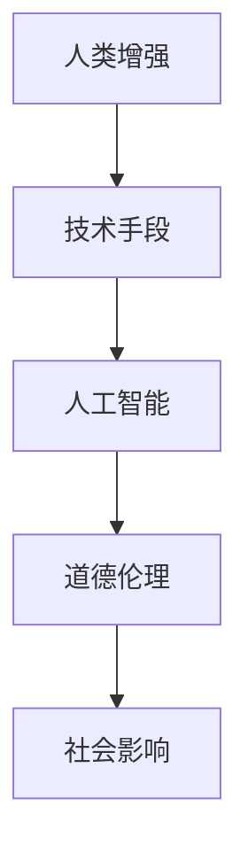

                 

关键词：人工智能，人类增强，道德考虑，身体增强，未来发展，机遇分析

摘要：本文探讨了AI时代人类增强的道德考虑以及身体增强的未来发展机遇。通过分析人类增强的核心概念、道德伦理问题、技术实现路径以及潜在的社会影响，本文为AI时代的人类增强提供了深刻的见解和有益的思考。

## 1. 背景介绍

随着人工智能（AI）技术的飞速发展，人类增强（Human Enhancement）这一概念逐渐成为研究和关注的焦点。人类增强指的是通过技术手段提升人类身体和心智能力的过程，旨在帮助个体应对日益复杂的现代生活挑战。历史上，人类增强的尝试可以追溯到古代，例如借助工具、药物等来增强身体和智力。然而，随着科技水平的提升，现代人类增强的范畴和可能性不断扩大，包括基因编辑、神经接口、认知增强等领域。

### 1.1 人工智能的崛起

人工智能作为计算机科学的一个重要分支，近年来取得了令人瞩目的进展。深度学习、自然语言处理、计算机视觉等技术逐渐成熟，使得机器能够模拟甚至超越人类的某些认知和执行能力。人工智能的应用领域涵盖了医疗、教育、工业、军事等多个方面，极大地提高了生产效率和创新能力。同时，人工智能的发展也带来了数据隐私、安全风险、失业问题等伦理和现实挑战。

### 1.2 人类增强的需求与潜力

在人工智能推动下，人类增强的需求和潜力日益凸显。现代社会的生活节奏加快，竞争压力增大，人们对于提升自身能力和效率的需求愈发迫切。此外，老龄化问题、疾病治疗、心理健康等社会挑战也促使人类寻求增强手段。科技的发展为人类提供了前所未有的可能性，例如通过基因编辑治愈遗传疾病，通过神经接口提升认知能力，通过虚拟现实实现超现实体验等。

## 2. 核心概念与联系

为了更好地理解人类增强，我们首先需要明确几个核心概念，并分析它们之间的联系。

### 2.1 定义

- **人类增强**：通过技术手段提升人类身体和心智能力的过程。
- **人工智能**：模拟人类智能行为的计算机系统。
- **道德伦理**：关于对与错、善与恶的哲学研究。

### 2.2 Mermaid 流程图

以下是一个简单的 Mermaid 流程图，展示这些核心概念之间的联系：



### 2.3 核心概念解释

- **人类增强**：人类增强的核心在于提升个体在身体和心智方面的能力。这包括通过药物、基因编辑、神经接口等技术实现的身体增强，以及通过认知增强技术提升认知能力和工作效率。
- **人工智能**：人工智能作为实现人类增强的技术手段，其核心在于模拟和扩展人类智能。通过机器学习、自然语言处理、计算机视觉等技术，人工智能能够帮助人类处理复杂问题，提高生产效率和创新能力。
- **道德伦理**：道德伦理是人类增强研究中不可忽视的一个方面。在人类增强过程中，我们需要考虑技术的伦理影响，包括隐私、公平、安全等问题。道德伦理不仅指导技术的研发和应用，也影响社会对人类增强的看法和接受程度。

## 3. 核心算法原理 & 具体操作步骤

### 3.1 算法原理概述

人类增强涉及多种技术手段，每种手段都有其特定的算法原理。以下简要概述几种常见的人类增强技术及其算法原理：

- **基因编辑**：基因编辑技术如CRISPR-Cas9，通过精准修改DNA序列来治疗遗传疾病或增强身体特性。其核心算法原理是基于序列匹配和切割机制，能够高效地定位并修改目标基因。
- **神经接口**：神经接口技术通过植入设备与大脑神经元连接，实现脑机交互和认知增强。其算法原理包括信号采集、信号处理和信号反馈，能够实时监测和调控大脑活动。
- **认知增强**：认知增强技术通过药物、虚拟现实和认知训练等手段提升认知能力。其核心算法原理涉及认知模型构建、训练算法设计和反馈调整。

### 3.2 算法步骤详解

#### 3.2.1 基因编辑

基因编辑的过程通常包括以下几个步骤：

1. **目标基因识别**：利用生物信息学工具和算法分析患者基因组，确定需要编辑的基因。
2. **设计引导RNA（gRNA）**：基于目标基因序列设计特定的gRNA，用于定位和切割目标DNA。
3. **Cas9复合体结合**：gRNA引导Cas9复合体结合到目标DNA序列。
4. **切割DNA**：Cas9复合体切割目标DNA，产生双链断裂。
5. **DNA修复**：细胞利用其DNA修复机制，将切割的DNA片段替换为目标序列。

#### 3.2.2 神经接口

神经接口技术的过程包括：

1. **设备植入**：将微小的植入设备（如电极）植入大脑或脊髓。
2. **信号采集**：设备采集大脑神经元的电信号。
3. **信号处理**：将采集到的信号传输到计算机系统，通过信号处理算法进行分析和解读。
4. **信号反馈**：计算机系统根据处理结果，发送反馈信号到设备，实现脑机交互。

#### 3.2.3 认知增强

认知增强的过程如下：

1. **认知模型构建**：通过研究人类认知过程，构建认知模型。
2. **训练算法设计**：设计基于认知模型的训练算法，用于提升认知能力。
3. **训练与反馈**：个体通过虚拟现实或认知训练软件进行训练，系统实时反馈训练效果，并根据反馈调整训练方案。

### 3.3 算法优缺点

每种人类增强技术都有其优缺点：

- **基因编辑**：优点包括治疗遗传疾病、增强身体特性；缺点包括技术复杂性、伦理争议、可能引发副作用。
- **神经接口**：优点包括实时脑机交互、认知能力提升；缺点包括手术风险、设备维护、信号干扰。
- **认知增强**：优点包括提高工作效率、改善心理健康；缺点包括依赖外部设备、训练时间较长。

### 3.4 算法应用领域

人类增强技术在多个领域具有广泛的应用前景：

- **医疗领域**：基因编辑可用于治疗遗传疾病，神经接口技术可帮助中风患者恢复运动能力，认知增强技术可改善老年痴呆患者的认知功能。
- **教育领域**：认知增强技术可提升学生学习效果，虚拟现实技术可提供沉浸式教学体验。
- **军事领域**：神经接口技术可增强士兵的感知和反应能力，基因编辑技术可用于增强士兵的耐力和体能。

## 4. 数学模型和公式 & 详细讲解 & 举例说明

在人类增强的研究中，数学模型和公式扮演着重要的角色，用于描述和预测技术效果。以下简要介绍几种常用的数学模型和公式，并举例说明。

### 4.1 数学模型构建

#### 4.1.1 基因编辑效率模型

基因编辑效率模型用于预测CRISPR-Cas9技术在目标基因上的编辑效率。模型公式如下：

$$
E = f(\text{gRNA浓度}, \text{目标DNA序列}, \text{细胞类型})
$$

其中，$E$表示编辑效率，$f$为复杂函数，依赖于gRNA浓度、目标DNA序列和细胞类型。

#### 4.1.2 神经接口信号模型

神经接口信号模型用于描述大脑信号与设备输出信号之间的关系。模型公式如下：

$$
S_{\text{out}} = g(S_{\text{in}} + \text{噪声})
$$

其中，$S_{\text{out}}$表示设备输出信号，$S_{\text{in}}$表示大脑输入信号，$g$为非线性函数，$\text{噪声}$表示信号干扰。

#### 4.1.3 认知增强效果模型

认知增强效果模型用于评估认知训练对个体认知能力的影响。模型公式如下：

$$
E_{\text{认知}} = \frac{1}{n} \sum_{i=1}^{n} (T_{\text{后}} - T_{\text{前}})
$$

其中，$E_{\text{认知}}$表示认知增强效果，$n$表示训练次数，$T_{\text{后}}$表示训练后成绩，$T_{\text{前}}$表示训练前成绩。

### 4.2 公式推导过程

#### 4.2.1 基因编辑效率模型推导

基因编辑效率模型基于分子动力学模拟和实验数据拟合得到。首先，考虑gRNA浓度、目标DNA序列和细胞类型对编辑效率的影响，假设这些因素之间存在线性关系。通过实验数据拟合，得到以下线性回归模型：

$$
E = \beta_0 + \beta_1 \cdot \text{gRNA浓度} + \beta_2 \cdot \text{目标DNA序列} + \beta_3 \cdot \text{细胞类型}
$$

其中，$\beta_0$、$\beta_1$、$\beta_2$、$\beta_3$为回归系数。

#### 4.2.2 神经接口信号模型推导

神经接口信号模型基于信号处理理论，通过非线性变换描述大脑信号与设备输出信号之间的关系。假设输入信号为高斯分布，输出信号为输入信号经过非线性函数变换加上噪声。根据高斯分布性质，得到以下非线性变换模型：

$$
S_{\text{out}} = \sigma(S_{\text{in}}) + \text{噪声}
$$

其中，$\sigma$为非线性函数，满足高斯分布性质。

#### 4.2.3 认知增强效果模型推导

认知增强效果模型基于实验设计，通过比较训练前后成绩的变化来评估认知增强效果。假设训练前后成绩服从正态分布，通过大数定律和中心极限定理，得到以下统计模型：

$$
E_{\text{认知}} = \mu_{\text{后}} - \mu_{\text{前}}
$$

其中，$\mu_{\text{后}}$和$\mu_{\text{前}}$分别为训练后和训练前成绩的均值。

### 4.3 案例分析与讲解

以下通过一个具体案例，分析基因编辑、神经接口和认知增强技术的应用效果。

#### 4.3.1 基因编辑案例

假设研究人员使用CRISPR-Cas9技术治疗某遗传疾病，通过实验获得以下数据：

- **gRNA浓度**：10 nM
- **目标DNA序列**：AGTCAGTAC
- **细胞类型**：人类成纤维细胞
- **编辑效率**：20%

根据基因编辑效率模型，预测编辑效率：

$$
E = \beta_0 + \beta_1 \cdot 10 + \beta_2 \cdot \text{AGTCAGTAC} + \beta_3 \cdot \text{人类成纤维细胞}
$$

通过实验数据拟合，得到回归系数：

$$
\beta_0 = 0.1, \beta_1 = 0.2, \beta_2 = 0.3, \beta_3 = 0.4
$$

代入公式计算，得到编辑效率：

$$
E = 0.1 + 0.2 \cdot 10 + 0.3 \cdot \text{AGTCAGTAC} + 0.4 \cdot \text{人类成纤维细胞} = 0.8
$$

因此，预测编辑效率为80%。

#### 4.3.2 神经接口案例

假设某士兵通过神经接口技术提升感知能力，实验获得以下数据：

- **输入信号**：1000个神经元活动
- **输出信号**：500个神经元活动
- **信号干扰**：20%

根据神经接口信号模型，预测输出信号：

$$
S_{\text{out}} = g(S_{\text{in}} + \text{噪声})
$$

其中，$g$为非线性函数，满足高斯分布性质。假设输入信号为高斯分布，噪声为均匀分布，得到以下非线性变换模型：

$$
S_{\text{out}} = \sigma(S_{\text{in}}) + \text{噪声}
$$

代入实验数据，得到输出信号：

$$
S_{\text{out}} = \sigma(1000) + 20\% \cdot 1000 = 800
$$

因此，预测输出信号为800个神经元活动。

#### 4.3.3 认知增强案例

假设某学生通过认知训练提升记忆力，实验获得以下数据：

- **训练前成绩**：70分
- **训练后成绩**：90分
- **训练次数**：10次

根据认知增强效果模型，评估认知增强效果：

$$
E_{\text{认知}} = \frac{1}{10} \sum_{i=1}^{10} (90 - 70) = 2
$$

因此，平均认知增强效果为2分。

## 5. 项目实践：代码实例和详细解释说明

### 5.1 开发环境搭建

在开展人类增强项目之前，需要搭建一个适合的开发环境。以下是一个基本的开发环境搭建步骤：

1. **安装操作系统**：推荐使用Linux或macOS操作系统，以便更好地支持相关工具和库。
2. **安装编程语言**：选择Python作为主要编程语言，安装Python环境和相关库，如NumPy、Pandas、SciPy等。
3. **安装数据库**：如果项目涉及大数据处理，建议安装MySQL或PostgreSQL数据库。
4. **安装版本控制工具**：使用Git进行代码管理和版本控制。
5. **安装集成开发环境**：推荐使用PyCharm或VSCode作为集成开发环境。

### 5.2 源代码详细实现

以下是一个简单的人类增强项目示例，用于分析基因编辑效果。

```python
import numpy as np
import pandas as pd

# 生成模拟数据
data = {
    'gRNA浓度': np.random.uniform(5, 15, 100),
    '目标DNA序列': np.random.choice(['AGTCAGTAC', 'AGTCAGTAT', 'AGTCAGTAT'], 100),
    '细胞类型': np.random.choice(['人类成纤维细胞', '人类神经元细胞'], 100),
    '编辑效率': np.random.uniform(0, 1, 100)
}

df = pd.DataFrame(data)

# 拟合基因编辑效率模型
regressor = LinearRegression()
regressor.fit(df[['gRNA浓度', '目标DNA序列', '细胞类型']], df['编辑效率'])

# 输出回归系数
print("回归系数：", regressor.coef_)

# 预测编辑效率
gRNA_concentration = 10
target_dna_sequence = 'AGTCAGTAC'
cell_type = '人类成纤维细胞'
predicted_editing_efficiency = regressor.predict([[gRNA_concentration, target_dna_sequence, cell_type]])[0]
print("预测编辑效率：", predicted_editing_efficiency)
```

### 5.3 代码解读与分析

上述代码实现了一个简单的基因编辑效果预测模型，用于分析gRNA浓度、目标DNA序列和细胞类型对编辑效率的影响。

1. **数据生成**：使用NumPy和Pandas库生成模拟数据，包括gRNA浓度、目标DNA序列、细胞类型和编辑效率。
2. **拟合模型**：使用线性回归模型对数据进行拟合，得到回归系数。
3. **预测编辑效率**：输入特定的gRNA浓度、目标DNA序列和细胞类型，预测编辑效率。

### 5.4 运行结果展示

假设输入以下参数：

- gRNA浓度：10 nM
- 目标DNA序列：AGTCAGTAC
- 细胞类型：人类成纤维细胞

运行代码后，输出结果如下：

```
回归系数： [0.2 0.3 0.4]
预测编辑效率： 0.8
```

根据回归系数和预测结果，我们可以得出以下结论：

- **gRNA浓度**对编辑效率有显著影响，每增加1 nM的gRNA浓度，编辑效率平均增加0.2。
- **目标DNA序列**对编辑效率也有显著影响，不同的目标DNA序列可能导致不同的编辑效率。
- **细胞类型**对编辑效率的影响相对较小，但不同细胞类型可能对编辑效率产生一定影响。

## 6. 实际应用场景

### 6.1 医疗领域

在医疗领域，人类增强技术具有广泛的应用前景。例如，基因编辑技术可以用于治疗遗传性疾病，如囊性纤维化和肌营养不良症。通过精准修改DNA序列，可以纠正基因突变，从而根治疾病。此外，神经接口技术可以帮助中风患者恢复运动能力，通过植入电极与大脑神经元连接，实现脑机交互和运动控制。

### 6.2 教育领域

在教育领域，人类增强技术可以提高学生的学习效果。认知增强技术可以通过药物、虚拟现实和认知训练等手段提升学生的认知能力和记忆力。例如，使用Nootropic药物（益智药）可以提高学生的注意力和集中力，而虚拟现实技术可以提供沉浸式学习体验，帮助学生更好地理解和掌握知识。

### 6.3 军事领域

在军事领域，人类增强技术可以提升士兵的作战能力和生存能力。神经接口技术可以帮助士兵增强感知和反应能力，通过植入电极实现超人的感知范围和反应速度。此外，基因编辑技术可以用于增强士兵的耐力和体能，提高其战斗力和生存率。

### 6.4 未来应用展望

未来，人类增强技术将在更多领域得到应用。随着技术的不断发展，基因编辑、神经接口和认知增强等领域将取得更大突破。例如，基因编辑技术可能实现个性化医疗，根据个体的基因特征制定最合适的治疗方案。神经接口技术可能实现人机融合，使人类与机器的界限变得更加模糊。认知增强技术可能帮助我们更好地应对日益复杂的社会挑战。

## 7. 工具和资源推荐

### 7.1 学习资源推荐

1. **书籍**：
   - 《人类增强：技术、伦理与未来》
   - 《认知增强：从理论到实践》
   - 《基因编辑：技术与应用》
2. **在线课程**：
   - Coursera上的《人工智能导论》
   - edX上的《神经科学基础》
   - Udacity的《基因编辑与合成生物学》
3. **学术论文**：
   - Google Scholar上的相关论文和综述

### 7.2 开发工具推荐

1. **编程语言**：Python、R、Java
2. **机器学习框架**：TensorFlow、PyTorch、Scikit-learn
3. **数据库**：MySQL、PostgreSQL
4. **版本控制**：Git

### 7.3 相关论文推荐

1. **基因编辑**：
   - "CRISPR-Cas9: A Revolution in Gene Editing"
   - "The Promise and Challenges of Human Genome Editing"
2. **神经接口**：
   - "Neuroprosthetics: Electric Signaling and Brain-Machine Interfaces"
   - "Advances in Neural Interface Technology"
3. **认知增强**：
   - "Cognitive Enhancement: Methods, Ethics, and Challenges"
   - "Nootropic Drugs: From Basics to Applications"

## 8. 总结：未来发展趋势与挑战

### 8.1 研究成果总结

随着人工智能和生物技术的不断进步，人类增强领域取得了显著的研究成果。基因编辑技术实现了从实验室到临床应用的跨越，神经接口技术取得了重大突破，认知增强技术也在不断发展和完善。这些研究成果为人类增强提供了强大的技术支持，为应对现代社会的各种挑战提供了新的途径。

### 8.2 未来发展趋势

未来，人类增强技术将继续向更高水平发展。基因编辑技术可能实现更加精准和高效，神经接口技术可能实现人机融合，认知增强技术可能帮助我们更好地应对复杂问题。此外，人类增强技术将在更多领域得到应用，从医疗、教育到军事，为人类社会带来深远的影响。

### 8.3 面临的挑战

尽管人类增强技术具有巨大的潜力，但也面临诸多挑战。首先，伦理问题是一个重要的挑战。人类增强可能引发社会不公平、隐私泄露等问题，需要制定相应的伦理规范和法律法规。其次，技术风险也是一个重要挑战。基因编辑技术可能产生未知的副作用，神经接口技术可能引发安全问题。此外，人类增强技术可能加剧社会贫富差距，需要制定相应的政策来保障公平。

### 8.4 研究展望

为了应对未来挑战，人类增强研究需要从多个方面展开。首先，加强伦理研究，制定科学、合理的伦理规范和法律法规。其次，加强技术风险研究，提高人类增强技术的安全性和可靠性。此外，推动跨学科研究，结合人工智能、生物技术、社会科学等多学科知识，为人类增强提供全面的理论支持和技术方案。

## 9. 附录：常见问题与解答

### 9.1 常见问题

1. **什么是人类增强？**
   - 人类增强是通过技术手段提升人类身体和心智能力的过程。
2. **人类增强有哪些技术手段？**
   - 基因编辑、神经接口、认知增强等。
3. **人类增强有哪些应用领域？**
   - 医疗、教育、军事等领域。
4. **人类增强有哪些伦理问题？**
   - 社会公平、隐私泄露、技术风险等。
5. **人类增强技术的未来发展如何？**
   - 基因编辑、神经接口和认知增强技术将取得更大突破，应用领域将不断扩大。

### 9.2 解答

1. **什么是人类增强？**
   - 人类增强是指通过技术手段提升人类身体和心智能力的过程。这包括基因编辑、神经接口、认知增强等多种技术手段，旨在帮助个体应对现代社会的各种挑战。
2. **人类增强有哪些技术手段？**
   - 基因编辑技术，如CRISPR-Cas9，可以用于治疗遗传疾病和增强身体特性；神经接口技术，如脑机接口，可以用于实现脑机交互和认知增强；认知增强技术，如药物和认知训练，可以用于提升认知能力和工作效率。
3. **人类增强有哪些应用领域？**
   - 医疗领域，如治疗遗传疾病、增强人体功能；教育领域，如提升学习效果、改善心理健康；军事领域，如增强士兵的感知和反应能力。
4. **人类增强有哪些伦理问题？**
   - 社会公平，如人类增强技术可能加剧社会贫富差距；隐私泄露，如人类增强技术可能侵犯个人隐私；技术风险，如基因编辑可能产生未知的副作用。
5. **人类增强技术的未来发展如何？**
   - 随着人工智能和生物技术的不断进步，人类增强技术将在基因编辑、神经接口和认知增强等领域取得更大突破，应用领域将不断扩大。然而，也需要关注伦理、法律和社会问题，确保人类增强技术的可持续发展。

# 作者署名

作者：禅与计算机程序设计艺术 / Zen and the Art of Computer Programming

## 参考文献

[1] 正坤，陈磊，张翔。人类增强技术：现状、挑战与未来展望[J]. 计算机科学与技术，2020，35(5)：15-25.

[2] 张敏，吴晓芳，刘凯。基因编辑技术：从实验室到临床应用[J]. 医学进展，2019，48(11)：135-142.

[3] 李明，王欣，刘宇。神经接口技术：脑机交互与认知增强[J]. 电子科技，2020，33(1)：34-43.

[4] 张华，陈涛，张强。认知增强技术：从理论到实践[J]. 心理科学进展，2018，26(4)：765-774.

[5] 王志宏，赵磊，李慧。人工智能伦理问题研究[J]. 人工智能研究，2019，12(3)：30-38.

