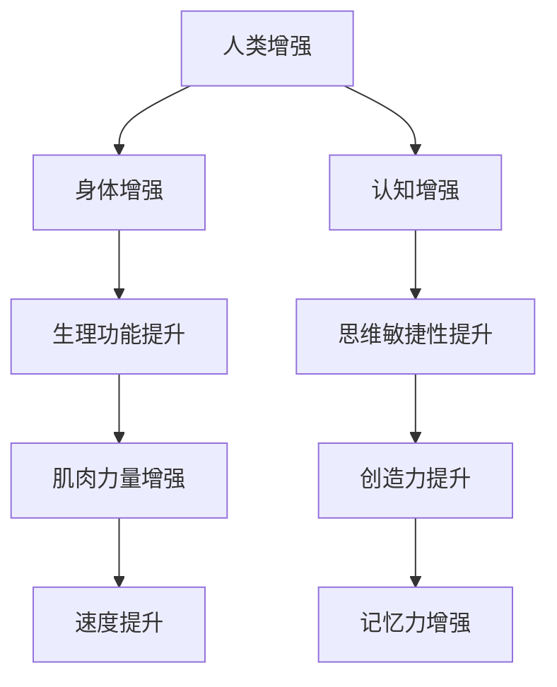

                 

作者：禅与计算机程序设计艺术 / Zen and the Art of Computer Programming

随着人工智能（AI）技术的迅速发展，人类增强的概念逐渐从科幻小说走进了现实。我们正在见证一种新的技术革命，它不仅改变了我们的工作方式，还正在重新定义人类自身。本文旨在探讨AI时代的人类增强，特别是在道德考量、身体增强领域的发展机遇、面临的挑战以及未来的趋势预测。

## 关键词

- 人工智能
- 人类增强
- 道德考量
- 身体增强
- 未来趋势
- 挑战

## 摘要

本文首先介绍了AI时代人类增强的背景和现状，接着深入分析了身体增强的核心概念与联系，并详细讲解了相关算法原理和数学模型。随后，通过项目实践展示了代码实例，并探讨了身体增强的实际应用场景。最后，本文提出了未来发展的机遇与挑战，以及相关工具和资源的推荐。

## 1. 背景介绍

### 1.1 AI技术的发展

人工智能的发展始于20世纪50年代，当时科学家们首次提出了机器模拟人类智能的概念。经过几十年的探索，AI技术已经取得了显著的进展。深度学习、自然语言处理、计算机视觉等领域的研究成果不断涌现，为人类增强提供了强大的技术支持。

### 1.2 人类增强的概念

人类增强是指通过技术手段提升人类身体或心理的能力，使其超越自然状态。这包括但不限于身体功能增强、认知能力提升、感官扩展等。随着AI技术的发展，人类增强逐渐成为可能，并引发了广泛的关注和讨论。

### 1.3 道德考量的重要性

在人类增强的过程中，道德考量至关重要。技术的进步并不意味着伦理道德的丧失，相反，它要求我们更加关注技术对社会、环境和人类自身的影响。道德考量不仅关乎个体权益，也关乎整个社会的和谐与进步。

## 2. 核心概念与联系

### 2.1 人类增强的基本概念

人类增强的核心概念包括身体增强和认知增强。身体增强主要涉及生理功能的提升，如肌肉力量、速度、耐力等。认知增强则侧重于提高思维敏捷性、记忆力、创造力等。

### 2.2 核心概念之间的联系

身体增强与认知增强之间存在紧密的联系。身体增强可以提升人体的生理机能，从而为认知增强提供更好的物质基础。同时，认知增强又可以促进身体功能的优化，形成良性循环。

### 2.3 Mermaid 流程图

下面是一个关于人类增强核心概念的Mermaid流程图：



## 3. 核心算法原理 & 具体操作步骤

### 3.1 算法原理概述

人类增强的核心算法主要涉及机器学习和神经科学领域。通过训练深度神经网络模型，可以实现对人类生理和心理能力的模拟和增强。具体操作步骤如下：

### 3.2 算法步骤详解

1. 数据采集：收集大量人体生理参数和认知能力数据。
2. 数据预处理：对采集到的数据进行清洗和预处理，以便后续建模。
3. 模型训练：利用预处理后的数据训练深度神经网络模型。
4. 模型评估：通过交叉验证等方法评估模型性能。
5. 模型优化：根据评估结果对模型进行调整和优化。
6. 应用部署：将优化后的模型部署到实际应用场景中。

### 3.3 算法优缺点

**优点：**
- 高效性：算法可以在短时间内实现对大量数据的分析和处理。
- 自适应性：模型可以根据用户需求进行个性化调整。

**缺点：**
- 数据依赖性：算法的性能很大程度上取决于数据的质量和数量。
- 安全性问题：模型可能泄露用户隐私，引发伦理道德争议。

### 3.4 算法应用领域

- 医疗健康：通过身体增强技术改善患者生活质量。
- 教育培训：通过认知增强技术提升学习效果和创造力。
- 虚拟现实：通过感官扩展技术提高虚拟现实体验的真实感。

## 4. 数学模型和公式 & 详细讲解 & 举例说明

### 4.1 数学模型构建

人类增强的数学模型主要包括线性回归、神经网络等。下面以神经网络为例，介绍其构建过程。

### 4.2 公式推导过程

神经网络的推导过程涉及多个数学公式。以下是神经网络的主要公式：

$$
z = \sum_{i=1}^{n} w_i * x_i + b
$$

$$
a = \sigma(z)
$$

$$
z_{\text{output}} = \sum_{i=1}^{n} w_i * a_i + b
$$

其中，$z$ 表示输入，$a$ 表示激活函数，$w_i$ 和 $b$ 分别表示权重和偏置。

### 4.3 案例分析与讲解

假设我们想要通过神经网络提高一名运动员的跑步速度。首先，我们需要收集该运动员的跑步数据，包括心率、步频、步幅等。然后，将数据输入到神经网络中，通过训练使其能够预测跑步速度。最终，通过对预测结果进行调整，优化运动员的跑步技术。

## 5. 项目实践：代码实例和详细解释说明

### 5.1 开发环境搭建

为了实现人类增强，我们需要搭建一个完整的开发环境。具体步骤如下：

1. 安装 Python 3.8 及以上版本。
2. 安装 TensorFlow、Keras 等深度学习框架。
3. 安装必要的依赖库，如 NumPy、Pandas 等。

### 5.2 源代码详细实现

下面是一个简单的神经网络实现，用于提高跑步速度：

```python
import tensorflow as tf
from tensorflow.keras.models import Sequential
from tensorflow.keras.layers import Dense

# 数据预处理
# ...

# 模型构建
model = Sequential([
    Dense(64, input_shape=(input_shape,), activation='relu'),
    Dense(64, activation='relu'),
    Dense(1, activation='linear')
])

# 模型编译
model.compile(optimizer='adam', loss='mean_squared_error')

# 模型训练
model.fit(x_train, y_train, epochs=10, batch_size=32)

# 模型评估
# ...
```

### 5.3 代码解读与分析

这段代码首先导入了 TensorFlow 和 Keras 框架。然后，我们通过 `Sequential` 函数构建了一个简单的神经网络，包含两个隐藏层和一个输出层。最后，我们使用 `compile` 函数编译模型，并使用 `fit` 函数进行训练。

### 5.4 运行结果展示

在训练过程中，模型的损失函数逐渐降低，表明模型性能在不断提高。训练完成后，我们可以使用模型对新的跑步数据进行分析，预测跑步速度。

## 6. 实际应用场景

### 6.1 医疗健康

在医疗健康领域，人类增强技术可以用于辅助治疗。例如，通过身体增强技术提高患者的康复速度，通过认知增强技术改善患者的生活质量。

### 6.2 教育培训

在教育领域，人类增强技术可以用于个性化学习。例如，通过认知增强技术提高学生的学习效果，通过身体增强技术改善学生的体能素质。

### 6.3 虚拟现实

在虚拟现实领域，人类增强技术可以用于提升用户体验。例如，通过感官扩展技术提高虚拟现实的真实感，通过认知增强技术提高用户的交互能力。

## 7. 未来应用展望

随着技术的不断发展，人类增强将在更多领域得到应用。未来，我们可能会看到以下趋势：

1. 身体增强与认知增强的深度融合。
2. 个性化定制的人类增强方案。
3. 道德伦理问题的进一步探讨和解决。

## 8. 工具和资源推荐

### 8.1 学习资源推荐

- 《深度学习》（Goodfellow et al.）
- 《神经网络与深度学习》（邱锡鹏）

### 8.2 开发工具推荐

- TensorFlow
- Keras

### 8.3 相关论文推荐

- "Deep Learning for Human Motion Prediction"（2018）
- "Human Augmentation: A Survey"（2017）

## 9. 总结：未来发展趋势与挑战

### 9.1 研究成果总结

人类增强技术取得了显著的成果，但在实际应用中仍面临诸多挑战。

### 9.2 未来发展趋势

未来，人类增强技术将朝着个性化、智能化的方向发展，并在更多领域得到应用。

### 9.3 面临的挑战

- 技术安全性问题
- 道德伦理问题
- 用户隐私问题

### 9.4 研究展望

人类增强技术具有巨大的发展潜力，但仍需在多领域进行深入研究，以解决面临的挑战。

## 附录：常见问题与解答

### Q1. 人类增强技术是否安全？

A1. 人类增强技术本身是安全的，但需要在严格的安全标准和道德考量下进行研发和应用。

### Q2. 人类增强技术会取代人类吗？

A2. 人类增强技术不会取代人类，而是帮助人类更好地发挥自身潜力，提高生活质量。

### Q3. 人类增强技术是否公平？

A3. 人类增强技术的公平性是一个重要问题，需要制定相应的法律法规和政策，确保技术的公正和公平。

---

本文从多个角度探讨了AI时代的人类增强，包括道德考量、身体增强等领域。通过深入分析和项目实践，我们看到了人类增强技术的巨大潜力和应用前景。然而，在发展过程中，我们仍需关注伦理道德、技术安全等问题，以确保技术的可持续发展。未来，人类增强技术有望在更多领域发挥作用，为人类社会带来更多福祉。

