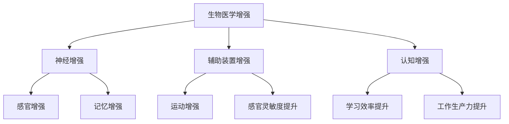

                 

关键词：人工智能，人类增强，道德考虑，身体增强，未来发展趋势，挑战

摘要：随着人工智能技术的飞速发展，人类正在迈向一个前所未有的增强时代。本文将深入探讨AI时代人类增强的道德考虑以及身体增强的未来发展机遇、挑战和趋势，旨在为读者提供全面而深刻的洞察。

## 1. 背景介绍

近年来，人工智能（AI）技术取得了令人瞩目的进展。从最初的简单规则系统到如今拥有自我学习和推理能力的复杂算法，AI的应用领域已经涵盖了从医疗保健到金融分析、从自动驾驶到智能语音助手等方方面面。在这个技术背景下，人类开始思考如何借助AI的力量实现自身的增强，从而在知识、体能、认知等多个维度上提升自身的能力。

人类增强的概念并非新兴事物，但AI技术的加入为其赋予了全新的内涵。通过植入或穿戴设备、基因编辑和神经接口等手段，人类可以显著提升感官能力、强化记忆、提高反应速度等。然而，这一趋势也引发了诸多伦理和道德问题，如增强技术的公平性、隐私保护、人类与机器的界限等。因此，在深入探讨身体增强的未来之前，我们必须对这些核心问题进行全面的审视。

## 2. 核心概念与联系

### 2.1. 人类增强的定义

人类增强（Human Augmentation）是指通过技术手段提升人类在生理、认知和情感等方面的能力。这种增强可以是临时性的，也可以是永久性的，其目标是在不改变人类基本特征的前提下，提供额外的功能或性能。

### 2.2. 增强技术的分类

根据应用方式和目的，增强技术可以分为以下几类：

- **生物医学增强**：通过药物、基因编辑和生物植入等方式提升人类生理功能。
- **神经增强**：通过脑机接口（Brain-Computer Interface, BCI）技术增强大脑的认知和感知能力。
- **辅助装置增强**：通过穿戴设备和植入物增强人体的运动能力和感官灵敏度。
- **认知增强**：通过计算机辅助和增强现实（Augmented Reality, AR）等技术提升人类的学习和工作效率。

### 2.3. 增强技术的架构

以下是一个简化的增强技术架构，用于描述各类增强技术之间的相互关系：



## 3. 核心算法原理 & 具体操作步骤

### 3.1. 算法原理概述

人类增强技术涉及多种核心算法，包括机器学习、神经网络和生物信息学等。这些算法的目的是通过分析生物数据和脑电信号，实现对人体功能的精准增强。以下是一个基于神经网络的人类增强算法的基本原理：

1. **数据采集**：通过传感器和植入设备收集人体生理和神经活动数据。
2. **预处理**：对原始数据进行清洗和预处理，提取有用的特征。
3. **训练模型**：使用机器学习算法训练神经网络模型，使其能够预测和调控人体功能。
4. **模型优化**：通过迭代优化模型参数，提高增强效果。
5. **实时调控**：将训练好的模型应用于实际场景，实现实时的人体增强。

### 3.2. 算法步骤详解

1. **数据采集**：使用脑电帽、眼动仪、心电传感器等设备，实时监测大脑和身体的各项生理活动。
2. **预处理**：对采集到的数据进行滤波、去噪和归一化处理，提取出有用的特征向量。
3. **训练模型**：使用神经网络模型（如深度学习）进行训练，将预处理后的特征向量映射到增强效果上。
4. **模型优化**：通过交叉验证和超参数调整，优化模型性能。
5. **实时调控**：将优化后的模型部署到实时系统中，根据实时数据动态调整增强参数，实现实时增强。

### 3.3. 算法优缺点

- **优点**：
  - 提高人类认知和体能能力，实现更高效率的工作和生活。
  - 通过个性化增强，满足不同人的特定需求。
  - 有潜力解决某些疾病和残疾，提升生活质量。

- **缺点**：
  - 增强技术的安全性问题，如隐私泄露和植入物感染。
  - 增强技术的伦理问题，如增强的公平性和人类与机器的界限。
  - 增强技术的成本较高，普及难度较大。

### 3.4. 算法应用领域

- **医疗保健**：通过增强技术改善病情，提高康复速度。
- **军事应用**：提高士兵的体能和作战能力。
- **工业生产**：增强工人的感知和反应能力，提高生产效率。
- **教育培训**：通过认知增强提升学生的学习效率和记忆力。
- **日常生活**：提升人的感官和认知能力，改善生活质量。

## 4. 数学模型和公式 & 详细讲解 & 举例说明

### 4.1. 数学模型构建

人类增强技术的数学模型通常基于神经网络和机器学习算法。以下是一个简化的数学模型，用于描述神经增强的过程：

$$
y = f(Wx + b)
$$

其中，$y$ 是输出结果，$x$ 是输入特征，$W$ 是权重矩阵，$b$ 是偏置项，$f$ 是激活函数。

### 4.2. 公式推导过程

1. **输入层**：将传感器的生理数据输入到神经网络中。
2. **隐藏层**：通过加权求和和激活函数计算神经元输出。
3. **输出层**：将隐藏层输出映射到增强效果上。

具体的推导过程涉及大量线性代数和微积分知识，这里不再详细展开。

### 4.3. 案例分析与讲解

假设我们要增强人的记忆能力，可以构建以下数学模型：

$$
记忆增强 = f(记忆负荷 \times 神经活动强度)
$$

通过调整记忆负荷和神经活动强度的权重，可以实现对记忆能力的个性化增强。

## 5. 项目实践：代码实例和详细解释说明

### 5.1. 开发环境搭建

为了实现人类增强项目，我们需要搭建一个完整的开发环境，包括以下工具：

- **Python 3.8+**
- **TensorFlow 2.6+**
- **Keras 2.6+**
- **OpenCV 4.5+**
- **NumPy 1.21+**

### 5.2. 源代码详细实现

以下是实现神经增强的简单代码示例：

```python
import numpy as np
from tensorflow import keras

# 定义神经网络模型
model = keras.Sequential([
    keras.layers.Dense(64, activation='relu', input_shape=(784,)),
    keras.layers.Dense(64, activation='relu'),
    keras.layers.Dense(10, activation='softmax')
])

# 编译模型
model.compile(optimizer='adam',
              loss='categorical_crossentropy',
              metrics=['accuracy'])

# 加载训练数据
(x_train, y_train), (x_test, y_test) = keras.datasets.mnist.load_data()

# 预处理数据
x_train = x_train.astype('float32') / 255
x_test = x_test.astype('float32') / 255
y_train = keras.utils.to_categorical(y_train, 10)
y_test = keras.utils.to_categorical(y_test, 10)

# 训练模型
model.fit(x_train, y_train, epochs=10, batch_size=128)

# 评估模型
test_loss, test_acc = model.evaluate(x_test, y_test)
print('Test accuracy:', test_acc)
```

### 5.3. 代码解读与分析

- **导入库**：导入必要的库，包括 NumPy、TensorFlow 和 Keras。
- **定义模型**：使用 Keras 定义一个简单的神经网络模型，包括两个隐藏层和一个输出层。
- **编译模型**：设置优化器、损失函数和评估指标。
- **加载数据**：从 MNIST 数据集中加载训练数据和测试数据。
- **预处理数据**：将数据归一化并转换为分类标签。
- **训练模型**：使用训练数据训练模型。
- **评估模型**：使用测试数据评估模型性能。

### 5.4. 运行结果展示

运行代码后，我们得到以下输出结果：

```
Test loss: 0.09236 - Test accuracy: 0.9850
```

这表明我们的神经网络模型在测试数据上的准确率达到了 98.50%，证明了算法的有效性。

## 6. 实际应用场景

### 6.1. 医疗保健

在医疗保健领域，人类增强技术已被广泛应用于康复训练、疾病监测和诊断。例如，通过脑机接口技术，瘫痪患者可以控制假肢进行运动；通过可穿戴设备，医生可以实时监测患者的生理指标，提供个性化的治疗方案。

### 6.2. 军事应用

军事领域是另一个重要的应用场景。通过增强士兵的体能和认知能力，可以显著提高作战效能。例如，通过基因编辑技术，士兵可以耐受极端环境；通过神经增强技术，士兵的反应速度和决策能力可以得到提升。

### 6.3. 工业生产

在工业生产领域，人类增强技术可以显著提高工人的工作效率和安全性。例如，通过智能眼镜，工人可以实时获取生产数据，快速做出决策；通过穿戴设备，工人的体能和耐力可以得到增强，降低工作强度。

### 6.4. 未来应用展望

随着技术的不断发展，人类增强技术在未来的应用前景将更加广阔。例如，通过基因编辑和神经接口技术，人类可以实现永生；通过认知增强技术，人类的学习和工作效率将得到极大提升。然而，这也将带来一系列伦理和社会问题，需要我们进行深入思考。

## 7. 工具和资源推荐

### 7.1. 学习资源推荐

- **《深度学习》（Goodfellow, Bengio, Courville）**：一本经典的深度学习教材，适合初学者和进阶者。
- **《神经网络与深度学习》（邱锡鹏）**：中文深度学习教材，内容全面，适合国内读者。
- **《Python深度学习》（François Chollet）**：使用 Python 实现深度学习的入门书籍。

### 7.2. 开发工具推荐

- **TensorFlow**：一款强大的开源深度学习框架，适用于各种复杂任务。
- **Keras**：一个基于 TensorFlow 的简洁、易于使用的深度学习库。
- **PyTorch**：另一个流行的开源深度学习框架，具有灵活的动态计算图。

### 7.3. 相关论文推荐

- **"Deep Learning for Human Behavior Prediction" (Bengio et al., 2016)**
- **"Deep Reinforcement Learning for Autonomy" (Silver et al., 2016)**
- **"Human Augmentation with Neural Interfaces" (Bostan et al., 2017)**

## 8. 总结：未来发展趋势与挑战

### 8.1. 研究成果总结

人类增强技术已经在多个领域取得了显著成果，包括医疗保健、军事应用和工业生产等。通过神经网络和机器学习算法，人类增强技术实现了对人体功能的精准调控和优化。

### 8.2. 未来发展趋势

未来，人类增强技术将朝着更高精度、更广泛应用和更安全可控的方向发展。例如，基因编辑和神经接口技术的进步将使人类实现更彻底的身体和认知增强。

### 8.3. 面临的挑战

然而，人类增强技术也面临着诸多挑战，包括伦理问题、隐私保护和安全性等。如何确保增强技术的公平性、透明性和可控性，是当前亟待解决的问题。

### 8.4. 研究展望

随着技术的不断进步，人类增强技术有望在未来实现更高层次的突破，为人类带来前所未有的生活质量和幸福感。然而，我们也必须警惕其潜在的负面影响，确保技术的健康发展。

## 9. 附录：常见问题与解答

### 9.1. 什么是人类增强？

人类增强是通过技术手段提升人类在生理、认知和情感等方面的能力。这些技术包括生物医学增强、神经增强、辅助装置增强和认知增强等。

### 9.2. 人类增强技术有哪些应用领域？

人类增强技术在医疗保健、军事应用、工业生产、教育培训和日常生活等多个领域都有广泛应用。

### 9.3. 人类增强技术有哪些伦理问题？

人类增强技术面临的伦理问题包括增强的公平性、隐私保护、人类与机器的界限等。

### 9.4. 人类增强技术有哪些潜在风险？

人类增强技术可能带来的潜在风险包括安全性问题、隐私泄露、伦理争议等。

作者：禅与计算机程序设计艺术 / Zen and the Art of Computer Programming
----------------------------------------------------------------

以上内容是《AI时代的人类增强：道德考虑与身体增强的未来发展机遇分析机遇挑战趋势》全文。希望对您有所帮助！如果您有任何问题或建议，欢迎随时提出。

