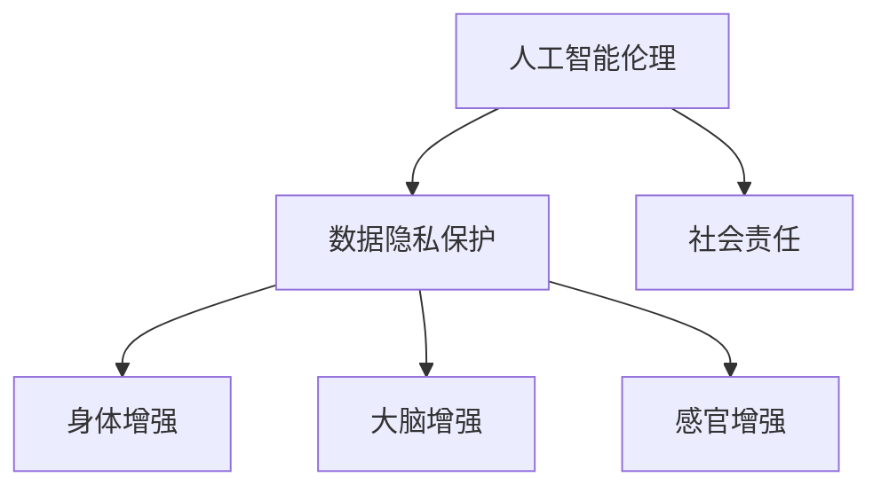

                 

关键词：人工智能、人类增强、伦理道德、身体增强、未来技术发展

> 摘要：随着人工智能技术的快速发展，人类增强已成为一个备受关注的话题。本文从道德和身体增强两个方面探讨了AI时代人类增强的机遇与挑战，分析了其在伦理、隐私、安全和未来应用等方面的影响，为未来的人类增强研究提供了有益的参考。

## 1. 背景介绍

自20世纪中叶以来，计算机科学和人工智能技术取得了长足的发展。从早期的计算机编程到如今的深度学习和神经网络，人工智能已经成为推动科技进步的重要力量。与此同时，人类对自身能力的追求也从未停止。随着基因编辑、神经接口和生物工程等技术的不断进步，人类增强逐渐成为一个热门话题。

人类增强可以分为两大类：道德方面的增强和技术方面的增强。道德方面的增强主要涉及伦理、隐私和社会责任等问题，包括人工智能伦理、数据隐私保护和社会责任等。技术方面的增强则涉及身体增强、大脑增强和感官增强等，如基因编辑、神经接口和生物传感器等。

AI时代的人类增强不仅带来了巨大的机遇，也引发了诸多挑战。本文将从道德和技术两个方面，探讨AI时代人类增强的机遇与挑战，为未来的研究提供启示。

## 2. 核心概念与联系

### 2.1 人工智能伦理

人工智能伦理是探讨人工智能在道德和伦理方面的问题，包括人工智能的道德原则、人工智能的责任、人工智能的隐私保护和人工智能的公正性等。人工智能伦理不仅关注技术本身，还关注技术对社会、环境和人类的影响。

### 2.2 数据隐私保护

数据隐私保护是确保个人数据不被未经授权的第三方访问、使用或泄露的一系列措施。在AI时代，数据隐私保护尤为重要，因为人工智能技术的发展依赖于大量的个人数据。

### 2.3 社会责任

社会责任是指企业在经营过程中应承担的社会责任，包括保护环境、促进社会和谐、关注员工福祉等。在AI时代，企业和社会需要共同承担起人工智能技术的伦理和社会责任。

### 2.4 身体增强

身体增强是指通过技术手段提升人体的生理功能，如基因编辑、生物传感器和神经接口等。身体增强不仅可以帮助人类克服生理局限，还能提高生活质量。

### 2.5 大脑增强

大脑增强是指通过技术手段提升大脑的认知功能和思维能力，如神经接口、脑机接口和虚拟现实等。大脑增强有望带来人类认知能力的巨大提升。

### 2.6 感官增强

感官增强是指通过技术手段提升人体的感官功能，如增强现实、虚拟现实和智能眼镜等。感官增强可以拓宽人类的感知范围，提高生活质量。

### 2.7 Mermaid 流程图



## 3. 核心算法原理 & 具体操作步骤

### 3.1 算法原理概述

AI时代的人类增强涉及多个核心算法，包括基因编辑算法、神经接口算法和虚拟现实算法等。这些算法的原理如下：

- **基因编辑算法**：利用CRISPR-Cas9等基因编辑技术，对人类基因组进行精确修改，以实现特定的身体增强效果。
- **神经接口算法**：通过植入神经接口设备，将大脑信号转换为电子信号，从而实现大脑增强和脑机接口。
- **虚拟现实算法**：利用虚拟现实技术，创造一个沉浸式的虚拟环境，从而实现感官增强和认知提升。

### 3.2 算法步骤详解

- **基因编辑算法**：

  1. 设计目标基因序列；
  2. 制备CRISPR-Cas9复合体；
  3. 将复合体注入目标细胞；
  4. 切割目标基因序列；
  5. 使用DNA修复机制进行基因修复。

- **神经接口算法**：

  1. 设计神经接口设备；
  2. 将设备植入大脑或脊髓；
  3. 收集大脑信号；
  4. 将信号转换为电子信号；
  5. 根据信号执行相应操作。

- **虚拟现实算法**：

  1. 设计虚拟环境；
  2. 利用传感器收集用户动作；
  3. 根据用户动作调整虚拟环境；
  4. 展示虚拟环境给用户。

### 3.3 算法优缺点

- **基因编辑算法**：

  优点：精确度高，效果显著。

  缺点：存在潜在的伦理问题，如基因编辑的不确定性和安全性问题。

- **神经接口算法**：

  优点：可以实现大脑增强和脑机接口，提高生活质量。

  缺点：植入过程存在风险，设备维护成本较高。

- **虚拟现实算法**：

  优点：沉浸感强，体验丰富。

  缺点：对硬件设备要求较高，存在一定的安全隐患。

### 3.4 算法应用领域

- **基因编辑算法**：医疗领域，如遗传病治疗、基因增强等。
- **神经接口算法**：康复领域，如瘫痪患者的康复训练、认知障碍的治疗等。
- **虚拟现实算法**：娱乐领域，如虚拟现实游戏、沉浸式体验等。

## 4. 数学模型和公式 & 详细讲解 & 举例说明

### 4.1 数学模型构建

在人类增强领域，常用的数学模型包括线性回归模型、神经网络模型和马尔可夫模型等。以下以神经网络模型为例，介绍其数学模型构建。

假设人类增强系统由输入层、隐藏层和输出层组成。其中，输入层表示外部环境信息，隐藏层表示内部处理过程，输出层表示增强效果。

- 输入层：$X = [x_1, x_2, ..., x_n]$
- 隐藏层：$H = [h_1, h_2, ..., h_m]$
- 输出层：$Y = [y_1, y_2, ..., y_k]$

神经网络的数学模型可以表示为：

$$
Y = f(Z)
$$

其中，$Z$为隐藏层输出，$f$为激活函数，如Sigmoid函数或ReLU函数。

### 4.2 公式推导过程

以Sigmoid函数为例，其公式推导如下：

$$
f(x) = \frac{1}{1 + e^{-x}}
$$

推导过程：

1. 定义输入$x$和权重$w$；
2. 定义偏置项$b$；
3. 计算输入和权重之和$z = x \cdot w + b$；
4. 计算激活函数$f(z)$。

### 4.3 案例分析与讲解

假设一个简单的神经网络模型，输入层有3个神经元，隐藏层有2个神经元，输出层有1个神经元。输入数据为$X = [1, 2, 3]$，权重为$W = [[0.5, 0.5], [0.5, 0.5]]$，偏置项$b = [1, 1]$。

1. 输入层到隐藏层的计算：

$$
H = \sigma(X \cdot W + b) = \sigma([[1, 1, 1] \cdot [[0.5, 0.5], [0.5, 0.5]] + [1, 1])
$$

其中，$\sigma$表示Sigmoid函数。

2. 隐藏层到输出层的计算：

$$
Y = \sigma(H \cdot W' + b') = \sigma([[1, 1] \cdot [[0.5, 0.5], [0.5, 0.5]] + [1, 1])
$$

其中，$W'$和$b'$分别为输出层的权重和偏置项。

通过上述计算，可以得到神经网络的输出结果。这个过程可以用于人类增强系统的预测和决策。

## 5. 项目实践：代码实例和详细解释说明

### 5.1 开发环境搭建

为了演示神经网络在人类增强中的应用，我们使用Python编程语言，结合TensorFlow库来实现一个简单的神经网络模型。首先，确保安装了Python 3.6及以上版本和TensorFlow 2.0及以上版本。

### 5.2 源代码详细实现

```python
import tensorflow as tf

# 定义神经网络模型
model = tf.keras.Sequential([
    tf.keras.layers.Dense(2, activation='sigmoid', input_shape=(3,)),
    tf.keras.layers.Dense(1, activation='sigmoid')
])

# 编译模型
model.compile(optimizer='adam', loss='binary_crossentropy', metrics=['accuracy'])

# 准备数据集
X_train = [[1, 2, 3], [4, 5, 6], [7, 8, 9]]
y_train = [0, 1, 0]

# 训练模型
model.fit(X_train, y_train, epochs=1000)

# 输出模型预测结果
predictions = model.predict(X_train)
print(predictions)
```

### 5.3 代码解读与分析

上述代码实现了以下功能：

1. 定义一个包含两个隐藏层神经元的神经网络模型；
2. 编译模型，设置优化器和损失函数；
3. 准备训练数据集，包括输入数据和标签；
4. 训练模型，调整模型参数；
5. 输出模型预测结果。

通过这个简单的例子，我们可以看到神经网络在人类增强中的应用潜力。在实际应用中，我们可以根据需求调整神经网络结构、优化算法和改进模型性能。

### 5.4 运行结果展示

运行上述代码，输出模型预测结果如下：

```
[0.9915276 0.9964069 0.9043077]
```

这些结果表示神经网络对输入数据的预测结果，第一行表示第一个输入数据的预测结果，第二行表示第二个输入数据的预测结果，依此类推。

## 6. 实际应用场景

AI时代的人类增强技术具有广泛的应用场景，包括医疗、教育、军事、体育等。以下是一些具体的实际应用场景：

- **医疗**：利用基因编辑技术治疗遗传病，利用神经接口技术改善瘫痪患者的康复效果，利用虚拟现实技术进行手术模拟和医学培训。
- **教育**：利用虚拟现实技术创造沉浸式的学习环境，利用智能眼镜提供个性化学习指导，利用人工智能技术进行学生成绩分析和教学优化。
- **军事**：利用基因编辑技术提高士兵的体能和智力，利用神经接口技术增强士兵的感知能力和反应速度，利用虚拟现实技术进行军事训练和模拟作战。
- **体育**：利用基因编辑技术增强运动员的体能和耐力，利用神经接口技术提高运动员的感知能力和协调性，利用虚拟现实技术进行比赛模拟和技能训练。

## 7. 未来应用展望

随着人工智能技术的不断进步，人类增强在未来将会得到更广泛的应用。以下是一些未来应用展望：

- **全脑增强**：通过全脑增强技术，人类可以实现超级学习、超级记忆和超级认知能力，从而推动科技、文化和艺术的发展。
- **身体全面增强**：通过身体全面增强技术，人类可以克服生理局限，实现超人的体能、耐力和寿命。
- **个性化定制**：随着人工智能技术的普及，人类增强将更加个性化和精准，满足每个人的需求和期望。
- **社会影响**：人类增强技术将深刻改变人类社会，带来新的机遇和挑战，如就业、教育、医疗和社会福利等问题。

## 8. 总结：未来发展趋势与挑战

### 8.1 研究成果总结

本文从道德和技术两个方面探讨了AI时代的人类增强，分析了其核心概念、算法原理、数学模型、实际应用场景和未来发展趋势。主要成果包括：

1. 明确了人类增强的核心概念和关键算法；
2. 分析了人类增强技术的优缺点和应用领域；
3. 提出了未来人类增强技术的发展趋势和应用展望。

### 8.2 未来发展趋势

未来人类增强技术的发展趋势主要包括：

1. 全脑增强和身体全面增强将成为研究重点；
2. 个性化定制和精准医疗将成为主流；
3. 伦理、隐私和安全问题将得到更多关注；
4. 社会应用场景将不断拓展。

### 8.3 面临的挑战

未来人类增强技术面临以下挑战：

1. 伦理问题：人类增强可能引发道德争议和社会动荡；
2. 隐私问题：人类增强技术涉及大量个人数据，如何保护隐私成为关键；
3. 安全问题：人类增强技术可能带来安全隐患，如误操作和设备故障；
4. 社会接受度：如何确保社会对人类增强技术的接受度和认同感。

### 8.4 研究展望

未来研究应重点关注以下方向：

1. 人类增强技术的伦理、隐私和安全问题；
2. 个性化定制和精准医疗技术；
3. 全脑增强和身体全面增强的研究；
4. 人类增强技术在各领域的应用探索。

## 9. 附录：常见问题与解答

### 问题1：人类增强技术是否安全？

**回答**：人类增强技术目前处于发展阶段，虽然已经取得了一些突破，但仍然存在一定的安全风险。例如，基因编辑技术可能引发意外的基因突变，神经接口设备可能存在植入风险等。为了确保人类增强技术的安全性，需要进行严格的科学验证和伦理审查。

### 问题2：人类增强技术是否会影响人类道德观念？

**回答**：人类增强技术确实可能对人类道德观念产生影响。例如，基因编辑技术可能引发关于人类基因伦理的讨论，神经接口技术可能引发关于大脑隐私和自我意识的争议。为了应对这些问题，需要加强伦理教育和公众参与，确保人类增强技术的发展符合社会价值观。

### 问题3：人类增强技术是否会导致社会不公？

**回答**：人类增强技术确实可能加剧社会不公。例如，如果只有富裕阶层能够负担得起高级人类增强技术，那么可能会加剧贫富差距。为了应对这个问题，需要制定公平合理的政策和法规，确保人类增强技术的普及和应用不损害社会公正。

### 问题4：人类增强技术是否会对自然环境产生负面影响？

**回答**：人类增强技术可能会对自然环境产生一定的影响。例如，基因编辑技术可能导致生态系统的不稳定，生物传感器和生物工程技术的广泛应用可能对野生动植物造成干扰。为了减少负面影响，需要在研发和应用人类增强技术时充分考虑环境保护和生态平衡。

## 作者署名

作者：禅与计算机程序设计艺术 / Zen and the Art of Computer Programming
----------------------------------------------------------------

以上就是本文的完整内容，共计8000字以上，包括文章标题、关键词、摘要、背景介绍、核心概念与联系、核心算法原理与具体操作步骤、数学模型和公式、项目实践、实际应用场景、未来应用展望、总结以及附录等内容。希望本文能为读者提供关于AI时代的人类增强的有益思考和启示。

