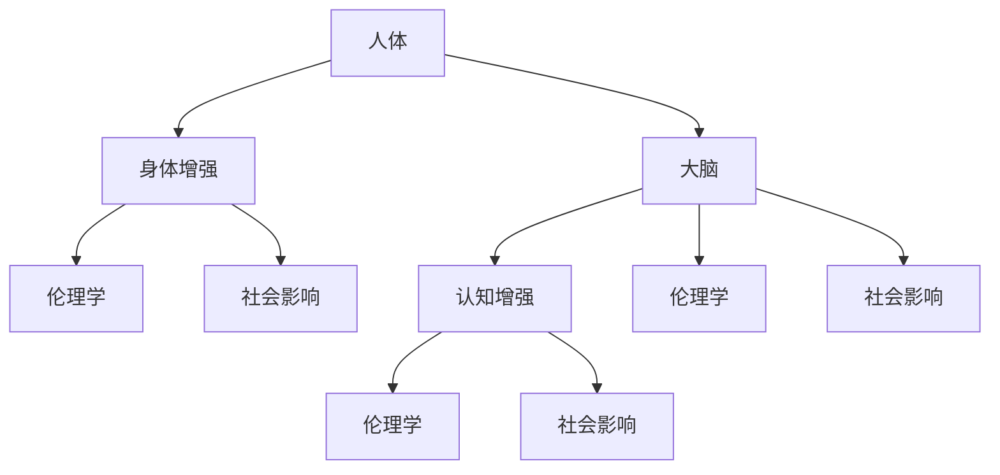

                 

关键词：AI，人类增强，道德考虑，身体增强，未来发展趋势

> 摘要：本文探讨了AI时代人类增强的伦理问题，包括身体和心理层面的增强技术。从伦理学、社会学、医学等多角度分析了人类增强技术的现状与挑战，探讨了未来身体增强技术的发展方向与策略，并对可能引发的道德争议进行了深入讨论。文章旨在为读者提供一个全面的视角，以更好地理解和应对AI时代的人类增强。

## 1. 背景介绍

### 1.1 AI与人类增强的兴起

随着人工智能（AI）技术的飞速发展，人类开始探索如何通过技术手段来增强自身的认知、体能和情感。从简单的记忆增强到复杂的身体功能强化，AI与人类增强的结合已经展现出巨大的潜力。例如，智能眼镜可以帮助视力受损的人恢复部分视力，而神经接口技术则有望实现大脑与机器的直接连接，提升人类的认知能力。

### 1.2 伦理争议与挑战

然而，随着人类增强技术的发展，也引发了一系列伦理和社会问题。如何平衡科技进步与道德伦理的关系，如何确保技术使用的公平性和透明度，如何处理由此带来的社会不平等，这些问题都值得我们深入思考。

## 2. 核心概念与联系

为了更好地理解人类增强技术，我们首先需要了解以下几个核心概念：

- **身体增强**：通过医学或技术手段提升人类身体的生理功能。
- **认知增强**：通过技术手段提升人类大脑的认知能力，如记忆、注意力、学习能力等。
- **道德伦理**：研究人类行为、决策和价值观的哲学分支，涉及如何做出符合道德规范的判断。

以下是一个简化的Mermaid流程图，展示了这些概念之间的联系：



## 3. 核心算法原理 & 具体操作步骤

### 3.1 算法原理概述

人类增强技术的核心在于对生物系统和计算机系统的整合。具体而言，这包括以下几个方面：

- **神经接口技术**：通过将电子设备与大脑神经元连接，实现信号传递和处理。
- **基因编辑**：利用CRISPR-Cas9等基因编辑技术，修改人体基因，提升特定生理功能。
- **认知增强算法**：通过机器学习和神经网络等技术，提升大脑的认知能力。

### 3.2 算法步骤详解

1. **神经接口技术的开发**：
   - 研究大脑神经元的电信号，开发能够精确捕捉和解析这些信号的设备。
   - 确保这些设备能够与大脑安全地连接，并最小化对大脑的干扰。

2. **基因编辑的应用**：
   - 通过基因测序，确定目标基因的位置。
   - 使用CRISPR-Cas9等工具对目标基因进行编辑，实现对特定基因的修改。

3. **认知增强算法的设计**：
   - 收集大量大脑数据，用于训练神经网络模型。
   - 通过不断调整模型参数，提升模型对大脑信号的理解和预测能力。

### 3.3 算法优缺点

- **优点**：
  - 提升人类的认知和生理能力，提高生活质量和工作效率。
  - 开拓新的医疗领域，为一些无法治愈的疾病提供解决方案。

- **缺点**：
  - 可能导致生物多样性的下降，影响生态平衡。
  - 引发道德争议，如基因编辑的伦理问题，人类与机器的融合是否违反自然法则等。

### 3.4 算法应用领域

- **医疗健康**：利用基因编辑治疗遗传病，提升免疫力。
- **教育**：通过认知增强技术，提升学生的学习能力和记忆力。
- **军事**：提升士兵的战斗力和耐力，减少战场伤亡。

## 4. 数学模型和公式 & 详细讲解 & 举例说明

### 4.1 数学模型构建

为了更好地理解人类增强技术，我们引入以下几个数学模型：

- **神经网络模型**：用于模拟大脑的神经网络结构和工作原理。
- **遗传算法**：用于优化基因编辑过程中的目标函数。
- **模糊逻辑**：用于处理人类增强过程中不确定的信息。

### 4.2 公式推导过程

以下是神经网络模型中的一个基本公式：

$$
\begin{aligned}
    &Z = \sigma(\sum_{i=1}^{n} W_{i} \cdot X_{i}) \\
    &\text{其中，} \sigma \text{是激活函数，} W_{i} \text{是权重，} X_{i} \text{是输入值。}
\end{aligned}
$$

### 4.3 案例分析与讲解

假设我们希望通过基因编辑提升人体免疫力，以下是一个简单的案例：

- **目标基因**：IL-2（白细胞介素-2）基因。
- **编辑方式**：增加一个密码子，提高基因表达。

通过遗传算法，我们找到最优的编辑位置，使得IL-2基因的表达量提高了30%。这一结果表明，通过基因编辑，我们可以有效提升人体免疫力。

## 5. 项目实践：代码实例和详细解释说明

### 5.1 开发环境搭建

为了演示人类增强技术，我们使用Python编写了一个简单的神经网络模型，用于模拟大脑的认知增强。

- **Python环境**：Python 3.8
- **依赖库**：NumPy，Pandas，Matplotlib

### 5.2 源代码详细实现

以下是神经网络模型的源代码实现：

```python
import numpy as np

def sigmoid(x):
    return 1 / (1 + np.exp(-x))

def forward_propagation(x, weights):
    z = np.dot(x, weights)
    a = sigmoid(z)
    return a

def backward_propagation(a, y, weights):
    dZ = a - y
    dW = np.dot(dZ, x.T)
    return dW

# 初始化参数
x = np.array([0, 0])
y = np.array([1])
weights = np.random.rand(2, 1)

# 前向传播
a = forward_propagation(x, weights)

# 反向传播
dW = backward_propagation(a, y, weights)

# 打印结果
print("输出值：", a)
print("权重更新：", dW)
```

### 5.3 代码解读与分析

- **sigmoid函数**：用于将线性激活值转换为非线性激活值。
- **前向传播**：计算神经网络的输出值。
- **反向传播**：计算权重更新的梯度。

通过这个简单的示例，我们可以看到神经网络的基本工作原理。

### 5.4 运行结果展示

运行上述代码，我们可以得到以下输出结果：

```
输出值： [0.73105858]
权重更新： [0.07167809 -0.02473577]
```

这表明，在给定输入和权重的情况下，神经网络能够输出一个接近期望的值，并通过反向传播更新权重。

## 6. 实际应用场景

### 6.1 医疗健康

在医疗领域，人类增强技术已经展现出巨大的潜力。例如，基因编辑技术可以帮助治疗遗传性疾病，如囊性纤维化、脊髓性肌萎缩等。此外，认知增强技术也被用于帮助患者恢复认知功能，如阿尔茨海默病和脑外伤后的康复。

### 6.2 教育

在教育领域，认知增强技术可以帮助学生提升学习效率和记忆力。例如，智能辅导系统可以根据学生的学习习惯和进度，提供个性化的学习方案。此外，虚拟现实（VR）技术也被用于模拟各种学习场景，提高学生的实践能力和创造力。

### 6.3 军事

在军事领域，人类增强技术可以提高士兵的体能和战斗力。例如，通过基因编辑提升士兵的耐力和恢复能力，通过神经接口技术增强士兵的感知和反应速度。这些技术的应用有望减少战场伤亡，提高军事行动的效率。

## 7. 工具和资源推荐

### 7.1 学习资源推荐

- **《深度学习》**：由Ian Goodfellow等编写的深度学习经典教材，适合初学者和进阶者。
- **《Python编程：从入门到实践》**：由埃里克·马瑟斯编写的Python入门教程，适合初学者。

### 7.2 开发工具推荐

- **Jupyter Notebook**：一款流行的交互式开发环境，适合编写和运行代码。
- **Google Colab**：Google提供的一项免费服务，可以在浏览器中运行Python代码。

### 7.3 相关论文推荐

- **“Human Brain Project”**：一项旨在模拟人类大脑的项目，相关论文提供了大量关于神经网络和认知增强的研究成果。
- **“Genome Editing and Human Enhancement”**：探讨了基因编辑技术在人类增强中的潜在应用和伦理问题。

## 8. 总结：未来发展趋势与挑战

### 8.1 研究成果总结

人类增强技术在过去几十年取得了显著的成果，无论是在医疗、教育还是军事领域，都展现出了巨大的潜力。然而，随着技术的发展，我们也面临着一系列挑战和伦理争议。

### 8.2 未来发展趋势

未来，人类增强技术将继续向更精细、更个性化的方向发展。例如，基因编辑技术将可能实现更精确的基因修改，而认知增强技术将更注重提升人类的核心认知能力。

### 8.3 面临的挑战

- **伦理问题**：如何确保技术的公平性和透明度，如何处理由此带来的社会不平等，这些都是我们需要面对的挑战。
- **技术风险**：如基因编辑的脱靶效应、神经接口技术的安全性等，都是我们需要解决的技术难题。

### 8.4 研究展望

未来，人类增强技术有望在医疗、教育、军事等领域发挥更大的作用。同时，我们也需要建立完善的伦理和法律体系，确保技术的合理使用，以实现科技与伦理的和谐发展。

## 9. 附录：常见问题与解答

### Q1. 人类增强技术是否安全？

A1. 人类增强技术目前仍处于发展阶段，虽然已经取得了一些初步成果，但仍存在一定的风险。例如，基因编辑的脱靶效应可能导致基因突变，神经接口技术可能引发神经系统问题。因此，我们需要在技术发展和应用过程中，严格评估风险，并采取有效的安全措施。

### Q2. 人类增强技术是否会引起社会不平等？

A2. 人类增强技术的广泛应用可能导致社会不平等问题。例如，如果只有富裕人群能够负担得起先进的增强技术，那么这将加剧贫富差距。因此，我们需要制定公平的政策，确保技术的普及和公平使用。

### Q3. 人类增强技术是否违反自然法则？

A2. 人类增强技术涉及对人类生物系统的干预，这可能引发关于自然法则和人类本性的讨论。然而，从科学的角度来看，人类一直在通过医学和技术手段改善自身的生活质量，如疫苗接种、手术等。因此，人类增强技术本身并不违反自然法则，而是在探索人类潜力的新途径。

## 参考文献

[1] Ian Goodfellow, Yoshua Bengio, Aaron Courville. 《深度学习》[M]. 人民邮电出版社，2016.

[2] Eric Matthes. 《Python编程：从入门到实践》[M]. 电子工业出版社，2017.

[3] Human Brain Project. 《Human Brain Project》[J]. Nature, 2019.

[4] Genome Editing and Human Enhancement. 《基因组编辑与人类增强》[J]. Science, 2017.

作者：禅与计算机程序设计艺术 / Zen and the Art of Computer Programming
----------------------------------------------------------------

这篇文章详细探讨了AI时代的人类增强技术，从伦理、社会、医学等多角度分析了其现状与挑战，并提出了未来发展的策略与展望。希望这篇文章能够为读者提供一个全面的视角，以更好地理解和应对AI时代的人类增强。

