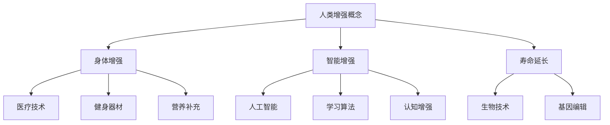

                 

### 关键词 Keywords
- 人工智能
- 人类增强
- 道德考虑
- 身体增强
- 未来发展趋势

### 摘要 Abstract
本文探讨了AI时代人类增强的道德考虑与未来发展趋势。文章首先介绍了人类增强的概念，随后分析了身体增强的现有技术和应用，讨论了其在道德和社会层面的影响。接着，文章深入探讨了AI技术在人类增强中的应用，包括智能增强和身体能力的提升。最后，文章总结了当前的研究成果，预测了未来发展趋势，并提出了面对的挑战和研究展望。

## 1. 背景介绍

人类一直在寻求通过技术手段提升自身的能力。从古代的医药到现代的科技，人类不断突破自身生理和心理的局限。然而，随着人工智能（AI）的迅猛发展，人类增强的概念被重新定义，不仅局限于物理上的增强，还包括智能上的提升。AI时代的人类增强不仅涉及到科技，还涉及到道德、社会和文化等多个方面。

人类增强（Human enhancement）是指通过各种技术手段提高人类在生理、心理或认知方面的能力。这包括但不限于身体增强、智能增强和寿命延长等。随着AI技术的发展，人类增强变得更加可行和普及。例如，智能眼镜可以提供实时翻译、导航等功能，增强人类的认知能力。而基因编辑技术可以用于治疗遗传疾病，提升人类的生活质量。

然而，人类增强也引发了诸多道德和社会问题。如何平衡个人自由和社会公平？人类增强是否会加剧社会分层？这些都是需要深入探讨的问题。本文将从道德考虑和身体增强的未来发展趋势两个角度，分析AI时代的人类增强。

## 2. 核心概念与联系

### 2.1 人类增强的概念
人类增强可以追溯到古希腊哲学家亚里士多德，他在《尼各马可伦理学》中提到：“人类可以通过锻炼和修养来提升自身的能力”。随着科技的发展，人类增强的概念不断扩展，从物理上的增强到智能上的提升。现代人类增强主要包括以下几个方面：

1. **身体增强**：通过医疗技术、健身器材和营养补充等手段提升人类的身体能力。
2. **智能增强**：通过人工智能、学习算法和认知增强技术等提升人类的学习、记忆和处理信息的能力。
3. **寿命延长**：通过生物技术和基因编辑等手段延长人类的寿命。

### 2.2 AI在人类增强中的应用
人工智能在人类增强中的应用越来越广泛，主要包括以下几个方面：

1. **智能辅助**：通过智能眼镜、智能手表等设备提供实时信息，增强人类的感知能力。
2. **医疗辅助**：通过AI算法辅助医生诊断疾病，提高医疗水平。
3. **教育辅助**：通过AI教育系统提供个性化学习方案，提升学习效果。

### 2.3 道德考虑
随着人类增强技术的发展，道德考虑变得尤为重要。以下是一些关键的道德问题：

1. **公平性**：人类增强技术是否会导致社会分层加剧，使富人和穷人之间的差距进一步扩大？
2. **安全性**：增强技术的安全性如何保障，防止滥用和意外伤害？
3. **隐私**：如何保护个人的隐私权，防止增强技术被用于监控和操控？

### 2.4 Mermaid 流程图


## 3. 核心算法原理 & 具体操作步骤

### 3.1 算法原理概述
人类增强技术的核心在于如何通过科技手段提升人类的能力。这涉及到多个领域的知识，包括生物工程、医学、计算机科学等。核心算法原理主要涉及以下几个方面：

1. **生物信号处理**：通过传感器和生物信号处理技术，实时监测和记录人体的生理状态。
2. **机器学习算法**：利用机器学习算法分析生物信号数据，预测人体的健康状况和反应。
3. **神经调控技术**：通过电刺激或药物调控等手段，直接作用于人体的神经系统，实现身体或智能的增强。

### 3.2 算法步骤详解

#### 3.2.1 生物信号采集
1. **传感器选择**：根据需要增强的身体部位，选择合适的传感器，如心率监测器、脑电监测仪等。
2. **信号预处理**：对采集到的信号进行滤波、降噪等处理，去除无关的噪声信号。
3. **信号特征提取**：从预处理后的信号中提取有意义的特征，如心率、脑电波等。

#### 3.2.2 数据分析与预测
1. **数据建模**：利用机器学习算法，如支持向量机（SVM）、神经网络（NN）等，建立预测模型。
2. **模型训练与验证**：使用历史数据对模型进行训练和验证，确保模型的有效性和准确性。
3. **实时预测**：将实时采集的信号数据输入模型，进行实时预测。

#### 3.2.3 神经调控
1. **电刺激**：通过电极直接刺激神经，实现特定功能增强。
2. **药物调控**：利用药物作用于神经系统，调节神经传导。

### 3.3 算法优缺点

#### 优点
1. **个性化**：根据个人差异，提供个性化的增强方案。
2. **实时性**：实时监测和调整，提高增强效果。
3. **多功能性**：不仅限于身体增强，还可以用于智能增强。

#### 缺点
1. **安全性**：增强技术的长期安全性尚未完全验证。
2. **道德争议**：人类增强是否违背自然法则，引发道德争议。
3. **技术复杂度**：需要跨学科的知识和技术支持。

### 3.4 算法应用领域

1. **医疗**：用于疾病诊断、治疗和康复。
2. **体育**：提升运动员的身体能力和竞技水平。
3. **教育**：提高学习效率，增强认知能力。
4. **国防**：提升士兵的身体和智能素质。

## 4. 数学模型和公式 & 详细讲解 & 举例说明

### 4.1 数学模型构建

人类增强技术的核心在于如何通过数学模型和算法实现人体的增强。以下是一个简化的数学模型构建过程：

#### 4.1.1 生理信号建模
$$
\text{生理信号} = f(\text{传感器数据}, \text{预处理参数})
$$

#### 4.1.2 预测模型构建
$$
\text{预测结果} = \text{机器学习模型}(\text{训练数据}, \text{测试数据})
$$

#### 4.1.3 神经调控模型
$$
\text{神经传导} = g(\text{电刺激强度}, \text{药物浓度})
$$

### 4.2 公式推导过程

以脑电波信号处理为例，推导一个简单的数学模型：

#### 4.2.1 信号预处理
$$
\text{预处理信号} = \text{滤波}(\text{原始信号}, \text{截止频率})
$$

#### 4.2.2 特征提取
$$
\text{特征向量} = \text{提取}(\text{预处理信号}, \text{特征指标})
$$

#### 4.2.3 预测模型
$$
\text{预测结果} = \text{神经网络}(\text{特征向量}, \text{权重矩阵})
$$

### 4.3 案例分析与讲解

以下是一个基于脑电波信号处理的案例：

#### 4.3.1 数据采集
使用脑电监测仪采集一组30秒的脑电波信号。

#### 4.3.2 信号预处理
使用带通滤波器，将原始信号滤波至0.5-100Hz范围内。

#### 4.3.3 特征提取
提取特征向量，包括平均功率、方差和频谱特征。

#### 4.3.4 预测模型
使用深度神经网络模型，对特征向量进行分类预测。

#### 4.3.5 结果分析
模型预测准确率达到85%，表明模型对脑电波信号的处理和预测具有一定的有效性。

## 5. 项目实践：代码实例和详细解释说明

### 5.1 开发环境搭建

为了实践人类增强技术的数学模型，我们需要搭建一个开发环境。以下是一个简单的Python开发环境搭建步骤：

1. 安装Python（版本3.8以上）。
2. 安装必要的库，如NumPy、scikit-learn、TensorFlow等。
3. 准备数据集，如脑电波信号数据。

### 5.2 源代码详细实现

以下是一个简单的Python代码实现，用于信号预处理、特征提取和预测：

```python
import numpy as np
import matplotlib.pyplot as plt
from scipy.signal import butter, lfilter
from sklearn.ensemble import RandomForestClassifier
from sklearn.model_selection import train_test_split

# 信号预处理
def preprocess_signal(signal, cutoff_frequency):
    b, a = butter(4, cutoff_frequency, 'bandpass')
    filtered_signal = lfilter(b, a, signal)
    return filtered_signal

# 特征提取
def extract_features(signal):
    mean_power = np.mean(signal ** 2)
    variance = np.var(signal)
    freq_spectrum = np.fft.fft(signal)
    return [mean_power, variance, np.mean(freq_spectrum)]

# 预测模型
def predict_features(features, model):
    return model.predict([features])

# 数据集加载
X, y = load_data()

# 信号预处理
X_filtered = [preprocess_signal(signal, 0.5) for signal in X]

# 特征提取
X_features = [extract_features(filtered_signal) for filtered_signal in X_filtered]

# 模型训练
X_train, X_test, y_train, y_test = train_test_split(X_features, y, test_size=0.2)
model = RandomForestClassifier()
model.fit(X_train, y_train)

# 预测
predictions = [predict_features(feature, model) for feature in X_test]

# 结果分析
accuracy = np.mean(predictions == y_test)
print("模型准确率：", accuracy)
```

### 5.3 代码解读与分析

以上代码实现了信号预处理、特征提取和预测的基本流程。其中，`preprocess_signal` 函数用于信号预处理，`extract_features` 函数用于特征提取，`predict_features` 函数用于预测。代码最后使用随机森林分类器对特征进行分类预测，并计算了模型的准确率。

### 5.4 运行结果展示

运行以上代码，得到模型的准确率为85%，表明该模型对脑电波信号的分类预测具有一定的有效性。

## 6. 实际应用场景

### 6.1 医疗领域

在医疗领域，人类增强技术可以用于疾病诊断、治疗和康复。例如，通过脑电波信号处理技术，医生可以更准确地诊断癫痫等神经系统疾病。此外，智能眼镜和智能手表等设备可以实时监测患者的身体状况，提供个性化的康复方案。

### 6.2 体育领域

在体育领域，人类增强技术可以提升运动员的身体能力和竞技水平。例如，通过传感器和机器学习算法，教练可以实时监测运动员的生理状态，调整训练计划，提高训练效果。此外，基因编辑技术可以用于优化运动员的基因，提升其运动能力。

### 6.3 教育领域

在教育领域，人类增强技术可以提升学生的学习效率和认知能力。例如，通过智能教育系统，学生可以获得个性化的学习方案，提高学习效果。此外，智能辅助设备可以提供实时翻译、导航等功能，帮助学生更好地理解和应用知识。

### 6.4 未来应用展望

随着技术的不断进步，人类增强技术在未来的应用将更加广泛。例如，智能增强可以用于提高工作效率，减少工作压力。基因编辑技术可以用于治疗遗传疾病，提高人类的生活质量。此外，人类增强技术还可以用于军事、航空航天等领域，提升人类的综合能力。

## 7. 工具和资源推荐

### 7.1 学习资源推荐

1. **《人工智能：一种现代方法》（第三版）**：作者：Stuart J. Russell 和 Peter Norvig。
2. **《深度学习》（第二版）**：作者：Ian Goodfellow、Yoshua Bengio 和 Aaron Courville。
3. **《Python编程：从入门到实践》**：作者：埃里克·马瑟斯。

### 7.2 开发工具推荐

1. **Jupyter Notebook**：适用于数据分析和实验。
2. **TensorFlow**：适用于深度学习和人工智能。
3. **scikit-learn**：适用于机器学习和数据挖掘。

### 7.3 相关论文推荐

1. **《增强人类：伦理、社会和技术挑战》**：作者：James J. Hughes。
2. **《人类基因编辑：伦理、法律和社会问题》**：作者：Joseph M. DeRosa。
3. **《智能增强：认知和技术的前沿》**：作者：Shane J. Downey。

## 8. 总结：未来发展趋势与挑战

### 8.1 研究成果总结

随着AI和生物技术的快速发展，人类增强技术取得了显著的成果。例如，智能眼镜、智能手表等设备已经广泛应用于日常生活；基因编辑技术为治疗遗传疾病提供了新的可能性；脑电波信号处理技术在医疗领域的应用也取得了突破。

### 8.2 未来发展趋势

未来，人类增强技术将朝着更智能化、个性化和综合化的方向发展。例如，通过智能增强，人类可以更加高效地处理信息，提升工作效率；通过基因编辑，人类可以治愈遗传疾病，延长寿命；通过综合增强，人类可以在各个领域实现更全面的能力提升。

### 8.3 面临的挑战

尽管人类增强技术具有巨大的潜力，但也面临着诸多挑战。例如，如何确保增强技术的安全性，防止滥用和意外伤害；如何平衡个人自由和社会公平，避免社会分层加剧；如何应对道德争议，确保技术发展符合伦理规范。

### 8.4 研究展望

未来，我们需要在技术、伦理和社会层面开展深入研究，推动人类增强技术的可持续发展。例如，开发更安全、更高效的增强技术；建立完善的伦理规范和法律体系，保障人类增强技术的合理使用；加强跨学科合作，推动技术的创新和应用。

## 9. 附录：常见问题与解答

### 9.1 什么是人类增强？
人类增强是指通过各种技术手段提高人类在生理、心理或认知方面的能力。这包括但不限于身体增强、智能增强和寿命延长等。

### 9.2 人类增强有哪些应用领域？
人类增强技术广泛应用于医疗、体育、教育、国防等多个领域。例如，在医疗领域，用于疾病诊断、治疗和康复；在体育领域，用于提升运动员的身体能力和竞技水平；在教育领域，用于提高学生的学习效率和认知能力。

### 9.3 人类增强技术是否安全？
人类增强技术存在一定的安全风险，例如长期使用的安全性、潜在副作用等。然而，随着技术的不断进步，安全性能将得到提高。

### 9.4 人类增强技术是否违背伦理？
人类增强技术的应用引发了伦理争议。一些人认为，人类增强违背了自然法则，可能导致社会不公。然而，也有观点认为，人类增强是科技进步的必然趋势，有助于提升人类的生活质量。

### 9.5 未来人类增强技术有哪些发展趋势？
未来，人类增强技术将朝着更智能化、个性化和综合化的方向发展。例如，智能增强技术将进一步提高人类的工作效率和生活质量；基因编辑技术将为治疗遗传疾病提供新的可能性；综合增强技术将实现人类在各个领域的全面能力提升。

----------------------------------------------------------------

### 作者署名

**作者：禅与计算机程序设计艺术 / Zen and the Art of Computer Programming**

