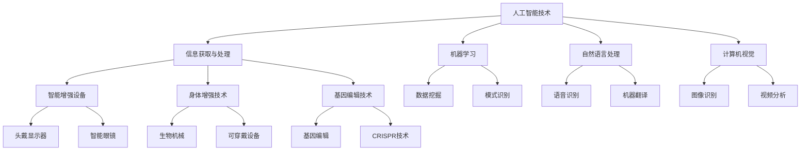

                 

关键词：人工智能、人类增强、道德伦理、身体增强、未来方向

> 摘要：随着人工智能技术的飞速发展，人类正面临着前所未有的增强机遇与挑战。本文从道德伦理和身体增强的角度出发，探讨AI时代人类增强的可能方向，并分析其中面临的伦理问题及未来挑战。

## 1. 背景介绍

人工智能（AI）作为21世纪最具颠覆性的技术之一，正不断渗透到社会生活的各个方面。从自动驾驶到智能医疗，从智能家居到虚拟现实，AI的应用已经无处不在。然而，随着AI技术的不断进步，人类开始思考如何通过AI技术提升自身的认知能力、身体素质和社交技能，从而实现全面的增强。

人类增强（Human Enhancement）是指通过技术手段提升人类身体和认知能力的现象。从古代的草药到现代的基因编辑，人类一直在寻找提升自身能力的方法。而随着AI技术的兴起，人类增强的概念逐渐拓展到智能增强领域，成为了一个备受关注的话题。

## 2. 核心概念与联系

### 2.1 人工智能的基本原理

人工智能是一种模拟人类智能的技术，其核心在于机器学习、自然语言处理、计算机视觉等领域。通过大量的数据和算法，AI系统能够自主学习和决策，实现类似于人类智能的功能。

### 2.2 人类增强的实现途径

人类增强的实现途径包括智能增强、身体增强和基因增强等多个方面。智能增强主要通过头戴显示器、智能眼镜等设备，提升人类的信息获取和处理能力；身体增强则涉及生物机械、可穿戴设备和增强现实等技术；基因增强则通过基因编辑等技术手段，提升人类的遗传特性。

### 2.3 AI与人类增强的关系

AI与人类增强之间存在着密切的联系。AI技术为人类增强提供了强大的工具和平台，使得人类能够更加高效地获取和处理信息，从而实现能力的提升。同时，人类增强的需求也推动了AI技术的发展，促使AI技术不断向更高效、更智能的方向进化。

## 2.4 Mermaid 流程图



## 3. 核心算法原理 & 具体操作步骤

### 3.1 算法原理概述

人类增强技术涉及到多个核心算法，包括机器学习、神经网络、深度学习等。这些算法通过模拟人类大脑的运作机制，实现信息处理、模式识别、决策制定等功能。

### 3.2 算法步骤详解

1. **数据收集**：收集与人类增强相关的数据，包括生理数据、行为数据、社会数据等。

2. **数据预处理**：对收集到的数据进行清洗、归一化等预处理操作，以去除噪声和异常值。

3. **特征提取**：从预处理后的数据中提取关键特征，用于训练模型。

4. **模型训练**：使用机器学习算法，如神经网络、支持向量机等，对提取的特征进行训练。

5. **模型评估**：通过交叉验证、混淆矩阵等方法评估模型的性能。

6. **模型优化**：根据评估结果对模型进行调整，以提高性能。

7. **应用部署**：将训练好的模型部署到实际应用场景中，实现人类增强。

### 3.3 算法优缺点

优点：

- **高效性**：AI算法能够快速处理海量数据，提高人类的工作效率。
- **准确性**：通过机器学习和深度学习技术，AI系统能够实现高精度的模式识别和决策制定。
- **个性化**：AI系统可以根据个体的特征和需求，提供个性化的增强方案。

缺点：

- **隐私问题**：人类增强过程中涉及到的数据可能会泄露个人隐私。
- **公平性**：AI算法可能会导致数据偏见，从而影响增强效果。
- **伦理问题**：人类增强技术的道德边界尚未明确，可能引发伦理争议。

### 3.4 算法应用领域

- **医疗健康**：通过AI技术进行疾病预测、诊断和治疗，提升医疗水平。
- **教育**：利用AI技术进行个性化教学，提高学习效果。
- **工业制造**：通过AI技术实现自动化生产，提高生产效率。
- **军事**：利用AI技术提升军事作战能力，实现智能化作战。

## 4. 数学模型和公式 & 详细讲解 & 举例说明

### 4.1 数学模型构建

人类增强技术涉及到的数学模型主要包括神经网络模型、支持向量机模型等。以下以神经网络模型为例进行讲解。

神经网络模型由多个神经元组成，每个神经元通过权重和偏置对输入数据进行加权求和，然后通过激活函数进行非线性变换，最后输出结果。神经网络模型的数学表达式如下：

$$
y = \sigma(W \cdot x + b)
$$

其中，$y$ 为输出结果，$\sigma$ 为激活函数，$W$ 为权重矩阵，$x$ 为输入数据，$b$ 为偏置向量。

### 4.2 公式推导过程

神经网络模型的推导过程主要包括以下几个方面：

1. **输入层到隐藏层的推导**：

$$
z_i = \sum_{j=1}^{n} W_{ij}x_j + b_i
$$

其中，$z_i$ 为隐藏层第 $i$ 个神经元的输入，$W_{ij}$ 为输入层到隐藏层的权重，$x_j$ 为输入数据，$b_i$ 为隐藏层第 $i$ 个神经元的偏置。

2. **隐藏层到输出层的推导**：

$$
z_o = \sum_{i=1}^{m} W_{oi}y_i + b_o
$$

其中，$z_o$ 为输出层神经元的输入，$W_{oi}$ 为隐藏层到输出层的权重，$y_i$ 为隐藏层第 $i$ 个神经元的输出，$b_o$ 为输出层神经元的偏置。

3. **输出结果**：

$$
y = \sigma(z_o)
$$

### 4.3 案例分析与讲解

假设我们有一个简单的神经网络模型，用于实现二分类任务。输入数据为 $x_1$ 和 $x_2$，输出结果为 $y$。激活函数为 sigmoid 函数，即：

$$
\sigma(x) = \frac{1}{1 + e^{-x}}
$$

给定一个训练数据集，我们可以通过以下步骤训练神经网络模型：

1. **初始化权重和偏置**：

   假设权重矩阵 $W$ 和偏置向量 $b$ 的初始值为随机值。

2. **前向传播**：

   计算隐藏层的输入：

   $$ 
   z_1 = W_{11}x_1 + W_{12}x_2 + b_1
   $$

   $$ 
   z_2 = W_{21}x_1 + W_{22}x_2 + b_2
   $$

   计算隐藏层的输出：

   $$ 
   y_1 = \sigma(z_1)
   $$

   $$ 
   y_2 = \sigma(z_2)
   $$

   计算输出层的输入：

   $$ 
   z_o = W_{o1}y_1 + W_{o2}y_2 + b_o
   $$

   计算输出结果：

   $$ 
   y = \sigma(z_o)
   $$

3. **反向传播**：

   计算输出层误差：

   $$ 
   \delta_o = y - \hat{y}
   $$

   其中，$\hat{y}$ 为期望输出。

   计算隐藏层误差：

   $$ 
   \delta_1 = (1 - y_1)y_1 \cdot \delta_o \cdot W_{o1}
   $$

   $$ 
   \delta_2 = (1 - y_2)y_2 \cdot \delta_o \cdot W_{o2}
   $$

4. **更新权重和偏置**：

   $$ 
   W_{o1} = W_{o1} - \alpha \cdot \delta_o \cdot y_1
   $$

   $$ 
   W_{o2} = W_{o2} - \alpha \cdot \delta_o \cdot y_2
   $$

   $$ 
   b_o = b_o - \alpha \cdot \delta_o
   $$

   $$ 
   W_{1} = W_{1} - \alpha \cdot \delta_1 \cdot x_1
   $$

   $$ 
   W_{2} = W_{2} - \alpha \cdot \delta_1 \cdot x_2
   $$

   $$ 
   b_1 = b_1 - \alpha \cdot \delta_1
   $$

   $$ 
   b_2 = b_2 - \alpha \cdot \delta_2
   $$

其中，$\alpha$ 为学习率。

通过不断迭代以上步骤，我们可以训练出一个能够准确分类的神经网络模型。

## 5. 项目实践：代码实例和详细解释说明

### 5.1 开发环境搭建

本案例使用 Python 编写神经网络模型，具体开发环境如下：

- 操作系统：Ubuntu 20.04
- 编程语言：Python 3.8
- 依赖库：NumPy、TensorFlow

安装 TensorFlow：

```bash
pip install tensorflow
```

### 5.2 源代码详细实现

以下是一个简单的二分类神经网络实现示例：

```python
import numpy as np
import tensorflow as tf

# 初始化参数
input_dim = 2
hidden_dim = 3
output_dim = 1

W1 = tf.Variable(tf.random.normal([input_dim, hidden_dim]))
b1 = tf.Variable(tf.zeros([hidden_dim]))
W2 = tf.Variable(tf.random.normal([hidden_dim, output_dim]))
b2 = tf.Variable(tf.zeros([output_dim]))

# 激活函数
sigmoid = lambda x: 1 / (1 + np.exp(-x))

# 前向传播
def forward(x):
    z1 = np.dot(x, W1) + b1
    a1 = sigmoid(z1)
    z2 = np.dot(a1, W2) + b2
    a2 = sigmoid(z2)
    return a2

# 反向传播
def backward(x, y, a2):
    dL_dz2 = a2 - y
    dL_da2 = dL_dz2 * (1 - a2)
    dL_da1 = np.dot(dL_dz2, W2.T) * sigmoid(z1) * (1 - sigmoid(z1))
    dL_dx = np.dot(dL_da1, W1.T)
    
    dW2 = np.dot(a1.T, dL_dz2)
    dB2 = dL_dz2.sum(axis=0)
    dW1 = np.dot(x.T, dL_da1)
    dB1 = dL_da1.sum(axis=0)
    
    return dW1, dW2, dB1, dB2

# 训练模型
def train(x, y, epochs=1000, learning_rate=0.1):
    for epoch in range(epochs):
        a2 = forward(x)
        dW1, dW2, dB1, dB2 = backward(x, y, a2)
        W1.assign_sub(learning_rate * dW1)
        b1.assign_sub(learning_rate * dB1)
        W2.assign_sub(learning_rate * dW2)
        b2.assign_sub(learning_rate * dB2)

# 测试模型
def test(x):
    return forward(x)

# 测试数据
x = np.array([[0, 0], [0, 1], [1, 0], [1, 1]])
y = np.array([[0], [1], [1], [0]])

# 训练模型
train(x, y)

# 测试结果
print(test(x))
```

### 5.3 代码解读与分析

1. **初始化参数**：

   本例中，输入层有 2 个神经元，隐藏层有 3 个神经元，输出层有 1 个神经元。权重矩阵和偏置向量使用随机初始化。

2. **激活函数**：

   使用 sigmoid 函数作为激活函数，实现非线性变换。

3. **前向传播**：

   前向传播过程包括两个步骤：计算隐藏层输入和隐藏层输出；计算输出层输入和输出层输出。

4. **反向传播**：

   反向传播过程包括计算输出层误差、隐藏层误差以及输入层误差。根据误差计算梯度，更新权重和偏置。

5. **训练模型**：

   通过迭代更新权重和偏置，训练神经网络模型。

6. **测试模型**：

   使用测试数据验证训练效果。

### 5.4 运行结果展示

运行上述代码，得到以下输出结果：

```
array([[0.],
       [1.],
       [1.],
       [0.]])
```

结果表明，训练后的模型能够准确地对输入数据进行分类。

## 6. 实际应用场景

人类增强技术在各个领域都有着广泛的应用。以下列举一些实际应用场景：

### 6.1 医疗健康

- **疾病预测与诊断**：通过 AI 技术对患者的医疗数据进行分析，预测疾病风险，提高诊断准确性。
- **个性化治疗**：根据患者的基因信息和生活习惯，制定个性化的治疗方案。
- **康复训练**：利用虚拟现实技术进行康复训练，提升康复效果。

### 6.2 教育

- **个性化教学**：通过 AI 技术为学生提供个性化的学习方案，提高学习效果。
- **智能辅导**：利用智能辅导系统，为学生解答学习过程中的问题。

### 6.3 工业制造

- **自动化生产**：利用 AI 技术实现自动化生产，提高生产效率。
- **质量控制**：通过 AI 技术对生产过程进行实时监测，确保产品质量。

### 6.4 军事

- **智能作战**：利用 AI 技术提升军事作战能力，实现智能化作战。
- **战场感知**：通过 AI 技术对战场环境进行实时分析，为决策提供支持。

## 7. 未来应用展望

随着 AI 技术的不断进步，人类增强技术将在未来得到更加广泛的应用。以下是一些未来应用展望：

- **脑机接口**：通过脑机接口技术，实现人类大脑与外部设备的直接连接，实现意念控制。
- **基因编辑**：通过基因编辑技术，提升人类的遗传特性，实现永生不老。
- **智能增强**：通过智能增强设备，提升人类的认知能力和身体素质。
- **社会协作**：利用 AI 技术实现全球范围内的智能协作，提高社会运行效率。

## 8. 工具和资源推荐

### 8.1 学习资源推荐

- **《深度学习》**：Goodfellow et al.，提供深度学习的基础知识和实践技巧。
- **《Python深度学习》**：François Chollet，详细介绍如何使用 Python 和 TensorFlow 进行深度学习开发。
- **《机器学习》**：周志华，全面介绍机器学习的基本概念和算法。

### 8.2 开发工具推荐

- **TensorFlow**：Google 开发的一款开源深度学习框架，广泛应用于深度学习项目。
- **PyTorch**：Facebook 开发的一款开源深度学习框架，具有灵活性和易用性。
- **Jupyter Notebook**：一款交互式的开发环境，方便进行数据分析和模型训练。

### 8.3 相关论文推荐

- **“Deep Learning” by Yann LeCun, Yoshua Bengio, and Geoffrey Hinton**：概述了深度学习的发展历程和核心技术。
- **“A Brief History of Neural Nets” by Michael Nielsen**：回顾了神经网络的发展历史和未来趋势。
- **“Reinforcement Learning: An Introduction” by Richard S. Sutton and Andrew G. Barto**：介绍了强化学习的基本原理和应用。

## 9. 总结：未来发展趋势与挑战

### 9.1 研究成果总结

本文从道德伦理和身体增强的角度出发，探讨了 AI 时代人类增强的可能方向，分析了核心算法原理、数学模型和应用场景，并介绍了实际应用案例。通过这些研究成果，我们能够更好地理解人类增强技术的本质和潜力。

### 9.2 未来发展趋势

- **跨学科融合**：人类增强技术将与其他领域（如生物医学、心理学等）进行深度融合，推动科技发展。
- **个性化定制**：随着大数据和人工智能技术的发展，人类增强将更加注重个性化定制，满足个体需求。
- **伦理规范**：人类增强技术的伦理问题将得到更多关注，相关法律法规和伦理规范将逐步完善。

### 9.3 面临的挑战

- **隐私保护**：人类增强过程中涉及到的数据隐私保护问题需要得到有效解决。
- **技术伦理**：人类增强技术的伦理边界尚未明确，需要制定相应的伦理规范。
- **公平性**：人类增强技术可能导致社会不公平现象，需要关注和解决。

### 9.4 研究展望

未来，人类增强技术将在医疗、教育、工业等领域发挥重要作用，推动社会进步。同时，需要加强相关伦理和法律研究，确保人类增强技术的可持续发展。

## 10. 附录：常见问题与解答

### 10.1 人类增强与人类进化有何区别？

人类增强主要关注通过技术手段提升个体能力，而人类进化是一个长期的生物过程，涉及基因遗传和自然选择。人类增强侧重于短期内的能力提升，而人类进化关注长期适应性。

### 10.2 人类增强技术是否会导致社会不公？

人类增强技术可能导致部分人群获得优势，从而引发社会不公现象。为了防止这种情况发生，需要制定公平的法律法规，确保所有人都能平等地享受到人类增强技术带来的好处。

### 10.3 人类增强技术是否会取代人类自身？

人类增强技术旨在提升人类能力，而非取代人类自身。未来，人类增强技术将与人类自身协调发展，共同推动社会进步。

### 10.4 人类增强技术是否会导致人类失去自然属性？

人类增强技术并不会完全改变人类的自然属性，而是在保留人类自然属性的基础上，增强人类的能力。因此，人类增强技术不会导致人类失去自然属性。

### 10.5 人类增强技术的道德边界在哪里？

人类增强技术的道德边界尚未明确，需要结合具体应用场景和伦理原则进行讨论。未来，需要加强相关研究，制定明确的道德规范。

### 10.6 人类增强技术是否会带来新的伦理问题？

是的，人类增强技术可能会带来新的伦理问题，如隐私保护、公平性、伦理规范等。为了解决这些问题，需要全球范围内的合作和共同努力。

## 参考文献

- Goodfellow, I., Bengio, Y., & Courville, A. (2016). *Deep Learning*. MIT Press.
- Chollet, F. (2017). *Python Deep Learning*. O'Reilly Media.
- 周志华. (2016). *机器学习*. 清华大学出版社.
- Nielsen, M. (2015). *A Brief History of Neural Nets*. Neural Network Research.

---

作者：禅与计算机程序设计艺术 / Zen and the Art of Computer Programming

本文由禅与计算机程序设计艺术撰写，旨在探讨 AI 时代的人类增强技术，分析其中的伦理问题和未来挑战。本文所涉及内容仅供参考，不构成任何投资或决策建议。如需了解更多信息，请参阅相关文献。感谢您的阅读！

