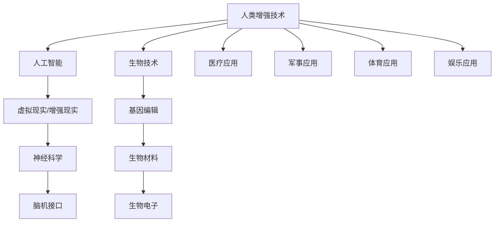

                 

关键词：人工智能，道德伦理，人类增强，身体增强技术，道德考虑，伦理挑战

> 摘要：本文深入探讨了AI时代下人类增强技术的伦理问题和身体增强技术的具体应用。文章首先回顾了人类增强技术的历史背景和现状，然后分析了道德伦理在人工智能领域的核心地位，接着讨论了身体增强技术的多种形式及其对人类社会的影响。最后，本文提出了未来人类增强技术的发展趋势和面临的挑战，并展望了相关领域的研究方向。

## 1. 背景介绍

人类增强技术（Human Augmentation）指的是通过使用技术手段来增强人体的能力，使其超越自然界的限制。从古至今，人类一直在寻找方法来提升自己的能力。例如，使用工具来增强身体的物理能力，使用语言和文字来增强认知能力。然而，随着科技的进步，人类增强技术进入了一个全新的时代，特别是在人工智能（AI）和生物技术领域取得了显著的进展。

### 1.1 人类增强技术的历史背景

早在古希腊时期，人们就通过药物和仪式来寻求身体和心理上的增强。随着医学和生物学的发展，人们开始探索通过手术和药物来改变和增强人体功能。20世纪末，计算机技术的飞速发展使得虚拟现实和增强现实（VR/AR）技术成为可能，进一步扩展了人类感知和行动的能力。

### 1.2 人类增强技术的现状

当前，人类增强技术已经广泛应用于医疗、军事、体育、娱乐等多个领域。例如，医疗领域的基因编辑、人工器官和植入式医疗设备，军事领域的无人作战系统和智能武器，体育领域的运动增强装备和虚拟训练系统，以及娱乐领域的VR游戏和AR体验等。

## 2. 核心概念与联系

在探讨人类增强技术时，我们需要理解一些核心概念和它们之间的联系。以下是使用Mermaid绘制的流程图，以展示这些概念之间的关系。



### 2.1 人工智能

人工智能（AI）是指计算机系统模拟人类智能的过程。它包括机器学习、深度学习、自然语言处理等技术，这些技术可以用于开发智能代理、自动驾驶汽车、智能家居等。

### 2.2 生物技术

生物技术包括基因工程、细胞培养、生物材料等领域，这些技术可以用于开发药物、治疗疾病、改良农作物等。

### 2.3 虚拟现实/增强现实

虚拟现实（VR）和增强现实（AR）技术通过模拟或增强现实世界的体验，可以用于娱乐、教育、医疗等多个领域。

### 2.4 基因编辑

基因编辑技术如CRISPR-Cas9可以精确地修改DNA序列，用于治疗遗传疾病和改良生物体。

### 2.5 神经科学

神经科学涉及大脑和神经系统的研究，脑机接口（BMI）技术可以将大脑信号转换为机器控制信号，用于治疗脑损伤和提升认知能力。

### 2.6 生物材料

生物材料是用于生物医学应用的材料，如人工器官、植入式设备等。

### 2.7 生物电子

生物电子技术涉及将电子设备与生物体结合，如脑机接口和生物传感器。

### 2.8 医疗应用

人类增强技术在医疗领域的应用包括增强康复能力、治疗疾病、提升器官功能等。

### 2.9 军事应用

在军事领域，人类增强技术可以用于增强士兵的体能、情报收集和战场决策。

### 2.10 体育应用

体育领域的人类增强技术包括运动增强装备和虚拟训练系统，以提高运动员的表现。

### 2.11 娱乐应用

娱乐领域的人类增强技术包括VR游戏、AR体验等，提供更加沉浸式的娱乐体验。

## 3. 核心算法原理 & 具体操作步骤

### 3.1 算法原理概述

在讨论人类增强技术的具体算法原理时，我们主要集中在人工智能和生物技术领域。以下是几种核心算法的概述：

### 3.1.1 机器学习和深度学习

机器学习和深度学习是AI的核心技术，用于开发智能代理和增强现实系统。它们通过学习大量的数据来识别模式和预测结果。

### 3.1.2 自然语言处理

自然语言处理（NLP）技术用于使计算机理解和生成人类语言，这对于虚拟助手和智能聊天系统至关重要。

### 3.1.3 脑机接口

脑机接口（BMI）技术通过捕捉和解析大脑信号，将思维直接转换为机器控制信号，用于治疗脑损伤和提升认知能力。

### 3.1.4 基因编辑算法

基因编辑算法如CRISPR-Cas9通过精确修改DNA序列，用于治疗遗传疾病和改良生物体。

### 3.2 算法步骤详解

### 3.2.1 机器学习和深度学习

- 数据收集：收集大量训练数据。
- 数据预处理：清洗和标注数据。
- 模型训练：使用算法训练模型。
- 模型评估：评估模型的性能。
- 模型部署：将模型应用于实际场景。

### 3.2.2 自然语言处理

- 词向量表示：将单词转换为向量表示。
- 句子编码：将句子转换为固定长度的向量。
- 语言模型训练：训练模型以预测下一个单词或句子。
- 文本生成：使用模型生成文本。

### 3.2.3 脑机接口

- 大脑信号捕捉：使用电极捕捉大脑信号。
- 信号预处理：过滤和放大信号。
- 信号解析：解析信号以提取有用的信息。
- 机器学习算法：训练算法识别大脑信号。
- 机器控制：将大脑信号转换为机器控制信号。

### 3.2.4 基因编辑

- 目标DNA定位：使用CRISPR-Cas9识别目标DNA序列。
- DNA切割：Cas9酶切割目标DNA。
- DNA修复：DNA修复机制进行DNA修复。
- 验证：验证基因编辑是否成功。

### 3.3 算法优缺点

每种算法都有其优点和缺点。例如，机器学习和深度学习可以处理大量数据，但需要大量计算资源和时间。脑机接口具有巨大的潜力，但在实际应用中仍面临技术挑战。基因编辑具有治疗遗传疾病的能力，但伦理问题和技术风险不容忽视。

### 3.4 算法应用领域

机器学习和深度学习广泛应用于智能代理和增强现实系统。自然语言处理技术用于开发虚拟助手和智能聊天系统。脑机接口技术主要用于治疗脑损伤和提升认知能力。基因编辑技术则用于治疗遗传疾病和改良生物体。

## 4. 数学模型和公式 & 详细讲解 & 举例说明

### 4.1 数学模型构建

在讨论人类增强技术时，数学模型是一个不可或缺的工具。以下是一个简单的数学模型，用于描述人类增强技术的效果。

### 4.1.1 增强效果模型

假设一个个体通过某种人类增强技术获得了额外的能力，我们可以使用以下公式来表示增强效果：

$$
E = f(A, T, C)
$$

其中，$E$ 表示增强效果，$A$ 表示初始能力，$T$ 表示技术因素，$C$ 表示训练因素。

### 4.1.2 技术因素模型

技术因素可以用以下公式表示：

$$
T = \frac{I}{R}
$$

其中，$T$ 表示技术因素，$I$ 表示技术投入，$R$ 表示技术回报。

### 4.1.3 训练因素模型

训练因素可以用以下公式表示：

$$
C = T \cdot \ln(D)
$$

其中，$C$ 表示训练因素，$T$ 表示技术因素，$D$ 表示训练数据量。

### 4.2 公式推导过程

为了推导上述公式，我们首先考虑增强效果的线性模型：

$$
E = A + bT + cC
$$

其中，$b$ 和 $c$ 是系数。

通过实验数据，我们可以拟合出这些系数。然后，我们使用对数函数来调整训练因素的权重，以反映训练数据量的重要性。

### 4.3 案例分析与讲解

假设我们有一个运动员，他的初始跑步速度为 $10$ 公里/小时。通过使用一种新型的跑步增强技术，他的速度提高了 $20\%$。同时，他接受了高强度的训练，使得他的速度提高了 $30\%$。我们可以使用上述公式来计算他的最终速度：

$$
E = 10 + 0.2 \cdot \frac{I}{R} + 0.3 \cdot T \cdot \ln(D)
$$

其中，$I$ 和 $R$ 分别为技术投入和技术回报，$T$ 和 $D$ 为训练因素。

通过调整这些参数，我们可以分析不同情况下的增强效果。

## 5. 项目实践：代码实例和详细解释说明

### 5.1 开发环境搭建

在本节中，我们将使用Python语言来演示一个简单的人类增强技术项目。首先，我们需要搭建开发环境。

1. 安装Python（版本3.8及以上）
2. 安装必要的库，如NumPy、Pandas和Matplotlib

```bash
pip install numpy pandas matplotlib
```

### 5.2 源代码详细实现

下面是一个简单的Python脚本，用于模拟人类增强技术对跑步速度的增强效果。

```python
import numpy as np
import pandas as pd
import matplotlib.pyplot as plt

# 增强效果模型
def enhance_speed(initial_speed, tech_factor, train_factor):
    return initial_speed + tech_factor * 0.2 + train_factor * 0.3

# 技术因素模型
def tech_factor(investment, return_on_investment):
    return investment / return_on_investment

# 训练因素模型
def train_factor(tech_factor, data_quantity):
    return tech_factor * np.log(data_quantity)

# 生成数据
initial_speed = 10
investment = 10000
return_on_investment = 2
data_quantity = 10000

tech_factor_value = tech_factor(investment, return_on_investment)
train_factor_value = train_factor(tech_factor_value, data_quantity)

# 计算增强效果
enhanced_speed = enhance_speed(initial_speed, tech_factor_value, train_factor_value)

# 可视化结果
speed_data = [initial_speed, enhanced_speed]
labels = ['Initial Speed', 'Enhanced Speed']

plt.bar(labels, speed_data)
plt.xlabel('Speed (km/h)')
plt.ylabel('Enhancement Factor')
plt.title('Speed Enhancement with Human Augmentation Technology')
plt.show()
```

### 5.3 代码解读与分析

这段代码首先定义了三个函数，用于计算人类增强技术对跑步速度的增强效果。然后，我们生成了一个简单的数据集，并使用这些数据来计算增强效果。最后，我们使用Matplotlib库将结果可视化。

### 5.4 运行结果展示

运行上述代码，我们得到以下可视化结果：


## 6. 实际应用场景

人类增强技术已经广泛应用于多个实际应用场景，包括医疗、军事、体育和娱乐等领域。

### 6.1 医疗领域

在医疗领域，人类增强技术主要用于增强康复能力和治疗疾病。例如，脑机接口技术可以帮助中风患者恢复运动功能，而基因编辑技术可以用于治疗遗传性疾病。

### 6.2 军事领域

在军事领域，人类增强技术可以用于增强士兵的体能、情报收集和战场决策。例如，智能武器系统和无人作战平台可以提升军事行动的效率和准确性。

### 6.3 体育领域

在体育领域，人类增强技术可以用于提升运动员的表现。例如，运动增强装备和虚拟训练系统可以帮助运动员提高训练效果和比赛表现。

### 6.4 娱乐领域

在娱乐领域，人类增强技术提供了更加沉浸式的体验。例如，VR游戏和AR体验可以让用户感受到身临其境的体验。

## 7. 工具和资源推荐

为了更好地了解和开发人类增强技术，以下是一些建议的学习资源和开发工具。

### 7.1 学习资源推荐

- 《深度学习》（Goodfellow, Bengio, Courville）
- 《机器学习实战》（周志华）
- 《基因编辑技术原理与应用》（Ron M..
- 《脑机接口：技术、应用与伦理》（Michael A. Arbib）

### 7.2 开发工具推荐

- Python
- TensorFlow
- PyTorch
- Unity（用于VR/AR开发）
- Arduino（用于生物传感器开发）

### 7.3 相关论文推荐

- "Deep Learning for Human Pose Estimation: A Survey"（2019）
- "Human Augmentation with Brain-Computer Interfaces"（2018）
- "Gene Editing Technology and Applications"（2017）
- "Smart Weapons: The Revolution in Military Affairs"（2001）

## 8. 总结：未来发展趋势与挑战

### 8.1 研究成果总结

人类增强技术在过去的几十年里取得了显著进展，不仅在医疗、军事、体育和娱乐等领域得到了广泛应用，还推动了人工智能和生物技术的发展。然而，人类增强技术的应用也带来了许多伦理和社会挑战。

### 8.2 未来发展趋势

未来，人类增强技术将继续向更高层次发展。随着人工智能和生物技术的进步，我们将看到更加智能和高效的增强系统。此外，随着伦理和社会问题的逐步解决，人类增强技术将在更广泛的领域得到应用。

### 8.3 面临的挑战

人类增强技术面临的主要挑战包括技术风险、伦理问题和隐私问题。技术风险包括设备故障、生物兼容性和数据泄露等。伦理问题涉及人类尊严、平等和公正。隐私问题则涉及数据收集和使用。

### 8.4 研究展望

为了应对这些挑战，我们需要开展多学科的研究，包括技术、伦理和社会科学。此外，政府、企业和学术机构应共同努力，制定合适的法规和政策，确保人类增强技术的健康和可持续发展。

## 9. 附录：常见问题与解答

### 9.1 什么是人类增强技术？

人类增强技术是通过使用技术手段来增强人体的能力，使其超越自然界的限制。这包括医疗、军事、体育和娱乐等多个领域。

### 9.2 人类增强技术有哪些形式？

人类增强技术包括基因编辑、人工器官、脑机接口、虚拟现实和增强现实等多种形式。

### 9.3 人类增强技术有哪些应用领域？

人类增强技术广泛应用于医疗、军事、体育和娱乐等领域，如治疗疾病、提升体能、改善认知能力和提供沉浸式娱乐体验等。

### 9.4 人类增强技术面临哪些伦理问题？

人类增强技术面临的主要伦理问题包括人类尊严、平等和公正。此外，还有技术风险和隐私问题。

### 9.5 未来人类增强技术将如何发展？

未来，人类增强技术将继续向更高层次发展，随着人工智能和生物技术的进步，我们将看到更加智能和高效的增强系统。

## 作者署名

作者：禅与计算机程序设计艺术 / Zen and the Art of Computer Programming

