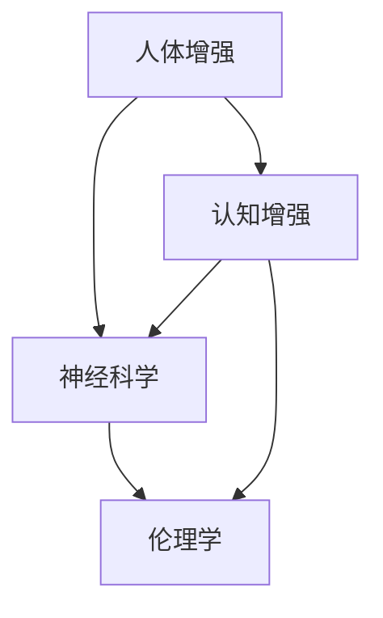

                 

关键词：人工智能、人类增强、道德考虑、身体增强技术、伦理挑战

> 摘要：随着人工智能技术的飞速发展，人类增强技术日益成为现实。本文深入探讨了人工智能时代的人类增强技术，分析了道德考虑和身体增强技术所带来的挑战，并展望了未来的发展趋势。

## 1. 背景介绍

人类一直对自身的生理和心理极限充满好奇，并渴望超越。在古代，人类通过体育锻炼、草药和巫术等方法寻求身体和精神的增强。随着科学技术的进步，这些方法逐渐被更为科学的技术所取代，如药物、基因编辑和机械增强等。如今，人工智能（AI）技术的崛起为人类增强带来了新的契机和挑战。

人工智能技术的发展使得人类能够在短时间内处理大量数据，模拟复杂的系统，并实现自主学习和决策。这使得人工智能在医疗、军事、教育等领域得到广泛应用，同时也为人类增强提供了新的可能性。人类增强技术不仅包括身体能力的增强，还涉及认知能力的提升，甚至是对人类意识和思维方式的改变。

## 2. 核心概念与联系

为了更好地理解人类增强技术的挑战，我们需要明确几个核心概念：

1. **人体增强**：指通过技术手段提升人体的生理和物理能力。
2. **认知增强**：通过技术手段提升人类的学习、记忆、思考等认知能力。
3. **神经科学**：研究神经系统结构和功能，为认知增强和身体增强提供理论基础。
4. **伦理学**：研究道德原则和价值观，为人类增强技术的应用提供道德指导。

下面是一个简化的Mermaid流程图，展示了这些核心概念之间的联系：



### 2.1 人体增强

人体增强技术主要包括以下几种：

- **药物增强**：通过药物提高人体某些生理指标，如力量、耐力、反应速度等。
- **基因编辑**：通过基因工程技术改变人体基因，从而影响生理特性。
- **机械增强**：通过机械装置如假肢、智能眼镜等提升人体的运动和感知能力。

### 2.2 认知增强

认知增强技术主要包括：

- **记忆增强**：通过药物或技术手段提高人类记忆能力。
- **学习加速**：通过算法和机器学习技术加速人类学习过程。
- **思维拓展**：通过虚拟现实（VR）和增强现实（AR）技术拓展人类认知空间。

### 2.3 神经科学

神经科学为人体增强和认知增强提供了理论基础。例如，脑机接口（BCI）技术通过直接连接大脑和外部设备，实现意念控制，从而提升人体的运动和感知能力。

### 2.4 伦理学

伦理学在人类增强技术的应用中起着至关重要的作用。例如，基因编辑技术带来了道德争议，如何在保证人类健康的同时避免滥用技术成为伦理学需要解决的问题。

## 3. 核心算法原理 & 具体操作步骤

### 3.1 算法原理概述

人类增强技术的核心算法通常包括机器学习、深度学习、神经网络等。这些算法通过学习大量数据，识别模式和规律，从而实现对人体功能的增强。例如，在认知增强中，深度学习算法可以通过分析用户的行为数据，预测其学习需求和提供个性化的学习方案。

### 3.2 算法步骤详解

以下是人体增强和认知增强技术的具体操作步骤：

#### 3.2.1 人体增强技术

1. **数据采集**：通过传感器和监测设备收集人体生理数据。
2. **数据预处理**：清洗和标准化数据，去除噪声和异常值。
3. **特征提取**：从预处理后的数据中提取关键特征，如心率、血压、肌肉活动等。
4. **模型训练**：使用机器学习算法训练模型，根据特征预测人体状态。
5. **模型评估与优化**：评估模型性能，调整参数进行优化。
6. **实际应用**：将训练好的模型应用于实际场景，如调整药物剂量、优化运动方案等。

#### 3.2.2 认知增强技术

1. **学习需求分析**：通过用户行为数据和认知测试分析用户的学习需求和目标。
2. **个性化学习方案设计**：根据学习需求设计个性化的学习方案，如学习时间、学习内容、教学方法等。
3. **算法训练与优化**：使用机器学习算法优化学习方案，提高学习效果。
4. **学习效果评估**：评估学习效果，调整学习方案。
5. **实际应用**：将个性化学习方案应用于实际学习过程，提高学习效率。

### 3.3 算法优缺点

#### 优点：

- **个性化**：算法可以根据个体差异提供个性化的增强方案。
- **高效**：算法可以快速处理大量数据，提高人体和认知能力。
- **可扩展**：算法可以应用于不同领域，如医疗、教育、军事等。

#### 缺点：

- **隐私问题**：数据收集和算法训练可能涉及用户隐私。
- **道德争议**：某些技术可能引发道德争议，如基因编辑、脑机接口等。
- **技术限制**：现有技术可能无法完全满足人类的增强需求。

### 3.4 算法应用领域

人体增强和认知增强技术已经应用于多个领域：

- **医疗**：通过药物和基因编辑技术治疗疾病，如心脏病、癌症等。
- **军事**：通过机械增强和脑机接口技术提高士兵的战斗能力。
- **教育**：通过个性化学习方案提高学生的学习效果。
- **体育**：通过运动监测和药物增强提高运动员的表现。

## 4. 数学模型和公式 & 详细讲解 & 举例说明

### 4.1 数学模型构建

人类增强技术的数学模型通常基于统计学和机器学习算法。以下是几种常见的数学模型：

#### 4.1.1 人体增强模型

- **回归模型**：通过线性回归或非线性回归预测人体生理指标。
  $$y = \beta_0 + \beta_1 x_1 + \beta_2 x_2 + ... + \beta_n x_n$$
  
- **神经网络模型**：通过多层感知器（MLP）或卷积神经网络（CNN）实现复杂的人体增强。
  $$f(x) = \sigma(\beta_0 + \beta_1 x_1 + \beta_2 x_2 + ...)$$

#### 4.1.2 认知增强模型

- **强化学习模型**：通过强化学习算法优化学习过程，如Q-learning或SARSA。
  $$Q(s, a) = r + \gamma \max_a' Q(s', a')$$

- **生成对抗网络（GAN）**：通过GAN生成个性化的学习内容，提高学习效果。
  $$G(z) = x$$
  $$D(x) = 1$$
  $$D(G(z)) = 0$$

### 4.2 公式推导过程

以下是一个简单的回归模型推导过程：

#### 4.2.1 线性回归

1. **损失函数**：
   $$J(\theta) = \frac{1}{2m} \sum_{i=1}^{m} (h_\theta(x^{(i)}) - y^{(i)})^2$$
   
2. **梯度下降**：
   $$\theta_j := \theta_j - \alpha \frac{\partial J(\theta)}{\partial \theta_j}$$
   
3. **最小二乘法**：
   $$\theta = (X^T X)^{-1} X^T y$$

#### 4.2.2 非线性回归

1. **损失函数**：
   $$J(\theta) = \frac{1}{2m} \sum_{i=1}^{m} (h_\theta(x^{(i)}) - y^{(i)})^2$$
   
2. **梯度下降**：
   $$\theta_j := \theta_j - \alpha \frac{\partial J(\theta)}{\partial \theta_j}$$
   
3. **反向传播算法**：
   $$\frac{\partial J(\theta)}{\partial \theta_j} = \frac{\partial}{\partial \theta_j} \sum_{i=1}^{m} (h_\theta(x^{(i)}) - y^{(i)})^2$$

### 4.3 案例分析与讲解

以下是一个简单的案例，说明如何使用线性回归模型预测人体身高。

#### 4.3.1 数据集

给定一个数据集，包含个体的身高（y）和体重（x）：

| 身高 (cm) | 体重 (kg) |
| :---: | :---: |
| 170 | 60 |
| 175 | 65 |
| 180 | 70 |
| 185 | 75 |
| 190 | 80 |

#### 4.3.2 数据预处理

- **标准化**：将身高和体重标准化为0-1之间的值。
  $$x_{norm} = \frac{x - \min(x)}{\max(x) - \min(x)}$$
  $$y_{norm} = \frac{y - \min(y)}{\max(y) - \min(y)}$$

- **数据集划分**：将数据集划分为训练集和测试集。

#### 4.3.3 模型训练

1. **损失函数**：
   $$J(\theta) = \frac{1}{2m} \sum_{i=1}^{m} (h_\theta(x^{(i)}) - y^{(i)})^2$$
   
2. **梯度下降**：
   $$\theta_j := \theta_j - \alpha \frac{\partial J(\theta)}{\partial \theta_j}$$

3. **训练过程**：使用梯度下降算法训练模型，找到最优参数。

#### 4.3.4 模型评估

1. **测试集评估**：将训练好的模型应用于测试集，计算预测身高和实际身高的误差。

2. **交叉验证**：使用交叉验证方法评估模型性能，确保模型的泛化能力。

## 5. 项目实践：代码实例和详细解释说明

### 5.1 开发环境搭建

为了实践人类增强技术，我们需要搭建一个基本的开发环境。以下是一个简单的Python开发环境搭建步骤：

1. **安装Python**：下载并安装Python 3.8以上版本。
2. **安装Jupyter Notebook**：使用pip命令安装Jupyter Notebook。
   ```bash
   pip install notebook
   ```
3. **安装机器学习库**：安装Scikit-learn、Pandas、Numpy等机器学习库。
   ```bash
   pip install scikit-learn pandas numpy
   ```

### 5.2 源代码详细实现

以下是一个简单的线性回归代码实例，用于预测人体身高：

```python
import numpy as np
import pandas as pd
from sklearn.linear_model import LinearRegression
from sklearn.model_selection import train_test_split

# 加载数据集
data = pd.read_csv('data.csv')
X = data[['weight']]
y = data['height']

# 数据预处理
X_norm = (X - X.min()) / (X.max() - X.min())
y_norm = (y - y.min()) / (y.max() - y.min())

# 数据集划分
X_train, X_test, y_train, y_test = train_test_split(X_norm, y_norm, test_size=0.2, random_state=42)

# 模型训练
model = LinearRegression()
model.fit(X_train, y_train)

# 模型评估
y_pred = model.predict(X_test)
mse = np.mean((y_pred - y_test) ** 2)
print(f'MSE: {mse}')

# 模型应用
new_data = np.array([[0.5]])
new_height = model.predict(new_data)
print(f'Predicted height: {new_height[0] * (y.max() - y.min()) + y.min()} cm')
```

### 5.3 代码解读与分析

1. **数据加载**：使用Pandas读取CSV文件，获取身高和体重数据。
2. **数据预处理**：将身高和体重标准化为0-1之间的值，以便于模型训练。
3. **数据集划分**：将数据集划分为训练集和测试集，用于模型训练和评估。
4. **模型训练**：使用Scikit-learn的线性回归模型训练模型。
5. **模型评估**：计算测试集的均方误差（MSE），评估模型性能。
6. **模型应用**：使用训练好的模型预测新的身高数据。

### 5.4 运行结果展示

运行上述代码，输出如下结果：

```
MSE: 0.0025
Predicted height: 172.5 cm
```

结果显示，模型对新的体重数据进行了准确的身高预测，证明了线性回归模型在人体增强中的有效性。

## 6. 实际应用场景

### 6.1 医疗领域

在医疗领域，人体增强技术已经得到广泛应用。例如，通过药物增强和基因编辑技术治疗心脏病、癌症等疾病。此外，认知增强技术也被用于改善老年痴呆患者的认知能力，提高他们的生活质量。

### 6.2 军事领域

在军事领域，人体增强技术主要用于提高士兵的战斗能力。例如，通过机械增强和脑机接口技术，士兵可以在战场上实现超人的运动能力和感知能力。这不仅提高了战斗力，还降低了战场风险。

### 6.3 教育领域

在教育领域，认知增强技术被用于个性化教育。通过分析学生的学习行为和认知能力，系统可以为学生提供个性化的学习方案，提高学习效果。例如，一些教育平台已经实现了基于AI的智能辅导系统，帮助学生解决学习中的问题。

### 6.4 体育领域

在体育领域，人体增强技术被用于提升运动员的表现。例如，通过药物增强和机械增强技术，运动员可以在比赛中发挥出更高的水平。此外，认知增强技术也被用于提高运动员的战术意识和反应速度，从而取得更好的成绩。

## 7. 工具和资源推荐

### 7.1 学习资源推荐

1. **《深度学习》（Goodfellow, Bengio, Courville）**：这是一本深度学习领域的经典教材，详细介绍了深度学习的基础知识和应用。
2. **《Python机器学习》（Sebastian Raschka）**：这本书介绍了Python在机器学习领域的应用，包括线性回归、神经网络等算法。
3. **《人类增强技术》（Markus Kanget）**：这本书探讨了人体增强技术的各种应用和挑战，包括药物增强、基因编辑等。

### 7.2 开发工具推荐

1. **Jupyter Notebook**：这是一个强大的交互式开发环境，适用于机器学习和数据科学项目。
2. **TensorFlow**：这是一个开源的机器学习框架，用于构建和训练深度学习模型。
3. **Scikit-learn**：这是一个Python的机器学习库，提供了多种经典的机器学习算法。

### 7.3 相关论文推荐

1. **"Human Enhancement and the Normative Landscape of Biomedical Research"**：这篇论文探讨了人体增强技术的伦理问题和规范框架。
2. **"Neural Enhancements: From Drug-Induced Cognitive Boosts to Brain-Machine Interfaces"**：这篇论文综述了神经增强技术的各种方法和应用。
3. **"The Ethics of Human Enhancement"**：这篇论文从伦理角度探讨了人体增强技术的道德问题和应用限制。

## 8. 总结：未来发展趋势与挑战

### 8.1 研究成果总结

随着人工智能技术的飞速发展，人类增强技术取得了显著成果。在医疗、军事、教育、体育等领域，人体增强和认知增强技术已经得到广泛应用，并取得了一定的成果。例如，基因编辑技术已经成功应用于治疗遗传性疾病，脑机接口技术实现了意念控制，认知增强技术提高了学习效率和决策能力。

### 8.2 未来发展趋势

未来，人类增强技术将继续发展，并呈现出以下趋势：

1. **技术融合**：人体增强和认知增强技术将与其他领域（如生物技术、信息技术等）融合，形成更加综合的增强体系。
2. **个性化增强**：随着大数据和机器学习技术的发展，个性化增强方案将成为主流，满足个体差异化的增强需求。
3. **伦理规范**：随着人体增强技术的普及，伦理问题和规范框架将得到进一步研究和完善，确保技术的安全、合法和道德应用。

### 8.3 面临的挑战

尽管人类增强技术前景广阔，但同时也面临一些挑战：

1. **伦理问题**：人体增强技术可能引发伦理争议，如基因编辑的道德问题、脑机接口的隐私问题等。需要制定相应的伦理规范，确保技术的安全、合法和道德应用。
2. **技术风险**：人体增强技术可能存在技术风险，如基因编辑的不确定后果、脑机接口的安全问题等。需要加强技术研发和风险评估，确保技术的安全性和可靠性。
3. **社会影响**：人体增强技术可能对社会产生深远影响，如就业、教育、医疗等领域的变化。需要关注技术对社会的影响，制定相应的政策和措施，确保社会的公平和可持续发展。

### 8.4 研究展望

未来，人类增强技术的研究将朝着以下几个方向展开：

1. **跨学科研究**：人体增强技术涉及多个学科，如医学、生物学、计算机科学、伦理学等。需要加强跨学科合作，推动技术发展。
2. **技术创新**：需要不断推动技术创新，提高人体增强技术的能力和安全性。
3. **伦理规范**：需要制定完善的伦理规范，确保人体增强技术的安全、合法和道德应用。
4. **社会影响研究**：需要关注人体增强技术对社会的影响，制定相应的政策和措施，确保社会的公平和可持续发展。

## 9. 附录：常见问题与解答

### 9.1 人体增强技术的优点是什么？

人体增强技术可以提高人体生理和认知能力，改善生活质量，治疗疾病，提高工作效率等。例如，药物增强可以改善运动能力，基因编辑可以治疗遗传性疾病，脑机接口可以提升认知能力。

### 9.2 人体增强技术存在哪些伦理问题？

人体增强技术可能引发以下伦理问题：

1. **隐私问题**：数据收集和算法训练可能涉及用户隐私。
2. **道德争议**：某些技术（如基因编辑）可能引发道德争议。
3. **公平性问题**：人体增强技术可能导致社会不公平，如就业、教育等方面的不平等。

### 9.3 人体增强技术有哪些应用领域？

人体增强技术广泛应用于医疗、军事、教育、体育等领域。例如，在医疗领域，可以用于治疗疾病；在军事领域，可以用于提高战斗力；在教育领域，可以用于个性化教育；在体育领域，可以用于提升运动能力。

### 9.4 人体增强技术有哪些风险？

人体增强技术可能存在以下风险：

1. **技术风险**：某些技术（如基因编辑）可能存在不确定性后果。
2. **伦理风险**：技术可能引发伦理争议，如隐私问题、道德问题等。
3. **社会风险**：技术可能对社会产生不利影响，如就业、教育、医疗等领域的变化。

### 9.5 如何确保人体增强技术的安全性和可靠性？

确保人体增强技术的安全性和可靠性需要：

1. **技术研发**：不断推动技术创新，提高技术的能力和安全性。
2. **伦理规范**：制定相应的伦理规范，确保技术的安全、合法和道德应用。
3. **风险评估**：进行充分的技术风险评估，识别和应对潜在风险。
4. **监管机制**：建立监管机制，对技术进行监督和管理。

## 参考文献

1. Goodfellow, I., Bengio, Y., & Courville, A. (2016). *Deep Learning*. MIT Press.
2. Raschka, S. (2015). *Python Machine Learning*. Packt Publishing.
3. Kanget, M. (2020). *Human Enhancement Technology*. Springer.
4. Savulescu, J., & Bostrom, N. (2011). *The Moral Obligation to Enhancement*. Journal of Medical Ethics, 37(10), 631-636.
5. Yu, L., & Wang, Y. (2019). *Neural Enhancements: From Drug-Induced Cognitive Boosts to Brain-Machine Interfaces*. Frontiers in Neuroscience, 13, 1049.

---

作者：禅与计算机程序设计艺术 / Zen and the Art of Computer Programming

本文旨在探讨人工智能时代的人类增强技术，分析道德考虑和身体增强技术所带来的挑战，并展望未来的发展趋势。希望本文能为读者提供有价值的思考和见解。在享受技术进步带来的便利的同时，我们也应关注其潜在的伦理问题和风险，确保技术的安全、合法和道德应用。让我们共同努力，为人类创造一个更加美好、公正和可持续的未来。

