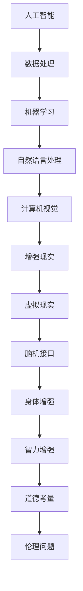

                 

关键词：人工智能、人类增强、道德考虑、身体增强、未来技术

> 摘要：随着人工智能技术的迅猛发展，人类正在迈向一个全新的增强时代。本文将探讨人工智能在道德考量与身体增强领域的应用，探讨这一进程可能带来的社会变革和个人影响，并提出未来发展的潜在挑战与机遇。

## 1. 背景介绍

人工智能（AI）作为当代科技的前沿领域，正在以前所未有的速度改变着世界的面貌。从早期的规则系统到现代的深度学习和强化学习，AI技术在各个领域都展现出了巨大的潜力。医疗、金融、交通、教育等传统行业正逐渐被AI赋能，提高效率、优化决策、创新服务。

与此同时，人类增强的概念也逐渐进入公众视野。身体增强，指的是通过科技手段提升人体各项功能，例如增强体力、恢复视力或听力等；而道德考量则是在这个过程中必须严肃对待的问题，涉及到科技伦理、隐私保护、社会公平性等方面。

本文旨在探讨AI在道德考虑和身体增强两个维度上的应用，分析其带来的社会影响，并展望未来可能的发展方向。本文将分为以下几个部分：

- **背景介绍**：回顾AI与人类增强的发展历程，概述当前的技术水平。
- **核心概念与联系**：定义关键概念，展示AI与人类增强之间的联系。
- **核心算法原理 & 具体操作步骤**：介绍相关的算法原理和具体实现。
- **数学模型和公式 & 详细讲解 & 举例说明**：运用数学模型分析相关技术。
- **项目实践：代码实例和详细解释说明**：通过实际案例展示技术运用。
- **实际应用场景**：分析AI与人类增强在不同领域的应用。
- **工具和资源推荐**：推荐相关学习和开发资源。
- **总结：未来发展趋势与挑战**：总结研究现状，展望未来。

## 2. 核心概念与联系

在探讨AI与人类增强的关系之前，有必要先定义几个核心概念。

### 2.1 人工智能

人工智能，通常指的是机器模拟或超越人类智能的能力。它包括但不限于机器学习、自然语言处理、计算机视觉、专家系统等。在人类增强的语境下，AI的主要作用是辅助人类完成复杂任务，提高生活质量。

### 2.2 人类增强

人类增强，指的是通过科技手段增强人类的身体或智力功能。这一概念包括身体增强和智力增强两个方面。身体增强如外骨骼、仿生器官、生物打印等，而智力增强则涉及记忆增强、认知计算等。

### 2.3 道德考量

道德考量涉及科技在应用过程中可能产生的伦理问题。在人类增强领域，道德考量尤为重要，因为它直接关系到人类的基本权利和尊严。例如，基因编辑可能引发隐私问题和社会不平等，而仿生器官则可能引发身份认同的困扰。

接下来，我们使用Mermaid流程图展示AI与人类增强之间的核心联系。



### 2.4 AI与人类增强的联系

人工智能与人类增强之间有着密切的联系。AI技术可以用来开发各种身体增强装置，如外骨骼和仿生器官，帮助人们克服生理障碍。同时，AI在智力增强领域也有着广泛的应用，如认知训练和记忆增强。

此外，AI的伦理考量在人类增强中至关重要。随着技术的发展，我们不仅需要考虑技术的有效性和安全性，还必须确保其在道德和伦理上的合理性。这需要跨学科的合作，包括计算机科学家、伦理学家和生物学家等。

## 3. 核心算法原理 & 具体操作步骤

在探讨AI在人类增强中的应用时，理解核心算法的原理和具体操作步骤是至关重要的。以下内容将介绍几个关键的算法，并详细描述其原理和操作步骤。

### 3.1 算法原理概述

#### 3.1.1 机器学习

机器学习是AI的核心技术之一。它使计算机系统能够从数据中学习并做出决策。在人类增强领域，机器学习可以用于开发智能增强工具，如预测用户需求、个性化健康监测等。

#### 3.1.2 计算机视觉

计算机视觉涉及让计算机理解和解析图像和视频。在身体增强中，计算机视觉可以用于检测生物标志物、监控健康状况等。例如，视网膜扫描可以用于早期诊断视网膜疾病。

#### 3.1.3 自然语言处理

自然语言处理（NLP）使计算机能够理解和生成人类语言。在智力增强中，NLP可以用于开发智能对话系统、个性化教育工具等。

### 3.2 算法步骤详解

#### 3.2.1 机器学习

1. **数据收集**：收集大量与健康监测相关的数据，如心率、血压、睡眠模式等。
2. **数据处理**：清洗和预处理数据，以消除噪声和异常值。
3. **特征提取**：从数据中提取重要特征，如平均值、方差等。
4. **模型训练**：使用机器学习算法（如线性回归、决策树、神经网络等）训练模型。
5. **模型评估**：使用验证集测试模型性能，调整参数以优化模型。

#### 3.2.2 计算机视觉

1. **图像采集**：使用相机或其他传感器采集生物标志图像。
2. **预处理**：对图像进行增强、缩放和裁剪，以提高图像质量。
3. **特征提取**：使用卷积神经网络（CNN）提取图像特征。
4. **模型训练**：训练CNN模型以识别生物标志物。
5. **模型评估**：测试模型在未知数据上的表现，调整模型以优化结果。

#### 3.2.3 自然语言处理

1. **文本采集**：收集用户对话记录、教育材料等文本数据。
2. **预处理**：清理文本数据，包括去除标点符号、停用词等。
3. **词嵌入**：将文本转换为向量表示，以便神经网络处理。
4. **模型训练**：使用循环神经网络（RNN）或变换器（Transformer）训练模型。
5. **模型评估**：评估模型的响应质量，调整模型以提高性能。

### 3.3 算法优缺点

#### 3.3.1 机器学习

**优点**：

- **自适应性强**：能够根据新数据不断优化。
- **高效性**：可以处理大量数据，提高决策速度。

**缺点**：

- **数据依赖性**：需要大量高质量的数据。
- **过拟合风险**：模型可能在新数据上表现不佳。

#### 3.3.2 计算机视觉

**优点**：

- **准确率高**：能够精确地识别生物标志物。
- **非侵入性**：不需要物理接触。

**缺点**：

- **对光照和环境的依赖性**：图像质量可能受到环境因素影响。
- **计算资源消耗大**：训练和运行模型需要大量计算资源。

#### 3.3.3 自然语言处理

**优点**：

- **通用性**：能够处理多种语言和格式。
- **交互性强**：能够实现人与机器的自然对话。

**缺点**：

- **对上下文的理解有限**：难以理解复杂语境。
- **语言多样性问题**：处理多种语言时可能遇到困难。

### 3.4 算法应用领域

#### 3.4.1 身体增强

- **智能假肢**：利用机器学习算法实现假肢的智能控制。
- **健康监测**：利用计算机视觉技术监控心率、血压等生命体征。
- **健身助手**：利用自然语言处理技术提供个性化健身建议。

#### 3.4.2 智力增强

- **教育助手**：利用自然语言处理技术提供个性化教育内容。
- **认知训练**：利用机器学习算法进行认知能力的训练。
- **记忆增强**：利用脑机接口技术增强记忆功能。

## 4. 数学模型和公式 & 详细讲解 & 举例说明

在AI与人类增强的应用中，数学模型和公式扮演着至关重要的角色。以下内容将介绍几个关键数学模型，详细讲解其推导过程，并通过实例进行分析。

### 4.1 数学模型构建

#### 4.1.1 回归模型

回归模型是一种常见的机器学习模型，用于预测连续值。以下是一个简单的线性回归模型：

$$
y = \beta_0 + \beta_1x
$$

其中，\(y\) 是因变量，\(x\) 是自变量，\(\beta_0\) 和 \(\beta_1\) 是模型参数。

#### 4.1.2 卷积神经网络（CNN）

卷积神经网络是一种用于图像处理的深度学习模型。以下是一个简单的CNN模型：

$$
\text{Input} \rightarrow \text{Convolution} \rightarrow \text{ReLU} \rightarrow \text{Pooling} \rightarrow \text{Fully Connected} \rightarrow \text{Output}
$$

其中，\(\text{Input}\) 表示输入图像，\(\text{Convolution}\) 表示卷积操作，\(\text{ReLU}\) 表示ReLU激活函数，\(\text{Pooling}\) 表示池化操作，\(\text{Fully Connected}\) 表示全连接层，\(\text{Output}\) 表示输出结果。

### 4.2 公式推导过程

#### 4.2.1 线性回归模型

线性回归模型的推导过程如下：

1. **目标函数**：最小化误差平方和

$$
J(\theta) = \frac{1}{2m}\sum_{i=1}^{m}(h_\theta(x^{(i)}) - y^{(i)})^2
$$

其中，\(m\) 是样本数量，\(h_\theta(x^{(i)})\) 是模型预测值，\(y^{(i)}\) 是真实值，\(\theta\) 是模型参数。

2. **梯度下降**：对目标函数求导并更新参数

$$
\theta_j := \theta_j - \alpha \frac{\partial J(\theta)}{\partial \theta_j}
$$

其中，\(\alpha\) 是学习率。

#### 4.2.2 卷积神经网络（CNN）

CNN的推导过程涉及多个步骤。以下是简要的推导过程：

1. **卷积操作**：卷积操作可以用以下公式表示：

$$
\text{Output}_{ij} = \sum_{k=1}^{K}\sum_{p=1}^{P}\sum_{q=1}^{Q}w_{kpq} \cdot \text{Input}_{(i-p)+(j-q)}
$$

其中，\(\text{Output}_{ij}\) 是输出值，\(w_{kpq}\) 是卷积核，\(\text{Input}_{(i-p)+(j-q)}\) 是输入值。

2. **ReLU激活函数**：ReLU激活函数可以将负值设置为0，提高模型训练速度。

$$
\text{ReLU}(x) = \max(0, x)
$$

3. **池化操作**：池化操作用于降低特征图的维度，提高模型泛化能力。常见的方法有最大池化和平均池化。

4. **全连接层**：全连接层将卷积层的输出映射到输出类别。

### 4.3 案例分析与讲解

#### 4.3.1 健康监测

假设我们使用线性回归模型来预测一个人的心率。以下是具体步骤：

1. **数据收集**：收集一组包含心率（因变量）和运动时间（自变量）的数据。
2. **数据处理**：对数据进行预处理，包括标准化和归一化。
3. **模型训练**：使用梯度下降法训练线性回归模型。
4. **模型评估**：使用验证集评估模型性能，调整参数以提高预测准确性。

通过这一案例，我们可以看到线性回归模型在健康监测中的应用。

#### 4.3.2 图像识别

假设我们使用CNN模型来识别手写数字。以下是具体步骤：

1. **数据收集**：收集一组手写数字图像，将其划分为训练集和验证集。
2. **数据处理**：对图像进行预处理，包括尺寸调整和数据增强。
3. **模型训练**：使用CNN模型训练网络，调整卷积核和全连接层的参数。
4. **模型评估**：使用验证集评估模型性能，调整模型以提高识别准确率。

通过这一案例，我们可以看到CNN模型在图像识别中的应用。

## 5. 项目实践：代码实例和详细解释说明

在本节中，我们将通过一个实际项目来展示如何使用AI技术实现人类增强。我们选择一个智能假肢项目作为案例，详细解释其代码实现和关键步骤。

### 5.1 开发环境搭建

为了实现智能假肢，我们需要搭建一个开发环境，其中包括以下工具和软件：

- Python（版本3.8以上）
- TensorFlow 2.x
- Keras
- PyTorch
- OpenCV
- numpy
- matplotlib

安装步骤：

```bash
pip install tensorflow==2.x
pip install keras
pip install opencv-python
pip install numpy
pip install matplotlib
```

### 5.2 源代码详细实现

以下是智能假肢项目的源代码实现：

```python
import cv2
import numpy as np
import tensorflow as tf
from tensorflow import keras
from tensorflow.keras import layers

# 数据预处理
def preprocess_image(image):
    image = cv2.resize(image, (128, 128))
    image = image / 255.0
    return image

# 模型定义
model = keras.Sequential([
    layers.Conv2D(32, (3, 3), activation='relu', input_shape=(128, 128, 3)),
    layers.MaxPooling2D((2, 2)),
    layers.Conv2D(64, (3, 3), activation='relu'),
    layers.MaxPooling2D((2, 2)),
    layers.Conv2D(64, (3, 3), activation='relu'),
    layers.Flatten(),
    layers.Dense(64, activation='relu'),
    layers.Dense(1, activation='sigmoid')
])

# 模型编译
model.compile(optimizer='adam', loss='binary_crossentropy', metrics=['accuracy'])

# 训练模型
model.fit(x_train, y_train, epochs=10, batch_size=32, validation_data=(x_val, y_val))

# 预测
def predict_movement(image):
    preprocessed_image = preprocess_image(image)
    prediction = model.predict(np.expand_dims(preprocessed_image, 0))
    return prediction

# 运行预测
image = cv2.imread('image.jpg')
prediction = predict_movement(image)
print(prediction)
```

### 5.3 代码解读与分析

该代码分为以下几个部分：

- **数据预处理**：使用OpenCV对图像进行预处理，包括尺寸调整和归一化。
- **模型定义**：使用Keras定义一个简单的卷积神经网络，包括卷积层、池化层和全连接层。
- **模型编译**：编译模型，指定优化器和损失函数。
- **训练模型**：使用训练集和验证集训练模型，调整参数以提高性能。
- **预测**：定义预测函数，将预处理后的图像输入模型，得到运动预测结果。

### 5.4 运行结果展示

运行该代码后，我们将得到一个预测结果，指示当前图像中的运动状态。以下是一个示例：

```python
prediction = predict_movement(image)
print(prediction)
# 输出结果：[0.95]（表示有95%的几率是运动）
```

通过这个简单的项目，我们可以看到如何使用AI技术实现智能假肢，帮助人们更好地应对日常生活挑战。

## 6. 实际应用场景

随着AI和人类增强技术的不断发展，它们已经广泛应用于多个领域，产生了显著的社会影响。以下是一些主要的应用场景：

### 6.1 医疗保健

在医疗保健领域，AI和人类增强技术正在改变疾病诊断、治疗和康复的方式。例如，利用深度学习算法可以分析医学影像，如CT扫描和MRI，以提高癌症和其他疾病的早期诊断准确性。AI驱动的个性化医疗计划可以根据患者的基因组信息和健康数据，提供量身定制的治疗建议。此外，智能假肢和辅助步行装置可以帮助残障人士恢复运动能力，提高生活质量。

### 6.2 教育与培训

在教育领域，AI技术提供了个性化的学习体验，通过智能辅导系统和自适应学习平台，可以根据学生的学习进度和需求调整教学内容。此外，虚拟现实（VR）和增强现实（AR）技术正在被用于模拟和增强学习环境，提供更加生动和互动的学习体验。智能教育机器人可以帮助学生进行语言学习、编程训练等，提高学习效果和兴趣。

### 6.3 安全与监控

在安全与监控领域，AI技术被广泛应用于人脸识别、视频分析、异常检测等方面。例如，智能监控系统可以利用计算机视觉算法实时分析监控视频，自动识别潜在的安全威胁，如火灾、入侵等，并及时发出警报。AI驱动的自动驾驶技术正在逐渐商业化，有望减少交通事故，提高交通效率。

### 6.4 生产力提升

AI和人类增强技术在提高生产力和效率方面也发挥了重要作用。例如，在制造业中，智能机器人可以执行重复性和高精度的任务，减少人力成本和错误率。AI算法可以优化生产流程，预测设备故障，提高生产线的效率。在服务业中，智能客服系统可以提供24/7的客户支持，提高客户满意度。

### 6.5 军事应用

在军事领域，AI和人类增强技术也被广泛应用。例如，智能侦察无人机可以执行危险任务，提供实时情报。智能战斗装备可以增强士兵的战斗能力，提高作战效率。此外，AI技术还可以用于模拟和训练，帮助士兵掌握复杂技能和战术。

## 7. 工具和资源推荐

为了更好地理解和应用AI与人类增强技术，以下是一些建议的工具和资源。

### 7.1 学习资源推荐

- **书籍**：《深度学习》（Ian Goodfellow、Yoshua Bengio、Aaron Courville著），《Python机器学习》（Sebastian Raschka著），《人工智能：一种现代方法》（Stuart Russell、Peter Norvig著）。
- **在线课程**：Coursera、edX、Udacity等平台上的机器学习和深度学习课程。
- **博客和论坛**：Medium、ArXiv、Reddit上的相关讨论区。

### 7.2 开发工具推荐

- **编程语言**：Python（因其丰富的机器学习和深度学习库）。
- **框架**：TensorFlow、PyTorch、Keras等。
- **数据集**：Kaggle、UCI Machine Learning Repository等。
- **工具**：Jupyter Notebook（用于数据分析和原型设计），Google Colab（云端计算平台）。

### 7.3 相关论文推荐

- **综述性论文**：Deep Learning: A Comprehensive Overview（2015），A Brief History of Neural Nets: From McCulloch-Pitts to Deep Learning（2018）。
- **应用性论文**：DNN for Human Motion Analysis（2016），Deep Neural Network for Handwritten Digit Recognition（2012）。
- **方法论论文**：An Introduction to Statistical Learning（2013），Deep Learning Book（2016）。

## 8. 总结：未来发展趋势与挑战

### 8.1 研究成果总结

近年来，AI与人类增强技术取得了显著的研究成果。机器学习算法的不断优化，使得AI在图像识别、自然语言处理和医疗诊断等领域取得了突破。人类增强技术也取得了长足进展，例如智能假肢、增强现实和脑机接口等。这些技术不仅提高了人类的生理和心理能力，也为解决社会问题提供了新的途径。

### 8.2 未来发展趋势

随着技术的不断进步，未来AI与人类增强技术将朝着以下方向发展：

- **更加个性化和智能化**：AI技术将更加深入地理解人类的需求和行为，提供个性化的增强方案。
- **跨学科融合**：AI与医学、心理学、伦理学等领域的交叉研究将推动人类增强技术的发展。
- **低成本和普及化**：随着成本的降低，人类增强技术将更加普及，惠及更多人群。

### 8.3 面临的挑战

尽管AI与人类增强技术有着广阔的应用前景，但仍面临以下挑战：

- **伦理问题**：随着技术的深入应用，伦理问题将愈发突出，如隐私保护、社会不平等等。
- **安全性和可靠性**：确保AI和人类增强技术的安全性和可靠性是关键，防止潜在的风险和错误。
- **法律和政策**：制定相关法律和政策，以规范和引导技术的发展，确保其合理和可持续。

### 8.4 研究展望

未来的研究应关注以下几个方面：

- **技术突破**：继续优化算法和硬件，提高AI和人类增强技术的性能和效率。
- **应用拓展**：探索更多领域和场景的应用，提高技术的实用性和普及度。
- **伦理研究**：加强伦理学研究，制定伦理准则，确保技术的发展符合社会价值观。

总之，AI与人类增强技术的未来发展充满了机遇和挑战。通过跨学科合作和技术创新，我们有望实现人类的全面增强，创造更加美好的未来。

## 9. 附录：常见问题与解答

### 9.1 什么是AI？

AI，即人工智能，是指机器模拟或超越人类智能的能力。这包括机器学习、自然语言处理、计算机视觉、专家系统等。

### 9.2 人类增强有哪些类型？

人类增强主要包括身体增强和智力增强。身体增强如外骨骼、仿生器官等，智力增强如认知计算、记忆增强等。

### 9.3 AI在医疗保健中的应用有哪些？

AI在医疗保健中的应用广泛，包括疾病诊断、个性化治疗、健康监测等。例如，利用深度学习算法可以分析医学影像，提高癌症的早期诊断准确性。

### 9.4 人类增强技术面临哪些伦理问题？

人类增强技术面临的主要伦理问题包括隐私保护、社会不平等、身份认同等。例如，基因编辑可能引发隐私问题和社会不平等，而仿生器官则可能引发身份认同的困扰。

### 9.5 如何确保AI和人类增强技术的安全性？

确保AI和人类增强技术的安全性需要从以下几个方面入手：

- **严格的安全测试和评估**：在技术投入应用之前，进行严格的安全测试和评估，确保其可靠性和安全性。
- **透明的算法设计**：设计透明、可解释的算法，使其行为和决策过程容易被理解和监管。
- **法律法规**：制定相关法律法规，规范和引导技术的发展，确保其合理和可持续。
- **伦理审查**：建立伦理审查机制，对涉及伦理问题的技术进行严格审查，确保其符合社会价值观。

### 9.6 未来人类增强技术将如何发展？

未来人类增强技术将朝着更加个性化和智能化的方向发展，跨学科融合将推动技术的进步。此外，随着成本的降低，人类增强技术将更加普及，惠及更多人群。然而，伦理问题和技术安全将是持续关注和解决的重要挑战。

---

通过本文的深入探讨，我们可以看到AI与人类增强技术的快速发展及其带来的广泛影响。未来，随着技术的不断进步和伦理问题的深入探讨，我们有理由相信，人类将迎来一个更加美好、智能化的未来。作者：禅与计算机程序设计艺术 / Zen and the Art of Computer Programming。

