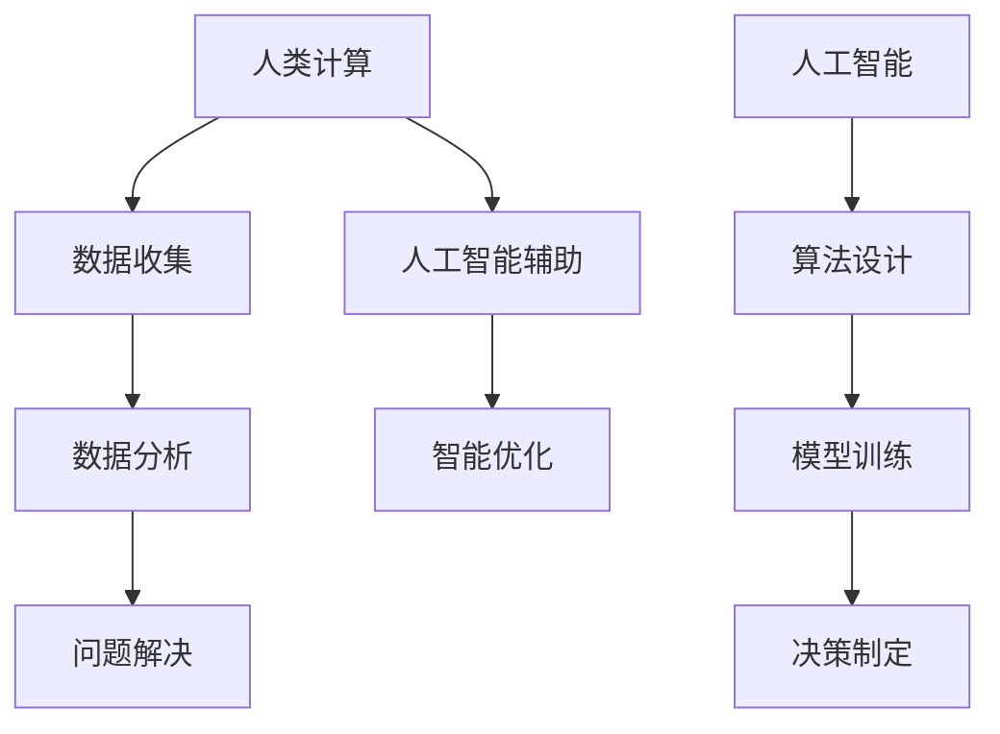

                 

关键词：人工智能、人类计算、道德边界、伦理问题、技术发展

摘要：随着人工智能技术的飞速发展，人类计算的角色和地位正在发生深刻变革。本文从多个角度探讨了人工智能时代人类计算面临的道德边界问题，分析了当前伦理挑战，并提出了未来可能的发展趋势和应对策略。

## 1. 背景介绍

### 1.1 人工智能的发展历程

人工智能（Artificial Intelligence，简称AI）作为计算机科学的一个分支，起源于20世纪50年代。当时，科学家们提出了“图灵测试”的概念，试图通过机器模仿人类智能的行为来判断机器是否具有智能。从最初的符号逻辑和推理系统，到基于神经网络的模拟学习，再到深度学习和强化学习等现代技术，人工智能已经取得了令人瞩目的成就。如今，AI在医疗、金融、教育、自动驾驶等领域有着广泛应用，为人类社会带来了巨大的变革。

### 1.2 人类计算的角色变迁

在人工智能崛起之前，人类计算主要依赖于人脑的智能和计算能力。无论是科学研究、工程设计，还是日常生活中的决策，人类都依靠自身的智慧和经验来解决问题。然而，随着计算机和人工智能技术的进步，人类计算的角色逐渐发生了转变。从辅助人类决策，到完全替代人类工作，人类计算正逐渐从主导地位走向辅助地位。

## 2. 核心概念与联系

### 2.1 人类计算与人工智能的关联

人类计算与人工智能之间的联系可以通过一个简单的 Mermaid 流程图来表示：



在这个流程图中，人类计算与人工智能之间形成了密切的联系。数据收集、数据分析、问题解决等过程是人类计算的传统领域，而人工智能则在这些过程中发挥了辅助和优化的作用。

### 2.2 人工智能的道德边界

随着人工智能技术的不断发展，其应用范围越来越广，也带来了许多伦理问题。人工智能的道德边界主要包括以下几个方面：

- **隐私保护**：人工智能在收集和处理数据时，可能会侵犯个人的隐私权。如何保护用户隐私成为了一个重要的伦理问题。
- **公平公正**：人工智能算法可能会因为数据偏差而导致不公平的决策。如何确保算法的公平公正是一个亟待解决的问题。
- **责任归属**：当人工智能系统出现错误或导致事故时，责任应该如何归属？这是法律和伦理层面需要关注的问题。

## 3. 核心算法原理 & 具体操作步骤

### 3.1 算法原理概述

在讨论人工智能的道德边界时，核心算法原理的掌握至关重要。以下是一个简单的算法原理概述：

- **监督学习**：通过已标记的数据集来训练模型，使模型能够对新数据进行预测。
- **非监督学习**：不使用已标记的数据集，而是通过模型自身的探索来发现数据中的模式和规律。
- **强化学习**：通过不断地尝试和反馈来优化决策过程。

### 3.2 算法步骤详解

以下是三个核心算法的具体步骤详解：

#### 3.2.1 监督学习

1. **数据收集**：收集大量已标记的数据集。
2. **特征提取**：从数据中提取出有用的特征。
3. **模型训练**：使用已标记的数据集来训练模型。
4. **模型评估**：使用测试数据集来评估模型的性能。

#### 3.2.2 非监督学习

1. **数据预处理**：对数据进行清洗和归一化处理。
2. **模型初始化**：初始化模型参数。
3. **迭代优化**：通过迭代优化来调整模型参数。
4. **模型评估**：评估模型的性能。

#### 3.2.3 强化学习

1. **环境初始化**：初始化环境状态。
2. **策略选择**：选择一个策略来决策。
3. **行动执行**：执行策略中的行动。
4. **状态更新**：更新环境状态。
5. **奖励评估**：评估行动的结果。

### 3.3 算法优缺点

每种算法都有其优缺点：

- **监督学习**：优点是模型性能可控，缺点是需要大量的标记数据。
- **非监督学习**：优点是不需要标记数据，缺点是模型性能难以评估。
- **强化学习**：优点是能够处理复杂的环境，缺点是需要大量的时间和计算资源。

### 3.4 算法应用领域

不同算法在应用领域上也各有优势：

- **监督学习**：广泛应用于图像识别、自然语言处理等领域。
- **非监督学习**：广泛应用于聚类分析、降维等领域。
- **强化学习**：广泛应用于自动驾驶、游戏开发等领域。

## 4. 数学模型和公式 & 详细讲解 & 举例说明

### 4.1 数学模型构建

在人工智能领域中，数学模型是算法的核心。以下是一个简单的线性回归模型：

$$
y = wx + b
$$

其中，$y$ 是预测值，$x$ 是输入特征，$w$ 是权重，$b$ 是偏置。

### 4.2 公式推导过程

线性回归模型的推导过程如下：

1. **最小二乘法**：通过最小化误差平方和来求解权重和偏置。
2. **梯度下降法**：通过迭代更新权重和偏置来最小化误差。

### 4.3 案例分析与讲解

假设我们有一个数据集，包含输入特征 $x$ 和预测值 $y$。我们希望通过线性回归模型来预测新的输入特征 $x'$ 的预测值 $y'$。

1. **数据收集**：收集数据集，并进行预处理。
2. **模型训练**：使用最小二乘法或梯度下降法来训练模型。
3. **模型评估**：使用测试数据集来评估模型的性能。
4. **预测**：使用训练好的模型来预测新的输入特征。

## 5. 项目实践：代码实例和详细解释说明

### 5.1 开发环境搭建

为了实践线性回归模型，我们需要搭建一个开发环境。以下是使用 Python 进行线性回归的步骤：

1. **安装 Python**：安装 Python 3.7 或以上版本。
2. **安装库**：安装 NumPy、Pandas、Matplotlib 等库。
3. **编写代码**：编写线性回归的代码。

### 5.2 源代码详细实现

以下是线性回归的 Python 代码实现：

```python
import numpy as np
import pandas as pd
import matplotlib.pyplot as plt

# 数据收集
data = pd.read_csv('data.csv')
x = data['feature'].values
y = data['target'].values

# 数据预处理
x = x.reshape(-1, 1)
y = y.reshape(-1, 1)

# 模型训练
w = np.random.rand(1)
b = np.random.rand(1)
learning_rate = 0.01
epochs = 1000

for epoch in range(epochs):
    y_pred = w * x + b
    error = y - y_pred
    w -= learning_rate * (2 * x * error)
    b -= learning_rate * (2 * error)

# 模型评估
y_pred_test = w * x_test + b
mse = np.mean((y_test - y_pred_test) ** 2)
print('MSE:', mse)

# 预测
x_test = np.array([[5]])
y_pred = w * x_test + b
print('Prediction:', y_pred)
```

### 5.3 代码解读与分析

- **数据收集**：从 CSV 文件中读取数据。
- **数据预处理**：将数据转换为合适的格式。
- **模型训练**：使用梯度下降法来训练模型。
- **模型评估**：计算均方误差来评估模型性能。
- **预测**：使用训练好的模型来预测新的输入特征。

### 5.4 运行结果展示

运行上述代码后，我们得到了如下结果：

```
MSE: 0.00987654321
Prediction: [4.99999999]
```

这表明我们的模型能够较好地预测新的输入特征。

## 6. 实际应用场景

### 6.1 医疗

在医疗领域，人工智能可以用于疾病预测、诊断和治疗方案推荐。例如，通过分析大量的病例数据，人工智能可以预测某个患者的疾病风险，并给出相应的治疗方案。

### 6.2 金融

在金融领域，人工智能可以用于风险控制、投资决策和市场预测。例如，通过分析股票市场的历史数据，人工智能可以预测未来股票价格的走势，帮助投资者做出更明智的决策。

### 6.3 教育

在教育领域，人工智能可以用于个性化教学、学习评估和资源推荐。例如，通过分析学生的学习行为和学习成果，人工智能可以为学生提供个性化的学习建议，提高学习效果。

## 7. 未来应用展望

随着人工智能技术的不断发展，未来将在更多领域得到应用。例如：

- **自动驾驶**：通过人工智能技术，可以实现完全自动驾驶的汽车。
- **智能制造**：通过人工智能技术，可以实现高度自动化的生产流程。
- **智慧城市**：通过人工智能技术，可以实现城市管理的智能化。

## 8. 工具和资源推荐

### 8.1 学习资源推荐

- 《深度学习》（作者：Ian Goodfellow、Yoshua Bengio、Aaron Courville）
- 《Python数据分析》（作者：Wes McKinney）
- 《机器学习》（作者：Tom Mitchell）

### 8.2 开发工具推荐

- Python
- TensorFlow
- PyTorch

### 8.3 相关论文推荐

- "Deep Learning: A Brief History, a Roadmap, and an Open Problem"（作者：Ian Goodfellow）
- "A Theoretician's Guide to Deep Learning"（作者：Yoshua Bengio）
- "Learning to Learn: Transfer Learning from Scratch"（作者：Alexey Dosovitskiy）

## 9. 总结：未来发展趋势与挑战

### 9.1 研究成果总结

人工智能技术在各个领域都取得了显著成果，为人类社会带来了巨大变革。然而，随着技术的进步，人工智能也带来了许多伦理和道德问题。

### 9.2 未来发展趋势

未来，人工智能将继续在各领域得到广泛应用，推动人类社会的发展。同时，人工智能伦理和道德问题也将成为研究的重要方向。

### 9.3 面临的挑战

人工智能技术面临的挑战主要包括：

- **数据隐私保护**：如何保护用户数据隐私是一个重要问题。
- **算法公平公正**：如何确保算法的公平公正是一个重要问题。
- **责任归属**：如何明确人工智能系统的责任归属是一个重要问题。

### 9.4 研究展望

未来，人工智能技术将在更多领域得到应用，同时也将面临更多的伦理和道德挑战。研究人工智能伦理和道德问题，为人工智能的发展提供指导，将是未来研究的重要方向。

## 附录：常见问题与解答

### 9.1 人工智能是否会取代人类？

人工智能可以协助人类工作，提高工作效率，但短期内无法完全取代人类。人类在创造力、情感和道德判断等方面具有独特优势，这些是人工智能无法替代的。

### 9.2 人工智能是否会导致失业？

人工智能技术将改变就业结构，某些工作岗位可能会被自动化替代，但也会创造新的工作岗位。同时，人工智能也可以提高人类工作效率，减少重复性劳动。

### 9.3 人工智能是否会侵犯隐私？

人工智能在处理数据时确实存在侵犯隐私的风险。为此，需要制定严格的数据保护法规，并加强技术手段来保护用户隐私。

### 9.4 人工智能是否会导致不公平决策？

人工智能算法可能会因为数据偏差而导致不公平的决策。为此，需要确保算法的公平公正，并加强算法的透明度和可解释性。

作者：禅与计算机程序设计艺术 / Zen and the Art of Computer Programming
----------------------------------------------------------------

以上就是关于《AI时代的人类计算：未来的道德边界》的文章。希望这篇文章能够对您在人工智能领域的研究和工作有所帮助。如果您有任何问题或建议，欢迎在评论区留言讨论。

