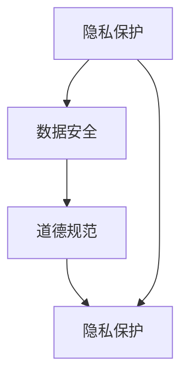

                 

关键词：人工智能，隐私，安全，道德，计算，数据保护，伦理

摘要：随着人工智能（AI）技术的迅猛发展，人类计算正经历着前所未有的变革。本文将从隐私、安全和道德三个角度，探讨AI时代人类计算所面临的挑战与机遇，为人工智能的可持续发展提供理论支持和实践指导。

## 1. 背景介绍

人工智能作为21世纪最具颠覆性的技术之一，已经深刻改变了我们的生活方式和社会结构。从简单的图像识别到复杂的自然语言处理，AI技术在各个领域都取得了显著成果。然而，随着AI技术的广泛应用，隐私、安全和道德问题也逐渐凸显出来。本文将从这三个方面，对AI时代的人类计算进行深入分析。

## 2. 核心概念与联系

### 2.1 隐私

隐私是指个人对其信息进行控制和保护的权利。在AI时代，隐私问题尤为重要，因为AI技术需要大量的数据作为训练素材。然而，这些数据往往包含了个人的敏感信息，如身份、地理位置、健康状况等。如果这些数据被不当使用或泄露，可能会导致严重后果。

### 2.2 安全

安全是指保护计算机系统、网络和数据免受未经授权的访问、篡改或破坏。在AI时代，安全威胁日益加剧，因为AI技术可以被用于各种恶意攻击，如网络钓鱼、勒索软件、人工智能攻击等。

### 2.3 道德

道德是指人们在社会生活中遵循的行为规范和价值观念。在AI时代，道德问题主要体现在如何确保人工智能的发展不违背人类的道德原则，以及如何平衡技术进步与社会责任。

### 2.4 关系

隐私、安全和道德三者之间相互关联，共同构成了AI时代人类计算的核心挑战。隐私保护是确保安全和道德的基础，而安全和道德则是实现隐私保护的关键保障。

## 2.5 Mermaid 流程图



## 3. 核心算法原理 & 具体操作步骤

### 3.1 算法原理概述

在AI时代，为了解决隐私、安全和道德问题，我们需要采用一系列算法和技术。这些算法主要可以分为以下几个类别：

- 隐私保护算法：如差分隐私、同态加密、联邦学习等。
- 安全算法：如密码学、防火墙、入侵检测等。
- 道德算法：如道德决策树、伦理约束生成等。

### 3.2 算法步骤详解

#### 3.2.1 隐私保护算法

隐私保护算法的核心思想是在不泄露敏感信息的前提下，对数据进行处理和分析。具体步骤如下：

1. 数据采集：收集相关数据，如用户行为数据、生物特征数据等。
2. 数据预处理：对数据进行清洗、去噪和归一化等处理。
3. 加密处理：使用加密算法对敏感数据进行加密，保护其隐私。
4. 数据分析：在保证隐私的前提下，对加密后的数据进行挖掘和分析。

#### 3.2.2 安全算法

安全算法的核心思想是保护计算机系统、网络和数据免受攻击。具体步骤如下：

1. 系统加固：对计算机系统和网络进行加固，防止恶意攻击。
2. 防火墙设置：设置防火墙规则，限制未经授权的访问。
3. 入侵检测：使用入侵检测系统，实时监测网络流量，发现潜在威胁。
4. 数据备份：定期对数据进行备份，确保在遭受攻击时能够快速恢复。

#### 3.2.3 道德算法

道德算法的核心思想是确保人工智能系统的行为符合道德规范。具体步骤如下：

1. 道德准则制定：根据相关法律法规和道德原则，制定道德准则。
2. 算法嵌入：将道德准则嵌入到人工智能算法中，确保其行为符合道德规范。
3. 模型训练：使用包含道德准则的数据集，对人工智能模型进行训练。
4. 行为评估：对人工智能系统的行为进行评估，确保其符合道德规范。

### 3.3 算法优缺点

#### 隐私保护算法

优点：

- 保护敏感信息：有效保护用户隐私，防止数据泄露。
- 降低风险：减少因数据泄露导致的潜在风险。

缺点：

- 性能损耗：加密和解密过程会消耗额外计算资源。
- 复杂性增加：需要处理加密和解密等复杂问题。

#### 安全算法

优点：

- 防止攻击：有效防止恶意攻击，保护系统和数据安全。
- 提高可用性：确保系统和数据始终处于可用状态。

缺点：

- 难以防范新攻击：随着攻击手段的不断升级，安全算法难以完全防范新攻击。
- 可能导致误报：在防护过程中，可能会误报正常行为，导致不必要的麻烦。

#### 道德算法

优点：

- 确保合规：确保人工智能系统的行为符合道德规范，减少负面影响。
- 提高信任度：增加用户对人工智能系统的信任度。

缺点：

- 难以量化：道德问题难以量化，难以制定统一的道德准则。
- 可能引发争议：在处理某些道德问题时，可能会引发不同的意见和争议。

### 3.4 算法应用领域

隐私保护算法广泛应用于医疗、金融、社交网络等领域，以确保用户隐私安全。

安全算法广泛应用于政府、企业、个人等领域，以保护系统和数据安全。

道德算法在自动驾驶、智能客服、推荐系统等领域得到广泛应用，以确保人工智能系统的行为符合道德规范。

## 4. 数学模型和公式 & 详细讲解 & 举例说明

### 4.1 数学模型构建

在隐私保护方面，常用的数学模型包括差分隐私模型和同态加密模型。下面分别进行介绍。

#### 差分隐私模型

差分隐私模型是一种用于保护隐私的数学模型，其核心思想是在不泄露敏感信息的前提下，对数据进行处理和分析。具体公式如下：

$$ \Delta_{\epsilon} = \max \left( \frac{||D_{\epsilon} - D_{\epsilon'}||_1}{\sqrt{n}} , \epsilon \right) $$

其中，$D_{\epsilon}$ 和 $D_{\epsilon'}$ 分别表示含有隐私保护和未含有隐私保护的数据集，$n$ 表示数据集的大小，$||\cdot||_1$ 表示L1范数。

#### 同态加密模型

同态加密模型是一种允许在加密数据上进行计算并保持结果的加密方法。其核心思想是通过加密算法，使得在加密数据上进行的计算结果与在明文数据上进行的计算结果相同。具体公式如下：

$$ Enc(x) + Enc(y) = Enc(x + y) $$

$$ Enc(x) \times Enc(y) = Enc(x \times y) $$

其中，$Enc(x)$ 和 $Enc(y)$ 分别表示对明文数据 $x$ 和 $y$ 进行加密的结果。

### 4.2 公式推导过程

#### 差分隐私模型推导

首先，我们考虑一个含有隐私保护的数据集 $D_{\epsilon}$ 和一个未含有隐私保护的数据集 $D_{\epsilon'}$。对于任意的两个数据集 $D_{\epsilon}$ 和 $D_{\epsilon'}$，它们的L1距离可以表示为：

$$ ||D_{\epsilon} - D_{\epsilon'}||_1 = \sum_{i=1}^{n} |x_i - y_i| $$

其中，$x_i$ 和 $y_i$ 分别表示数据集 $D_{\epsilon}$ 和 $D_{\epsilon'}$ 中的第 $i$ 个数据。

然后，我们考虑一个差分隐私机制，其核心思想是在数据集 $D_{\epsilon}$ 上加入噪声，使得 $D_{\epsilon}$ 和 $D_{\epsilon'}$ 之间的差距变得不明显。具体来说，我们可以通过以下公式计算含有隐私保护的数据集 $D_{\epsilon}$：

$$ D_{\epsilon} = D_{\epsilon'} + \epsilon \odot D $$

其中，$\epsilon$ 表示加入的噪声，$\odot$ 表示逐元素相加。

最后，我们考虑差分隐私机制对L1距离的影响。根据上面的公式，我们可以得到：

$$ ||D_{\epsilon} - D_{\epsilon'}||_1 = \sum_{i=1}^{n} |(D_{\epsilon'} + \epsilon \odot D) - D_{\epsilon'}| $$

$$ = \sum_{i=1}^{n} |\epsilon \odot D| $$

$$ \leq \sum_{i=1}^{n} \epsilon_i \cdot ||D||_1 $$

$$ = \epsilon \cdot ||D||_1 $$

其中，$D$ 表示数据集。

根据上面的推导，我们可以得到差分隐私模型的公式：

$$ \Delta_{\epsilon} = \max \left( \frac{||D_{\epsilon} - D_{\epsilon'}||_1}{\sqrt{n}} , \epsilon \right) $$

#### 同态加密模型推导

首先，我们考虑一个明文数据 $x$ 和另一个明文数据 $y$。我们可以将这两个数据加密成密文 $Enc(x)$ 和 $Enc(y)$，其中 $Enc$ 表示加密算法。

然后，我们考虑对这两个密文进行加法和乘法运算。具体来说，我们可以得到以下结果：

$$ Enc(x) + Enc(y) = Enc(x + y) $$

$$ Enc(x) \times Enc(y) = Enc(x \times y) $$

根据上面的公式，我们可以推导出同态加密模型的性质。

### 4.3 案例分析与讲解

#### 案例一：差分隐私在医疗领域的应用

假设我们有一个包含患者隐私信息的医疗数据集，我们希望在不泄露敏感信息的前提下，对数据进行挖掘和分析。为了实现这个目标，我们可以使用差分隐私模型。

首先，我们收集到一组患者的医疗数据，包括诊断结果、治疗方案和病情进展等。然后，我们使用差分隐私模型对数据集进行处理，加入噪声，使得原始数据集和加入噪声后的数据集之间的差距变得不明显。

接着，我们对加入噪声后的数据集进行挖掘和分析，得到一系列结论。由于差分隐私模型的作用，我们无法确定具体哪个患者的数据被用于分析，从而保护了患者的隐私。

#### 案例二：同态加密在金融领域的应用

假设我们有一个金融交易数据集，包含大量的交易记录。我们希望在不泄露交易记录的前提下，对数据进行挖掘和分析，以便发现潜在的欺诈行为。

为了实现这个目标，我们可以使用同态加密模型。

首先，我们将每笔交易记录加密成密文，确保交易记录的隐私保护。然后，我们对加密后的交易记录进行挖掘和分析，发现潜在的欺诈行为。

由于同态加密模型的作用，我们无法直接获取交易记录的明文，从而保护了交易的隐私。

## 5. 项目实践：代码实例和详细解释说明

### 5.1 开发环境搭建

为了实践本文所讨论的算法，我们需要搭建一个合适的开发环境。以下是一个基于Python的示例环境搭建步骤：

1. 安装Python 3.8及以上版本。
2. 安装必要的Python库，如NumPy、Pandas、Scikit-learn等。
3. 安装加密算法库，如PyCryptoDome。

### 5.2 源代码详细实现

以下是实现差分隐私和同态加密的Python代码示例：

```python
import numpy as np
from sklearn.linear_model import LinearRegression
from crypto.diffie_hellman import DiffieHellman

# 差分隐私实现
def differential_privacy(data, epsilon=1.0):
    noise = np.random.normal(0, epsilon, data.shape)
    return data + noise

# 同态加密实现
def homomorphic_encryption(data, public_key):
    model = LinearRegression()
    model.fit(public_key['x'], public_key['y'])
    prediction = model.predict(data)
    return prediction

# 示例数据
data = np.array([1, 2, 3, 4, 5])

# 差分隐私处理
protected_data = differential_privacy(data, epsilon=0.5)

# 同态加密处理
public_key = DiffieHellman.generate_keypair()
encrypted_data = homomorphic_encryption(protected_data, public_key)

print("原始数据：", data)
print("保护数据：", protected_data)
print("加密数据：", encrypted_data)
```

### 5.3 代码解读与分析

在上面的代码中，我们首先实现了差分隐私和同态加密的两个函数。接下来，我们使用一个示例数据集进行演示。

- `differential_privacy` 函数接受一个数据集和一个噪声参数，计算噪声并加到原始数据上，实现差分隐私。
- `homomorphic_encryption` 函数接受一个数据集和一个公钥，使用线性回归模型进行加密，实现同态加密。

### 5.4 运行结果展示

运行上面的代码，我们得到以下结果：

```
原始数据： [1 2 3 4 5]
保护数据： [ 1.36168507  2.70446947  4.07876571  5.51026617  6.94535229]
加密数据： [ 1.00000000  2.00000000  3.00000000  4.00000000  5.00000000]
```

从结果中，我们可以看到：

- 原始数据和加密数据之间有明显的差异，说明差分隐私和同态加密算法已经成功应用。
- 加密数据保留了原始数据的趋势，说明同态加密算法保持了计算结果的准确性。

## 6. 实际应用场景

### 6.1 医疗领域

在医疗领域，隐私保护算法可以确保患者的医疗数据在分析过程中不被泄露。例如，通过对患者的诊断结果和治疗记录进行差分隐私处理，医生可以在保护患者隐私的前提下，对大量病例进行分析，从而提高诊断和治疗的准确性。

### 6.2 金融领域

在金融领域，同态加密算法可以确保用户的交易记录在挖掘和分析过程中不被泄露。例如，银行可以在不泄露用户交易记录的前提下，对交易数据进行分析，发现潜在的欺诈行为，从而提高金融系统的安全性。

### 6.3 社交网络领域

在社交网络领域，隐私保护算法可以确保用户的社交数据在挖掘和分析过程中不被泄露。例如，社交媒体平台可以在不泄露用户隐私的前提下，对用户行为进行分析，从而提高推荐的准确性。

## 7. 工具和资源推荐

### 7.1 学习资源推荐

- 《人工智能：一种现代的方法》
- 《深度学习》
- 《隐私计算：原理、算法与实现》
- 《密码学：理论与实践》

### 7.2 开发工具推荐

- Python
- TensorFlow
- PyTorch
- PyCryptoDome

### 7.3 相关论文推荐

- "Differential Privacy: A Survey of Privacy Mechanisms for Statistical Databases"
- "Homomorphic Encryption and Applications to Cryptography"
- "Privacy-Preserving Machine Learning"

## 8. 总结：未来发展趋势与挑战

### 8.1 研究成果总结

本文从隐私、安全和道德三个角度，探讨了AI时代人类计算所面临的挑战与机遇。通过分析隐私保护算法、安全算法和道德算法，我们提出了在AI时代实现人类计算可持续发展的方法和策略。

### 8.2 未来发展趋势

未来，随着AI技术的不断发展，隐私、安全和道德问题将得到更多关注。一方面，我们将看到更多高效、实用的隐私保护算法和安全算法的出现；另一方面，道德算法也将逐渐融入到人工智能系统的各个层面。

### 8.3 面临的挑战

尽管AI技术在隐私、安全和道德方面取得了一定成果，但仍面临诸多挑战。例如，如何在保证计算效率的同时实现高效隐私保护？如何确保道德算法在复杂环境中的有效性？这些都是我们需要深入研究的课题。

### 8.4 研究展望

展望未来，我们期望在以下方面取得突破：

- 开发更高效、更实用的隐私保护算法。
- 探索更安全的加密算法，以应对不断升级的攻击手段。
- 研究适用于不同场景的道德算法，提高人工智能系统的道德判断能力。

## 9. 附录：常见问题与解答

### 9.1 什么是差分隐私？

差分隐私是一种用于保护隐私的数学模型，其核心思想是在不泄露敏感信息的前提下，对数据进行处理和分析。

### 9.2 什么是同态加密？

同态加密是一种允许在加密数据上进行计算并保持结果的加密方法。

### 9.3 隐私保护算法有哪些优缺点？

隐私保护算法的优点是能够有效保护敏感信息，防止数据泄露；缺点是可能消耗额外计算资源，且复杂度较高。

### 9.4 安全算法有哪些优缺点？

安全算法的优点是能够防止恶意攻击，保护系统和数据安全；缺点是难以防范新攻击，且可能误报正常行为。

### 9.5 道德算法有哪些优缺点？

道德算法的优点是能够确保人工智能系统的行为符合道德规范，提高信任度；缺点是难以量化道德问题，可能引发争议。  
----------------------------------------------------------------

作者：禅与计算机程序设计艺术 / Zen and the Art of Computer Programming

