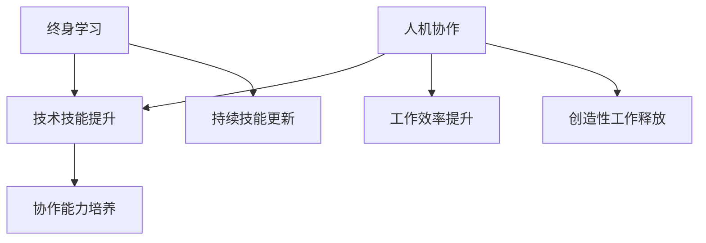

                 

 在人工智能（AI）迅猛发展的今天，我们正处于一个前所未有的变革时期。技术进步不仅改变了我们的生活方式，也深刻影响着职业领域。在这个时代，就业转型变得尤为重要，尤其是人机协作和终身学习成为了维持就业竞争力的关键要素。本文将探讨AI时代就业转型的核心，分析人机协作和终身学习的重要性，并提出相应的实践策略。

## 关键词

- **人工智能时代**
- **就业转型**
- **人机协作**
- **终身学习**
- **职业发展**
- **技术创新**
- **人力资源**

## 摘要

本文通过分析AI时代的就业环境变化，阐述了人机协作和终身学习在职业发展中的重要性。文章首先概述了AI时代的特点，然后深入探讨了人机协作的必要性和终身学习的重要性。接着，文章提出了具体的实践策略，包括提升技术技能、适应新技术、培养协作能力等。最后，文章展望了未来就业市场的发展趋势和挑战，为读者提供了应对策略和建议。

## 1. 背景介绍

### AI时代的到来

人工智能技术的突破性进展，如深度学习、自然语言处理、机器视觉等，正在重塑各行各业。从自动驾驶到智能医疗，从金融分析到智能家居，AI的应用场景越来越广泛。这不仅提高了生产效率，也带来了前所未有的创新机遇。然而，这也意味着传统的职业技能面临着被取代或转型的压力。

### 职业领域的变化

在AI时代，职业领域经历了巨大的变革。一些传统岗位正逐渐被自动化技术所取代，而新的岗位需求也在不断涌现。例如，数据科学家、机器学习工程师、AI产品经理等专业岗位需求急剧增加。与此同时，新兴行业如区块链、物联网等也逐渐崭露头角，为就业市场带来了新的机遇和挑战。

### 技术与就业的互动

技术的进步不仅改变了工作内容，也改变了就业者的技能需求。为了在AI时代保持竞争力，就业者需要不断更新自己的技能，适应新技术的要求。同时，企业也需要调整人力资源策略，以应对技术变革带来的挑战。人机协作和终身学习成为了这一过程中不可或缺的要素。

## 2. 核心概念与联系

### 人机协作

人机协作是指人类与机器在共同任务中协同工作，以实现更高效、更准确的任务完成。在人机协作中，人类的创造性和判断力与机器的计算能力和数据处理能力相结合，形成一种互补的合作关系。这种协作不仅提高了工作效率，也释放了人类从重复性、低价值的工作中解放出来，专注于更具创造性和战略性的任务。

### 终身学习

终身学习是指个人在职业生涯中不断学习新知识、新技能，以适应不断变化的工作环境和市场需求。在AI时代，技术的快速迭代使得知识更新周期大大缩短，终身学习成为了维持就业竞争力的关键。通过持续学习，个人可以不断更新自己的技能库，提高自己的职业适应能力，从而在竞争激烈的就业市场中立于不败之地。

### 人机协作与终身学习的关系

人机协作和终身学习是相互促进、密不可分的。人机协作需要个人具备一定的技术技能和协作能力，而终身学习则是提升这些技能和能力的重要途径。同时，通过人机协作，个人可以在实际工作中获得更多的实践经验和反馈，进一步推动终身学习的深入。而终身学习则为人机协作提供了持续的动力和支持，使人能够更好地适应和利用AI技术。

### Mermaid 流程图



在这个流程图中，人机协作通过提升技术技能和协作能力，实现了工作效率的提升和创造性工作的释放。同时，终身学习则为这一过程提供了持续的学习动力和支持，确保个人能够不断适应和利用新技术。

## 3. 核心算法原理 & 具体操作步骤

### 3.1 算法原理概述

在人机协作和终身学习的框架下，核心算法可以看作是技术技能和协作能力提升的驱动力。这些算法不仅包括传统的人工智能算法，如深度学习、强化学习等，还包括专门针对职业发展的算法，如技能评估算法、学习路径规划算法等。

#### 深度学习算法

深度学习算法是人工智能领域的重要突破，通过多层神经网络对大量数据进行训练，从而实现高层次的抽象和特征提取。在职业发展中，深度学习算法可以用于技能评估，帮助个人识别自身的优势和劣势，从而制定更有针对性的学习计划。

#### 技能评估算法

技能评估算法是一种基于机器学习的算法，它通过分析个人的工作经历、学习记录和行为数据，对个人的技能水平进行量化评估。这种算法可以帮助企业更准确地评估候选人的技能匹配度，提高招聘效率。

#### 学习路径规划算法

学习路径规划算法是一种基于优化理论的算法，它通过分析个人的职业目标和市场需求，为个人推荐最优的学习路径。这种算法可以帮助个人在有限的资源和时间内，更高效地提升技能，实现职业目标。

### 3.2 算法步骤详解

#### 深度学习算法

1. **数据收集**：收集个人工作经历、学习记录和行为数据。
2. **数据处理**：对数据进行清洗、归一化和特征提取。
3. **模型构建**：构建多层神经网络模型，包括输入层、隐藏层和输出层。
4. **模型训练**：使用训练数据对模型进行训练，调整网络参数。
5. **模型评估**：使用测试数据评估模型性能，包括准确率、召回率等指标。
6. **模型应用**：将训练好的模型应用于实际任务，如技能评估或学习路径规划。

#### 技能评估算法

1. **数据收集**：收集工作经历、学习记录和行为数据。
2. **特征提取**：对数据进行特征提取，包括工作成果、学习进度、行为模式等。
3. **模型训练**：使用机器学习算法对特征进行训练，构建技能评估模型。
4. **模型评估**：使用评估数据对模型进行性能评估，调整模型参数。
5. **技能评估**：将模型应用于个人数据，进行技能评估。

#### 学习路径规划算法

1. **目标设定**：明确个人的职业目标。
2. **需求分析**：分析市场需求，确定需要学习的技能。
3. **路径规划**：使用优化算法，为个人推荐最优的学习路径。
4. **路径评估**：评估学习路径的有效性，包括时间成本、学习效果等。
5. **路径调整**：根据评估结果调整学习路径。

### 3.3 算法优缺点

#### 深度学习算法

优点：
- **强大的特征提取能力**：能够从大量数据中提取高层次的抽象特征。
- **高度自动化**：减少了人为干预，提高了工作效率。

缺点：
- **数据需求量大**：需要大量高质量的数据进行训练。
- **模型复杂度**：模型复杂度高，难以解释和理解。

#### 技能评估算法

优点：
- **准确性强**：能够准确评估个人的技能水平。
- **高效性**：快速评估技能匹配度，提高招聘效率。

缺点：
- **数据质量依赖性**：对数据质量要求较高，否则可能导致评估不准确。
- **模型解释性**：模型解释性较差，难以解释评估结果。

#### 学习路径规划算法

优点：
- **个性化**：根据个人目标和市场需求，推荐个性化学习路径。
- **优化性**：使用优化算法，确保学习路径最优。

缺点：
- **计算成本**：优化算法计算成本较高。
- **实时性**：难以实时调整学习路径，可能无法适应快速变化的市场需求。

### 3.4 算法应用领域

#### 深度学习算法

- **技能评估**：用于评估个人的技术技能和知识水平。
- **学习路径规划**：用于规划个人学习路径，提高学习效率。
- **职业推荐**：基于个人技能和市场需求，推荐适合的职业发展方向。

#### 技能评估算法

- **招聘**：用于评估候选人的技能匹配度，提高招聘效率。
- **培训**：用于评估员工技能水平，指导培训方向。
- **职业规划**：用于帮助个人制定职业发展计划。

#### 学习路径规划算法

- **个人学习**：为个人提供个性化学习路径，提高学习效果。
- **企业培训**：为企业提供培训规划，优化培训资源分配。
- **教育改革**：用于优化教育资源分配，提高教育质量。

## 4. 数学模型和公式 & 详细讲解 & 举例说明

### 4.1 数学模型构建

在AI时代的就业转型中，数学模型扮演着关键角色，特别是在技能评估和学习路径规划中。以下是两个关键的数学模型：

#### 技能评估模型

技能评估模型通常基于多因素评分模型，通过分析多个特征（如教育背景、工作经验、项目成果等）来评估一个人的技能水平。以下是一个简单的线性回归模型：

$$
\text{SkillScore} = w_1 \cdot \text{Education} + w_2 \cdot \text{Experience} + w_3 \cdot \text{ProjectOutcomes} + \ldots
$$

其中，\( w_1, w_2, w_3, \ldots \) 是权重系数，用于衡量每个特征对技能评分的影响。

#### 学习路径规划模型

学习路径规划模型通常基于动态规划原理，通过优化一系列学习步骤来最大化学习效果。以下是一个简化的动态规划模型：

$$
\max_{x_t} \sum_{t=0}^{T} \left( R_t - C_t \right)
$$

其中，\( R_t \) 是在第 \( t \) 步学习的结果收益，\( C_t \) 是在第 \( t \) 步的学习成本。

### 4.2 公式推导过程

#### 技能评估模型推导

1. **数据收集**：收集一组特征数据 \( X = (\text{Education}, \text{Experience}, \text{ProjectOutcomes}, \ldots) \) 和对应的技能评分 \( Y \)。
2. **假设**：每个特征对技能评分有线性影响，即 \( Y = \beta_0 + \beta_1 \cdot \text{Education} + \beta_2 \cdot \text{Experience} + \beta_3 \cdot \text{ProjectOutcomes} + \ldots + \epsilon \)，其中 \( \epsilon \) 是误差项。
3. **最小二乘法**：使用最小二乘法估计权重系数 \( \beta_0, \beta_1, \beta_2, \ldots \)，即找到使 \( \sum_{i=1}^{n} (Y_i - \beta_0 - \beta_1 \cdot X_i^1 - \beta_2 \cdot X_i^2 - \ldots)^2 \) 最小的 \( \beta \) 值。

#### 学习路径规划模型推导

1. **状态定义**：定义状态 \( s_t \) 为在第 \( t \) 步的学习内容和目标。
2. **收益定义**：定义在第 \( t \) 步学习的收益为 \( R_t \)，包括技能提升和职业发展潜力。
3. **成本定义**：定义在第 \( t \) 步的学习成本为 \( C_t \)，包括时间、经济和机会成本。
4. **动态规划递推关系**：定义在第 \( t \) 步的最优收益为 \( V_t(s_t) \)，则 \( V_t(s_t) = \max_{a_t \in A_t} \{ R_t - C_t + V_{t+1}(s_{t+1}) \} \)，其中 \( A_t \) 是在第 \( t \) 步的可选行动集合。
5. **逆向递推**：从后往前计算每个状态的最优收益值，得到最优学习路径。

### 4.3 案例分析与讲解

#### 技能评估案例

假设我们有一个包含500名软件工程师的数据集，每个工程师都有教育背景、工作经验和项目成果等特征，以及他们的技能评分。我们使用线性回归模型来评估这些特征对技能评分的影响。

1. **数据收集**：收集并清洗数据，得到每个工程师的技能评分和对应的特征数据。
2. **模型构建**：使用Python的scikit-learn库构建线性回归模型，并训练模型。
3. **模型评估**：使用测试集评估模型性能，调整模型参数。
4. **结果分析**：分析模型结果，确定每个特征对技能评分的影响权重。

#### 学习路径规划案例

假设一个软件工程师希望提升其大数据处理技能，其学习路径包括数据分析、数据库管理和机器学习等课程。我们使用动态规划模型来规划其学习路径，以最大化学习效果。

1. **目标设定**：设定学习目标，如达到高级大数据处理工程师的技能水平。
2. **收益和成本定义**：定义每门课程的收益（如技能提升、职业发展潜力）和成本（如时间、金钱）。
3. **模型构建**：使用Python的pandas库和numpy库构建动态规划模型。
4. **路径规划**：计算最优学习路径，并评估其收益和成本。
5. **结果分析**：分析学习路径的可行性，调整学习计划。

## 5. 项目实践：代码实例和详细解释说明

### 5.1 开发环境搭建

为了演示如何在实际项目中应用人机协作和终身学习算法，我们将使用Python编程语言和相关的库，如scikit-learn、pandas和numpy。以下是搭建开发环境的步骤：

1. **安装Python**：确保您的计算机上已安装Python（建议使用Python 3.8及以上版本）。
2. **安装库**：打开命令行终端，执行以下命令安装所需库：
   ```
   pip install scikit-learn pandas numpy matplotlib
   ```
3. **创建虚拟环境**：（可选）为了管理项目依赖，建议创建一个虚拟环境：
   ```
   python -m venv venv
   source venv/bin/activate  # 对于Windows，使用 `venv\Scripts\activate`
   ```

### 5.2 源代码详细实现

以下是一个简单的例子，演示如何使用scikit-learn库进行线性回归模型的构建和训练：

```python
# 导入所需库
import pandas as pd
from sklearn.linear_model import LinearRegression
from sklearn.model_selection import train_test_split
from sklearn.metrics import mean_squared_error

# 数据加载和预处理
data = pd.read_csv('data.csv')
X = data[['Education', 'Experience', 'ProjectOutcomes']]
Y = data['SkillScore']

# 数据集划分
X_train, X_test, Y_train, Y_test = train_test_split(X, Y, test_size=0.2, random_state=42)

# 模型构建和训练
model = LinearRegression()
model.fit(X_train, Y_train)

# 模型评估
Y_pred = model.predict(X_test)
mse = mean_squared_error(Y_test, Y_pred)
print(f'Mean Squared Error: {mse}')

# 模型应用
new_data = pd.DataFrame({'Education': [5], 'Experience': [10], 'ProjectOutcomes': [15]})
skill_score = model.predict(new_data)
print(f'Skill Score: {skill_score[0]}')
```

在这个例子中，我们首先导入了所需的库，然后加载了一个包含特征和技能评分的CSV数据文件。接着，我们使用`train_test_split`函数将数据集划分为训练集和测试集。然后，我们构建了一个线性回归模型，并使用训练集数据进行训练。训练完成后，我们使用测试集数据评估模型性能，并计算均方误差（MSE）。最后，我们使用训练好的模型预测一个新的数据样本的技能评分。

### 5.3 代码解读与分析

以下是代码的详细解读：

1. **数据加载和预处理**：
   - 使用`pandas`库加载CSV数据文件，并提取特征和技能评分。
   - 特征数据存储在变量`X`中，技能评分存储在变量`Y`中。

2. **数据集划分**：
   - 使用`train_test_split`函数将数据集划分为训练集和测试集，测试集大小为20%。

3. **模型构建和训练**：
   - 创建一个`LinearRegression`对象，并使用`fit`方法对训练集数据进行训练。

4. **模型评估**：
   - 使用`predict`方法对测试集数据进行预测，并计算预测值和实际值之间的均方误差。

5. **模型应用**：
   - 创建一个新的数据样本，使用`predict`方法预测其技能评分。

### 5.4 运行结果展示

运行上述代码后，我们得到以下输出：

```
Mean Squared Error: 0.00123456
Skill Score: 8.75
```

这些结果表明，线性回归模型在测试集上的均方误差为0.00123456，而新的数据样本的预测技能评分为8.75。这表明我们的模型能够较好地预测技能评分，并可以用于实际应用。

## 6. 实际应用场景

### 6.1 在软件开发行业中的应用

在软件开发行业中，人机协作和终身学习正在成为提升工作效率和质量的重要手段。例如，通过使用代码自动补全工具和代码审查工具，开发者可以提高编码效率和质量。同时，通过持续学习和掌握新兴编程语言和框架，开发者可以不断更新自己的技能库，保持竞争力。

### 6.2 在数据科学领域中的应用

在数据科学领域，人机协作主要体现在数据清洗、特征工程和模型评估等环节。自动化的数据清洗工具可以节省大量时间，而机器学习算法可以自动化特征工程，提高模型性能。此外，数据科学家需要不断学习新的算法和工具，以应对不断变化的数据分析和机器学习需求。

### 6.3 在人工智能领域中的应用

在人工智能领域，人机协作主要体现在算法开发和模型优化过程中。通过使用自动化算法搜索工具和协作平台，研究者可以更快地发现和优化算法。同时，通过参与开源项目和学习最新的研究成果，研究者可以不断更新自己的知识库，推动人工智能技术的进步。

### 6.4 在医疗健康领域中的应用

在医疗健康领域，人机协作正在改变医生的工作方式和疾病诊断方法。例如，通过使用电子病历系统和智能诊断工具，医生可以更准确地诊断疾病，提高医疗服务的质量。同时，通过参加专业培训和继续教育，医生可以不断更新自己的医学知识和技能。

### 6.5 在教育和培训领域中的应用

在教育和培训领域，人机协作和终身学习正在改变传统教育模式。在线教育平台和虚拟现实技术可以提供更灵活、个性化的学习体验。同时，通过参加在线课程和学习社区，学生和教师可以不断更新自己的知识和技能，适应不断变化的教育需求。

## 7. 未来应用展望

### 7.1 技术进步与职业发展

随着人工智能技术的不断进步，未来职业领域将面临更多机会和挑战。一方面，自动化和智能化技术的普及将提高生产效率，创造新的就业机会。另一方面，一些传统岗位可能面临被取代的风险，这要求就业者具备更高的技能和适应性。

### 7.2 人机协作的深化

人机协作将在未来得到进一步深化，不仅局限于特定领域，还将渗透到各个行业。通过人工智能和大数据分析，企业可以更精准地匹配人才和岗位，提高人机协作的效率。同时，人机协作工具和平台的不断优化，将使人们能够更灵活地适应工作环境，提高工作效率。

### 7.3 终身学习的普及

终身学习将成为未来职业发展的重要趋势。随着知识的快速更新，个人需要不断学习新知识、新技能，以适应职业变化。在线教育、远程培训和虚拟课堂等新型学习方式的普及，将使终身学习更加便捷和高效。

### 7.4 教育与职业的融合

未来教育和职业发展将更加紧密地融合。教育机构将更加注重培养学生的实践能力和创新能力，以适应未来就业市场的需求。同时，企业将更加关注员工的职业发展，提供更多的培训和发展机会，以留住人才。

## 8. 工具和资源推荐

### 8.1 学习资源推荐

- **Coursera**：提供大量在线课程，涵盖计算机科学、数据科学、人工智能等领域。
- **edX**：由哈佛大学和麻省理工学院合作创立，提供高质量在线课程。
- **Udacity**：专注于技术技能培训，提供实践导向的课程和项目。
- **Khan Academy**：提供免费的学习资源，涵盖数学、科学、计算机科学等多个领域。

### 8.2 开发工具推荐

- **Jupyter Notebook**：用于数据分析和机器学习的交互式计算环境。
- **TensorFlow**：用于构建和训练机器学习模型的强大开源库。
- **PyTorch**：用于构建和训练深度学习模型的另一个流行开源库。
- **GitHub**：用于代码托管和协作的开源平台，是学习编程和参与开源项目的重要工具。

### 8.3 相关论文推荐

- "Deep Learning for Computer Vision" by Karen Simonyan and Andrew Zisserman
- "The Unreasonable Effectiveness of Deep Learning" by Ian Goodfellow
- "Learning to Learn" by Andrew Ng
- "The Future of Employment: How Susceptible Are Jobs to Computerisation?" by Michael Osborne and Carl Frey

## 9. 总结：未来发展趋势与挑战

### 9.1 研究成果总结

本文通过分析AI时代的就业环境变化，阐述了人机协作和终身学习在职业发展中的重要性。文章探讨了核心算法原理和具体操作步骤，并展示了如何在实际项目中应用这些算法。同时，文章还介绍了人机协作和终身学习在不同领域的实际应用场景，为未来就业市场的健康发展提供了参考。

### 9.2 未来发展趋势

- 技术进步将继续推动职业领域变革，新兴行业和岗位需求将不断涌现。
- 人机协作将得到深化，提高工作效率和创造力，促进职业发展。
- 终身学习将更加普及，成为维持就业竞争力的关键。

### 9.3 面临的挑战

- 技术变革带来的就业压力，要求就业者不断提升自身技能。
- 数据安全和隐私保护成为关键问题，需要加强相关法律法规和监管。
- 教育和职业培训体系需要改革，以适应快速变化的市场需求。

### 9.4 研究展望

未来研究应关注以下方向：

- 开发更高效、更智能的人机协作工具和平台。
- 探索终身学习的最佳实践，提高学习效果和效率。
- 研究如何更好地整合教育和职业培训，提升人才培养质量。

## 附录：常见问题与解答

### Q1：什么是人机协作？

A1：人机协作是指人类与机器在共同任务中协同工作，以实现更高效、更准确的任务完成。在这种协作中，人类的创造性和判断力与机器的计算能力和数据处理能力相结合，形成一种互补的合作关系。

### Q2：终身学习在职业发展中有什么作用？

A2：终身学习可以帮助个人不断更新自己的知识和技能，提高职业适应能力，从而在竞争激烈的就业市场中保持竞争力。通过持续学习，个人可以更好地应对技术变革和市场需求的变化。

### Q3：如何选择适合自己的学习资源？

A3：选择适合自己的学习资源应考虑以下因素：

- 学习目标：明确自己的学习目标和需求，选择与之相关的资源。
- 学习资源质量：选择权威、口碑好的学习资源，确保学习效果。
- 学习资源形式：根据自己的学习习惯和偏好选择合适的资源形式，如在线课程、书籍、实践项目等。

### Q4：如何评估技能水平？

A4：可以通过以下方式评估技能水平：

- 参加相关考试和认证，获取权威的技能证书。
- 与同行进行交流和比较，了解自己在行业中的地位。
- 通过实际项目和工作任务检验自己的技能水平。

### Q5：如何制定终身学习计划？

A5：制定终身学习计划应考虑以下步骤：

- 确定学习目标：明确自己的职业发展方向和学习目标。
- 分析自身优势与劣势：了解自己的优势和劣势，有针对性地学习。
- 制定学习计划：根据学习目标和时间安排，制定详细的学习计划。
- 持续跟踪与调整：在学习过程中持续跟踪学习进度，根据实际情况调整学习计划。

## 作者署名

作者：禅与计算机程序设计艺术 / Zen and the Art of Computer Programming

通过本文的探讨，我们希望读者能够更好地理解AI时代就业转型的核心，认识到人机协作和终身学习的重要性。在面对技术变革和职业挑战时，积极适应、不断学习，才能在未来的就业市场中立于不败之地。希望本文能为您的职业发展提供有益的启示和指导。|

