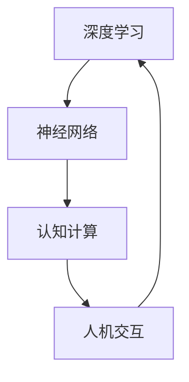

                 

关键词：人工智能、感知革命、人类体验、五感、深度学习、神经网络、认知计算、人机交互。

> 摘要：本文将探讨人工智能（AI）在感知革命中的重要作用，特别是如何通过重塑人类的视觉、听觉、嗅觉、味觉和触觉五感，从而彻底改变人类的生活和工作方式。文章将从核心概念、算法原理、数学模型、实际应用、未来展望等多个维度进行分析，旨在为读者呈现一幅AI时代感知革命的宏伟蓝图。

## 1. 背景介绍

### 1.1 感知革命的概念与起源

感知革命（Sensory Revolution）是指通过技术手段对人类感官系统进行革新，使其能够更高效、更准确地感知和理解外部世界。这一概念起源于20世纪中后期，随着计算机技术的飞速发展，特别是在人工智能和深度学习的推动下，感知革命逐渐成为现实。

### 1.2 人工智能的发展与感知能力的提升

人工智能（AI）作为计算机科学的一个分支，致力于使计算机系统具备人类智能。随着深度学习、神经网络等技术的不断进步，AI在感知能力方面取得了显著成果。通过大数据的采集和处理，AI能够识别图像、语音、文本等多种类型的信息，从而实现对人类感官的延伸和增强。

### 1.3 人类感知系统的局限性

尽管人类具有发达的感知系统，但依然存在一些局限性。例如，人类的视觉系统容易受到光线、视角等因素的影响，听觉系统对声音的分辨能力有限，嗅觉和味觉系统对气味的识别能力较低，触觉系统则难以感知微小的压力变化。通过感知革命，这些问题有望得到解决。

## 2. 核心概念与联系

为了更好地理解AI时代的感知革命，我们需要了解一些核心概念及其相互联系。

### 2.1 深度学习与神经网络

深度学习（Deep Learning）是机器学习的一个分支，通过构建具有多个隐藏层的神经网络（Neural Network）来实现对复杂数据的分析和处理。神经网络模仿了人脑的工作方式，通过调整权重和偏置来学习数据特征。

### 2.2 认知计算与人机交互

认知计算（Cognitive Computing）是一种模拟人类思维过程的计算模式，旨在使计算机具备理解、推理、学习和决策的能力。认知计算与人机交互（Human-Computer Interaction）密切相关，通过人机交互，计算机能够更好地理解人类意图，提供个性化的服务。

### 2.3 Mermaid流程图

以下是一个简单的Mermaid流程图，展示了深度学习、神经网络、认知计算和人机交互之间的联系。



## 3. 核心算法原理 & 具体操作步骤

### 3.1 算法原理概述

感知革命的核心算法主要包括深度学习、神经网络和认知计算。深度学习通过多层神经网络对数据进行自动特征提取和学习；神经网络通过神经元之间的连接模拟人脑的工作方式；认知计算则通过理解人类语言和行为，实现人机交互。

### 3.2 算法步骤详解

#### 3.2.1 深度学习算法步骤

1. 数据采集：收集大量的图像、语音、文本等数据。
2. 数据预处理：对数据进行清洗、归一化等处理，使其适合输入到神经网络中。
3. 构建神经网络：设计多层神经网络结构，包括输入层、隐藏层和输出层。
4. 模型训练：通过反向传播算法调整神经网络权重，使模型能够对数据进行分类、识别等操作。
5. 模型评估：使用测试数据集对模型性能进行评估，调整模型参数以获得最佳效果。

#### 3.2.2 神经网络算法步骤

1. 构建神经网络：设计合适的神经网络结构，包括输入层、隐藏层和输出层。
2. 初始化权重：随机初始化神经网络权重。
3. 前向传播：将输入数据传递到神经网络中，逐层计算输出。
4. 反向传播：计算输出误差，并调整神经网络权重，使误差最小。
5. 模型优化：通过迭代训练，提高模型性能。

#### 3.2.3 认知计算算法步骤

1. 数据预处理：对输入数据（如文本、语音等）进行预处理，提取关键信息。
2. 语言理解：使用自然语言处理技术，理解人类语言中的语义和意图。
3. 上下文理解：根据对话的上下文，理解用户的当前需求。
4. 生成响应：根据用户需求，生成合适的响应。
5. 交互反馈：根据用户反馈，调整后续交互策略。

### 3.3 算法优缺点

#### 3.3.1 深度学习

**优点：**

- 能够自动提取数据特征，减少人工干预。
- 对大规模数据具有很好的处理能力。
- 在图像识别、语音识别等领域取得了显著的成果。

**缺点：**

- 需要大量的数据和计算资源。
- 对数据质量和标注要求较高。

#### 3.3.2 神经网络

**优点：**

- 模拟人脑工作方式，具有很好的通用性。
- 能够处理复杂数据和问题。

**缺点：**

- 参数调整复杂，训练过程较长。
- 对计算资源要求较高。

#### 3.3.3 认知计算

**优点：**

- 能够理解人类语言和行为，实现自然交互。
- 可以提供个性化的服务。

**缺点：**

- 需要大量的数据和计算资源。
- 对上下文理解能力有限。

### 3.4 算法应用领域

感知革命的核心算法在多个领域得到了广泛应用，包括：

- 图像识别：如人脸识别、物体识别等。
- 语音识别：如语音助手、语音翻译等。
- 自然语言处理：如机器翻译、文本生成等。
- 机器人：如智能家居、服务机器人等。

## 4. 数学模型和公式 & 详细讲解 & 举例说明

### 4.1 数学模型构建

感知革命的核心算法依赖于多种数学模型，包括深度学习模型、神经网络模型和认知计算模型。以下是一个简单的深度学习模型（卷积神经网络，CNN）的数学模型构建过程。

#### 4.1.1 卷积神经网络（CNN）模型

1. 输入层：接收原始数据，如图像、语音等。
2. 卷积层：通过卷积操作提取数据特征。
3. 池化层：降低数据维度，提高计算效率。
4. 全连接层：将特征映射到输出层，实现分类、识别等操作。
5. 输出层：输出最终结果。

#### 4.1.2 数学公式

卷积神经网络（CNN）的主要数学公式包括：

$$
\begin{aligned}
    \text{卷积操作} & : f(x) = \sum_{i=1}^{n} w_i * x_i + b \\
    \text{激活函数} & : g(z) = \text{ReLU}(z) = \max(0, z)
\end{aligned}
$$

### 4.2 公式推导过程

以下是一个简单的卷积神经网络（CNN）公式的推导过程。

#### 4.2.1 卷积操作

假设输入数据 $x$ 是一个 $m \times n$ 的矩阵，卷积核 $w$ 是一个 $k \times l$ 的矩阵。卷积操作可以表示为：

$$
    f(x) = \sum_{i=1}^{n} w_i * x_i + b
$$

其中，$w_i$ 是卷积核的第 $i$ 行，$x_i$ 是输入数据的第 $i$ 行，$b$ 是偏置项。

#### 4.2.2 激活函数

激活函数 $g(z)$ 是一个非线性函数，常用于提高神经网络的拟合能力。常用的激活函数是ReLU（Rectified Linear Unit）函数，其公式为：

$$
    g(z) = \text{ReLU}(z) = \max(0, z)
$$

### 4.3 案例分析与讲解

以下是一个简单的图像识别案例，使用卷积神经网络（CNN）进行图像分类。

#### 4.3.1 数据集

我们使用一个包含1000个类别的图像数据集，每个类别有1000张图片。数据集被分为训练集、验证集和测试集。

#### 4.3.2 模型构建

构建一个卷积神经网络（CNN）模型，包括以下几个层次：

1. 输入层：接收大小为 $28 \times 28$ 的图像数据。
2. 卷积层1：使用大小为 $5 \times 5$ 的卷积核，步长为1，卷积次数为32。
3. 池化层1：使用大小为2的池化核，步长为2。
4. 卷积层2：使用大小为 $5 \times 5$ 的卷积核，步长为1，卷积次数为64。
5. 池化层2：使用大小为2的池化核，步长为2。
6. 全连接层：将卷积层的输出映射到1000个类别上。
7. 输出层：使用softmax函数进行分类。

#### 4.3.3 模型训练

使用训练集对模型进行训练，通过反向传播算法调整模型参数，使其对图像进行分类。

#### 4.3.4 模型评估

使用测试集对模型进行评估，计算模型在测试集上的准确率。

## 5. 项目实践：代码实例和详细解释说明

### 5.1 开发环境搭建

为了实践感知革命的核心算法，我们需要搭建一个开发环境。以下是搭建环境的步骤：

1. 安装Python环境。
2. 安装深度学习框架（如TensorFlow或PyTorch）。
3. 安装必要的库（如NumPy、Pandas等）。

### 5.2 源代码详细实现

以下是一个简单的卷积神经网络（CNN）的代码实现，用于图像分类。

```python
import tensorflow as tf
from tensorflow.keras import layers

# 构建卷积神经网络模型
model = tf.keras.Sequential([
    layers.Conv2D(32, (5, 5), activation='relu', input_shape=(28, 28, 1)),
    layers.MaxPooling2D((2, 2)),
    layers.Conv2D(64, (5, 5), activation='relu'),
    layers.MaxPooling2D((2, 2)),
    layers.Flatten(),
    layers.Dense(128, activation='relu'),
    layers.Dense(10, activation='softmax')
])

# 编译模型
model.compile(optimizer='adam',
              loss='sparse_categorical_crossentropy',
              metrics=['accuracy'])

# 加载数据集
mnist = tf.keras.datasets.mnist
(train_images, train_labels), (test_images, test_labels) = mnist.load_data()

# 预处理数据集
train_images = train_images / 255.0
test_images = test_images / 255.0

# 训练模型
model.fit(train_images, train_labels, epochs=5)

# 评估模型
test_loss, test_acc = model.evaluate(test_images,  test_labels, verbose=2)
print('\nTest accuracy:', test_acc)
```

### 5.3 代码解读与分析

以上代码实现了一个简单的卷积神经网络（CNN）模型，用于图像分类。代码的主要部分如下：

1. **构建模型**：使用`tf.keras.Sequential`类构建模型，包括卷积层、池化层、全连接层和输出层。
2. **编译模型**：使用`model.compile`方法编译模型，指定优化器、损失函数和评价指标。
3. **加载数据集**：使用`tf.keras.datasets.mnist`加载数据集，并预处理数据。
4. **训练模型**：使用`model.fit`方法训练模型，通过反向传播算法调整模型参数。
5. **评估模型**：使用`model.evaluate`方法评估模型在测试集上的性能。

## 6. 实际应用场景

感知革命在多个实际应用场景中发挥了重要作用，以下是一些典型的应用场景：

### 6.1 图像识别

图像识别是感知革命的一个重要应用领域。通过深度学习和神经网络技术，计算机可以识别和分类各种图像，如人脸识别、物体识别、场景识别等。这些技术在安防监控、医疗诊断、自动驾驶等领域具有广泛的应用前景。

### 6.2 语音识别

语音识别是将语音信号转换为文本信息的技术。通过深度学习和神经网络技术，计算机可以准确识别和转录语音，实现语音输入、语音搜索、语音助手等功能。语音识别在智能音箱、智能家居、客服等领域具有广泛应用。

### 6.3 自然语言处理

自然语言处理（NLP）是感知革命在文本处理领域的应用。通过深度学习和神经网络技术，计算机可以理解、生成和处理自然语言，实现机器翻译、文本生成、情感分析等功能。NLP在搜索引擎、社交媒体分析、智能客服等领域具有广泛的应用。

### 6.4 机器人

机器人是感知革命在交互式应用领域的重要成果。通过深度学习和认知计算技术，机器人可以理解人类语言和行为，实现人机交互、自主决策等功能。机器人广泛应用于服务机器人、医疗机器人、教育机器人等领域。

## 7. 未来应用展望

随着感知革命的发展，未来人工智能在感知能力方面将取得更大突破，为人类社会带来更多变革。以下是一些未来应用展望：

### 7.1 超级感知系统

未来，人工智能将实现超级感知系统，通过多模态感知技术，融合视觉、听觉、嗅觉、味觉和触觉等多种感官信息，使计算机具备更全面、更精准的感知能力。

### 7.2 脑机接口

脑机接口（Brain-Computer Interface）是一种直接连接人脑与计算机的技术。通过脑机接口，人类可以控制计算机，实现思维交互。未来，脑机接口技术将得到广泛应用，为残疾人、脑瘫患者等群体提供新的生活模式。

### 7.3 智能家居

智能家居（Smart Home）是一种通过人工智能技术实现家庭自动化和智能化的系统。未来，智能家居将实现更智能、更便捷、更安全的家庭生活，提高人类生活质量。

### 7.4 智慧城市

智慧城市（Smart City）是一种通过人工智能技术实现城市管理和服务的系统。未来，智慧城市将实现城市运行的高效、透明、安全，提高城市管理水平和居民生活质量。

## 8. 总结：未来发展趋势与挑战

### 8.1 研究成果总结

感知革命的核心算法在图像识别、语音识别、自然语言处理、机器人等领域取得了显著成果，推动了人工智能技术的快速发展。未来，感知革命将继续深化，为人类社会带来更多变革。

### 8.2 未来发展趋势

未来，人工智能在感知能力方面将实现更大突破，通过多模态感知技术和脑机接口技术，实现更全面、更精准的感知能力。同时，人工智能将向智能化、自主化、网络化方向发展，为人类社会带来更多创新应用。

### 8.3 面临的挑战

感知革命在发展过程中也面临一系列挑战，如数据隐私、算法透明性、人机协作等。此外，人工智能技术的高依赖性也引发了对人类就业和伦理问题的担忧。未来，需要进一步加强人工智能技术的研究，推动相关法律法规的制定和实施，确保人工智能技术健康发展。

### 8.4 研究展望

未来，感知革命将继续深入发展，为人类社会带来更多创新应用。在图像识别、语音识别、自然语言处理等领域，将继续推进深度学习、神经网络等技术的应用研究，提高感知能力。同时，多模态感知技术和脑机接口技术也将成为研究热点。此外，人工智能伦理问题、人机协作等领域的深入研究也将为感知革命提供更多理论支持。

## 9. 附录：常见问题与解答

### 9.1 什么是感知革命？

感知革命是指通过技术手段对人类感官系统进行革新，使其能够更高效、更准确地感知和理解外部世界。感知革命的核心算法包括深度学习、神经网络和认知计算等。

### 9.2 感知革命有哪些应用领域？

感知革命的应用领域包括图像识别、语音识别、自然语言处理、机器人等。这些技术正在逐步改变人类的生活和工作方式，提高生产效率和生活质量。

### 9.3 感知革命的核心算法是什么？

感知革命的核心算法包括深度学习、神经网络和认知计算。深度学习通过多层神经网络对数据进行自动特征提取和学习；神经网络通过神经元之间的连接模拟人脑的工作方式；认知计算则通过理解人类语言和行为，实现人机交互。

### 9.4 感知革命有哪些挑战？

感知革命在发展过程中面临一系列挑战，如数据隐私、算法透明性、人机协作等。此外，人工智能技术的高依赖性也引发了对人类就业和伦理问题的担忧。未来，需要进一步加强人工智能技术的研究，推动相关法律法规的制定和实施，确保人工智能技术健康发展。

作者：禅与计算机程序设计艺术 / Zen and the Art of Computer Programming
----------------------------------------------------------------
以上是《AI时代的感知革命：重塑人类体验的五感》的完整文章。希望这篇文章能够为读者提供关于感知革命的有价值的信息和思考。

