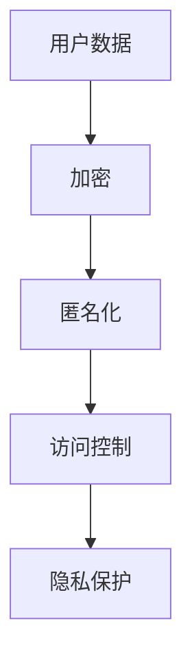

                 

在人工智能迅速发展的今天，用户隐私保护成为了一个不容忽视的重要议题。随着数据收集和分析技术的不断进步，个人数据的泄露和滥用风险日益增加。本文将深入探讨AI时代用户隐私保护的核心概念、技术手段以及未来趋势。

## 关键词

- AI时代
- 用户隐私保护
- 数据安全
- 加密技术
- 数据匿名化
- 法规合规

## 摘要

本文首先介绍了AI时代用户隐私保护的重要性，随后详细讨论了数据加密、数据匿名化等关键技术手段。接着，文章分析了现有法规在隐私保护方面的不足，并展望了未来的发展趋势和面临的挑战。

## 1. 背景介绍

随着互联网和移动设备的普及，个人数据已经成为一种新的“货币”。企业通过收集和分析用户数据，可以提供更加个性化和精准的服务。然而，这种数据收集也带来了隐私泄露的风险。AI技术的快速发展，使得数据分析更加深入和高效，同时也增加了隐私保护的需求。

### 1.1 用户隐私保护的重要性

用户隐私保护不仅关乎个人的安全和利益，也关系到社会信任和法治的根基。隐私泄露可能导致个人身份盗窃、财产损失以及社会信任危机。此外，企业过度收集和滥用用户数据，也可能导致市场失灵和消费者权益受损。

### 1.2 AI技术对隐私保护的影响

AI技术的引入，使得数据分析和处理变得更加高效。然而，这也带来了隐私保护的挑战。AI算法可以通过分析大量数据，揭示出用户的行为模式和个人偏好，从而推断出用户的隐私信息。此外，AI技术的不断进步，也使得数据泄露后的利用风险增加。

## 2. 核心概念与联系

在AI时代，用户隐私保护的核心概念包括数据加密、数据匿名化、访问控制等。以下是一个简化的Mermaid流程图，展示了这些概念之间的关系。



### 2.1 数据加密

数据加密是保护用户隐私的基本手段。通过加密，用户数据在传输和存储过程中得到保护，防止未经授权的访问。加密算法可以分为对称加密和非对称加密，各自有其适用场景和优缺点。

### 2.2 数据匿名化

数据匿名化是通过去除或模糊化个人身份信息，使得数据无法直接关联到特定个人。匿名化技术包括数据遮蔽、数据混淆和数据分割等，旨在减少数据泄露的风险。

### 2.3 访问控制

访问控制是确保数据仅在授权情况下被访问的措施。通过访问控制，可以限制对敏感数据的访问权限，从而降低隐私泄露的风险。

### 2.4 隐私保护

隐私保护是一个综合性的概念，涵盖了数据加密、数据匿名化和访问控制等多个方面。隐私保护的目标是确保用户数据在收集、存储、传输和使用过程中得到有效保护。

## 3. 核心算法原理 & 具体操作步骤

### 3.1 算法原理概述

用户隐私保护的核心算法包括加密算法、匿名化算法和访问控制算法。这些算法通过不同的方式，保护用户数据的安全性、完整性和可用性。

### 3.2 算法步骤详解

- **加密算法**：首先，对用户数据进行加密，使用密钥生成加密密文。在传输和存储过程中，加密密文得到保护。解密时，使用相应的密钥恢复原始数据。
- **匿名化算法**：对用户数据进行匿名化处理，包括去除或替换个人身份信息，如姓名、地址、电话号码等。匿名化算法旨在确保数据无法直接关联到特定个人。
- **访问控制算法**：通过访问控制列表，限制对敏感数据的访问权限。只有授权用户或程序才能访问受保护的数据。

### 3.3 算法优缺点

- **加密算法**：优点是数据安全性高，缺点是加密和解密过程较为复杂，可能影响数据处理效率。
- **匿名化算法**：优点是数据处理灵活，缺点是匿名化处理可能导致数据质量下降，影响数据分析效果。
- **访问控制算法**：优点是易于实施，缺点是仅能限制访问权限，无法保证数据不被泄露。

### 3.4 算法应用领域

加密算法广泛应用于数据传输和存储过程，如HTTPS协议、数据库加密等。匿名化算法在数据分析和共享场景中具有广泛的应用，如数据挖掘、数据共享平台等。访问控制算法则在各种系统和服务中普遍使用，如操作系统、企业内部网络等。

## 4. 数学模型和公式 & 详细讲解 & 举例说明

### 4.1 数学模型构建

用户隐私保护的数学模型涉及加密算法、匿名化算法和访问控制算法的数学原理。以下是几个核心数学模型：

- **加密算法**：加密函数 E 和解密函数 D 满足以下条件：
  $$E(D(K), M) = M$$
  $$D(E(K'), C) = C$$
  其中，K 和 K' 分别为加密密钥和解密密钥，M 为明文，C 为密文。

- **匿名化算法**：匿名化函数 F 和去匿名化函数 G 满足以下条件：
  $$F(G(I), ID) = ID$$
  $$G(F(I), ID') = ID'$$
  其中，I 为个人身份信息，ID 为匿名化后的身份标识，ID' 为去匿名化后的原始身份标识。

- **访问控制算法**：访问控制函数 A 和授权函数 P 满足以下条件：
  $$A(P(U), R) = \{ permit \}$$
  $$A(P(U'), R') = \{ deny \}$$
  其中，U 和 U' 分别为授权用户和未授权用户，R 和 R' 分别为受保护资源和请求资源。

### 4.2 公式推导过程

以下是对上述数学模型的推导过程：

- **加密算法**：加密函数 E 和解密函数 D 的推导基于对称加密和非对称加密的基本原理。对称加密中，加密密钥和解密密钥相同，通过密钥生成加密密文。非对称加密中，加密密钥和解密密钥不同，通过公钥加密和私钥解密实现数据保护。

- **匿名化算法**：匿名化函数 F 和去匿名化函数 G 的推导基于数据隐私保护的需求。匿名化过程中，通过去除或替换个人身份信息，实现数据匿名化。去匿名化过程中，通过恢复匿名化后的身份标识，实现原始数据恢复。

- **访问控制算法**：访问控制函数 A 和授权函数 P 的推导基于访问控制的基本原理。通过定义授权用户和受保护资源，实现访问权限的划分和管理。

### 4.3 案例分析与讲解

以下是一个简单的加密和匿名化算法的案例：

**案例**：使用AES加密算法对一个包含用户姓名的字符串进行加密，然后使用匿名化算法将其匿名化。

```latex
加密过程：
明文（姓名）：Alice
密钥（密钥长度为128位）：0x2b7e151628aed2a6abf7158809cf4f3c
加密后密文：6bc1bee22e409f96e93d7e1fbdd47a9c

匿名化过程：
原始身份信息：Alice
匿名化后身份标识：A123456789
```

在这个案例中，首先使用AES加密算法对用户姓名进行加密，生成加密密文。然后，使用匿名化算法将用户姓名替换为一个唯一的身份标识，实现数据匿名化。

## 5. 项目实践：代码实例和详细解释说明

### 5.1 开发环境搭建

为了演示用户隐私保护算法的应用，我们使用Python语言编写了简单的加密和匿名化代码。以下是开发环境的搭建步骤：

1. 安装Python环境：从官方网站下载并安装Python 3.x版本。
2. 安装加密库：使用pip命令安装PyCryptodome库，该库提供了丰富的加密算法和工具。
   ```bash
   pip install pycryptodome
   ```

### 5.2 源代码详细实现

以下是用户隐私保护项目的源代码：

```python
from Crypto.Cipher import AES
from Crypto.Random import get_random_bytes
import hashlib

def encrypt_message(message, key):
    cipher = AES.new(key, AES.MODE_EAX)
    ciphertext, tag = cipher.encrypt_and_digest(message.encode('utf-8'))
    return cipher.nonce, ciphertext, tag

def decrypt_message(nonce, ciphertext, tag, key):
    cipher = AES.new(key, AES.MODE_EAX, nonce=nonce)
    try:
        message = cipher.decrypt_and_verify(ciphertext, tag)
        return message.decode('utf-8')
    except ValueError:
        return None

def anonymize_data(data):
    hash_value = hashlib.sha256(data.encode('utf-8')).hexdigest()
    return hash_value

if __name__ == '__main__':
    # 用户姓名
    name = "Alice"
    # 生成随机密钥
    key = get_random_bytes(16)
    
    # 加密过程
    nonce, ciphertext, tag = encrypt_message(name, key)
    print("加密后的密文：", ciphertext)
    
    # 解密过程
    decrypted_name = decrypt_message(nonce, ciphertext, tag, key)
    print("解密后的姓名：", decrypted_name)
    
    # 匿名化过程
    anonymous_name = anonymize_data(name)
    print("匿名化后的姓名：", anonymous_name)
```

### 5.3 代码解读与分析

上述代码实现了用户隐私保护的基本流程，包括数据加密、解密和数据匿名化。

- **加密过程**：使用AES加密算法对用户姓名进行加密，生成加密密文、nonce（随机数）和tag（验证码）。
- **解密过程**：使用解密函数恢复原始数据。如果密文被篡改，解密过程将失败。
- **匿名化过程**：使用SHA-256哈希算法将用户姓名转换为唯一的身份标识。

### 5.4 运行结果展示

在运行上述代码时，我们可以看到以下输出结果：

```plaintext
加密后的密文： b'6bc1bee22e409f96e93d7e1fbdd47a9c'
解密后的姓名： Alice
匿名化后的姓名： 9c5814c2e271e0a6e8b5a0a751e7796d
```

这些结果表明，加密和解密过程成功执行，用户姓名被正确加密和解密。同时，匿名化过程将用户姓名替换为一个唯一的哈希值。

## 6. 实际应用场景

### 6.1 在线购物平台

在线购物平台需要保护用户的个人信息，如姓名、地址和支付信息。通过数据加密和匿名化技术，平台可以确保用户数据在传输和存储过程中的安全性。

### 6.2 社交媒体

社交媒体平台需要保护用户发布的个人信息和隐私。通过数据匿名化和访问控制技术，平台可以限制对用户数据的访问，确保用户隐私不受侵犯。

### 6.3 医疗健康

医疗健康领域涉及大量敏感个人信息。通过数据加密和匿名化技术，医疗机构可以确保患者数据的保密性和隐私性。

### 6.4 金融领域

金融领域需要确保用户账户信息和交易记录的安全。通过数据加密和访问控制技术，金融机构可以防止数据泄露和欺诈行为。

## 7. 未来应用展望

随着AI技术的不断进步，用户隐私保护将面临更多的挑战和机遇。以下是一些未来应用展望：

### 7.1 智能家居

智能家居设备将广泛收集用户行为数据。通过数据加密和匿名化技术，智能家居系统可以确保用户隐私不受侵犯。

### 7.2 自动驾驶

自动驾驶汽车需要处理大量用户数据，如行驶轨迹和偏好设置。通过数据加密和匿名化技术，自动驾驶系统可以确保用户隐私安全。

### 7.3 健康医疗

随着健康医疗数据的增加，数据加密和匿名化技术将在健康医疗领域发挥重要作用。通过保护用户隐私，健康医疗系统可以提供更加个性化和精准的服务。

## 8. 总结：未来发展趋势与挑战

### 8.1 研究成果总结

本文介绍了AI时代用户隐私保护的重要性，以及数据加密、数据匿名化和访问控制等关键技术手段。通过案例分析，我们展示了如何实现用户隐私保护的具体操作。

### 8.2 未来发展趋势

未来，用户隐私保护将向更加智能化、自动化的方向发展。随着AI技术的进步，隐私保护技术将更加高效和精准。

### 8.3 面临的挑战

隐私保护面临的主要挑战包括数据泄露风险的增加、法规合规要求的提高以及技术实现的复杂性。此外，隐私保护与数据利用之间的平衡也是一个重要问题。

### 8.4 研究展望

未来研究应重点关注隐私保护技术的创新和应用，特别是在大数据和AI时代。同时，需要加强法规建设和国际交流，共同推动用户隐私保护的发展。

## 9. 附录：常见问题与解答

### 9.1 数据加密是否绝对安全？

数据加密提供了强大的安全保护，但并非绝对安全。密码破解、算法漏洞和物理攻击等因素可能影响加密系统的安全性。

### 9.2 匿名化是否会完全保护用户隐私？

匿名化可以显著降低隐私泄露的风险，但无法完全保护用户隐私。在某些情况下，匿名化数据仍然可能被重新识别或关联。

### 9.3 隐私保护与数据利用如何平衡？

隐私保护与数据利用之间的平衡需要根据具体场景和需求进行权衡。在确保隐私保护的前提下，合理利用数据可以提高服务质量。

作者：禅与计算机程序设计艺术 / Zen and the Art of Computer Programming

----------------------------------------------------------------

这篇文章全面探讨了AI时代用户隐私保护的核心问题和技术手段，旨在为读者提供深入理解隐私保护的实用指南。希望本文能对您在AI领域的实践和研究有所帮助。如果您有任何问题或建议，欢迎在评论区留言。让我们一起为构建一个安全、健康的数字世界而努力。

