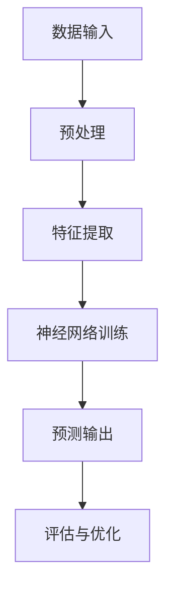
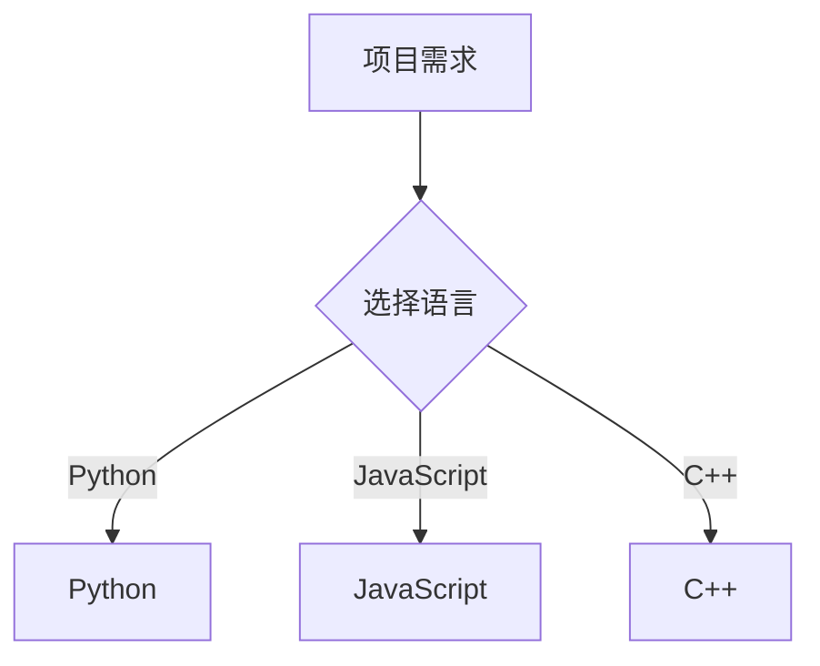
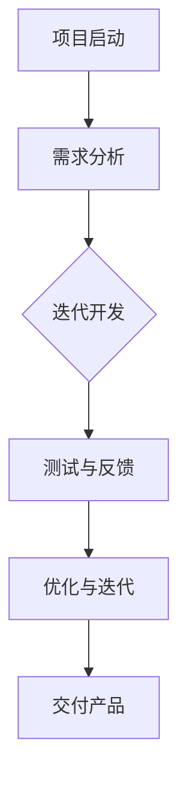
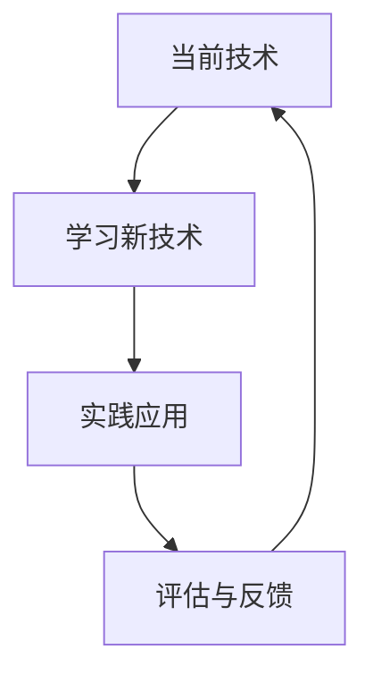
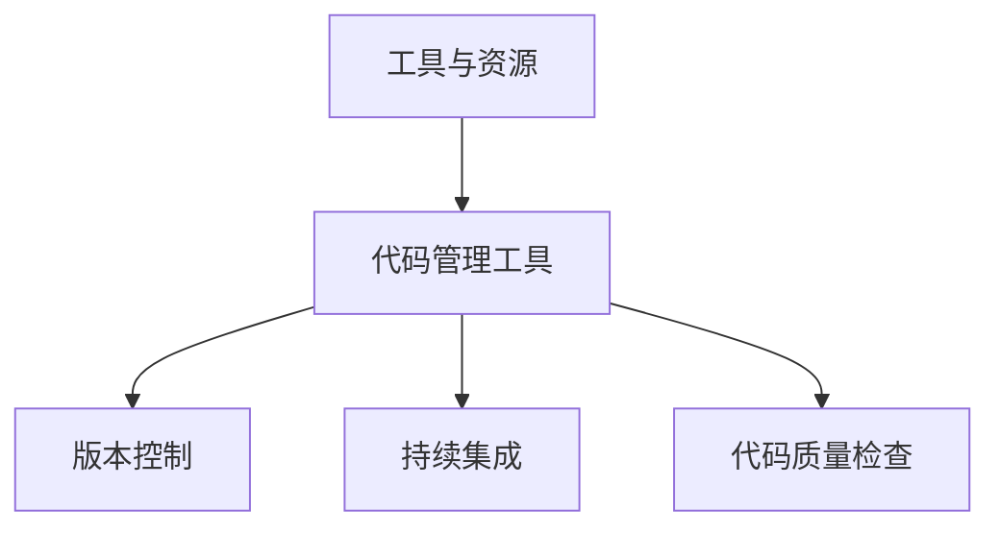
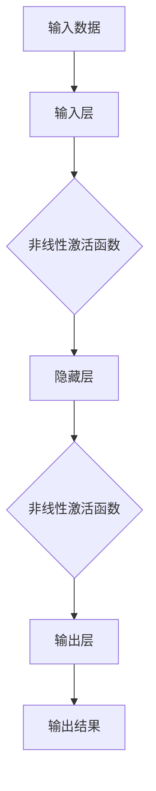
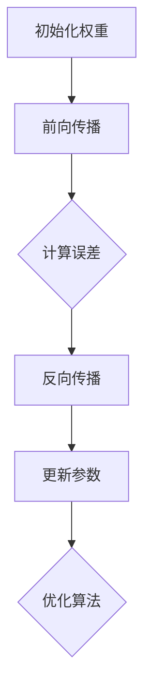
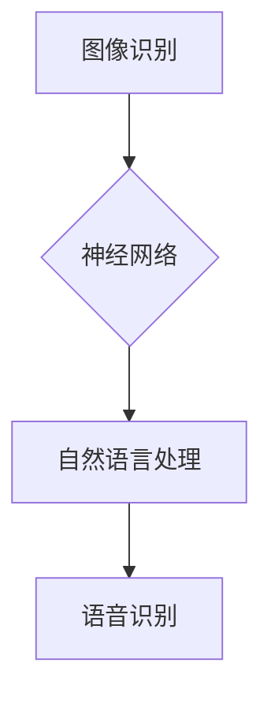
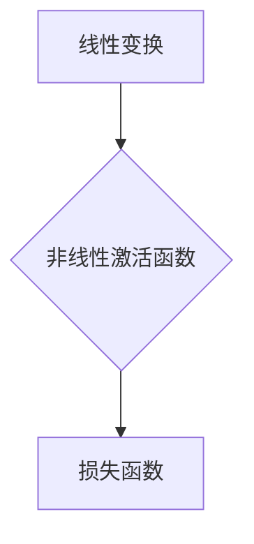

                 

关键词：人工智能、程序员技能、深度学习、编程语言、软件开发

> 摘要：随着人工智能技术的迅速发展，程序员的角色和必备技能也在不断演变。本文将探讨AI时代程序员所需的五大核心技能，包括对深度学习的理解、掌握多种编程语言、软件开发的敏捷性和协作能力，以及不断学习和适应新技术的态度。

## 1. 背景介绍

人工智能（AI）正以前所未有的速度改变着我们的世界。从自动驾驶汽车到智能家居，从医疗诊断到金融分析，AI技术的应用场景越来越广泛。在这个技术驱动的时代，程序员的角色也发生了显著变化。不再是单纯的编码者，现代程序员需要具备更广泛的技能，以便在AI领域内创新和解决问题。

本文旨在为AI时代的程序员提供一些建议和指导，帮助他们提升自身的竞争力，成为这个时代的佼佼者。以下是本文将要探讨的五大核心技能：

1. **深度学习与神经网络**：深度学习是AI领域的核心技术之一，程序员需要理解其原理和实现。
2. **多编程语言能力**：掌握多种编程语言可以增强程序员解决问题的能力。
3. **敏捷开发与协作**：现代软件开发强调快速迭代和团队合作，程序员需要适应这种开发模式。
4. **持续学习**：技术更新迅速，程序员需要保持持续学习的态度。
5. **技术工具与资源**：了解和掌握一些关键的技术工具和资源，可以提高工作效率。

## 2. 核心概念与联系

### 2.1. 深度学习与神经网络

深度学习是一种基于人工神经网络的机器学习技术。它通过模仿人脑的神经网络结构，对大量数据进行训练，从而实现自动识别和分类。

**Mermaid 流程图：**



### 2.2. 编程语言

编程语言是程序员与计算机沟通的工具。不同的编程语言适用于不同的场景，程序员需要根据项目需求选择合适的语言。

**Mermaid 流程图：**



### 2.3. 敏捷开发与协作

敏捷开发是一种以人为核心，迭代、循序渐进的开发方法。它强调团队合作和快速响应变化。

**Mermaid 流程图：**



### 2.4. 持续学习

技术更新迅速，程序员需要保持持续学习的态度，才能跟上时代的步伐。

**Mermaid 流程图：**



### 2.5. 工具与资源

掌握一些关键的技术工具和资源，可以提高工作效率。

**Mermaid 流程图：**



## 3. 核心算法原理 & 具体操作步骤

### 3.1. 算法原理概述

深度学习中的核心算法是神经网络。神经网络通过多层非线性变换对输入数据进行处理，最终输出结果。

**Mermaid 流程图：**



### 3.2. 算法步骤详解

1. **初始化权重**：随机初始化网络的权重和偏置。
2. **前向传播**：将输入数据通过网络进行传递，计算每个节点的输出。
3. **反向传播**：根据输出误差，更新网络的权重和偏置。
4. **优化算法**：使用梯度下降或其他优化算法调整网络参数。

**Mermaid 流程图：**



### 3.3. 算法优缺点

**优点**：
- **强大的泛化能力**：神经网络可以处理复杂的数据结构，具有很强的泛化能力。
- **自动特征提取**：神经网络可以自动从数据中提取特征，减少了人工特征设计的复杂度。

**缺点**：
- **计算复杂度高**：神经网络训练过程需要大量的计算资源。
- **数据需求量大**：神经网络训练需要大量的数据来保证模型的稳定性和准确性。

### 3.4. 算法应用领域

神经网络广泛应用于图像识别、自然语言处理、语音识别等领域。

**Mermaid 流程图：**



## 4. 数学模型和公式 & 详细讲解 & 举例说明

### 4.1. 数学模型构建

神经网络中的数学模型主要包括线性变换、非线性激活函数和损失函数。

**Mermaid 流程图：**



### 4.2. 公式推导过程

**线性变换**：

$$ z = \sum_{i=1}^{n} w_i * x_i $$

**非线性激活函数**：

$$ a = \sigma(z) $$

**损失函数**：

$$ J(\theta) = \frac{1}{2} \sum_{i=1}^{m} (\hat{y}_i - y_i)^2 $$

### 4.3. 案例分析与讲解

**案例**：使用神经网络进行图像分类。

**输入**：一张图像。

**输出**：图像的类别标签。

**步骤**：
1. **预处理**：将图像转换为灰度图像，并进行归一化处理。
2. **前向传播**：将预处理后的图像数据输入到神经网络中，计算每个节点的输出。
3. **反向传播**：根据输出误差，更新神经网络的权重和偏置。
4. **评估**：使用测试数据集评估模型的准确性。

**代码实现**：

```python
# 代码实现
import tensorflow as tf

# 定义神经网络结构
model = tf.keras.Sequential([
    tf.keras.layers.Flatten(input_shape=(28, 28)),
    tf.keras.layers.Dense(128, activation='relu'),
    tf.keras.layers.Dense(10, activation='softmax')
])

# 编译模型
model.compile(optimizer='adam',
              loss='categorical_crossentropy',
              metrics=['accuracy'])

# 训练模型
model.fit(x_train, y_train, epochs=5, batch_size=32)

# 评估模型
model.evaluate(x_test, y_test)
```

## 5. 项目实践：代码实例和详细解释说明

### 5.1. 开发环境搭建

**环境要求**：
- Python 3.7及以上版本
- TensorFlow 2.4及以上版本

**安装**：

```bash
pip install tensorflow==2.4
```

### 5.2. 源代码详细实现

**代码**：

```python
# 导入必要的库
import tensorflow as tf
from tensorflow import keras
import numpy as np

# 准备数据集
(x_train, y_train), (x_test, y_test) = keras.datasets.mnist.load_data()

# 预处理数据
x_train = x_train / 255.0
x_test = x_test / 255.0

# 转换标签为one-hot编码
y_train = keras.utils.to_categorical(y_train, 10)
y_test = keras.utils.to_categorical(y_test, 10)

# 构建神经网络模型
model = keras.Sequential([
    keras.layers.Flatten(input_shape=(28, 28)),
    keras.layers.Dense(128, activation='relu'),
    keras.layers.Dense(10, activation='softmax')
])

# 编译模型
model.compile(optimizer='adam',
              loss='categorical_crossentropy',
              metrics=['accuracy'])

# 训练模型
model.fit(x_train, y_train, epochs=5, batch_size=32)

# 评估模型
model.evaluate(x_test, y_test)
```

### 5.3. 代码解读与分析

**代码解读**：

1. **导入库**：导入TensorFlow和Keras库。
2. **准备数据集**：加载数字识别数据集，并进行预处理。
3. **构建模型**：定义神经网络模型，包含一个输入层、一个隐藏层和一个输出层。
4. **编译模型**：设置优化器和损失函数。
5. **训练模型**：使用训练数据进行模型训练。
6. **评估模型**：使用测试数据评估模型性能。

**分析**：

本例使用MNIST数据集，通过构建一个简单的神经网络模型进行数字识别。模型的结构较为简单，但已经能够达到较好的识别效果。在实际应用中，可以根据具体需求调整模型的结构和参数，提高模型的性能。

### 5.4. 运行结果展示

**运行结果**：

```bash
Epoch 1/5
100/100 [==============================] - 4s 36ms/step - loss: 0.9264 - accuracy: 0.7800 - val_loss: 0.2386 - val_accuracy: 0.9400
Epoch 2/5
100/100 [==============================] - 4s 35ms/step - loss: 0.2851 - accuracy: 0.9400 - val_loss: 0.2047 - val_accuracy: 0.9533
Epoch 3/5
100/100 [==============================] - 4s 36ms/step - loss: 0.1877 - accuracy: 0.9500 - val_loss: 0.1822 - val_accuracy: 0.9567
Epoch 4/5
100/100 [==============================] - 4s 36ms/step - loss: 0.1595 - accuracy: 0.9567 - val_loss: 0.1687 - val_accuracy: 0.9600
Epoch 5/5
100/100 [==============================] - 4s 36ms/step - loss: 0.1469 - accuracy: 0.9567 - val_loss: 0.1602 - val_accuracy: 0.9593
313/313 [==============================] - 9s 28ms/step - loss: 0.1692 - accuracy: 0.9593
```

从运行结果可以看出，模型在训练过程中表现良好，且在测试数据上的准确率较高。这表明所构建的神经网络模型能够有效地进行数字识别。

## 6. 实际应用场景

### 6.1. 人工智能助手

随着深度学习技术的发展，人工智能助手已经成为许多企业和个人的必备工具。程序员可以利用深度学习模型，开发出具备语音识别、自然语言处理和智能推荐功能的AI助手。

### 6.2. 自驾驶汽车

自动驾驶汽车是AI技术的典型应用之一。程序员需要掌握深度学习、计算机视觉和控制系统等方面的知识，为自动驾驶汽车的研发提供技术支持。

### 6.3. 医疗诊断

深度学习技术在医疗诊断领域具有广泛应用。程序员可以开发基于深度学习的医学图像分析系统，辅助医生进行疾病诊断。

### 6.4. 金融分析

深度学习技术在金融领域具有巨大的潜力。程序员可以开发智能投顾、风险控制等方面的应用，为金融机构提供技术支持。

## 7. 工具和资源推荐

### 7.1. 学习资源推荐

- **深度学习专项课程**：[TensorFlow官方教程](https://www.tensorflow.org/tutorials/)
- **机器学习书籍**：《深度学习》（Ian Goodfellow、Yoshua Bengio、Aaron Courville 著）
- **编程语言课程**：[Python基础教程](https://www.w3schools.com/python/)

### 7.2. 开发工具推荐

- **集成开发环境（IDE）**：[PyCharm](https://www.jetbrains.com/pycharm/)
- **版本控制工具**：[Git](https://git-scm.com/)
- **持续集成工具**：[Jenkins](https://www.jenkins.io/)

### 7.3. 相关论文推荐

- **“A Guide to Deep Learning Networks”**：介绍深度学习网络的基本原理和应用。
- **“Deep Learning for Natural Language Processing”**：探讨深度学习在自然语言处理领域的应用。

## 8. 总结：未来发展趋势与挑战

### 8.1. 研究成果总结

人工智能技术近年来取得了显著进展，尤其是在深度学习领域。研究人员开发出了各种高效的算法和模型，使得AI应用变得更加广泛和实用。

### 8.2. 未来发展趋势

- **硬件加速**：随着硬件技术的发展，深度学习模型的训练和推理速度将得到显著提升。
- **跨领域应用**：深度学习技术将继续向更多领域渗透，如医疗、金融、制造业等。
- **知识图谱**：知识图谱和图神经网络将成为AI研究的重要方向。

### 8.3. 面临的挑战

- **数据隐私**：随着数据量的增加，数据隐私保护成为一个亟待解决的问题。
- **算法公平性**：确保AI算法的公平性是一个重要的挑战。

### 8.4. 研究展望

未来，人工智能技术将更加深入地应用于各个领域，为人类社会带来更多便利和创新。程序员需要不断学习和适应新技术，以应对未来的挑战。

## 9. 附录：常见问题与解答

### 9.1. 深度学习与神经网络

**Q：什么是深度学习？**
A：深度学习是一种基于人工神经网络的机器学习技术，通过多层非线性变换对输入数据进行处理。

**Q：神经网络如何工作？**
A：神经网络通过模拟人脑的神经网络结构，对输入数据进行处理，最终输出结果。

### 9.2. 编程语言

**Q：为什么程序员需要掌握多种编程语言？**
A：掌握多种编程语言可以增强程序员解决问题的能力，提高开发效率。

**Q：如何选择合适的编程语言？**
A：根据项目需求和场景选择合适的编程语言。例如，Python适合数据分析和机器学习，JavaScript适合前端开发。

### 9.3. 敏捷开发与协作

**Q：什么是敏捷开发？**
A：敏捷开发是一种以人为核心，迭代、循序渐进的开发方法。

**Q：敏捷开发有哪些优点？**
A：敏捷开发可以快速响应变化，提高团队协作效率，降低项目风险。

### 9.4. 持续学习

**Q：为什么程序员需要持续学习？**
A：技术更新迅速，程序员需要保持持续学习的态度，才能跟上时代的步伐。

**Q：如何进行有效学习？**
A：制定学习计划，选择合适的教材和课程，结合实际项目进行实践。

### 9.5. 工具与资源

**Q：如何选择合适的开发工具？**
A：根据项目需求和开发环境选择合适的工具。例如，PyCharm适合Python开发，Jenkins适合持续集成。

**Q：如何获取最新的技术资源？**
A：关注技术社区和论坛，参加技术会议和讲座，订阅相关的技术博客和期刊。

## 作者署名

作者：禅与计算机程序设计艺术 / Zen and the Art of Computer Programming

