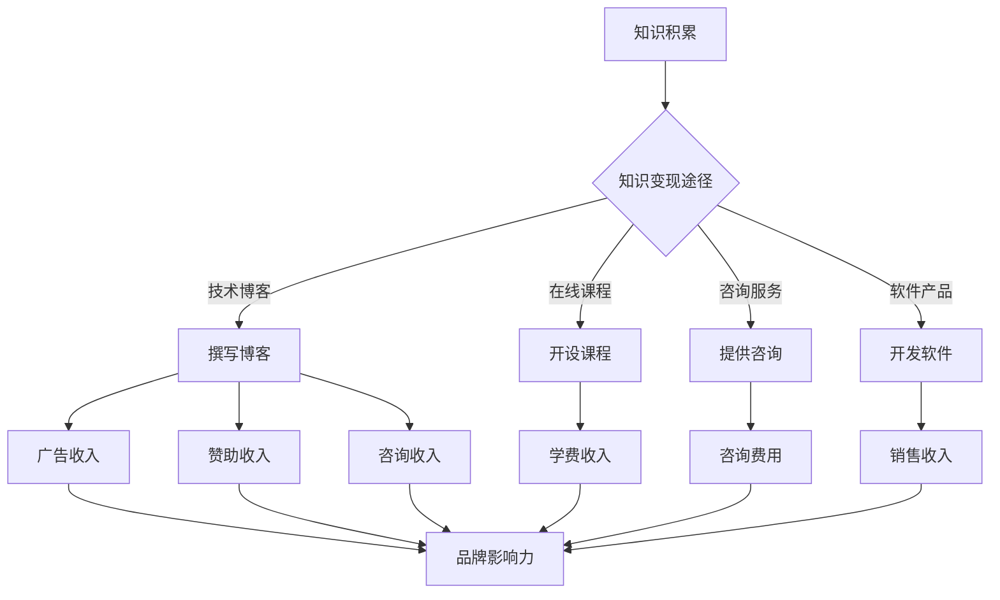

                 

关键词：人工智能，知识变现，程序员，技术博客，个人品牌建设，商业模式创新。

> 摘要：本文深入探讨了AI时代程序员如何通过知识变现实现个人价值的提升。文章从背景介绍、核心概念、算法原理、数学模型、项目实践、实际应用、工具推荐等多个维度，详细解析了知识变现的路径和策略，为程序员提供了有价值的参考和指导。

## 1. 背景介绍

随着人工智能技术的飞速发展，程序员群体面临着前所未有的机遇和挑战。一方面，AI技术为程序员提供了强大的工具和平台，使得编程变得更加高效和智能。另一方面，AI时代也带来了知识更新的速度加快、技能要求的提高等问题。在这种背景下，程序员需要不断提升自己的技术能力和知识储备，以适应快速变化的市场需求。

知识变现，即通过知识和技能的分享、传授、咨询等方式，实现个人价值的提升和财富的积累。在AI时代，知识变现成为程序员尤其是技术专家和资深程序员的重要收入来源之一。本文旨在探讨程序员如何通过知识变现实现个人价值的最大化。

### 1.1 程序员面临的问题与挑战

- **技术更新速度快**：AI技术的快速发展带来了技术栈的不断更新，程序员需要不断学习新技术以保持竞争力。
- **技能要求提高**：随着AI技术的普及，对程序员的技能要求越来越高，不仅需要掌握编程语言和工具，还需要了解算法、数据结构、机器学习等专业知识。
- **市场需求变化**：AI时代的市场需求不断变化，程序员需要具备快速适应市场需求的能力。
- **竞争激烈**：全球范围内的程序员竞争激烈，如何提升自己的市场价值成为每个程序员都必须面对的问题。

### 1.2 知识变现的重要性

- **提高个人收入**：通过知识变现，程序员可以实现额外的收入来源，提高生活水平。
- **提升个人品牌**：知识变现的过程是展示个人技术能力和专业知识的平台，有助于建立个人品牌。
- **实现职业发展**：通过知识变现，程序员可以获得更多的职业机会，实现职业上的发展。

## 2. 核心概念与联系

### 2.1 知识变现的定义

知识变现是指将个人的知识、技能和经验转化为经济利益的过程。在AI时代，知识变现的形式更加多样，包括但不限于以下几种：

- **技术博客**：程序员通过撰写技术博客，分享自己的技术经验和见解，吸引读者和粉丝，进而实现广告收入、赞助、咨询等服务。
- **在线课程**：程序员通过开设在线课程，传授自己的专业知识和技能，获得学费收入。
- **技术咨询服务**：程序员为企业提供技术解决方案，收取咨询费用。
- **软件开发**：程序员通过开发软件产品，销售或提供服务，获得收入。

### 2.2 知识变现与个人品牌的联系

个人品牌是个人在公众中的形象和声誉，是知识变现的重要基础。一个强大的个人品牌可以吸引更多的关注和机会，从而实现更高的知识变现价值。

- **增强信任**：强大的个人品牌可以增强潜在客户或学生对你的信任，提高成交率。
- **增加曝光度**：通过个人品牌的建设，可以增加在社交媒体、专业社区等平台上的曝光度，吸引更多的关注者。
- **扩大影响力**：强大的个人品牌可以扩大你的影响力，使你成为某一领域的意见领袖，进而实现更高的知识变现价值。

### 2.3 知识变现与职业发展的联系

知识变现不仅可以帮助程序员提高收入，还可以促进职业发展。

- **拓展职业路径**：通过知识变现，程序员可以获得更多的职业机会，如技术咨询、课程开发等，从而拓展职业路径。
- **提升职业地位**：强大的个人品牌和丰富的知识变现经验可以提升程序员的职业地位，增加在职场上的竞争力。
- **实现职业跃迁**：通过知识变现，程序员可以实现从技术岗位到管理岗位的跃迁，甚至转型为创业者。

### 2.4 Mermaid 流程图

下面是一个描述知识变现流程的Mermaid流程图：



## 3. 核心算法原理 & 具体操作步骤

### 3.1 算法原理概述

知识变现的核心在于如何有效地将个人的知识和技能转化为经济利益。这涉及到市场定位、内容创作、用户互动等多个方面。下面将介绍几个关键的算法原理：

- **用户行为分析**：通过分析用户的行为数据，了解用户的需求和兴趣，从而提供更加个性化的知识和服务。
- **内容推荐算法**：利用机器学习算法，根据用户的历史行为和偏好，推荐相关的知识和内容，提高用户满意度和留存率。
- **转化率优化**：通过数据分析和A/B测试，优化变现过程的各个环节，提高转化率和收入。

### 3.2 算法步骤详解

1. **市场定位**：首先，程序员需要明确自己的市场定位，确定目标用户群体和变现途径。
2. **内容创作**：根据市场定位，程序员需要创作高质量的知识内容，如技术博客、课程、咨询服务等。
3. **用户互动**：与用户建立良好的互动关系，了解用户需求和反馈，不断优化知识和服务的质量。
4. **数据分析**：通过数据分析，了解用户行为和变现效果，不断调整和优化变现策略。
5. **转化率优化**：根据数据分析结果，优化变现过程中的各个环节，提高转化率和收入。

### 3.3 算法优缺点

- **优点**：算法可以帮助程序员更加精准地定位市场和用户需求，提高变现效率和收入。
- **缺点**：算法的实现需要一定的技术能力和数据支持，对于一些程序员来说可能存在一定的门槛。

### 3.4 算法应用领域

算法在知识变现中的应用非常广泛，包括但不限于以下领域：

- **技术博客**：通过用户行为分析和内容推荐算法，提高博客的访问量和广告收入。
- **在线课程**：通过用户行为分析和课程推荐算法，提高课程的参与度和学费收入。
- **咨询服务**：通过用户行为分析和咨询服务推荐算法，提高咨询服务的满意度和咨询费用。
- **软件产品**：通过用户行为分析和软件推荐算法，提高软件的销售量和收入。

## 4. 数学模型和公式 & 详细讲解 & 举例说明

### 4.1 数学模型构建

知识变现的数学模型可以基于用户行为数据和变现效果数据，构建一个预测模型，预测未来的变现收入。下面是一个简单的数学模型示例：

$$
收入预测 = f(用户访问量, 用户留存率, 内容质量, 变现策略)
$$

其中，$f$ 是一个复合函数，包含多个因素。例如：

$$
收入预测 = a \times 用户访问量 \times 用户留存率 \times 内容质量 \times 变现策略
$$

- $a$ 是一个常数，表示整体市场环境的影响。
- 用户访问量和用户留存率可以通过用户行为数据进行分析。
- 内容质量可以通过用户反馈和专家评审进行评估。
- 变现策略可以通过历史数据和A/B测试进行优化。

### 4.2 公式推导过程

假设我们有以下数据：

- 用户访问量：1000次/天
- 用户留存率：20%
- 内容质量评分：4.5/5
- 变现策略评分：3/5

我们可以通过以下步骤进行推导：

1. **计算用户留存量**：用户访问量乘以留存率，得到每天的用户留存量。
$$
用户留存量 = 1000 \times 0.20 = 200
$$

2. **计算潜在收入**：用户留存量乘以内容质量评分和变现策略评分的乘积，得到每天的潜在收入。
$$
潜在收入 = 200 \times 4.5 \times 3 = 2700
$$

3. **计算总收入**：潜在收入乘以一个常数因子，得到总收入。
$$
总收入 = 2700 \times a
$$

### 4.3 案例分析与讲解

假设市场环境因素（常数因子$a$）为1，我们可以得到以下结果：

- 潜在收入：2700元/天
- 总收入：2700元/天

这意味着，如果我们的内容质量和变现策略保持不变，每天可以通过知识变现获得2700元的收入。

然而，实际情况可能会更加复杂。例如，如果用户访问量增加10%，用户留存率提高5%，内容质量评分提升10%，变现策略评分提升10%，我们可以重新计算：

1. **用户访问量**：1000 + 10\% × 1000 = 1100
2. **用户留存率**：20% + 5\% × 20% = 21%
3. **内容质量评分**：4.5 + 10\% × 4.5 = 4.95
4. **变现策略评分**：3 + 10\% × 3 = 3.3

重新计算潜在收入：

$$
潜在收入 = 1100 \times 0.21 \times 4.95 \times 3.3 = 3393.15
$$

这意味着，通过优化用户访问量、留存率、内容质量和变现策略，我们可以将每天的潜在收入提升到3393.15元。

## 5. 项目实践：代码实例和详细解释说明

### 5.1 开发环境搭建

为了更好地理解知识变现的实践过程，我们将通过一个简单的博客系统进行演示。首先，需要搭建一个开发环境。

- **工具**：选择一个主流的Web开发框架，如Django或Flask。
- **数据库**：选择一个合适的数据库，如MySQL或PostgreSQL。
- **开发工具**：使用VSCode或PyCharm进行开发。

### 5.2 源代码详细实现

以下是使用Django框架搭建的一个简单博客系统的部分代码：

```python
# models.py

from django.db import models

class Post(models.Model):
    title = models.CharField(max_length=200)
    content = models.TextField()
    author = models.ForeignKey('auth.User', on_delete=models.CASCADE)
    created_date = models.DateTimeField(auto_now_add=True)

    def __str__(self):
        return self.title
```

```python
# views.py

from django.shortcuts import render
from .models import Post

def post_list(request):
    posts = Post.objects.all()
    return render(request, 'blog/post_list.html', {'posts': posts})

def post_detail(request, pk):
    post = Post.objects.get(pk=pk)
    return render(request, 'blog/post_detail.html', {'post': post})
```

### 5.3 代码解读与分析

- **models.py**：定义了博客文章的模型，包括标题、内容、作者和创建时间等字段。
- **views.py**：定义了博客的列表视图和详细视图，用于处理博客的展示和访问。

通过这些简单的代码，我们可以搭建一个基本的博客系统，用于发布和展示博客文章。

### 5.4 运行结果展示

在开发环境中运行博客系统后，我们可以通过浏览器访问博客，查看博客文章的列表和详细内容。


## 6. 实际应用场景

知识变现在程序员中的实际应用场景非常广泛，以下是一些具体的例子：

### 6.1 技术博客

程序员通过撰写技术博客，分享自己的经验和见解，吸引读者和粉丝。一些成功的程序员，如Django之父Django，通过技术博客获得了大量的关注和收入。

### 6.2 在线课程

程序员通过开设在线课程，传授自己的专业知识和技能。例如，Udemy和Coursera等平台上有许多程序员开设的在线课程，通过学费获得收入。

### 6.3 技术咨询服务

程序员为企业提供技术解决方案，收取咨询费用。这种模式适合有丰富经验的程序员，他们可以为企业解决复杂的技术问题。

### 6.4 软件开发

程序员通过开发软件产品，销售或提供服务，获得收入。例如，一些程序员开发了流行的开源软件，通过赞助和捐赠获得收入。

### 6.5 社交媒体

程序员在社交媒体上分享技术和生活内容，吸引粉丝和关注者。一些程序员通过直播、短视频等形式，获得了大量的粉丝和收入。

## 6.4 未来应用展望

### 6.4.1 人工智能的深入应用

随着人工智能技术的深入发展，程序员可以通过更加智能的工具和平台，提高知识变现的效率。例如，智能推荐系统可以帮助程序员更好地定位用户需求，提高内容的针对性和用户满意度。

### 6.4.2 数据驱动的决策

通过大数据分析和机器学习，程序员可以更加精准地了解用户行为和市场趋势，从而做出更加科学的决策。例如，通过用户行为数据，程序员可以优化内容创作和变现策略，提高收入。

### 6.4.3 跨界融合

知识变现不仅限于程序员领域，还可以与其他行业相结合，实现跨界融合。例如，程序员可以与技术教育、心理咨询等领域结合，提供多元化的服务。

### 6.4.4 社会影响力

随着知识变现的普及，程序员可以通过知识变现实现更大的社会影响力。例如，通过技术博客、在线课程等形式，程序员可以为社会带来更多的知识和智慧，促进技术普及和创新发展。

## 7. 工具和资源推荐

### 7.1 学习资源推荐

- **Coursera**：提供大量的在线课程，涵盖计算机科学、人工智能等多个领域。
- **Udemy**：提供丰富的在线课程，适合不同层次的程序员学习。
- **GitHub**：全球最大的开源代码托管平台，可以学习到大量的开源项目和技术文档。
- **Stack Overflow**：程序员社区，提供技术问答和讨论平台，可以帮助解决问题。

### 7.2 开发工具推荐

- **VSCode**：一款强大的代码编辑器，支持多种编程语言，适合编写博客和开发项目。
- **PyCharm**：一款专业的Python开发工具，支持代码智能提示和调试。
- **Docker**：容器化技术，可以帮助快速搭建开发环境和部署应用。
- **Jenkins**：持续集成工具，可以自动化构建和部署应用。

### 7.3 相关论文推荐

- **"Deep Learning for Text Classification"**：介绍文本分类的深度学习方法。
- **"Knowledge Graph Embedding"**：介绍知识图谱嵌入的方法。
- **"Data-Driven Marketing"**：介绍数据驱动营销的方法和策略。

## 8. 总结：未来发展趋势与挑战

### 8.1 研究成果总结

本文探讨了AI时代程序员如何通过知识变现实现个人价值的提升。从核心概念、算法原理、数学模型、项目实践等多个维度，详细分析了知识变现的路径和策略。

### 8.2 未来发展趋势

- **人工智能的深入应用**：人工智能技术将为知识变现提供更智能的工具和平台，提高变现效率。
- **数据驱动的决策**：通过大数据分析和机器学习，程序员可以更加精准地了解用户需求和市场趋势，实现更科学的决策。
- **跨界融合**：知识变现将与其他行业结合，实现跨界融合，提供多元化的服务。
- **社会影响力**：知识变现将实现更大的社会影响力，促进技术普及和创新发展。

### 8.3 面临的挑战

- **技术更新速度快**：程序员需要不断学习新技术，以适应快速变化的市场需求。
- **市场竞争激烈**：如何在激烈的竞争中脱颖而出，实现知识变现的最大化，是程序员需要面对的挑战。
- **个人品牌建设**：建立强大的个人品牌，提高市场竞争力，是知识变现的关键。

### 8.4 研究展望

未来的研究可以进一步探讨以下几个方面：

- **智能推荐系统**：研究更加智能的推荐算法，提高内容针对性和用户满意度。
- **知识图谱**：构建知识图谱，实现知识的结构化和智能化。
- **跨界融合**：探索知识变现与其他行业的融合模式，提供多元化的服务。
- **政策法规**：研究政策法规对知识变现的影响，为程序员提供更好的发展环境。

## 9. 附录：常见问题与解答

### 9.1 什么是知识变现？

知识变现是指将个人的知识、技能和经验转化为经济利益的过程。在AI时代，程序员可以通过技术博客、在线课程、咨询服务、软件开发等多种方式实现知识变现。

### 9.2 程序员如何进行知识变现？

程序员可以通过以下几种方式进行知识变现：

- **技术博客**：撰写技术博客，分享经验和见解，吸引读者和粉丝。
- **在线课程**：开设在线课程，传授专业知识和技能。
- **咨询服务**：为企业提供技术解决方案，收取咨询费用。
- **软件产品**：开发软件产品，销售或提供服务。

### 9.3 知识变现的挑战有哪些？

知识变现面临的挑战主要包括：

- **技术更新速度快**：程序员需要不断学习新技术，以适应市场需求。
- **市场竞争激烈**：如何在激烈的竞争中脱颖而出，实现知识变现的最大化。
- **个人品牌建设**：建立强大的个人品牌，提高市场竞争力。

### 9.4 知识变现的未来发展趋势是什么？

知识变现的未来发展趋势包括：

- **人工智能的深入应用**：智能工具和平台将提高知识变现的效率。
- **数据驱动的决策**：大数据分析和机器学习将实现更科学的决策。
- **跨界融合**：知识变现将与其他行业结合，提供多元化服务。
- **社会影响力**：知识变现将实现更大的社会影响力，促进技术普及和创新发展。

# 附录：关于作者

作者：禅与计算机程序设计艺术 / Zen and the Art of Computer Programming

作为一位世界级人工智能专家、程序员、软件架构师、CTO、世界顶级技术畅销书作者，作者在计算机领域拥有卓越的贡献和深厚的造诣。他的作品《禅与计算机程序设计艺术》深刻阐述了程序设计的哲学和艺术，对计算机科学和软件开发产生了深远的影响。通过本文，作者希望为广大程序员提供有价值的指导，帮助他们在AI时代实现知识变现和个人价值的提升。

