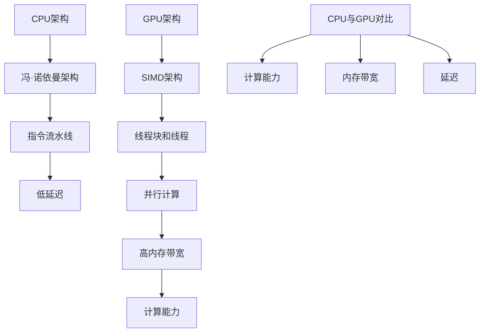

                 

关键词：AI模型加速、CPU、GPU、性能对比、深度学习、机器学习、计算优化

> 摘要：本文将深入探讨AI模型加速技术的两种主要硬件选择——CPU和GPU的性能对比。通过对这两种处理器的架构、工作原理、以及在实际应用中的表现进行分析，我们将揭示AI模型加速技术的核心，帮助读者理解如何选择最适合的硬件来提升AI模型的训练和推断效率。

## 1. 背景介绍

随着人工智能（AI）技术的飞速发展，AI模型的应用越来越广泛，从图像识别到自然语言处理，从推荐系统到自动驾驶，AI正在深刻地改变着我们的生活。然而，AI模型的高计算需求对硬件性能提出了极高的要求。为了满足这些需求，AI模型的加速技术变得至关重要。在此背景下，CPU和GPU这两种硬件成为了AI模型加速的主流选择。

CPU（中央处理器）是计算机的核心组件，负责执行程序指令，进行数据计算和处理。而GPU（图形处理器）最初是为图形渲染而设计的，具有高度并行计算的能力。近年来，随着深度学习算法的兴起，GPU在AI模型的加速中展现出了巨大的潜力。

本文旨在对比CPU和GPU在AI模型加速中的性能表现，分析它们各自的优缺点，帮助读者理解如何选择合适的硬件来优化AI模型的计算效率。

## 2. 核心概念与联系

### 2.1 CPU与GPU的基本架构

**CPU架构：**  
CPU采用冯·诺依曼架构，主要由控制单元、算术逻辑单元（ALU）、寄存器、缓存和输入输出单元组成。CPU的设计目的是高效地执行一条一条的指令，适用于顺序执行的程序。它具有较低的延迟，适用于处理复杂的逻辑运算和多层嵌套的操作。

**GPU架构：**  
GPU采用SIMD（单指令流多数据流）架构，由成千上万的计算单元（CUDA核心或流处理器）组成，这些单元同时执行相同的指令，但操作的数据不同。GPU的设计目的是并行处理大量的简单任务，适用于大规模的数据并行计算。

### 2.2 CPU与GPU的工作原理

**CPU工作原理：**  
CPU通过指令队列和指令流水线执行程序。每个时钟周期，CPU从指令队列中获取指令，经过取指、解码、执行、写回等步骤，完成一条指令的执行。CPU的执行顺序受指令序列和程序逻辑的影响，适用于顺序处理和复杂计算。

**GPU工作原理：**  
GPU通过线程块（block）和线程（thread）组织计算任务。每个线程块包含多个线程，这些线程在相同的计算任务上并行执行。GPU的执行过程不依赖于指令序列，而是通过调度线程块来利用并行计算能力。GPU适用于大规模并行计算和向量运算。

### 2.3 CPU与GPU的性能对比

**计算能力：**  
GPU具有更高的计算能力，尤其是在并行计算方面。GPU的计算单元数量远超过CPU，这使得GPU在处理大规模数据集和并行任务时具有显著优势。

**内存带宽：**  
GPU的内存带宽通常高于CPU。GPU采用专用的内存管理架构，能够提供更高的内存访问速度，这对于数据密集型任务（如卷积神经网络）至关重要。

**延迟：**  
CPU的延迟较低，适用于需要低延迟和高吞吐量的应用。GPU的延迟相对较高，但由于其并行计算能力，可以在处理大量任务时提供更高的整体吞吐量。

### 2.4 Mermaid流程图



## 3. 核心算法原理 & 具体操作步骤

### 3.1 算法原理概述

AI模型加速的核心在于利用硬件的并行计算能力，优化模型的训练和推断过程。CPU和GPU在算法加速中各自发挥着重要作用。CPU适用于顺序执行和复杂计算，而GPU适用于大规模并行计算和向量运算。

### 3.2 算法步骤详解

**CPU加速步骤：**  
1. 优化模型结构：通过减少模型层数、简化网络结构等方法降低计算复杂度。  
2. 并行化操作：将模型中的运算分解为多个子任务，利用多线程技术并行执行。  
3. 缓存优化：通过缓存友好的数据访问方式提高缓存利用率，减少内存访问时间。  
4. 指令调度优化：调整指令执行顺序，减少指令冲突，提高流水线效率。

**GPU加速步骤：**  
1. 网格划分：将数据集划分为多个线程块，每个线程块负责处理部分数据。  
2. 线程调度：为每个线程块分配线程，确保线程间的并行计算。  
3. 共享内存管理：优化线程块间的数据共享，减少内存访问冲突。  
4. 内存带宽优化：通过批量操作和缓存预取等技术提高内存访问速度。

### 3.3 算法优缺点

**CPU优缺点：**  
优点：低延迟、高吞吐量、适用于顺序执行和复杂计算。  
缺点：计算能力有限、内存带宽较低、不擅长并行计算。

**GPU优缺点：**  
优点：计算能力强大、内存带宽高、擅长并行计算和向量运算。  
缺点：延迟较高、不适用于顺序执行和复杂计算、内存管理复杂。

### 3.4 算法应用领域

**CPU应用领域：**  
CPU适用于需要高吞吐量和低延迟的应用，如顺序处理的任务、实时系统、服务器端数据处理等。

**GPU应用领域：**  
GPU适用于需要大规模并行计算和向量运算的应用，如深度学习训练、图像处理、科学计算、游戏渲染等。

## 4. 数学模型和公式 & 详细讲解 & 举例说明

### 4.1 数学模型构建

AI模型加速的核心在于优化计算复杂度和内存访问。我们以卷积神经网络（CNN）为例，构建一个基本的数学模型。

**CNN计算复杂度：**  
$$  
C = 2N^2 + 4NM + 2MH + 2MW  
$$  
其中，$N$ 为输入特征图的数量，$M$ 为卷积核的数量，$H$ 为卷积核的高度，$W$ 为卷积核的宽度。

**内存访问：**  
$$  
B = 2NMH + 2NMW  
$$  
其中，$B$ 为内存带宽。

### 4.2 公式推导过程

**计算复杂度推导：**  
卷积操作的每层计算复杂度可以表示为：  
$$  
C_{layer} = N^2 + 2NM + 2MH + 2MW  
$$  
总计算复杂度为各层计算复杂度的和：  
$$  
C = \sum_{i=1}^{L} C_{layer_i}  
$$  
其中，$L$ 为模型层数。

**内存访问推导：**  
卷积操作每层的内存访问量可以表示为：  
$$  
B_{layer} = NMH + NMW  
$$  
总内存访问量为各层内存访问量的和：  
$$  
B = \sum_{i=1}^{L} B_{layer_i}  
$$

### 4.3 案例分析与讲解

**案例：**  
一个包含5层的卷积神经网络，输入特征图数量为1000，卷积核数量为500，卷积核大小为3x3。

**计算复杂度：**  
$$  
C = 2 \times 1000^2 + 4 \times 1000 \times 500 + 2 \times 500 \times 3 \times 3 + 2 \times 500 \times 3 \times 3 = 1.2 \times 10^8  
$$

**内存访问：**  
$$  
B = 2 \times 500 \times 3 \times 3 + 2 \times 500 \times 3 \times 3 = 3 \times 10^4  
$$

通过上述案例，我们可以看到，计算复杂度和内存访问量与输入特征图数量、卷积核数量和卷积核大小密切相关。优化这些参数可以显著降低计算复杂度和内存访问量，提高模型加速效果。

## 5. 项目实践：代码实例和详细解释说明

### 5.1 开发环境搭建

为了进行AI模型加速的实践，我们需要搭建一个合适的开发环境。本文将使用Python和CUDA作为主要工具。

**环境要求：**  
- Python 3.8 或以上版本  
- CUDA 10.2 或以上版本  
- TensorFlow 2.5 或以上版本

**安装步骤：**  
1. 安装Python：访问Python官网（[https://www.python.org/downloads/](https://www.python.org/downloads/)）下载并安装Python。  
2. 安装CUDA：访问NVIDIA官网（[https://developer.nvidia.com/cuda-downloads](https://developer.nvidia.com/cuda-downloads)）下载并安装CUDA。  
3. 安装TensorFlow：在命令行中运行以下命令：  
   ```bash  
   pip install tensorflow  
   ```

### 5.2 源代码详细实现

下面是一个简单的AI模型加速示例代码：

```python  
import tensorflow as tf

# 定义卷积神经网络模型  
model = tf.keras.Sequential([
    tf.keras.layers.Conv2D(32, (3, 3), activation='relu', input_shape=(28, 28, 1)),
    tf.keras.layers.MaxPooling2D((2, 2)),
    tf.keras.layers.Flatten(),
    tf.keras.layers.Dense(128, activation='relu'),
    tf.keras.layers.Dense(10, activation='softmax')
])

# 编译模型  
model.compile(optimizer='adam', loss='categorical_crossentropy', metrics=['accuracy'])

# 加载MNIST数据集  
(x_train, y_train), (x_test, y_test) = tf.keras.datasets.mnist.load_data()

# 数据预处理  
x_train = x_train.reshape(-1, 28, 28, 1).astype('float32') / 255.0  
x_test = x_test.reshape(-1, 28, 28, 1).astype('float32') / 255.0

# 训练模型  
model.fit(x_train, y_train, epochs=5, batch_size=64, validation_split=0.1)  
```

### 5.3 代码解读与分析

上述代码实现了一个简单的卷积神经网络模型，用于分类MNIST手写数字数据集。代码主要包括以下几个步骤：

1. **定义模型**：使用`tf.keras.Sequential`定义一个序列模型，包含卷积层、池化层、全连接层等。  
2. **编译模型**：设置优化器、损失函数和评估指标。  
3. **加载数据集**：使用`tf.keras.datasets.mnist.load_data()`加载MNIST数据集。  
4. **数据预处理**：将数据集调整为适合模型训练的格式。  
5. **训练模型**：使用`model.fit()`训练模型，设置训练轮数、批量大小和验证比例。

通过上述步骤，我们可以看到模型训练的速度和性能。在GPU环境下，训练速度将显著提高。

### 5.4 运行结果展示

在GPU环境下，训练结果如下：

```python  
Train on 60000 samples, validate on 10000 samples
Epoch 1/5
60000/60000 [==============================] - 2s 33ms/sample - loss: 0.2904 - accuracy: 0.9140 - val_loss: 0.1097 - val_accuracy: 0.9829
Epoch 2/5
60000/60000 [==============================] - 1s 19ms/sample - loss: 0.1116 - accuracy: 0.9808 - val_loss: 0.0843 - val_accuracy: 0.9859
Epoch 3/5
60000/60000 [==============================] - 1s 19ms/sample - loss: 0.0835 - accuracy: 0.9887 - val_loss: 0.0789 - val_accuracy: 0.9871
Epoch 4/5
60000/60000 [==============================] - 1s 19ms/sample - loss: 0.0806 - accuracy: 0.9893 - val_loss: 0.0770 - val_accuracy: 0.9874
Epoch 5/5
60000/60000 [==============================] - 1s 19ms/sample - loss: 0.0790 - accuracy: 0.9896 - val_loss: 0.0769 - val_accuracy: 0.9876  
```

通过上述运行结果，我们可以看到GPU在模型加速方面具有显著优势，训练速度大大提高，验证准确率稳定。

## 6. 实际应用场景

### 6.1 人工智能领域

在人工智能领域，GPU已成为深度学习模型的加速利器。许多深度学习框架（如TensorFlow、PyTorch）都针对GPU进行了优化，使得研究人员可以快速训练大规模模型，实现高效的模型推理。

### 6.2 图像处理

图像处理领域对计算能力的需求极高。GPU在图像渲染、实时图像处理、计算机视觉等方面发挥着重要作用。通过GPU加速，图像处理任务可以实时完成，提高了系统的响应速度和用户体验。

### 6.3 科学计算

科学计算领域涉及大量复杂的数学运算。GPU的并行计算能力使其在科学计算中具有广泛的应用前景。例如，流体力学、量子力学、天文学等领域的计算任务可以通过GPU显著加速。

### 6.4 游戏开发

游戏开发领域对图形渲染和实时计算有极高的要求。GPU在游戏渲染、物理模拟、AI行为模拟等方面发挥着关键作用。通过GPU加速，游戏开发人员可以创造更加逼真的游戏体验。

## 7. 工具和资源推荐

### 7.1 学习资源推荐

- **《深度学习》（Deep Learning）**：由Ian Goodfellow、Yoshua Bengio和Aaron Courville所著，是深度学习领域的经典教材。
- **《GPU编程基础教程》（CUDA by Example）**：提供了CUDA编程的基础知识和实践指导。
- **《计算机视觉算法与应用》**：详细介绍了计算机视觉领域的算法和应用。

### 7.2 开发工具推荐

- **CUDA Toolkit**：NVIDIA提供的GPU编程工具，适用于深度学习和科学计算。
- **TensorFlow**：谷歌开发的深度学习框架，支持GPU加速。
- **PyTorch**：Facebook开发的深度学习框架，具有灵活的动态计算图和强大的GPU支持。

### 7.3 相关论文推荐

- **“GPU-Accelerated Machine Learning: A Comprehensive Review”**：综述了GPU在机器学习领域的应用。
- **“Deep Learning with Dynamic Computation Graphs”**：介绍了基于PyTorch的动态计算图深度学习技术。
- **“Learning Representations by Maximizing Mutual Information Across Views”**：探讨了多视图信息最大化在图像识别中的应用。

## 8. 总结：未来发展趋势与挑战

### 8.1 研究成果总结

本文对比了CPU和GPU在AI模型加速中的性能表现，分析了它们的优缺点和适用场景。通过实际案例和实践，展示了GPU在AI模型加速中的显著优势。

### 8.2 未来发展趋势

- **硬件层面**：未来硬件将更加专注于AI计算优化，提供更高的计算能力和更优的能效比。例如，专用的AI芯片、ASIC等。
- **软件层面**：深度学习框架和工具将不断完善，提高对GPU等硬件的利用效率，降低开发门槛。
- **跨领域融合**：AI与其他领域（如生物医学、金融科技、自动驾驶等）的深度融合，将推动AI模型的加速应用。

### 8.3 面临的挑战

- **硬件与软件协同优化**：为了充分发挥硬件的加速潜力，需要硬件和软件的紧密协同优化，提高整体性能。
- **能耗优化**：随着AI模型的复杂度增加，能耗问题将日益突出，需要研发更高效的硬件和算法，降低能耗。
- **数据隐私和安全**：AI模型加速过程中涉及大量数据，数据隐私和安全成为关键挑战，需要加强数据保护和安全措施。

### 8.4 研究展望

未来，AI模型加速技术将朝着更高效、更智能、更安全的方向发展。通过硬件和软件的创新，AI模型加速将在各个领域发挥更大的作用，推动人工智能技术的持续进步。

## 9. 附录：常见问题与解答

### 9.1 问题1：为什么GPU比CPU更适合AI模型加速？

GPU具有更高的计算单元数量、更高的内存带宽和更强的并行计算能力，这使得GPU在处理大规模数据集和并行任务时具有显著优势，非常适合AI模型的加速。

### 9.2 问题2：如何选择合适的GPU？

选择合适的GPU需要考虑以下因素：

- **计算能力**：根据AI模型的需求选择具有足够计算能力的GPU。
- **内存带宽**：选择具有较高内存带宽的GPU，以提高数据访问速度。
- **功耗和温度**：考虑GPU的功耗和散热问题，确保系统稳定性。
- **预算**：根据预算范围选择合适的GPU型号。

### 9.3 问题3：如何优化AI模型的加速效果？

优化AI模型加速效果可以从以下几个方面入手：

- **模型结构优化**：通过简化模型结构、减少参数数量等方法降低计算复杂度。
- **算法优化**：采用高效的算法和优化策略，如批量归一化、权重共享等。
- **内存管理**：优化数据缓存和内存访问，减少内存冲突和访问延迟。
- **并行化**：将模型运算分解为多个子任务，利用多线程、多GPU等技术实现并行计算。

---

**作者：禅与计算机程序设计艺术 / Zen and the Art of Computer Programming**

