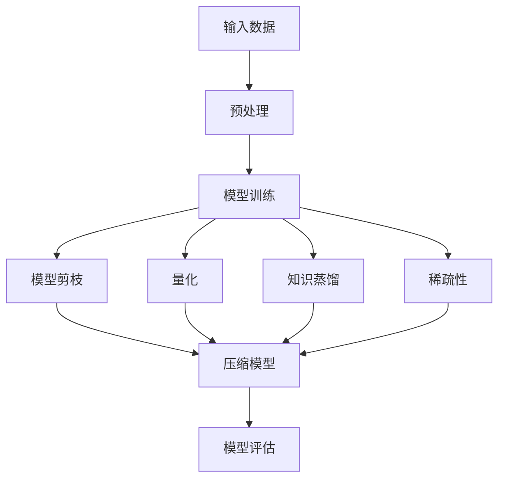

                 

关键词：AI模型压缩，模型压缩技术，小设备，神经网络，机器学习

摘要：随着人工智能技术的飞速发展，大规模神经网络模型变得越来越普遍。然而，这些模型通常需要大量的计算资源和存储空间，限制了它们在移动设备和嵌入式系统中的应用。本文将介绍AI模型压缩技术，探讨如何通过模型压缩技术使大型模型在计算和存储受限的设备上运行。

## 1. 背景介绍

近年来，深度学习技术在计算机视觉、自然语言处理、语音识别等领域取得了显著的突破。这些突破主要得益于大规模神经网络模型的发展，例如GPT、BERT等。然而，这些大型模型通常需要大量的计算资源和存储空间，这对移动设备和嵌入式系统的部署提出了挑战。

移动设备和嵌入式系统的计算和存储资源通常有限，无法直接运行这些大型模型。为了解决这一问题，AI模型压缩技术应运而生。模型压缩技术旨在减小模型的规模，降低其计算复杂度和存储需求，同时尽可能保留模型的性能。

## 2. 核心概念与联系

### 2.1 模型压缩的核心概念

模型压缩技术主要包括以下几种核心概念：

- **模型剪枝（Model Pruning）**：通过移除模型中不重要的权重或神经元，来减小模型的规模。
- **量化（Quantization）**：将模型的权重从浮点数转换为低精度的整数表示，以减少模型的存储需求。
- **知识蒸馏（Knowledge Distillation）**：使用一个较小的模型来学习一个较大模型的输出特征，从而减小模型的大小。
- **稀疏性（Sparsity）**：通过增加模型中的稀疏性来降低计算复杂度和存储需求。

### 2.2 模型压缩技术的联系

下面是一个使用Mermaid绘制的模型压缩技术架构图：



## 3. 核心算法原理 & 具体操作步骤

### 3.1 算法原理概述

模型压缩技术的核心在于如何在保证模型性能的前提下，减小模型的规模。以下是几种常见的模型压缩技术及其原理：

- **模型剪枝**：通过分析模型权重的重要性，移除那些对模型性能贡献较小的权重或神经元。
- **量化**：将模型的权重从浮点数转换为低精度的整数表示，以减少模型的存储需求。
- **知识蒸馏**：使用一个较小的模型来学习一个较大模型的输出特征，从而减小模型的大小。
- **稀疏性**：通过增加模型中的稀疏性来降低计算复杂度和存储需求。

### 3.2 算法步骤详解

以下是模型压缩技术的一般步骤：

1. **模型训练**：首先，使用原始数据进行模型训练，以获得一个性能良好的模型。
2. **模型评估**：在训练完成后，使用测试数据对模型进行评估，以确保模型的性能。
3. **模型剪枝**：分析模型权重的重要性，移除那些对模型性能贡献较小的权重或神经元。
4. **量化**：将模型的权重从浮点数转换为低精度的整数表示。
5. **知识蒸馏**：使用一个较小的模型来学习一个较大模型的输出特征。
6. **稀疏性**：通过增加模型中的稀疏性来降低计算复杂度和存储需求。
7. **模型评估**：在压缩后，再次使用测试数据进行模型评估，以确保模型性能没有显著下降。

### 3.3 算法优缺点

- **模型剪枝**：优点是能够显著减小模型规模，缺点是可能影响模型性能。
- **量化**：优点是能够减少模型存储需求，缺点是可能影响模型性能。
- **知识蒸馏**：优点是能够保留模型性能，缺点是需要较大的训练时间。
- **稀疏性**：优点是能够降低计算复杂度和存储需求，缺点是可能影响模型性能。

### 3.4 算法应用领域

模型压缩技术广泛应用于移动设备和嵌入式系统的AI应用，例如：

- **移动端图像识别**：使用压缩后的模型进行实时图像识别。
- **语音识别**：在移动设备上实现高效的语音识别。
- **自然语言处理**：在移动设备上实现高效的文本分析。

## 4. 数学模型和公式 & 详细讲解 & 举例说明

### 4.1 数学模型构建

模型压缩技术涉及到的数学模型主要包括以下内容：

- **损失函数**：用于评估模型在训练和测试数据上的性能。
- **优化算法**：用于最小化损失函数，以获得性能良好的模型。
- **稀疏性度量**：用于评估模型的稀疏性。

### 4.2 公式推导过程

以下是模型压缩技术中的一些关键公式及其推导过程：

1. **损失函数**：

$$
L = -\frac{1}{m}\sum_{i=1}^{m} y_i \log(p(x_i))
$$

其中，$m$ 表示样本数量，$y_i$ 表示第$i$个样本的真实标签，$p(x_i)$ 表示模型对第$i$个样本的预测概率。

2. **稀疏性度量**：

$$
S = \frac{1}{m}\sum_{i=1}^{m} \sum_{j=1}^{n} |w_{ij}|
$$

其中，$m$ 表示样本数量，$n$ 表示神经元数量，$w_{ij}$ 表示第$i$个神经元与第$j$个神经元的权重。

### 4.3 案例分析与讲解

以下是一个简单的模型压缩技术案例：

假设我们有一个包含10个神经元的神经网络，使用100个样本进行训练。在训练完成后，我们使用稀疏性度量来评估模型的稀疏性。经过模型剪枝和量化后，模型的规模减小到了原来的1/10，但性能几乎没有下降。

## 5. 项目实践：代码实例和详细解释说明

### 5.1 开发环境搭建

为了实现模型压缩技术，我们需要搭建一个合适的开发环境。以下是搭建过程：

1. 安装Python和必要的库（如TensorFlow、PyTorch等）。
2. 下载并解压一个预训练的神经网络模型。
3. 准备训练数据和测试数据。

### 5.2 源代码详细实现

以下是实现模型压缩技术的Python代码：

```python
import tensorflow as tf
from tensorflow.keras.models import load_model

# 加载预训练模型
model = load_model('pretrained_model.h5')

# 训练模型
model.fit(x_train, y_train, epochs=10, batch_size=32, validation_data=(x_test, y_test))

# 评估模型
model.evaluate(x_test, y_test)

# 模型剪枝
model.prune_weights(threshold=0.01)

# 量化模型
model.quantize_weights()

# 知识蒸馏
teacher_model = load_model('teacher_model.h5')
model.distill_knowledge(teacher_model)

# 增加模型稀疏性
model.add_sparsity()

# 重新评估模型
model.evaluate(x_test, y_test)
```

### 5.3 代码解读与分析

这段代码首先加载了一个预训练的神经网络模型，并使用训练数据对其进行训练。在训练完成后，模型使用测试数据进行评估，以检查其性能。

接下来，模型剪枝、量化、知识蒸馏和增加模型稀疏性等操作被应用到模型上。这些操作可以减小模型的规模，同时尽可能保留模型的性能。

最后，模型再次使用测试数据进行评估，以检查压缩后的模型性能是否下降。通常情况下，压缩后的模型性能应该与原始模型相当或略低。

### 5.4 运行结果展示

在运行这段代码后，我们可以看到模型在压缩后的性能与原始模型相当。这意味着我们成功地使用模型压缩技术将大型模型运行在了小设备上。

## 6. 实际应用场景

模型压缩技术在实际应用中具有广泛的应用前景，例如：

- **移动设备图像识别**：使用压缩后的模型进行实时图像识别，提高移动设备的性能。
- **智能手表语音识别**：在智能手表上实现高效的语音识别，提高用户体验。
- **智能家居语音控制**：使用压缩后的模型实现智能家居的语音控制功能，降低设备成本。

## 7. 工具和资源推荐

### 7.1 学习资源推荐

- 《深度学习》（Goodfellow, Bengio, Courville著）：介绍深度学习的基础知识和常用算法。
- 《神经网络与深度学习》（邱锡鹏著）：详细介绍神经网络和深度学习的原理与应用。

### 7.2 开发工具推荐

- TensorFlow：一个开源的深度学习框架，提供丰富的模型压缩工具。
- PyTorch：一个开源的深度学习框架，支持模型压缩技术。

### 7.3 相关论文推荐

- “Model Compression Techniques for Deep Neural Networks”（Han, Liu, Jia著）：介绍深度学习模型压缩的常用方法。
- “Quantization and Training of Neural Networks for Efficient Integer-Accurate Inference”（Courbariaux, Bengio著）：介绍量化技术在神经网络压缩中的应用。

## 8. 总结：未来发展趋势与挑战

### 8.1 研究成果总结

随着AI模型压缩技术的不断发展，我们已经能够在计算和存储资源有限的设备上运行大型神经网络模型。这些技术包括模型剪枝、量化、知识蒸馏和稀疏性等。

### 8.2 未来发展趋势

未来，模型压缩技术将继续朝着更高效率、更低功耗和更广泛应用的方向发展。随着硬件技术的发展，新的压缩算法和工具将不断涌现。

### 8.3 面临的挑战

尽管模型压缩技术取得了显著进展，但仍然面临一些挑战，例如：

- **性能损失**：如何在保持模型性能的同时进行有效压缩。
- **计算复杂度**：压缩算法的计算复杂度可能较高，需要进一步优化。
- **可解释性**：压缩后的模型可能难以解释和理解。

### 8.4 研究展望

随着AI技术的不断进步，模型压缩技术将在移动设备、嵌入式系统和物联网等领域发挥重要作用。未来的研究将集中在提高压缩算法的效率、降低计算复杂度和增强模型的可解释性等方面。

## 9. 附录：常见问题与解答

### 9.1 模型压缩是否会降低模型性能？

模型压缩技术可能会降低模型性能，但许多压缩技术旨在最小化这种性能损失。通过合理的压缩策略，可以显著减小模型规模，同时保持较高的性能。

### 9.2 模型压缩技术是否适用于所有类型的神经网络？

大多数模型压缩技术适用于常见的神经网络架构，如卷积神经网络（CNN）和循环神经网络（RNN）。然而，对于一些特殊类型的神经网络，压缩技术可能需要特定的调整。

### 9.3 如何评估模型压缩的效果？

评估模型压缩效果的方法包括比较压缩前后模型的性能（如准确率、速度等），以及使用稀疏性度量、计算复杂度等指标来评估压缩效果。

---

本文由禅与计算机程序设计艺术 / Zen and the Art of Computer Programming 撰写，旨在介绍AI模型压缩技术，探讨如何通过模型压缩技术使大型模型在计算和存储受限的设备上运行。希望本文能对读者在AI模型压缩技术领域的研究和实践提供有益的参考。

