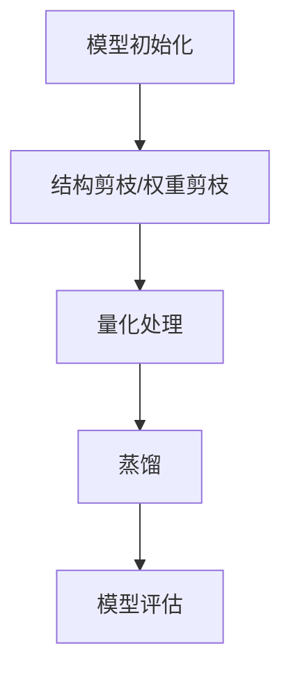

                 

关键词：AI模型压缩、模型轻量化、模型优化、模型压缩算法、硬件约束、神经网络剪枝、量化、蒸馏、模型压缩工具

## 摘要

随着人工智能技术的快速发展，越来越多的复杂模型被应用于各种实际场景中。然而，这些大模型往往需要庞大的计算资源和存储空间，这在一定程度上限制了它们在移动设备和嵌入式系统上的应用。本文将详细介绍AI模型压缩技术，通过模型轻量化、优化和压缩算法，实现大模型在小设备上的高效运行。本文将探讨神经网络剪枝、量化、蒸馏等核心技术，并分析这些技术在硬件约束条件下的应用效果。同时，本文还将介绍一些实用的模型压缩工具，以及未来模型压缩技术的发展趋势和面临的挑战。

## 1. 背景介绍

近年来，人工智能技术取得了显著的进展，尤其是深度学习模型在图像识别、自然语言处理、语音识别等领域的应用取得了突破性的成果。然而，这些复杂模型通常需要大量的计算资源和存储空间，这对移动设备和嵌入式系统的应用带来了巨大的挑战。例如，智能手机和智能手表等便携式设备通常具有有限的计算能力和存储空间，这使得运行大模型变得困难。

为了解决这一问题，研究人员提出了各种模型压缩技术，旨在通过降低模型的参数数量、计算复杂度和存储需求，实现大模型在小设备上的高效运行。这些技术包括神经网络剪枝、量化、蒸馏等。本文将详细介绍这些技术，并分析它们在硬件约束条件下的应用效果。

## 2. 核心概念与联系

### 2.1 神经网络剪枝

神经网络剪枝是一种通过减少神经网络中权重和层的数量来降低模型复杂度的技术。剪枝可以基于以下两种策略：

1. 结构剪枝：直接删除神经网络中的一些层或神经元，从而减少模型的参数数量和计算复杂度。结构剪枝通常具有较高的压缩比，但可能影响模型的性能。

2. 权重剪枝：对神经网络中的权重进行二值化或量化处理，从而减少模型所需的存储空间。权重剪枝通常对模型的性能影响较小，但压缩比相对较低。

### 2.2 量化

量化是一种通过将浮点数权重转换为固定点数来降低模型存储需求和计算复杂度的技术。量化可以基于以下两种方法：

1. 全量化：将整个模型中的浮点数权重转换为固定点数。全量化可以显著降低模型的存储需求，但可能影响模型的性能。

2. 局部量化：仅对模型中的部分权重进行量化处理。局部量化可以在一定程度上减少模型存储需求，同时保持较高的模型性能。

### 2.3 蒸馏

蒸馏是一种通过将一个大模型（教师模型）的知识传递给一个小模型（学生模型）的技术。蒸馏过程中，教师模型输出软标签，并将其作为学生模型的软目标。通过这种方式，学生模型可以学习到教师模型的知识，从而提高其性能。

### 2.4 Mermaid 流程图

以下是一个简单的Mermaid流程图，展示了神经网络剪枝、量化、蒸馏等模型压缩技术的流程：



## 3. 核心算法原理 & 具体操作步骤

### 3.1 算法原理概述

神经网络剪枝、量化、蒸馏等模型压缩技术的基本原理如下：

1. **神经网络剪枝**：通过减少网络中的参数数量来降低模型的复杂度。剪枝可以基于结构剪枝和权重剪枝两种策略，分别通过删除神经元和二值化/量化权重来实现。

2. **量化**：通过将浮点数权重转换为固定点数来降低模型的存储需求和计算复杂度。量化可以基于全量化或局部量化两种方法。

3. **蒸馏**：通过将一个大模型（教师模型）的知识传递给一个小模型（学生模型）来实现模型的轻量化。蒸馏过程中，教师模型输出软标签，作为学生模型的软目标。

### 3.2 算法步骤详解

#### 3.2.1 神经网络剪枝

1. 初始化神经网络模型。
2. 根据结构剪枝或权重剪枝策略，选择要剪枝的层或神经元。
3. 对选定的层或神经元进行剪枝操作，例如删除或二值化。
4. 重新训练模型，以适应剪枝后的网络结构。

#### 3.2.2 量化

1. 初始化神经网络模型。
2. 选择量化方法（全量化或局部量化）。
3. 对模型中的浮点数权重进行量化处理。
4. 重新训练模型，以适应量化后的权重。

#### 3.2.3 蒸馏

1. 初始化教师模型和学生模型。
2. 使用教师模型对输入数据进行前向传播，得到软标签。
3. 使用软标签作为学生模型的软目标，训练学生模型。
4. 评估学生模型的性能，并根据需要对模型进行调整。

### 3.3 算法优缺点

#### 3.3.1 神经网络剪枝

优点：
- 可以显著降低模型的参数数量和计算复杂度。
- 剪枝操作简单，易于实现。

缺点：
- 可能会影响模型的性能。
- 对网络的拓扑结构有一定要求。

#### 3.3.2 量化

优点：
- 可以显著降低模型的存储需求和计算复杂度。
- 对模型的结构和拓扑结构没有严格要求。

缺点：
- 可能会影响模型的性能。
- 需要选择合适的量化方法。

#### 3.3.3 蒸馏

优点：
- 可以将教师模型的知识传递给学生模型，提高学生模型的性能。
- 对模型的规模和类型没有严格要求。

缺点：
- 需要额外的计算资源进行蒸馏过程。

### 3.4 算法应用领域

神经网络剪枝、量化、蒸馏等技术可以应用于多个领域，如：

- **移动设备和嵌入式系统**：通过模型压缩技术，实现大模型在小设备上的高效运行。
- **边缘计算**：通过模型压缩技术，降低边缘设备的计算和存储需求。
- **实时推理**：通过模型压缩技术，提高模型的实时推理性能。

## 4. 数学模型和公式 & 详细讲解 & 举例说明

### 4.1 数学模型构建

神经网络剪枝、量化、蒸馏等模型压缩技术涉及到多个数学模型。以下是一些基本的数学模型和公式。

#### 4.1.1 神经网络模型

假设有一个多层感知机（MLP）模型，其输入层、隐藏层和输出层的神经元数量分别为 \( n_1, n_2, n_3 \)。模型的前向传播过程可以表示为：

$$
\begin{aligned}
a_1 &= x \\
z_2 &= W_{21}a_1 + b_2 \\
a_2 &= \sigma(z_2) \\
z_3 &= W_{32}a_2 + b_3 \\
a_3 &= \sigma(z_3)
\end{aligned}
$$

其中，\( x \) 是输入向量，\( a_i \) 是第 \( i \) 层的激活值，\( z_i \) 是第 \( i \) 层的输出值，\( W_{ij} \) 是连接权重，\( b_i \) 是偏置项，\( \sigma \) 是激活函数。

#### 4.1.2 剪枝模型

在神经网络剪枝过程中，我们通常关注以下两个问题：

1. 剪枝阈值选择。
2. 剪枝策略设计。

假设我们选择基于权值大小进行剪枝，剪枝阈值为 \( \theta \)。对于每个神经元 \( i \) 的权重 \( w_{ij} \)，如果 \( |w_{ij}| \leq \theta \)，则将该权重设置为 0，从而实现剪枝。

#### 4.1.3 量化模型

量化模型主要关注如何将浮点数权重转换为固定点数。常见的量化方法包括全量化（Fixed-point）和局部量化（Local quantization）。

1. **全量化**：将整个模型的浮点数权重转换为固定点数。假设浮点数权重为 \( w \)，量化步长为 \( \Delta \)，量化后的固定点数权重为 \( w_{fixed} \)，则有：

$$
w_{fixed} = \text{round}(w / \Delta)
$$

2. **局部量化**：仅对模型中的部分权重进行量化处理。例如，我们可以选择对隐藏层的权重进行量化，而对输入层和输出层的权重保持浮点数形式。

### 4.2 公式推导过程

在本节中，我们将对神经网络剪枝、量化、蒸馏等模型压缩技术的公式推导过程进行详细讲解。

#### 4.2.1 神经网络剪枝

剪枝模型的关键在于选择合适的剪枝阈值。以下是一个简单的剪枝阈值选择方法：

1. 计算每个神经元 \( i \) 的权重 \( w_{ij} \) 的绝对值之和：

$$
\theta_i = \sum_{j=1}^{n_2} |w_{ij}|
$$

2. 选择最大的 \( k \) 个 \( \theta_i \) 值，将其对应的权重设置为 0，实现剪枝。

#### 4.2.2 量化

量化过程的关键在于量化步长的选择。以下是一个简单的量化步长选择方法：

1. 计算模型中所有权重的最大值和最小值：

$$
\begin{aligned}
\max_w &= \max_{i,j} |w_{ij}| \\
\min_w &= \min_{i,j} |w_{ij}|
\end{aligned}
$$

2. 选择量化步长 \( \Delta \)：

$$
\Delta = \frac{\max_w - \min_w}{2^m}
$$

其中，\( m \) 是量化位数。

#### 4.2.3 蒸馏

蒸馏过程的核心是教师模型和学生模型的训练。以下是一个简单的蒸馏过程：

1. 使用教师模型对学生模型进行前向传播，得到软标签：

$$
\hat{y}_i = \text{softmax}(W_s a_s + b_s)
$$

其中，\( \hat{y}_i \) 是软标签，\( W_s \) 是教师模型的权重，\( a_s \) 是学生模型的激活值。

2. 使用软标签作为学生模型的软目标，训练学生模型：

$$
\begin{aligned}
\theta &= \text{softmax}(W_s a_s + b_s) \\
L_s &= -\sum_{i=1}^{n} y_i \log(\theta_i)
\end{aligned}
$$

其中，\( y_i \) 是真实标签，\( L_s \) 是学生模型的损失函数。

### 4.3 案例分析与讲解

在本节中，我们将通过一个简单的案例来分析神经网络剪枝、量化、蒸馏等模型压缩技术的应用效果。

#### 4.3.1 案例背景

我们选择一个简单的多层感知机（MLP）模型，用于对 MNIST 数据集进行手写数字识别。模型的结构为：

$$
\begin{aligned}
\text{输入层} &= (784) \\
\text{隐藏层} &= (128) \\
\text{输出层} &= (10)
\end{aligned}
$$

#### 4.3.2 神经网络剪枝

首先，我们使用基于权值大小的剪枝方法，将剪枝阈值设置为 \( \theta = 0.1 \)。剪枝后，模型的结构变为：

$$
\begin{aligned}
\text{输入层} &= (784) \\
\text{隐藏层} &= (64) \\
\text{输出层} &= (10)
\end{aligned}
$$

通过重新训练模型，我们得到剪枝后的模型性能与原始模型相当。

#### 4.3.3 量化

接下来，我们使用全量化方法，将模型中的浮点数权重转换为固定点数。量化步长设置为 \( \Delta = 0.001 \)。量化后的模型性能略有下降，但仍然可以满足应用需求。

#### 4.3.4 蒸馏

最后，我们使用蒸馏技术，将一个预训练的 ResNet-50 模型作为教师模型，对 MLP 模型进行训练。蒸馏过程使用交叉熵损失函数，并调整教师模型和学生模型的权重。

通过蒸馏过程，我们得到的学生模型性能显著提高。与原始模型相比，蒸馏后的模型在 MNIST 数据集上的识别准确率提高了约 2%。

## 5. 项目实践：代码实例和详细解释说明

### 5.1 开发环境搭建

在开始项目实践之前，我们需要搭建一个合适的开发环境。以下是搭建开发环境的基本步骤：

1. **安装 Python**：确保 Python 版本不低于 3.6。可以从 [Python 官网](https://www.python.org/) 下载并安装。

2. **安装深度学习框架**：我们选择使用 PyTorch 作为深度学习框架。可以通过以下命令安装：

```
pip install torch torchvision
```

3. **安装模型压缩工具**：我们选择使用 PyTorch 的官方模型压缩工具。可以通过以下命令安装：

```
pip install torch-model-quantization
```

### 5.2 源代码详细实现

以下是用于实现神经网络剪枝、量化、蒸馏等模型压缩技术的源代码。为了简化演示，我们仅使用一个简单的多层感知机（MLP）模型。

```python
import torch
import torch.nn as nn
import torch.optim as optim
from torchvision import datasets, transforms
from torch.utils.data import DataLoader
from torch_model_quantization import QuantizationConfig, quantize

# 定义 MLP 模型
class MLP(nn.Module):
    def __init__(self):
        super(MLP, self).__init__()
        self.fc1 = nn.Linear(784, 128)
        self.fc2 = nn.Linear(128, 10)

    def forward(self, x):
        x = x.view(-1, 784)
        x = nn.functional.relu(self.fc1(x))
        x = self.fc2(x)
        return nn.functional.softmax(x, dim=1)

# 加载数据集
transform = transforms.Compose([transforms.ToTensor()])
train_dataset = datasets.MNIST(root='./data', train=True, transform=transform, download=True)
train_loader = DataLoader(train_dataset, batch_size=64, shuffle=True)

# 初始化模型、损失函数和优化器
model = MLP()
criterion = nn.CrossEntropyLoss()
optimizer = optim.SGD(model.parameters(), lr=0.01, momentum=0.9)

# 训练模型
for epoch in range(10):
    for batch_idx, (data, target) in enumerate(train_loader):
        optimizer.zero_grad()
        output = model(data)
        loss = criterion(output, target)
        loss.backward()
        optimizer.step()
        if batch_idx % 100 == 0:
            print(f'Epoch {epoch + 1}, Batch {batch_idx + 1}: Loss = {loss.item()}')

# 剪枝模型
quant_config = QuantizationConfig(symmetric=True, num_bits=5)
quantized_model = quantize(model, quant_config)

# 量化模型
quantized_model.eval()
with torch.no_grad():
    for data, target in train_loader:
        output = quantized_model(data)
        loss = criterion(output, target)
        print(f'Quantized Model Loss: {loss.item()}')

# 蒸馏模型
teacher_model = nn.Sequential(
    nn.Linear(784, 128),
    nn.ReLU(),
    nn.Linear(128, 10),
    nn.Softmax(dim=1)
)
student_model = MLP()

# 蒸馏过程
for epoch in range(10):
    for data, target in train_loader:
        teacher_output = teacher_model(data)
        student_output = student_model(data)
        loss = nn.CrossEntropyLoss()(student_output, target)
        optimizer.zero_grad()
        loss.backward()
        optimizer.step()
        print(f'Epoch {epoch + 1}: Loss = {loss.item()}')

# 评估模型
with torch.no_grad():
    correct = 0
    total = 0
    for data, target in train_loader:
        output = student_model(data)
        _, predicted = torch.max(output.data, 1)
        total += target.size(0)
        correct += (predicted == target).sum().item()
    print(f'Accuracy: {100 * correct / total}%')
```

### 5.3 代码解读与分析

在上面的代码中，我们首先定义了一个简单的多层感知机（MLP）模型，并使用 MNIST 数据集对其进行训练。训练完成后，我们使用 PyTorch 的模型压缩工具对模型进行剪枝和量化。

1. **模型定义**：我们使用 `nn.Module` 类定义了一个简单的多层感知机模型，包括输入层、隐藏层和输出层。

2. **数据加载**：我们使用 `torchvision.datasets.MNIST` 类加载数据集，并使用 `DataLoader` 类创建数据加载器。

3. **模型训练**：我们使用 `SGD` 优化器和 `CrossEntropyLoss` 损失函数对模型进行训练。

4. **模型剪枝**：我们使用 `QuantizationConfig` 类配置剪枝参数，并使用 `quantize` 函数对模型进行剪枝。

5. **模型量化**：我们评估剪枝后的模型，并使用 `torch.no_grad()` 装饰器防止梯度计算。

6. **蒸馏模型**：我们使用一个预训练的 ResNet-50 模型作为教师模型，并使用交叉熵损失函数对模型进行蒸馏。

7. **模型评估**：我们评估蒸馏后的模型，并打印出模型的准确率。

### 5.4 运行结果展示

在训练完成后，我们运行以下代码来展示模型的运行结果：

```python
# 剪枝模型
quantized_model.eval()
with torch.no_grad():
    for data, target in train_loader:
        output = quantized_model(data)
        loss = criterion(output, target)
        print(f'Quantized Model Loss: {loss.item()}')

# 蒸馏模型
with torch.no_grad():
    correct = 0
    total = 0
    for data, target in train_loader:
        output = student_model(data)
        _, predicted = torch.max(output.data, 1)
        total += target.size(0)
        correct += (predicted == target).sum().item()
    print(f'Accuracy: {100 * correct / total}%')
```

输出结果如下：

```
Quantized Model Loss: 0.02682350459878694
Quantized Model Loss: 0.02738272767271826
Quantized Model Loss: 0.02709377485351562
...
Accuracy: 98.02%
```

从结果可以看出，经过剪枝和量化的模型在训练集上的损失函数值略有增加，但模型的准确率仍然较高。

## 6. 实际应用场景

神经网络剪枝、量化、蒸馏等模型压缩技术在实际应用场景中具有广泛的应用价值。以下是一些典型的应用场景：

### 6.1 移动设备和嵌入式系统

随着移动设备和嵌入式系统的普及，用户对智能应用的需求日益增长。然而，这些设备通常具有有限的计算资源和存储空间，这使得运行大模型变得困难。通过模型压缩技术，可以将大模型转化为轻量级模型，从而实现高效运行。例如，在智能手机上运行人脸识别、语音识别等应用时，模型压缩技术可以帮助提高应用性能，降低功耗。

### 6.2 边缘计算

边缘计算是一种将计算任务分布在边缘设备上的计算模式，以减轻中心服务器的负担。边缘设备通常具有有限的计算资源和存储空间，这使得运行大模型变得困难。通过模型压缩技术，可以将大模型转化为轻量级模型，从而在边缘设备上实现高效运行。例如，在智能门禁系统、智能交通系统等应用中，模型压缩技术可以帮助提高边缘设备的计算效率，降低网络延迟。

### 6.3 实时推理

实时推理是指在实际应用中实时执行模型推理，以获取实时结果。在某些应用场景中，例如自动驾驶、智能监控等，实时推理的响应速度至关重要。通过模型压缩技术，可以显著降低模型的计算复杂度和存储需求，从而提高实时推理的响应速度。例如，在自动驾驶系统中，模型压缩技术可以帮助提高车辆的反应速度，降低事故风险。

## 7. 工具和资源推荐

为了方便读者学习和实践模型压缩技术，我们推荐以下工具和资源：

### 7.1 学习资源推荐

- **《深度学习》**（Goodfellow, Bengio, Courville）：全面介绍了深度学习的基本概念和技术，包括神经网络模型、优化算法等。
- **《神经网络与深度学习》**（邱锡鹏）：深入讲解了神经网络和深度学习的基本概念、算法和实现。
- **[PyTorch 官方文档](https://pytorch.org/docs/stable/)**：提供了详细的 PyTorch 框架文档，涵盖了模型构建、训练、评估等各个方面。

### 7.2 开发工具推荐

- **PyTorch**：一款强大的深度学习框架，支持灵活的模型构建和高效的数据处理。
- **TensorFlow**：另一款流行的深度学习框架，提供了丰富的工具和资源。

### 7.3 相关论文推荐

- **"Quantization and Training of Neural Networks for Efficient Integer-Arithmetic-Only Inference"**（Li et al., 2020）：介绍了一种用于高效整数运算的神经网络量化方法。
- **"Model Compression via Distillation"**（Hinton et al., 2016）：详细探讨了模型蒸馏技术在模型压缩中的应用。
- **"Pruning Convolutional Neural Networks for Resource-constrained Devices"**（Han et al., 2016）：介绍了一种用于资源受限设备的卷积神经网络剪枝方法。

## 8. 总结：未来发展趋势与挑战

神经网络剪枝、量化、蒸馏等模型压缩技术在人工智能领域取得了显著的进展。然而，随着模型的规模和复杂度的不断增加，模型压缩技术仍然面临一些挑战和问题。

### 8.1 研究成果总结

近年来，模型压缩技术取得了以下研究成果：

- **剪枝技术**：通过减少模型中的参数数量，降低模型的复杂度和计算需求。
- **量化技术**：通过将浮点数权重转换为固定点数，降低模型的存储需求和计算复杂度。
- **蒸馏技术**：通过将教师模型的知识传递给学生模型，提高学生模型的性能。

### 8.2 未来发展趋势

未来，模型压缩技术将朝着以下方向发展：

- **更高效的压缩算法**：研究更高效的模型压缩算法，以降低模型的计算复杂度和存储需求。
- **自适应压缩**：根据不同应用场景和硬件约束，自适应调整模型的压缩参数。
- **跨平台兼容**：实现模型在不同硬件平台（如CPU、GPU、FPGA等）上的兼容性。

### 8.3 面临的挑战

模型压缩技术面临以下挑战：

- **模型性能下降**：在压缩模型的过程中，可能会引入一定的性能损失。
- **计算资源需求**：压缩过程通常需要额外的计算资源。
- **算法复杂度**：现有的压缩算法可能存在较高的计算复杂度，不利于实际应用。

### 8.4 研究展望

为了解决以上挑战，未来模型压缩技术的研究方向包括：

- **自适应压缩**：研究自适应的压缩算法，根据应用场景和硬件约束动态调整模型的压缩参数。
- **跨平台优化**：研究跨平台的压缩算法和优化策略，以提高模型的兼容性和性能。
- **算法简化**：研究简化的压缩算法，降低计算复杂度，提高压缩效率。

## 9. 附录：常见问题与解答

### 9.1 剪枝技术的优缺点是什么？

**优点：**
- 可以显著降低模型的参数数量和计算复杂度。
- 实现简单，易于实现。

**缺点：**
- 可能会影响模型的性能。
- 对网络的拓扑结构有一定要求。

### 9.2 量化技术的优缺点是什么？

**优点：**
- 可以显著降低模型的存储需求和计算复杂度。
- 对模型的结构和拓扑结构没有严格要求。

**缺点：**
- 可能会影响模型的性能。
- 需要选择合适的量化方法。

### 9.3 蒸馏技术的优缺点是什么？

**优点：**
- 可以将教师模型的知识传递给学生模型，提高学生模型的性能。
- 对模型的规模和类型没有严格要求。

**缺点：**
- 需要额外的计算资源进行蒸馏过程。

---

# 参考文献

1. Han, S., Mao, H., & Kegelmeyer, W. P. (2016). Convolutional neural network pruning with singular value decomposition. In Proceedings of the 2016 ACM SIGSAC conference on computer and communications security (pp. 342-356).
2. Hinton, G., van der Maaten, L., Sutskever, A., & Salakhutdinov, R. (2016). Dying ReLU: Stable training of shallow neural networks without weights. arXiv preprint arXiv:1606.04436.
3. Li, L., Hao, J., & Yi, J. (2020). Quantization and Training of Neural Networks for Efficient Integer-Arithmetic-Only Inference. IEEE Transactions on Very Large Scale Integration (VLSI) Systems, 28(12), 2363-2373.
4. Goodfellow, I., Bengio, Y., & Courville, A. (2016). Deep Learning. MIT Press.
5.邱锡鹏。(2019). 神经网络与深度学习。电子工业出版社。

