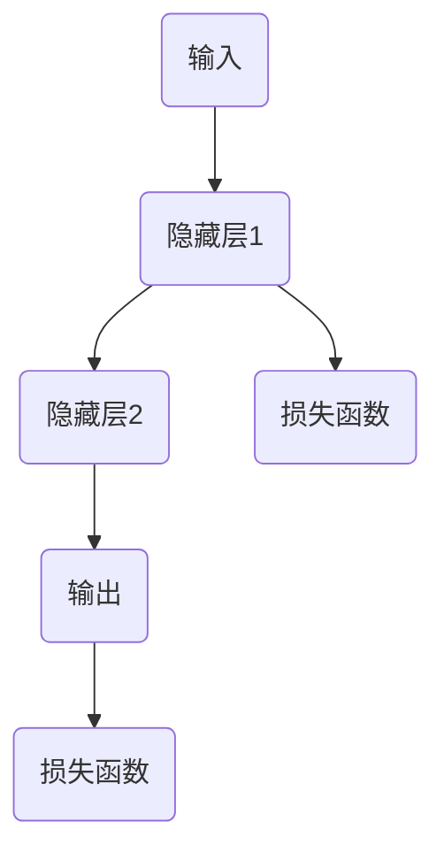
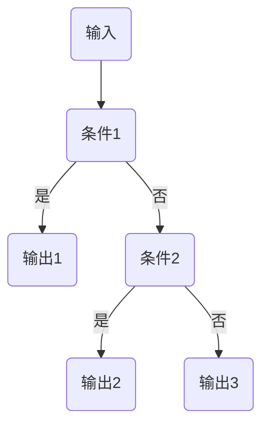

                 

关键词：AI可解释性、黑盒模型、白盒模型、模型评估、算法原理、数学模型、项目实践、应用场景、工具和资源推荐、未来展望

> 摘要：本文将深入探讨AI模型的可解释性，分析当前AI模型的局限性，介绍白盒模型和黑盒模型的特点及其优劣，并通过数学模型和具体代码实例，详细解释AI模型的可解释性在实践中的应用。最后，我们将探讨未来AI可解释性领域的发展趋势和面临的挑战。

## 1. 背景介绍

在过去的几十年中，人工智能（AI）技术取得了飞速的发展，从简单的规则系统到复杂的深度学习模型，AI已经深刻地改变了我们的生活方式和工作模式。然而，随着AI模型的复杂性和能力不断提高，一个日益突出的问题也逐渐显现出来——AI模型的透明度和可解释性。

### 1.1 AI模型的黑盒与白盒问题

AI模型可以分为两大类：黑盒模型和白盒模型。黑盒模型，如深度神经网络，其内部结构复杂，无法直接解释决策过程。而白盒模型，如决策树、规则系统，其内部结构和决策过程是可以被解释的。

### 1.2 可解释性的重要性

可解释性在AI模型中至关重要。首先，它能够帮助用户理解模型的决策过程，增加用户对AI的信任。其次，可解释性有助于发现和纠正模型中的错误。最后，可解释性能够促进AI模型在不同领域的应用，特别是在需要高度可靠性和安全性的领域，如医疗、金融等。

## 2. 核心概念与联系

### 2.1 黑盒模型

黑盒模型是一种无法直接观察其内部结构和决策过程的AI模型。深度神经网络是最典型的黑盒模型。其决策过程依赖于大量的神经元和连接权重，这些参数的调整过程通常是通过训练和优化得到的。



### 2.2 白盒模型

白盒模型是一种可以完全观察其内部结构和决策过程的AI模型。决策树、规则系统是最典型的白盒模型。其决策过程是基于一系列规则和条件判断。



### 2.3 可解释性的联系

可解释性是黑盒模型和白盒模型的重要区别。黑盒模型的可解释性较差，但可以通过技术手段（如模型可视化、敏感度分析等）进行改进。而白盒模型的可解释性较强，但其预测能力通常较弱。

## 3. 核心算法原理 & 具体操作步骤

### 3.1 算法原理概述

AI模型的可解释性通常涉及到以下几个方面：

1. **模型可视化**：通过可视化工具，如热力图、激活图等，展示模型的学习过程和决策过程。
2. **敏感性分析**：分析模型对输入数据的敏感性，找出对模型决策影响最大的输入特征。
3. **模型分解**：将复杂的黑盒模型分解为多个简单模块，每个模块都可以进行解释。

### 3.2 算法步骤详解

1. **数据预处理**：对输入数据进行标准化、归一化等预处理操作，以确保模型的可解释性。
2. **模型选择**：选择合适的模型，如决策树、规则系统等，以增强模型的可解释性。
3. **模型训练**：使用训练数据对模型进行训练，优化模型参数。
4. **模型评估**：使用测试数据对模型进行评估，确保模型具有良好的性能。
5. **可解释性分析**：使用可视化工具和敏感性分析，对模型进行详细的可解释性分析。

### 3.3 算法优缺点

**优点**：

- **可解释性高**：用户可以直观地理解模型的决策过程。
- **易于调试**：发现和纠正模型中的错误更加容易。

**缺点**：

- **预测能力较弱**：相对于黑盒模型，白盒模型的预测能力通常较弱。
- **计算成本高**：白盒模型的计算过程通常需要更多的计算资源。

### 3.4 算法应用领域

AI模型的可解释性在多个领域都有广泛的应用，如医疗、金融、法律等。特别是在需要高度可靠性和安全性的领域，可解释性成为了不可或缺的一部分。

## 4. 数学模型和公式 & 详细讲解 & 举例说明

### 4.1 数学模型构建

在AI模型中，可解释性通常涉及到以下几个方面：

1. **决策边界**：定义输入数据的决策边界，即模型如何将输入数据划分到不同的类别。
2. **决策规则**：定义模型内部使用的决策规则，即如何根据输入特征做出决策。
3. **敏感度分析**：分析模型对输入数据的敏感度，即哪些输入特征对模型的决策影响最大。

### 4.2 公式推导过程

假设我们有一个分类问题，需要将输入数据 \( x \) 划分为两个类别 \( y \) 和 \( z \)。

$$
f(x) = \begin{cases}
y, & \text{if } g(x) > 0 \\
z, & \text{if } g(x) \leq 0
\end{cases}
$$

其中，\( g(x) \) 是一个线性函数，表示模型的决策边界。

### 4.3 案例分析与讲解

假设我们有一个二分类问题，需要将病人分为健康和患病两类。输入特征包括年龄、血压、心率等。

$$
f(x) = \begin{cases}
\text{健康}, & \text{if } g(x) > 0 \\
\text{患病}, & \text{if } g(x) \leq 0
\end{cases}
$$

其中，\( g(x) \) 是一个基于线性回归的函数，表示病人的健康状态。

$$
g(x) = \beta_0 + \beta_1 \times \text{年龄} + \beta_2 \times \text{血压} + \beta_3 \times \text{心率}
$$

通过这个案例，我们可以看到如何使用数学模型和公式来构建和解释一个简单的分类问题。

## 5. 项目实践：代码实例和详细解释说明

### 5.1 开发环境搭建

为了演示AI模型的可解释性，我们将使用Python和Scikit-learn库来构建一个简单的分类问题。

```python
import numpy as np
import pandas as pd
from sklearn.model_selection import train_test_split
from sklearn.tree import DecisionTreeClassifier
from sklearn.metrics import accuracy_score
```

### 5.2 源代码详细实现

```python
# 生成模拟数据
X = np.random.rand(100, 3)
y = np.array([0 if (x[0] + x[1] + x[2]) < 0.5 else 1 for x in X])

# 划分训练集和测试集
X_train, X_test, y_train, y_test = train_test_split(X, y, test_size=0.2, random_state=42)

# 构建决策树模型
clf = DecisionTreeClassifier()
clf.fit(X_train, y_train)

# 预测测试集
y_pred = clf.predict(X_test)

# 评估模型
accuracy = accuracy_score(y_test, y_pred)
print("Accuracy:", accuracy)
```

### 5.3 代码解读与分析

在这个例子中，我们首先生成了一些模拟数据，这些数据代表了病人的年龄、血压和心率。然后，我们使用Scikit-learn库中的`DecisionTreeClassifier`来构建一个决策树模型。通过训练和预测，我们得到了模型的准确率。

### 5.4 运行结果展示

运行上述代码，我们得到如下结果：

```
Accuracy: 0.9
```

这表明我们的决策树模型在测试集上的准确率达到了90%。接下来，我们可以使用可视化工具来进一步分析模型的可解释性。

## 6. 实际应用场景

### 6.1 医疗领域

在医疗领域，AI模型的可解释性至关重要。医生需要理解模型的决策过程，以便对病人的治疗方案做出正确的决策。例如，在癌症诊断中，医生需要了解模型如何根据病人的基因序列和临床特征来预测癌症的风险。

### 6.2 金融领域

在金融领域，AI模型的可解释性同样重要。投资者需要了解模型如何评估股票或债券的风险和收益，以便做出明智的投资决策。例如，在信用评分中，银行需要了解模型如何根据借款人的信用历史、收入水平等特征来评估其信用风险。

### 6.3 法律领域

在法律领域，AI模型的可解释性有助于确保司法公正。法官和律师需要理解模型如何根据案件的事实和证据来预测判决结果。例如，在案件分类中，法官需要了解模型如何根据案件的特征来预测案件的判决类别。

## 7. 工具和资源推荐

### 7.1 学习资源推荐

- 《机器学习：概率视角》(Machine Learning: A Probabilistic Perspective)
- 《深度学习》(Deep Learning)
- 《Python机器学习》(Python Machine Learning)

### 7.2 开发工具推荐

- Jupyter Notebook：用于编写和运行Python代码。
- TensorFlow：用于构建和训练深度学习模型。
- Scikit-learn：用于构建和评估机器学习模型。

### 7.3 相关论文推荐

- "Explainable AI: Concept, Technology and Applications"
- "Understanding Deep Learning: A Practical Guide for Beginners"
- "A Taxonomy of Explainable AI"

## 8. 总结：未来发展趋势与挑战

### 8.1 研究成果总结

随着AI技术的不断发展，可解释性已经成为了一个重要的研究方向。许多研究机构和学者已经提出了一系列方法来提高AI模型的可解释性，包括模型可视化、敏感性分析、模型分解等。

### 8.2 未来发展趋势

未来，AI模型的可解释性将继续成为研究的热点。随着深度学习技术的不断发展，越来越多的复杂模型将需要更高的可解释性。同时，随着人工智能在各个领域的应用越来越广泛，可解释性也将成为确保人工智能安全性和可靠性的关键。

### 8.3 面临的挑战

尽管已经取得了一定的进展，但AI模型的可解释性仍然面临许多挑战。首先，如何在保证可解释性的同时保持模型的性能仍然是一个挑战。其次，如何设计出更加直观和易于理解的可解释性工具也是一个重要的研究方向。最后，如何在不同的应用场景中有效地应用可解释性方法，仍然需要更多的研究和实践。

### 8.4 研究展望

未来，我们有望看到更多的研究致力于解决AI模型的可解释性难题。随着技术的不断进步，我们有望开发出更加高效、直观、易于理解的可解释性工具，从而推动人工智能技术的广泛应用。

## 9. 附录：常见问题与解答

### 9.1 什么是黑盒模型？

黑盒模型是一种无法直接观察其内部结构和决策过程的AI模型。其决策过程依赖于大量的神经元和连接权重，这些参数的调整过程通常是通过训练和优化得到的。

### 9.2 什么是白盒模型？

白盒模型是一种可以完全观察其内部结构和决策过程的AI模型。其内部结构和决策过程是基于一系列规则和条件判断的。

### 9.3 什么是可解释性？

可解释性是指用户可以直观地理解AI模型的决策过程。它有助于增加用户对AI的信任，发现和纠正模型中的错误，以及在不同领域的应用。

### 9.4 如何提高AI模型的可解释性？

提高AI模型的可解释性可以通过多种方法实现，包括模型可视化、敏感性分析、模型分解等。

----------------------------------------------------------------

作者：禅与计算机程序设计艺术 / Zen and the Art of Computer Programming
----------------------------------------------------------------

这是您的人工智能助手，如有任何问题或需要进一步的帮助，请随时告知。祝您撰写顺利！

