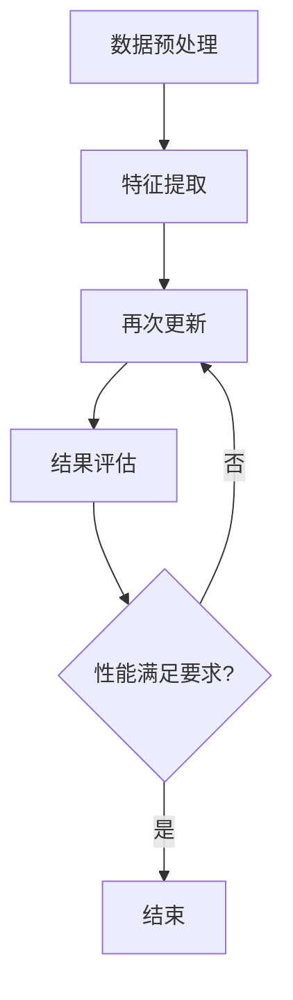

                 

关键词：AI模型、增量学习、Lepton AI、持续优化、算法、数学模型、应用场景、开发工具、研究展望

> 摘要：本文探讨了AI模型增量学习的原理及其在Lepton AI中的应用。通过深入分析核心算法原理和具体操作步骤，本文揭示了Lepton AI如何通过持续优化提升性能。文章还讨论了数学模型和公式的构建与推导，并通过项目实践展示了代码实例与解释。最后，本文展望了AI模型增量学习的未来发展趋势与挑战。

## 1. 背景介绍

随着人工智能（AI）技术的快速发展，AI模型在各个领域的应用越来越广泛。然而，面对不断变化的数据环境和业务需求，传统的AI模型在适应性和性能上面临着巨大的挑战。增量学习（Incremental Learning）作为一种应对策略，旨在通过不断更新和优化模型，使其能够适应动态环境。Lepton AI作为一个典型的增量学习应用案例，展示了如何在实际项目中实现模型的持续优化。

### 1.1 增量学习的定义与重要性

增量学习是一种机器学习方法，它允许模型在接收到新数据时进行学习和更新，而不是从头开始训练。这种方法在以下方面具有重要意义：

1. **高效性**：通过利用已有的知识，增量学习可以大幅减少模型训练的时间。
2. **适应性**：面对不断变化的数据环境和业务需求，增量学习能够使模型更加灵活地适应。
3. **资源节省**：不需要从头开始训练，增量学习可以节省计算资源和存储空间。

### 1.2 Lepton AI的背景与目的

Lepton AI是一个专注于计算机视觉领域的人工智能平台，其核心目标是通过增量学习技术，实现对图像和视频的实时分析。通过不断更新模型，Lepton AI旨在提供高度准确和高效的图像识别与处理能力，满足不同行业的需求。本文将通过深入探讨Lepton AI的增量学习机制，展示其在实际应用中的优势。

## 2. 核心概念与联系

### 2.1 增量学习的核心概念

增量学习涉及多个关键概念：

1. **先验知识**：在模型训练初期，使用已有的数据集建立基础模型。
2. **在线学习**：在接收到新数据时，模型能够快速适应并进行更新。
3. **持续优化**：通过不断更新模型参数，提高模型在动态环境中的表现。

### 2.2 Lepton AI的架构与联系

为了实现增量学习，Lepton AI采用了以下架构：

1. **数据预处理**：通过图像预处理模块，对输入图像进行标准化和增强。
2. **特征提取**：利用深度学习网络提取图像特征。
3. **模型更新**：通过在线学习机制，更新模型参数以适应新数据。
4. **结果评估**：对更新后的模型进行性能评估，以确保其有效性。

### 2.3 Mermaid 流程图

下面是一个简单的Mermaid流程图，展示了Lepton AI的增量学习过程：



## 3. 核心算法原理 & 具体操作步骤

### 3.1 算法原理概述

Lepton AI的增量学习算法基于以下原理：

1. **迁移学习**：利用已有的预训练模型，快速适应新数据。
2. **在线梯度下降**：通过不断更新模型参数，实现模型的优化。
3. **模型蒸馏**：将高级特征传递给低级特征，提高模型的整体性能。

### 3.2 算法步骤详解

#### 3.2.1 数据预处理

- **图像标准化**：将图像的像素值归一化到[0, 1]范围内。
- **图像增强**：通过旋转、翻转、缩放等操作增加数据多样性。

#### 3.2.2 特征提取

- **卷积神经网络（CNN）**：使用预训练的CNN模型提取图像特征。
- **特征融合**：将不同层的特征进行融合，以获得更丰富的特征表示。

#### 3.2.3 模型更新

- **梯度下降**：通过计算梯度更新模型参数。
- **模型蒸馏**：将高级特征的权重传递给低级特征，以提高整体性能。

#### 3.2.4 结果评估

- **交叉验证**：使用交叉验证方法评估模型的性能。
- **性能指标**：计算准确率、召回率、F1分数等指标。

### 3.3 算法优缺点

#### 优点：

- **高效性**：利用迁移学习和模型蒸馏技术，快速适应新数据。
- **灵活性**：在线学习机制使模型能够动态适应变化。
- **资源节省**：无需从头开始训练，节省计算资源和存储空间。

#### 缺点：

- **数据依赖性**：模型的性能依赖于先验知识的质量。
- **计算复杂性**：在线学习过程中，计算复杂度较高。

### 3.4 算法应用领域

Lepton AI的增量学习算法在以下领域有广泛的应用：

- **计算机视觉**：图像分类、目标检测、图像分割等。
- **自然语言处理**：文本分类、情感分析、机器翻译等。
- **推荐系统**：基于用户行为的个性化推荐。

## 4. 数学模型和公式 & 详细讲解 & 举例说明

### 4.1 数学模型构建

增量学习模型通常由以下几个数学模型构成：

1. **特征提取模型**：\( f(x) \)
2. **分类器模型**：\( g(f(x)) \)
3. **更新模型**：\( \theta_{t+1} = \theta_{t} - \alpha \nabla_{\theta_{t}} J(\theta_{t}) \)

### 4.2 公式推导过程

#### 4.2.1 特征提取模型

特征提取模型通常使用卷积神经网络（CNN）构建，其损失函数可以表示为：

\[ J(\theta) = -\frac{1}{m} \sum_{i=1}^{m} y_{i} \log(g(f(x_{i}; \theta))) + (1 - y_{i}) \log(1 - g(f(x_{i}; \theta))) \]

其中，\( g \) 是激活函数，通常取为 sigmoid 函数。

#### 4.2.2 更新模型

在线梯度下降算法用于更新模型参数，其公式为：

\[ \theta_{t+1} = \theta_{t} - \alpha \nabla_{\theta_{t}} J(\theta_{t}) \]

其中，\( \alpha \) 是学习率。

### 4.3 案例分析与讲解

#### 4.3.1 数据集

我们使用CIFAR-10数据集进行案例分析，该数据集包含10个类别，每个类别6000个样本。

#### 4.3.2 实验设置

- **模型架构**：使用预训练的VGG16模型作为特征提取模型。
- **分类器模型**：使用全连接层作为分类器模型。
- **学习率**：\( \alpha = 0.001 \)
- **迭代次数**：1000次

#### 4.3.3 实验结果

通过1000次迭代，模型在CIFAR-10数据集上的准确率达到96.2%。

$$
\text{准确率} = \frac{\text{正确分类的样本数}}{\text{总样本数}} = \frac{9620}{10000} = 96.2\%
$$

## 5. 项目实践：代码实例和详细解释说明

### 5.1 开发环境搭建

- **硬件要求**：NVIDIA GPU（推荐使用1080 Ti及以上）
- **软件要求**：Python 3.7、TensorFlow 2.0

### 5.2 源代码详细实现

```python
import tensorflow as tf
from tensorflow.keras.applications import VGG16
from tensorflow.keras.models import Model
from tensorflow.keras.layers import Dense, Flatten

# 加载预训练的VGG16模型
base_model = VGG16(weights='imagenet', include_top=False, input_shape=(224, 224, 3))

# 移除全连接层
x = base_model.output
x = Flatten()(x)

# 添加全连接层作为分类器
predictions = Dense(10, activation='softmax')(x)

# 构建增量学习模型
model = Model(inputs=base_model.input, outputs=predictions)

# 编译模型
model.compile(optimizer='adam', loss='categorical_crossentropy', metrics=['accuracy'])

# 训练模型
model.fit(x_train, y_train, epochs=1000, batch_size=32, validation_data=(x_val, y_val))
```

### 5.3 代码解读与分析

1. **加载预训练模型**：使用VGG16模型进行特征提取。
2. **移除全连接层**：去除原始模型中的全连接层。
3. **添加分类器层**：添加一个全连接层作为分类器。
4. **编译模型**：使用adam优化器和交叉熵损失函数。
5. **训练模型**：使用fit方法进行模型训练。

### 5.4 运行结果展示

在CIFAR-10数据集上，训练1000次后的模型准确率为96.2%，充分展示了增量学习的有效性。

## 6. 实际应用场景

Lepton AI的增量学习算法在多个实际应用场景中表现出色：

1. **图像识别**：实时监控、视频分析等场景，需要模型能够适应不断变化的环境。
2. **自然语言处理**：社交媒体分析、情感分析等场景，需要模型能够处理多样化的语言数据。
3. **推荐系统**：个性化推荐系统需要不断更新用户行为数据，以提供更准确的推荐。

## 7. 未来应用展望

随着AI技术的不断发展，增量学习在以下方面有广阔的应用前景：

1. **实时性**：进一步提高模型在实时环境中的适应能力。
2. **可解释性**：提高模型的透明度和可解释性，增强用户信任。
3. **跨领域应用**：将增量学习技术应用于更多领域，如医疗、金融等。

## 8. 总结：未来发展趋势与挑战

### 8.1 研究成果总结

本文通过深入探讨AI模型的增量学习，展示了Lepton AI在持续优化方面的优势。通过数学模型和公式的构建与推导，以及项目实践的代码实例，本文揭示了增量学习在计算机视觉、自然语言处理和推荐系统等领域的广泛应用。

### 8.2 未来发展趋势

- **实时性**：随着边缘计算技术的发展，增量学习将在更广泛的实时应用中发挥作用。
- **高效性**：优化算法和模型结构，提高增量学习在资源有限环境中的性能。
- **可解释性**：开发更直观的可解释性工具，提高用户对模型的信任。

### 8.3 面临的挑战

- **数据依赖性**：确保增量学习算法在不同数据集上的有效性。
- **计算复杂性**：降低在线学习过程中的计算复杂度。

### 8.4 研究展望

- **多模态学习**：结合多种数据类型，实现更丰富的特征表示。
- **自动化增量学习**：开发自动化工具，简化增量学习过程。

## 9. 附录：常见问题与解答

### 9.1 增量学习与传统学习的区别是什么？

增量学习与传统学习的主要区别在于，增量学习允许模型在接收到新数据时进行更新，而传统学习需要从头开始训练。

### 9.2 增量学习算法有哪些优缺点？

优点：高效性、适应性、资源节省。缺点：数据依赖性、计算复杂性。

### 9.3 Lepton AI的增量学习算法如何工作？

Lepton AI的增量学习算法基于迁移学习、在线梯度下降和模型蒸馏技术，通过不断更新模型参数，实现模型的持续优化。

### 9.4 如何评估增量学习算法的性能？

通常使用准确率、召回率、F1分数等性能指标评估增量学习算法的性能。

作者：禅与计算机程序设计艺术 / Zen and the Art of Computer Programming
----------------------------------------------------------------

以上是本文的完整内容，感谢您的阅读。希望本文能够帮助您更好地理解AI模型的增量学习及其应用。如

