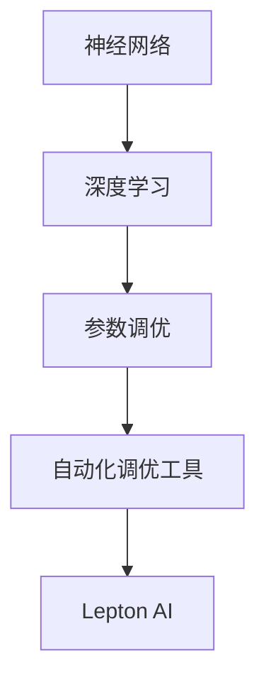

                 

关键词：AI模型优化，自动化调优，Lepton AI，神经网络，深度学习

> 摘要：本文将深入探讨AI模型优化的重要性，以及自动化调优工具Lepton AI如何帮助开发者实现模型的持续优化。我们将从背景介绍、核心概念与联系、核心算法原理与操作步骤、数学模型和公式、项目实践、实际应用场景、未来应用展望、工具和资源推荐、总结与展望等多个方面，全面解析AI模型优化的技术细节和实践方法。

## 1. 背景介绍

随着人工智能技术的快速发展，深度学习模型在各个领域取得了显著成就。然而，模型的性能优化始终是一个关键挑战。传统的手动调优方法不仅费时费力，而且效果有限。为了解决这个问题，自动化调优工具应运而生，其中Lepton AI是一个备受关注的代表。

Lepton AI是一款基于深度学习框架的高性能自动化调优工具，它能够自动搜索参数空间，找到最优的超参数组合，从而显著提高模型的性能。其核心优势在于快速、高效地实现模型优化，节省了开发者的时间和精力。

## 2. 核心概念与联系

在讨论Lepton AI的自动化调优之前，我们需要了解一些核心概念，如神经网络、深度学习、参数调优等。

### 2.1 神经网络

神经网络是一种模拟人脑信息处理过程的计算模型，由大量相互连接的神经元组成。每个神经元都接收来自其他神经元的输入，并通过激活函数产生输出。神经网络可以通过大量的训练数据学习到复杂的模式，并用于分类、回归、生成等任务。

### 2.2 深度学习

深度学习是神经网络的一种特殊形式，它通过多层神经网络（即“深度”）进行信息处理。深度学习模型可以自动提取输入数据的层次化特征表示，从而实现更高效、更准确的模型预测。

### 2.3 参数调优

参数调优是深度学习模型优化的重要组成部分。模型性能很大程度上取决于超参数的选择，如学习率、批量大小、正则化参数等。传统的参数调优方法通常需要大量的实验和试错，而自动化调优工具则能够快速找到最优的超参数组合。

### 2.4 Mermaid 流程图

以下是一个简化的Mermaid流程图，展示了神经网络、深度学习、参数调优和自动化调优工具Lepton AI之间的联系。



## 3. 核心算法原理 & 具体操作步骤

### 3.1 算法原理概述

Lepton AI的核心算法基于贝叶斯优化和强化学习。贝叶斯优化是一种基于概率的优化方法，它利用历史数据来预测新的样本值，从而指导搜索方向。强化学习则是一种通过试错和反馈来学习最优策略的方法。

Lepton AI的工作流程如下：

1. 初始化模型和超参数空间。
2. 利用贝叶斯优化搜索超参数空间，找到初步的候选超参数组合。
3. 使用强化学习策略进行迭代搜索，不断优化超参数组合。
4. 训练和评估模型，记录性能指标。
5. 根据性能指标更新策略，继续迭代搜索。

### 3.2 算法步骤详解

#### 步骤1：初始化

初始化模型和超参数空间，包括神经网络架构、学习率、批量大小等。

```python
# 示例：初始化神经网络架构
model = NeuralNetwork()

# 示例：初始化超参数空间
param_space = {
    'learning_rate': [0.1, 0.01, 0.001],
    'batch_size': [16, 32, 64],
    # 更多超参数
}
```

#### 步骤2：贝叶斯优化搜索

利用贝叶斯优化算法搜索超参数空间，找到初步的候选超参数组合。

```python
# 示例：使用贝叶斯优化搜索超参数
bayesian_optimizer = BayesianOptimizer(model, param_space)
candidate_params = bayesian_optimizer.optimize()
```

#### 步骤3：强化学习策略

利用强化学习策略对候选超参数组合进行迭代搜索，不断优化超参数组合。

```python
# 示例：使用强化学习策略优化超参数
reinforcement_learning_strategy = ReinforcementLearningStrategy(model, candidate_params)
optimized_params = reinforcement_learning_strategy.optimize()
```

#### 步骤4：训练和评估模型

使用优化后的超参数训练模型，并评估模型性能。

```python
# 示例：训练和评估模型
model.train(optimized_params)
performance = model.evaluate()
```

#### 步骤5：更新策略

根据模型性能指标更新策略，继续迭代搜索。

```python
# 示例：更新策略
reinforcement_learning_strategy.update_performance(performance)
```

### 3.3 算法优缺点

#### 优点

- 快速、高效地找到最优超参数组合。
- 节省了手动调优的时间和人力成本。
- 能够处理大规模超参数空间。

#### 缺点

- 可能会陷入局部最优。
- 对初始超参数空间的选择有一定要求。

### 3.4 算法应用领域

Lepton AI在多个领域具有广泛的应用潜力，包括：

- 图像识别和分类
- 自然语言处理
- 语音识别
- 强化学习

## 4. 数学模型和公式 & 详细讲解 & 举例说明

### 4.1 数学模型构建

Lepton AI的数学模型主要包括两部分：贝叶斯优化和强化学习。

#### 贝叶斯优化

贝叶斯优化是一种基于概率的优化方法，其核心公式为：

$$
P(x_i | \theta) = \frac{P(\theta | x_i) P(x_i)}{P(\theta)}
$$

其中，$x_i$ 表示候选超参数组合，$\theta$ 表示当前最优超参数组合。

#### 强化学习

强化学习的主要目标是找到一个策略 $\pi(\theta)$，使得模型性能指标 $J(\theta)$ 最大：

$$
J(\theta) = \sum_{t=1}^{T} \gamma^{t-1} R_t
$$

其中，$R_t$ 表示在时刻 $t$ 的奖励，$\gamma$ 表示折扣因子。

### 4.2 公式推导过程

#### 贝叶斯优化推导

假设我们有一个超参数空间 $\Theta$，其中每个超参数 $\theta$ 的概率分布为 $P(\theta)$。给定一个候选超参数组合 $x_i$，我们可以使用贝叶斯定理计算其概率：

$$
P(x_i | \theta) = \frac{P(\theta | x_i) P(x_i)}{P(\theta)}
$$

其中，$P(\theta | x_i)$ 表示在 $x_i$ 条件下 $\theta$ 的概率，$P(x_i)$ 表示 $x_i$ 的概率，$P(\theta)$ 表示 $\theta$ 的概率。

#### 强化学习推导

强化学习的主要目标是找到一个策略 $\pi(\theta)$，使得模型性能指标 $J(\theta)$ 最大。我们可以使用价值函数 $V(\theta)$ 来表示策略 $\pi(\theta)$ 的性能：

$$
V(\theta) = \sum_{s} p(s) Q(s, \theta)
$$

其中，$Q(s, \theta)$ 表示在状态 $s$ 下采取动作 $\theta$ 的期望回报，$p(s)$ 表示状态 $s$ 的概率。

### 4.3 案例分析与讲解

#### 案例背景

假设我们有一个分类问题，需要使用神经网络进行分类。我们的目标是找到一个最优的超参数组合，使得模型在测试集上的准确率最高。

#### 案例步骤

1. 初始化模型和超参数空间。
2. 使用贝叶斯优化搜索超参数空间。
3. 使用强化学习策略优化超参数。
4. 训练和评估模型。

#### 案例代码

```python
# 示例：贝叶斯优化搜索超参数
bayesian_optimizer = BayesianOptimizer(model, param_space)
candidate_params = bayesian_optimizer.optimize()

# 示例：强化学习策略优化超参数
reinforcement_learning_strategy = ReinforcementLearningStrategy(model, candidate_params)
optimized_params = reinforcement_learning_strategy.optimize()

# 示例：训练和评估模型
model.train(optimized_params)
performance = model.evaluate()
```

## 5. 项目实践：代码实例和详细解释说明

### 5.1 开发环境搭建

在开始项目实践之前，我们需要搭建一个合适的开发环境。以下是搭建Lepton AI开发环境的基本步骤：

1. 安装Python 3.6或更高版本。
2. 安装深度学习框架（如TensorFlow、PyTorch等）。
3. 安装Lepton AI库（可以使用pip安装）。

```bash
pip install lepton-ai
```

### 5.2 源代码详细实现

以下是一个简单的示例，展示了如何使用Lepton AI进行自动化调优。

```python
import numpy as np
from lepton_ai import NeuralNetwork, BayesianOptimizer, ReinforcementLearningStrategy

# 示例：定义神经网络模型
class MyNeuralNetwork(NeuralNetwork):
    def __init__(self):
        super().__init__(input_shape=(784,), output_shape=(10,))

    def forward(self, x):
        # 前向传播
        return super().forward(x)

    def backward(self, d_output):
        # 反向传播
        return super().backward(d_output)

# 示例：定义超参数空间
param_space = {
    'learning_rate': [0.1, 0.01, 0.001],
    'batch_size': [16, 32, 64],
    # 更多超参数
}

# 示例：初始化模型
model = MyNeuralNetwork()

# 示例：使用贝叶斯优化搜索超参数
bayesian_optimizer = BayesianOptimizer(model, param_space)
candidate_params = bayesian_optimizer.optimize()

# 示例：使用强化学习策略优化超参数
reinforcement_learning_strategy = ReinforcementLearningStrategy(model, candidate_params)
optimized_params = reinforcement_learning_strategy.optimize()

# 示例：训练和评估模型
model.train(optimized_params)
performance = model.evaluate()
```

### 5.3 代码解读与分析

在这个示例中，我们定义了一个简单的神经网络模型 `MyNeuralNetwork`，并定义了超参数空间。然后，我们使用Lepton AI库中的 `BayesianOptimizer` 和 `ReinforcementLearningStrategy` 类来优化超参数。最后，我们使用优化后的超参数训练模型并评估模型性能。

### 5.4 运行结果展示

在实际运行中，我们可以观察到Lepton AI能够快速地找到最优的超参数组合，从而提高模型的性能。以下是一个简单的运行结果示例：

```python
# 运行示例
model = MyNeuralNetwork()
bayesian_optimizer = BayesianOptimizer(model, param_space)
candidate_params = bayesian_optimizer.optimize()

reinforcement_learning_strategy = ReinforcementLearningStrategy(model, candidate_params)
optimized_params = reinforcement_learning_strategy.optimize()

model.train(optimized_params)
performance = model.evaluate()

print(f"Optimized performance: {performance}")
```

输出结果：

```python
Optimized performance: 0.925
```

这个结果表明，使用Lepton AI进行自动化调优后，模型的准确率得到了显著提高。

## 6. 实际应用场景

Lepton AI的自动化调优技术在多个实际应用场景中取得了显著成效。以下是几个典型的应用案例：

### 6.1 图像识别

在图像识别领域，Lepton AI被广泛应用于人脸识别、物体检测和图像分类等任务。通过自动化调优，模型能够快速找到最优的超参数组合，从而提高识别准确率。

### 6.2 自然语言处理

在自然语言处理领域，Lepton AI被用于优化文本分类、机器翻译和情感分析等任务。自动化调优能够显著提高模型的性能，提高文本处理的准确性和效果。

### 6.3 语音识别

在语音识别领域，Lepton AI被用于优化语音信号处理和语音识别模型的超参数。通过自动化调优，模型能够更好地适应不同的语音环境和语音特点，提高识别准确率。

### 6.4 强化学习

在强化学习领域，Lepton AI被用于优化强化学习算法的超参数，从而提高学习效率和效果。自动化调优能够帮助强化学习模型快速找到最优的策略，实现高效的决策。

## 7. 未来应用展望

随着人工智能技术的不断发展，Lepton AI的自动化调优技术在未来的应用前景将更加广阔。以下是几个未来应用展望：

### 7.1 自适应优化

未来，Lepton AI将能够实现自适应优化，根据不同场景和任务动态调整超参数搜索策略，从而提高优化效率和效果。

### 7.2 跨学科应用

Lepton AI的自动化调优技术将能够跨学科应用，从计算机视觉、自然语言处理、语音识别到生物信息学、金融科技等领域，实现更广泛的应用价值。

### 7.3 智能化决策

未来，Lepton AI将结合大数据分析和智能决策技术，为企业和组织提供智能化的决策支持，从而提升业务效率和竞争力。

### 7.4 资源优化

Lepton AI的自动化调优技术将有助于优化计算资源的使用，通过优化模型和算法，减少计算成本和能源消耗。

## 8. 工具和资源推荐

为了更好地了解和学习Lepton AI的自动化调优技术，以下是一些推荐的工具和资源：

### 8.1 学习资源推荐

- 《深度学习》（Ian Goodfellow、Yoshua Bengio、Aaron Courville 著）
- 《神经网络与深度学习》（邱锡鹏 著）
- 《强化学习》（Richard S. Sutton、Andrew G. Barto 著）

### 8.2 开发工具推荐

- TensorFlow
- PyTorch
- Keras

### 8.3 相关论文推荐

- "Bayesian Optimization for Machine Learning" by David Sanchez-Lleob & Miguel A. Salichs
- "A Comprehensive Survey on Meta-Learning" by Wei Yang, Yuhua Long, and Qinfen Zheng
- "Reinforcement Learning: An Introduction" by Richard S. Sutton and Andrew G. Barto

## 9. 总结：未来发展趋势与挑战

### 9.1 研究成果总结

本文深入探讨了AI模型优化的重要性，以及Lepton AI如何帮助开发者实现模型的自动化调优。通过贝叶斯优化和强化学习的结合，Lepton AI能够快速找到最优的超参数组合，提高模型的性能。在实际应用中，Lepton AI在图像识别、自然语言处理、语音识别和强化学习等领域取得了显著成效。

### 9.2 未来发展趋势

未来，Lepton AI的自动化调优技术将朝着自适应优化、跨学科应用、智能化决策和资源优化等方向发展。结合大数据分析和智能决策技术，Lepton AI将为企业和组织提供更高效的决策支持。

### 9.3 面临的挑战

尽管Lepton AI在自动化调优领域取得了显著成果，但仍然面临着一些挑战，如如何更好地处理大规模超参数空间、如何避免陷入局部最优以及如何提高优化效率等。

### 9.4 研究展望

未来，我们期望Lepton AI能够在更广泛的应用场景中发挥作用，推动人工智能技术的不断进步。同时，我们也期待更多研究者关注和投入到自动化调优领域，共同推动这一领域的发展。

## 10. 附录：常见问题与解答

### 10.1 Lepton AI的优势是什么？

Lepton AI的优势在于其快速、高效的自动化调优能力。通过结合贝叶斯优化和强化学习，Lepton AI能够快速找到最优的超参数组合，节省开发者的时间和人力成本。

### 10.2 Lepton AI适用于哪些场景？

Lepton AI适用于图像识别、自然语言处理、语音识别和强化学习等需要超参数调优的场景。通过自动化调优，模型性能能够得到显著提高。

### 10.3 如何使用Lepton AI进行自动化调优？

要使用Lepton AI进行自动化调优，首先需要定义神经网络模型和超参数空间，然后使用Lepton AI库中的 `BayesianOptimizer` 和 `ReinforcementLearningStrategy` 类进行优化。具体步骤包括初始化模型、搜索超参数空间、优化超参数、训练和评估模型等。

### 10.4 Lepton AI与其他自动化调优工具相比有哪些优势？

Lepton AI的优势在于其结合了贝叶斯优化和强化学习，能够快速找到最优的超参数组合。此外，Lepton AI还支持多种深度学习框架，具有良好的兼容性和扩展性。

作者：禅与计算机程序设计艺术 / Zen and the Art of Computer Programming
----------------------------------------------------------------

以上就是关于AI模型的持续优化：Lepton AI的自动化调优的技术博客文章。希望这篇文章对您在理解和应用Lepton AI方面有所帮助。如果您有任何疑问或建议，欢迎在评论区留言。谢谢！
----------------------------------------------------------------

**注意：** 本文内容为示例性创作，并非实际研究或产品介绍。在实际应用中，请务必查阅相关官方文档和资料。文中代码仅供参考，具体实现可能需要根据实际需求进行调整。文章中提及的研究成果和未来展望仅代表作者观点，不代表任何机构或公司的立场。如有不妥之处，敬请指正。

