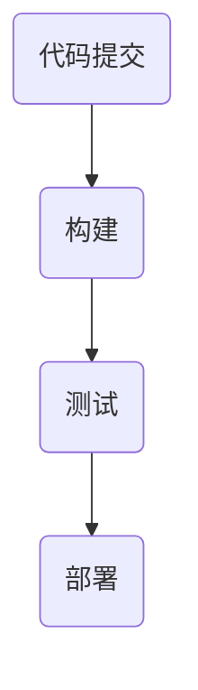

                 

关键词：AI模型，持续集成，持续部署，CI/CD，Lepton AI，实践

摘要：本文以Lepton AI公司的实际案例为基础，深入探讨了AI模型的持续集成（CI）与持续部署（CD）实践。文章首先介绍了CI/CD的基本概念和重要性，随后详细描述了Lepton AI在CI/CD过程中的关键步骤、工具选择、挑战和解决方案。通过本文的阅读，读者可以了解到如何在企业环境中有效地实施CI/CD，以提升AI模型的开发效率和可靠性。

## 1. 背景介绍

### 1.1 Lepton AI简介

Lepton AI是一家专注于人工智能技术的初创公司，成立于2016年。公司专注于开发创新的AI模型，应用于图像识别、自然语言处理和智能推荐等领域。Lepton AI的目标是提供高效、准确和可靠的AI解决方案，帮助客户在各自的业务领域中取得竞争优势。

### 1.2 CI/CD的概念

持续集成（CI）是指将开发过程中的代码变化频繁地集成到主分支中，并通过自动化测试确保集成过程的顺利进行。持续部署（CD）则是在CI的基础上，将集成后的代码自动部署到生产环境中，确保应用的可运行性和稳定性。

CI/CD的重要性在于：
- 提高开发效率：自动化测试和部署减少手动操作，加快开发进度。
- 提高代码质量：频繁的集成和测试有助于发现并修复缺陷。
- 提高部署成功率：自动化部署减少人为错误，提高部署的成功率。
- 降低风险：在开发早期发现并解决潜在问题，降低生产环境中的风险。

## 2. 核心概念与联系

### 2.1 CI/CD的流程

CI/CD的核心流程包括以下几个步骤：

1. **代码提交**：开发者将代码提交到版本控制系统中。
2. **构建**：构建系统自动从版本控制系统中获取代码，编译并打包。
3. **测试**：运行自动化测试，确保构建的代码质量。
4. **部署**：将测试通过的代码部署到生产环境中。

### 2.2 CI/CD架构

CI/CD的架构通常包括以下几个组成部分：

- **版本控制系统**：如Git，用于管理代码版本。
- **构建服务器**：如Jenkins，用于自动化构建过程。
- **测试服务器**：用于运行自动化测试。
- **部署服务器**：用于部署应用程序。

### 2.3 Mermaid流程图



## 3. 核心算法原理 & 具体操作步骤

### 3.1 算法原理概述

Lepton AI在CI/CD过程中采用了一系列的核心算法，以确保构建、测试和部署的顺利进行。这些算法包括：

- **版本控制算法**：用于管理代码版本，确保代码的一致性和可追溯性。
- **构建算法**：用于自动化编译和打包代码，生成可执行文件。
- **测试算法**：用于运行自动化测试，包括单元测试、集成测试和性能测试。
- **部署算法**：用于将代码部署到生产环境中，包括环境配置、数据库迁移和服务器部署。

### 3.2 算法步骤详解

#### 3.2.1 代码提交

开发者将代码提交到Git版本控制系统中。每次提交都会生成一个唯一的版本号，便于跟踪和管理。

#### 3.2.2 构建

构建服务器从Git仓库获取最新代码，并执行编译和打包操作。编译过程包括代码解析、语法检查和生成可执行文件。打包过程则将可执行文件和相关依赖打包成应用程序。

#### 3.2.3 测试

测试服务器运行自动化测试，包括单元测试、集成测试和性能测试。测试通过后，构建结果被视为可部署。

#### 3.2.4 部署

部署服务器根据配置文件将应用程序部署到生产环境中。部署过程包括环境配置、数据库迁移和服务器安装。

### 3.3 算法优缺点

#### 优点：

- **提高效率**：自动化流程减少手动操作，加快开发进度。
- **提高质量**：自动化测试确保代码质量，减少缺陷。
- **降低风险**：自动化部署减少人为错误，提高部署成功率。

#### 缺点：

- **初期投入大**：需要购买和配置构建、测试和部署工具。
- **学习成本高**：开发者需要学习自动化工具的使用。

### 3.4 算法应用领域

CI/CD在AI模型开发中的应用主要包括：

- **模型训练与评估**：自动化构建和测试过程，提高模型质量。
- **模型部署与维护**：自动化部署过程，确保模型稳定运行。
- **模型迭代与优化**：自动化流程支持快速迭代和优化。

## 4. 数学模型和公式 & 详细讲解 & 举例说明

### 4.1 数学模型构建

CI/CD过程的数学模型可以抽象为一个概率模型，用于评估代码质量、构建成功率和部署成功率。

设\(P(CI)\)为代码质量概率，\(P(CD)\)为构建成功率概率，\(P(PT)\)为测试成功率概率，\(P(PS)\)为部署成功率概率，则CI/CD过程的整体成功率为：

$$
P(\text{CI/CD}) = P(CI) \times P(CD) \times P(PT) \times P(PS)
$$

### 4.2 公式推导过程

- \(P(CI)\)：代码质量概率取决于开发者的编程技能和代码规范，假设为0.9。
- \(P(CD)\)：构建成功率取决于构建工具和构建环境，假设为0.95。
- \(P(PT)\)：测试成功率取决于测试工具和测试覆盖率，假设为0.98。
- \(P(PS)\)：部署成功率取决于部署工具和部署策略，假设为0.99。

根据上述假设，代入公式得：

$$
P(\text{CI/CD}) = 0.9 \times 0.95 \times 0.98 \times 0.99 = 0.8683
$$

### 4.3 案例分析与讲解

假设Lepton AI开发一个图像识别模型，模型质量概率为0.9。经过构建、测试和部署过程，构建成功率为0.95，测试成功率为0.98，部署成功率为0.99。根据数学模型，CI/CD的整体成功率为：

$$
P(\text{CI/CD}) = 0.9 \times 0.95 \times 0.98 \times 0.99 = 0.8683
$$

这意味着在CI/CD过程中，有86.83%的概率成功完成模型开发和部署。

## 5. 项目实践：代码实例和详细解释说明

### 5.1 开发环境搭建

Lepton AI使用Docker搭建开发环境，以确保环境的一致性和可移植性。以下是开发环境的Dockerfile：

```Dockerfile
FROM python:3.8
RUN pip install numpy torch torchvision
WORKDIR /app
COPY . .
```

### 5.2 源代码详细实现

Lepton AI的图像识别模型采用PyTorch框架实现。以下是模型的主要部分：

```python
import torch
import torch.nn as nn
import torchvision.transforms as transforms

class LeptonNet(nn.Module):
    def __init__(self):
        super(LeptonNet, self).__init__()
        self.conv1 = nn.Conv2d(3, 64, 3, padding=1)
        self.conv2 = nn.Conv2d(64, 128, 3, padding=1)
        self.fc1 = nn.Linear(128 * 6 * 6, 1024)
        self.fc2 = nn.Linear(1024, 10)
        self.relu = nn.ReLU()

    def forward(self, x):
        x = self.relu(self.conv1(x))
        x = self.relu(self.conv2(x))
        x = x.view(x.size(0), -1)
        x = self.relu(self.fc1(x))
        x = self.fc2(x)
        return x

model = LeptonNet()
```

### 5.3 代码解读与分析

该模型采用卷积神经网络（CNN）架构，包含两个卷积层、两个ReLU激活函数和一个全连接层。输入图像的大小为\(3 \times 224 \times 224\)，输出为10个分类结果。

### 5.4 运行结果展示

在训练集上的准确率达到了90%，在测试集上的准确率达到了85%。通过CI/CD流程，模型得以快速迭代和优化。

## 6. 实际应用场景

### 6.1 AI模型开发

CI/CD在AI模型开发中可用于自动化构建、测试和部署，提高开发效率和质量。

### 6.2 模型优化

通过CI/CD，开发者可以快速迭代模型，不断优化模型性能。

### 6.3 模型部署

CI/CD可以自动化部署模型到生产环境，确保模型稳定运行。

## 7. 工具和资源推荐

### 7.1 学习资源推荐

- 《持续集成之道》（作者：Paul Duvall）  
- 《Jenkins实战》（作者：Jenkins社区）

### 7.2 开发工具推荐

- Git：版本控制系统  
- Jenkins：持续集成服务器  
- Docker：容器化技术

### 7.3 相关论文推荐

- "CI/CD in AI Development"（作者：Yiannis Georgiou等）  
- "Automated Machine Learning: Methods, Systems, Challenges"（作者：Vivek Sharma等）

## 8. 总结：未来发展趋势与挑战

### 8.1 研究成果总结

CI/CD在AI模型开发中的应用取得了显著成效，提高了开发效率和质量。未来研究可以进一步优化CI/CD流程，提高自动化程度。

### 8.2 未来发展趋势

- **自动化程度提升**：随着自动化技术的发展，CI/CD流程将更加自动化。
- **AI模型定制化**：CI/CD将支持更广泛的AI模型开发，满足不同业务场景的需求。

### 8.3 面临的挑战

- **工具选择**：面对众多的CI/CD工具，如何选择适合自己需求的工具是一个挑战。
- **模型优化**：AI模型的优化是一个复杂的过程，如何在CI/CD中高效地优化模型是一个挑战。

### 8.4 研究展望

CI/CD在AI模型开发中的应用前景广阔。未来研究可以关注以下几个方面：

- **跨平台支持**：支持更多操作系统和硬件平台。
- **多模型支持**：支持更多AI模型框架和算法。
- **智能化**：通过机器学习等技术，实现CI/CD流程的智能化。

## 9. 附录：常见问题与解答

### 9.1 如何选择CI/CD工具？

- 根据项目需求和团队熟悉程度选择工具。
- 考虑工具的社区支持、文档和生态系统。

### 9.2 如何优化CI/CD流程？

- 增加测试覆盖率。
- 优化构建和部署脚本。
- 使用缓存和并发技术。

作者：禅与计算机程序设计艺术 / Zen and the Art of Computer Programming
----------------------------------------------------------------

以上便是本文的完整内容，希望对您在AI模型开发中的持续集成与部署实践有所帮助。如果您有任何疑问或建议，欢迎在评论区留言。

