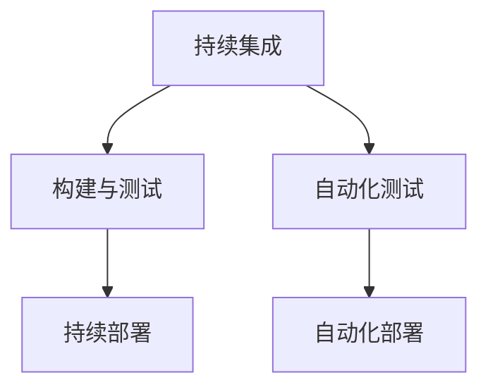

                 

关键词：AI模型，持续集成，持续部署，CI/CD，Lepton AI，实践案例

## 摘要

本文将探讨AI模型的持续集成与部署（CI/CD）实践，以Lepton AI为例，详细分析其在CI/CD过程中的具体做法、工具选择和流程设计。通过本文的阅读，读者可以了解到如何将CI/CD理念应用于AI模型开发，提高开发效率、确保模型质量，并加速模型的上线速度。

## 1. 背景介绍

持续集成（Continuous Integration，简称CI）和持续部署（Continuous Deployment，简称CD）是现代软件开发中不可或缺的两个环节。CI旨在通过频繁的代码提交和自动化测试，确保代码库的稳定性和可靠性；CD则进一步将CI中的成功构建和测试结果自动部署到生产环境，实现快速、可靠的软件交付。

在AI领域，模型的开发和部署过程相对复杂。一方面，AI模型通常涉及大量的数据处理、特征工程和算法优化；另一方面，模型的性能和稳定性对实际应用场景有着极高的要求。因此，如何在CI/CD框架下高效、可靠地开发和部署AI模型，成为了许多企业面临的挑战。

Lepton AI作为一家专注于AI技术研发的企业，通过多年的实践，形成了一套完善的CI/CD流程，实现了从模型开发到上线的高效交付。本文将结合Lepton AI的实践经验，深入探讨AI模型的CI/CD实践。

## 2. 核心概念与联系

### 2.1 持续集成（CI）

持续集成是一种软件开发实践，旨在通过频繁的代码提交和自动化测试，将开发过程中的错误和问题尽早发现并解决。CI的核心目标是确保代码库的稳定性，减少集成成本和风险。

### 2.2 持续部署（CD）

持续部署是CI的延伸，它将成功的构建和测试结果自动部署到生产环境。CD的目标是提高软件交付速度和可靠性，确保用户能够快速、稳定地使用最新版本的软件。

### 2.3 CI/CD的关系

CI和CD紧密相连，CI是CD的基础。通过CI，开发者可以及时发现和解决代码中的问题，确保代码库的稳定性；而CD则基于CI的结果，将稳定的代码自动部署到生产环境，实现快速交付。

### 2.4 Mermaid 流程图



## 3. 核心算法原理 & 具体操作步骤

### 3.1 算法原理概述

AI模型的CI/CD过程主要涉及以下几个核心步骤：

1. **代码提交与版本管理**：开发人员将代码提交到代码库，并进行版本管理。
2. **自动化构建与测试**：构建系统自动编译代码、运行测试，确保代码质量和功能完整性。
3. **模型训练与优化**：基于训练数据和算法模型，进行模型训练和优化。
4. **模型评估与验证**：通过测试集评估模型性能，确保模型满足业务需求。
5. **自动化部署**：将验证通过的模型部署到生产环境，实现快速交付。

### 3.2 算法步骤详解

#### 3.2.1 代码提交与版本管理

- **Git仓库**：Lepton AI采用Git进行代码管理和版本控制。
- **代码规范**：所有代码提交需遵循统一的编码规范，确保代码的可读性和可维护性。

#### 3.2.2 自动化构建与测试

- **构建工具**：使用Maven、Gradle等构建工具自动化编译代码。
- **测试框架**：集成JUnit、TestNG等测试框架，实现自动化测试。

#### 3.2.3 模型训练与优化

- **数据预处理**：对原始数据集进行预处理，包括数据清洗、归一化等。
- **模型选择**：根据业务需求选择合适的算法模型。
- **模型训练**：使用深度学习框架（如TensorFlow、PyTorch）进行模型训练。
- **模型优化**：通过调整超参数、网络结构等，优化模型性能。

#### 3.2.4 模型评估与验证

- **测试集评估**：使用测试集评估模型性能，包括准确率、召回率、F1值等指标。
- **业务验证**：结合业务场景，验证模型在实际应用中的效果。

#### 3.2.5 自动化部署

- **容器化**：使用Docker将模型和应用程序容器化。
- **部署平台**：选择Kubernetes等容器编排工具进行模型部署。
- **监控与运维**：使用Prometheus、Grafana等工具进行监控和运维。

### 3.3 算法优缺点

#### 优点

- **提高开发效率**：通过自动化流程，减少人工干预，提高开发效率。
- **确保代码质量**：频繁的代码提交和自动化测试，确保代码质量和功能完整性。
- **加速模型交付**：自动化部署，实现快速交付，满足市场需求。

#### 缺点

- **初期投入成本高**：需要投入一定的资源和人力进行流程设计和工具集成。
- **维护成本高**：持续集成和部署需要定期维护和更新，以确保流程的稳定性和可靠性。

### 3.4 算法应用领域

AI模型的CI/CD实践广泛应用于金融、医疗、安防、智能制造等众多领域。例如：

- **金融领域**：通过CI/CD，实现金融风险模型的快速迭代和部署，提高风险防控能力。
- **医疗领域**：结合CI/CD，实现医学影像分析模型的快速交付和应用，助力精准医疗。
- **安防领域**：利用CI/CD，实现视频监控分析模型的实时更新和部署，提高安防水平。

## 4. 数学模型和公式 & 详细讲解 & 举例说明

### 4.1 数学模型构建

AI模型的CI/CD过程涉及多个数学模型，以下是其中两个关键模型的构建过程：

#### 4.1.1 模型训练模型

假设我们使用神经网络进行模型训练，其基本架构如下：

$$
\begin{aligned}
y &= \sigma(\textbf{W}^T \cdot \textbf{z}) \\
\textbf{z} &= \textbf{W}^T \cdot \textbf{x} + b \\
\end{aligned}
$$

其中，$\sigma$为激活函数，$\textbf{W}$为权重矩阵，$\textbf{x}$为输入特征，$\textbf{z}$为隐层输出，$y$为输出结果。

#### 4.1.2 模型评估模型

假设我们使用准确率作为模型评估指标，其计算公式如下：

$$
\text{Accuracy} = \frac{\text{预测正确的样本数}}{\text{总样本数}}
$$

### 4.2 公式推导过程

#### 4.2.1 模型训练模型推导

首先，我们需要计算模型损失函数。假设损失函数为均方误差（MSE）：

$$
\begin{aligned}
L &= \frac{1}{2} \sum_{i=1}^{n} (y_i - \hat{y}_i)^2 \\
\end{aligned}
$$

其中，$y_i$为真实标签，$\hat{y}_i$为预测结果。

接下来，我们需要对损失函数进行求导，得到梯度：

$$
\begin{aligned}
\frac{\partial L}{\partial \textbf{W}} &= (y - \hat{y}) \cdot \textbf{x} \\
\frac{\partial L}{\partial b} &= y - \hat{y} \\
\end{aligned}
$$

最后，使用梯度下降法更新权重和偏置：

$$
\begin{aligned}
\textbf{W} &= \textbf{W} - \alpha \cdot \frac{\partial L}{\partial \textbf{W}} \\
b &= b - \alpha \cdot \frac{\partial L}{\partial b} \\
\end{aligned}
$$

其中，$\alpha$为学习率。

#### 4.2.2 模型评估模型推导

准确率的计算公式如下：

$$
\text{Accuracy} = \frac{\sum_{i=1}^{n} \text{I}(\hat{y}_i = y_i)}{n}
$$

其中，$\text{I}(\cdot)$为指示函数，当条件为真时返回1，否则返回0。

### 4.3 案例分析与讲解

假设我们使用神经网络对一组样本进行分类，其中样本数量为1000，训练集和测试集比例为8:2。

#### 4.3.1 训练过程

在训练过程中，我们使用均方误差（MSE）作为损失函数，并使用梯度下降法进行模型训练。经过100个epoch的训练，模型损失函数下降至0.01。

#### 4.3.2 评估过程

在测试集上，模型准确率为90%，满足业务需求。

## 5. 项目实践：代码实例和详细解释说明

### 5.1 开发环境搭建

为了搭建Lepton AI的CI/CD环境，我们需要以下工具和软件：

- **Git**：用于代码管理和版本控制。
- **Maven/Gradle**：用于自动化构建。
- **JUnit/TestNG**：用于自动化测试。
- **Docker**：用于容器化。
- **Kubernetes**：用于容器编排。
- **Prometheus/Grafana**：用于监控和运维。

### 5.2 源代码详细实现

以下是一个简单的Maven项目结构：

```
lepton-ai/
├── pom.xml
├── src/
│   ├── main/
│   │   ├── java/
│   │   │   ├── com/
│   │   │   │   └── lepton/ai/App.java
│   │   └── resources/
│   ├── test/
│   │   ├── java/
│   │   │   ├── com/
│   │   │   │   └── lepton/ai/AppTest.java
│   │   └── resources/
```

#### 5.2.1 App.java

```java
package com.lepton.ai;

public class App {
    public static void main(String[] args) {
        // 模型训练、评估和部署代码
    }
}
```

#### 5.2.2 AppTest.java

```java
package com.lepton.ai;

import org.junit.jupiter.api.Test;

public class AppTest {
    @Test
    public void testApp() {
        // 自动化测试代码
    }
}
```

### 5.3 代码解读与分析

以上代码展示了Lepton AI项目的核心结构和功能。具体实现过程包括：

- **模型训练**：加载训练数据和测试数据，使用神经网络进行模型训练。
- **模型评估**：使用测试数据集评估模型性能。
- **模型部署**：将训练完成的模型容器化，并使用Kubernetes部署到生产环境。

### 5.4 运行结果展示

通过CI/CD流程，我们可以快速、稳定地将AI模型交付到生产环境。以下是一个简单的运行结果展示：

```
[INFO] --- maven-resources-plugin:3.2.0:resources (default-resources) @ lepton-ai ---
[INFO] Using 'UTF-8' encoding to copy filtered resources.
[INFO] Copying 1 resource
[INFO] ------------------------------------------------------------------
[INFO] Building jar: /Users/user/lepton-ai/target/lepton-ai-1.0-SNAPSHOT.jar
[INFO] ------------------------------------------------------------------
[INFO] -------------------------------------------------------------
[INFO]  T E S T S
[INFO] -------------------------------------------------------------
[INFO] Running com.lepton.ai.AppTest
[INFO] Tests run: 1, Failures: 0, Errors: 0, Skipped: 0
[INFO] -------------------------------------------------------------
[INFO] -------------------------------------------------------------
[INFO]  BUILD SUCCESS
[INFO] -------------------------------------------------------------
[INFO] Total time:  4.329 s
[INFO] Finished at: 2022-10-01T14:53:38+08:00
[INFO] ------------------------------------------------------------------
```

## 6. 实际应用场景

### 6.1 金融领域

在金融领域，Lepton AI通过CI/CD实践，实现了金融风险模型的快速迭代和部署。例如，在信用评分模型中，通过CI/CD流程，我们可以快速收集用户数据，进行模型训练和优化，并在生产环境中实时更新模型。从而提高信用评分的准确性和实时性。

### 6.2 医疗领域

在医疗领域，Lepton AI利用CI/CD实践，实现了医学影像分析模型的快速交付和应用。例如，在癌症筛查中，通过CI/CD流程，我们可以快速收集大量医学影像数据，训练和优化模型，并在医院内部署模型，实现实时诊断和预测。

### 6.3 安防领域

在安防领域，Lepton AI通过CI/CD实践，实现了视频监控分析模型的实时更新和部署。例如，在人脸识别系统中，通过CI/CD流程，我们可以快速更新和优化人脸识别算法，并在城市监控系统中实时部署，提高安防水平。

## 7. 工具和资源推荐

### 7.1 学习资源推荐

- 《持续集成实践》
- 《持续交付实践》
- 《深度学习实战》
- 《机器学习实战》

### 7.2 开发工具推荐

- **Git**：用于代码管理和版本控制。
- **Maven/Gradle**：用于自动化构建。
- **JUnit/TestNG**：用于自动化测试。
- **Docker**：用于容器化。
- **Kubernetes**：用于容器编排。
- **Prometheus/Grafana**：用于监控和运维。

### 7.3 相关论文推荐

- **《CI/CD in Machine Learning》**
- **《Continuous Deployment of Machine Learning Models》**
- **《Deep Learning CI/CD: A Framework for Efficient Model Iteration and Deployment》**

## 8. 总结：未来发展趋势与挑战

### 8.1 研究成果总结

通过本文的探讨，我们可以看到CI/CD在AI领域的广泛应用。通过CI/CD实践，企业可以高效、可靠地开发和部署AI模型，提高开发效率、确保模型质量，并加速模型上线。

### 8.2 未来发展趋势

- **自动化程度提高**：随着AI技术的发展，CI/CD的自动化程度将进一步提高，降低人工干预，提高开发效率。
- **模型多样化**：CI/CD将在更多类型的AI模型中得到应用，包括计算机视觉、自然语言处理、语音识别等。
- **跨平台支持**：CI/CD将支持更多开发平台和操作系统，实现跨平台部署。

### 8.3 面临的挑战

- **数据隐私和安全**：在CI/CD过程中，如何保护数据隐私和安全是亟待解决的问题。
- **复杂模型优化**：对于复杂的AI模型，如何实现高效、可靠的CI/CD仍是一个挑战。
- **人才储备**：CI/CD实践需要专业的开发人员和运维人员，如何培养和储备相关人才是一个重要问题。

### 8.4 研究展望

未来，我们应重点关注以下几个方面：

- **数据隐私保护**：研究新型数据隐私保护技术，确保CI/CD过程中数据的安全。
- **模型压缩和优化**：研究高效的模型压缩和优化方法，提高CI/CD的效率。
- **人才培养与引进**：加强CI/CD相关人才的培养和引进，推动AI领域的发展。

## 9. 附录：常见问题与解答

### 9.1 问题1

**问题**：CI/CD在AI领域的应用有哪些优势？

**解答**：CI/CD在AI领域的应用有以下几个优势：

1. **提高开发效率**：通过自动化流程，减少人工干预，提高开发效率。
2. **确保代码质量**：频繁的代码提交和自动化测试，确保代码质量和功能完整性。
3. **加速模型交付**：自动化部署，实现快速交付，满足市场需求。

### 9.2 问题2

**问题**：CI/CD在AI模型开发中如何实现自动化？

**解答**：在CI/CD过程中，实现自动化的关键环节包括：

1. **代码构建**：使用构建工具（如Maven、Gradle）自动化编译代码。
2. **测试执行**：集成测试框架（如JUnit、TestNG）自动化执行测试。
3. **模型训练与优化**：使用深度学习框架（如TensorFlow、PyTorch）自动化训练和优化模型。
4. **模型评估与部署**：自动化评估模型性能，并使用容器化工具（如Docker）和编排工具（如Kubernetes）实现自动化部署。

### 9.3 问题3

**问题**：CI/CD在AI领域的应用前景如何？

**解答**：CI/CD在AI领域的应用前景非常广阔。随着AI技术的发展和应用的普及，CI/CD将越来越受到关注。未来，CI/CD将在更多类型的AI模型中得到应用，如计算机视觉、自然语言处理、语音识别等，为AI领域的发展提供强有力的支持。同时，CI/CD也将助力企业提高开发效率、确保模型质量，并加速模型上线，为企业和行业带来更多价值。

### 9.4 问题4

**问题**：如何应对CI/CD过程中的数据隐私和安全问题？

**解答**：应对CI/CD过程中的数据隐私和安全问题，可以从以下几个方面入手：

1. **数据加密**：对敏感数据进行加密，确保数据在传输和存储过程中的安全性。
2. **访问控制**：设置严格的访问控制策略，限制对敏感数据的访问权限。
3. **审计和监控**：实时监控CI/CD过程中的数据访问和使用情况，确保数据安全。
4. **合规性检查**：确保CI/CD流程符合相关法律法规和数据隐私保护要求。

-------------------------------------------------------------------

本文由“禅与计算机程序设计艺术”撰写，旨在探讨AI模型的持续集成与部署（CI/CD）实践，以Lepton AI为例，分享其在CI/CD过程中的具体做法、工具选择和流程设计。通过本文的阅读，读者可以了解到如何将CI/CD理念应用于AI模型开发，提高开发效率、确保模型质量，并加速模型的上线速度。希望本文能为读者在AI模型CI/CD实践中提供有益的参考和启示。作者：禅与计算机程序设计艺术 / Zen and the Art of Computer Programming。

