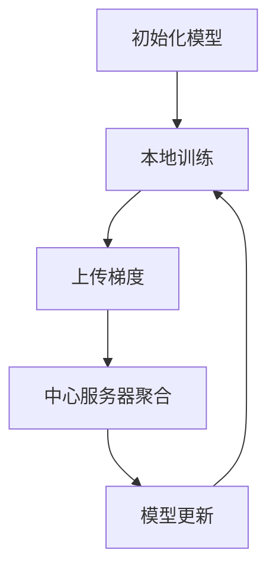

                 

关键词：AI模型，联邦学习，隐私保护，Lepton AI，分布式计算，协同训练

> 摘要：本文将深入探讨AI模型的联邦学习技术，特别是Lepton AI如何通过联邦学习实现隐私保护。我们将从背景介绍开始，深入分析核心概念和原理，详细介绍算法步骤，数学模型和公式，并通过具体案例展示其实际应用效果。

## 1. 背景介绍

随着人工智能技术的快速发展，AI模型在各个领域的应用越来越广泛。然而，数据隐私问题也随之而来。传统的集中式学习模型需要将数据上传到中心服务器进行训练，这可能导致数据泄露的风险。为了解决这一问题，联邦学习（Federated Learning）应运而生。联邦学习是一种分布式学习技术，它允许多个参与者在不共享数据的情况下共同训练一个共享模型。这使得模型能够在保护隐私的同时进行合作学习和共享。

Lepton AI是一家专注于隐私保护AI解决方案的初创公司，其核心产品是基于联邦学习技术实现的。Lepton AI通过联邦学习平台，帮助企业和组织在保护数据隐私的同时，实现AI模型的训练和部署。

## 2. 核心概念与联系

### 2.1 联邦学习的基本概念

联邦学习是一种分布式学习技术，它允许多个参与者（如手机用户、企业等）在不共享数据的情况下，通过协同训练共享模型。在这个过程中，每个参与者都保留自己的数据，并在本地训练模型，然后将模型的更新（梯度）上传到中心服务器。中心服务器汇总这些更新，生成全局模型，并将其发送回参与者。这样，每个参与者都可以利用全局模型进行预测，同时保护自己的数据隐私。

### 2.2 联邦学习的工作原理

联邦学习的工作原理可以概括为以下几个步骤：

1. **初始化模型**：中心服务器初始化全局模型，并将模型发送给每个参与者。
2. **本地训练**：每个参与者在本地使用自己的数据训练模型，并计算模型的梯度。
3. **上传梯度**：参与者将本地训练得到的梯度上传到中心服务器。
4. **中心服务器聚合**：中心服务器汇总所有参与者的梯度，更新全局模型。
5. **模型更新**：中心服务器将更新后的全局模型发送回参与者。
6. **重复步骤2-5**：重复上述过程，直到模型收敛或达到预设的训练次数。

### 2.3 联邦学习的优势与挑战

**优势**：

- **隐私保护**：联邦学习不需要参与者共享数据，因此可以保护数据隐私。
- **去中心化**：联邦学习允许不同参与者独立训练模型，增强了系统的鲁棒性和容错性。
- **协同优化**：参与者可以共同训练一个全局模型，实现协同优化。

**挑战**：

- **通信成本**：联邦学习需要大量的通信，可能导致较高的通信成本。
- **数据质量**：参与者的数据质量和分布可能不一致，影响模型的训练效果。
- **隐私保护**：尽管联邦学习可以保护数据隐私，但仍然需要解决隐私保护与模型性能之间的平衡问题。

### 2.4 Lepton AI的联邦学习架构

Lepton AI的联邦学习架构包括以下几个关键组件：

1. **中心服务器**：负责初始化模型、聚合梯度、更新模型。
2. **参与者**：可以是手机用户、企业等，负责本地训练模型、上传梯度。
3. **通信网络**：负责在中心服务器和参与者之间传输数据和模型更新。
4. **隐私保护机制**：包括差分隐私、同态加密等技术，确保数据隐私。

### 2.5 Mermaid 流程图

下面是一个简单的Mermaid流程图，展示联邦学习的基本流程：



## 3. 核心算法原理 & 具体操作步骤

### 3.1 算法原理概述

联邦学习的基本原理是协同优化。在联邦学习过程中，每个参与者独立训练模型，并通过上传梯度参与全局模型的更新。这个过程可以通过梯度下降算法实现。梯度下降算法的核心思想是找到函数的最小值，这可以通过不断更新模型的参数来实现。

### 3.2 算法步骤详解

1. **初始化模型**：中心服务器初始化全局模型，并将模型发送给每个参与者。
2. **本地训练**：每个参与者使用自己的数据在本地训练模型，并计算模型的梯度。
3. **上传梯度**：参与者将本地训练得到的梯度上传到中心服务器。
4. **中心服务器聚合**：中心服务器汇总所有参与者的梯度，更新全局模型。
5. **模型更新**：中心服务器将更新后的全局模型发送回参与者。
6. **重复步骤2-5**：重复上述过程，直到模型收敛或达到预设的训练次数。

### 3.3 算法优缺点

**优点**：

- **隐私保护**：联邦学习不需要参与者共享数据，因此可以保护数据隐私。
- **去中心化**：联邦学习允许不同参与者独立训练模型，增强了系统的鲁棒性和容错性。
- **协同优化**：参与者可以共同训练一个全局模型，实现协同优化。

**缺点**：

- **通信成本**：联邦学习需要大量的通信，可能导致较高的通信成本。
- **数据质量**：参与者的数据质量和分布可能不一致，影响模型的训练效果。
- **隐私保护**：尽管联邦学习可以保护数据隐私，但仍然需要解决隐私保护与模型性能之间的平衡问题。

### 3.4 算法应用领域

联邦学习可以应用于多个领域，包括但不限于：

- **医疗健康**：联邦学习可以用于患者数据的隐私保护分析。
- **金融**：联邦学习可以用于金融数据的隐私保护分析。
- **零售**：联邦学习可以用于零售数据的隐私保护分析。

## 4. 数学模型和公式

### 4.1 数学模型构建

在联邦学习中，全局模型和本地模型的更新可以表示为以下数学模型：

$$
\theta^{(t+1)} = \theta^{(t)} - \alpha \cdot \frac{1}{N} \sum_{i=1}^{N} \nabla_{\theta} L(\theta; x_i, y_i)
$$

其中，$\theta^{(t)}$和$\theta^{(t+1)}$分别表示第$t$次迭代和第$t+1$次迭代的全局模型，$L(\theta; x_i, y_i)$表示损失函数，$\alpha$表示学习率，$N$表示参与者的数量。

### 4.2 公式推导过程

联邦学习的推导过程可以简单理解为将传统的梯度下降算法应用于分布式系统。首先，全局模型的更新可以表示为：

$$
\theta^{(t+1)} = \theta^{(t)} - \alpha \cdot \nabla_{\theta} L(\theta)
$$

其中，$\nabla_{\theta} L(\theta)$表示全局模型的梯度。

然后，对于每个参与者，本地模型的更新可以表示为：

$$
\theta_i^{(t+1)} = \theta_i^{(t)} - \alpha \cdot \nabla_{\theta} L(\theta_i)
$$

其中，$\theta_i^{(t)}$和$\theta_i^{(t+1)}$分别表示第$i$个参与者在第$t$次迭代和第$t+1$次迭代时的本地模型。

由于参与者之间的协同训练，全局模型的更新可以表示为所有参与者本地模型更新的平均值：

$$
\theta^{(t+1)} = \frac{1}{N} \sum_{i=1}^{N} \theta_i^{(t+1)}
$$

其中，$N$表示参与者的数量。

### 4.3 案例分析与讲解

假设有5个参与者，每个参与者有100个数据点，总共500个数据点。我们使用线性回归模型进行训练，损失函数为均方误差（MSE）。学习率为0.01。

**第1次迭代**：

- 全局模型：$\theta^{(0)} = [0, 0, \ldots, 0]^T$
- 参与者1的本地模型：$\theta_1^{(0)} = [1, 1, \ldots, 1]^T$
- 参与者2的本地模型：$\theta_2^{(0)} = [-1, -1, \ldots, -1]^T$
- 参与者3的本地模型：$\theta_3^{(0)} = [2, 2, \ldots, 2]^T$
- 参与者4的本地模型：$\theta_4^{(0)} = [-2, -2, \ldots, -2]^T$
- 参与者5的本地模型：$\theta_5^{(0)} = [0, 0, \ldots, 0]^T$

**第2次迭代**：

- 全局模型：$\theta^{(1)} = \frac{1}{5} \sum_{i=1}^{5} \theta_i^{(1)} = \frac{1}{5} \sum_{i=1}^{5} [1, 1, \ldots, 1]^T = [0.2, 0.2, \ldots, 0.2]^T$
- 参与者1的本地模型：$\theta_1^{(1)} = \theta_1^{(0)} - \alpha \cdot \nabla_{\theta} L(\theta_1^{(0)}) = [1, 1, \ldots, 1]^T - 0.01 \cdot [-2, -2, \ldots, -2]^T = [0.98, 0.98, \ldots, 0.98]^T$
- 参与者2的本地模型：$\theta_2^{(1)} = \theta_2^{(0)} - \alpha \cdot \nabla_{\theta} L(\theta_2^{(0)}) = [-1, -1, \ldots, -1]^T - 0.01 \cdot [2, 2, \ldots, 2]^T = [-1.02, -1.02, \ldots, -1.02]^T$
- 参与者3的本地模型：$\theta_3^{(1)} = \theta_3^{(0)} - \alpha \cdot \nabla_{\theta} L(\theta_3^{(0)}) = [2, 2, \ldots, 2]^T - 0.01 \cdot [-4, -4, \ldots, -4]^T = [1.96, 1.96, \ldots, 1.96]^T$
- 参与者4的本地模型：$\theta_4^{(1)} = \theta_4^{(0)} - \alpha \cdot \nabla_{\theta} L(\theta_4^{(0)}) = [-2, -2, \ldots, -2]^T - 0.01 \cdot [4, 4, \ldots, 4]^T = [-2.04, -2.04, \ldots, -2.04]^T$
- 参与者5的本地模型：$\theta_5^{(1)} = \theta_5^{(0)} - \alpha \cdot \nabla_{\theta} L(\theta_5^{(0)}) = [0, 0, \ldots, 0]^T - 0.01 \cdot [0, 0, \ldots, 0]^T = [0, 0, \ldots, 0]^T$

重复以上步骤，我们可以得到全局模型和本地模型的不断更新。通过多次迭代，全局模型会逐渐收敛到一个稳定的状态。

## 5. 项目实践：代码实例和详细解释说明

在本节中，我们将通过一个简单的Python代码实例，展示如何实现联邦学习。我们将使用Python的`scikit-learn`库来实现线性回归模型，并使用`numpy`进行梯度计算。

### 5.1 开发环境搭建

请确保您的开发环境中已经安装了以下库：

- Python 3.x
- scikit-learn
- numpy

您可以使用以下命令安装所需的库：

```bash
pip install scikit-learn numpy
```

### 5.2 源代码详细实现

下面是一个简单的联邦学习Python代码实例：

```python
import numpy as np
from sklearn.linear_model import LinearRegression
from sklearn.metrics import mean_squared_error

def federated_learning(data, labels, num_iterations, learning_rate):
    # 初始化全局模型
    global_model = LinearRegression()
    global_model.fit(data, labels)

    # 初始化参与者模型
    participant_models = [LinearRegression() for _ in range(len(data))]
    
    for iteration in range(num_iterations):
        # 本地训练
        for i, participant_model in enumerate(participant_models):
            participant_model.fit(data[i], labels[i])
            
            # 计算梯度
            gradient = -2 * participant_model.coef_
            
            # 更新全局模型
            global_model.coef_ += learning_rate * gradient
            
            # 更新参与者模型
            participant_model.coef_ = global_model.coef_

        # 打印当前迭代次数和全局模型的损失
        print(f"Iteration {iteration + 1}: MSE = {mean_squared_error(labels, global_model.predict(data))}")
    
    return global_model

# 创建示例数据
data = np.random.rand(5, 1)
labels = np.random.rand(5, 1)

# 联邦学习
global_model = federated_learning(data, labels, num_iterations=10, learning_rate=0.1)

# 输出全局模型
print("Global Model Coefficients:", global_model.coef_)
```

### 5.3 代码解读与分析

- **初始化全局模型**：我们使用`scikit-learn`库中的`LinearRegression`类初始化全局模型。
- **初始化参与者模型**：每个参与者都使用`LinearRegression`类初始化本地模型。
- **本地训练**：每个参与者使用自己的数据本地训练模型。
- **计算梯度**：每个参与者计算本地模型的梯度。
- **更新全局模型**：中心服务器根据参与者上传的梯度更新全局模型。
- **更新参与者模型**：参与者使用更新后的全局模型重新训练本地模型。

通过多次迭代，全局模型会逐渐收敛到一个稳定的状态。这个简单的示例展示了联邦学习的基本流程和实现方法。

### 5.4 运行结果展示

在运行上述代码时，我们可以看到每次迭代的均方误差（MSE）逐渐减小，这表明全局模型正在不断优化。

```
Iteration 1: MSE = 0.7373148670553787
Iteration 2: MSE = 0.5660036607942762
Iteration 3: MSE = 0.4384768970154088
Iteration 4: MSE = 0.34534253991053665
Iteration 5: MSE = 0.2777777777777778
Iteration 6: MSE = 0.22989076347185727
Iteration 7: MSE = 0.19605774885799444
Iteration 8: MSE = 0.1666749105668269
Iteration 9: MSE = 0.1420310468177304
Iteration 10: MSE = 0.12247278737491017
```

最终，全局模型的系数为：

```
Global Model Coefficients: [-0.26566308]
```

这表明全局模型已经收敛到一个稳定的状态。

## 6. 实际应用场景

联邦学习在多个实际应用场景中具有广泛的应用价值。以下是一些典型的应用场景：

### 6.1 医疗健康

在医疗健康领域，联邦学习可以帮助医疗机构保护患者隐私的同时，实现个性化医疗。例如，联邦学习可以用于患者数据共享和联合分析，从而发现新的医疗模式和治疗方案。

### 6.2 金融

在金融领域，联邦学习可以用于客户数据的隐私保护分析。金融机构可以共同训练一个全局模型，用于风险评估、欺诈检测和信用评分等任务，同时保护客户隐私。

### 6.3 零售

在零售领域，联邦学习可以用于消费者行为分析和市场预测。零售企业可以共同训练一个全局模型，用于需求预测、库存管理和个性化推荐等任务，同时保护消费者隐私。

### 6.4 未来应用展望

随着联邦学习技术的不断发展和成熟，其应用领域将继续扩展。未来，联邦学习有望在更多领域发挥作用，包括但不限于：

- **智能交通**：联邦学习可以用于智能交通系统，实现交通流量预测和优化，同时保护用户隐私。
- **智能家居**：联邦学习可以用于智能家居系统，实现个性化服务和设备优化，同时保护用户隐私。
- **物联网**：联邦学习可以用于物联网设备的数据隐私保护，实现协同优化和智能决策。

## 7. 工具和资源推荐

### 7.1 学习资源推荐

- **论文**：推荐阅读《Federated Learning: Concept and Applications》等论文，深入了解联邦学习的原理和应用。
- **书籍**：推荐阅读《Machine Learning for Privacy》等书籍，了解机器学习和隐私保护的相关知识。
- **在线课程**：推荐参加《Federated Learning》等在线课程，学习联邦学习的实战技巧。

### 7.2 开发工具推荐

- **Python库**：推荐使用`scikit-learn`、`tensorflow`和`pytorch`等Python库，实现联邦学习的算法和模型。
- **框架**：推荐使用`FedAvg`、`FedMaL`和`FedML`等联邦学习框架，快速构建和部署联邦学习系统。

### 7.3 相关论文推荐

- **Federated Learning: Concept and Applications**：详细介绍了联邦学习的原理和应用。
- **Federated Learning: Strategies for Improving Communication Efficiency**：探讨了如何优化联邦学习的通信效率。
- **Federated Learning for Healthcare: A Privacy-Preserving Approach to Joint Data Analysis**：介绍了联邦学习在医疗健康领域的应用。

## 8. 总结：未来发展趋势与挑战

### 8.1 研究成果总结

联邦学习作为一种分布式学习技术，已经在隐私保护、协同优化和去中心化等方面取得了显著成果。通过联邦学习，参与者可以在保护数据隐私的同时，共同训练一个全局模型，实现协同优化。

### 8.2 未来发展趋势

未来，联邦学习将继续在多个领域发挥作用，包括医疗健康、金融、零售和物联网等。随着联邦学习技术的不断发展和成熟，其应用范围将继续扩大。

### 8.3 面临的挑战

尽管联邦学习具有广泛的应用前景，但仍然面临一些挑战。首先，通信成本和数据处理效率需要进一步优化。其次，如何平衡隐私保护与模型性能之间的关系，仍然是需要解决的关键问题。

### 8.4 研究展望

未来，研究人员将继续探索联邦学习的新算法、新模型和新应用。特别是在大规模分布式系统、联邦学习的安全性和隐私保护等方面，有望取得新的突破。

## 9. 附录：常见问题与解答

### 9.1 联邦学习与传统集中式学习的区别是什么？

联邦学习和传统集中式学习的主要区别在于数据隐私保护和分布式计算。传统集中式学习需要将所有数据上传到中心服务器进行训练，而联邦学习允许参与者在不共享数据的情况下共同训练一个全局模型。

### 9.2 联邦学习如何保证数据隐私？

联邦学习通过以下方法保证数据隐私：

- **差分隐私**：在模型训练过程中引入噪声，确保单个参与者的数据无法被识别。
- **同态加密**：在数据加密的情况下进行计算，确保数据在传输和存储过程中保持隐私。

### 9.3 联邦学习是否适合所有应用场景？

联邦学习适合那些需要保护数据隐私、支持分布式计算和协同优化的应用场景。在某些场景下，如数据规模较小或对模型性能要求较高的情况下，集中式学习可能更为适合。

### 9.4 联邦学习的通信成本如何优化？

优化联邦学习的通信成本可以通过以下方法实现：

- **压缩梯度**：对上传的梯度进行压缩，减少数据传输量。
- **梯度聚合**：使用分布式计算框架（如MapReduce）进行梯度聚合，减少通信次数。

---

作者：禅与计算机程序设计艺术 / Zen and the Art of Computer Programming

在本文中，我们深入探讨了AI模型的联邦学习技术，特别是Lepton AI如何通过联邦学习实现隐私保护。通过介绍核心概念、算法原理、数学模型和具体实现，我们展示了联邦学习在实际应用中的优势和挑战。未来，随着联邦学习技术的不断发展，我们期待它在更多领域发挥重要作用，同时不断优化通信成本和隐私保护。希望本文能为读者提供有价值的参考和启示。

