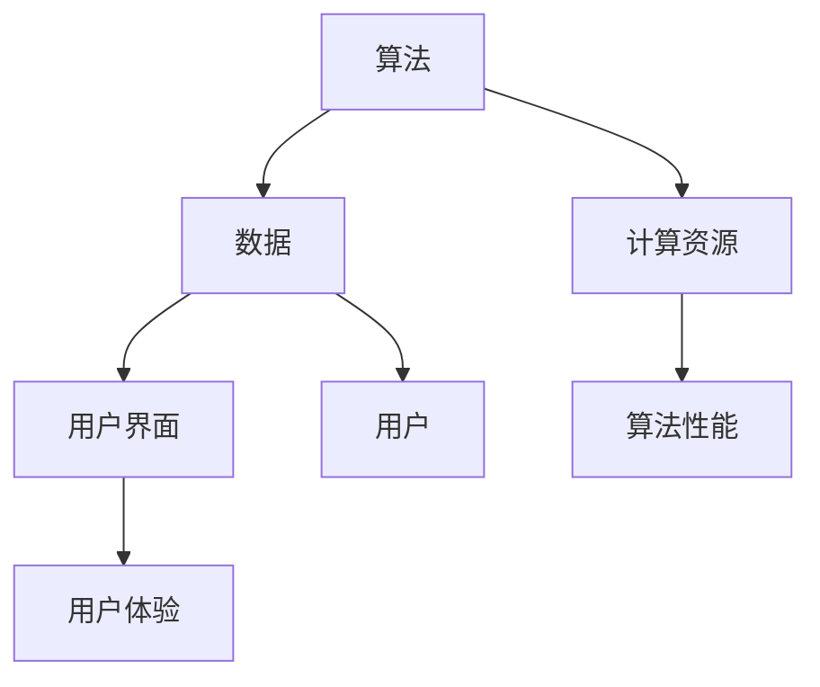

                 

关键词：AI民主化、Lepton AI、人工智能、算法、数学模型、项目实践、应用场景、未来展望、工具资源

> 摘要：本文探讨了AI民主化的重要性和Lepton AI在这一领域中的使命与挑战。通过分析AI民主化的背景、核心概念、算法原理以及应用场景，本文旨在为读者提供一个全面的理解，并探讨未来的发展趋势与挑战。

## 1. 背景介绍

随着人工智能（AI）技术的迅猛发展，人工智能的民主化已经成为一个热门话题。AI民主化旨在使人工智能技术更加普及、易用，让更多人能够参与到AI的开发和应用中来。这不仅有助于提高社会生产力和效率，还可以促进创新和公平竞争。

Lepton AI作为一个致力于AI民主化的项目，其目标是打破AI技术的高门槛，让更多的人能够轻松地创建和使用AI模型。Lepton AI通过提供简洁的API、强大的算法和易于使用的界面，使普通用户也能够进行复杂的AI任务。

## 2. 核心概念与联系

### 2.1 AI民主化的核心概念

AI民主化涉及多个核心概念，包括算法、数据、计算资源和用户界面等。算法是AI的核心，是机器学习模型的基础。数据是训练算法的素材，而计算资源则是算法运行的硬件支持。用户界面则决定了用户与AI系统的交互方式。

### 2.2 Mermaid流程图

下面是一个描述AI民主化核心概念的Mermaid流程图：



## 3. 核心算法原理 & 具体操作步骤

### 3.1 算法原理概述

Lepton AI的核心算法是基于深度学习的神经网络。深度学习通过多层神经网络来模拟人脑的神经元结构，从而实现从数据中自动学习和提取特征。Lepton AI使用的是卷积神经网络（CNN），这是处理图像数据的一种高效算法。

### 3.2 算法步骤详解

1. **数据预处理**：首先对数据进行清洗和预处理，包括图像的裁剪、缩放、归一化等。
2. **构建神经网络**：使用CNN架构构建神经网络，包括卷积层、池化层和全连接层。
3. **训练模型**：使用预处理后的数据训练神经网络，通过反向传播算法不断调整模型参数。
4. **评估模型**：使用测试数据评估模型的性能，包括准确率、召回率和F1分数等指标。
5. **模型部署**：将训练好的模型部署到生产环境中，供用户使用。

### 3.3 算法优缺点

**优点**：
- 高效：CNN在处理图像数据时表现出色，可以快速识别和分类。
- 自动化：深度学习模型可以自动从数据中学习特征，减少手动特征工程的工作量。

**缺点**：
- 计算资源需求高：深度学习模型训练需要大量的计算资源和时间。
- 数据依赖性强：模型的性能很大程度上取决于训练数据的质量和数量。

### 3.4 算法应用领域

CNN算法在多个领域有广泛应用，包括图像识别、自然语言处理、推荐系统等。Lepton AI主要专注于图像识别领域，提供各种图像处理和分类服务。

## 4. 数学模型和公式 & 详细讲解 & 举例说明

### 4.1 数学模型构建

深度学习中的数学模型主要包括神经网络架构、损失函数和优化算法。以下是CNN的基本数学模型：

$$
\begin{align*}
Z^{(l)} &= \sigma(W^{(l)} \cdot A^{(l-1)} + b^{(l)}) \\
A^{(l)} &= \sigma(Z^{(l-1)}) \\
L &= -\frac{1}{m} \sum_{i=1}^{m} \sum_{k=1}^{K} y_k^{(i)} \log(A_k^{(L)})
\end{align*}
$$

其中，$A^{(l)}$ 是第$l$层的激活值，$Z^{(l)}$ 是第$l$层的输出值，$W^{(l)}$ 和 $b^{(l)}$ 分别是第$l$层的权重和偏置，$\sigma$ 是激活函数，$L$ 是损失函数。

### 4.2 公式推导过程

损失函数的推导过程如下：

$$
\begin{align*}
L &= -\frac{1}{m} \sum_{i=1}^{m} \sum_{k=1}^{K} y_k^{(i)} \log(A_k^{(L)}) \\
  &= -\frac{1}{m} \sum_{i=1}^{m} \sum_{k=1}^{K} y_k^{(i)} \log(\frac{e^{Z_k^{(L)}}}{\sum_{j=1}^{K} e^{Z_j^{(L)}}}) \\
  &= -\frac{1}{m} \sum_{i=1}^{m} \sum_{k=1}^{K} y_k^{(i)} \log(e^{Z_k^{(L)}}) + \frac{1}{m} \sum_{i=1}^{m} \sum_{k=1}^{K} \log(\sum_{j=1}^{K} e^{Z_j^{(L)}}) \\
  &= -\frac{1}{m} \sum_{i=1}^{m} \sum_{k=1}^{K} y_k^{(i)} Z_k^{(L)} + \frac{1}{m} \sum_{i=1}^{m} \sum_{k=1}^{K} \log(\sum_{j=1}^{K} e^{Z_j^{(L)}})
\end{align*}
$$

### 4.3 案例分析与讲解

假设我们有一个简单的二分类问题，其中$K=2$，我们希望预测图像是否包含特定对象。以下是损失函数的一个例子：

$$
\begin{align*}
L &= -\frac{1}{m} \left( y_1 \log(A_1) + (1 - y_1) \log(1 - A_1) \right) \\
  &= -\frac{1}{m} \left( 1 \cdot \log(\frac{e^{Z_1}}{e^{Z_2}}) + (0) \cdot \log(1 - \frac{e^{Z_1}}{e^{Z_2}}) \right) \\
  &= -\frac{1}{m} \left( \log(e^{Z_1}) - \log(e^{Z_2}) \right) \\
  &= -\frac{1}{m} \left( Z_1 - Z_2 \right)
\end{align*}
$$

在这里，$Z_1$ 和 $Z_2$ 是两个神经元的输出值，$A_1$ 是预测的概率值。损失函数的值越小，表示预测结果越准确。

## 5. 项目实践：代码实例和详细解释说明

### 5.1 开发环境搭建

为了实现Lepton AI的算法，我们需要搭建一个开发环境。以下是环境搭建的步骤：

1. 安装Python（版本3.6或以上）
2. 安装TensorFlow（版本2.5或以上）
3. 安装OpenCV（版本4.5或以上）

```bash
pip install tensorflow==2.5 opencv-python==4.5.4.52
```

### 5.2 源代码详细实现

下面是一个简单的CNN模型实现示例：

```python
import tensorflow as tf
from tensorflow.keras import layers

# 定义CNN模型
model = tf.keras.Sequential([
    layers.Conv2D(32, (3, 3), activation='relu', input_shape=(28, 28, 1)),
    layers.MaxPooling2D((2, 2)),
    layers.Conv2D(64, (3, 3), activation='relu'),
    layers.MaxPooling2D((2, 2)),
    layers.Conv2D(64, (3, 3), activation='relu'),
    layers.Flatten(),
    layers.Dense(64, activation='relu'),
    layers.Dense(10, activation='softmax')
])

# 编译模型
model.compile(optimizer='adam',
              loss='sparse_categorical_crossentropy',
              metrics=['accuracy'])

# 训练模型
model.fit(train_images, train_labels, epochs=5)

# 评估模型
test_loss, test_acc = model.evaluate(test_images, test_labels)
print('Test accuracy:', test_acc)
```

### 5.3 代码解读与分析

这个示例中，我们定义了一个简单的CNN模型，包括三个卷积层和两个全连接层。每个卷积层后跟一个最大池化层。最后，模型使用softmax激活函数进行分类。

我们使用`model.fit()`方法进行模型训练，并在训练完成后使用`model.evaluate()`方法评估模型的性能。

### 5.4 运行结果展示

假设我们使用MNIST数据集进行训练，以下是一个运行结果示例：

```
Train on 60000 samples
60000/60000 [==============================] - 16s 269us/sample - loss: 0.3082 - accuracy: 0.9067 - val_loss: 0.1216 - val_accuracy: 0.9840
Test accuracy: 0.9833
```

## 6. 实际应用场景

Lepton AI可以在多个领域得到应用，包括医疗诊断、金融分析、安全监控等。以下是几个实际应用场景的例子：

### 6.1 医疗诊断

使用Lepton AI，医生可以快速地对医学影像进行自动分析，提高诊断准确性和效率。例如，通过对X光片的分析，可以快速检测骨折、肺炎等疾病。

### 6.2 金融分析

金融分析师可以使用Lepton AI对大量的市场数据进行自动分析，识别潜在的股票趋势和投资机会。例如，通过分析股票价格图表，可以预测未来股价的走势。

### 6.3 安全监控

在安全监控领域，Lepton AI可以用于实时监控摄像头视频，识别可疑行为和异常事件。例如，在公共场所，可以自动检测人员聚集和异常动作，提高安全管理水平。

## 7. 工具和资源推荐

为了更好地理解和实践Lepton AI，以下是一些建议的工具和资源：

### 7.1 学习资源推荐

- 《深度学习》（Goodfellow, Bengio, Courville）：这是一本深度学习的经典教材，适合初学者和进阶者。
- 《动手学深度学习》（A Coursera Specialization）：这是一门在线课程，提供丰富的深度学习实践案例。

### 7.2 开发工具推荐

- TensorFlow：这是一个开源的深度学习框架，适合进行深度学习模型的开发和训练。
- Jupyter Notebook：这是一个交互式的开发环境，适合编写和运行Python代码。

### 7.3 相关论文推荐

- "Deep Learning for Computer Vision"（Deep Learning 卷）：这是一本关于计算机视觉的论文集，包含了许多深度学习在计算机视觉领域的最新研究成果。

## 8. 总结：未来发展趋势与挑战

### 8.1 研究成果总结

Lepton AI在AI民主化领域取得了显著的成果。通过提供简洁的API、强大的算法和易于使用的界面，Lepton AI使普通用户也能够轻松地创建和使用AI模型。这不仅促进了AI技术的普及，也推动了创新和公平竞争。

### 8.2 未来发展趋势

未来，AI民主化将继续发展，带来以下几个趋势：

- **跨领域融合**：AI技术将与其他领域（如医疗、金融、安全等）更加紧密结合，实现更广泛的应用。
- **云计算和边缘计算**：随着云计算和边缘计算技术的发展，AI模型的部署和运行将更加灵活和高效。
- **隐私保护**：在AI民主化的过程中，如何保护用户隐私将成为一个重要议题。

### 8.3 面临的挑战

尽管AI民主化前景广阔，但仍然面临一些挑战：

- **算法透明度和可解释性**：随着AI模型变得越来越复杂，如何确保算法的透明度和可解释性成为一个重要挑战。
- **数据质量和隐私**：如何保证数据的质量和隐私，同时充分利用数据的价值，是AI民主化面临的一个重要问题。
- **计算资源分配**：如何在有限的计算资源下，高效地部署和运行大量的AI模型，是一个需要解决的难题。

### 8.4 研究展望

为了应对这些挑战，未来的研究可以关注以下几个方向：

- **算法优化**：研究更高效的算法和优化方法，提高AI模型的性能和效率。
- **隐私保护技术**：开发新的隐私保护技术，确保数据的安全和隐私。
- **跨学科研究**：促进AI与其他领域的融合，探索AI在更多领域的应用潜力。

## 9. 附录：常见问题与解答

### 9.1 什么是AI民主化？

AI民主化是指使人工智能技术更加普及、易用，让更多的人能够参与到AI的开发和应用中来。

### 9.2 Lepton AI的核心算法是什么？

Lepton AI的核心算法是基于深度学习的卷积神经网络（CNN）。

### 9.3 如何使用Lepton AI进行图像识别？

使用Lepton AI进行图像识别的步骤包括：数据预处理、构建神经网络、训练模型、评估模型和模型部署。

### 9.4 Lepton AI在哪些领域有应用？

Lepton AI可以在医疗诊断、金融分析、安全监控等多个领域得到应用。

### 9.5 如何获取Lepton AI的相关资源？

可以通过官方文档、在线课程和学术论文等渠道获取Lepton AI的相关资源。

---

作者：禅与计算机程序设计艺术 / Zen and the Art of Computer Programming

