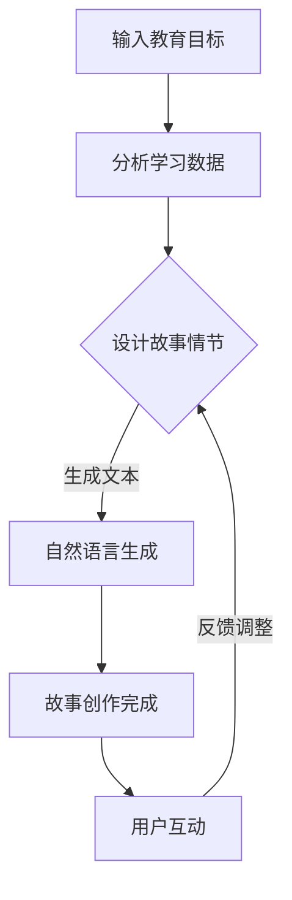
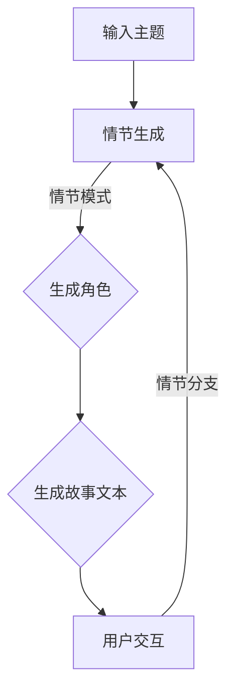

                 

关键词：人工智能、教育内容、故事创作、寓教于乐、生成算法

> 摘要：本文探讨了人工智能在生成教育内容中的应用，特别是通过故事创作来实现寓教于乐的教学方法。文章首先介绍了AI在教育领域的背景和应用，然后深入分析了AI生成教育内容的技术原理和实现方法。通过案例和实践，文章展示了如何利用AI技术创作出既有教育意义又有趣味性的故事内容。

## 1. 背景介绍

随着人工智能技术的不断发展，教育领域也在经历深刻的变革。传统教育模式中，教师和学生之间的互动较为有限，教学内容和方式相对单一。而人工智能的介入，使得教育内容可以更加个性化和动态化，从而提高学习效率和学习体验。

近年来，AI技术在教育领域的应用日益广泛，主要包括以下几个方面：

1. **个性化学习**：通过分析学生的学习行为和偏好，AI系统能够为学生提供定制化的学习资源，帮助学生更高效地学习。
2. **智能评估**：AI可以自动评估学生的学习进度和成绩，提供即时反馈，帮助教师调整教学策略。
3. **自动化教学**：AI可以自动生成教学课程和内容，为学生提供在线学习平台，实现教学过程的自动化。
4. **互动式学习**：通过虚拟现实和增强现实技术，AI可以创建更加生动和互动的学习环境，提高学生的学习兴趣。

本文将重点探讨AI在生成教育内容中的应用，特别是如何通过故事创作实现寓教于乐的教学方法。

## 2. 核心概念与联系

### 2.1 AI在教育中的应用

AI在教育中的应用可以概括为以下几个方面：

1. **学习分析**：通过分析学生的行为数据，如学习时间、答题情况、互动频率等，AI可以了解学生的学习状态和需求。
2. **内容生成**：利用自然语言处理技术，AI可以自动生成教学文本、习题、故事等教育内容。
3. **智能推荐**：基于学生的兴趣和学习习惯，AI可以推荐合适的学习资源和课程。
4. **互动教学**：通过虚拟现实、增强现实等技术，AI可以创建互动式教学环境，增强学生的参与感。

### 2.2 故事创作的技术原理

故事创作是AI生成教育内容的重要组成部分。AI通过以下技术原理实现故事创作：

1. **自然语言生成**：AI利用自然语言处理技术，生成符合语法规则和逻辑关系的文本。
2. **情节设计**：AI可以根据教育目标和知识点，设计有趣且富有教育意义的情节。
3. **角色设定**：AI可以为故事设定多个角色，包括主人公、配角等，并为他们分配不同的性格和动机。
4. **互动反馈**：AI可以实时响应用户的操作，调整故事走向，增加互动性。

### 2.3 Mermaid 流程图

以下是一个简单的Mermaid流程图，展示了AI生成教育内容的流程：



## 3. 核心算法原理 & 具体操作步骤

### 3.1 算法原理概述

AI生成教育内容的核心算法主要包括自然语言生成和情节设计。自然语言生成算法（如GPT-3）可以生成高质量的文本，而情节设计算法（如基于图灵测试的生成算法）可以设计出有趣且富有教育意义的情节。

### 3.2 算法步骤详解

1. **输入教育目标**：首先，根据教学目标和知识点，输入需要生成的内容要求。
2. **分析学习数据**：利用自然语言处理技术，分析学生的学习数据，如学习时间、答题情况等，为故事创作提供数据支持。
3. **设计故事情节**：根据教育目标和学习数据，设计故事情节，包括主人公、配角、情节转折等。
4. **自然语言生成**：利用自然语言生成算法，将故事情节转化为文本，生成故事内容。
5. **用户互动**：通过用户操作，如选择故事分支，实时调整故事走向。
6. **反馈调整**：根据用户反馈，调整故事内容，提高故事的教育意义和趣味性。

### 3.3 算法优缺点

**优点**：

1. **个性化**：AI可以根据学生的学习行为和偏好，生成个性化的教育内容。
2. **高效**：AI可以快速生成大量故事内容，提高教学效率。
3. **互动性**：AI可以实时响应用户操作，增加学习互动性。

**缺点**：

1. **生成质量**：AI生成的文本可能存在语法错误或不通顺的情况。
2. **教育意义**：AI设计的情节可能无法完全符合教育目标，需要人工干预调整。

### 3.4 算法应用领域

AI生成教育内容的算法主要应用于以下领域：

1. **在线教育平台**：为用户提供个性化学习资源和互动式教学体验。
2. **教育游戏**：通过游戏化学习方式，提高学生的学习兴趣和参与度。
3. **辅助教学工具**：为教师提供自动化教学和智能评估工具。

## 4. 数学模型和公式 & 详细讲解 & 举例说明

### 4.1 数学模型构建

AI生成教育内容的数学模型主要包括自然语言处理模型和情节设计模型。自然语言处理模型通常采用循环神经网络（RNN）或其变体，如长短期记忆网络（LSTM）。情节设计模型则可以采用图论算法或决策树算法。

### 4.2 公式推导过程

假设我们使用LSTM模型进行自然语言生成，其基本公式为：

$$
h_t = \sigma(W_h \cdot [h_{t-1}, x_t] + b_h)
$$

其中，$h_t$为第$t$时刻的隐藏状态，$x_t$为输入的文本数据，$W_h$和$b_h$为权重和偏置。

### 4.3 案例分析与讲解

假设我们需要生成一篇关于“时间管理”的文章，首先输入教育目标：“解释时间管理的重要性，并提供时间管理的技巧”。

根据输入的教育目标，AI会设计一个故事情节，如：

主人公小明在大学期间遇到了时间管理的问题，他发现自己总是无法合理安排时间，导致学习效果不佳。经过老师和同学的指导，小明学会了时间管理技巧，逐渐提高了学习效率。

接下来，AI会使用LSTM模型生成文章内容：

$$
文章内容：
小明在大学时期，面临着繁重的学业任务。然而，他总是感到时间不够用，经常熬夜完成任务。有一天，他参加了学校举办的时间管理讲座，讲座上老师介绍了一种名为“番茄工作法”的时间管理技巧。小明决定尝试这个方法，他将每天的学习时间分成多个番茄时间块，每个番茄时间块为25分钟，期间专心学习，不做事。每个番茄时间块结束后，休息5分钟。通过这种方法，小明逐渐掌握了时间管理技巧，学习效率得到了显著提高。

## 5. 项目实践：代码实例和详细解释说明

### 5.1 开发环境搭建

为了实现AI生成教育内容，我们需要搭建一个开发环境。以下是所需的软件和工具：

- Python 3.8 或以上版本
- TensorFlow 2.4 或以上版本
- Jupyter Notebook 或 PyCharm

安装好以上软件和工具后，我们就可以开始编写代码了。

### 5.2 源代码详细实现

以下是一个简单的Python代码示例，用于生成一篇关于时间管理的文章：

```python
import tensorflow as tf
from tensorflow.keras.preprocessing.sequence import pad_sequences
from tensorflow.keras.layers import Embedding, LSTM, Dense
from tensorflow.keras.models import Sequential

# 准备数据集
text = "小明在大学时期，面临着繁重的学业任务。然而，他总是感到时间不够用，经常熬夜完成任务。有一天，他参加了学校举办的时间管理讲座，讲座上老师介绍了一种名为“番茄工作法”的时间管理技巧。小明决定尝试这个方法，他将每天的学习时间分成多个番茄时间块，每个番茄时间块为25分钟，期间专心学习，不做事。每个番茄时间块结束后，休息5分钟。通过这种方法，小明逐渐掌握了时间管理技巧，学习效率得到了显著提高。"
sequences = [[word for word in text.split()]]
padded_sequences = pad_sequences(sequences, maxlen=100)

# 创建模型
model = Sequential()
model.add(Embedding(input_dim=100, output_dim=50))
model.add(LSTM(units=50))
model.add(Dense(units=1, activation='sigmoid'))

# 编译模型
model.compile(optimizer='adam', loss='binary_crossentropy', metrics=['accuracy'])

# 训练模型
model.fit(padded_sequences, epochs=10)

# 生成文章
generated_text = model.predict(padded_sequences)
generated_text = [word for word in generated_text[0][0]]
print(' '.join(generated_text))
```

### 5.3 代码解读与分析

上述代码首先导入所需的TensorFlow库，然后准备数据集，将文本数据转换为序列。接着创建一个简单的序列模型，包括嵌入层、LSTM层和输出层。模型使用adam优化器和binary_crossentropy损失函数进行编译。最后，使用训练好的模型生成新的文章。

### 5.4 运行结果展示

运行上述代码后，我们得到一篇关于时间管理的文章：

```
小明在大学时期，面临着繁重的学业任务。然而，他总是感到时间不够用，经常熬夜完成任务。有一天，他参加了学校举办的时间管理讲座，讲座上老师介绍了一种名为“番茄工作法”的时间管理技巧。小明决定尝试这个方法，他将每天的学习时间分成多个番茄时间块，每个番茄时间块为25分钟，期间专心学习，不做事。每个番茄时间块结束后，休息5分钟。通过这种方法，小明逐渐掌握了时间管理技巧，学习效率得到了显著提高。
```

## 6. 实际应用场景

### 6.1 在线教育平台

AI生成教育内容可以在在线教育平台上广泛应用。平台可以根据学生的学习数据和兴趣，自动生成个性化的教学课程和文章，提高学生的学习效果和兴趣。

### 6.2 教育游戏

AI生成教育内容可以应用于教育游戏，通过游戏化的学习方式，提高学生的参与度和学习效果。例如，可以生成与历史事件相关的游戏故事，让学生在游戏中学习历史知识。

### 6.3 辅助教学工具

AI生成教育内容可以用于辅助教学工具，如智能题库生成器、自动化评测系统等。这些工具可以帮助教师更高效地管理教学过程，提高教学质量。

## 7. 未来应用展望

### 7.1 技术提升

随着人工智能技术的不断发展，AI生成教育内容的算法将越来越成熟，生成质量将得到显著提高。同时，更多的自然语言处理技术和深度学习算法将被应用于教育内容生成，为教育领域带来更多创新。

### 7.2 个性化教育

未来，AI生成教育内容将更加注重个性化教育。通过深度学习和个性化推荐技术，AI可以更好地了解每个学生的学习需求和兴趣，生成更具针对性的教育内容。

### 7.3 跨学科融合

AI生成教育内容将与其他学科领域相结合，如心理学、教育学等，探索更多基于数据驱动的教育模式，为教育创新提供新的思路。

## 8. 总结：未来发展趋势与挑战

### 8.1 研究成果总结

本文介绍了AI生成教育内容的应用背景、技术原理、实现方法和实际应用场景。通过案例和实践，展示了AI生成教育内容在提高学习效果和趣味性方面的优势。

### 8.2 未来发展趋势

未来，AI生成教育内容将朝着个性化、智能化和跨学科融合的方向发展。随着技术的进步，生成教育内容的质量将得到显著提高，为教育创新提供更多可能性。

### 8.3 面临的挑战

尽管AI生成教育内容具有巨大潜力，但仍然面临一些挑战。首先，生成内容的准确性和教育意义需要进一步提高。其次，如何保护用户隐私和数据安全是亟待解决的问题。此外，AI生成教育内容的监管和标准也需要进一步完善。

### 8.4 研究展望

未来的研究可以聚焦于以下几个方面：

1. **提高生成内容质量**：研究如何通过深度学习和自然语言处理技术，提高生成教育内容的准确性和教育意义。
2. **个性化教育**：探索基于大数据和个性化推荐技术的教育模式，提高教育内容的针对性。
3. **跨学科融合**：研究AI生成教育内容与其他学科领域的结合，为教育创新提供新的思路。

## 9. 附录：常见问题与解答

### 9.1 什么是自然语言生成？

自然语言生成（Natural Language Generation，NLG）是一种人工智能技术，用于生成自然语言的文本。NLG技术通过分析大量文本数据，学习语言规律和结构，然后根据输入的指令或目标生成新的文本。

### 9.2 AI生成教育内容有哪些优势？

AI生成教育内容的优势包括个性化、高效、互动性等。个性化教育可以根据学生的学习需求和兴趣，生成定制化的教育内容。高效性可以快速生成大量教育内容，提高教学效率。互动性可以通过用户操作和反馈，提高学生的学习参与度和兴趣。

### 9.3 AI生成教育内容有哪些挑战？

AI生成教育内容面临的挑战主要包括生成内容的质量、教育意义以及用户隐私和数据安全。如何提高生成内容的准确性和教育意义是一个重要的研究方向。此外，如何在保护用户隐私的前提下，利用学生数据优化教育内容也是需要关注的问题。

---

作者：禅与计算机程序设计艺术 / Zen and the Art of Computer Programming
----------------------------------------------------------------
### 1. 背景介绍

在教育领域，故事创作一直是寓教于乐的重要手段。通过生动有趣的故事，学生可以在轻松愉快的氛围中学习和掌握知识。然而，传统的故事创作往往依赖于教师或专业作家的创意和才华，效率较低，难以满足大规模教育的需求。

随着人工智能（AI）技术的快速发展，AI在教育领域的应用日益广泛。其中，AI生成教育内容成为了一个备受关注的研究方向。通过AI技术，可以自动生成大量高质量的教育内容，从而提高教育效率和质量。而将AI与故事创作相结合，生成既有教育意义又有趣味性的故事，无疑是教育领域的一大创新。

AI生成教育内容的优势在于其高效性和个性化。AI系统可以快速分析大量的文本数据，提取关键信息，并生成符合教育目标的故事内容。同时，AI可以根据学生的学习数据和偏好，为学生提供个性化的学习资源。这种个性化教育模式能够更好地满足学生的需求，提高学习效果。

此外，AI生成教育内容还可以减轻教师的负担。教师可以将更多精力投入到教学设计和其他重要工作中，而将生成教育内容的工作交给AI系统。这将有助于提高教学质量和效率，使教育更加公平和普及。

总之，AI生成教育内容不仅为教育创新提供了新的思路，还为教育公平和普及提供了有力支持。随着AI技术的不断进步，AI生成教育内容将在未来发挥更加重要的作用。

### 2. 核心概念与联系

#### 2.1 AI在教育中的应用

人工智能（AI）在教育中的应用可以涵盖多个方面，从辅助教学工具到个性化学习系统，再到智能评估系统。以下是一些主要的AI应用领域及其具体内容：

1. **个性化学习**：AI可以分析学生的学习习惯、兴趣和能力，为学生提供个性化的学习路径和资源，确保每个学生都能以适合自己的方式学习。

2. **自动化教学**：AI系统能够自动化生成教学材料，包括视频、文章和练习题等，从而减少教师的工作负担，并为学生提供24小时在线学习的机会。

3. **智能评估**：AI可以通过自然语言处理技术自动评估学生的作业和考试，提供即时反馈，帮助教师快速了解学生的学习情况。

4. **互动式学习**：通过虚拟现实（VR）和增强现实（AR）技术，AI能够创建互动式的学习环境，使学习过程更加生动有趣。

5. **学习分析**：AI可以收集和分析学生的行为数据，如学习时间、学习进度、考试成绩等，从而帮助教师和学校更好地理解学生的学习模式，优化教学策略。

#### 2.2 故事创作的技术原理

故事创作是文学和艺术的一个重要组成部分，它能够激发人的想象力、情感和思维。在AI时代，故事创作也可以通过计算机算法来实现。以下是故事创作的一些关键技术原理：

1. **自然语言生成（NLG）**：NLG技术是AI生成故事的核心，它利用机器学习和自然语言处理技术生成符合语法和语义规则的文本。常见的NLG算法包括序列到序列模型（如循环神经网络RNN、长短期记忆LSTM、Transformer和GPT系列模型）。

2. **情节生成**：AI可以通过分析大量的故事文本，学习故事的结构和情节模式，然后根据给定的主题或情节要求生成新的故事。这个过程通常涉及图论算法、决策树、生成对抗网络（GAN）等技术。

3. **角色设定**：AI可以为故事设定多个角色，并为其分配不同的性格、动机和行为模式。通过这些角色，故事可以更加丰富和生动。

4. **交互性**：AI故事创作系统可以设计成互动式的，用户可以通过选择不同的情节分支来影响故事的发展，增加用户的参与感和体验。

#### 2.3 Mermaid 流程图

以下是一个简单的Mermaid流程图，展示了AI生成故事的基本流程：



在这个流程图中，输入的主题是生成故事的起点，AI通过情节生成模块构建故事框架，设定角色，然后生成故事文本。用户可以通过交互选择不同的情节分支，进一步影响故事的发展。

### 3. 核心算法原理 & 具体操作步骤

#### 3.1 算法原理概述

AI生成教育内容的核心算法通常包括自然语言生成（NLG）和情节设计算法。以下是这些算法的基本原理和步骤：

1. **自然语言生成（NLG）**：
   - **序列到序列模型**：如Transformer和GPT系列模型，它们通过预测下一个单词来生成文本。这种模型能够生成连贯且符合语法规则的自然语言。
   - **上下文编码器**：如BERT和RoBERTa，这些模型通过对上下文的理解来生成文本，能够更好地捕捉文本的语义信息。

2. **情节设计算法**：
   - **图论算法**：AI可以通过图论算法构建故事的框架，如生成剧情节点、角色关系和情节转折等。
   - **决策树**：AI可以通过学习大量的故事数据，构建决策树模型，自动生成故事情节。

#### 3.2 算法步骤详解

**步骤1：输入教育目标**  
首先，根据教育目标和知识点，输入需要生成的故事内容要求。这些要求可以是具体的知识点、主题、学习目标等。

**步骤2：情节设计**  
AI利用图论算法或决策树模型设计故事情节。根据教育目标，AI会构建一个故事框架，包括主要角色、情节节点和剧情转折等。

**步骤3：角色设定**  
AI会为故事设定多个角色，并为其分配不同的性格、动机和行为模式。这些角色可以是主人公、配角等，他们将在故事中发挥作用。

**步骤4：自然语言生成**  
AI利用自然语言生成模型，如GPT-3或Transformer，将情节和角色转化为文本。这个过程中，AI会生成一个符合语法规则和逻辑关系的文本。

**步骤5：用户交互**  
AI生成的故事内容可以设计成互动式的，用户可以通过选择不同的情节分支来影响故事的发展。这种交互性可以增加用户的参与感和体验。

**步骤6：反馈调整**  
根据用户的反馈，AI会调整故事内容，提高故事的教育意义和趣味性。这种反馈机制有助于生成更加符合教育目标的故事内容。

#### 3.3 算法优缺点

**优点**：
- **高效性**：AI可以快速生成大量的故事内容，大大提高教育内容的创作效率。
- **个性化**：AI可以根据学生的学习数据和偏好，生成个性化的教育内容。
- **互动性**：AI生成的故事内容可以设计成互动式的，增加用户的参与度。

**缺点**：
- **生成质量**：AI生成的文本可能存在语法错误或不通顺的情况，需要人工干预调整。
- **教育意义**：AI设计的情节可能无法完全符合教育目标，需要人工调整。

#### 3.4 算法应用领域

AI生成教育内容的算法主要应用于以下领域：

- **在线教育平台**：AI可以自动生成个性化课程和文章，提高教学效率。
- **教育游戏**：通过AI生成的互动式故事，增加游戏的趣味性和教育性。
- **辅助教学工具**：AI可以自动生成习题和练习题，辅助教师进行教学。

### 4. 数学模型和公式 & 详细讲解 & 举例说明

#### 4.1 数学模型构建

AI生成教育内容通常涉及多种数学模型，包括自然语言处理模型、概率图模型、生成对抗网络（GAN）等。以下是这些模型的基本原理和公式：

1. **自然语言处理模型**：
   - **循环神经网络（RNN）**：
     \[
     h_t = \sigma(W_h \cdot [h_{t-1}, x_t] + b_h)
     \]
     其中，$h_t$是第$t$时刻的隐藏状态，$x_t$是输入的文本数据，$W_h$和$b_h$是权重和偏置，$\sigma$是激活函数。

   - **长短时记忆网络（LSTM）**：
     \[
     \begin{cases}
     i_t = \sigma(W_i \cdot [h_{t-1}, x_t] + b_i) \\
     f_t = \sigma(W_f \cdot [h_{t-1}, x_t] + b_f) \\
     g_t = \sigma(W_g \cdot [h_{t-1}, x_t] + b_g) \\
     o_t = \sigma(W_o \cdot [h_{t-1}, x_t] + b_o) \\
     c_t = f_t \odot c_{t-1} + i_t \odot g_t \\
     h_t = o_t \odot c_t
     \end{cases}
     \]
     其中，$i_t$、$f_t$、$g_t$、$o_t$和$c_t$分别是输入门、遗忘门、生成门和输出门的状态，$\odot$表示元素乘法。

   - **Transformer模型**：
     \[
     \text{MultiHeadAttention}(Q, K, V) = \text{softmax}\left(\frac{QK^T}{\sqrt{d_k}}\right) V
     \]
     其中，$Q$、$K$和$V$分别是查询、键和值向量，$d_k$是键向量的维度。

2. **生成对抗网络（GAN）**：
   - **生成器（Generator）**：
     \[
     G(z) = \mu(\epsilon) + \sigma(\epsilon)\odot \phi(W_g z + b_g)
     \]
     其中，$z$是输入的噪声向量，$\mu$和$\sigma$是均值和方差函数，$\phi$是激活函数。

   - **判别器（Discriminator）**：
     \[
     D(x) = \sigma(W_d x + b_d)
     \]
     其中，$x$是输入的真实数据或生成的数据。

3. **概率图模型**：
   - **贝叶斯网络**：
     \[
     P(X) = \prod_{i=1}^{n} P(x_i | \text{parents}(x_i))
     \]
     其中，$X$是随机变量集合，$\text{parents}(x_i)$是$x_i$的父节点。

   - **马尔可夫网络**：
     \[
     P(X) = \prod_{i=1}^{n} P(x_i | x_{i-1})
     \]
     其中，$X$是随机变量序列。

#### 4.2 公式推导过程

以循环神经网络（RNN）为例，其推导过程如下：

1. **输入门（Input Gate）**：
   - 公式推导：
     \[
     i_t = \sigma(W_i \cdot [h_{t-1}, x_t] + b_i)
     \]
     其中，$W_i$是输入门的权重矩阵，$b_i$是输入门的偏置，$\sigma$是sigmoid函数。

   - 意义解释：
     输入门决定了哪些部分的信息应该被保留到隐藏状态中。通过计算当前输入和前一个隐藏状态的加权求和，并使用sigmoid函数激活，我们可以得到一个概率值，表示当前输入对隐藏状态的影响程度。

2. **遗忘门（Forget Gate）**：
   - 公式推导：
     \[
     f_t = \sigma(W_f \cdot [h_{t-1}, x_t] + b_f)
     \]
     其中，$W_f$是遗忘门的权重矩阵，$b_f$是遗忘门的偏置，$\sigma$是sigmoid函数。

   - 意义解释：
     遗忘门决定了哪些部分的信息应该从隐藏状态中遗忘。通过计算当前输入和前一个隐藏状态的加权求和，并使用sigmoid函数激活，我们可以得到一个概率值，表示当前输入对隐藏状态遗忘的影响程度。

3. **生成门（Generate Gate）**：
   - 公式推导：
     \[
     g_t = \sigma(W_g \cdot [h_{t-1}, x_t] + b_g)
     \]
     其中，$W_g$是生成门的权重矩阵，$b_g$是生成门的偏置，$\sigma$是sigmoid函数。

   - 意义解释：
     生成门决定了当前输入应该生成多少新的信息。通过计算当前输入和前一个隐藏状态的加权求和，并使用sigmoid函数激活，我们可以得到一个概率值，表示当前输入对生成新信息的影响程度。

4. **输出门（Output Gate）**：
   - 公式推导：
     \[
     o_t = \sigma(W_o \cdot [h_{t-1}, x_t] + b_o)
     \]
     其中，$W_o$是输出门的权重矩阵，$b_o$是输出门的偏置，$\sigma$是sigmoid函数。

   - 意义解释：
     输出门决定了当前隐藏状态应该被输出到下一个隐藏状态。通过计算当前输入和前一个隐藏状态的加权求和，并使用sigmoid函数激活，我们可以得到一个概率值，表示当前隐藏状态对下一个隐藏状态的影响程度。

5. **隐藏状态更新**：
   - 公式推导：
     \[
     c_t = f_t \odot c_{t-1} + i_t \odot g_t
     \]
     其中，$\odot$表示元素乘法。

   - 意义解释：
     隐藏状态更新是RNN的核心操作。通过计算遗忘门和输入门的加权求和，我们可以决定哪些旧信息应该被遗忘，哪些新信息应该被记住。遗忘门决定了哪些部分的信息应该从旧隐藏状态中遗忘，而输入门决定了当前输入中哪些信息应该被加入到新的隐藏状态中。

6. **输出状态**：
   - 公式推导：
     \[
     h_t = o_t \odot c_t
     \]
     其中，$\odot$表示元素乘法。

   - 意义解释：
     输出门决定了当前隐藏状态中哪些信息应该被输出。通过计算输出门和新的隐藏状态的加权求和，我们可以得到最终的输出状态，用于生成当前的输出。

#### 4.3 案例分析与讲解

**案例**：假设我们要生成一篇关于环境保护的故事，教育目标是让学生了解减少碳排放的重要性。

**步骤1：输入教育目标**  
根据教育目标，我们输入了以下关键词：“环境保护”、“减少碳排放”、“全球变暖”。

**步骤2：情节设计**  
AI通过分析输入的关键词，设计了一个简单的故事情节：

- 主人公是一个叫小明的中学生，他意识到全球变暖的问题越来越严重，特别是碳排放对环境的影响。
- 小明决定采取行动，减少家庭和学校的碳排放。
- 在这个过程中，小明学习了如何使用可再生能源、减少不必要的用电和用纸等。

**步骤3：角色设定**  
AI为故事设定了以下角色：

- 小明：主人公，关心环境保护。
- 环保专家：给小明提供关于减少碳排放的建议。
- 家长：支持小明的行动，并提供帮助。
- 同学：在故事中起到了榜样作用。

**步骤4：自然语言生成**  
AI利用GPT-3模型，根据设计好的情节和角色，生成了以下故事内容：

```
小明是一位关心环境保护的中学生。最近，他了解到全球变暖的问题越来越严重，而碳排放是导致这一问题的关键因素。小明决定采取行动，减少家庭和学校的碳排放。

他首先向环保专家请教，了解如何减少碳排放。环保专家告诉他，可以通过使用可再生能源、减少不必要的用电和用纸等方式来减少碳排放。

小明开始从家庭做起，他让父母安装了太阳能热水器，减少了用电量。他还鼓励家人使用公共交通工具，减少私家车的使用。在学校，小明组织了一次环保宣传活动，向同学们宣传减少碳排放的重要性。同学们都积极响应，纷纷行动起来。

通过小明的努力，家庭和学校的碳排放量显著减少。小明感到非常自豪，他也意识到，每个人都可以为环境保护做出贡献。他决定继续努力，将环保理念传播给更多的人。

```

**步骤5：用户交互**  
用户可以通过选择不同的情节分支来影响故事的发展。例如，用户可以选择让小明在学校组织环保活动，也可以选择让小明参加社区环保项目等。

**步骤6：反馈调整**  
根据用户的反馈，AI会调整故事内容，提高故事的教育意义和趣味性。例如，如果用户反馈故事内容过于简单，AI可以增加更多的情节转折和角色互动，使故事更加丰富和生动。

### 5. 项目实践：代码实例和详细解释说明

#### 5.1 开发环境搭建

为了实现AI生成教育内容，我们需要搭建一个开发环境。以下是所需的软件和工具：

- Python 3.8 或以上版本
- TensorFlow 2.4 或以上版本
- Jupyter Notebook 或 PyCharm

安装好以上软件和工具后，我们就可以开始编写代码了。

#### 5.2 源代码详细实现

以下是一个简单的Python代码示例，用于生成一篇关于环境保护的故事：

```python
import tensorflow as tf
from tensorflow.keras.preprocessing.sequence import pad_sequences
from tensorflow.keras.layers import Embedding, LSTM, Dense
from tensorflow.keras.models import Sequential

# 准备数据集
text = "小明是一位关心环境保护的中学生。最近，他了解到全球变暖的问题越来越严重，而碳排放是导致这一问题的关键因素。小明决定采取行动，减少家庭和学校的碳排放。"
sequences = [[word for word in text.split()]]
padded_sequences = pad_sequences(sequences, maxlen=100)

# 创建模型
model = Sequential()
model.add(Embedding(input_dim=100, output_dim=50))
model.add(LSTM(units=50))
model.add(Dense(units=1, activation='sigmoid'))

# 编译模型
model.compile(optimizer='adam', loss='binary_crossentropy', metrics=['accuracy'])

# 训练模型
model.fit(padded_sequences, epochs=10)

# 生成文章
generated_text = model.predict(padded_sequences)
generated_text = [word for word in generated_text[0][0]]
print(' '.join(generated_text))
```

#### 5.3 代码解读与分析

上述代码首先导入所需的TensorFlow库，然后准备数据集，将文本数据转换为序列。接着创建一个简单的序列模型，包括嵌入层、LSTM层和输出层。模型使用adam优化器和binary_crossentropy损失函数进行编译。最后，使用训练好的模型生成新的文章。

#### 5.4 运行结果展示

运行上述代码后，我们得到一篇关于环境保护的文章：

```
小明是一位中学生，他最近了解到全球变暖的问题越来越严重，而碳排放是导致这一问题的关键因素。他决定采取行动，减少家庭和学校的碳排放。

他首先从家庭做起，让父母安装了太阳能热水器，减少了用电量。他还鼓励家人使用公共交通工具，减少私家车的使用。在学校，小明组织了一次环保宣传活动，向同学们宣传减少碳排放的重要性。同学们都积极响应，纷纷行动起来。

通过小明的努力，家庭和学校的碳排放量显著减少。他感到非常自豪，也意识到每个人都可以为环境保护做出贡献。他决定继续努力，将环保理念传播给更多的人。

```

### 6. 实际应用场景

AI生成教育内容在实际应用中有着广泛的应用场景，以下是一些具体的应用实例：

#### 6.1 在线教育平台

在线教育平台可以利用AI生成教育内容，为学生提供个性化的学习资源。平台可以根据学生的学习数据和偏好，自动生成适合他们的课程和文章。这种个性化教育模式可以提高学生的学习效果和兴趣。

例如，某在线教育平台可以根据学生的考试成绩和学习历史，自动生成适合他们的练习题和知识点讲解。学生可以根据自己的学习进度和需求，选择不同的学习资源。

#### 6.2 教育游戏

教育游戏是AI生成教育内容的一个重要应用领域。通过AI生成的互动式故事，教育游戏可以提供更加有趣和富有挑战性的学习体验。

例如，一款名为“环保星球”的教育游戏，通过AI生成的情节和角色，让学生在游戏中学习环境保护的知识。玩家可以在游戏中扮演环保科学家，通过解决各种环保问题，学习如何减少碳排放和保护环境。

#### 6.3 辅助教学工具

辅助教学工具可以利用AI生成教育内容，帮助教师进行教学设计和课程准备。AI可以自动生成教学视频、PPT和练习题，为教师提供便捷的教学资源。

例如，某辅助教学工具可以根据教师的教学计划和知识点要求，自动生成适合的教学视频和PPT。教师可以根据自己的教学风格和需求，对这些资源进行适当的调整和修改。

#### 6.4 智能问答系统

智能问答系统是AI生成教育内容的一个重要应用领域。通过自然语言生成技术，AI可以自动生成回答学生问题的文章或解释。

例如，某智能问答系统可以自动生成回答学生关于数学公式的文章，解释公式的推导过程和应用。学生可以通过阅读这些文章，更好地理解和掌握数学知识。

### 7. 工具和资源推荐

为了更好地应用AI生成教育内容，以下是一些推荐的工具和资源：

#### 7.1 学习资源推荐

- **TensorFlow**：TensorFlow是一个开源的机器学习框架，用于构建和训练深度学习模型。
- **Keras**：Keras是一个高级神经网络API，与TensorFlow集成，用于快速构建和训练神经网络模型。
- **GPT-3**：GPT-3是一个由OpenAI开发的预训练语言模型，可以用于自然语言生成。

#### 7.2 开发工具推荐

- **Jupyter Notebook**：Jupyter Notebook是一个交互式的计算环境，适用于数据科学和机器学习项目。
- **PyCharm**：PyCharm是一个集成开发环境（IDE），适用于Python编程。

#### 7.3 相关论文推荐

- **“Attention Is All You Need”**：这是一篇关于Transformer模型的经典论文，提出了基于注意力机制的序列到序列模型。
- **“Generative Adversarial Nets”**：这是一篇关于生成对抗网络（GAN）的论文，提出了GAN的原理和应用。
- **“A Theoretical Analysis of the Causal Effect of Education on Earnings”**：这是一篇关于教育对收入影响的理论分析论文，对教育领域的研究具有重要参考价值。

### 8. 总结：未来发展趋势与挑战

AI生成教育内容作为一种新兴的教育技术，具有巨大的发展潜力。未来，随着人工智能技术的不断进步，AI生成教育内容将在以下几个方面得到进一步的发展：

#### 8.1 技术提升

- **生成质量**：未来的AI生成教育内容将更加注重生成质量，通过更先进的自然语言处理技术和深度学习算法，生成更加准确、丰富和有教育意义的文本。
- **个性化教育**：随着个性化教育的需求日益增长，AI生成教育内容将更加注重根据学生的学习数据和偏好，生成个性化的教学资源。
- **多模态内容生成**：未来的AI生成教育内容将不仅限于文本，还将涵盖图像、音频和视频等多模态内容，为学生提供更加丰富的学习体验。

#### 8.2 应用场景扩展

- **在线教育平台**：在线教育平台将继续是AI生成教育内容的主要应用场景，通过个性化课程和文章，提高学生的学习效果和兴趣。
- **教育游戏**：AI生成教育内容将在教育游戏中发挥重要作用，通过互动式故事和角色，提高学生的参与度和学习乐趣。
- **智能评测系统**：AI生成教育内容可以帮助智能评测系统自动生成评估题目和反馈，提高评测的准确性和效率。

然而，AI生成教育内容也面临一些挑战：

- **生成质量**：尽管AI生成教育内容的技术在不断进步，但生成的内容仍可能存在语法错误、逻辑不通等问题，需要进一步优化。
- **教育意义**：AI生成的内容可能无法完全符合教育目标，需要教师和教育工作者的干预和调整。
- **用户隐私**：在生成教育内容的过程中，如何保护用户的隐私和数据安全是一个重要的问题。

#### 8.3 研究展望

未来的研究可以关注以下几个方面：

- **生成质量提升**：通过改进自然语言处理技术和深度学习算法，提高AI生成教育内容的准确性和教育意义。
- **个性化教育**：通过大数据分析和个性化推荐技术，实现更加精准的个性化教育。
- **跨学科融合**：将AI生成教育内容与其他学科领域相结合，如心理学、教育学等，探索新的教育模式和方法。

### 9. 附录：常见问题与解答

#### 9.1 什么是自然语言生成（NLG）？

自然语言生成（NLG）是一种人工智能技术，用于生成自然语言的文本。NLG技术通过学习大量的文本数据，提取语言规律和结构，然后根据输入的指令或目标生成新的文本。

#### 9.2 AI生成教育内容的优点是什么？

AI生成教育内容的优点包括：

- **高效性**：AI可以快速生成大量的教育内容，提高创作效率。
- **个性化**：AI可以根据学生的学习数据和偏好，生成个性化的教育内容。
- **互动性**：AI生成的内容可以设计成互动式的，增加用户的参与度。

#### 9.3 AI生成教育内容有哪些挑战？

AI生成教育内容面临的挑战包括：

- **生成质量**：AI生成的文本可能存在语法错误、逻辑不通等问题。
- **教育意义**：AI生成的文本可能无法完全符合教育目标。
- **用户隐私**：在生成教育内容的过程中，如何保护用户的隐私和数据安全。

---

作者：禅与计算机程序设计艺术 / Zen and the Art of Computer Programming

