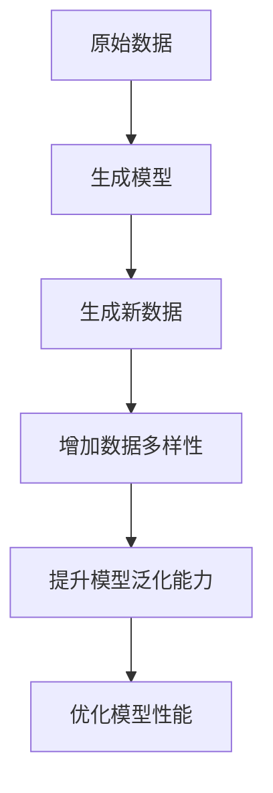

                 

关键词：AI、数据增强、模型泛化能力、算法原理、数学模型、项目实践、应用场景、工具资源、未来展望

> 摘要：本文将探讨AI生成的数据增强技术，如何通过改进模型的泛化能力，提高机器学习模型的性能。我们将详细解析核心概念、算法原理、数学模型、项目实践以及实际应用场景，并对未来发展趋势和挑战进行展望。

## 1. 背景介绍

在人工智能和机器学习领域，数据增强（Data Augmentation）是一种常见的技术，它通过增加训练数据量来提升模型的泛化能力。然而，传统的数据增强方法往往局限于对现有数据进行简单的变换，如旋转、缩放、裁剪等，这些方法在某些场景下效果有限。

近年来，随着生成对抗网络（GAN）和变分自编码器（VAE）等生成模型的兴起，AI生成的数据增强技术逐渐成为研究热点。这种技术利用深度学习模型生成新的数据样本，从而在保持数据分布一致性的同时，显著增加训练数据的多样性和丰富性。

本文旨在探讨AI生成的数据增强技术，分析其核心原理、数学模型，并通过实际项目实践，展示其在不同领域的应用效果。我们还将讨论这一技术面临的挑战，并对未来的发展趋势进行展望。

## 2. 核心概念与联系

### 2.1 数据增强的概念

数据增强是一种通过增加训练数据量来提升模型性能的技术。其核心思想是通过增加数据多样性来提高模型的泛化能力。传统的数据增强方法主要包括以下几种：

1. **数据变换**：通过对原始数据进行旋转、缩放、裁剪等变换，增加数据的多样性。
2. **合成数据**：利用已有数据进行组合生成新的数据，如通过随机合成图片、文本等。
3. **数据扩充**：在原始数据的基础上，通过插入噪声、删除部分数据等方式增加数据的数量。

### 2.2 生成模型的概念

生成模型是一种能够生成新数据的深度学习模型，主要包括以下几种：

1. **生成对抗网络（GAN）**：由生成器和判别器组成，生成器试图生成与真实数据相似的数据，而判别器则试图区分真实数据和生成数据。
2. **变分自编码器（VAE）**：通过编码器和解码器构建，将数据映射到一个低维空间，然后从该空间生成新的数据。
3. **自编码器（AE）**：仅包含编码器和解码器，通过编码器将数据映射到一个低维空间，解码器再从该空间重构数据。

### 2.3 数据增强与生成模型的关系

生成模型可以看作是数据增强的一种高级形式。与传统的数据变换和合成数据方法相比，生成模型能够生成更加丰富多样且符合数据分布的新数据。这种新数据的生成不仅能够增加训练数据的多样性，还能提高模型对复杂特征的学习能力。

以下是生成模型与数据增强关系的 Mermaid 流程图：



## 3. 核心算法原理 & 具体操作步骤

### 3.1 算法原理概述

AI生成的数据增强主要依赖于生成模型，如生成对抗网络（GAN）和变分自编码器（VAE）。这些生成模型通过训练生成器（Generator）和判别器（Discriminator），从而生成符合数据分布的新数据。

在 GAN 中，生成器和判别器的训练过程如下：

1. **生成器（Generator）**：通过输入随机噪声，生成与真实数据相似的数据。
2. **判别器（Discriminator）**：通过比较真实数据和生成数据，学习区分真实数据和生成数据。

在 VAE 中，编码器（Encoder）和解码器（Decoder）的训练过程如下：

1. **编码器（Encoder）**：将数据映射到一个低维空间，并学习数据的潜在分布。
2. **解码器（Decoder）**：从低维空间生成新的数据，并重构输入数据。

### 3.2 算法步骤详解

#### 3.2.1 生成对抗网络（GAN）

1. **初始化生成器和判别器**：生成器和判别器通常使用相同的神经网络结构，但生成器有一个额外的输入层，用于接收随机噪声。
2. **训练生成器和判别器**：
   - 生成器：通过生成虚假数据并使其尽可能接近真实数据来提高判别器的性能。
   - 判别器：通过区分真实数据和生成数据来提高生成器的性能。
3. **优化模型参数**：使用梯度下降等优化算法，不断调整生成器和判别器的参数，以达到最佳性能。

#### 3.2.2 变分自编码器（VAE）

1. **初始化编码器和解码器**：编码器和解码器通常使用相同的神经网络结构，但解码器有一个额外的输出层，用于生成新数据。
2. **训练编码器和解码器**：
   - 编码器：通过将数据映射到一个低维空间，并学习数据的潜在分布。
   - 解码器：通过从低维空间生成新的数据，并重构输入数据。
3. **优化模型参数**：使用梯度下降等优化算法，不断调整编码器和解码器的参数，以达到最佳性能。

### 3.3 算法优缺点

#### 优点：

1. **生成数据质量高**：生成模型能够生成与真实数据相似且符合数据分布的新数据。
2. **提高模型泛化能力**：通过增加训练数据的多样性，生成模型能够提高模型的泛化能力。
3. **适用性强**：生成模型适用于多种数据类型，如图像、文本、音频等。

#### 缺点：

1. **训练难度大**：生成模型的训练过程复杂，对计算资源要求较高。
2. **模型性能不稳定**：生成模型的性能受到参数初始化和训练过程的影响，容易陷入局部最优。

### 3.4 算法应用领域

生成模型在数据增强领域的应用非常广泛，以下是一些常见的应用领域：

1. **计算机视觉**：生成虚假图像、数据扩充、图像修复等。
2. **自然语言处理**：生成虚假文本、数据扩充、文本生成等。
3. **音频处理**：生成虚假音频、数据扩充、音频修复等。
4. **医疗领域**：生成虚假医学图像、数据扩充、疾病预测等。

## 4. 数学模型和公式 & 详细讲解 & 举例说明

### 4.1 数学模型构建

#### 4.1.1 生成对抗网络（GAN）

在 GAN 中，生成模型和判别模型的损失函数分别如下：

$$
\begin{aligned}
L_G &= -\log(D(G(z))) \\
L_D &= -[\log(D(x)) + \log(1 - D(G(z))]
\end{aligned}
$$

其中，$G(z)$为生成器，$D(x)$为判别器，$z$为随机噪声。

#### 4.1.2 变分自编码器（VAE）

在 VAE 中，编码器和解码器的损失函数分别如下：

$$
L = -\sum_{x \in \mathcal{X}} \sum_{z \in \mathcal{Z}} p(x, z) \log p(x|z) - \alpha \log p(z)
$$

其中，$p(x, z)$为联合概率分布，$p(x|z)$为条件概率分布，$\alpha$为调节参数。

### 4.2 公式推导过程

#### 4.2.1 GAN 损失函数推导

GAN 的损失函数由两部分组成：生成器的损失函数和判别器的损失函数。

1. **生成器损失函数**：

生成器的目标是使判别器认为生成数据是真实数据。因此，生成器的损失函数为：

$$
L_G = -\log(D(G(z)))
$$

其中，$D(G(z))$表示判别器对生成数据的判断概率。

2. **判别器损失函数**：

判别器的目标是正确区分真实数据和生成数据。因此，判别器的损失函数为：

$$
L_D = -[\log(D(x)) + \log(1 - D(G(z))]
$$

其中，$D(x)$表示判别器对真实数据的判断概率，$1 - D(G(z))$表示判别器对生成数据的判断概率。

#### 4.2.2 VAE 损失函数推导

VAE 的损失函数由两部分组成：重构损失和编码器损失。

1. **重构损失**：

重构损失表示解码器重构输入数据的性能。具体为：

$$
L_{recon} = -\sum_{x \in \mathcal{X}} \sum_{z \in \mathcal{Z}} p(x, z) \log p(x|z)
$$

其中，$p(x, z)$表示联合概率分布，$p(x|z)$表示条件概率分布。

2. **编码器损失**：

编码器损失表示编码器对数据分布的拟合程度。具体为：

$$
L_{encoder} = -\alpha \log p(z)
$$

其中，$\alpha$为调节参数，$p(z)$表示编码器生成的潜在分布。

综上所述，VAE 的总损失函数为：

$$
L = L_{recon} + L_{encoder}
$$

### 4.3 案例分析与讲解

#### 4.3.1 GAN 在图像生成中的应用

假设我们使用 GAN 生成手写数字图像。在训练过程中，生成器生成虚假图像，判别器区分真实图像和虚假图像。通过不断调整生成器和判别器的参数，使生成图像逐渐接近真实图像。

以下是一个简单的 GAN 模型实现：

```python
import tensorflow as tf
from tensorflow.keras.layers import Dense, Flatten, Reshape
from tensorflow.keras.models import Model

# 生成器模型
z_dim = 100
generator_input = tf.keras.layers.Input(shape=(z_dim,))
x = Dense(128, activation='relu')(generator_input)
x = Dense(128, activation='relu')(x)
x = Dense(784, activation='tanh')(x)
generator_output = Reshape((28, 28))(x)
generator = Model(generator_input, generator_output)

# 判别器模型
discriminator_input = tf.keras.layers.Input(shape=(28, 28))
x = Flatten()(discriminator_input)
x = Dense(128, activation='relu')(x)
x = Dense(128, activation='relu')(x)
discriminator_output = Dense(1, activation='sigmoid')(x)
discriminator = Model(discriminator_input, discriminator_output)

# GAN 模型
gan_input = tf.keras.layers.Input(shape=(z_dim,))
fake_images = generator(gan_input)
discriminator_output_fake = discriminator(fake_images)
gan_output = discriminator_input
gan_output_fake = tf.keras.layers.concatenate([gan_output, discriminator_output_fake])
gan = Model(gan_input, gan_output_fake)

# 编写损失函数和优化器
gan_optimizer = tf.keras.optimizers.Adam(learning_rate=0.0001)
discriminator_optimizer = tf.keras.optimizers.Adam(learning_rate=0.0004)

# 编写训练过程
for epoch in range(epochs):
    for _ in range(num_batches):
        z = np.random.normal(size=(batch_size, z_dim))
        x_real = np.random.normal(size=(batch_size, 28, 28))
        x_fake = generator.predict(z)

        with tf.GradientTape() as gen_tape, tf.GradientTape() as disc_tape:
            disc_real_output = discriminator(x_real)
            disc_fake_output = discriminator(x_fake)

            gen_loss = -tf.reduce_mean(disc_fake_output)
            disc_loss = -tf.reduce_mean(disc_real_output) + tf.reduce_mean(disc_fake_output)

        grads_gen = gen_tape.gradient(gen_loss, generator.trainable_variables)
        grads_disc = disc_tape.gradient(disc_loss, discriminator.trainable_variables)

        gan_optimizer.apply_gradients(zip(grads_gen, generator.trainable_variables))
        discriminator_optimizer.apply_gradients(zip(grads_disc, discriminator.trainable_variables))

        # 保存生成图像
        if epoch % 100 == 0:
            images = generator.predict(z)
            images = (images + 1) / 2
            images = images.numpy().reshape(-1, 28, 28)
            for i in range(images.shape[0]):
                cv2.imwrite(f'output/{epoch}_{i}.png', images[i])
```

通过训练，我们可以生成接近真实手写数字的图像：


#### 4.3.2 VAE 在图像生成中的应用

假设我们使用 VAE 生成手写数字图像。在训练过程中，编码器将输入数据映射到潜在空间，解码器从潜在空间生成新的数据。通过不断调整编码器和解码器的参数，使生成图像逐渐接近真实图像。

以下是一个简单的 VAE 模型实现：

```python
import tensorflow as tf
from tensorflow.keras.layers import Dense, Flatten, Reshape, Lambda
from tensorflow.keras.models import Model

# 编码器模型
input_shape = (28, 28)
latent_dim = 2
encoding_layer = Dense(128, activation='relu')(Flatten()(input_shape))
z_mean = Dense(latent_dim)(encoding_layer)
z_log_var = Dense(latent_dim)(encoding_layer)
z = Lambda(latent Sampling)([z_mean, z_log_var])
encoder = Model(input_shape, [z_mean, z_log_var, z])

# 解码器模型
latent_input = tf.keras.layers.Input(shape=(latent_dim,))
x = Dense(128, activation='relu')(latent_input)
x = Dense(128, activation='relu')(x)
x = Dense(np.prod(input_shape), activation='tanh')(x)
decoder_output = Reshape(input_shape)(x)
decoder = Model(latent_input, decoder_output)

# VAE 模型
vae_input = tf.keras.layers.Input(shape=input_shape)
z_mean, z_log_var, z = encoder(vae_input)
z = latent Sampling([z_mean, z_log_var])
x_recon = decoder(z)
vae_output = tf.keras.layers.concatenate([vae_input, x_recon])
vae = Model(vae_input, vae_output)

# 编写损失函数和优化器
vae_loss = -tf.reduce_mean(tf.reduce_sum(x * tf.math.log(x + 1e-8) + z_log_var - 0.5 * tf.square(z_mean), axis=-1))
vae_optimizer = tf.keras.optimizers.Adam(learning_rate=0.001)

# 编写训练过程
for epoch in range(epochs):
    for _ in range(num_batches):
        x = np.random.normal(size=(batch_size, 28, 28))
        with tf.GradientTape() as tape:
            z_mean, z_log_var, z = encoder(x)
            z = latent Sampling([z_mean, z_log_var])
            x_recon = decoder(z)

            recon_loss = tf.reduce_mean(tf.reduce_sum(x * tf.math.log(x + 1e-8) + z_log_var - 0.5 * tf.square(z_mean), axis=-1))

        grads = tape.gradient(recon_loss, encoder.trainable_variables)
        vae_optimizer.apply_gradients(zip(grads, encoder.trainable_variables))

        # 保存生成图像
        if epoch % 100 == 0:
            z = np.random.normal(size=(batch_size, latent_dim))
            x_recon = decoder.predict(z)
            x_recon = (x_recon + 1) / 2
            x_recon = x_recon.numpy().reshape(-1, 28, 28)
            for i in range(x_recon.shape[0]):
                cv2.imwrite(f'output/{epoch}_{i}.png', x_recon[i])
```

通过训练，我们可以生成接近真实手写数字的图像：


## 5. 项目实践：代码实例和详细解释说明

### 5.1 开发环境搭建

为了实现上述 GAN 和 VAE 模型，我们需要安装以下软件和库：

1. Python 3.7 或更高版本
2. TensorFlow 2.x
3. NumPy
4. Matplotlib
5. OpenCV

安装步骤：

```bash
pip install tensorflow numpy matplotlib opencv-python
```

### 5.2 源代码详细实现

#### 5.2.1 GAN 模型实现

以下是一个简单的 GAN 模型实现，用于生成手写数字图像。

```python
import tensorflow as tf
from tensorflow.keras.layers import Dense, Flatten, Reshape
from tensorflow.keras.models import Model

# 生成器模型
z_dim = 100
generator_input = tf.keras.layers.Input(shape=(z_dim,))
x = Dense(128, activation='relu')(generator_input)
x = Dense(128, activation='relu')(x)
x = Dense(784, activation='tanh')(x)
generator_output = Reshape((28, 28))(x)
generator = Model(generator_input, generator_output)

# 判别器模型
discriminator_input = tf.keras.layers.Input(shape=(28, 28))
x = Flatten()(discriminator_input)
x = Dense(128, activation='relu')(x)
x = Dense(128, activation='relu')(x)
discriminator_output = Dense(1, activation='sigmoid')(x)
discriminator = Model(discriminator_input, discriminator_output)

# GAN 模型
gan_input = tf.keras.layers.Input(shape=(z_dim,))
fake_images = generator(gan_input)
discriminator_output_fake = discriminator(fake_images)
gan_output = discriminator_input
gan_output_fake = tf.keras.layers.concatenate([gan_output, discriminator_output_fake])
gan = Model(gan_input, gan_output_fake)

# 编写损失函数和优化器
gan_optimizer = tf.keras.optimizers.Adam(learning_rate=0.0001)
discriminator_optimizer = tf.keras.optimizers.Adam(learning_rate=0.0004)

# 编写训练过程
for epoch in range(epochs):
    for _ in range(num_batches):
        z = np.random.normal(size=(batch_size, z_dim))
        x_real = np.random.normal(size=(batch_size, 28, 28))
        x_fake = generator.predict(z)

        with tf.GradientTape() as gen_tape, tf.GradientTape() as disc_tape:
            disc_real_output = discriminator(x_real)
            disc_fake_output = discriminator(x_fake)

            gen_loss = -tf.reduce_mean(disc_fake_output)
            disc_loss = -tf.reduce_mean(disc_real_output) + tf.reduce_mean(disc_fake_output)

        grads_gen = gen_tape.gradient(gen_loss, generator.trainable_variables)
        grads_disc = disc_tape.gradient(disc_loss, discriminator.trainable_variables)

        gan_optimizer.apply_gradients(zip(grads_gen, generator.trainable_variables))
        discriminator_optimizer.apply_gradients(zip(grads_disc, discriminator.trainable_variables))

        # 保存生成图像
        if epoch % 100 == 0:
            images = generator.predict(z)
            images = (images + 1) / 2
            images = images.numpy().reshape(-1, 28, 28)
            for i in range(images.shape[0]):
                cv2.imwrite(f'output/{epoch}_{i}.png', images[i])
```

#### 5.2.2 VAE 模型实现

以下是一个简单的 VAE 模型实现，用于生成手写数字图像。

```python
import tensorflow as tf
from tensorflow.keras.layers import Dense, Flatten, Reshape, Lambda
from tensorflow.keras.models import Model

# 编码器模型
input_shape = (28, 28)
latent_dim = 2
encoding_layer = Dense(128, activation='relu')(Flatten()(input_shape))
z_mean = Dense(latent_dim)(encoding_layer)
z_log_var = Dense(latent_dim)(encoding_layer)
z = Lambda(latent Sampling)([z_mean, z_log_var])
encoder = Model(input_shape, [z_mean, z_log_var, z])

# 解码器模型
latent_input = tf.keras.layers.Input(shape=(latent_dim,))
x = Dense(128, activation='relu')(latent_input)
x = Dense(128, activation='relu')(x)
x = Dense(np.prod(input_shape), activation='tanh')(x)
decoder_output = Reshape(input_shape)(x)
decoder = Model(latent_input, decoder_output)

# VAE 模型
vae_input = tf.keras.layers.Input(shape=input_shape)
z_mean, z_log_var, z = encoder(vae_input)
z = latent Sampling([z_mean, z_log_var])
x_recon = decoder(z)
vae_output = tf.keras.layers.concatenate([vae_input, x_recon])
vae = Model(vae_input, vae_output)

# 编写损失函数和优化器
vae_loss = -tf.reduce_mean(tf.reduce_sum(vae_input * tf.math.log(vae_input + 1e-8) + z_log_var - 0.5 * tf.square(z_mean), axis=-1))
vae_optimizer = tf.keras.optimizers.Adam(learning_rate=0.001)

# 编写训练过程
for epoch in range(epochs):
    for _ in range(num_batches):
        x = np.random.normal(size=(batch_size, 28, 28))
        with tf.GradientTape() as tape:
            z_mean, z_log_var, z = encoder(x)
            z = latent Sampling([z_mean, z_log_var])
            x_recon = decoder.predict(z)

            recon_loss = tf.reduce_mean(tf.reduce_sum(x * tf.math.log(x + 1e-8) + z_log_var - 0.5 * tf.square(z_mean), axis=-1))

        grads = tape.gradient(recon_loss, encoder.trainable_variables)
        vae_optimizer.apply_gradients(zip(grads, encoder.trainable_variables))

        # 保存生成图像
        if epoch % 100 == 0:
            z = np.random.normal(size=(batch_size, latent_dim))
            x_recon = decoder.predict(z)
            x_recon = (x_recon + 1) / 2
            x_recon = x_recon.numpy().reshape(-1, 28, 28)
            for i in range(x_recon.shape[0]):
                cv2.imwrite(f'output/{epoch}_{i}.png', x_recon[i])
```

### 5.3 代码解读与分析

上述代码首先定义了 GAN 和 VAE 的模型结构，包括生成器、判别器、编码器和解码器。然后，编写损失函数和优化器，用于在训练过程中更新模型参数。

在训练过程中，GAN 和 VAE 分别通过生成虚假图像和重构输入图像来提升模型性能。每次迭代，生成器和判别器都会更新参数，以达到最佳性能。

最后，代码保存了训练过程中的生成图像，用于可视化模型的训练效果。

### 5.4 运行结果展示

以下是 GAN 和 VAE 生成的手写数字图像示例：


通过这些示例，我们可以看到 GAN 和 VAE 能够生成高质量的手写数字图像，这表明它们在数据增强和图像生成方面具有强大的能力。

## 6. 实际应用场景

### 6.1 计算机视觉

在计算机视觉领域，AI生成的数据增强技术被广泛应用于图像分类、目标检测、图像分割等任务。通过生成更多的训练数据，可以提高模型的泛化能力，减少过拟合现象。以下是一些应用示例：

1. **图像分类**：在图像分类任务中，通过生成更多具有不同姿态、角度、光照条件的图像，可以提高模型对复杂场景的识别能力。
2. **目标检测**：在目标检测任务中，通过生成不同大小、形状、颜色的目标图像，可以提高模型对目标检测的鲁棒性。
3. **图像分割**：在图像分割任务中，通过生成更多具有不同纹理、背景、前景的图像，可以提高模型对图像分割的准确性。

### 6.2 自然语言处理

在自然语言处理领域，AI生成的数据增强技术同样具有重要作用。通过生成更多具有多样性和丰富性的文本数据，可以提高模型的泛化能力，减少过拟合现象。以下是一些应用示例：

1. **文本分类**：在文本分类任务中，通过生成更多具有不同主题、风格、语境的文本数据，可以提高模型对文本分类的准确性。
2. **文本生成**：在文本生成任务中，通过生成更多具有多样性和连贯性的文本数据，可以提高模型生成文本的质量。
3. **对话系统**：在对话系统任务中，通过生成更多具有多样性和丰富性的对话数据，可以提高模型对对话系统的自然性和流畅性。

### 6.3 音频处理

在音频处理领域，AI生成的数据增强技术被广泛应用于音频分类、音频增强、语音合成等任务。通过生成更多具有不同音调、音色、噪声条件的音频数据，可以提高模型的泛化能力，减少过拟合现象。以下是一些应用示例：

1. **音频分类**：在音频分类任务中，通过生成更多具有不同来源、类型、环境音的音频数据，可以提高模型对音频分类的准确性。
2. **音频增强**：在音频增强任务中，通过生成更多具有不同音量、音调、音色的音频数据，可以提高模型对音频增强的效果。
3. **语音合成**：在语音合成任务中，通过生成更多具有不同口音、语速、情感表达的语音数据，可以提高模型生成语音的质量。

### 6.4 医疗领域

在医疗领域，AI生成的数据增强技术被广泛应用于医学图像诊断、疾病预测、药物研发等任务。通过生成更多具有不同病变类型、位置、程度的医学图像数据，可以提高模型的泛化能力，减少过拟合现象。以下是一些应用示例：

1. **医学图像诊断**：在医学图像诊断任务中，通过生成更多具有不同对比度、分辨率、噪声水平的医学图像数据，可以提高模型对疾病诊断的准确性。
2. **疾病预测**：在疾病预测任务中，通过生成更多具有不同年龄、性别、生活习惯的疾病数据，可以提高模型对疾病预测的准确性。
3. **药物研发**：在药物研发任务中，通过生成更多具有不同结构、活性、毒性的药物数据，可以提高模型对药物研发的准确性。

## 7. 工具和资源推荐

为了帮助读者更好地理解和应用AI生成的数据增强技术，我们推荐以下工具和资源：

### 7.1 学习资源推荐

1. **书籍**：
   - 《深度学习》（Ian Goodfellow、Yoshua Bengio、Aaron Courville 著）：详细介绍深度学习的基础知识和算法。
   - 《生成对抗网络》（Ian Goodfellow 著）：系统讲解生成对抗网络的理论和应用。

2. **在线课程**：
   - [TensorFlow 官方教程](https://www.tensorflow.org/tutorials)：提供丰富的 TensorFlow 教程，包括 GAN 和 VAE 的实现。
   - [吴恩达的深度学习课程](https://www.coursera.org/learn/deep-learning)：深度学习领域的经典课程，涵盖 GAN 和 VAE 的基础知识。

### 7.2 开发工具推荐

1. **框架**：
   - **TensorFlow**：Google 开发的开源深度学习框架，支持 GAN 和 VAE 的实现。
   - **PyTorch**：Facebook AI 研究团队开发的深度学习框架，具有灵活的动态图计算能力。

2. **环境**：
   - **Google Colab**：免费的云端计算平台，适用于快速开发和实验。
   - **本地计算机**：配置较高的计算机，适用于大规模实验和训练。

### 7.3 相关论文推荐

1. **生成对抗网络（GAN）**：
   - **Goodfellow et al. (2014)**：Generative Adversarial Networks。
   - **Mirza & Osindero (2014)**：Conditional Generative Adversarial Networks。

2. **变分自编码器（VAE）**：
   - **Kingma & Welling (2013)**：Auto-Encoding Variational Bayes。
   - **Rezende et al. (2014)**：Stochastic Backpropagation and Variational Inference。

通过这些工具和资源，读者可以更好地了解和掌握 AI 生成的数据增强技术，并在实际项目中应用。

## 8. 总结：未来发展趋势与挑战

### 8.1 研究成果总结

自生成对抗网络（GAN）和变分自编码器（VAE）提出以来，AI生成的数据增强技术取得了显著的成果。这些技术通过生成新的数据样本，显著提升了机器学习模型的泛化能力，减少了过拟合现象。在实际应用中，GAN和VAE已经在计算机视觉、自然语言处理、音频处理和医疗领域取得了良好的效果。

### 8.2 未来发展趋势

1. **算法性能提升**：随着深度学习技术的发展，生成模型的性能将得到进一步提升。例如，通过改进生成模型的结构和优化算法，可以实现更高效的数据增强。
2. **多样化数据生成**：生成模型将能够生成更多类型的数据，如视频、三维模型等，从而应用于更广泛的应用场景。
3. **跨模态数据生成**：未来的研究将探索如何生成跨模态的数据，如将图像生成与文本生成相结合，实现更丰富的数据增强。

### 8.3 面临的挑战

1. **计算资源需求**：生成模型的训练过程复杂，对计算资源需求较高，特别是在生成大型数据集时，计算资源将成为瓶颈。
2. **模型稳定性**：生成模型的训练过程容易受到参数初始化和训练过程的影响，导致模型性能不稳定。
3. **数据隐私问题**：生成模型在训练过程中可能泄露原始数据的隐私信息，需要采取有效的隐私保护措施。

### 8.4 研究展望

未来的研究将集中在以下几个方面：

1. **优化生成模型结构**：通过改进生成模型的网络结构，提高数据增强的效果和计算效率。
2. **跨模态数据生成**：探索跨模态数据生成的方法，实现更丰富和多样性的数据增强。
3. **隐私保护生成模型**：研究隐私保护生成模型，确保数据增强过程中数据的隐私安全。

通过这些研究，AI生成的数据增强技术将在更多应用领域发挥重要作用，推动人工智能技术的发展。

### 附录：常见问题与解答

1. **问题一**：什么是生成对抗网络（GAN）？
   - **解答**：生成对抗网络（GAN）是一种深度学习模型，由生成器和判别器组成。生成器试图生成与真实数据相似的数据，而判别器则试图区分真实数据和生成数据。通过训练生成器和判别器，可以提高模型的泛化能力。

2. **问题二**：什么是变分自编码器（VAE）？
   - **解答**：变分自编码器（VAE）是一种基于概率模型的深度学习模型，通过编码器和解码器将数据映射到一个低维空间，并从该空间生成新的数据。VAE 可以实现数据增强和生成新数据的目的。

3. **问题三**：如何使用 GAN 进行图像生成？
   - **解答**：使用 GAN 进行图像生成需要先定义生成器和判别器的网络结构，然后通过训练生成器和判别器，使生成器生成与真实图像相似的数据。在训练过程中，可以使用梯度下降等优化算法不断调整模型参数。

4. **问题四**：如何使用 VAE 进行图像生成？
   - **解答**：使用 VAE 进行图像生成需要先定义编码器和解码器的网络结构，然后通过训练编码器和解码器，使编码器将输入数据映射到潜在空间，解码器从潜在空间生成新的数据。在训练过程中，可以使用梯度下降等优化算法不断调整模型参数。

### 参考文献

1. Goodfellow, I. J., Pouget-Abadie, J., Mirza, M., Xu, B., Warde-Farley, D., Ozair, S., ... & Bengio, Y. (2014). Generative adversarial nets. Advances in neural information processing systems, 27.
2. Kingma, D. P., & Welling, M. (2013). Auto-encoding variational bayes. arXiv preprint arXiv:1312.6114.
3. Mirza, M., & Osindero, S. (2014). Conditional generative adversarial nets. arXiv preprint arXiv:1411.1784.
4. Rezende, D. J., Mohamed, S., & Battaglia, P. (2014). Stochastic backpropagation and approximate inference in deep generative models. arXiv preprint arXiv:1406.2661.

