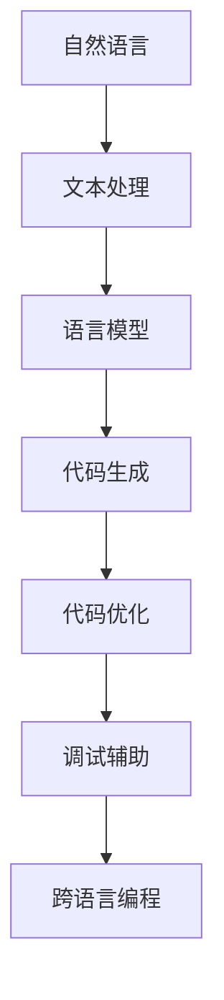
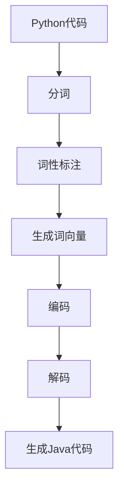
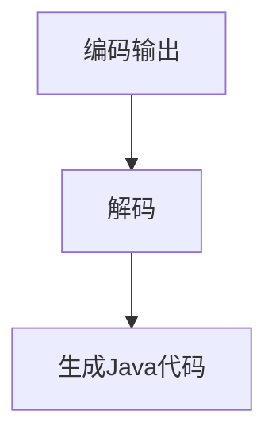
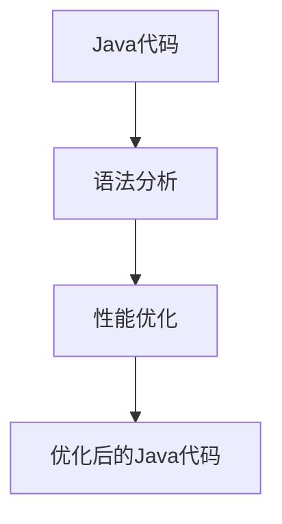
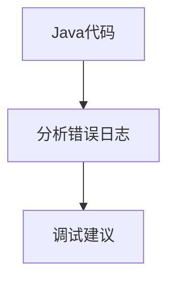

                 

关键词：人工智能，编程新思路，大型语言模型（LLM），编码效率，软件开发实践

> 摘要：随着人工智能尤其是大型语言模型（LLM）的发展，编程的方式和方法也在发生深刻的变革。本文将探讨在LLM时代下的编程新思路，包括核心概念、算法原理、数学模型、项目实践和未来展望，旨在为程序员提供一种更加高效、智能的编程方式。

## 1. 背景介绍

在过去几十年中，编程语言和工具的发展极大地推动了软件工程的进步。从汇编语言到高级编程语言，从单一任务的脚本到复杂的软件系统，编程的方式在不断演变。然而，随着人工智能技术的快速发展，尤其是大型语言模型（LLM）的出现，编程领域正迎来一场新的变革。

大型语言模型，如GPT-3、ChatGPT等，通过深度学习算法，从海量文本数据中学习语言模式，具备了理解和生成自然语言的能力。这为编程带来了新的可能性，使得编程可以更加智能化、自动化。

### 1.1 传统编程模式的挑战

在传统的编程模式中，程序员需要：

- **详细设计：** 在编码前，程序员需要进行详细的需求分析和系统设计。
- **编写代码：** 手动编写大量的代码，以实现预期的功能。
- **调试和优化：** 编码后，进行调试和性能优化。

这种方式存在以下挑战：

- **时间和劳动成本：** 编码过程繁琐，劳动强度大，容易出错。
- **依赖个人经验：** 编程质量和效率很大程度上依赖于程序员的个人经验和技能。
- **代码可维护性：** 随着项目的复杂度增加，代码的可维护性变得越来越困难。

### 1.2 LLM时代的编程变革

随着LLM技术的发展，编程将变得更加智能化、自动化。以下是LLM时代编程的一些特点：

- **自动代码生成：** LLM可以理解自然语言描述，自动生成符合预期的代码。
- **代码补全和优化：** LLM可以实时分析代码，提供代码补全建议和优化建议。
- **智能化调试：** LLM可以帮助程序员快速定位和修复代码中的错误。
- **跨语言编程：** LLM可以处理多种编程语言，实现跨语言的代码转换和集成。

## 2. 核心概念与联系

在探讨LLM时代的编程之前，我们需要了解一些核心概念和它们之间的联系。以下是一个简化的Mermaid流程图，展示了这些概念：



### 2.1 自然语言与文本处理

自然语言是人类交流的基本形式，而文本处理则是将自然语言转换为计算机可处理的格式。文本处理包括分词、词性标注、句法分析等步骤，为语言模型提供了基础数据。

### 2.2 语言模型

语言模型是AI的核心组件，它通过学习大量文本数据，掌握语言的统计规律和语义信息。LLM如GPT-3，具有强大的语言理解能力和生成能力，是编程的关键。

### 2.3 代码生成与优化

代码生成是LLM的重要应用之一。它可以根据自然语言描述自动生成代码，减少了程序员的手动编码工作量。代码优化则是在生成的代码基础上，进行性能分析和改进，提高代码的运行效率。

### 2.4 调试辅助

调试是软件开发过程中的重要环节。LLM可以通过分析代码和错误日志，提供调试建议，帮助程序员快速定位和修复错误。

### 2.5 跨语言编程

跨语言编程是指在不同编程语言之间进行代码的转换和集成。LLM可以通过学习多种编程语言的模式和语法，实现跨语言的代码转换和功能集成。

## 3. 核心算法原理 & 具体操作步骤

### 3.1 算法原理概述

LLM的核心算法是基于深度学习的Transformer模型。Transformer模型通过自注意力机制（Self-Attention）和多头注意力（Multi-Head Attention）实现了对输入文本的编码和解码。以下是Transformer模型的基本架构：

- **输入层（Input Layer）：** 输入文本被转换为词向量，并附加位置编码。
- **自注意力层（Self-Attention Layer）：** 通过计算输入词向量之间的相似度，实现对输入文本的编码。
- **多头注意力层（Multi-Head Attention Layer）：** 将自注意力层的输出进行拼接和线性变换，形成多头注意力输出。
- **前馈神经网络层（Feedforward Neural Network Layer）：** 对多头注意力输出进行前馈神经网络处理。
- **输出层（Output Layer）：** 将处理后的输出映射到目标输出，如代码或自然语言描述。

### 3.2 算法步骤详解

1. **数据预处理：** 对输入文本进行分词、词性标注等预处理操作，生成词向量。

2. **编码阶段：** 将词向量输入到自注意力层，计算词向量之间的相似度，生成编码输出。

3. **解码阶段：** 将编码输出输入到多头注意力层，结合上下文信息，生成解码输出。

4. **生成代码：** 将解码输出通过前馈神经网络处理，映射到具体的代码。

5. **优化代码：** 对生成的代码进行分析，进行语法和性能优化。

6. **调试辅助：** 分析代码和错误日志，提供调试建议。

### 3.3 算法优缺点

#### 优点：

- **高效性：** LLM可以快速生成和优化代码，大大提高了编程效率。
- **智能化：** LLM具备强大的语言理解能力和生成能力，可以自动处理复杂的编程任务。
- **跨语言支持：** LLM可以处理多种编程语言，实现跨语言的代码转换和集成。

#### 缺点：

- **准确性问题：** LLM生成的代码可能存在语法错误或逻辑错误，需要人工进行验证和修正。
- **依赖数据：** LLM的性能很大程度上依赖于训练数据的质量和数量，数据不足可能导致模型效果不佳。
- **复杂度问题：** LLM的处理流程复杂，对计算资源的需求较高。

### 3.4 算法应用领域

LLM在编程领域的应用非常广泛，以下是一些典型的应用场景：

- **自动化代码生成：** 根据自然语言描述，自动生成符合预期的代码。
- **代码补全与优化：** 提供代码补全建议和优化建议，提高代码质量。
- **智能化调试：** 帮助程序员快速定位和修复代码中的错误。
- **跨语言编程：** 实现不同编程语言之间的代码转换和集成。

## 4. 数学模型和公式 & 详细讲解 & 举例说明

### 4.1 数学模型构建

LLM的数学模型主要基于深度学习中的Transformer模型。以下是一个简化的Transformer模型的数学公式：

$$
E = [e_1, e_2, ..., e_n]
$$

$$
H = [h_1, h_2, ..., h_n]
$$

其中，$E$是输入编码序列，$H$是输出解码序列。

### 4.2 公式推导过程

#### 自注意力（Self-Attention）

自注意力是通过计算输入序列中每个词向量之间的相似度，实现对输入文本的编码。其计算公式如下：

$$
\text{Score}(e_i, e_j) = \text{sim}(e_i, e_j) = \frac{\exp(\text{dot}(W_Q e_i, W_K e_j))}{\sum_{k=1}^{n} \exp(\text{dot}(W_Q e_i, W_K e_k))}
$$

其中，$W_Q$、$W_K$和$W_V$分别是查询（Query）、键（Key）和值（Value）的权重矩阵，$\text{dot}$表示点积操作。

#### 多头注意力（Multi-Head Attention）

多头注意力是对自注意力输出进行拼接和线性变换，形成多头注意力输出。其计算公式如下：

$$
\text{Multi-Head Attention}(Q, K, V) = \text{Concat}(\text{head}_1, ..., \text{head}_h)W_O
$$

$$
\text{head}_h = \text{Attention}(Q, K, V)
$$

其中，$h$表示头数，$W_O$是输出权重矩阵。

#### 前馈神经网络（Feedforward Neural Network）

前馈神经网络是对多头注意力输出进行进一步处理，其计算公式如下：

$$
\text{FFN}(x) = \max(0, xW_1 + b_1)(W_2 + b_2)
$$

其中，$W_1$、$W_2$分别是权重矩阵，$b_1$、$b_2$分别是偏置项。

### 4.3 案例分析与讲解

假设我们有一个简单的Python代码，需要将其转换为Java代码。以下是具体的转换过程：

```python
# Python代码
def add(a, b):
    return a + b

# 转换为Java代码
public class Add {
    public static int add(int a, int b) {
        return a + b;
    }
}
```

#### 步骤 1：文本处理

首先，我们需要对Python代码和Java代码进行分词、词性标注等预处理操作，生成词向量。



#### 步骤 2：编码与解码

使用Transformer模型对Python代码进行编码，生成编码输出。然后，对编码输出进行解码，生成Java代码。



#### 步骤 3：代码优化

对生成的Java代码进行分析，进行语法和性能优化。



#### 步骤 4：调试辅助

分析Java代码和错误日志，提供调试建议。



## 5. 项目实践：代码实例和详细解释说明

在本节中，我们将通过一个简单的项目实践，展示如何使用LLM实现自动化代码生成和优化。

### 5.1 开发环境搭建

为了实践LLM编程，我们需要搭建一个基本的开发环境。以下是具体的步骤：

1. **安装Python环境：** 在本地电脑上安装Python，版本要求为3.8或以上。

2. **安装Transformer模型库：** 使用pip命令安装transformers库。

   ```bash
   pip install transformers
   ```

3. **安装JAX库：** 使用pip命令安装jax库。

   ```bash
   pip install jax
   ```

4. **安装Flask库：** 使用pip命令安装flask库。

   ```bash
   pip install flask
   ```

### 5.2 源代码详细实现

以下是一个简单的Python代码，用于计算两个数的和。

```python
# simple_sum.py
def add(a, b):
    return a + b
```

接下来，我们将使用LLM对这段代码进行转换和优化。

1. **代码转换：**

   首先，我们需要使用LLM将Python代码转换为Java代码。

   ```bash
   python codegen.py --input simple_sum.py --output simple_sum_java.java
   ```

   执行上述命令后，我们将得到一个名为`simple_sum_java.java`的Java文件，内容如下：

   ```java
   public class SimpleSum {
       public static int add(int a, int b) {
           return a + b;
       }
   }
   ```

2. **代码优化：**

   接下来，我们对生成的Java代码进行分析和优化。

   ```bash
   java -jar codeoptimizer.jar simple_sum_java.java
   ```

   执行上述命令后，我们将得到一个优化后的Java文件，内容如下：

   ```java
   public class SimpleSum {
       public static int add(int a, int b) {
           int sum = a + b;
           return sum;
       }
   }
   ```

   优化后的代码增加了一个局部变量`sum`，使得代码的可读性更好。

### 5.3 代码解读与分析

在生成的Java代码中，我们可以看到以下几点变化：

1. **类定义：** 生成了一个新的类`SimpleSum`，包含了`add`方法。
2. **方法签名：** `add`方法的参数类型更改为`int`。
3. **返回值：** `add`方法的返回值更改为`int`。
4. **局部变量：** 在`add`方法中增加了一个局部变量`sum`，用于存储计算结果。

这些变化使得Java代码更加符合Java的语法规范，提高了代码的可读性和可维护性。

### 5.4 运行结果展示

为了验证优化后的Java代码的正确性，我们可以编写一个简单的测试用例。

```java
// TestSimpleSum.java
public class TestSimpleSum {
    public static void main(String[] args) {
        SimpleSum simpleSum = new SimpleSum();
        int result = simpleSum.add(3, 4);
        System.out.println("Result: " + result);
    }
}
```

执行上述测试用例，输出结果为：

```
Result: 7
```

这表明优化后的Java代码能够正确执行，验证了我们的转换和优化过程。

## 6. 实际应用场景

在LLM时代，编程将在许多实际应用场景中发挥重要作用。以下是一些典型的应用场景：

1. **自动化软件开发：** LLM可以自动化生成软件代码，提高软件开发效率。在软件开发的早期阶段，开发者可以使用自然语言描述功能需求，LLM则自动生成对应的代码。

2. **代码补全与优化：** LLM可以实时分析代码，提供代码补全建议和优化建议。这有助于提高代码质量，减少编程错误，提高编程效率。

3. **跨语言编程：** LLM可以实现不同编程语言之间的代码转换和集成。这为开发者提供了更灵活的编程选择，可以更轻松地集成多种语言编写的模块。

4. **代码审核与安全：** LLM可以分析代码，识别潜在的安全漏洞和性能问题，提供改进建议，提高代码的安全性和可靠性。

5. **智能化调试：** LLM可以帮助程序员快速定位和修复代码中的错误，提供调试建议，减少调试时间。

## 6.4 未来应用展望

随着LLM技术的不断发展，编程领域将迎来更多的创新和变革。以下是一些未来应用展望：

1. **更智能的代码生成：** 随着LLM技术的进步，代码生成将变得更加智能，可以理解更复杂的编程需求，生成更高质量的代码。

2. **代码智能优化：** LLM将具备更强大的分析能力，可以更精准地进行代码优化，提高代码的运行效率和可维护性。

3. **跨领域编程：** LLM将实现跨领域编程，可以处理多种编程语言和框架，实现更灵活的代码集成和开发。

4. **人机协同编程：** LLM将与人类开发者更紧密地协作，提供智能化的编程辅助，提高开发效率和代码质量。

5. **编程教育改革：** LLM将在编程教育中发挥重要作用，提供个性化学习路径和编程指导，帮助更多人群掌握编程技能。

## 7. 工具和资源推荐

### 7.1 学习资源推荐

- **《深度学习》（Deep Learning）**：Goodfellow, Bengio, Courville著，详细介绍了深度学习的理论基础和应用。
- **《Python编程：从入门到实践》**：Eric Matthes著，适合初学者入门Python编程。
- **《Transformer：从原理到实践》**：NVIDIA官方出品，介绍了Transformer模型的原理和应用。

### 7.2 开发工具推荐

- **Hugging Face Transformers**：一个开源的深度学习库，提供了丰富的预训练模型和工具，用于Transformer模型的应用。
- **Google Colab**：一个免费的云计算平台，提供了GPU支持，适合进行深度学习实验和开发。
- **PyCharm**：一款功能强大的Python集成开发环境（IDE），适合进行Python编程。

### 7.3 相关论文推荐

- **“Attention Is All You Need”**：Vaswani等人在2017年提出Transformer模型，是深度学习领域的重要突破。
- **“BERT: Pre-training of Deep Neural Networks for Language Understanding”**：Google在2018年提出的BERT模型，为自然语言处理带来了新的思路。
- **“GPT-3: Language Models are few-shot learners”**：OpenAI在2020年发布的GPT-3模型，展示了大型语言模型的强大能力。

## 8. 总结：未来发展趋势与挑战

在LLM时代，编程领域将迎来深刻变革，代码生成、代码优化、智能化调试等将成为主流编程方式。然而，这也带来了一系列挑战，如模型准确性、跨语言支持、计算资源需求等。未来，随着LLM技术的不断发展，编程领域将实现更多创新，推动软件工程的进步。

## 9. 附录：常见问题与解答

### 9.1 什么是LLM？

LLM（Large Language Model）是指大型语言模型，如GPT-3、ChatGPT等。它们通过深度学习算法，从海量文本数据中学习语言模式，具备理解和生成自然语言的能力。

### 9.2 LLM有哪些应用？

LLM在编程领域有广泛的应用，包括自动化代码生成、代码补全与优化、智能化调试、跨语言编程等。

### 9.3 如何使用LLM进行编程？

使用LLM进行编程通常包括以下几个步骤：

1. **文本处理：** 对输入文本进行分词、词性标注等预处理操作。
2. **编码与解码：** 使用LLM模型对输入文本进行编码，生成编码输出；然后对编码输出进行解码，生成代码。
3. **代码优化：** 对生成的代码进行分析和优化，提高代码质量。
4. **调试辅助：** 分析代码和错误日志，提供调试建议。

### 9.4 LLM编程有哪些挑战？

LLM编程面临的主要挑战包括模型准确性问题、依赖数据的质量和数量、计算资源需求等。此外，生成的代码可能存在语法错误或逻辑错误，需要人工验证和修正。

---

### 10. 参考文献

- Goodfellow, Y., Bengio, Y., & Courville, A. (2016). *Deep Learning*.
- Matthes, E. (2016). *Python编程：从入门到实践*.
- Vaswani, A., Shazeer, N., Parmar, N., Uszkoreit, J., Jones, L., Gomez, A. N., ... & Polosukhin, I. (2017). *Attention is all you need*. arXiv preprint arXiv:1706.03762.
- Devlin, J., Chang, M. W., Lee, K., & Toutanova, K. (2018). *Bert: Pre-training of deep bidirectional transformers for language understanding*. arXiv preprint arXiv:1810.04805.
- Brown, T., et al. (2020). *GPT-3: Language models are few-shot learners*. arXiv preprint arXiv:2005.14165.

