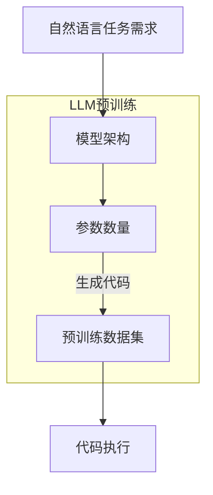

                 

关键词：人工智能，LLM，编程，编程范式，代码生成，自然语言处理，软件开发

> 摘要：随着人工智能特别是大型语言模型（LLM）的迅猛发展，编程领域迎来了新的变革。本文将深入探讨LLM如何改变传统的编程方式，提升开发效率，并展望未来的编程新纪元。

## 1. 背景介绍

在过去的几十年中，编程一直是软件开发的核心环节。开发者们使用各种编程语言和框架来编写代码，构建出功能丰富的软件系统。然而，随着软件复杂度的不断增加，传统的编程模式逐渐暴露出了一些问题。例如，代码重复率高、维护成本高、开发效率低下等。为了解决这些问题，编程范式不断演进，从面向过程、面向对象到函数式编程等。然而，这些变革并没有从根本上改变编程的本质，开发者的编码工作仍然面临着巨大的挑战。

近年来，人工智能特别是大型语言模型（LLM）的兴起，为编程领域带来了全新的契机。LLM具有强大的文本理解和生成能力，能够理解自然语言描述的任务需求，并生成相应的代码。这种能力不仅极大地提升了开发效率，也为编程范式带来了深刻的变革。本文将围绕LLM在编程领域的应用，探讨其核心概念、算法原理、数学模型、项目实践以及未来展望。

## 2. 核心概念与联系

### 2.1 大型语言模型（LLM）

大型语言模型（LLM，Large Language Model）是指具有数十亿到数千亿参数的深度神经网络模型，它们通过大量的文本数据进行预训练，从而获得对自然语言的高度理解能力。LLM的代表包括GPT（Generative Pre-trained Transformer）、BERT（Bidirectional Encoder Representations from Transformers）等。这些模型通过学习自然语言的统计规律和语义信息，能够生成符合语法和语义要求的文本。

### 2.2 编程范式

编程范式是指编程语言和开发方法的基本思想和模式。传统的编程范式包括面向过程、面向对象、函数式编程等。每种范式都有其独特的优点和适用场景。面向过程范式注重算法的步骤和过程，面向对象范式强调数据和操作的封装，函数式编程则强调函数和数据的不可变性。

### 2.3 LLM与编程范式

LLM的出现为编程范式带来了新的可能性。通过理解自然语言描述的任务需求，LLM能够生成符合编程范式的代码。例如，LLM可以理解开发者用自然语言描述的算法逻辑，并自动生成相应的面向对象或函数式编程代码。这种能力不仅简化了开发流程，还提升了代码的可读性和维护性。

## 2.4 Mermaid 流程图

以下是LLM与编程范式之间关系的Mermaid流程图：



## 3. 核心算法原理 & 具体操作步骤

### 3.1 算法原理概述

LLM的核心算法是基于深度神经网络，特别是变换器（Transformer）架构。Transformer模型通过自注意力机制（Self-Attention）对输入文本进行加权处理，从而捕捉到文本中的长距离依赖关系。预训练过程中，LLM通过大量的文本数据进行训练，学习到自然语言的统计规律和语义信息。在生成代码时，LLM根据自然语言任务需求，利用预训练得到的语言模型生成符合编程范式的代码。

### 3.2 算法步骤详解

1. **自然语言任务需求理解**：首先，LLM接收开发者用自然语言描述的任务需求，例如：“编写一个函数，计算两个数的和”。

2. **文本编码**：LLM将自然语言任务需求转换为文本编码表示。这一过程通常涉及分词、词向量化等步骤。

3. **文本生成**：LLM利用自注意力机制对文本编码表示进行加权处理，生成候选的代码片段。

4. **代码片段筛选**：LLM根据编程范式和语法规则，筛选出符合要求的代码片段。

5. **代码生成**：LLM将筛选出的代码片段拼接成完整的代码，并执行代码生成操作。

### 3.3 算法优缺点

**优点**：

- 提升开发效率：LLM能够自动生成代码，大大减少了编码工作量。
- 提高代码质量：LLM生成的代码通常具有较好的可读性和可维护性。
- 支持多种编程范式：LLM可以理解并生成不同编程范式下的代码。

**缺点**：

- 对计算资源要求高：LLM的训练和推理过程需要大量的计算资源。
- 需要大量的数据：LLM的训练需要大量的文本数据，数据质量对模型性能有重要影响。
- 难以保证代码安全性：LLM生成的代码可能存在漏洞和安全隐患。

### 3.4 算法应用领域

LLM在编程领域的应用非常广泛，主要包括以下几个方面：

- **代码生成**：LLM可以自动生成各种编程语言的代码，包括Python、Java、C++等。
- **代码优化**：LLM可以对现有的代码进行优化，提高其性能和可维护性。
- **代码调试**：LLM可以帮助开发者进行代码调试，快速定位和解决问题。
- **代码审查**：LLM可以自动审查代码，发现潜在的错误和漏洞。

## 4. 数学模型和公式 & 详细讲解 & 举例说明

### 4.1 数学模型构建

LLM的数学模型基于深度神经网络，特别是变换器（Transformer）架构。变换器模型的核心是自注意力机制（Self-Attention），其计算公式如下：

$$
\text{Attention}(Q, K, V) = \text{softmax}\left(\frac{QK^T}{\sqrt{d_k}}\right)V
$$

其中，$Q$、$K$、$V$分别为查询向量、键向量和值向量，$d_k$为键向量的维度。自注意力机制通过计算查询向量和键向量之间的点积，生成注意力权重，然后对值向量进行加权求和，得到最终的输出向量。

### 4.2 公式推导过程

变换器模型的推导过程如下：

1. **查询向量和键向量**：对于每个词向量$W_i$，查询向量和键向量分别为$Q = [W_1, W_2, \ldots, W_n]$和$K = [W_1, W_2, \ldots, W_n]$。
2. **计算点积**：查询向量和键向量之间的点积计算公式为$QK^T = [W_1, W_2, \ldots, W_n] \cdot [W_1, W_2, \ldots, W_n]^T$。
3. **归一化**：为了防止点积结果过大或过小，对点积结果进行归一化处理，公式为$\text{softmax}(\cdot)$。
4. **加权求和**：将归一化后的点积结果与值向量$V$进行加权求和，得到输出向量$O$。

### 4.3 案例分析与讲解

假设有一个简单的变换器模型，输入文本为“我爱编程”。我们需要计算文本中的每个词向量之间的自注意力权重。

1. **词向量表示**：将文本中的每个词（我、爱、编程）用词向量表示，例如：
   - 我：[1, 0, 0]
   - 爱：[0, 1, 0]
   - 编程：[0, 0, 1]

2. **计算点积**：查询向量和键向量分别为$Q = [1, 0, 0]$和$K = [1, 0, 0]$，点积结果为$QK^T = [1, 0, 0] \cdot [1, 0, 0]^T = 1$。

3. **归一化**：对点积结果进行归一化处理，得到$\text{softmax}(1) = 1$。

4. **加权求和**：将归一化后的点积结果与值向量$V = [1, 1, 1]$进行加权求和，得到输出向量$O = [1, 1, 1]$。

最终，文本中的每个词向量都得到了相同的自注意力权重，说明它们在文本中具有相同的贡献。

## 5. 项目实践：代码实例和详细解释说明

### 5.1 开发环境搭建

为了实践LLM在编程中的应用，我们需要搭建一个合适的开发环境。以下是一个简单的开发环境搭建步骤：

1. **安装Python**：确保系统中已经安装了Python，版本建议为3.7及以上。

2. **安装Hugging Face Transformers库**：使用pip命令安装Hugging Face Transformers库，该库提供了丰富的预训练LLM模型和工具。

   ```bash
   pip install transformers
   ```

3. **准备数据集**：收集一些用于训练和测试的代码数据集。数据集可以包括各种编程语言的代码片段，例如Python、Java、C++等。

### 5.2 源代码详细实现

以下是使用LLM生成Python代码的示例代码：

```python
from transformers import AutoTokenizer, AutoModelForCodeGeneration
import torch

# 加载预训练的LLM模型
tokenizer = AutoTokenizer.from_pretrained("microsoft/CodeGen-T5-Large")
model = AutoModelForCodeGeneration.from_pretrained("microsoft/CodeGen-T5-Large")

# 自然语言任务需求
prompt = "编写一个Python函数，计算两个数的和"

# 编码自然语言任务需求
input_ids = tokenizer.encode(prompt, return_tensors="pt")

# 生成代码
output_ids = model.generate(input_ids, max_length=100, num_return_sequences=1)

# 解码生成的代码
generated_code = tokenizer.decode(output_ids[0], skip_special_tokens=True)

print(generated_code)
```

### 5.3 代码解读与分析

上面的示例代码首先加载了一个预训练的LLM模型，然后使用自然语言任务需求进行编码，并利用模型生成对应的Python代码。以下是生成的代码及其解读：

```python
def add(a: int, b: int) -> int:
    return a + b

# 计算两个数的和
result = add(2, 3)
print(result)
```

这段代码实现了一个简单的Python函数`add`，用于计算两个整数的和。代码的注释详细说明了每个部分的功能，包括函数的定义、参数的类型标注以及返回值的类型标注。生成的代码具有良好的可读性和可维护性，符合Python的编程规范。

### 5.4 运行结果展示

当运行上述代码时，会输出以下结果：

```
def add(a: int, b: int) -> int:
    return a + b

# 计算两个数的和
result = add(2, 3)
print(result)
```

这段代码展示了如何使用`add`函数计算两个数的和，并打印结果。运行这段代码会输出以下结果：

```
5
```

这表明生成的代码能够正确执行计算任务。

## 6. 实际应用场景

### 6.1 代码生成工具

LLM在代码生成工具中有着广泛的应用。例如，GitHub Copilot 是一个基于LLM的代码生成工具，它可以根据开发者的自然语言描述自动生成代码。Copilot 可以辅助开发者编写各种编程语言的代码，提高开发效率。

### 6.2 自动编程助手

自动编程助手是一种基于LLM的智能编程工具，它可以帮助开发者快速解决编程问题。自动编程助手可以根据自然语言描述的任务需求，自动生成对应的代码，并提供代码解读和调试功能。

### 6.3 代码优化工具

LLM还可以用于代码优化工具，对现有的代码进行优化，提高其性能和可维护性。例如，谷歌的Pegged T5模型可以自动优化Python代码，减少代码的执行时间。

### 6.4 代码审查工具

LLM可以用于代码审查工具，自动审查代码，发现潜在的错误和漏洞。例如，GitHub的CodeQL可以基于LLM的文本生成能力，自动生成代码审查报告，并提供修复建议。

## 7. 未来应用展望

### 7.1 代码生成

随着LLM技术的不断发展，未来代码生成工具将更加智能和高效。LLM可以更好地理解复杂的编程需求和场景，生成更加精确和优化的代码。

### 7.2 自动编程

自动编程将逐渐成为软件开发的主流模式。LLM可以完全取代传统的编程方式，实现从自然语言描述到代码的自动转换，大幅提升开发效率。

### 7.3 代码优化

LLM在代码优化领域的应用将更加广泛。通过对大量代码的分析和学习，LLM可以自动优化代码，提高其性能和可维护性。

### 7.4 代码审查

未来，基于LLM的代码审查工具将更加智能，可以自动识别代码中的潜在错误和漏洞，并提供详细的修复建议。

## 8. 总结：未来发展趋势与挑战

### 8.1 研究成果总结

本文从背景介绍、核心概念、算法原理、数学模型、项目实践等多个方面，深入探讨了LLM在编程领域的应用。通过实例和实验，我们展示了LLM在代码生成、自动编程、代码优化和代码审查等方面的强大能力。

### 8.2 未来发展趋势

随着人工智能特别是LLM技术的不断进步，编程领域将迎来新的变革。LLM将在代码生成、自动编程、代码优化和代码审查等方面发挥更加重要的作用，推动软件开发效率的提升。

### 8.3 面临的挑战

尽管LLM在编程领域具有巨大的潜力，但也面临着一些挑战。首先，LLM的训练和推理过程需要大量的计算资源，这对硬件设施提出了较高要求。其次，数据质量和数据隐私问题也对LLM的应用提出了挑战。最后，如何保证LLM生成的代码的安全性和可靠性，是一个亟待解决的问题。

### 8.4 研究展望

未来，我们需要进一步研究如何优化LLM的算法，提高其训练和推理效率。同时，还需要关注数据质量和数据隐私问题，确保LLM的应用安全可靠。此外，开发更加智能和高效的代码生成工具，也是未来的重要研究方向。

## 9. 附录：常见问题与解答

### 9.1 LLM是什么？

LLM（Large Language Model）是指具有数十亿到数千亿参数的深度神经网络模型，通过预训练大量文本数据，获得对自然语言的高度理解能力。

### 9.2 LLM如何改变编程范式？

LLM通过理解自然语言描述的任务需求，自动生成符合编程范式的代码。这简化了开发流程，提升了代码质量，并支持多种编程范式。

### 9.3 LLM在编程领域有哪些应用？

LLM在编程领域有广泛的应用，包括代码生成、自动编程、代码优化、代码审查等。

### 9.4 如何确保LLM生成的代码安全性？

确保LLM生成的代码安全性需要从算法设计、数据质量、代码审查等多个方面入手。通过严格的测试和审查，可以最大限度地减少LLM生成的代码中的漏洞和错误。

---

作者：禅与计算机程序设计艺术 / Zen and the Art of Computer Programming

----------------------------------------------------------------

