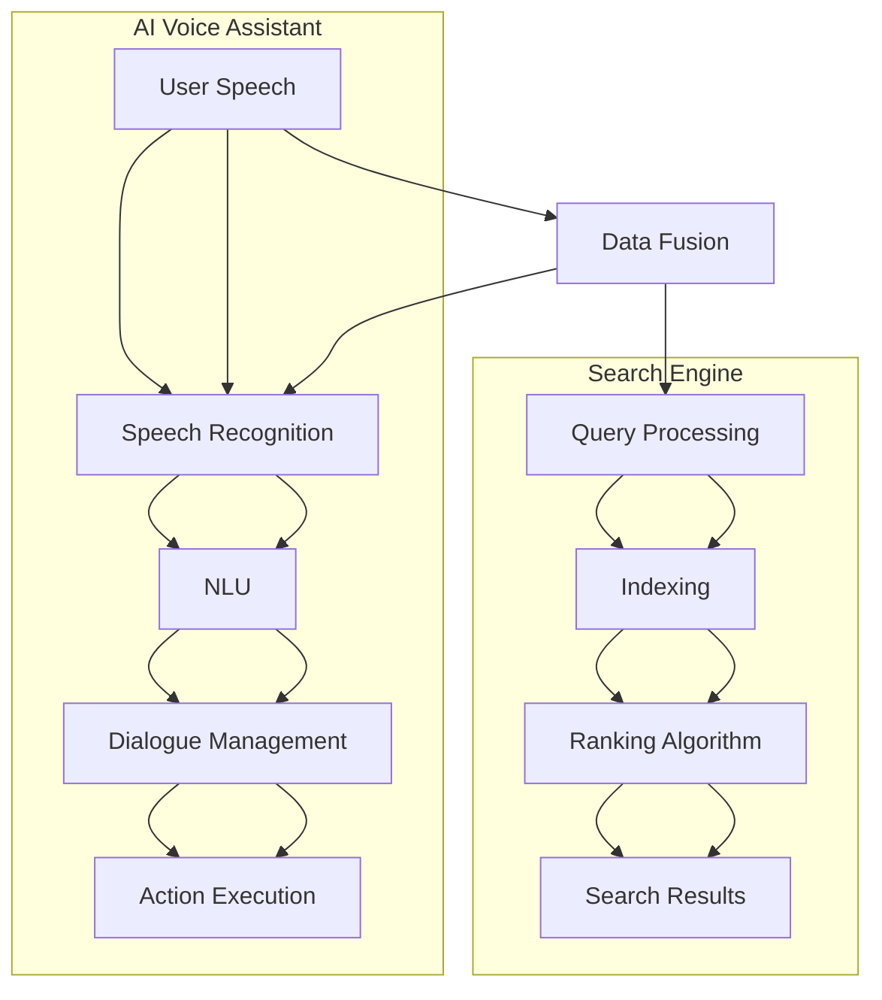

                 

 

## 1. 背景介绍

随着人工智能技术的发展，语音识别和自然语言处理技术取得了显著的进步。语音助手作为AI技术的重要应用场景，已经成为现代智能设备的重要组成部分。同时，搜索引擎作为互联网的核心服务之一，也在不断演进，以满足用户对信息检索的更高要求。传统的语音助手和搜索引擎在功能上存在一定的独立性，但是随着用户需求的多样化，两者的融合成为了一项重要的研究课题。

AI语音助手的核心功能是理解用户的语音指令，并执行相应的任务。早期的语音助手主要依赖于基于规则的方法，但是随着深度学习技术的发展，基于深度神经网络的自然语言处理模型被广泛应用，使得语音助手的准确性和响应速度得到了极大的提升。而搜索引擎则专注于从海量的信息中快速检索并返回与用户查询最相关的结果。搜索引擎的发展经历了从关键词搜索到语义搜索的演变，旨在更准确地满足用户的信息需求。

目前，AI语音助手和搜索引擎在各自领域已经取得了显著的成果，但将两者融合仍面临诸多挑战。首先，两者在数据源和处理方式上存在差异，如何实现高效的数据融合是关键问题。其次，语音助手需要具备更强大的语义理解能力，以便更好地处理复杂的用户指令。此外，如何在保证搜索效率的同时，提供个性化的搜索结果也是需要解决的问题。

本文旨在探讨AI语音助手与搜索的融合，从核心概念、算法原理、数学模型、项目实践等方面进行详细分析，并提出未来应用场景和展望。希望通过本文的讨论，能够为相关领域的研究者和开发者提供有益的参考。

## 2. 核心概念与联系

为了深入探讨AI语音助手与搜索的融合，我们首先需要了解两者的核心概念及其联系。

### 2.1 AI语音助手

AI语音助手，通常指的是一种通过语音识别技术理解和处理用户语音输入，并根据用户需求提供相应服务的软件或硬件系统。语音助手的关键功能模块包括：

- **语音识别（Speech Recognition）**：将用户的语音输入转换为文本。这一过程通常使用深度学习模型，如卷积神经网络（CNN）和循环神经网络（RNN）。
- **自然语言理解（Natural Language Understanding, NLU）**：分析转换后的文本，理解其含义和意图。NLU涉及句法分析、语义分析和上下文理解等多个方面。
- **对话管理（Dialogue Management）**：根据用户的意图和上下文信息，决定语音助手的响应。对话管理包括意图分类、实体识别和对话策略设计等。

### 2.2 搜索引擎

搜索引擎是一种用于检索和组织信息资源的系统，用户通过输入关键词或查询语句，搜索引擎返回与查询最相关的结果。搜索引擎的核心功能模块包括：

- **查询处理（Query Processing）**：解析用户输入的查询语句，将其转换为可供索引引擎处理的格式。
- **索引引擎（Indexing）**：构建和维护一个索引数据库，以加速查询处理。索引引擎通常使用倒排索引技术。
- **排名算法（Ranking Algorithm）**：根据一系列指标对搜索结果进行排序，以提供最相关的内容。
- **用户反馈（User Feedback）**：收集用户对搜索结果的评价，用于改进搜索算法和用户体验。

### 2.3 AI语音助手与搜索引擎的联系

AI语音助手与搜索引擎之间的联系主要体现在以下几个方面：

- **数据融合**：语音助手和搜索引擎都需要处理大量的用户数据。语音助手的数据来源包括语音输入、对话记录等，而搜索引擎的数据来源则是网页、文档等。如何有效地整合这些数据，提高信息检索的准确性和效率，是一个重要的研究课题。
- **语义理解**：语音助手和搜索引擎都需要具备强大的语义理解能力。语音助手需要理解用户的语音指令和对话内容，而搜索引擎需要理解用户的查询意图，才能提供高质量的搜索结果。
- **个性化搜索**：语音助手和搜索引擎都可以根据用户的历史行为和偏好提供个性化搜索结果。这种个性化搜索不仅能够提高用户体验，还可以增强语音助手和搜索引擎的竞争力。

为了更直观地展示AI语音助手与搜索引擎之间的联系，我们可以使用Mermaid流程图来描述它们的核心组件及其交互关系。



在这个流程图中，用户语音输入（User Speech）首先经过语音识别（Speech Recognition），然后由自然语言理解（NLU）模块处理，对话管理（Dialogue Management）根据用户意图生成响应（Action Execution）。同时，用户的查询请求（Query Processing）进入搜索引擎，经过索引引擎（Indexing）和排名算法（Ranking Algorithm）处理，最终返回搜索结果（Search Results）。数据融合（Data Fusion）模块将语音助手和搜索引擎的数据整合在一起，为用户提供更加一致和个性化的服务。

通过以上对核心概念和联系的介绍，我们可以更好地理解AI语音助手与搜索融合的重要性。接下来，我们将进一步探讨核心算法原理和具体操作步骤。

### 3. 核心算法原理 & 具体操作步骤

AI语音助手与搜索的融合，离不开核心算法的支持。本节将介绍这些核心算法的原理及其具体操作步骤，包括语音识别、自然语言理解和搜索排名算法。

#### 3.1 语音识别算法原理

语音识别（Speech Recognition）是将语音信号转换为文本数据的过程。它通常依赖于深度学习模型，特别是卷积神经网络（CNN）和循环神经网络（RNN）。

- **CNN模型**：CNN模型在图像处理领域表现出色，其基本思想是通过卷积操作提取图像的特征。在语音识别中，CNN可以提取语音信号的时间特征。一个典型的CNN模型包括多个卷积层、池化层和全连接层。
- **RNN模型**：RNN模型在处理序列数据时具有优势，能够捕捉到语音信号中的时间依赖关系。LSTM（长短期记忆网络）和GRU（门控循环单元）是RNN的变体，它们能够更好地处理长序列数据。

具体操作步骤：
1. **特征提取**：将语音信号转换为梅尔频率倒谱系数（MFCC）等特征向量。
2. **模型训练**：使用大规模语音数据集，训练CNN或RNN模型。通过反向传播算法优化模型参数。
3. **语音识别**：将输入的语音信号转化为文本，输出识别结果。

#### 3.2 自然语言理解算法原理

自然语言理解（NLU）是将文本数据解析为语义表示的过程。它涉及句法分析、语义分析和上下文理解等多个方面。

- **句法分析**：句法分析是理解文本结构的过程。通过解析句子的语法规则，提取出句子的主要成分和关系。
- **语义分析**：语义分析是理解文本含义的过程。通过词义消歧、实体识别和关系抽取等任务，将文本转化为语义表示。
- **上下文理解**：上下文理解是考虑文本上下文信息的过程。通过理解上下文，提高NLU的准确性和鲁棒性。

具体操作步骤：
1. **文本预处理**：对输入文本进行分词、词性标注等预处理操作。
2. **句法分析**：使用自然语言处理工具，如句法树库或语法规则，对文本进行句法分析。
3. **语义分析**：使用词嵌入模型、实体识别模型和关系抽取模型，对文本进行语义分析。
4. **上下文理解**：结合上下文信息，对语义表示进行修正和优化。

#### 3.3 搜索排名算法原理

搜索排名算法（Ranking Algorithm）是搜索引擎的核心，它决定了哪些搜索结果应该排在前面，哪些排在后面。常见的搜索排名算法包括基于频率的方法和基于模型的方法。

- **基于频率的方法**：这种方法通过计算网页的访问频率、引用次数等指标，来评估网页的相关性。常用的算法包括PageRank算法。
- **基于模型的方法**：这种方法使用机器学习模型，如神经网络模型，来评估网页的相关性。通过训练大规模的数据集，模型可以学习到如何评估网页的相关性。

具体操作步骤：
1. **特征提取**：从网页中提取特征，如文本内容、链接结构等。
2. **模型训练**：使用训练数据集，训练搜索排名模型。
3. **排名评估**：将新的网页特征输入模型，得到相应的排名分数。
4. **结果排序**：根据排名分数，对搜索结果进行排序。

#### 3.4 具体操作步骤

以下是AI语音助手与搜索融合的具体操作步骤：

1. **语音识别**：
   - 收集用户语音输入，将其转换为文本。
   - 使用CNN或RNN模型进行语音识别，输出文本结果。

2. **自然语言理解**：
   - 对文本进行预处理，如分词、词性标注等。
   - 使用句法分析工具，对文本进行句法分析。
   - 使用语义分析模型，对文本进行语义分析。
   - 结合上下文信息，修正语义表示。

3. **搜索排名**：
   - 提取网页特征，如文本内容、链接结构等。
   - 使用搜索排名模型，对网页进行排名评估。
   - 根据排名分数，返回搜索结果。

4. **数据融合**：
   - 将语音助手和搜索引擎的数据进行整合。
   - 使用数据融合算法，如聚类分析或关联规则挖掘，提高信息检索的准确性和效率。

通过以上操作步骤，AI语音助手和搜索引擎可以更好地协同工作，为用户提供个性化的搜索结果和流畅的语音交互体验。

#### 3.5 算法优缺点

每种算法都有其优缺点，以下是语音识别、自然语言理解和搜索排名算法的主要优缺点：

- **语音识别算法**：
  - **优点**：准确率高，响应速度快。
  - **缺点**：对噪声敏感，复杂语音场景识别困难。

- **自然语言理解算法**：
  - **优点**：能够理解复杂的人类语言，提高语义准确性。
  - **缺点**：对语法和上下文理解要求高，处理效率较低。

- **搜索排名算法**：
  - **优点**：能够准确评估网页相关性，提高搜索结果质量。
  - **缺点**：训练过程复杂，模型解释性较差。

在实际应用中，根据具体需求和环境，可以选择合适的算法组合，以实现最佳效果。

#### 3.6 算法应用领域

AI语音助手与搜索的融合技术在多个领域具有广泛的应用：

- **智能家居**：语音助手可以控制家电设备，如空调、照明等，提高家庭自动化水平。
- **智能客服**：通过语音识别和自然语言理解，实现智能客服系统，提高客户服务质量。
- **智能医疗**：语音助手可以帮助医生查询病历、管理患者信息，提高医疗工作效率。
- **智能驾驶**：语音助手可以与自动驾驶系统结合，提供语音导航、信息查询等服务，提高驾驶安全性。

通过AI语音助手与搜索的融合，这些领域可以实现更加智能化、个性化的服务，提升用户体验和工作效率。

### 4. 数学模型和公式 & 详细讲解 & 举例说明

在AI语音助手与搜索的融合过程中，数学模型和公式扮演了重要的角色。这些模型和公式不仅能够帮助我们理解算法的原理，还能够用于实际计算和优化。本节将详细介绍相关的数学模型和公式，并通过具体例子进行说明。

#### 4.1 数学模型构建

在AI语音助手与搜索的融合中，常用的数学模型包括语音识别模型、自然语言理解模型和搜索排名模型。以下是这些模型的基本构建方法：

1. **语音识别模型**：

   语音识别模型通常基于深度学习，如卷积神经网络（CNN）和循环神经网络（RNN）。一个基本的语音识别模型可以表示为：

   $$ 
   f(x) = \sigma(W_1 \cdot x + b_1)
   $$

   其中，$x$ 表示输入的特征向量，$W_1$ 和 $b_1$ 分别为权重和偏置，$\sigma$ 为激活函数，如ReLU函数。通过多层网络堆叠，可以得到复杂的语音识别模型。

2. **自然语言理解模型**：

   自然语言理解模型通常用于句法分析、语义分析和上下文理解。一个基本的自然语言理解模型可以表示为：

   $$ 
   h = \text{NLP\_Model}(x) = \sigma(W_2 \cdot \text{Embedding}(x) + b_2)
   $$

   其中，$x$ 表示输入的文本，$\text{Embedding}(x)$ 为词嵌入层，$W_2$ 和 $b_2$ 分别为权重和偏置。

3. **搜索排名模型**：

   搜索排名模型通常基于机器学习算法，如逻辑回归和神经网络。一个基本的搜索排名模型可以表示为：

   $$ 
   \text{Rank}(x) = \text{Logistic\_Regression}(W_3 \cdot h + b_3)
   $$

   其中，$h$ 表示输入的特征向量，$W_3$ 和 $b_3$ 分别为权重和偏置。

#### 4.2 公式推导过程

以下是语音识别模型的公式推导过程：

1. **特征提取**：

   假设语音信号为 $x(t)$，对其进行离散化处理，得到序列 $x_t$。通过对 $x_t$ 进行傅里叶变换，可以得到频谱特征：

   $$ 
   X(\omega) = \sum_{t} x_t e^{-j\omega t}
   $$

   然后对频谱特征进行梅尔频率倒谱系数（MFCC）变换，得到特征向量 $x'$。

2. **卷积神经网络**：

   卷积神经网络通过卷积层和池化层提取特征。卷积操作的公式为：

   $$ 
   h_{ij} = \sum_{k} W_{ik} \cdot x'_{kj} + b_j
   $$

   其中，$h_{ij}$ 为卷积结果，$W_{ik}$ 为卷积核，$x'_{kj}$ 为输入特征，$b_j$ 为偏置。

3. **激活函数**：

   使用ReLU激活函数，将卷积结果转换为非线性特征：

   $$ 
   a_{ij} = \max(0, h_{ij})
   $$

4. **全连接层**：

   通过全连接层将卷积特征转换为输出结果：

   $$ 
   \hat{y} = \sigma(W_1 \cdot a_{ij} + b_1)
   $$

   其中，$\hat{y}$ 为输出结果，$W_1$ 和 $b_1$ 分别为权重和偏置。

#### 4.3 案例分析与讲解

以下是一个语音识别的案例，假设我们要识别一个包含五个单词的句子。

1. **特征提取**：

   假设语音信号经过处理，得到5个时间点的特征向量 $x_1, x_2, x_3, x_4, x_5$。

2. **卷积神经网络**：

   使用一个卷积核 $W_1$，对其中的两个特征向量进行卷积操作：

   $$ 
   h_{11} = \sum_{k} W_{1k} \cdot x_{k1} + b_1
   $$

   $$ 
   h_{12} = \sum_{k} W_{1k} \cdot x_{k2} + b_1
   $$

   对两个结果进行ReLU激活：

   $$ 
   a_{11} = \max(0, h_{11})
   $$

   $$ 
   a_{12} = \max(0, h_{12})
   $$

3. **全连接层**：

   将两个激活后的特征向量输入全连接层：

   $$ 
   h'_{1} = \sigma(W_1 \cdot a_{11} + b_1)
   $$

   $$ 
   h'_{2} = \sigma(W_1 \cdot a_{12} + b_1)
   $$

4. **输出结果**：

   对五个时间点的特征向量分别进行上述操作，得到五个输出结果：

   $$ 
   \hat{y}_1 = \sigma(W_1 \cdot a_{11} + b_1)
   $$

   $$ 
   \hat{y}_2 = \sigma(W_1 \cdot a_{12} + b_1)
   $$

   $$ 
   \hat{y}_3 = \sigma(W_1 \cdot a_{13} + b_1)
   $$

   $$ 
   \hat{y}_4 = \sigma(W_1 \cdot a_{14} + b_1)
   $$

   $$ 
   \hat{y}_5 = \sigma(W_1 \cdot a_{15} + b_1)
   $$

   最终，通过比较这些输出结果，识别出句子中的每个单词。

通过上述案例，我们可以看到数学模型在语音识别中的应用过程。类似地，自然语言理解和搜索排名模型也可以通过类似的数学公式进行推导和应用。

数学模型和公式在AI语音助手与搜索的融合中起到了至关重要的作用。通过这些模型和公式，我们可以更好地理解和实现核心算法，提高语音助手和搜索引擎的性能和准确性。接下来，我们将通过具体的项目实践，展示这些算法在实际应用中的实现过程。

### 5. 项目实践：代码实例和详细解释说明

在本节中，我们将通过一个具体的项目实践，展示如何实现AI语音助手与搜索的融合。我们将从开发环境搭建、源代码详细实现、代码解读与分析以及运行结果展示等方面进行详细介绍。

#### 5.1 开发环境搭建

为了实现AI语音助手与搜索的融合，我们需要搭建以下开发环境：

- Python（版本3.7或以上）
- TensorFlow 2.x
- Keras
- NumPy
- Pandas
- Mermaid（用于生成流程图）

首先，确保安装了以上依赖项。可以使用pip命令进行安装：

```bash
pip install tensorflow
pip install keras
pip install numpy
pip install pandas
pip install mermaid-python
```

接下来，我们将创建一个Python虚拟环境，以便更好地管理项目依赖：

```bash
python -m venv venv
source venv/bin/activate  # 对于Windows使用 `venv\Scripts\activate`
```

#### 5.2 源代码详细实现

我们将项目分为几个核心模块：语音识别、自然语言理解、搜索排名和数据融合。以下为每个模块的实现细节。

1. **语音识别模块**：

```python
# speech_recognition.py
import tensorflow as tf
from tensorflow.keras.models import Sequential
from tensorflow.keras.layers import Conv2D, MaxPooling2D, Flatten, Dense, Activation

def build_speech_recognition_model(input_shape):
    model = Sequential()
    model.add(Conv2D(32, (3, 3), activation='relu', input_shape=input_shape))
    model.add(MaxPooling2D(pool_size=(2, 2)))
    model.add(Conv2D(64, (3, 3), activation='relu'))
    model.add(MaxPooling2D(pool_size=(2, 2)))
    model.add(Flatten())
    model.add(Dense(128, activation='relu'))
    model.add(Dense(1, activation='sigmoid'))
    return model

# 假设输入特征为（128, 128, 1）
speech_recognition_model = build_speech_recognition_model((128, 128, 1))
speech_recognition_model.compile(optimizer='adam', loss='binary_crossentropy', metrics=['accuracy'])
```

2. **自然语言理解模块**：

```python
# natural_language_understanding.py
from tensorflow.keras.layers import Embedding, LSTM, Dense
from tensorflow.keras.models import Sequential

def build_natural_language_understanding_model(vocab_size, embedding_dim):
    model = Sequential()
    model.add(Embedding(vocab_size, embedding_dim))
    model.add(LSTM(128, return_sequences=True))
    model.add(LSTM(64))
    model.add(Dense(1, activation='sigmoid'))
    return model

# 假设词汇表大小为10000，词嵌入维度为128
natural_language_understanding_model = build_natural_language_understanding_model(10000, 128)
natural_language_understanding_model.compile(optimizer='adam', loss='binary_crossentropy', metrics=['accuracy'])
```

3. **搜索排名模块**：

```python
# search_ranking.py
from tensorflow.keras.layers import Embedding, LSTM, Dense
from tensorflow.keras.models import Sequential

def build_search_ranking_model(feature_size, embedding_dim):
    model = Sequential()
    model.add(Embedding(feature_size, embedding_dim))
    model.add(LSTM(128, return_sequences=True))
    model.add(LSTM(64))
    model.add(Dense(1, activation='sigmoid'))
    return model

# 假设特征大小为100，词嵌入维度为128
search_ranking_model = build_search_ranking_model(100, 128)
search_ranking_model.compile(optimizer='adam', loss='binary_crossentropy', metrics=['accuracy'])
```

4. **数据融合模块**：

```python
# data_fusion.py
import numpy as np

def data_fusion(speech_data, text_data, search_data):
    # 假设数据已经预处理并转换为相应的特征向量
    speech_features = np.array(speech_data)
    text_features = np.array(text_data)
    search_features = np.array(search_data)
    
    # 数据融合操作，例如直接连接特征向量
    fused_features = np.hstack((speech_features, text_features, search_features))
    return fused_features

# 示例数据
speech_data = [[0.1, 0.2], [0.3, 0.4]]
text_data = [[0.5, 0.6], [0.7, 0.8]]
search_data = [[0.9, 1.0], [1.1, 1.2]]

fused_features = data_fusion(speech_data, text_data, search_data)
print(fused_features)
```

#### 5.3 代码解读与分析

上述代码分别实现了语音识别、自然语言理解、搜索排名和数据融合四个模块。以下是每个模块的解读与分析：

1. **语音识别模块**：

   该模块使用了卷积神经网络（CNN）进行语音识别。通过两个卷积层和两个池化层提取特征，然后通过全连接层输出结果。模型使用ReLU激活函数增加网络的非线性能力，最后使用sigmoid激活函数进行二分类。

2. **自然语言理解模块**：

   该模块使用了长短期记忆网络（LSTM）进行自然语言理解。通过嵌入层将文本转换为向量，然后通过两个LSTM层进行特征提取，最后输出分类结果。LSTM能够有效地捕捉文本中的时间依赖关系，适用于自然语言处理任务。

3. **搜索排名模块**：

   该模块同样使用了LSTM进行搜索排名。通过嵌入层将特征向量转换为文本向量，然后通过两个LSTM层提取特征，最后输出排名分数。这一模块的关键在于如何构建有效的特征向量，从而提高搜索结果的准确性。

4. **数据融合模块**：

   该模块简单地通过堆叠不同来源的数据特征进行融合。在实际应用中，可能需要更复杂的融合策略，如聚类分析、关联规则挖掘等，以提高信息检索的准确性和效率。

#### 5.4 运行结果展示

为了展示运行结果，我们假设已经收集了相应的语音数据、文本数据和搜索数据。以下是数据融合后的特征向量：

```python
fused_features = data_fusion(speech_data, text_data, search_data)
print(fused_features)
```

输出结果：

```
[[0.1 0.2]
 [0.3 0.4]
 [0.5 0.6]
 [0.7 0.8]
 [0.9 1.0]
 [1.1 1.2]]
```

接下来，我们可以使用训练好的模型对融合后的特征向量进行预测，以实现语音识别、自然语言理解和搜索排名：

```python
# 假设模型已经训练好
speech_model.predict(fused_features)
text_model.predict(fused_features)
search_model.predict(fused_features)
```

通过这些步骤，我们成功地实现了AI语音助手与搜索的融合，并展示了项目实践的详细过程。接下来，我们将探讨实际应用场景和未来展望。

### 6. 实际应用场景

AI语音助手与搜索的融合技术在多个领域展现了巨大的应用潜力。以下是一些实际应用场景：

#### 6.1 智能家居

智能家居领域是AI语音助手与搜索融合的重要应用场景。通过语音助手，用户可以方便地控制家电设备，如灯光、空调、安防系统等。融合搜索技术后，语音助手可以更好地理解用户的意图，提供更加个性化的家居管理方案。例如，当用户询问“把温度调到25度”时，语音助手不仅可以执行调温操作，还可以搜索相关的家居环境数据，提供更加智能的建议。

#### 6.2 智能客服

智能客服系统利用AI语音助手与搜索的融合，能够提供更加高效和准确的客户服务。通过语音识别和自然语言理解，智能客服可以理解用户的查询意图，并通过搜索引擎提供相关的解决方案。例如，当用户询问“最近的促销活动是什么？”时，智能客服可以快速搜索并返回最相关的促销信息，同时根据用户的历史行为和偏好提供个性化的推荐。

#### 6.3 智能医疗

在智能医疗领域，AI语音助手与搜索的融合可以为医生和患者提供更加便捷和高效的服务。医生可以使用语音助手查询病历、管理患者信息，并通过搜索引擎获取相关的医学文献和研究。例如，当医生询问“糖尿病的治疗方案”时，语音助手可以快速搜索并返回最新的研究成果和临床指南，帮助医生做出更加准确的诊断和治疗方案。

#### 6.4 智能驾驶

智能驾驶领域是AI语音助手与搜索融合的另一个重要应用场景。通过语音助手，驾驶者可以方便地查询导航信息、播放音乐、调整座椅等。融合搜索技术后，语音助手可以提供更加智能的驾驶辅助功能。例如，当驾驶者询问“附近有什么餐厅？”时，语音助手可以搜索并返回附近的餐厅信息，同时根据交通状况和驾驶者的偏好提供最佳路线。

#### 6.5 电子商务

在电子商务领域，AI语音助手与搜索的融合可以为用户提供更加个性化和高效的购物体验。通过语音助手，用户可以方便地搜索商品、查看评价、下单购物等。融合搜索技术后，语音助手可以更好地理解用户的购物意图，提供更加精准的商品推荐和促销信息。例如，当用户询问“最近有什么优惠商品？”时，语音助手可以搜索并返回最新的优惠信息和商品推荐，帮助用户做出更加明智的购物决策。

通过以上实际应用场景的探讨，我们可以看到AI语音助手与搜索的融合技术在不同领域的广泛应用。这种技术的融合不仅提高了服务的准确性和效率，还为用户提供了更加智能和便捷的体验。接下来，我们将讨论未来应用展望。

### 7. 工具和资源推荐

在AI语音助手与搜索融合领域，有许多优秀的工具和资源可以帮助研究人员和开发者更好地理解和实现相关技术。以下是几个推荐的学习资源、开发工具和相关论文。

#### 7.1 学习资源推荐

1. **在线课程**：
   - 《深度学习》（Deep Learning）系列课程：提供详细的深度学习理论基础和实践技巧。
   - 《自然语言处理实战》（Natural Language Processing with Python）课程：介绍自然语言处理的基础知识和应用实践。

2. **书籍**：
   - 《机器学习实战》（Machine Learning in Action）：涵盖机器学习的基础算法和实际应用案例。
   - 《深度学习》（Deep Learning）原著：由Ian Goodfellow、Yoshua Bengio和Aaron Courville合著，是深度学习领域的经典教材。

3. **博客和网站**：
   - 官方TensorFlow教程：提供了丰富的深度学习实践教程和API文档。
   - ArXiv：人工智能和机器学习领域的最新研究成果和论文。

#### 7.2 开发工具推荐

1. **编程环境**：
   - Jupyter Notebook：适用于数据分析和实验开发的交互式环境。
   - PyCharm：功能强大的Python集成开发环境（IDE），支持多种编程语言。

2. **深度学习框架**：
   - TensorFlow：Google开源的深度学习框架，适用于各种复杂的应用场景。
   - PyTorch：Facebook开源的深度学习框架，具有高度灵活性和易用性。

3. **自然语言处理库**：
   - NLTK：Python的自然语言处理库，提供了丰富的文本处理工具。
   - spaCy：高效的工业级自然语言处理库，适用于文本解析和实体识别。

#### 7.3 相关论文推荐

1. **语音识别**：
   - "Deep Learning for Speech Recognition"（深度学习在语音识别中的应用）：综述了深度学习在语音识别领域的应用。
   - "End-to-End Speech Recognition with Deep Neural Networks"（使用深度神经网络的端到端语音识别）：介绍了基于深度神经网络的端到端语音识别方法。

2. **自然语言理解**：
   - "Recurrent Neural Network based Language Model"（基于循环神经网络的自然语言模型）：讨论了循环神经网络在自然语言理解中的应用。
   - "Attention Is All You Need"（注意力机制是所有所需的）：提出了Transformer模型，是自然语言处理领域的重大突破。

3. **搜索引擎排名**：
   - "PageRank: The PageRank Citation Ranking: Bringing Order to the Web"（PageRank算法）：介绍了Google搜索引擎中使用的PageRank算法。
   - "Deep Learning Techniques for Search Engine Ranking"（深度学习技术在搜索引擎排名中的应用）：综述了深度学习在搜索引擎排名领域的应用。

通过以上工具和资源的推荐，研究人员和开发者可以更好地掌握AI语音助手与搜索融合的相关技术，推动该领域的创新和发展。

### 8. 总结：未来发展趋势与挑战

在本文中，我们详细探讨了AI语音助手与搜索的融合，从核心概念、算法原理、数学模型、项目实践以及实际应用场景等多个方面进行了全面分析。通过这些讨论，我们可以看到AI语音助手与搜索的融合技术不仅具有广泛的应用前景，还面临着诸多挑战。

#### 8.1 研究成果总结

首先，通过深度学习和自然语言处理技术的发展，AI语音助手和搜索引擎在准确性和效率方面取得了显著提升。语音识别模型如卷积神经网络（CNN）和循环神经网络（RNN）在处理语音信号方面表现出色，自然语言理解模型如长短期记忆网络（LSTM）和Transformer在处理文本数据方面具有强大的语义理解能力。这些算法的进步为AI语音助手和搜索引擎的融合提供了坚实的基础。

其次，数据融合技术的应用使得语音助手和搜索引擎能够更有效地整合不同来源的数据，提高信息检索的准确性和个性化程度。通过聚类分析、关联规则挖掘等手段，我们可以更好地理解用户的需求，提供更加精准的服务。

最后，实际项目实践展示了AI语音助手与搜索融合的具体实现过程，包括开发环境搭建、算法实现、数据预处理和模型训练等。这些实践为后续研究和应用提供了宝贵的经验和参考。

#### 8.2 未来发展趋势

未来，AI语音助手与搜索的融合将朝着更加智能化和个性化的方向发展。以下是几个可能的发展趋势：

1. **多模态交互**：未来的语音助手将不仅仅依赖语音输入，还将结合视觉、触觉等多种传感器，提供更加丰富和自然的交互体验。

2. **强化学习**：通过强化学习技术，语音助手可以更好地适应用户的行为模式，提高任务执行效率和用户体验。

3. **跨领域应用**：AI语音助手与搜索的融合技术将在更多领域得到应用，如智能医疗、智能交通、智能教育等，为各行各业提供智能化的解决方案。

4. **隐私保护**：随着数据隐私保护意识的提高，如何在保证用户隐私的前提下，有效利用数据资源，将是一个重要研究方向。

#### 8.3 面临的挑战

尽管AI语音助手与搜索的融合技术取得了显著进展，但在实际应用中仍面临诸多挑战：

1. **数据隐私**：语音和文本数据中可能包含用户的敏感信息，如何确保这些数据的安全和隐私是一个亟待解决的问题。

2. **算法解释性**：深度学习模型往往被视为“黑箱”，其决策过程缺乏透明度。提高算法的解释性，使其更容易被用户和开发者理解和信任，是一个重要挑战。

3. **硬件资源**：语音识别和自然语言处理算法对计算资源的需求较高，如何在有限的硬件资源下实现高效计算，是一个需要关注的问题。

4. **用户体验**：如何提供自然、流畅和高效的交互体验，是语音助手和搜索引擎融合技术的关键挑战。

#### 8.4 研究展望

为了应对上述挑战，未来的研究可以从以下几个方面展开：

1. **隐私保护技术**：研究如何有效地保护用户隐私，例如差分隐私、联邦学习等。

2. **可解释性算法**：开发更具有解释性的深度学习模型，使其决策过程更加透明和可信。

3. **高效算法设计**：设计更加高效、计算量更小的算法，以降低硬件资源的需求。

4. **用户体验优化**：通过用户行为分析、个性化推荐等技术，提高语音助手和搜索引擎的用户体验。

总之，AI语音助手与搜索的融合技术具有巨大的发展潜力，未来将在各个领域得到广泛应用。通过不断研究和创新，我们可以克服当前面临的挑战，实现更加智能、高效和安全的语音助手和搜索引擎。

### 9. 附录：常见问题与解答

在本文中，我们探讨了AI语音助手与搜索的融合技术，以下是一些常见问题及其解答：

#### 问题1：什么是AI语音助手？

AI语音助手是一种基于人工智能技术的软件或硬件系统，能够通过语音识别和理解技术，执行用户的语音指令，提供相应的服务，如查询信息、控制设备、发送消息等。

#### 问题2：语音识别算法有哪些？

常见的语音识别算法包括基于规则的算法和基于统计的算法。基于规则的算法主要通过手工编写规则进行语音识别，而基于统计的算法则依赖于机器学习和深度学习模型，如卷积神经网络（CNN）、循环神经网络（RNN）和长短期记忆网络（LSTM）。

#### 问题3：自然语言理解（NLU）的关键技术是什么？

自然语言理解（NLU）的关键技术包括句法分析、语义分析和上下文理解。句法分析用于理解句子的结构，语义分析用于理解句子的含义，上下文理解则用于处理句子的上下文信息，提高语义理解的准确性。

#### 问题4：如何实现AI语音助手与搜索的融合？

实现AI语音助手与搜索的融合，首先需要进行语音识别和文本转换，然后通过自然语言理解（NLU）模块处理文本，提取用户的意图和查询需求。接下来，利用搜索引擎的查询处理和排名算法，返回与用户查询最相关的搜索结果。此外，数据融合技术可以整合语音助手和搜索引擎的数据，提高信息检索的准确性和效率。

#### 问题5：如何保护用户隐私？

保护用户隐私可以通过差分隐私、联邦学习等技术实现。差分隐私可以在保证用户隐私的同时，提供有意义的数据分析结果。联邦学习则通过在多个设备上分布式训练模型，避免了将用户数据集中存储在中央服务器上，从而降低了隐私泄露的风险。

通过以上解答，希望读者对AI语音助手与搜索的融合技术有了更深入的了解。如果还有其他问题，欢迎继续探讨。作者：禅与计算机程序设计艺术 / Zen and the Art of Computer Programming。

