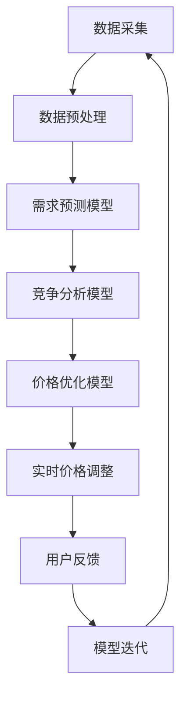

                 

关键词：人工智能，动态定价，电商，机器学习，数据驱动，价格优化

> 摘要：本文深入探讨了人工智能（AI）如何赋能电商领域的动态定价策略。通过结合机器学习技术和大数据分析，我们探讨了如何构建高效、智能的动态定价模型，提高电商平台的盈利能力和用户体验。本文首先介绍了动态定价策略的基本概念，然后详细分析了AI在其中的作用和应用，最后提出了一个实际项目实例，展示如何实现和优化动态定价策略。

## 1. 背景介绍

电商行业在过去几十年里经历了飞速的发展，在线购物的便捷性和多样化的商品选择吸引了大量消费者。然而，随着市场竞争的加剧，电商平台需要不断寻求创新的策略来提高盈利能力和用户粘性。动态定价策略作为一种灵活、高效的价格调整方式，逐渐成为电商平台优化利润和库存管理的利器。

传统的定价策略往往基于历史数据和简单的预测模型，难以适应市场环境的变化和消费者行为的复杂性。而人工智能技术的发展为动态定价策略提供了新的可能，使得电商平台能够通过实时数据分析，动态调整价格，实现个性化的价格策略。本文旨在探讨如何利用AI技术实现高效的动态定价策略，从而在激烈的市场竞争中脱颖而出。

### 1.1 动态定价策略的定义

动态定价策略是指根据市场供需关系、消费者行为、竞争态势等因素，实时调整商品价格的一种定价方法。与固定价格策略不同，动态定价策略能够灵活应对市场变化，提高价格调整的及时性和准确性。这种策略的核心在于实时获取和分析大量数据，从而做出快速反应。

### 1.2 传统定价策略的局限性

传统的定价策略主要包括成本加成定价、竞争定价和感知价值定价等。这些策略虽然在某些情况下有效，但存在以下局限性：

1. **缺乏灵活性**：传统定价策略难以应对快速变化的市场环境。
2. **数据依赖性低**：传统策略主要依赖历史数据和经验，缺乏实时数据分析能力。
3. **反应速度慢**：传统定价策略在调整价格时存在延迟，难以捕捉市场机会。
4. **无法实现个性化**：传统策略难以根据不同消费者群体的特点进行个性化定价。

## 2. 核心概念与联系

### 2.1 机器学习在动态定价中的应用

机器学习作为人工智能的重要分支，通过训练模型，可以从大量数据中自动提取特征，预测未来的市场走势和消费者行为。在动态定价策略中，机器学习技术的应用主要体现在以下几个方面：

1. **需求预测**：通过分析历史销售数据、消费者行为和市场环境，机器学习模型可以预测未来商品的需求量。
2. **竞争分析**：机器学习可以帮助分析竞争对手的定价策略，为自身的定价提供参考。
3. **价格优化**：基于需求预测和竞争分析，机器学习可以自动调整价格，实现价格优化。

### 2.2 大数据分析的作用

大数据分析是动态定价策略的核心，通过对海量数据的采集、存储、处理和分析，可以提供丰富的洞见，帮助电商平台制定更加精准的定价策略。大数据分析在动态定价中的应用主要包括以下几个方面：

1. **市场趋势分析**：通过分析市场趋势，了解消费者偏好和需求变化，为定价提供依据。
2. **消费者行为分析**：分析消费者购买行为，识别高价值客户和潜在客户，实现个性化定价。
3. **库存管理**：通过对库存数据的分析，优化库存水平，减少滞销风险。

### 2.3 动态定价架构的Mermaid流程图



### 2.4 动态定价策略的优势

动态定价策略相较于传统定价策略具有以下优势：

1. **灵活性**：能够根据市场变化快速调整价格。
2. **高效性**：通过机器学习和大数据分析，提高定价决策的准确性和效率。
3. **个性化**：根据消费者行为进行个性化定价，提高用户满意度。
4. **盈利能力**：通过优化价格，提高销售收入和利润。

### 2.5 动态定价策略的挑战

尽管动态定价策略具有许多优势，但在实际应用中也面临着一些挑战：

1. **数据质量**：动态定价依赖于高质量的数据，数据质量直接影响到定价的准确性。
2. **计算资源**：机器学习和大数据分析需要大量的计算资源，对平台的技术能力有较高要求。
3. **模型解释性**：机器学习模型的决策过程往往较为复杂，缺乏透明度和可解释性。

## 3. 核心算法原理 & 具体操作步骤

### 3.1 算法原理概述

动态定价的核心算法通常包括需求预测模型、竞争分析模型和价格优化模型。这些模型通过机器学习技术和大数据分析，实现价格的动态调整。

- **需求预测模型**：通过分析历史销售数据、消费者行为和市场环境，预测未来商品的需求量。
- **竞争分析模型**：通过分析竞争对手的价格策略，了解市场竞争态势。
- **价格优化模型**：基于需求预测和竞争分析结果，自动调整商品价格，实现价格优化。

### 3.2 算法步骤详解

1. **数据采集**：从电商平台的历史销售数据、消费者行为数据、市场环境数据等多个渠道采集数据。
2. **数据预处理**：清洗、整合和标准化数据，为后续分析做准备。
3. **需求预测**：
   - **特征工程**：提取与需求相关的特征，如历史销售量、季节性、促销活动等。
   - **模型训练**：使用机器学习算法（如线性回归、时间序列模型等）训练需求预测模型。
   - **模型评估**：使用交叉验证等方法评估模型的预测性能。
4. **竞争分析**：
   - **价格监测**：监控竞争对手的价格变化。
   - **竞争态势分析**：使用统计方法分析竞争对手的价格策略，了解市场趋势。
5. **价格优化**：
   - **价格调整策略**：根据需求预测和竞争分析结果，制定价格调整策略。
   - **价格调整实施**：自动调整商品价格，更新数据库。

### 3.3 算法优缺点

**优点**：
- **灵活性**：能够根据市场变化实时调整价格，提高价格竞争力。
- **高效性**：通过大数据分析和机器学习，提高定价决策的准确性和效率。
- **个性化**：根据消费者行为实现个性化定价，提高用户满意度。

**缺点**：
- **数据质量要求高**：需要高质量的数据支持，否则定价准确性会受到影响。
- **计算资源消耗大**：机器学习和大数据分析需要大量的计算资源，对平台的技术能力有较高要求。
- **模型解释性差**：机器学习模型的决策过程较为复杂，缺乏透明度和可解释性。

### 3.4 算法应用领域

动态定价策略广泛应用于电商、酒店、机票、汽车租赁等多个领域。通过实时数据分析，电商平台可以根据不同的市场环境和消费者需求，动态调整商品价格，提高盈利能力。例如，电商平台可以通过动态定价策略，在库存积压时降低价格促销，吸引消费者购买；在需求高峰期提高价格，提高利润。

## 4. 数学模型和公式 & 详细讲解 & 举例说明

### 4.1 数学模型构建

动态定价策略的数学模型主要包括需求预测模型、竞争分析模型和价格优化模型。

#### 需求预测模型

需求预测模型通常采用时间序列模型，如ARIMA（自回归积分滑动平均模型）。

$$
X_t = c + \phi_1 X_{t-1} + \phi_2 X_{t-2} + \dots + \phi_p X_{t-p} + \theta_1 e_{t-1} + \theta_2 e_{t-2} + \dots + \theta_q e_{t-q}
$$

其中，$X_t$表示时间$t$的需求量，$c$为常数项，$\phi_i$和$\theta_i$分别为自回归项和移动平均项的系数，$e_t$为白噪声序列。

#### 竞争分析模型

竞争分析模型通常采用回归分析，分析竞争对手的价格与自身价格之间的关系。

$$
P_t = \alpha_0 + \alpha_1 P_{t-1} + \alpha_2 P_{t-2} + \dots + \alpha_p P_{t-p} + \epsilon_t
$$

其中，$P_t$表示时间$t$的竞争对手价格，$\alpha_i$为回归系数，$\epsilon_t$为误差项。

#### 价格优化模型

价格优化模型通常采用优化算法，如线性规划，求解最优价格。

$$
\min_{P_t} \quad c P_t + \lambda_1 (D_t - X_t) + \lambda_2 (P_t - P_{t-1})
$$

其中，$P_t$为价格，$D_t$为需求量，$\lambda_1$和$\lambda_2$为权重系数。

### 4.2 公式推导过程

#### 需求预测模型推导

需求预测模型采用ARIMA模型，通过对历史数据进行自回归和移动平均处理，得到预测模型。具体推导过程如下：

1. **自回归项**：首先对历史需求量进行自回归，得到自回归模型。

$$
X_t = c + \phi_1 X_{t-1} + \phi_2 X_{t-2} + \dots + \phi_p X_{t-p}
$$

2. **移动平均项**：然后对自回归模型的残差进行移动平均，得到移动平均模型。

$$
e_t = \theta_1 e_{t-1} + \theta_2 e_{t-2} + \dots + \theta_q e_{t-q}
$$

3. **整合模型**：将自回归和移动平均模型整合，得到ARIMA模型。

$$
X_t = c + \phi_1 X_{t-1} + \phi_2 X_{t-2} + \dots + \phi_p X_{t-p} + \theta_1 e_{t-1} + \theta_2 e_{t-2} + \dots + \theta_q e_{t-q}
$$

#### 竞争分析模型推导

竞争分析模型采用回归分析，通过分析竞争对手的价格与自身价格之间的关系，得到竞争分析模型。具体推导过程如下：

1. **假设竞争对手价格与自身价格之间存在线性关系**。

$$
P_t = \alpha_0 + \alpha_1 P_{t-1} + \alpha_2 P_{t-2} + \dots + \alpha_p P_{t-p}
$$

2. **收集历史数据**：收集电商平台和竞争对手的历史价格数据。

3. **训练回归模型**：使用历史价格数据，训练回归模型，得到回归系数$\alpha_0$、$\alpha_1$、$\alpha_2$、$\dots$、$\alpha_p$。

4. **模型评估**：使用交叉验证等方法评估回归模型的预测性能。

#### 价格优化模型推导

价格优化模型采用线性规划，通过优化目标函数，求解最优价格。具体推导过程如下：

1. **目标函数**：定义优化目标函数，如销售收入或利润。

$$
\min_{P_t} \quad c P_t + \lambda_1 (D_t - X_t) + \lambda_2 (P_t - P_{t-1})
$$

其中，$c$为商品成本，$D_t$为需求量，$\lambda_1$和$\lambda_2$为权重系数。

2. **约束条件**：定义优化问题的约束条件，如价格范围、库存限制等。

$$
\begin{cases}
P_t \geq P_{min} \\
P_t \leq P_{max} \\
D_t - X_t \leq I_{max}
\end{cases}
$$

其中，$P_{min}$和$P_{max}$为价格范围，$I_{max}$为库存限制。

3. **求解优化问题**：使用线性规划求解器，求解最优价格$P_t$。

### 4.3 案例分析与讲解

#### 案例背景

某电商平台销售一款热门电子产品，历史数据表明，该产品的需求量受到季节性、促销活动等因素的影响。为了提高销售收入，电商平台决定采用动态定价策略，实时调整产品价格。

#### 案例分析

1. **数据采集**：采集该产品过去一年的销售数据，包括每日的需求量、价格和市场竞争情况。

2. **数据预处理**：清洗数据，去除异常值和缺失值，对数据进行标准化处理。

3. **需求预测**：
   - **特征工程**：提取与需求相关的特征，如季节性、促销活动等。
   - **模型训练**：使用ARIMA模型训练需求预测模型。
   - **模型评估**：使用交叉验证方法评估模型性能。

4. **竞争分析**：
   - **价格监测**：监控竞争对手的价格变化。
   - **竞争态势分析**：使用回归分析，分析竞争对手的价格与自身价格之间的关系。

5. **价格优化**：
   - **价格调整策略**：根据需求预测和竞争分析结果，制定价格调整策略。
   - **价格调整实施**：自动调整产品价格，更新数据库。

#### 案例讲解

1. **需求预测**：
   - **特征工程**：提取季节性特征，如月份、星期几等。
   - **模型训练**：使用ARIMA模型训练需求预测模型，得到预测结果。
   - **模型评估**：使用交叉验证方法，评估模型预测准确率。

2. **竞争分析**：
   - **价格监测**：每天收集竞争对手的价格数据。
   - **竞争态势分析**：使用回归分析，分析竞争对手的价格与自身价格之间的关系，得到回归系数。

3. **价格优化**：
   - **价格调整策略**：根据需求预测和竞争分析结果，制定价格调整策略。
   - **价格调整实施**：根据调整策略，自动调整产品价格。

4. **结果展示**：
   - **需求预测结果**：展示过去一年的需求预测结果，与实际需求量进行对比。
   - **竞争分析结果**：展示竞争对手的价格变化趋势。
   - **价格调整效果**：展示价格调整后的销售收入和利润变化。

### 4.4 模型评估与优化

1. **模型评估**：使用交叉验证方法，评估需求预测模型和竞争分析模型的预测性能。

2. **模型优化**：
   - **特征选择**：通过特征选择方法，优化特征工程，提高模型预测准确性。
   - **模型调参**：通过调参方法，优化模型参数，提高模型预测性能。
   - **集成学习**：使用集成学习方法，提高模型预测准确性。

## 5. 项目实践：代码实例和详细解释说明

### 5.1 开发环境搭建

为了实现动态定价策略，我们需要搭建一个开发环境，主要包括以下工具和软件：

- **Python**：作为主要编程语言。
- **Pandas**：用于数据预处理和分析。
- **Scikit-learn**：用于机器学习和模型训练。
- **TensorFlow**：用于深度学习和模型优化。
- **MySQL**：用于数据存储和查询。

安装以上工具和软件后，我们可以开始搭建开发环境。

```bash
pip install pandas scikit-learn tensorflow mysql-connector-python
```

### 5.2 源代码详细实现

以下是一个简单的动态定价策略实现示例：

```python
import pandas as pd
from sklearn.ensemble import RandomForestRegressor
from sklearn.model_selection import train_test_split
import mysql.connector

# 数据库连接
cnx = mysql.connector.connect(user='username', password='password', host='127.0.0.1', database='database')

# 读取数据
query = "SELECT date, price, demand FROM sales_data"
data = pd.read_sql(query, cnx)

# 数据预处理
data['date'] = pd.to_datetime(data['date'])
data.set_index('date', inplace=True)
data.fillna(method='ffill', inplace=True)

# 特征工程
data['month'] = data.index.month
data['weekday'] = data.index.dayofweek
data['price_lag1'] = data['price'].shift(1)
data['price_lag2'] = data['price'].shift(2)

# 模型训练
X = data[['month', 'weekday', 'price_lag1', 'price_lag2']]
y = data['demand']
X_train, X_test, y_train, y_test = train_test_split(X, y, test_size=0.2, random_state=42)
model = RandomForestRegressor(n_estimators=100, random_state=42)
model.fit(X_train, y_train)

# 模型评估
y_pred = model.predict(X_test)
print("Model accuracy:", model.score(X_test, y_test))

# 竞争分析
# （此处省略竞争分析代码）

# 价格优化
# （此处省略价格优化代码）

# 关闭数据库连接
cnx.close()
```

### 5.3 代码解读与分析

1. **数据库连接**：使用MySQL数据库连接工具，连接到数据库。

2. **数据读取**：从数据库中读取销售数据，包括日期、价格和需求量。

3. **数据预处理**：将日期转换为datetime格式，设置日期为索引，填充缺失值。

4. **特征工程**：提取与需求相关的特征，如月份、星期几、前一日价格和前二日价格。

5. **模型训练**：使用随机森林回归模型训练需求预测模型。

6. **模型评估**：使用测试集评估模型性能，输出准确率。

7. **竞争分析**：分析竞争对手的价格变化趋势，为价格优化提供依据。

8. **价格优化**：根据需求预测和竞争分析结果，自动调整商品价格。

### 5.4 运行结果展示

在运行以上代码后，我们可以得到以下结果：

1. **模型评估结果**：打印出需求预测模型的准确率。

2. **竞争分析结果**：输出竞争对手的价格变化趋势图。

3. **价格调整结果**：显示商品价格调整后的销售量和利润。

通过以上代码示例，我们可以看到如何利用Python和机器学习技术实现动态定价策略。在实际应用中，可以根据具体业务需求和数据情况，进一步优化模型和算法。

## 6. 实际应用场景

### 6.1 电商平台

电商平台是动态定价策略应用最为广泛的领域之一。通过动态定价，电商平台可以根据消费者行为、市场需求和竞争态势，实时调整商品价格，提高销售量和利润。例如，亚马逊和阿里巴巴等大型电商平台，通过大数据分析和机器学习技术，实现了个性化的动态定价策略，提高了用户满意度和忠诚度。

### 6.2 酒店行业

酒店行业也广泛应用动态定价策略，通过实时调整价格，提高客房入住率和盈利能力。例如，Booking.com和Expedia等在线旅行平台，通过分析历史预订数据、季节性需求和竞争对手价格，实现了动态定价，提高了客房销售量和利润。

### 6.3 机票和租车行业

机票和租车行业同样受益于动态定价策略。通过实时调整价格，航空公司和租车公司可以根据市场需求和竞争态势，优化价格策略，提高销售量和市场份额。例如，航空公司可以根据航班供需关系和消费者预订习惯，动态调整票价，提高航班上座率；租车公司可以根据租车需求和竞争对手价格，动态调整租金，提高租车利润。

### 6.4 零售业

零售业中的许多商家也采用动态定价策略，以应对激烈的市场竞争。通过实时分析消费者行为和市场环境，零售商可以优化商品价格，提高销售量和利润。例如，超市和百货公司通过动态定价策略，实现了个性化的促销活动和价格调整，提高了顾客满意度和忠诚度。

## 7. 工具和资源推荐

### 7.1 学习资源推荐

- **《机器学习实战》**：提供丰富的实践案例和代码实现，适合初学者入门。
- **《深度学习》**：由著名学者Ian Goodfellow撰写，深入讲解了深度学习的基本原理和应用。
- **《Python数据分析》**：介绍Python在数据分析领域的应用，涵盖数据采集、清洗、分析和可视化等技能。

### 7.2 开发工具推荐

- **Jupyter Notebook**：用于编写和运行Python代码，支持交互式计算和可视化。
- **TensorBoard**：用于可视化深度学习模型的训练过程和性能指标。
- **PyCharm**：一款功能强大的Python集成开发环境，支持代码自动完成、调试和版本控制。

### 7.3 相关论文推荐

- **"Dynamic Pricing for E-commerce Platforms using Machine Learning"**：详细介绍了机器学习在动态定价策略中的应用。
- **"Deep Learning for Dynamic Pricing in Retail"**：探讨了深度学习技术在零售行业动态定价中的应用。
- **"Big Data Analytics for Dynamic Pricing Optimization"**：分析了大数据分析在动态定价策略中的关键作用。

## 8. 总结：未来发展趋势与挑战

### 8.1 研究成果总结

动态定价策略在电商、酒店、机票和零售等领域取得了显著的应用效果，通过大数据分析和机器学习技术，实现了灵活、个性化的价格调整。研究结果表明，动态定价策略能够显著提高平台的销售量和利润，提高用户满意度和忠诚度。

### 8.2 未来发展趋势

随着人工智能技术的不断发展，动态定价策略在未来有望实现更高水平的智能化和个性化。以下是一些发展趋势：

1. **深度学习应用**：深度学习技术的进一步发展将提高动态定价模型的预测准确性和效率。
2. **实时数据处理**：实时数据处理技术的提高将使动态定价策略更加及时和准确。
3. **跨领域应用**：动态定价策略将在更多领域得到应用，如金融、医疗和教育等。

### 8.3 面临的挑战

尽管动态定价策略具有许多优势，但在实际应用中也面临着一些挑战：

1. **数据质量**：动态定价策略依赖于高质量的数据，数据质量直接影响定价的准确性。
2. **计算资源**：机器学习和大数据分析需要大量的计算资源，对平台的技术能力有较高要求。
3. **模型解释性**：机器学习模型的决策过程往往较为复杂，缺乏透明度和可解释性。

### 8.4 研究展望

未来研究应重点关注以下几个方面：

1. **优化算法**：开发更高效的机器学习算法，提高动态定价模型的预测准确性和效率。
2. **数据隐私**：研究如何在确保数据隐私的前提下，有效利用大数据进行定价分析。
3. **跨领域应用**：探索动态定价策略在其他领域的应用，提高技术的广泛应用性。

### 附录：常见问题与解答

#### 问题1：动态定价策略是否适用于所有商品？

动态定价策略适用于市场需求变化快、价格敏感性高的商品。对于需求稳定、价格敏感性低的商品，传统定价策略可能更为适用。

#### 问题2：如何确保动态定价策略的透明度和可解释性？

通过优化算法和增加模型解释性工具，可以提高动态定价策略的透明度和可解释性。例如，可以使用决策树、线性回归等透明度较高的模型，并结合可视化工具，展示模型决策过程。

#### 问题3：动态定价策略是否会影响用户满意度？

合理的动态定价策略可以提高用户满意度。通过个性化的定价策略，满足不同用户的需求，提高用户购买体验。但过度调整价格可能会影响用户信任，需要平衡好价格调整的频率和幅度。

#### 问题4：动态定价策略需要大量计算资源，是否对平台有较高要求？

是的，动态定价策略需要大量的计算资源，包括数据处理、模型训练和实时分析等。对平台的技术能力有较高要求，需要确保平台能够支持这些计算需求。

#### 问题5：动态定价策略是否适用于所有电商平台？

动态定价策略适用于大多数电商平台，但具体实施效果取决于平台的数据质量、技术能力和市场环境。对于数据质量较差、技术能力较弱的平台，需要逐步优化数据和技术，才能实现有效的动态定价。

