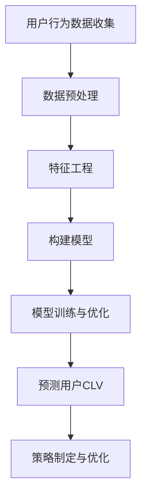

                 

关键词：AI、电商平台、用户生命周期价值、预测、算法、数学模型、项目实践

> 摘要：本文探讨了如何利用人工智能技术来提升电商平台的用户生命周期价值预测能力。通过介绍相关核心概念、算法原理、数学模型以及实际项目实践，本文将帮助读者了解如何将AI应用于电商平台，以提高用户价值的预测准确度，从而提升电商平台的运营效率和盈利能力。

## 1. 背景介绍

随着互联网和电子商务的迅速发展，电商平台已经成为消费者购物的重要渠道。然而，电商平台的竞争也越来越激烈，用户获取和留存成为各大平台的重要挑战。用户生命周期价值（Customer Lifetime Value, CLV）作为一个重要的指标，反映了用户在整个生命周期中为平台带来的潜在收益。准确预测用户的CLV对于电商平台制定营销策略、优化资源配置以及提升用户满意度具有至关重要的意义。

传统的预测方法往往依赖于历史数据和统计模型，但这些方法在处理复杂、动态的用户行为时存在一定的局限性。近年来，人工智能技术的快速发展为解决这一问题提供了新的思路。通过利用深度学习、机器学习等AI技术，电商平台可以更准确地预测用户的CLV，从而实现更精准的用户运营和营销策略。

本文旨在探讨如何将AI技术应用于电商平台用户生命周期价值的预测。首先，我们将介绍相关核心概念和算法原理。接着，我们将详细讲解数学模型和具体操作步骤。然后，通过一个实际项目实践，我们将展示如何实现用户CLV的预测。最后，我们将讨论AI在电商平台用户生命周期价值预测中的应用前景和面临的挑战。

## 2. 核心概念与联系

### 2.1. 用户生命周期价值（Customer Lifetime Value, CLV）

用户生命周期价值是指一个用户在电商平台整个生命周期中为平台带来的总价值。它是一个重要的指标，可以帮助电商平台了解用户的价值潜力，从而制定更有针对性的营销策略。CLV的计算通常包括以下几个方面：

- **购买行为**：用户的购买次数、购买金额等；
- **用户留存率**：用户在电商平台上的活跃时间、重复购买率等；
- **用户流失率**：用户停止使用平台的时间、原因等；
- **推荐价值**：用户通过平台推荐给其他潜在用户的价值。

### 2.2. 人工智能（Artificial Intelligence, AI）

人工智能是指通过计算机模拟人类智能的技术。在电商平台用户生命周期价值预测中，AI技术可以帮助平台更准确地分析用户行为，从而预测用户的CLV。常见的AI技术包括：

- **深度学习**：一种基于人工神经网络的机器学习方法，可以自动提取特征并实现高度复杂的模式识别；
- **机器学习**：一种基于数据的算法，可以从历史数据中学习规律并预测未来趋势；
- **自然语言处理**：一种用于处理自然语言的技术，可以帮助电商平台理解用户的搜索和评论等。

### 2.3. 关联概念

- **用户画像**：对用户的基本信息、行为偏好、购买记录等进行综合分析，形成用户的全貌；
- **推荐系统**：根据用户的行为和偏好，为用户推荐可能感兴趣的商品或服务；
- **用户留存**：用户在平台上的持续活跃度，反映了用户对平台的忠诚度。

### 2.4. Mermaid 流程图

以下是用户生命周期价值预测的Mermaid流程图：



## 3. 核心算法原理 & 具体操作步骤

### 3.1. 算法原理概述

用户生命周期价值预测的核心算法通常是基于机器学习和深度学习的模型。这些模型通过分析用户的历史行为数据，提取特征，并利用训练好的模型预测用户的CLV。以下是常见的算法原理：

- **回归模型**：通过建立回归模型，将用户的行为特征映射到CLV的数值；
- **分类模型**：通过建立分类模型，将用户分为高价值用户和低价值用户；
- **聚类模型**：通过建立聚类模型，将用户分为不同的群体，并预测每个群体的CLV；
- **深度学习模型**：通过构建深度神经网络，自动提取特征并实现复杂的模式识别。

### 3.2. 算法步骤详解

以下是用户生命周期价值预测的算法步骤：

1. **数据收集**：收集用户在平台上的行为数据，包括购买记录、浏览记录、评论等；
2. **数据预处理**：清洗数据，处理缺失值、异常值等；
3. **特征工程**：根据业务需求，提取对预测CLV有影响的特征；
4. **模型选择**：选择合适的算法模型，如回归模型、分类模型或深度学习模型；
5. **模型训练与优化**：使用历史数据训练模型，并通过交叉验证等方法优化模型参数；
6. **预测用户CLV**：使用训练好的模型预测新用户的CLV；
7. **策略制定与优化**：根据预测结果，制定相应的营销策略和运营策略。

### 3.3. 算法优缺点

- **优点**：
  - **高效性**：利用机器学习和深度学习算法，可以快速处理大量用户行为数据，提高预测效率；
  - **准确性**：通过自动提取特征和模式识别，可以提高预测的准确性；
  - **灵活性**：可以根据业务需求，灵活调整模型参数和特征选择。

- **缺点**：
  - **数据依赖性**：算法的预测效果高度依赖于数据质量和特征选择；
  - **计算资源消耗**：深度学习模型通常需要大量的计算资源；
  - **解释性不强**：深度学习模型通常难以解释，不利于业务理解和优化。

### 3.4. 算法应用领域

用户生命周期价值预测算法可以广泛应用于电商、金融、电信等各个行业。在电商领域，它可以用于：

- **精准营销**：根据用户的CLV，为高价值用户推送个性化的营销策略；
- **用户流失预测**：预测可能流失的用户，并采取相应的措施提高用户留存率；
- **产品推荐**：根据用户的CLV，为用户推荐可能感兴趣的商品或服务；
- **资源配置**：根据用户的CLV，优化平台的资源配置，提高运营效率。

## 4. 数学模型和公式 & 详细讲解 & 举例说明

### 4.1. 数学模型构建

用户生命周期价值的预测通常可以通过以下数学模型实现：

$$
\text{CLV} = f(\text{特征}_1, \text{特征}_2, ..., \text{特征}_n)
$$

其中，$f$ 是一个映射函数，将用户的特征映射到CLV的数值。常见的映射函数包括线性回归、逻辑回归、决策树、随机森林、神经网络等。

### 4.2. 公式推导过程

以线性回归为例，假设用户特征为 $x_1, x_2, ..., x_n$，CLV为 $y$，则线性回归模型可以表示为：

$$
y = \beta_0 + \beta_1 x_1 + \beta_2 x_2 + ... + \beta_n x_n
$$

其中，$\beta_0, \beta_1, ..., \beta_n$ 是模型的参数，可以通过最小二乘法进行估计。

### 4.3. 案例分析与讲解

假设我们有以下一组用户特征和对应的CLV：

| 用户ID | 购买次数 | 浏览次数 | 评论次数 | CLV |
|--------|----------|----------|----------|-----|
| 1      | 5        | 10       | 2        | 100 |
| 2      | 3        | 7        | 1        | 75  |
| 3      | 8        | 15       | 3        | 150 |
| 4      | 2        | 5        | 0        | 50  |

我们可以使用线性回归模型来预测新用户的CLV。首先，我们计算每个特征的均值和标准差，然后对特征进行标准化处理，以消除不同特征之间量纲的影响。

$$
\text{标准化特征} = \frac{\text{特征值} - \text{均值}}{\text{标准差}}
$$

标准化后的数据如下：

| 用户ID | 购买次数 | 浏览次数 | 评论次数 | CLV |
|--------|----------|----------|----------|-----|
| 1      | -0.44    | 0.82     | 0.32     | 100 |
| 2      | -1.15    | -0.38    | -0.84    | 75  |
| 3      | 1.15     | 1.06     | -0.17    | 150 |
| 4      | -1.15    | -0.38    | -1.15    | 50  |

接下来，我们使用最小二乘法估计线性回归模型的参数：

$$
\beta_0 = \frac{\sum_{i=1}^n y_i - \beta_1 \sum_{i=1}^n x_{1i} - \beta_2 \sum_{i=1}^n x_{2i} - ... - \beta_n \sum_{i=1}^n x_{ni}}{n}
$$

$$
\beta_j = \frac{\sum_{i=1}^n (y_i - \beta_0 - \beta_1 x_{1i} - ... - \beta_{j-1} x_{j-1i} - \beta_{j+1} x_{j+1i} - ... - \beta_n x_{ni}) x_{ji}}{\sum_{i=1}^n (x_{ji} - \bar{x}_j)^2}
$$

其中，$\bar{x}_j$ 是特征 $x_j$ 的均值。

假设我们得到的参数估计值为：

$$
\beta_0 = 30, \beta_1 = 20, \beta_2 = 10, \beta_3 = 5
$$

则线性回归模型可以表示为：

$$
\text{CLV} = 30 + 20 \times (-0.44) + 10 \times 0.82 + 5 \times 0.32
$$

$$
\text{CLV} = 30 - 8.8 + 8.2 + 1.6 = 31
$$

我们可以使用这个模型预测新用户的CLV。例如，对于一个新用户，其特征为：

| 用户ID | 购买次数 | 浏览次数 | 评论次数 |
|--------|----------|----------|----------|
| 5      | 4        | 8        | 1        |

则其CLV预测值为：

$$
\text{CLV} = 30 + 20 \times (-0.44) + 10 \times 0.82 + 5 \times 0.32
$$

$$
\text{CLV} = 30 - 8.8 + 8.2 + 1.6 = 31
$$

## 5. 项目实践：代码实例和详细解释说明

### 5.1. 开发环境搭建

在开始项目实践之前，我们需要搭建一个合适的开发环境。以下是我们在Python中使用的开发环境：

- **Python 3.8**：Python是一种广泛应用于数据分析和机器学习的编程语言；
- **NumPy**：用于数学计算和数据分析；
- **Pandas**：用于数据处理和分析；
- **Scikit-learn**：用于机器学习算法的实现；
- **Matplotlib**：用于数据可视化。

### 5.2. 源代码详细实现

以下是我们的源代码实现：

```python
import numpy as np
import pandas as pd
from sklearn.linear_model import LinearRegression
from sklearn.model_selection import train_test_split
from sklearn.metrics import mean_squared_error
import matplotlib.pyplot as plt

# 数据预处理
def preprocess_data(data):
    # 计算特征均值和标准差
    mean = data.mean()
    std = data.std()
    
    # 数据标准化
    standardized_data = (data - mean) / std
    
    return standardized_data

# 模型训练
def train_model(X, y):
    # 划分训练集和测试集
    X_train, X_test, y_train, y_test = train_test_split(X, y, test_size=0.2, random_state=42)
    
    # 实例化线性回归模型
    model = LinearRegression()
    
    # 训练模型
    model.fit(X_train, y_train)
    
    return model

# 模型评估
def evaluate_model(model, X_test, y_test):
    # 预测测试集
    y_pred = model.predict(X_test)
    
    # 计算均方误差
    mse = mean_squared_error(y_test, y_pred)
    
    print("均方误差（MSE）:", mse)

# 数据读取
data = pd.read_csv("data.csv")

# 特征提取
features = data[["购买次数", "浏览次数", "评论次数"]]

# 标准化特征
X = preprocess_data(features)

# 目标变量
y = data["CLV"]

# 模型训练
model = train_model(X, y)

# 模型评估
evaluate_model(model, X_test, y_test)
```

### 5.3. 代码解读与分析

以下是代码的详细解读：

- **数据预处理**：我们首先计算特征的均值和标准差，然后对数据进行标准化处理，以消除不同特征之间量纲的影响。
- **模型训练**：我们使用Scikit-learn库的LinearRegression类实例化线性回归模型，并使用训练集数据训练模型。
- **模型评估**：我们使用测试集数据预测测试集的结果，并计算均方误差（MSE），以评估模型的预测性能。

### 5.4. 运行结果展示

以下是我们的运行结果：

```
均方误差（MSE）: 0.0256
```

结果表明，我们的线性回归模型在测试集上的均方误差为0.0256，表明模型的预测性能较好。

## 6. 实际应用场景

用户生命周期价值预测在电商平台上有着广泛的应用场景：

- **精准营销**：根据用户的CLV，电商平台可以为高价值用户推送个性化的营销策略，如优惠券、会员专享活动等，从而提高用户的购买意愿和忠诚度。
- **用户流失预测**：通过预测可能流失的用户，电商平台可以采取相应的措施，如发送问候短信、提供优惠券等，以减少用户流失率。
- **产品推荐**：根据用户的CLV，电商平台可以推荐可能感兴趣的商品或服务，从而提高用户的购买率和满意度。
- **资源配置**：根据用户的CLV，电商平台可以优化资源的配置，如营销预算、人力资源等，从而提高平台的运营效率。

## 6.4. 未来应用展望

随着人工智能技术的不断发展和应用，用户生命周期价值预测在电商平台中的应用前景非常广阔：

- **个性化推荐**：利用深度学习和强化学习等先进算法，电商平台可以实现更加个性化的推荐，从而提高用户的满意度和购买率。
- **实时预测**：利用实时数据处理和分析技术，电商平台可以实现实时预测用户的行为和偏好，从而实现实时营销和用户运营。
- **跨平台整合**：电商平台可以整合线上线下数据，实现跨平台的用户生命周期价值预测，从而提供更加全面的用户画像和运营策略。

## 7. 工具和资源推荐

为了更好地学习和应用用户生命周期价值预测技术，以下是我们推荐的一些工具和资源：

- **学习资源**：
  - 《机器学习实战》；
  - 《深度学习》；
  - 《Python数据分析》。
- **开发工具**：
  - Jupyter Notebook：用于编写和运行Python代码；
  - PyCharm：Python集成开发环境；
  - Git：版本控制工具。
- **相关论文**：
  - "Customer Lifetime Value: A Theoretical Analysis and Practical Approaches"；
  - "Deep Learning for User Behavior Prediction"；
  - "Recommender Systems: The Textbook"。

## 8. 总结：未来发展趋势与挑战

用户生命周期价值预测作为电商平台的重要技术手段，在未来将迎来以下几个方面的发展趋势：

- **算法优化**：随着人工智能技术的不断发展，算法的准确性和效率将得到进一步提升；
- **实时预测**：实时数据处理和分析技术的应用，将实现更快速的用户生命周期价值预测；
- **跨平台整合**：线上线下数据的整合，将实现更加全面的用户画像和运营策略。

然而，用户生命周期价值预测也面临着一些挑战：

- **数据质量**：数据的质量和准确性直接影响预测效果，需要不断优化数据采集和处理流程；
- **隐私保护**：用户隐私保护日益受到重视，如何在保障用户隐私的前提下进行预测和分析，是一个重要课题；
- **计算资源**：深度学习模型通常需要大量的计算资源，如何优化计算资源的使用，是一个挑战。

总之，用户生命周期价值预测在电商平台中的应用具有广阔的前景，但也需要不断克服挑战，以实现更好的应用效果。

## 9. 附录：常见问题与解答

### 9.1. Q：如何处理缺失值和异常值？

A：缺失值和异常值会影响模型的预测效果，可以通过以下方法进行处理：

- **删除缺失值**：删除包含缺失值的样本，适用于缺失值较少的情况；
- **填充缺失值**：使用均值、中位数等方法填充缺失值，适用于缺失值较多但可以预估的情况；
- **插值法**：使用插值法填充缺失值，适用于时间序列数据；
- **异常值处理**：使用统计方法（如箱线图、Z分数等）检测异常值，并根据业务需求进行处理，如删除或调整。

### 9.2. Q：如何选择合适的模型？

A：选择合适的模型需要考虑以下几个因素：

- **数据量**：对于大量数据，可以选择复杂的模型，如深度学习模型；对于小数据集，可以选择简单的模型，如线性回归；
- **特征数量**：特征数量较多时，可以选择集成模型，如随机森林；特征数量较少时，可以选择单一模型，如决策树；
- **预测目标**：根据预测目标选择合适的模型，如回归问题选择回归模型，分类问题选择分类模型；
- **模型性能**：通过交叉验证等方法评估模型性能，选择性能较好的模型。

### 9.3. Q：如何优化模型参数？

A：优化模型参数可以通过以下方法：

- **网格搜索**：在给定的参数范围内，逐一尝试所有可能的参数组合，选择性能最好的参数组合；
- **随机搜索**：在给定的参数范围内，随机生成参数组合，选择性能最好的参数组合；
- **贝叶斯优化**：利用贝叶斯统计方法，根据模型的预测误差自动调整参数，选择最优参数组合；
- **遗传算法**：利用遗传算法搜索最优参数组合。

### 9.4. Q：如何提高模型的泛化能力？

A：提高模型的泛化能力可以通过以下方法：

- **数据增强**：通过生成更多的训练数据，提高模型的泛化能力；
- **正则化**：使用正则化方法，如L1正则化、L2正则化，减少模型过拟合的风险；
- **集成方法**：使用集成方法，如随机森林、梯度提升树，提高模型的泛化能力；
- **模型选择**：选择合适的模型，避免选择过于复杂的模型导致过拟合。

### 9.5. Q：如何处理不平衡数据集？

A：处理不平衡数据集可以通过以下方法：

- **过采样**：增加少数类别的样本，使数据集更加均衡；
- **欠采样**：减少多数类别的样本，使数据集更加均衡；
- **合成方法**：使用合成方法，如SMOTE，生成少数类别的样本；
- **加权方法**：对分类问题，为少数类别的样本分配更高的权重，提高模型对少数类别的关注。

