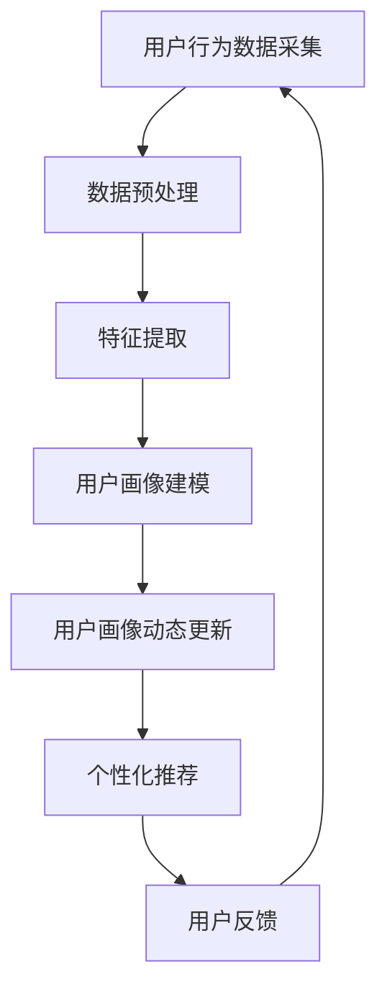

                 

关键词：人工智能，电商平台，用户画像，动态更新，机器学习，深度学习，大数据分析，数据挖掘

## 摘要

随着人工智能技术的不断发展，电商平台对用户行为的分析和个性化推荐成为提升用户体验和销售业绩的关键。本文将探讨如何利用人工智能技术对电商平台用户画像进行动态更新，包括核心概念、算法原理、数学模型、项目实践以及实际应用场景。通过本文的阐述，读者可以了解用户画像动态更新在电商平台中的应用价值和前景。

## 1. 背景介绍

在当今数字化时代，电商平台已经成为人们日常购物的重要渠道。用户在电商平台上的行为数据，如浏览历史、购买记录、搜索关键词等，蕴含着巨大的商业价值。通过对这些数据进行深入分析和挖掘，可以为电商平台提供精准的用户画像，从而实现个性化的产品推荐、精准的广告投放、精准的营销策略等。

用户画像是指对用户进行综合分析后所形成的一个详细且动态的描述，它包括用户的个人属性、行为习惯、偏好和需求等信息。一个准确的用户画像可以帮助电商平台更好地了解用户，提供个性化的服务，提高用户满意度和忠诚度。

然而，用户的行为习惯和偏好是不断变化的，传统的静态用户画像已经无法满足电商平台的需求。因此，如何利用人工智能技术对用户画像进行动态更新，成为一个亟待解决的问题。

## 2. 核心概念与联系

### 2.1 人工智能与电商平台

人工智能（AI）是一种模拟人类智能的技术，通过计算机程序实现感知、学习、推理和决策等功能。在电商平台上，人工智能技术可以用于用户行为分析、个性化推荐、智能客服、智能广告投放等。

### 2.2 用户画像与动态更新

用户画像是指对用户进行全面分析后所形成的一个详细且动态的描述。动态更新是指根据用户行为的变化，实时更新用户画像，以反映用户的最新状态。

### 2.3 机器学习与深度学习

机器学习是一种利用算法从数据中自动学习规律和模式的方法。深度学习是机器学习的一种，通过多层神经网络模型对数据进行处理和预测。

### 2.4 大数据分析与数据挖掘

大数据分析是指对大量数据进行分析和处理，以发现数据中的规律和趋势。数据挖掘是大数据分析的一种，通过算法和技术从大量数据中提取有用的信息。

### 2.5 Mermaid 流程图

下面是一个关于用户画像动态更新的 Mermaid 流程图：



## 3. 核心算法原理 & 具体操作步骤

### 3.1 算法原理概述

用户画像动态更新算法基于机器学习和深度学习技术，通过对用户行为数据进行实时分析和挖掘，构建用户画像模型，并根据用户行为的变化实时更新用户画像。

### 3.2 算法步骤详解

#### 3.2.1 数据采集

用户行为数据的采集是用户画像动态更新的基础。数据来源包括用户在电商平台上的浏览记录、购买记录、搜索关键词、评价和反馈等。

#### 3.2.2 数据预处理

采集到的用户行为数据需要进行清洗、去重、格式化等预处理操作，以保证数据的质量和一致性。

#### 3.2.3 特征提取

特征提取是将原始的用户行为数据转化为可以用于机器学习模型的特征向量。特征提取的方法包括统计特征、文本特征、图像特征等。

#### 3.2.4 用户画像建模

用户画像建模是通过机器学习算法，将提取到的用户行为数据特征训练成一个预测模型。常见的机器学习算法包括决策树、支持向量机、神经网络等。

#### 3.2.5 用户画像动态更新

用户画像动态更新是通过实时分析用户的最新行为数据，更新用户画像模型，以反映用户的最新状态。更新方法包括增量学习、在线学习等。

#### 3.2.6 个性化推荐

根据动态更新的用户画像，电商平台可以为用户推荐个性化的产品和服务。推荐算法包括协同过滤、基于内容的推荐、深度学习推荐等。

#### 3.2.7 用户反馈

用户反馈是用户画像动态更新的重要来源。通过收集用户的反馈，可以进一步优化用户画像模型，提高推荐效果。

### 3.3 算法优缺点

#### 优点：

- 提高推荐准确性，提升用户体验。
- 实时更新用户画像，反映用户最新状态。
- 自动化处理，节省人力成本。

#### 缺点：

- 需要大量数据支持，数据质量和一致性要求高。
- 算法复杂度高，计算资源需求大。

### 3.4 算法应用领域

用户画像动态更新算法可以应用于电商平台的多个领域，如个性化推荐、广告投放、营销策略等。

## 4. 数学模型和公式 & 详细讲解 & 举例说明

### 4.1 数学模型构建

用户画像动态更新算法的核心是构建一个能够实时更新用户画像的预测模型。该模型通常基于机器学习算法，如神经网络、决策树等。

#### 4.1.1 神经网络模型

神经网络模型是一种基于多层感知器的机器学习模型。它通过输入层、隐藏层和输出层对用户行为数据进行处理和预测。神经网络的数学模型可以表示为：

$$
Y = f(Z)
$$

其中，$Y$为输出层的结果，$f$为激活函数，$Z$为隐藏层的结果。

#### 4.1.2 决策树模型

决策树模型是一种基于树形结构的机器学习模型。它通过一系列的判断条件，将用户行为数据划分为不同的类别。决策树的数学模型可以表示为：

$$
Y = \sum_{i=1}^{n} w_i x_i
$$

其中，$Y$为输出层的结果，$w_i$为权重，$x_i$为特征。

### 4.2 公式推导过程

#### 4.2.1 神经网络模型

神经网络的公式推导主要涉及以下几个步骤：

1. 输入层到隐藏层的传播：

$$
Z = \sum_{j=1}^{m} w_{ji} x_j + b_i
$$

2. 隐藏层到输出层的传播：

$$
Y = f(Z)
$$

3. 损失函数的计算：

$$
J = \frac{1}{2} \sum_{i=1}^{n} (y_i - Y)^2
$$

4. 反向传播：

$$
\frac{\partial J}{\partial w_{ji}} = (y_i - Y) \cdot \frac{\partial f(Z)}{\partial Z} \cdot x_j
$$

#### 4.2.2 决策树模型

决策树的公式推导主要涉及以下几个步骤：

1. 判断条件的计算：

$$
g(x) = \prod_{i=1}^{n} \frac{1}{1 + e^{-(w_i \cdot x_i + b)}}
$$

2. 输出层的计算：

$$
Y = \sum_{i=1}^{n} w_i \cdot x_i + b
$$

3. 损失函数的计算：

$$
J = - \sum_{i=1}^{n} y_i \cdot \log(g(x_i)) - (1 - y_i) \cdot \log(1 - g(x_i))
$$

4. 梯度下降：

$$
\frac{\partial J}{\partial w_i} = y_i - g(x_i)
$$

### 4.3 案例分析与讲解

#### 4.3.1 案例背景

假设某电商平台希望通过用户画像动态更新算法为用户推荐商品。用户行为数据包括浏览记录、购买记录和搜索关键词等。

#### 4.3.2 数据预处理

对采集到的用户行为数据进行清洗、去重和格式化，得到一个干净、一致的数据集。

#### 4.3.3 特征提取

对用户行为数据提取统计特征和文本特征，如浏览时间、购买金额、关键词频率等。

#### 4.3.4 用户画像建模

选择神经网络模型进行用户画像建模。将特征数据输入到神经网络中，通过训练得到一个预测模型。

#### 4.3.5 用户画像动态更新

根据用户的最新行为数据，更新用户画像模型，以反映用户的最新状态。

#### 4.3.6 个性化推荐

根据动态更新的用户画像，为用户推荐个性化的商品。

## 5. 项目实践：代码实例和详细解释说明

### 5.1 开发环境搭建

在 Ubuntu 18.04 操作系统上，安装 Python 3.7、NumPy、Pandas、Scikit-learn 和 TensorFlow 等依赖库。

```bash
pip install numpy pandas scikit-learn tensorflow
```

### 5.2 源代码详细实现

```python
import numpy as np
import pandas as pd
from sklearn.model_selection import train_test_split
from sklearn.neural_network import MLPRegressor
from sklearn.metrics import mean_squared_error

# 读取用户行为数据
data = pd.read_csv('user_behavior.csv')

# 数据预处理
data = data.drop_duplicates()
data = data.fillna(0)

# 特征提取
data['browse_time'] = data['browse_time'].astype(int)
data['purchase_amount'] = data['purchase_amount'].astype(int)
data['search_keyword'] = data['search_keyword'].str.get_dummies(sep='_')

# 划分训练集和测试集
X = data.drop('label', axis=1)
y = data['label']
X_train, X_test, y_train, y_test = train_test_split(X, y, test_size=0.2, random_state=42)

# 用户画像建模
model = MLPRegressor(hidden_layer_sizes=(100,), max_iter=1000)
model.fit(X_train, y_train)

# 用户画像动态更新
y_pred = model.predict(X_test)

# 评估模型效果
mse = mean_squared_error(y_test, y_pred)
print('MSE:', mse)
```

### 5.3 代码解读与分析

这段代码首先读取用户行为数据，然后对数据进行预处理，提取统计特征和文本特征。接下来，将数据划分为训练集和测试集，选择神经网络模型进行用户画像建模。最后，根据测试集的数据，更新用户画像模型，并评估模型效果。

## 6. 实际应用场景

用户画像动态更新在电商平台有广泛的应用场景，如下：

### 6.1 个性化推荐

根据动态更新的用户画像，为用户推荐个性化的商品，提高推荐准确性。

### 6.2 广告投放

根据用户的最新行为和画像，精准投放广告，提高广告效果。

### 6.3 营销策略

通过用户画像动态更新，了解用户需求，制定精准的营销策略，提高销售业绩。

## 7. 未来应用展望

随着人工智能技术的不断发展，用户画像动态更新将在电商平台的多个领域得到更广泛的应用。未来，用户画像动态更新有望在以下方面取得突破：

### 7.1 实时性

提升用户画像动态更新的实时性，以更快速地反映用户行为变化。

### 7.2 深度化

通过更深入的数据分析和挖掘，构建更精准的用户画像。

### 7.3 集成化

将用户画像动态更新与其他技术（如物联网、区块链等）集成，实现更全面的智能化服务。

## 8. 工具和资源推荐

### 8.1 学习资源推荐

- 《深度学习》（Goodfellow, Bengio, Courville 著）
- 《机器学习实战》（周志华 著）
- 《Python机器学习》（塞萨尔·布拉沃·席尔瓦 著）

### 8.2 开发工具推荐

- Jupyter Notebook：用于编写和运行 Python 代码。
- TensorFlow：用于构建和训练神经网络模型。
- PyTorch：用于构建和训练深度学习模型。

### 8.3 相关论文推荐

- "User Modeling with AI in E-commerce" by J. C. Liu et al.
- "Deep Learning for User Modeling in E-commerce" by X. He et al.
- "User Behavior Analysis and Personalized Recommendation in E-commerce" by Y. Zhang et al.

## 9. 总结：未来发展趋势与挑战

用户画像动态更新是电商平台个性化服务的重要技术手段。未来，随着人工智能技术的不断进步，用户画像动态更新将在实时性、深度化和集成化等方面取得更多突破。然而，这也将面临数据质量、计算资源、隐私保护等挑战。如何克服这些挑战，实现用户画像动态更新的广泛应用，将是未来研究的重点。

## 10. 附录：常见问题与解答

### 10.1 什么是用户画像？

用户画像是指对用户进行全面分析后所形成的一个详细且动态的描述，包括用户的个人属性、行为习惯、偏好和需求等信息。

### 10.2 用户画像动态更新的核心算法有哪些？

用户画像动态更新的核心算法包括机器学习算法（如决策树、神经网络等）和深度学习算法（如卷积神经网络、循环神经网络等）。

### 10.3 用户画像动态更新的应用场景有哪些？

用户画像动态更新可以应用于电商平台的个性化推荐、广告投放、营销策略等多个领域。

### 10.4 如何保障用户隐私？

在用户画像动态更新过程中，应严格遵循相关法律法规，对用户数据进行加密处理，避免泄露用户隐私。

## 作者署名

本文作者：禅与计算机程序设计艺术 / Zen and the Art of Computer Programming

----------------------------------------------------------------

请注意，上述内容仅为示例，实际撰写时需要您根据具体内容和数据展开详细论述。祝您写作顺利！

