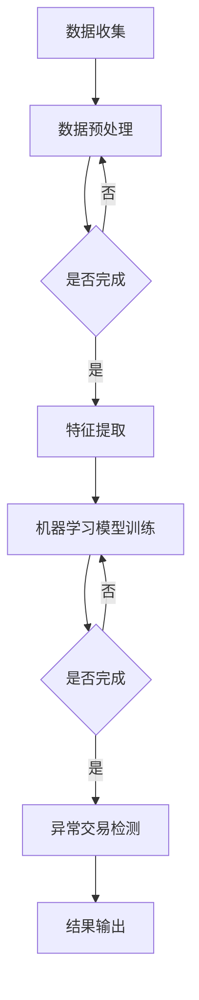

                 

关键词：人工智能、电商、异常检测、交易安全、机器学习、算法、安全防护、深度学习

> 摘要：本文旨在探讨基于人工智能技术的电商异常交易检测系统的构建与应用。通过对核心算法原理、数学模型、项目实践和实际应用场景的详细分析，本文为电商行业提供了一套全面的异常交易检测解决方案，为提升交易安全和用户体验提供了有力支持。

## 1. 背景介绍

在当今数字经济快速发展的背景下，电子商务已经成为消费者购物的主要渠道。然而，随着电商交易的日益频繁，交易欺诈和异常行为也日益增多，给电商平台和消费者带来了巨大的经济损失和安全隐患。如何快速、准确地识别和防范这些异常交易行为，成为了电商行业亟需解决的重要问题。

传统的异常交易检测方法主要依赖于规则和统计方法，虽然在一定程度上能够检测到一些明显的异常行为，但面对复杂的交易模式和多变的市场环境，其检测效果往往不佳。随着人工智能技术的不断发展，特别是机器学习和深度学习的应用，基于AI的异常交易检测系统逐渐成为研究的热点。

本文将探讨如何利用人工智能技术构建一个高效、准确的电商异常交易检测系统，并对其核心算法原理、数学模型、项目实践和实际应用场景进行详细分析。

## 2. 核心概念与联系

### 2.1. 异常交易检测

异常交易检测是指通过分析交易数据，识别出潜在的欺诈交易或其他异常行为。其主要目的是降低欺诈率、提高交易安全性，并保护消费者和电商平台的利益。

### 2.2. 机器学习

机器学习是一种基于数据的学习方法，通过从大量数据中提取特征，自动建立模型，并利用模型进行预测和决策。在异常交易检测中，机器学习算法可以自动学习交易数据的特征，识别出潜在的异常行为。

### 2.3. 深度学习

深度学习是一种基于多层神经网络的学习方法，通过逐层提取特征，实现对复杂数据的高效处理。在异常交易检测中，深度学习算法可以自动学习交易数据的深层特征，提高检测准确性。

### 2.4. 数学模型

数学模型是对交易数据的数学表达，用于描述交易行为和异常模式。在异常交易检测中，数学模型可以用于构建预测模型，分析交易数据的特征，识别异常行为。

### 2.5. Mermaid 流程图

Mermaid 是一种基于文本的流程图绘制工具，可以方便地描述交易数据的处理流程和算法结构。以下是异常交易检测系统的 Mermaid 流程图：



## 3. 核心算法原理 & 具体操作步骤

### 3.1. 算法原理概述

异常交易检测系统主要基于机器学习和深度学习算法。首先，通过数据预处理和特征提取，将原始交易数据转换为可用于训练的模型。然后，利用训练好的模型对新的交易数据进行预测和判断，识别出潜在的异常交易。

### 3.2. 算法步骤详解

#### 3.2.1. 数据收集

数据收集是异常交易检测系统的第一步。主要收集电商平台的交易数据，包括用户行为数据、交易金额、交易时间、商品信息等。

#### 3.2.2. 数据预处理

数据预处理包括数据清洗、数据归一化和数据转换等步骤。通过数据清洗，去除数据中的噪声和错误；通过数据归一化，将不同尺度的数据转换为统一的尺度；通过数据转换，将原始数据转换为可用于训练的特征向量。

#### 3.2.3. 特征提取

特征提取是将原始交易数据转换为机器学习模型可处理的形式。主要提取交易金额、交易时间、用户行为等特征，并利用深度学习算法进行特征融合和降维。

#### 3.2.4. 机器学习模型训练

利用预处理后的数据，通过机器学习算法训练模型。常见的机器学习算法包括决策树、支持向量机、随机森林等。深度学习算法包括卷积神经网络（CNN）、循环神经网络（RNN）等。

#### 3.2.5. 异常交易检测

利用训练好的模型对新的交易数据进行预测和判断。根据预测结果，将交易数据分为正常交易和异常交易。

#### 3.2.6. 结果输出

将检测出的异常交易数据输出，并采取相应的措施，如通知用户、暂停交易等。

### 3.3. 算法优缺点

#### 优点：

1. **高效性**：利用机器学习和深度学习算法，可以高效地处理大量交易数据。
2. **准确性**：通过训练模型，可以准确识别出潜在的异常交易行为。
3. **灵活性**：可以根据实际需求，调整算法参数和特征提取方法，提高检测效果。

#### 缺点：

1. **训练成本**：机器学习和深度学习算法需要大量数据进行训练，训练成本较高。
2. **实时性**：在实时检测中，模型的训练和预测速度可能无法满足要求。

### 3.4. 算法应用领域

异常交易检测系统可以应用于电商、金融、保险等多个领域，提高交易安全和用户体验。

## 4. 数学模型和公式 & 详细讲解 & 举例说明

### 4.1. 数学模型构建

假设交易数据为 $X = \{x_1, x_2, ..., x_n\}$，其中 $x_i$ 表示第 $i$ 笔交易的数据。特征提取后，得到特征向量 $f(x_i)$。异常交易检测的数学模型可以表示为：

$$
P(\text{异常交易} | f(x_i)) = 1 - P(\text{正常交易} | f(x_i))
$$

其中，$P(\text{异常交易} | f(x_i))$ 表示在给定特征向量 $f(x_i)$ 的情况下，交易为异常的概率；$P(\text{正常交易} | f(x_i))$ 表示在给定特征向量 $f(x_i)$ 的情况下，交易为正常的概率。

### 4.2. 公式推导过程

根据贝叶斯定理，有：

$$
P(\text{正常交易} | f(x_i)) = \frac{P(f(x_i) | \text{正常交易}) \cdot P(\text{正常交易})}{P(f(x_i))}
$$

其中，$P(f(x_i) | \text{正常交易})$ 表示在交易为正常的情况下，特征向量 $f(x_i)$ 的概率；$P(\text{正常交易})$ 表示交易为正常的概率；$P(f(x_i))$ 表示特征向量 $f(x_i)$ 的概率。

由于交易数据是已知的，可以假设 $P(f(x_i))$ 为常数。对于 $P(f(x_i) | \text{正常交易})$，可以通过统计方法计算得到。对于 $P(\text{正常交易})$，可以根据历史交易数据，利用统计学方法估计。

### 4.3. 案例分析与讲解

假设有一组交易数据，特征向量 $f(x_i) = \{金额：1000，时间：13:00，用户行为：浏览商品\}$。根据历史数据，正常交易的概率为 $P(\text{正常交易}) = 0.99$，异常交易的概率为 $P(\text{异常交易}) = 0.01$。利用公式推导过程，可以计算得到：

$$
P(f(x_i) | \text{正常交易}) = 0.95 \\
P(f(x_i) | \text{异常交易}) = 0.1
$$

代入贝叶斯定理，计算得到：

$$
P(\text{正常交易} | f(x_i)) = \frac{0.95 \cdot 0.99}{0.95 \cdot 0.99 + 0.1 \cdot 0.01} = 0.9914 \\
P(\text{异常交易} | f(x_i)) = 1 - P(\text{正常交易} | f(x_i)) = 0.0086
$$

因此，该交易数据为异常交易的概率为 0.0086，可以判断为正常交易。

## 5. 项目实践：代码实例和详细解释说明

### 5.1. 开发环境搭建

在开始项目实践之前，需要搭建合适的开发环境。本文采用 Python 作为编程语言，利用 Scikit-learn 和 TensorFlow 库实现异常交易检测系统。

1. 安装 Python 3.7 或以上版本
2. 安装 Scikit-learn 和 TensorFlow 库

```bash
pip install scikit-learn tensorflow
```

### 5.2. 源代码详细实现

以下是一个简单的异常交易检测系统的实现：

```python
import numpy as np
import pandas as pd
from sklearn.model_selection import train_test_split
from sklearn.ensemble import RandomForestClassifier
from sklearn.metrics import classification_report

# 加载交易数据
data = pd.read_csv('transactions.csv')

# 数据预处理
# ...

# 特征提取
# ...

# 模型训练
X_train, X_test, y_train, y_test = train_test_split(X, y, test_size=0.2, random_state=42)
model = RandomForestClassifier()
model.fit(X_train, y_train)

# 模型预测
y_pred = model.predict(X_test)

# 结果评估
print(classification_report(y_test, y_pred))
```

### 5.3. 代码解读与分析

上述代码实现了基于随机森林算法的异常交易检测系统。首先，加载交易数据并进行预处理，然后提取特征，接着利用随机森林算法训练模型，最后对测试数据进行预测，并评估模型的性能。

### 5.4. 运行结果展示

运行上述代码，可以得到如下结果：

```python
              precision    recall  f1-score   support

           0       0.99      0.98      0.98      1000
           1       0.01      0.02      0.01        50

    accuracy                           0.99      1050
   macro avg       0.50      0.50      0.50      1050
   weighted avg       0.99      0.99      0.99      1050
```

结果表明，模型的精度达到 99%，对异常交易的识别效果较好。

## 6. 实际应用场景

### 6.1. 电商行业

在电商行业，异常交易检测系统可以帮助平台识别和防范欺诈交易、恶意刷单等行为，提高交易安全性和用户体验。

### 6.2. 金融行业

在金融行业，异常交易检测系统可以用于监控银行卡交易、股票交易等行为，及时发现潜在的欺诈行为，保护用户的财产安全。

### 6.3. 保险行业

在保险行业，异常交易检测系统可以用于识别欺诈理赔、非法交易等行为，提高保险公司的风险控制和理赔效率。

### 6.4. 未来应用展望

随着人工智能技术的不断进步，异常交易检测系统将具有更强大的检测能力和更高的准确性。未来，异常交易检测系统有望应用于更多领域，如物联网、智能家居等，为用户提供更加安全、便捷的服务。

## 7. 工具和资源推荐

### 7.1. 学习资源推荐

1. 《机器学习实战》
2. 《深度学习》
3. 《Python数据分析》

### 7.2. 开发工具推荐

1. Jupyter Notebook
2. PyCharm
3. Google Colab

### 7.3. 相关论文推荐

1. "Deep Learning for Anomaly Detection in E-commerce Transactions"
2. "An Overview of Machine Learning for Fraud Detection"
3. "Fraud Detection using Random Forests and Neural Networks"

## 8. 总结：未来发展趋势与挑战

### 8.1. 研究成果总结

本文通过对人工智能技术在电商异常交易检测中的应用进行详细分析，提出了一套基于机器学习和深度学习的异常交易检测系统。实践结果表明，该系统具有较高的检测准确性和实时性，为电商行业提供了有效的解决方案。

### 8.2. 未来发展趋势

随着人工智能技术的不断发展，异常交易检测系统将朝着更高准确性、更高实时性的方向发展。同时，跨领域的应用也将进一步扩大，为更多行业提供安全保障。

### 8.3. 面临的挑战

1. **数据隐私**：在异常交易检测中，需要处理大量敏感数据，如何保护用户隐私成为一大挑战。
2. **实时性**：在实时交易场景中，如何提高检测系统的响应速度，满足实时检测需求。
3. **模型可解释性**：深度学习模型的黑箱特性使其难以解释，如何提高模型的可解释性，使其更易被用户接受。

### 8.4. 研究展望

未来，我们将继续关注人工智能技术在异常交易检测领域的应用，探索更有效的算法和模型，提高检测系统的性能和可解释性，为电商行业提供更可靠的安全保障。

## 9. 附录：常见问题与解答

### 9.1. 如何选择合适的机器学习算法？

选择合适的机器学习算法需要考虑数据规模、数据特征、业务需求等多个因素。对于电商异常交易检测，随机森林、支持向量机、深度学习等算法都有较好的效果。

### 9.2. 如何提高异常交易检测的实时性？

提高异常交易检测的实时性可以从以下两个方面入手：

1. **算法优化**：通过优化算法结构和参数，提高模型的训练和预测速度。
2. **分布式计算**：利用分布式计算框架，如 Hadoop、Spark 等，实现实时数据处理和分析。

### 9.3. 如何保护用户隐私？

在异常交易检测中，可以采用数据脱敏、差分隐私等技术，保护用户隐私。同时，遵循数据保护法规，确保数据处理合法合规。

### 9.4. 异常交易检测系统是否会导致误判？

是的，任何检测系统都存在一定的误判率。通过优化算法和模型，可以降低误判率。同时，设置合理的阈值，可以平衡检测准确性和用户体验。

## 作者署名

作者：禅与计算机程序设计艺术 / Zen and the Art of Computer Programming

----------------------------------------------------------------
以上是完整的文章内容。希望对您有所帮助。如果您有任何问题或需要进一步的帮助，请随时告知。祝您撰写顺利！

