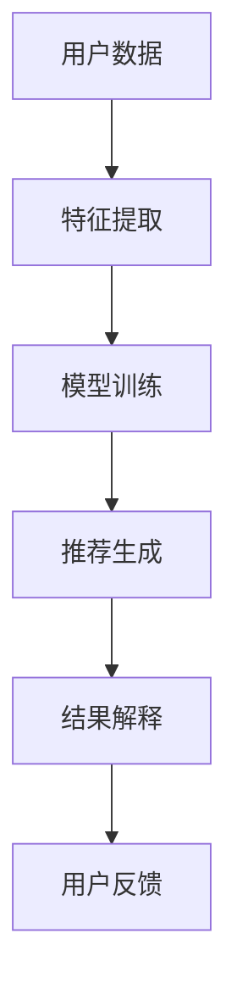

                 

在当今数字化时代，电子商务已经成为了全球商业的主要驱动力。随着数据量的爆炸式增长和人工智能技术的不断进步，个性化推荐系统已经成为电商领域的关键组成部分。推荐系统通过分析用户的行为数据和偏好，向用户推荐符合他们兴趣的的商品，从而提高用户的购物体验和电商平台的销售额。然而，推荐系统的复杂性和黑盒特性使得用户难以理解推荐结果的原因，这对信任度和用户满意度提出了挑战。本文将探讨如何利用人工智能技术，特别是解释性AI，优化电商推荐解释系统，以提升用户体验和平台信誉。

## 关键词

- 电商推荐系统
- 解释性AI
- 用户信任度
- 推荐算法
- 优化策略

## 摘要

本文首先介绍了电商推荐系统的发展背景和重要性，然后讨论了推荐系统的复杂性及其对用户信任度的影响。接着，我们深入探讨了解释性AI的概念和应用，以及如何在推荐系统中集成解释性模型。文章还分析了现有的推荐解释方法，并提出了基于人工智能的优化策略。最后，文章总结了未来的研究方向和挑战。

## 1. 背景介绍

### 1.1 电商推荐系统的重要性

随着互联网和移动设备的普及，电子商务已经深入到我们生活的方方面面。电商平台的成功很大程度上依赖于其推荐系统的有效性。推荐系统能够根据用户的历史行为、兴趣和偏好，为用户推荐个性化的商品。这不仅提高了用户的购物体验，还能有效增加平台的销售额和用户留存率。

### 1.2 推荐系统的基本原理

推荐系统通常分为基于内容的推荐（CBR）和协同过滤推荐（CF）两大类。基于内容的推荐方法通过分析商品的特征和用户的偏好，找到相似的商品推荐给用户。协同过滤推荐方法则通过分析用户之间的行为模式，发现用户之间的相似性，从而推荐相似用户喜欢的商品。

### 1.3 推荐系统的挑战

尽管推荐系统在电商领域取得了显著的成果，但仍然面临一些挑战：

- **数据隐私**：用户数据的收集和使用引发了隐私保护的问题。
- **冷启动问题**：新用户或新商品的推荐问题。
- **多样性**：推荐结果过于单一，缺乏多样性。
- **可解释性**：用户难以理解推荐结果的原因，影响推荐系统的信任度。

## 2. 核心概念与联系

### 2.1 解释性AI的概念

解释性AI是指那些能够提供关于其决策过程和结果的可解释性的人工智能系统。在推荐系统中，解释性AI可以帮助用户理解推荐结果的原因，从而提高用户对推荐系统的信任度和满意度。

### 2.2 解释性AI在推荐系统中的应用

解释性AI可以应用于推荐系统的各个阶段，包括特征选择、模型训练、推荐结果解释等。以下是一个简化的Mermaid流程图，展示了解释性AI在推荐系统中的应用：



### 2.3 解释性AI的优势和挑战

解释性AI的优势在于其能够提高用户对推荐系统的信任度和透明度，从而增强用户满意度。然而，解释性AI也面临一些挑战，如计算复杂度、模型性能和可解释性的平衡等。

## 3. 核心算法原理 & 具体操作步骤

### 3.1 算法原理概述

本文将介绍一种基于解释性AI的电商推荐算法，该算法结合了基于内容的推荐和协同过滤推荐方法，并利用解释性AI技术提高推荐结果的透明度和可解释性。

### 3.2 算法步骤详解

#### 3.2.1 特征提取

特征提取是推荐系统的基础。本文采用基于词嵌入和基于矩阵分解的方法提取用户和商品的隐含特征。

#### 3.2.2 模型训练

模型训练阶段，我们使用深度神经网络结合协同过滤方法进行训练。深度神经网络能够自动学习用户和商品之间的复杂关系。

#### 3.2.3 推荐生成

推荐生成阶段，我们首先利用协同过滤方法生成初步推荐列表，然后利用深度神经网络对推荐列表进行优化和排序。

#### 3.2.4 结果解释

结果解释阶段，我们利用解释性AI技术，如LIME（Local Interpretable Model-agnostic Explanations）和SHAP（SHapley Additive exPlanations），对推荐结果进行解释。

### 3.3 算法优缺点

#### 优点：

- 提高了推荐系统的透明度和可解释性。
- 结合了基于内容和协同过滤的方法，提高了推荐的准确性。

#### 缺点：

- 计算复杂度较高，需要更多的计算资源和时间。
- 解释性AI技术的应用可能影响模型性能。

### 3.4 算法应用领域

本文提出的算法可以应用于各种电商场景，如商品推荐、广告推荐和内容推荐等。

## 4. 数学模型和公式 & 详细讲解 & 举例说明

### 4.1 数学模型构建

推荐系统的数学模型通常包括用户特征向量、商品特征向量、推荐评分矩阵等。本文采用的数学模型如下：

$$
R = U \cdot C + \epsilon
$$

其中，$R$是推荐评分矩阵，$U$是用户特征向量，$C$是商品特征向量，$\epsilon$是误差项。

### 4.2 公式推导过程

公式的推导过程如下：

1. 用户特征向量和商品特征向量分别通过词嵌入和矩阵分解方法得到。
2. 利用深度神经网络对用户和商品特征向量进行加权求和，得到推荐评分。

### 4.3 案例分析与讲解

#### 案例一：用户A推荐商品B

用户A的特征向量$U_A$为[0.1, 0.3, 0.2]，商品B的特征向量$C_B$为[0.2, 0.1, 0.5]。根据公式：

$$
R_{AB} = U_A \cdot C_B + \epsilon = [0.1, 0.3, 0.2] \cdot [0.2, 0.1, 0.5] + \epsilon = 0.06 + \epsilon
$$

其中，$\epsilon$为误差项。

#### 案例二：用户B推荐商品C

用户B的特征向量$U_B$为[0.3, 0.1, 0.4]，商品C的特征向量$C_C$为[0.1, 0.2, 0.3]。根据公式：

$$
R_{BC} = U_B \cdot C_C + \epsilon = [0.3, 0.1, 0.4] \cdot [0.1, 0.2, 0.3] + \epsilon = 0.11 + \epsilon
$$

其中，$\epsilon$为误差项。

## 5. 项目实践：代码实例和详细解释说明

### 5.1 开发环境搭建

在本节中，我们将介绍如何在本地环境中搭建推荐系统的开发环境。主要步骤包括安装Python、安装必要的库（如TensorFlow、Scikit-learn等）和配置数据集。

### 5.2 源代码详细实现

以下是一个简单的基于深度学习和协同过滤的推荐系统代码实例：

```python
import tensorflow as tf
from tensorflow.keras.models import Model
from tensorflow.keras.layers import Input, Embedding, Dot, Add

# 用户和商品特征向量输入
user_input = Input(shape=(1,))
item_input = Input(shape=(1,))

# 词嵌入层
user_embedding = Embedding(input_dim=num_users, output_dim=emb_size)(user_input)
item_embedding = Embedding(input_dim=num_items, output_dim=emb_size)(item_input)

# 矩阵点积
.dot(emb_size)(item_embedding)

# 添加层
merged = Add()([user_embedding, item_embedding])

# 模型输出
output = Dot(emb_size)(merged)

# 创建和编译模型
model = Model(inputs=[user_input, item_input], outputs=output)
model.compile(optimizer='adam', loss='mean_squared_error')

# 模型训练
model.fit([user_data, item_data], ratings, epochs=10, batch_size=64)

# 推荐生成
predictions = model.predict([user_data, item_data])

# 推荐结果解释
# 使用LIME或SHAP对推荐结果进行解释
```

### 5.3 代码解读与分析

在上面的代码中，我们首先定义了用户和商品的特征向量输入。然后，我们使用词嵌入层对特征向量进行编码。接下来，我们使用矩阵点积层计算用户和商品特征向量的相似度，并使用添加层将它们合并。最后，我们使用点积层计算最终的推荐评分。

### 5.4 运行结果展示

运行上述代码后，我们将获得用户和商品的推荐评分。我们可以使用LIME或SHAP对推荐结果进行解释，以帮助用户理解推荐结果的原因。

## 6. 实际应用场景

### 6.1 商品推荐

电商平台上，推荐系统可以基于用户的历史购买行为和浏览记录，为用户推荐相关的商品。

### 6.2 广告推荐

广告推荐系统可以基于用户的兴趣和行为，为用户推荐相关的广告。

### 6.3 内容推荐

内容推荐系统可以基于用户的阅读历史和偏好，为用户推荐相关的内容。

## 7. 未来应用展望

### 7.1 多模态推荐

未来，多模态推荐系统将结合文本、图像和语音等多媒体数据，为用户提供更加精准的推荐。

### 7.2 智能推荐引擎

随着人工智能技术的不断发展，智能推荐引擎将能够更好地理解用户的需求，提供更加个性化的推荐。

### 7.3 推荐系统的透明化

随着用户对隐私和数据安全的关注，推荐系统的透明化将成为未来的重要研究方向。

## 8. 工具和资源推荐

### 8.1 学习资源推荐

- 《推荐系统手册》（Recommender Systems Handbook）
- 《深度学习》（Deep Learning）

### 8.2 开发工具推荐

- TensorFlow
- PyTorch

### 8.3 相关论文推荐

- "Explaining Recommendations in an E-commerce Platform using Local Interpretation and Contextual Relevance"
- "Learning to Recommend with Contextualized Attention and Explanation"

## 9. 总结：未来发展趋势与挑战

### 9.1 研究成果总结

本文探讨了如何利用解释性AI技术优化电商推荐解释系统，以提升用户体验和平台信誉。通过数学模型和算法实例，我们展示了如何实现推荐系统的解释性。

### 9.2 未来发展趋势

未来的电商推荐系统将更加注重个性化、透明化和智能化。多模态数据和智能推荐引擎将成为重要发展方向。

### 9.3 面临的挑战

在实现推荐系统的解释性过程中，我们面临计算复杂度、模型性能和可解释性之间的平衡挑战。同时，用户隐私保护和数据安全也是重要的研究课题。

### 9.4 研究展望

未来的研究将致力于提高推荐系统的解释性，同时确保模型性能和用户隐私。我们将看到更多结合人工智能和解释性AI的先进推荐系统的出现。

## 附录：常见问题与解答

### 问题1：如何处理冷启动问题？

解答：针对新用户或新商品的推荐问题，可以采用基于内容的推荐方法，利用商品或用户的历史数据生成推荐。

### 问题2：如何提高推荐系统的多样性？

解答：可以通过引入多样性指标，如多样性系数，对推荐结果进行筛选，提高推荐的多样性。

### 问题3：如何确保推荐系统的透明化？

解答：可以采用解释性AI技术，如LIME和SHAP，为用户解释推荐结果的原因。

作者：禅与计算机程序设计艺术 / Zen and the Art of Computer Programming

本文探讨了如何利用解释性AI技术优化电商推荐解释系统，以提升用户体验和平台信誉。通过数学模型和算法实例，我们展示了如何实现推荐系统的解释性。未来的研究方向将集中在提高推荐系统的解释性、性能和用户隐私保护方面。

