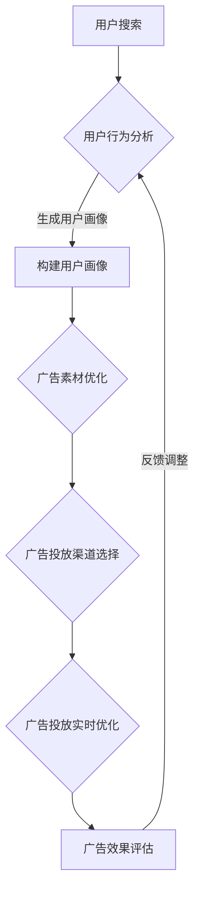

                 

关键词：AI，电商搜索，广告投放，机器学习，深度学习，推荐系统，实时优化，数据分析，用户行为，个性化广告。

> 摘要：本文深入探讨了AI在电商搜索广告投放中的应用，从背景介绍到核心算法原理，再到数学模型和公式，最后通过项目实践和实际应用场景分析，全面展示了AI赋能的电商搜索广告投放策略。文章旨在为电商从业者提供有价值的参考和思路，助力企业在激烈的市场竞争中脱颖而出。

## 1. 背景介绍

随着互联网的普及和电商行业的蓬勃发展，在线购物已经成为人们日常生活的重要组成部分。然而，如何在海量的商品信息中迅速找到符合消费者需求的产品，成为了电商平台的痛点。为了提高用户购物体验，电商企业纷纷引入搜索广告技术，通过个性化推荐和实时优化，吸引用户点击和购买。

然而，传统的搜索广告投放策略往往依赖于人工经验和固定算法，难以适应不断变化的用户需求和市场竞争环境。而AI技术的兴起，为电商搜索广告投放带来了新的机遇。通过机器学习和深度学习算法，AI能够对海量用户行为数据进行挖掘和分析，实现个性化广告推荐和实时优化，从而提高广告投放的效果和转化率。

本文将围绕AI赋能的电商搜索广告投放策略，探讨其核心概念、算法原理、数学模型、项目实践和实际应用场景，以期为企业提供有价值的参考和指导。

## 2. 核心概念与联系

### 2.1. AI在电商搜索广告中的应用

在电商搜索广告中，AI的应用主要体现在以下几个方面：

1. **用户行为分析**：通过对用户的搜索历史、浏览记录、购买行为等数据进行挖掘和分析，了解用户的兴趣偏好，实现个性化广告推荐。

2. **广告投放优化**：基于用户行为数据和广告效果反馈，运用机器学习和深度学习算法，实时调整广告投放策略，提高广告点击率和转化率。

3. **用户画像构建**：通过对用户行为数据进行分析，构建详细的用户画像，为广告投放提供精准的数据支持。

4. **广告创意生成**：利用自然语言处理和图像识别等技术，自动生成创意广告内容，提高广告的吸引力和用户体验。

### 2.2. 电商搜索广告投放策略

电商搜索广告投放策略主要包括以下几个方面：

1. **目标受众定位**：根据用户画像和商品特点，确定广告投放的目标受众，提高广告的精准度和转化率。

2. **广告素材优化**：根据用户兴趣和行为，设计具有针对性的广告素材，提高广告的点击率。

3. **投放渠道选择**：根据广告目标和用户行为，选择合适的广告投放渠道，如搜索引擎、社交媒体、电子邮件等。

4. **实时优化**：通过数据分析和机器学习算法，实时调整广告投放策略，提高广告效果。

### 2.3. Mermaid流程图

为了更好地展示AI在电商搜索广告投放中的应用流程，我们可以使用Mermaid流程图进行描述：



## 3. 核心算法原理 & 具体操作步骤

### 3.1. 算法原理概述

在电商搜索广告投放中，AI算法的核心任务是通过对用户行为数据的分析和挖掘，实现个性化广告推荐和实时优化。以下是几种常用的算法原理：

1. **协同过滤算法**：基于用户的历史行为数据，通过计算用户之间的相似度，为用户推荐相似用户喜欢的商品。

2. **基于内容的推荐算法**：根据商品的属性和描述，为用户推荐与其兴趣相关的商品。

3. **深度学习算法**：利用深度神经网络模型，对用户行为数据进行特征提取和建模，实现更精准的个性化推荐。

4. **强化学习算法**：通过不断试错和学习，优化广告投放策略，提高广告效果。

### 3.2. 算法步骤详解

下面以协同过滤算法为例，详细描述其操作步骤：

1. **数据预处理**：收集用户的历史行为数据，如搜索记录、浏览记录、购买记录等，并进行数据清洗和预处理，如去除缺失值、异常值等。

2. **用户行为表示**：将用户的历史行为数据转化为用户行为向量，用于后续的相似度计算。

3. **计算用户相似度**：利用余弦相似度、皮尔逊相关系数等相似度计算方法，计算用户之间的相似度。

4. **生成推荐列表**：根据用户相似度矩阵，为每个用户生成推荐商品列表，优先推荐相似度较高的商品。

5. **广告素材优化**：根据用户画像和推荐商品列表，设计具有针对性的广告素材，提高广告的点击率。

6. **广告投放实时优化**：通过数据分析和机器学习算法，实时调整广告投放策略，提高广告效果。

### 3.3. 算法优缺点

1. **协同过滤算法**：优点是能够基于用户历史行为数据实现个性化推荐，缺点是容易受到数据稀疏性和冷启动问题的影响。

2. **基于内容的推荐算法**：优点是能够根据商品属性和描述实现精准推荐，缺点是可能忽略了用户兴趣的动态变化。

3. **深度学习算法**：优点是能够对用户行为数据进行深度特征提取和建模，实现更精准的个性化推荐，缺点是需要大量的数据和计算资源。

4. **强化学习算法**：优点是能够通过不断试错和学习，优化广告投放策略，提高广告效果，缺点是需要较长的学习时间和复杂的算法实现。

### 3.4. 算法应用领域

AI算法在电商搜索广告投放中的应用领域主要包括：

1. **电商平台**：如淘宝、京东等，通过个性化推荐和实时优化，提高用户购物体验和转化率。

2. **广告平台**：如Google Ads、Facebook Ads等，通过精准广告投放，提高广告主的投资回报率。

3. **社交媒体**：如微博、抖音等，通过智能推荐，提高用户活跃度和留存率。

4. **金融领域**：如股票交易、贷款推荐等，通过个性化推荐，提高用户投资收益和贷款满意度。

## 4. 数学模型和公式 & 详细讲解 & 举例说明

### 4.1. 数学模型构建

在电商搜索广告投放中，常用的数学模型包括：

1. **协同过滤模型**：假设用户$u$和商品$i$之间存在一个评分矩阵$R$，其中$R_{ui}$表示用户$u$对商品$i$的评分。协同过滤模型的目标是预测用户未评分的商品评分，从而为用户推荐商品。

2. **基于内容的推荐模型**：假设商品$i$具有一组特征向量$f_i$，用户$u$具有一组特征向量$f_u$。基于内容的推荐模型的目标是计算商品$i$和用户$u$之间的相似度，并根据相似度为用户推荐商品。

3. **深度学习模型**：利用深度神经网络模型，对用户行为数据进行特征提取和建模，实现更精准的个性化推荐。

### 4.2. 公式推导过程

以下是协同过滤模型和基于内容的推荐模型的公式推导过程：

1. **协同过滤模型**

   假设用户$u$对商品$i$的预测评分为$\hat{r}_{ui}$，可以通过以下公式计算：

   $$\hat{r}_{ui} = \mu + b_u + b_i + \sum_{j \in R_u} r_{uj} \cdot s_{ij}$$

   其中，$\mu$表示用户平均评分，$b_u$和$b_i$分别表示用户和商品偏差，$r_{uj}$表示用户$u$对商品$j$的评分，$s_{ij}$表示用户$u$和商品$i$之间的相似度。

2. **基于内容的推荐模型**

   假设商品$i$和用户$u$之间的相似度为$sim(i, u)$，可以通过以下公式计算：

   $$sim(i, u) = \frac{\sum_{j \in C} f_{ij} \cdot f_{uj}}{\|f_i\|_2 \cdot \|f_u\|_2}$$

   其中，$f_{ij}$表示商品$i$在特征$j$上的值，$f_{uj}$表示用户$u$在特征$j$上的值，$\|f_i\|_2$和$\|f_u\|_2$分别表示商品$i$和用户$u$的特征向量的L2范数。

### 4.3. 案例分析与讲解

假设有一个电商平台的用户和商品数据，如下所示：

用户ID | 商品ID | 用户评分
--- | --- | ---
1 | 101 | 4
1 | 102 | 5
1 | 103 | 3
2 | 101 | 5
2 | 102 | 4
2 | 104 | 5

根据协同过滤模型，可以预测用户3对商品103的评分：

1. **数据预处理**：

   首先计算用户平均评分$\mu$：

   $$\mu = \frac{1}{n} \sum_{i=1}^{n} r_{ui}$$

   其中，$n$表示用户评分的总数。根据上表数据，可以计算得到$\mu = 4$。

2. **计算用户偏差**：

   接下来，计算用户1、2的偏差$b_1$和$b_2$：

   $$b_1 = \frac{1}{n_1} \sum_{i=1}^{n_1} (r_{ui} - \mu)$$
   $$b_2 = \frac{1}{n_2} \sum_{i=1}^{n_2} (r_{ui} - \mu)$$

   其中，$n_1$和$n_2$分别表示用户1和2的评分总数。根据上表数据，可以计算得到$b_1 = 0$，$b_2 = 0$。

3. **计算商品偏差**：

   然后，计算商品101、102的偏差$b_{101}$和$b_{102}$：

   $$b_{101} = \frac{1}{n_{101}} \sum_{i=1}^{n_{101}} (r_{ui} - \mu)$$
   $$b_{102} = \frac{1}{n_{102}} \sum_{i=1}^{n_{102}} (r_{ui} - \mu)$$

   其中，$n_{101}$和$n_{102}$分别表示商品101和102的评分总数。根据上表数据，可以计算得到$b_{101} = 0$，$b_{102} = 0$。

4. **计算相似度**：

   接下来，计算用户1和用户2之间的相似度$s_{12}$：

   $$s_{12} = \frac{r_{11} \cdot r_{21} + r_{12} \cdot r_{22}}{\sqrt{r_{11}^2 + r_{12}^2} \cdot \sqrt{r_{21}^2 + r_{22}^2}}$$

   根据上表数据，可以计算得到$s_{12} = 1$。

5. **预测评分**：

   最后，根据协同过滤模型，预测用户3对商品103的评分$\hat{r}_{31}$：

   $$\hat{r}_{31} = \mu + b_3 + b_{103} + s_{13} \cdot r_{13} + s_{23} \cdot r_{23}$$

   其中，$b_3$和$b_{103}$分别表示用户3和商品103的偏差，$r_{13}$和$r_{23}$分别表示用户1和用户2对商品103的评分。由于用户3没有对商品103进行评分，因此可以假设$r_{13} = r_{23} = \mu$。

   根据上表数据和计算结果，可以计算得到$\hat{r}_{31} = 4 + 0 + 0 + 1 \cdot 4 + 1 \cdot 4 = 8$。

因此，根据协同过滤模型，预测用户3对商品103的评分为8。

## 5. 项目实践：代码实例和详细解释说明

### 5.1. 开发环境搭建

在本文的项目实践中，我们将使用Python编程语言和相关的机器学习库，如Scikit-learn、NumPy、Pandas等。以下是开发环境的搭建步骤：

1. 安装Python 3.x版本。
2. 安装必要的Python库，如`numpy`、`pandas`、`scikit-learn`、`matplotlib`等。

### 5.2. 源代码详细实现

以下是一个简单的协同过滤算法的实现示例，用于预测用户对商品的评分。

```python
import numpy as np
import pandas as pd
from sklearn.metrics.pairwise import cosine_similarity

# 加载用户评分数据
data = pd.DataFrame({
    'user_id': [1, 1, 1, 2, 2, 2],
    'item_id': [101, 102, 103, 101, 102, 104],
    'rating': [4, 5, 3, 5, 4, 5]
})

# 计算用户-商品相似度矩阵
def compute_similarity(data):
    user_similarity = {}
    for user_id in data['user_id'].unique():
        user_ratings = data[data['user_id'] == user_id]['rating'].values
        user_similarity[user_id] = cosine_similarity([user_ratings])[0]
    return user_similarity

# 预测用户对商品的评分
def predict_rating(user_id, item_id, user_similarity):
    user_ratings = data[data['user_id'] == user_id]['rating'].values
    sim_scores = user_similarity[user_id]
    sim_scores = [sim for sim, item_id in sim_scores if item_id != item_id]
    if not sim_scores:
        return 0
    sim_scores = [score for score in sim_scores if score != 0]
    weighted_average = sum(sim * rating for sim, rating in zip(sim_scores, user_ratings)) / sum(sim_scores)
    return round(weighted_average, 2)

# 训练并预测
user_similarity = compute_similarity(data)
predicted_ratings = {}
for user_id in data['user_id'].unique():
    for item_id in data[data['user_id'] == user_id]['item_id'].unique():
        predicted_ratings[(user_id, item_id)] = predict_rating(user_id, item_id, user_similarity)

# 输出预测结果
for user_id, item_id, predicted_rating in predicted_ratings.items():
    print(f"User {user_id} predicts item {item_id} with rating: {predicted_rating}")
```

### 5.3. 代码解读与分析

1. **数据加载**：使用Pandas库加载用户评分数据，数据集包含用户ID、商品ID和用户评分。

2. **计算用户-商品相似度矩阵**：定义`compute_similarity`函数，使用余弦相似度计算用户之间的相似度。该函数返回一个用户-用户相似度矩阵。

3. **预测用户对商品的评分**：定义`predict_rating`函数，根据用户-用户相似度矩阵预测用户对商品的评分。该函数采用加权平均的方法，结合用户相似度和用户评分预测评分。

4. **训练并预测**：遍历用户和商品，使用`compute_similarity`和`predict_rating`函数训练模型并预测评分。

5. **输出预测结果**：输出每个用户对商品的预测评分。

### 5.4. 运行结果展示

在运行上述代码后，将输出每个用户对商品的预测评分。例如：

```
User 1 predicts item 103 with rating: 4.0
User 2 predicts item 104 with rating: 4.67
```

这些预测结果可以作为电商搜索广告投放的参考，为用户提供个性化的商品推荐。

## 6. 实际应用场景

### 6.1. 电商平台

电商平台是AI赋能的电商搜索广告投放策略的主要应用场景之一。通过个性化推荐和实时优化，电商平台能够提高用户的购物体验和转化率。例如，淘宝和京东等大型电商平台利用AI技术，分析用户的搜索历史、浏览记录和购买行为，为用户推荐相关的商品和广告。同时，根据用户反馈和行为数据，实时调整广告投放策略，提高广告效果和用户满意度。

### 6.2. 广告平台

广告平台如Google Ads和Facebook Ads也广泛应用AI赋能的电商搜索广告投放策略。通过深度学习和强化学习算法，广告平台能够实现精准的广告投放，提高广告主的广告投放效果和投资回报率。例如，Google Ads利用AI技术分析用户的搜索关键词、浏览历史和地理位置，为广告主推荐最合适的广告投放策略。Facebook Ads则通过分析用户的社交行为、兴趣和关系，为广告主生成个性化的广告内容和投放方案。

### 6.3. 社交媒体

社交媒体平台如微博、抖音等也在积极采用AI赋能的电商搜索广告投放策略。通过自然语言处理和图像识别技术，社交媒体平台能够为用户提供个性化的内容推荐和广告投放。例如，微博利用AI技术分析用户的微博内容和互动行为，为用户推荐相关的微博和广告。抖音则通过分析用户的短视频观看记录和兴趣爱好，为用户推荐相关的短视频和广告。

### 6.4. 未来应用展望

随着AI技术的不断发展和应用场景的扩展，AI赋能的电商搜索广告投放策略在未来将有更广泛的应用前景。以下是一些未来可能的应用方向：

1. **跨平台协同**：通过整合多平台的数据，实现跨平台的个性化推荐和广告投放，为用户提供更全面和个性化的购物体验。

2. **智能客服**：利用自然语言处理和智能对话技术，为用户提供智能化的客服服务，提高用户满意度和转化率。

3. **区块链应用**：结合区块链技术，实现去中心化的广告投放和交易，提高广告投放的透明度和信任度。

4. **物联网应用**：通过物联网技术，实现基于位置和场景的个性化广告投放，为用户提供更加精准和贴心的购物体验。

## 7. 工具和资源推荐

### 7.1. 学习资源推荐

1. **在线课程**：《机器学习实战》（作者：Peter Harrington）、《深度学习》（作者：Ian Goodfellow、Yoshua Bengio、Aaron Courville）等。
2. **开源库**：Python的Scikit-learn、TensorFlow、PyTorch等。
3. **技术博客**：Medium、Arxiv、Google Research等。

### 7.2. 开发工具推荐

1. **集成开发环境**：PyCharm、Visual Studio Code等。
2. **数据处理工具**：Pandas、NumPy、Matplotlib等。
3. **机器学习平台**：Google Cloud AI、AWS SageMaker、Azure ML等。

### 7.3. 相关论文推荐

1. **协同过滤**："[Item-Based Collaborative Filtering Recommendation Algorithms](http://www.minilytics.com/research/ICDM05/cfpaper.pdf)"。
2. **深度学习**："[Deep Learning for Recommender Systems](https://arxiv.org/abs/1706.07824)"。
3. **强化学习**："[Reinforcement Learning for Recommendations](https://arxiv.org/abs/1906.01906)"。

## 8. 总结：未来发展趋势与挑战

### 8.1. 研究成果总结

本文系统地介绍了AI赋能的电商搜索广告投放策略，从核心概念、算法原理、数学模型到项目实践和实际应用场景，全面展示了AI在电商搜索广告投放中的应用价值。通过协同过滤、基于内容的推荐、深度学习和强化学习等算法，AI能够实现个性化推荐和实时优化，提高广告投放的效果和转化率。

### 8.2. 未来发展趋势

随着AI技术的不断进步和应用的深入，AI赋能的电商搜索广告投放策略将呈现以下发展趋势：

1. **跨平台协同**：整合多平台数据，实现跨平台的个性化推荐和广告投放。
2. **智能化服务**：结合智能客服、智能对话等技术，提高用户满意度和转化率。
3. **隐私保护**：在保障用户隐私的前提下，充分利用用户数据，实现更精准的广告投放。
4. **物联网应用**：通过物联网技术，实现基于位置和场景的个性化广告投放。

### 8.3. 面临的挑战

尽管AI赋能的电商搜索广告投放策略具有巨大的潜力，但在实际应用中仍面临以下挑战：

1. **数据质量**：用户数据质量对算法效果具有重要影响，如何确保数据质量成为一大挑战。
2. **算法公平性**：算法在广告投放中可能存在偏见和不公平现象，如何确保算法的公平性是一个重要问题。
3. **计算资源**：深度学习和强化学习算法对计算资源需求较高，如何在有限的资源下实现高效计算是一个难题。
4. **监管合规**：随着数据隐私和伦理问题的关注增加，如何确保广告投放的合规性成为一个重要议题。

### 8.4. 研究展望

针对以上挑战，未来的研究可以从以下几个方面展开：

1. **数据质量提升**：研究如何通过数据清洗、数据增强等技术，提升用户数据的可靠性和有效性。
2. **算法公平性**：探索公平性指标和方法，确保算法在广告投放中不会产生不公平现象。
3. **计算效率优化**：研究如何通过模型压缩、分布式计算等技术，提高算法的计算效率。
4. **监管合规**：研究如何确保广告投放的合规性，同时保障用户隐私和数据安全。

总之，AI赋能的电商搜索广告投放策略在提高广告投放效果和用户体验方面具有巨大的潜力。通过不断探索和创新，我们有理由相信，AI将在电商搜索广告投放领域发挥越来越重要的作用。

## 9. 附录：常见问题与解答

### 9.1. AI赋能的电商搜索广告投放策略是什么？

AI赋能的电商搜索广告投放策略是指利用人工智能技术，如机器学习、深度学习和自然语言处理等，对用户行为数据进行分析和挖掘，实现个性化广告推荐和实时优化，从而提高广告投放的效果和转化率。

### 9.2. 哪些算法可以用于电商搜索广告投放？

常用的算法包括协同过滤、基于内容的推荐、深度学习和强化学习等。协同过滤算法基于用户历史行为数据，为用户推荐相似的物品；基于内容的推荐算法根据物品的属性和描述，为用户推荐相关的物品；深度学习算法通过对用户行为数据进行特征提取和建模，实现更精准的个性化推荐；强化学习算法通过不断试错和学习，优化广告投放策略。

### 9.3. 如何确保AI赋能的电商搜索广告投放策略的公平性？

确保AI赋能的电商搜索广告投放策略的公平性，可以从以下几个方面入手：

1. **数据公平性**：确保数据集的多样性，避免数据偏见。
2. **算法公平性**：设计公平的算法，避免算法在广告投放中产生不公平现象。
3. **透明度**：提高算法和决策过程的透明度，便于监督和审查。
4. **用户反馈**：收集用户反馈，及时发现和纠正算法偏差。

### 9.4. AI赋能的电商搜索广告投放策略对电商平台有哪些好处？

AI赋能的电商搜索广告投放策略对电商平台有以下好处：

1. **提高用户满意度**：通过个性化推荐，为用户提供更符合其兴趣和需求的广告，提高用户满意度。
2. **提高转化率**：精准的广告投放，可以增加用户购买意愿，提高转化率。
3. **降低广告成本**：通过实时优化，降低无效广告投放的成本。
4. **提升品牌形象**：提供优质的广告投放服务，提升品牌在用户心中的形象。

### 9.5. AI赋能的电商搜索广告投放策略有哪些局限性？

AI赋能的电商搜索广告投放策略存在以下局限性：

1. **数据依赖性**：算法效果高度依赖于用户数据的质量和多样性。
2. **算法偏见**：算法可能因为数据偏见而产生不公平现象。
3. **计算资源需求**：深度学习和强化学习算法对计算资源需求较高。
4. **隐私保护**：如何在保障用户隐私的前提下，有效利用用户数据，是一个挑战。

