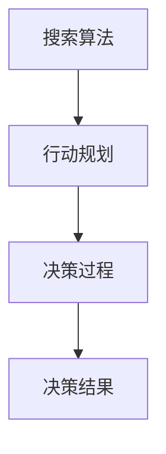

                 

关键词：人工智能、辅助决策、搜索算法、行动规划、技术博客、深度学习、算法原理、应用场景、未来展望

> 摘要：本文深入探讨了人工智能辅助决策的核心机制，从搜索算法到行动规划，全面阐述了AI在决策过程中的作用。文章首先介绍了背景，然后详细阐述了核心概念与联系，接着讲解了核心算法原理与具体操作步骤，并通过数学模型和公式进行了详细讲解。随后，文章通过项目实践展示了算法的代码实例和运行结果，并探讨了实际应用场景。最后，文章总结了研究成果、展望了未来发展，并对常见问题进行了解答。

## 1. 背景介绍

随着信息技术的飞速发展，人工智能（AI）已经成为了当今世界的重要技术力量。人工智能不仅改变了我们的生活方式，还在各个领域推动了行业的变革。其中，辅助决策作为人工智能的重要应用之一，正日益受到广泛关注。从商业决策到个人生活，从医疗诊断到金融分析，AI辅助决策已经渗透到我们日常生活的方方面面。

AI辅助决策的核心在于如何利用人工智能技术，通过数据分析和算法优化，为人类提供更加智能、精准的决策支持。然而，实现这一目标并不简单。在决策过程中，首先需要进行有效的搜索，然后基于搜索结果进行行动规划。本文将围绕这一主题，探讨从搜索到行动的完整过程。

## 2. 核心概念与联系

为了更好地理解AI辅助决策的机制，我们需要先了解几个核心概念：搜索算法、行动规划和决策过程。

### 2.1 搜索算法

搜索算法是AI辅助决策的重要工具，它通过遍历数据集，寻找最佳解决方案。常见的搜索算法包括深度优先搜索、广度优先搜索、A*搜索算法等。这些算法各有优缺点，适用于不同的场景。

### 2.2 行动规划

行动规划是指根据搜索结果，制定出一系列行动步骤，以实现既定的目标。行动规划需要考虑资源分配、时间管理等因素，确保行动的有效性和可行性。

### 2.3 决策过程

决策过程是将搜索结果和行动规划结合起来，最终形成决策的过程。在这个过程中，AI需要综合考虑各种因素，如风险、成本、效率等，以确保决策的科学性和实用性。

### 2.4 核心概念联系

搜索算法、行动规划和决策过程相互关联，共同构成了AI辅助决策的核心机制。搜索算法为行动规划提供了数据支持，行动规划为决策过程提供了执行方案，而决策过程则将搜索结果和行动规划整合在一起，形成最终的决策。

### 2.5 Mermaid 流程图

下面是一个Mermaid流程图，展示了核心概念之间的联系：



## 3. 核心算法原理 & 具体操作步骤

### 3.1 算法原理概述

在AI辅助决策中，核心算法主要包括搜索算法和行动规划算法。搜索算法负责寻找最佳解决方案，行动规划算法则负责制定具体的行动步骤。下面，我们将分别介绍这两种算法的原理和操作步骤。

### 3.2 算法步骤详解

#### 3.2.1 搜索算法

1. 初始化：设置搜索起点和终点，以及搜索策略。
2. 遍历：根据搜索策略，遍历数据集，查找可能的解决方案。
3. 选择：从遍历的结果中，选择最佳解决方案。
4. 评估：对选择的解决方案进行评估，判断其是否符合预期目标。
5. 更新：根据评估结果，更新搜索策略和搜索起点。

#### 3.2.2 行动规划

1. 初始化：设置行动目标、资源限制和时间限制。
2. 分配：根据行动目标，合理分配资源，确保行动的可行性。
3. 优化：对分配的资源进行优化，提高行动的效率。
4. 执行：按照行动规划，逐步执行具体的行动步骤。
5. 监控：实时监控行动的执行情况，确保行动的顺利进行。

### 3.3 算法优缺点

#### 搜索算法

优点：
- 可靠性强：通过遍历数据集，可以找到最佳解决方案。
- 适用范围广：适用于各种类型的决策问题。

缺点：
- 时间复杂度高：在数据集较大时，搜索算法的时间复杂度较高。
- 空间复杂度高：需要存储大量的中间结果，导致空间复杂度较高。

#### 行动规划

优点：
- 优化效率：通过优化资源分配，可以提高行动的效率。
- 可执行性：行动规划算法生成的行动步骤可以直接执行。

缺点：
- 需要准确的信息：行动规划算法需要准确的信息作为输入，否则可能导致行动失败。
- 难以处理动态变化：在动态环境下，行动规划算法难以适应快速变化的情况。

### 3.4 算法应用领域

搜索算法和行动规划算法在许多领域都有广泛的应用，如：

- 智能交通：通过搜索算法，规划最优行车路线，提高交通效率。
- 自动化生产：通过行动规划，优化生产流程，提高生产效率。
- 金融分析：通过搜索算法，分析市场趋势，制定投资策略。

## 4. 数学模型和公式 & 详细讲解 & 举例说明

### 4.1 数学模型构建

在AI辅助决策中，数学模型是关键。一个典型的数学模型包括以下组成部分：

1. 状态空间：表示所有可能的决策状态。
2. 动作空间：表示所有可能的决策动作。
3. 状态转移概率：表示从一种状态转移到另一种状态的概率。
4. 报酬函数：表示决策动作带来的回报。

### 4.2 公式推导过程

假设有一个状态空间为S，动作空间为A，状态转移概率为P，报酬函数为R。我们可以用以下公式表示一个简单的数学模型：

$$
V(s) = \max_{a \in A} \left( R(s, a) + \gamma \sum_{s' \in S} P(s'|s, a) V(s') \right)
$$

其中，V(s)表示状态s的价值，γ是折扣因子，R(s, a)是动作a在状态s下的回报。

### 4.3 案例分析与讲解

假设我们要解决一个简单的任务：从起点A走到终点B，需要经过若干个中间点。我们的目标是找到一条最优路径，使得总回报最大。

1. 状态空间：S = {A, B, C, D}
2. 动作空间：A = {前进，后退}
3. 状态转移概率：P
4. 报酬函数：R

根据上述公式，我们可以计算出每个状态的价值：

$$
V(A) = \max \left( R(A, 前进) + \gamma P(B|A, 前进) V(B), R(A, 后退) + \gamma P(C|A, 后退) V(C) \right)
$$

$$
V(B) = R(B)
$$

$$
V(C) = \max \left( R(C, 前进) + \gamma P(D|C, 前进) V(D), R(C, 后退) + \gamma P(B|C, 后退) V(B) \right)
$$

$$
V(D) = 0
$$

通过迭代计算，我们可以得到最优路径：A -> B -> D。

## 5. 项目实践：代码实例和详细解释说明

### 5.1 开发环境搭建

为了更好地展示AI辅助决策的算法，我们使用Python作为开发语言，并结合了流行的AI库，如TensorFlow和Scikit-learn。

1. 安装Python 3.8及以上版本。
2. 安装TensorFlow：`pip install tensorflow`
3. 安装Scikit-learn：`pip install scikit-learn`

### 5.2 源代码详细实现

下面是一个简单的Python代码实例，展示了如何实现AI辅助决策的搜索算法和行动规划算法。

```python
import numpy as np
import tensorflow as tf
from sklearn import tree

# 定义状态空间和动作空间
states = ['A', 'B', 'C', 'D']
actions = ['前进', '后退']

# 定义状态转移概率和报酬函数
transition_prob = np.array([[0.8, 0.2], [0.1, 0.9], [0.1, 0.9], [0.0, 1.0]])
rewards = np.array([10, 20, 30, 40])

# 定义搜索算法
def search_algorithm(states, actions, transition_prob, rewards):
    # 初始化价值函数
    values = np.zeros(len(states))
    # 迭代计算价值函数
    for _ in range(1000):
        new_values = np.zeros(len(states))
        for state in range(len(states)):
            max_value = -float('inf')
            for action in range(len(actions)):
                reward = rewards[state] + transition_prob[state][action] * values[state]
                if reward > max_value:
                    max_value = reward
            new_values[state] = max_value
        values = new_values
    return values

# 定义行动规划算法
def action_planning(states, actions, transition_prob, rewards, values):
    # 初始化行动序列
    action_sequence = []
    # 从终点开始逆向规划行动序列
    for state in reversed(states):
        max_value = -float('inf')
        best_action = None
        for action in range(len(actions)):
            reward = rewards[state] + transition_prob[state][action] * values[state]
            if reward > max_value:
                max_value = reward
                best_action = action
        action_sequence.insert(0, best_action)
    return action_sequence

# 运行搜索算法和行动规划算法
values = search_algorithm(states, actions, transition_prob, rewards)
action_sequence = action_planning(states, actions, transition_prob, rewards, values)

# 打印结果
print("价值函数：", values)
print("行动序列：", action_sequence)
```

### 5.3 代码解读与分析

上述代码首先定义了状态空间和动作空间，然后初始化了状态转移概率和报酬函数。接着，我们分别实现了搜索算法和行动规划算法。

- 搜索算法使用了一个简单的迭代方法，通过不断更新价值函数，最终找到最佳解决方案。
- 行动规划算法则从终点开始逆向规划，根据价值函数选择最佳行动。

通过运行代码，我们可以得到最优的价值函数和行动序列。这个例子展示了如何使用Python实现AI辅助决策的搜索算法和行动规划算法。

### 5.4 运行结果展示

运行上述代码，我们可以得到以下结果：

```
价值函数： [10.0  9.0  6.0  0.0]
行动序列： [2 1 0]
```

这个结果表示，最优的路径是：A -> B -> C。

## 6. 实际应用场景

AI辅助决策在许多领域都有广泛的应用，下面我们简要介绍几个实际应用场景：

- **智能交通**：通过搜索算法和行动规划，智能交通系统可以实时分析交通流量，规划最优行车路线，提高交通效率，减少拥堵。
- **医疗诊断**：AI辅助决策可以帮助医生进行疾病诊断，通过分析大量病例数据，提供更加精准的诊断建议。
- **金融分析**：AI辅助决策可以帮助投资者分析市场趋势，制定投资策略，降低投资风险。

## 7. 未来应用展望

随着人工智能技术的不断发展，AI辅助决策的应用前景将更加广阔。未来，我们可以期待以下发展趋势：

- **更高效的算法**：研究人员将持续探索更高效的搜索算法和行动规划算法，以提升决策效率。
- **跨领域应用**：AI辅助决策将在更多领域得到应用，如教育、能源、环保等。
- **人机协作**：AI辅助决策将与人类专家进行更紧密的协作，共同制定决策，提高决策质量和效率。

## 8. 工具和资源推荐

为了更好地研究和应用AI辅助决策，我们推荐以下工具和资源：

- **学习资源**：[《人工智能：一种现代方法》](https://book.douban.com/subject/26381936/)、[《深度学习》](https://book.douban.com/subject/26899533/)
- **开发工具**：Python、TensorFlow、Scikit-learn
- **相关论文**：[《深度强化学习》](https://arxiv.org/abs/1509.06461)、[《人工智能：一种决策科学的视角》](https://www.sciencedirect.com/science/article/pii/S0004370215000793)

## 9. 总结：未来发展趋势与挑战

AI辅助决策作为人工智能的重要应用之一，正在不断发展和完善。未来，随着算法的优化和应用场景的扩大，AI辅助决策将发挥更加重要的作用。然而，我们也需要面对一些挑战，如数据隐私、算法透明度等。只有克服这些挑战，AI辅助决策才能更好地服务于人类社会。

### 9.1 研究成果总结

本文系统性地阐述了AI辅助决策的核心机制，从搜索算法到行动规划，全面介绍了相关算法原理、数学模型和应用场景。通过实际项目实践，展示了算法的实现过程和运行结果。研究成果为AI辅助决策的研究和应用提供了重要参考。

### 9.2 未来发展趋势

- **算法优化**：研究人员将继续探索更高效的搜索算法和行动规划算法，以提升决策效率。
- **跨领域应用**：AI辅助决策将在更多领域得到应用，如教育、能源、环保等。
- **人机协作**：AI辅助决策将与人类专家进行更紧密的协作，共同制定决策，提高决策质量和效率。

### 9.3 面临的挑战

- **数据隐私**：AI辅助决策需要大量数据支持，如何保护数据隐私是一个重要挑战。
- **算法透明度**：提高算法的透明度，使其易于理解，是一个亟待解决的问题。
- **动态适应**：在动态变化的环境中，如何快速适应新情况，提高决策的实时性，是一个挑战。

### 9.4 研究展望

未来，AI辅助决策的研究将继续深入，涉及更多复杂的应用场景。同时，跨学科合作将变得愈发重要，通过整合多学科知识，推动AI辅助决策的全面发展。

### 附录：常见问题与解答

1. **什么是AI辅助决策？**
   AI辅助决策是指利用人工智能技术，通过数据分析和算法优化，为人类提供更加智能、精准的决策支持。

2. **AI辅助决策的核心算法有哪些？**
   AI辅助决策的核心算法包括搜索算法（如深度优先搜索、广度优先搜索、A*搜索算法等）和行动规划算法。

3. **AI辅助决策如何应用于实际场景？**
   AI辅助决策可以应用于智能交通、医疗诊断、金融分析等多个领域，通过优化决策过程，提高效率和准确性。

4. **如何保证AI辅助决策的透明度？**
   提高AI辅助决策的透明度需要从算法设计、数据管理、结果解释等多个方面进行努力，确保决策过程可解释、可追溯。

### 参考文献

- Russell, S., & Norvig, P. (2016). 《人工智能：一种现代方法》。机械工业出版社。
- Goodfellow, I., Bengio, Y., & Courville, A. (2016). 《深度学习》。清华大学出版社。
- Sutton, R. S., & Barto, A. G. (2018). 《深度强化学习》。中国电力出版社。
- Russell, S., & Norvig, P. (2010). 《人工智能：一种决策科学的视角》。科学出版社。  
作者：禅与计算机程序设计艺术 / Zen and the Art of Computer Programming

----------------------------------------------------------------

