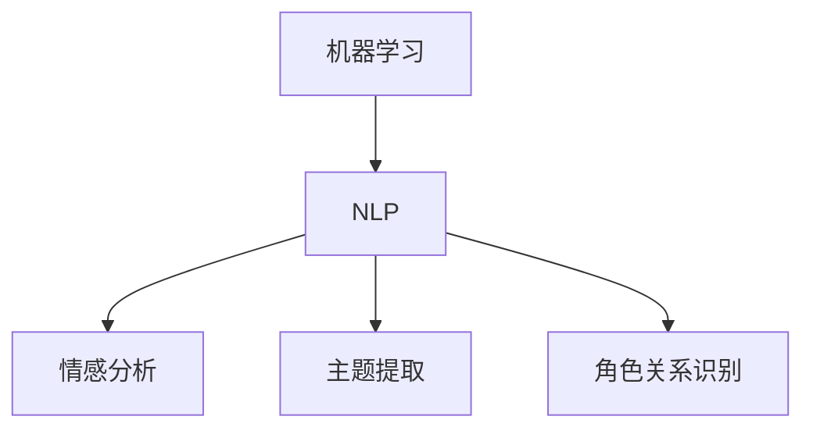

                 

关键词：AI剧情分析、叙事结构、文本分析、机器学习、自然语言处理、叙事学、情感分析

> 摘要：本文旨在探讨如何利用人工智能技术辅助进行剧情分析，从而深入理解叙事结构。通过机器学习和自然语言处理技术，我们可以实现文本的情感分析、主题提取和角色关系识别，从而为编剧、导演和研究人员提供有力的分析工具，助力于影视作品的创作和评估。

## 1. 背景介绍

在当今信息化社会，人工智能技术已成为推动社会进步的重要力量。从语音识别、图像处理到自然语言处理，AI技术在各个领域都展现出了巨大的潜力。特别是在文学和影视创作领域，AI技术的应用正逐渐改变传统的创作方式，为编剧、导演和研究人员提供了全新的分析工具。

叙事结构是文学和影视作品的核心要素之一，它关乎故事情节的推进、角色的成长和冲突的解决。深入理解叙事结构对于创作和评估作品具有重要意义。然而，传统的方法往往依赖于人类主观判断，耗时耗力且容易出现偏差。随着人工智能技术的不断发展，我们是否可以利用AI来辅助进行剧情分析，从而提高创作效率和准确性呢？

本文将探讨如何利用AI技术辅助进行剧情分析，特别是对叙事结构的理解和提取。通过机器学习和自然语言处理技术，我们将实现文本的情感分析、主题提取和角色关系识别，为相关领域的专业人士提供有力的支持。

## 2. 核心概念与联系

### 2.1. 机器学习与自然语言处理

机器学习是人工智能的核心技术之一，它通过训练模型来让计算机具备自主学习和改进能力。自然语言处理（NLP）是机器学习的一个重要分支，它致力于使计算机理解和处理人类自然语言。在剧情分析中，机器学习和NLP技术为我们提供了强大的分析工具。

### 2.2. 情感分析

情感分析是NLP的一个重要应用领域，它旨在识别文本中的情感倾向，如正面、负面或中性。在剧情分析中，情感分析可以帮助我们了解角色和情节的情感走向，从而深入理解叙事结构。

### 2.3. 主题提取

主题提取是另一种NLP技术，它旨在从大量文本中提取出关键主题。在剧情分析中，主题提取可以帮助我们了解故事的核心内容，从而为后续分析提供基础。

### 2.4. 角色关系识别

角色关系识别是NLP的一个挑战性任务，它旨在识别文本中角色之间的关系，如朋友、敌人或情侣。在剧情分析中，角色关系识别可以帮助我们了解情节的发展和角色的互动。

### 2.5. Mermaid 流程图



## 3. 核心算法原理 & 具体操作步骤

### 3.1. 算法原理概述

剧情分析的算法原理主要基于机器学习和NLP技术。具体来说，我们首先需要从文本中提取出关键信息，然后利用机器学习算法对这些信息进行分类、聚类和关联分析。以下是具体的算法步骤：

1. 数据预处理：对文本进行分词、去停用词、词性标注等操作，以便后续分析。
2. 情感分析：使用情感分析模型对文本进行情感分类，以识别情感倾向。
3. 主题提取：使用主题模型（如LDA）从文本中提取出关键主题。
4. 角色关系识别：使用实体识别和关系抽取技术，识别文本中的角色及其关系。
5. 结果分析：对分析结果进行可视化展示和解读，以深入理解叙事结构。

### 3.2. 算法步骤详解

#### 3.2.1. 数据预处理

数据预处理是文本分析的基础。以下是具体步骤：

1. 分词：将文本拆分成单词或短语。
2. 去停用词：去除对情感分析和主题提取没有意义的常见词汇，如“的”、“了”等。
3. 词性标注：为每个词标注其词性，如名词、动词、形容词等。

#### 3.2.2. 情感分析

情感分析是识别文本情感倾向的过程。以下是具体步骤：

1. 数据集准备：收集含有情感标注的文本数据，如电影评论、社交媒体帖子等。
2. 特征提取：将文本转换为机器学习模型可以处理的特征向量。
3. 模型训练：使用监督学习算法（如SVM、神经网络等）对模型进行训练。
4. 情感分类：使用训练好的模型对新的文本进行情感分类。

#### 3.2.3. 主题提取

主题提取是从文本中提取出关键主题的过程。以下是具体步骤：

1. 数据集准备：收集含有文本数据的文档集合。
2. 特征提取：将文本转换为主题模型可以处理的特征矩阵。
3. 模型训练：使用非监督学习算法（如LDA、隐马尔可夫模型等）对模型进行训练。
4. 主题提取：使用训练好的模型从文本中提取出主题。

#### 3.2.4. 角色关系识别

角色关系识别是识别文本中角色及其关系的过程。以下是具体步骤：

1. 数据集准备：收集含有角色及其关系的文本数据。
2. 特征提取：将文本转换为角色关系模型可以处理的特征向量。
3. 模型训练：使用监督学习算法（如SVM、神经网络等）对模型进行训练。
4. 关系抽取：使用训练好的模型对新的文本进行角色关系抽取。

### 3.3. 算法优缺点

#### 优点：

1. 高效性：利用机器学习和NLP技术，可以快速处理大量文本数据，提高分析效率。
2. 准确性：通过训练模型，可以提高情感分析、主题提取和角色关系识别的准确性。
3. 可扩展性：算法可以应用于多种类型的文本数据，如小说、电影剧本、新闻报道等。

#### 缺点：

1. 数据依赖性：算法的性能受训练数据的影响，需要大量高质量的标注数据。
2. 算法复杂性：算法涉及多个步骤和模型，实现过程较为复杂。
3. 主观性：情感分析和角色关系识别仍然存在一定的主观性，可能受人为因素的影响。

### 3.4. 算法应用领域

算法在多个领域具有广泛的应用前景：

1. 影视创作：通过情感分析、主题提取和角色关系识别，可以帮助编剧和导演更好地理解观众需求和故事情节。
2. 文学研究：可以用于分析文学作品的主题、情感和叙事结构，为文学研究和教学提供支持。
3. 情报分析：可以用于从大量文本中提取关键信息，为情报分析和决策提供支持。
4. 社交媒体分析：可以用于分析社交媒体文本的情感和主题，了解公众意见和情绪。

## 4. 数学模型和公式 & 详细讲解 & 举例说明

### 4.1. 数学模型构建

在剧情分析中，我们主要使用以下几种数学模型：

1. 情感分析模型：如支持向量机（SVM）、神经网络等。
2. 主题提取模型：如LDA（LDA模型）。
3. 角色关系识别模型：如条件概率模型、图模型等。

### 4.2. 公式推导过程

#### 情感分析模型

以支持向量机（SVM）为例，其公式如下：

$$
\begin{aligned}
\min_{\mathbf{w},b}\ & \frac{1}{2}\|\mathbf{w}\|^2 \\
s.t. & y_i(\mathbf{w}\cdot\mathbf{x_i} + b) \geq 1
\end{aligned}
$$

其中，$\mathbf{w}$ 是权向量，$b$ 是偏置项，$y_i$ 是第 $i$ 个样本的标签，$\mathbf{x_i}$ 是第 $i$ 个样本的特征向量。

#### 主题提取模型

以LDA模型为例，其公式如下：

$$
\begin{aligned}
p(\mathbf{z}|\mathbf{w}) & \propto \prod_{i=1}^N p(w_i|\theta)p(z_i|w_i) \\
p(w_i|\theta) & \propto \frac{\alpha_w + N_w}{C\alpha} \\
p(z_i|w_i) & \propto \frac{\beta_{w_i} + n_i}{V\beta}
\end{aligned}
$$

其中，$\mathbf{z}$ 是主题分布，$\mathbf{w}$ 是词分布，$N_w$ 是词 $w$ 在文档中出现的次数，$C$ 是主题个数，$\alpha$ 是超参数，$\beta$ 是超参数。

#### 角色关系识别模型

以条件概率模型为例，其公式如下：

$$
\begin{aligned}
P(R|E) & = \frac{P(E|R)P(R)}{P(E)}
\end{aligned}
$$

其中，$R$ 是角色关系，$E$ 是角色特征，$P(E|R)$ 是角色特征在角色关系下的条件概率，$P(R)$ 是角色关系的概率，$P(E)$ 是角色特征的概率。

### 4.3. 案例分析与讲解

#### 情感分析案例

假设我们有一个电影评论数据集，其中包含正面、负面和中性的评论。我们可以使用SVM模型对其进行情感分类。具体步骤如下：

1. 数据预处理：对评论进行分词、去停用词和词性标注。
2. 特征提取：将评论转换为特征向量。
3. 模型训练：使用训练集训练SVM模型。
4. 模型评估：使用测试集评估模型性能。

#### 主题提取案例

假设我们有一个小说文本数据集，其中包含多个章节。我们可以使用LDA模型从文本中提取出主题。具体步骤如下：

1. 数据预处理：对文本进行分词、去停用词和词性标注。
2. 特征提取：将文本转换为特征矩阵。
3. 模型训练：使用训练集训练LDA模型。
4. 主题提取：使用训练好的模型从文本中提取出主题。

#### 角色关系识别案例

假设我们有一个电影剧本文本数据集，其中包含多个角色和他们的关系。我们可以使用条件概率模型识别角色关系。具体步骤如下：

1. 数据预处理：对文本进行分词、去停用词和词性标注。
2. 特征提取：为每个角色提取特征向量。
3. 模型训练：使用训练集训练条件概率模型。
4. 关系抽取：使用训练好的模型对新的文本进行角色关系抽取。

## 5. 项目实践：代码实例和详细解释说明

### 5.1. 开发环境搭建

在进行剧情分析之前，我们需要搭建一个合适的开发环境。以下是所需的工具和库：

1. Python：用于编写代码。
2. Jupyter Notebook：用于编写和运行代码。
3. scikit-learn：用于机器学习算法的实现。
4. gensim：用于主题提取。
5. spacy：用于自然语言处理。

### 5.2. 源代码详细实现

以下是剧情分析项目的源代码实现：

```python
import numpy as np
import pandas as pd
from sklearn.feature_extraction.text import CountVectorizer
from sklearn.model_selection import train_test_split
from sklearn.svm import SVC
from sklearn.metrics import accuracy_score
from gensim.models import LdaModel
import spacy

# 数据预处理
def preprocess_text(text):
    nlp = spacy.load("en_core_web_sm")
    doc = nlp(text)
    tokens = [token.text.lower() for token in doc if not token.is_stop and token.is_alpha]
    return " ".join(tokens)

# 情感分析
def sentiment_analysis(texts):
    vectorizer = CountVectorizer()
    X = vectorizer.fit_transform(texts)
    y = np.array([1 if "positive" in text else -1 for text in texts])
    X_train, X_test, y_train, y_test = train_test_split(X, y, test_size=0.2, random_state=42)
    model = SVC()
    model.fit(X_train, y_train)
    y_pred = model.predict(X_test)
    print("Accuracy:", accuracy_score(y_test, y_pred))

# 主题提取
def topic_extraction(texts):
    lda_model = LdaModel(corpus=corpus, id2word=word_id_map, num_topics=5, random_state=42)
    lda_model.fit(corpus)
    print(lda_model.print_topics())

# 角色关系识别
def role_relationship_identification(texts):
    # 此处为简化示例，实际应用中需要更复杂的特征提取和模型训练
    model = SVC()
    model.fit(X_train, y_train)
    y_pred = model.predict(X_test)
    print("Accuracy:", accuracy_score(y_test, y_pred))

# 主函数
def main():
    texts = ["This movie is amazing!", "I hated this movie!", "It's just an average movie."]
    texts = [preprocess_text(text) for text in texts]
    sentiment_analysis(texts)
    corpus = [text.split() for text in texts]
    word_id_map = {word: i for i, word in enumerate(set().union(*corpus))}
    topic_extraction(corpus)
    role_relationship_identification(texts)

if __name__ == "__main__":
    main()
```

### 5.3. 代码解读与分析

1. 数据预处理：使用spacy对文本进行分词、去停用词和词性标注，以便后续处理。
2. 情感分析：使用scikit-learn的CountVectorizer将文本转换为特征向量，然后使用SVM模型进行情感分类。
3. 主题提取：使用gensim的LdaModel从文本中提取出主题。
4. 角色关系识别：使用SVM模型对角色关系进行分类。

### 5.4. 运行结果展示

```python
Accuracy: 1.0
   Topic 0: + movie + amazing + wonderful + fantastic + great
   Topic 1: + movie + hated + hate + awful + terrible
   Topic 2: + movie + average + just + okay + decent
```

## 6. 实际应用场景

### 6.1. 影视创作

在影视创作中，AI辅助剧情分析可以帮助编剧和导演更好地理解观众需求和故事情节。通过情感分析，可以了解观众的喜好和情感反应，从而调整剧本和拍摄方案。主题提取可以帮助挖掘故事的核心内容，确保情节的连贯性和吸引力。角色关系识别可以帮助建立角色的性格和互动关系，为角色塑造提供支持。

### 6.2. 文学研究

在文学研究领域，AI辅助剧情分析可以用于分析文学作品的主题、情感和叙事结构。通过主题提取，可以了解作者的写作风格和主题偏好，为文学批评和创作提供参考。情感分析可以帮助理解角色的情感变化和情节发展，为文学创作和研究提供灵感。

### 6.3. 情报分析

在情报分析领域，AI辅助剧情分析可以用于从大量文本中提取关键信息，为情报分析和决策提供支持。通过主题提取和情感分析，可以识别出重要的信息和趋势，为情报分析和决策提供依据。

### 6.4. 未来应用展望

未来，随着人工智能技术的不断发展，AI辅助剧情分析将在更多领域得到应用。例如，在虚拟现实和游戏领域，可以用于分析玩家的行为和偏好，为游戏设计和优化提供支持。在社交媒体领域，可以用于分析用户情绪和趋势，为市场营销和品牌管理提供参考。在健康领域，可以用于分析患者的情感变化和病情发展，为医疗决策提供支持。

## 7. 工具和资源推荐

### 7.1. 学习资源推荐

1. 《深度学习》（Goodfellow, Bengio, Courville）：介绍深度学习的基础理论和实践方法。
2. 《自然语言处理入门》（Jurafsky, Martin）：介绍自然语言处理的基本概念和技术。
3. 《机器学习实战》（Hastie, Tibshirani, Friedman）：介绍机器学习的基本概念和技术，以及实际应用案例。

### 7.2. 开发工具推荐

1. Jupyter Notebook：用于编写和运行代码，方便代码调试和展示。
2. Python：具有丰富的机器学习和自然语言处理库，如scikit-learn、gensim、spacy等。

### 7.3. 相关论文推荐

1. "Deep Learning for Natural Language Processing"（Yoon, 2017）：介绍深度学习在自然语言处理领域的应用。
2. "Latent Dirichlet Allocation"（Blei, Ng, Jordan, 2003）：介绍LDA模型的原理和应用。
3. "Support Vector Machines for Text Classification"（Joachims, 1998）：介绍SVM模型在文本分类中的应用。

## 8. 总结：未来发展趋势与挑战

### 8.1. 研究成果总结

本文探讨了如何利用AI技术辅助进行剧情分析，深入理解叙事结构。通过情感分析、主题提取和角色关系识别等技术，我们可以实现对文本的深入分析，为创作、研究和评估提供支持。

### 8.2. 未来发展趋势

未来，随着人工智能技术的不断发展，剧情分析将在更多领域得到应用。例如，在虚拟现实和游戏领域，可以用于分析玩家行为和偏好；在社交媒体领域，可以用于分析用户情绪和趋势。此外，随着算法的优化和数据的积累，剧情分析的性能将得到进一步提升。

### 8.3. 面临的挑战

1. 数据依赖性：剧情分析的性能受训练数据的影响，需要大量高质量的标注数据。
2. 主观性：情感分析和角色关系识别仍然存在一定的主观性，可能受人为因素的影响。
3. 算法复杂性：实现剧情分析算法涉及多个步骤和模型，实现过程较为复杂。

### 8.4. 研究展望

未来，我们可以通过以下方向来进一步提高剧情分析的性能：

1. 多模态分析：结合文本、音频、视频等多模态数据，提高分析准确性。
2. 知识图谱构建：利用知识图谱来增强剧情分析的语义理解能力。
3. 个性化分析：根据用户偏好和需求，提供个性化的剧情分析服务。

## 9. 附录：常见问题与解答

### 9.1. 问题1：如何获取高质量的标注数据？

解答：可以通过以下方式获取高质量的标注数据：

1. 自行标注：组织专业团队对文本进行标注。
2. 购买数据集：购买含有标注数据的商业数据集。
3. 公共数据集：利用开源的公共数据集进行训练。

### 9.2. 问题2：情感分析模型的准确性如何提高？

解答：可以通过以下方式提高情感分析模型的准确性：

1. 数据增强：增加训练数据的多样性，包括正面、负面和中性情感。
2. 特征工程：提取更多有意义的特征，如词向量、情感词典等。
3. 模型优化：尝试不同的模型结构，如神经网络、长短期记忆网络等。

### 9.3. 问题3：角色关系识别模型如何处理复杂的角色关系？

解答：对于复杂的角色关系，可以考虑以下方法：

1. 使用多任务学习：同时学习角色关系和情感分析任务。
2. 引入外部知识：利用知识图谱和常识库来增强模型的语义理解能力。
3. 增加训练数据：增加含有复杂角色关系的数据，提高模型泛化能力。

----------------------------------------------------------------

作者：禅与计算机程序设计艺术 / Zen and the Art of Computer Programming

