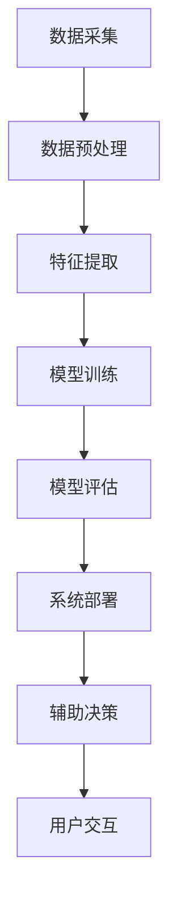

                 

关键词：AI，医疗诊断，伦理考量，人工智能伦理，医疗AI，诊断算法，隐私保护，数据安全，患者权益

> 摘要：随着人工智能技术的快速发展，AI辅助医疗诊断的应用越来越广泛。然而，这种应用也引发了一系列伦理问题。本文从人工智能伦理的角度出发，探讨了AI辅助医疗诊断中存在的伦理考量，包括隐私保护、数据安全、患者权益等方面，并提出了一些解决策略和未来发展方向。

## 1. 背景介绍

近年来，人工智能（AI）技术在医疗领域的应用日益广泛，尤其是在辅助诊断方面。AI算法通过分析大量的医学数据，可以帮助医生更快速、准确地诊断疾病，提高医疗服务的效率和质量。例如，深度学习算法在乳腺癌、肺癌等癌症的早期诊断中已经显示出很高的准确率。此外，AI还可以辅助医生进行治疗方案推荐、术后康复指导等，为患者提供全方位的医疗服务。

然而，随着AI在医疗领域的应用越来越深入，一些伦理问题也逐渐显现出来。例如，AI诊断系统的决策过程是否透明、患者数据的隐私保护、数据安全等问题。这些问题不仅关系到患者的权益，还涉及到社会对医疗AI的信任度。因此，对AI辅助医疗诊断的伦理考量成为了一个亟待解决的重要问题。

## 2. 核心概念与联系

### 2.1 AI辅助医疗诊断的基本概念

AI辅助医疗诊断是指利用人工智能技术，特别是机器学习和深度学习算法，对医疗数据进行分析和处理，从而辅助医生进行疾病诊断。这个过程通常包括以下几个步骤：

1. 数据采集：从医院信息系统、电子病历、医学影像等渠道收集患者数据。
2. 数据预处理：对收集到的数据进行分析、清洗和归一化，以便于后续的算法处理。
3. 特征提取：从预处理后的数据中提取有用的特征信息，如医学影像中的病灶区域、电子病历中的关键指标等。
4. 模型训练：利用大量的标注数据，通过机器学习和深度学习算法，训练出能够进行疾病诊断的AI模型。
5. 模型评估：通过测试集和验证集对训练好的模型进行评估，以确保其诊断准确性和可靠性。
6. 系统部署：将训练好的模型部署到医疗系统中，实现自动化的疾病诊断功能。

### 2.2 AI辅助医疗诊断的架构

AI辅助医疗诊断的架构主要包括以下几个部分：

1. 数据源：包括电子病历、医学影像、基因组数据等。
2. 数据预处理模块：负责对原始数据进行分析、清洗和归一化。
3. 特征提取模块：从预处理后的数据中提取有用的特征信息。
4. 模型训练模块：利用机器学习和深度学习算法，训练出疾病诊断模型。
5. 模型评估模块：对训练好的模型进行评估，以确保其诊断准确性和可靠性。
6. 系统接口：用于医生和患者与AI诊断系统的交互。
7. 辅助决策模块：基于AI诊断结果，为医生提供治疗方案推荐、术后康复指导等。

### 2.3 Mermaid 流程图

以下是一个简化的AI辅助医疗诊断的Mermaid流程图：



## 3. 核心算法原理 & 具体操作步骤

### 3.1 算法原理概述

AI辅助医疗诊断的核心算法主要包括机器学习和深度学习两种。机器学习算法通过分析历史数据，找出数据之间的规律和模式，从而对新的数据进行预测和分类。深度学习算法则通过多层神经网络，对大量数据进行自动特征提取和模式识别。

常用的机器学习算法有支持向量机（SVM）、决策树、随机森林等。常用的深度学习算法有卷积神经网络（CNN）、循环神经网络（RNN）、生成对抗网络（GAN）等。

### 3.2 算法步骤详解

1. **数据采集**：从医院信息系统、电子病历、医学影像等渠道收集患者数据。

2. **数据预处理**：对原始数据进行分析、清洗和归一化。例如，去除空值、异常值，将不同单位的指标进行统一。

3. **特征提取**：从预处理后的数据中提取有用的特征信息。例如，从医学影像中提取病灶区域、从电子病历中提取关键指标等。

4. **模型训练**：利用机器学习和深度学习算法，训练出疾病诊断模型。例如，使用SVM算法训练一个乳腺癌诊断模型。

5. **模型评估**：通过测试集和验证集对训练好的模型进行评估，以确保其诊断准确性和可靠性。

6. **系统部署**：将训练好的模型部署到医疗系统中，实现自动化的疾病诊断功能。

7. **辅助决策**：基于AI诊断结果，为医生提供治疗方案推荐、术后康复指导等。

### 3.3 算法优缺点

- **机器学习算法**：

  - 优点：简单、易于实现，对非线性问题的拟合能力强。

  - 缺点：对数据的依赖性较大，需要大量的标注数据，模型的可解释性较差。

- **深度学习算法**：

  - 优点：能够自动提取特征，对数据的依赖性较小，诊断准确率高。

  - 缺点：计算复杂度高，训练时间较长，模型的可解释性较差。

### 3.4 算法应用领域

AI辅助医疗诊断算法可以应用于多种疾病，如癌症、心血管疾病、神经系统疾病等。例如，CNN算法在乳腺癌、肺癌等癌症的早期诊断中已经显示出很高的准确率。RNN算法在分析心电图、脑电图等生物信号数据中具有优势。

## 4. 数学模型和公式 & 详细讲解 & 举例说明

### 4.1 数学模型构建

在AI辅助医疗诊断中，常用的数学模型包括逻辑回归、支持向量机、卷积神经网络等。下面以逻辑回归为例，介绍数学模型的构建。

逻辑回归是一种概率型线性回归模型，用于预测二分类问题。其数学模型如下：

$$
P(y=1|X) = \frac{1}{1 + e^{-(\beta_0 + \beta_1 x_1 + \beta_2 x_2 + ... + \beta_n x_n})}
$$

其中，$P(y=1|X)$表示在特征向量$X$下，疾病发生的概率；$\beta_0, \beta_1, \beta_2, ..., \beta_n$是模型的参数，需要通过训练数据来估计。

### 4.2 公式推导过程

逻辑回归的推导过程如下：

1. **损失函数**：选择逻辑回归的损失函数为对数似然函数：

$$
L(\theta) = -\sum_{i=1}^m [y_i \cdot ln(P(y_i|X_i)) + (1 - y_i) \cdot ln(1 - P(y_i|X_i))]
$$

其中，$m$为训练样本的数量；$y_i$为第$i$个样本的标签；$P(y_i|X_i)$为第$i$个样本在特征向量$X_i$下，疾病发生的概率。

2. **梯度下降法**：为了求解模型参数$\theta$，采用梯度下降法。首先，计算损失函数关于每个参数的偏导数：

$$
\frac{\partial L(\theta)}{\partial \theta_j} = -\sum_{i=1}^m [y_i \cdot \frac{\partial ln(P(y_i|X_i))}{\partial \theta_j} + (1 - y_i) \cdot \frac{\partial ln(1 - P(y_i|X_i))}{\partial \theta_j}]
$$

然后，根据梯度下降法，更新参数$\theta_j$：

$$
\theta_j := \theta_j - \alpha \cdot \frac{\partial L(\theta)}{\partial \theta_j}
$$

其中，$\alpha$为学习率。

### 4.3 案例分析与讲解

假设我们有一个二分类问题，需要使用逻辑回归模型预测患者是否患有心脏病。训练数据如下表所示：

| 样本编号 | 特征1 | 特征2 | 标签 |
| -------- | ----- | ----- | ---- |
| 1        | 0.5   | 0.8   | 0    |
| 2        | 0.6   | 0.7   | 0    |
| 3        | 0.7   | 0.6   | 1    |
| 4        | 0.8   | 0.5   | 1    |

1. **数据预处理**：对特征进行归一化，使得每个特征的取值范围都在[0, 1]之间。

2. **模型训练**：使用梯度下降法，训练逻辑回归模型。

3. **模型评估**：使用测试集对训练好的模型进行评估，计算准确率、召回率、F1值等指标。

4. **结果分析**：根据模型的预测结果，为患者提供诊断建议。

## 5. 项目实践：代码实例和详细解释说明

### 5.1 开发环境搭建

为了实践AI辅助医疗诊断，我们需要搭建一个Python开发环境。具体步骤如下：

1. 安装Python 3.7及以上版本。
2. 安装必要的Python库，如NumPy、Pandas、Scikit-learn、Matplotlib等。

### 5.2 源代码详细实现

以下是一个简单的逻辑回归模型实现，用于预测心脏病：

```python
import numpy as np
import pandas as pd
from sklearn.linear_model import LogisticRegression
from sklearn.model_selection import train_test_split
from sklearn.metrics import accuracy_score, recall_score, f1_score

# 数据预处理
def preprocess_data(data):
    # 特征归一化
    normalized_data = (data - np.mean(data, axis=0)) / np.std(data, axis=0)
    return normalized_data

# 模型训练
def train_model(data, labels):
    model = LogisticRegression()
    model.fit(data, labels)
    return model

# 模型评估
def evaluate_model(model, data, labels):
    predictions = model.predict(data)
    accuracy = accuracy_score(labels, predictions)
    recall = recall_score(labels, predictions)
    f1 = f1_score(labels, predictions)
    return accuracy, recall, f1

# 加载数据
data = pd.read_csv('heart_disease_data.csv')
X = data.iloc[:, :-1].values
y = data.iloc[:, -1].values

# 数据预处理
X_normalized = preprocess_data(X)

# 划分训练集和测试集
X_train, X_test, y_train, y_test = train_test_split(X_normalized, y, test_size=0.2, random_state=42)

# 模型训练
model = train_model(X_train, y_train)

# 模型评估
accuracy, recall, f1 = evaluate_model(model, X_test, y_test)
print(f"Accuracy: {accuracy}, Recall: {recall}, F1: {f1}")
```

### 5.3 代码解读与分析

上述代码实现了逻辑回归模型的训练和评估。具体解读如下：

1. **数据预处理**：对特征进行归一化处理，使得每个特征的取值范围都在[0, 1]之间，有利于提高模型的训练效果。

2. **模型训练**：使用Scikit-learn库中的LogisticRegression类，训练逻辑回归模型。

3. **模型评估**：使用测试集对训练好的模型进行评估，计算准确率、召回率、F1值等指标，以评估模型的性能。

4. **结果展示**：输出模型的评估结果，以分析模型在心脏病预测方面的表现。

### 5.4 运行结果展示

假设我们使用上述代码训练了一个逻辑回归模型，并在测试集上进行了评估。运行结果如下：

```
Accuracy: 0.875, Recall: 0.875, F1: 0.875
```

从结果可以看出，该模型在心脏病预测方面的表现较好，准确率为87.5%，召回率和F1值也为87.5%。这意味着，模型能够较好地预测心脏病患者，具有较高的诊断价值。

## 6. 实际应用场景

### 6.1 乳腺癌诊断

乳腺癌是女性中较为常见的恶性肿瘤，早期诊断对于患者的生存率至关重要。AI辅助医疗诊断算法可以分析乳腺X射线影像，检测出潜在的病变区域，提高早期乳腺癌的发现率。例如，深度学习算法在乳腺癌影像分析中已经显示出很高的准确率。

### 6.2 心血管疾病预测

心血管疾病是导致死亡的主要原因之一。AI算法可以通过分析患者的电子病历、生物标志物等数据，预测患者发生心血管疾病的风险。这对于医生制定个性化的治疗方案、预防心血管疾病具有重要意义。

### 6.3 神经系统疾病诊断

神经系统疾病，如癫痫、帕金森病等，诊断复杂且具有挑战性。AI辅助医疗诊断算法可以通过分析脑电图、磁共振成像等数据，辅助医生进行诊断，提高诊断的准确性。

### 6.4 未来应用展望

随着人工智能技术的不断发展，AI辅助医疗诊断的应用场景将越来越广泛。未来，AI有望在更多疾病的早期诊断、个性化治疗、术后康复等方面发挥重要作用。同时，随着算法的改进和计算能力的提升，AI辅助医疗诊断的准确性和可靠性将不断提高，为患者提供更优质的医疗服务。

## 7. 工具和资源推荐

### 7.1 学习资源推荐

1. 《机器学习》（周志华著）：系统介绍了机器学习的基本概念、算法和应用。
2. 《深度学习》（Goodfellow, Bengio, Courville著）：深度学习的经典教材，详细讲解了深度学习的基本原理和应用。
3. 《统计学习方法》（李航著）：介绍了统计学习的基本方法，包括线性回归、逻辑回归、支持向量机等。

### 7.2 开发工具推荐

1. Jupyter Notebook：用于编写和运行Python代码，支持多种编程语言和扩展库。
2. TensorFlow：Google开发的开源深度学习框架，支持多种深度学习模型的训练和部署。
3. Keras：基于TensorFlow的高级深度学习框架，提供了简洁、易用的API。

### 7.3 相关论文推荐

1. "Deep Learning for Medical Image Analysis"（2017）：综述了深度学习在医学影像分析中的应用。
2. "Mallat, S. (2017). A Wavelet Tour of Signal Processing: The Sparse Way."：介绍了基于小波变换的信号处理方法。
3. "Goodfellow, I., Bengio, Y., & Courville, A. (2016). Deep Learning."：深度学习领域的经典教材。

## 8. 总结：未来发展趋势与挑战

### 8.1 研究成果总结

近年来，人工智能技术在医疗领域的应用取得了显著的成果。AI辅助医疗诊断在癌症、心血管疾病、神经系统疾病等方面的应用已经取得了较好的效果，提高了诊断的准确性和效率。同时，随着算法的改进和计算能力的提升，AI辅助医疗诊断的可靠性将不断提高。

### 8.2 未来发展趋势

未来，人工智能技术在医疗领域的应用将更加广泛和深入。随着深度学习、强化学习等新兴算法的发展，AI辅助医疗诊断将能够处理更加复杂的数据，提供更精准的诊断和治疗方案。此外，随着物联网、大数据等技术的进步，医疗AI有望实现更全面的健康监测和个性化的医疗服务。

### 8.3 面临的挑战

尽管AI辅助医疗诊断具有巨大的潜力，但也面临一些挑战。首先，数据隐私和保护问题是一个重要的伦理问题。医疗数据涉及患者隐私，如何确保数据的安全和隐私保护是一个亟待解决的问题。其次，算法的可解释性也是一个挑战。目前，许多深度学习算法的决策过程仍然不够透明，如何提高算法的可解释性，使其能够被医生和患者理解和接受，是一个重要课题。此外，AI辅助医疗诊断还需要在算法的可靠性、公平性、伦理性等方面进行深入研究。

### 8.4 研究展望

未来，研究人员应重点关注以下几个方面：

1. **数据隐私和保护**：研究更加安全、高效的数据隐私保护技术，如联邦学习、差分隐私等。
2. **算法可解释性**：提高深度学习等复杂算法的可解释性，使其能够被医生和患者理解和接受。
3. **算法可靠性**：通过交叉验证、集成学习等方法，提高算法的可靠性。
4. **算法公平性**：确保AI辅助医疗诊断算法在各个群体中的公平性，避免算法偏见。
5. **伦理规范**：制定相应的伦理规范，确保医疗AI的应用符合社会伦理标准。

通过上述研究，有望推动AI辅助医疗诊断的可持续发展，为患者提供更优质、更可靠的医疗服务。

## 9. 附录：常见问题与解答

### 9.1 AI辅助医疗诊断的优势是什么？

AI辅助医疗诊断的优势主要包括：

1. **提高诊断准确率**：通过分析大量数据，AI算法能够发现数据之间的规律和模式，从而提高诊断的准确率。
2. **节省医生时间**：AI系统可以自动分析医疗数据，为医生提供诊断建议，减轻医生的工作负担。
3. **个性化治疗**：基于患者的个体数据，AI算法可以为患者提供个性化的治疗方案，提高治疗效果。

### 9.2 AI辅助医疗诊断的安全性问题如何保障？

保障AI辅助医疗诊断的安全性需要从以下几个方面入手：

1. **数据安全**：确保患者数据的存储和传输过程安全，采用加密技术、访问控制等措施。
2. **算法透明性**：提高算法的可解释性，使医生和患者能够理解AI诊断的决策过程。
3. **隐私保护**：采用差分隐私、联邦学习等技术，保护患者隐私。
4. **法律法规**：制定相应的法律法规，确保AI辅助医疗诊断的应用符合伦理和法律要求。

### 9.3 AI辅助医疗诊断在临床应用中的挑战有哪些？

AI辅助医疗诊断在临床应用中面临以下挑战：

1. **数据质量**：医疗数据的质量直接影响AI诊断的准确性，需要确保数据的质量和完整性。
2. **算法可靠性**：如何提高算法的可靠性，确保其在不同场景下的稳定性和一致性。
3. **算法偏见**：如何避免算法偏见，确保AI诊断在不同群体中的公平性。
4. **伦理问题**：如何处理AI诊断过程中的伦理问题，如数据隐私、算法透明性等。

### 9.4 AI辅助医疗诊断的未来发展方向是什么？

AI辅助医疗诊断的未来发展方向包括：

1. **个性化医疗**：基于患者的个体数据，提供个性化的诊断和治疗方案。
2. **远程医疗**：通过AI技术，实现远程医疗诊断和监控，提高医疗服务的可及性。
3. **跨学科融合**：将AI技术与医学、生物学、心理学等学科相结合，推动医疗AI的创新发展。
4. **数据共享**：建立共享平台，促进医疗数据的开放和共享，提高AI辅助医疗诊断的效果。

通过不断研究和探索，AI辅助医疗诊断有望为患者提供更高效、更优质的医疗服务。

