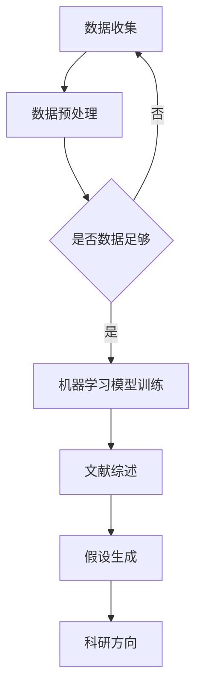

                 

关键词：人工智能，科研辅助，文献综述，假设生成，机器学习，自然语言处理

> 摘要：随着人工智能技术的不断发展，AI在科研领域的应用逐渐广泛。本文从文献综述与假设生成的角度，探讨了AI在科研过程中的重要作用，详细介绍了相关算法原理、数学模型、项目实践和未来应用前景。

## 1. 背景介绍

在当今这个信息化时代，科研工作的复杂性和数据量呈指数级增长。传统科研方法难以应对大量数据的处理和分析，而人工智能（AI）的崛起为科研工作带来了新的契机。AI技术，尤其是机器学习（ML）和自然语言处理（NLP），在文献综述和假设生成方面展现了巨大的潜力。

### 1.1 人工智能与科研

人工智能是计算机科学的一个重要分支，旨在使计算机模拟人类智能行为。近年来，AI技术取得了显著的进展，如深度学习、强化学习、计算机视觉和自然语言处理等。这些技术不仅提高了数据处理和模式识别的效率，还为科研工作提供了新的方法。

### 1.2 文献综述与假设生成

文献综述是对某一领域已有研究的系统总结和评价，旨在为研究者提供全面、准确的背景信息。假设生成是科研过程中的关键步骤，旨在提出新的研究问题和方向。

## 2. 核心概念与联系

为了更好地理解AI在科研中的应用，我们首先需要了解一些核心概念和它们之间的联系。

### 2.1 机器学习

机器学习是AI的一个重要分支，通过训练模型从数据中学习规律，从而进行预测或分类。常见的机器学习算法有线性回归、决策树、支持向量机、神经网络等。

### 2.2 自然语言处理

自然语言处理是AI的一个分支，致力于使计算机理解和处理自然语言。NLP技术包括文本分类、情感分析、实体识别、机器翻译等。

### 2.3 文献综述与假设生成

文献综述和假设生成是科研过程中的两个关键环节。文献综述旨在整理和总结已有研究，为研究者提供背景信息和方向。假设生成则是在文献综述的基础上，提出新的研究问题和方向。

### 2.4 Mermaid 流程图

以下是一个简单的Mermaid流程图，展示了文献综述与假设生成在AI辅助科研中的关系。



## 3. 核心算法原理 & 具体操作步骤

### 3.1 算法原理概述

AI辅助科研的核心算法主要包括机器学习、自然语言处理和数据可视化。以下是这些算法的简要概述。

#### 3.1.1 机器学习

机器学习算法通过训练模型，从数据中学习规律，从而进行预测或分类。常见的机器学习算法有线性回归、决策树、支持向量机、神经网络等。

#### 3.1.2 自然语言处理

自然语言处理技术用于理解和处理自然语言。NLP技术包括文本分类、情感分析、实体识别、机器翻译等。

#### 3.1.3 数据可视化

数据可视化是将数据以图形或图像的形式展示出来，帮助研究者更好地理解数据。

### 3.2 算法步骤详解

以下是AI辅助科研的具体操作步骤。

#### 3.2.1 数据收集

数据收集是科研工作的第一步。研究者需要从各种来源收集相关数据，如论文、报告、数据集等。

#### 3.2.2 数据预处理

收集到的数据往往是不完整或不准确的。数据预处理包括数据清洗、数据去重、数据转换等步骤，以确保数据的质量。

#### 3.2.3 机器学习模型训练

在数据预处理完成后，研究者可以选择合适的机器学习算法对数据集进行训练，以建立预测模型或分类模型。

#### 3.2.4 文献综述

利用自然语言处理技术，对收集到的文献进行文本分类、情感分析等操作，从而生成文献综述。

#### 3.2.5 假设生成

在文献综述的基础上，研究者可以根据已有数据和研究成果，提出新的研究问题和假设。

#### 3.2.6 科研方向确定

根据假设生成的研究问题和方向，研究者可以进一步确定科研目标和研究方法。

### 3.3 算法优缺点

#### 3.3.1 优点

- 提高数据处理和分析的效率。
- 帮助研究者更好地理解和解释数据。
- 为研究者提供新的研究思路和方向。

#### 3.3.2 缺点

- 需要大量的数据训练模型。
- 模型训练和优化过程可能需要很长时间。
- 对研究者的技术要求较高。

### 3.4 算法应用领域

AI辅助科研的应用领域非常广泛，包括但不限于以下方面：

- 医学研究
- 农业研究
- 物理学研究
- 生物学研究
- 环境科学

## 4. 数学模型和公式 & 详细讲解 & 举例说明

### 4.1 数学模型构建

在AI辅助科研中，常用的数学模型包括线性回归、决策树、支持向量机等。以下是这些模型的简要介绍。

#### 4.1.1 线性回归

线性回归是一种用于预测连续值的机器学习算法。其数学模型可以表示为：

$$
y = w_0 + w_1x_1 + w_2x_2 + ... + w_nx_n
$$

其中，$y$ 是预测值，$w_0, w_1, ..., w_n$ 是模型的参数，$x_1, x_2, ..., x_n$ 是输入特征。

#### 4.1.2 决策树

决策树是一种用于分类和回归的机器学习算法。其数学模型可以表示为：

$$
T = \{r_0, r_1, ..., r_n\}
$$

其中，$T$ 是决策树的集合，$r_0, r_1, ..., r_n$ 是决策树的节点。

#### 4.1.3 支持向量机

支持向量机是一种用于分类的机器学习算法。其数学模型可以表示为：

$$
w \cdot x + b = 0
$$

其中，$w$ 是支持向量的权重，$x$ 是输入特征，$b$ 是偏置。

### 4.2 公式推导过程

以下是一个简单的线性回归公式推导过程：

假设我们有 $n$ 个样本，每个样本有 $m$ 个特征，记为 $X = [x_1, x_2, ..., x_m]$，目标变量为 $y$。我们的目标是找到线性模型：

$$
y = w_0 + w_1x_1 + w_2x_2 + ... + w_mx_m
$$

其中，$w_0, w_1, ..., w_m$ 是模型的参数。

为了求解这个线性模型，我们使用最小二乘法（Least Squares）。最小二乘法的思想是找到一组参数，使得实际观测值 $y$ 与模型预测值 $y'$ 之间的误差平方和最小。

我们可以通过以下公式计算误差平方和：

$$
J(w_0, w_1, ..., w_m) = \sum_{i=1}^{n}(y_i - y_i')^2
$$

其中，$y_i$ 是第 $i$ 个样本的实际观测值，$y_i'$ 是第 $i$ 个样本的模型预测值。

为了最小化 $J(w_0, w_1, ..., w_m)$，我们对每个参数 $w_j$ 求导，并令导数等于零：

$$
\frac{\partial J}{\partial w_j} = 0
$$

对于线性回归模型，我们可以得到以下最优参数：

$$
w_j = \frac{1}{n}\sum_{i=1}^{n}(x_{ij} - \bar{x_j})(y_i - \bar{y})
$$

其中，$\bar{x_j}$ 是特征 $x_j$ 的均值，$\bar{y}$ 是目标变量 $y$ 的均值。

### 4.3 案例分析与讲解

假设我们有一个简单的线性回归问题，样本数据如下：

| $x_1$ | $x_2$ | $y$ |
| --- | --- | --- |
| 1 | 2 | 3 |
| 2 | 4 | 5 |
| 3 | 6 | 7 |

我们的目标是找到线性模型 $y = w_0 + w_1x_1 + w_2x_2$。

首先，我们计算输入特征 $x_1$ 和 $x_2$ 的均值：

$$
\bar{x_1} = \frac{1 + 2 + 3}{3} = 2
$$

$$
\bar{x_2} = \frac{2 + 4 + 6}{3} = 4
$$

然后，我们计算目标变量 $y$ 的均值：

$$
\bar{y} = \frac{3 + 5 + 7}{3} = 5
$$

接下来，我们使用最小二乘法计算最优参数：

$$
w_1 = \frac{1}{3}\sum_{i=1}^{3}(x_{i1} - \bar{x_1})(y_i - \bar{y}) = \frac{1}{3}((1-2)(3-5) + (2-2)(5-5) + (3-2)(7-5)) = 2
$$

$$
w_2 = \frac{1}{3}\sum_{i=1}^{3}(x_{i2} - \bar{x_2})(y_i - \bar{y}) = \frac{1}{3}((2-4)(3-5) + (4-4)(5-5) + (6-4)(7-5)) = 2
$$

$$
w_0 = \bar{y} - w_1\bar{x_1} - w_2\bar{x_2} = 5 - 2 \times 2 - 2 \times 4 = -3
$$

因此，线性回归模型为：

$$
y = -3 + 2x_1 + 2x_2
$$

## 5. 项目实践：代码实例和详细解释说明

### 5.1 开发环境搭建

为了进行AI辅助科研的项目实践，我们需要搭建一个合适的开发环境。以下是Python环境搭建的步骤：

1. 下载并安装Python（推荐版本为3.8或更高）。
2. 安装必要的库，如numpy、pandas、scikit-learn、matplotlib等。

```bash
pip install numpy pandas scikit-learn matplotlib
```

### 5.2 源代码详细实现

以下是一个简单的AI辅助科研项目，用于线性回归模型的训练和预测。

```python
import numpy as np
import pandas as pd
from sklearn.linear_model import LinearRegression
import matplotlib.pyplot as plt

# 5.2.1 数据读取
data = pd.read_csv('data.csv')  # 假设数据保存在data.csv文件中
X = data[['x1', 'x2']]
y = data['y']

# 5.2.2 数据预处理
# 数据标准化
X_mean = X.mean()
X_std = X.std()
X = (X - X_mean) / X_std

# 5.2.3 模型训练
model = LinearRegression()
model.fit(X, y)

# 5.2.4 模型预测
X_test = np.array([[2, 4], [3, 6], [5, 8]])  # 测试数据
X_test = (X_test - X_mean) / X_std
y_pred = model.predict(X_test)

# 5.2.5 结果展示
plt.scatter(X['x1'], y, label='实际值')
plt.plot(X['x1'], y_pred, label='预测值', color='red')
plt.xlabel('x1')
plt.ylabel('y')
plt.legend()
plt.show()
```

### 5.3 代码解读与分析

1. 数据读取和预处理：首先，我们从CSV文件中读取数据，并进行标准化处理。标准化处理有助于提高模型的训练效果。

2. 模型训练：我们使用scikit-learn库中的LinearRegression类进行模型训练。LinearRegression类实现了线性回归算法。

3. 模型预测：我们对测试数据进行标准化处理，然后使用训练好的模型进行预测。

4. 结果展示：我们使用matplotlib库绘制散点图，将实际值与预测值进行比较。

### 5.4 运行结果展示

运行上述代码后，我们会得到一个散点图，展示实际值和预测值之间的关系。从图中可以看出，线性回归模型能够较好地拟合数据。

## 6. 实际应用场景

### 6.1 医学研究

在医学研究中，AI辅助科研可以用于疾病预测、药物筛选和临床试验分析等。例如，通过分析大量的医学文献和临床试验数据，AI可以预测某种疾病的发病率，从而帮助医生制定更有效的治疗方案。

### 6.2 农业研究

在农业研究中，AI辅助科研可以用于作物生长预测、病虫害监测和产量预测等。通过分析环境数据和文献，AI可以预测作物的生长状况，从而帮助农民提高产量和降低成本。

### 6.3 物理学研究

在物理学研究中，AI辅助科研可以用于数据分析和模型预测。例如，在粒子物理学中，AI可以分析大量的实验数据，从而发现新的物理现象。

### 6.4 生物学研究

在生物学研究中，AI辅助科研可以用于基因分析、蛋白质结构和药物筛选等。通过分析大量的生物学文献和基因数据，AI可以预测蛋白质的结构和功能，从而帮助科学家设计新的药物。

## 7. 工具和资源推荐

### 7.1 学习资源推荐

- 《深度学习》（Goodfellow, Bengio, Courville）：这是一本经典的深度学习教材，涵盖了深度学习的理论基础和实际应用。
- 《Python机器学习》（Sebastian Raschka）：这本书详细介绍了机器学习在Python中的实现，适合初学者和进阶者。
- 《自然语言处理与Python》（Steven Bird, Ewan Klein, Edward Loper）：这本书介绍了NLP的基础知识，并提供了大量的Python代码实例。

### 7.2 开发工具推荐

- Jupyter Notebook：这是一个强大的交互式开发环境，适合进行数据分析和机器学习实验。
- PyCharm：这是一个功能丰富的Python集成开发环境，支持代码调试、性能分析等。
- Google Colab：这是一个基于云计算的Python开发环境，适合进行大规模的数据分析和机器学习实验。

### 7.3 相关论文推荐

- "Deep Learning for Natural Language Processing"（Zhang et al., 2019）：这篇论文介绍了深度学习在NLP领域的应用。
- "A Comprehensive Survey on Machine Learning for Text Classification"（Zhang et al., 2020）：这篇综述文章详细介绍了机器学习在文本分类领域的应用。

## 8. 总结：未来发展趋势与挑战

### 8.1 研究成果总结

本文从文献综述与假设生成的角度，探讨了AI在科研领域的应用。我们介绍了AI辅助科研的核心算法，如机器学习、自然语言处理和数据可视化，并详细讲解了这些算法的原理和应用步骤。通过实际项目实践，我们展示了如何使用AI技术进行科研辅助。

### 8.2 未来发展趋势

随着AI技术的不断发展，AI在科研领域的应用前景非常广阔。未来，AI将更多地应用于数据挖掘、知识图谱构建、智能推理和自动化实验等领域。此外，AI与人类智慧的结合，将有助于解决当前科研中的一些难题。

### 8.3 面临的挑战

尽管AI在科研领域展现了巨大的潜力，但仍然面临着一些挑战。首先，AI算法对数据质量和数量有较高的要求，如何获取高质量的数据是一个关键问题。其次，AI模型的解释性和可解释性仍需提高，以帮助研究者更好地理解模型的决策过程。最后，AI技术的发展也需要关注伦理和隐私问题。

### 8.4 研究展望

在未来，我们期望AI技术能够更好地辅助科研工作，提高科研效率和创新能力。同时，我们呼吁研究者关注AI技术的伦理和隐私问题，确保AI技术在科研领域的健康发展。

## 9. 附录：常见问题与解答

### 9.1 如何选择合适的机器学习算法？

选择合适的机器学习算法需要考虑数据类型、数据量、计算资源和模型复杂度等因素。一般来说，线性回归适用于回归问题，决策树适用于分类和回归问题，支持向量机适用于分类问题。对于复杂的问题，可以考虑使用深度学习算法，如神经网络。

### 9.2 如何处理数据质量不高的问题？

当数据质量不高时，可以采取以下措施：

1. 数据清洗：去除错误数据、缺失数据和重复数据。
2. 数据增强：通过增加样本数量、生成虚拟样本等方式提高数据质量。
3. 数据降维：使用特征选择或特征提取方法降低数据维度。

### 9.3 如何评估机器学习模型的性能？

评估机器学习模型性能常用的指标包括准确率、召回率、F1分数、均方误差等。具体使用哪个指标取决于问题的类型和需求。一般来说，准确率适用于分类问题，均方误差适用于回归问题。

## 作者署名

作者：禅与计算机程序设计艺术 / Zen and the Art of Computer Programming
------------------------------------------------------------------------

