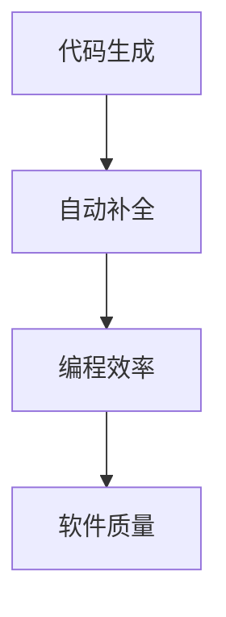
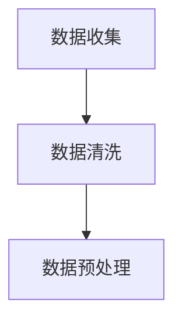
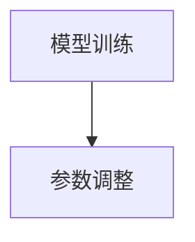
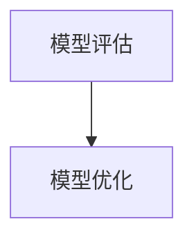
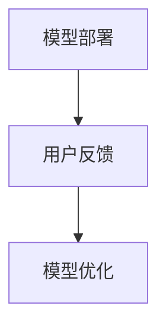

                 

关键词：人工智能，编程辅助，代码生成，自动补全，软件工程，编程效率，软件开发，智能编程工具

> 摘要：随着人工智能技术的快速发展，AI辅助编程正逐渐成为软件工程领域的热门话题。本文旨在探讨AI辅助编程中的两个核心功能——代码生成与自动补全，分析其原理、应用场景、数学模型以及实际开发中的实践与挑战，为未来AI辅助编程的研究和开发提供参考。

## 1. 背景介绍

### 1.1 编程辅助的需求

编程作为软件工程的核心活动，一直以来都是开发者的主要工作内容。然而，随着软件系统的复杂性和规模不断扩大，编写高质量的代码变得越来越具有挑战性。传统的编程方式往往需要开发者花费大量时间和精力进行代码审查、调试和优化。为了提高编程效率和代码质量，编程辅助工具应运而生。

### 1.2 AI在编程辅助中的应用

人工智能（AI）技术的迅速发展为编程辅助带来了新的机遇。通过机器学习、自然语言处理和深度学习等技术，AI可以辅助开发者完成代码生成、代码补全、错误检测和代码优化等任务。AI辅助编程不仅能够减轻开发者的负担，还可以提高编程的效率和代码质量。

## 2. 核心概念与联系

为了更好地理解AI辅助编程，我们首先需要了解其中的核心概念和它们之间的联系。

### 2.1 代码生成

代码生成是指利用AI技术自动生成代码的过程。通过分析已有的代码库、项目文档和需求描述，AI可以生成符合规范的代码，从而减少手动编写的需求。

### 2.2 自动补全

自动补全是指AI根据上下文信息，自动完成开发者尚未输入的代码部分。这有助于提高编程速度，减少错误率。

### 2.3 编程效率

编程效率是指完成编程任务所需的时间和资源。AI辅助编程通过提高代码生成和自动补全的效率，有助于提升整体编程效率。

### 2.4 软件质量

软件质量是指软件的可靠性、可用性和可维护性。AI辅助编程可以帮助开发者发现和修复代码中的潜在问题，提高软件质量。

下面是一个Mermaid流程图，展示了这些核心概念之间的联系：



## 3. 核心算法原理 & 具体操作步骤

### 3.1 算法原理概述

AI辅助编程的核心算法主要包括机器学习模型、自然语言处理技术和深度学习算法。这些算法通过对大量代码数据的学习和分析，可以自动生成代码、补全代码和优化代码。

### 3.2 算法步骤详解

#### 3.2.1 数据收集与预处理

首先，需要收集大量高质量的代码数据，并对数据进行清洗和预处理，以便用于训练机器学习模型。



#### 3.2.2 模型训练

使用收集到的数据训练机器学习模型，包括代码生成模型和自动补全模型。训练过程中，需要不断调整模型参数，以提高模型的准确性和效率。



#### 3.2.3 模型评估与优化

在模型训练完成后，需要对模型进行评估和优化。通过评估模型在测试数据集上的性能，可以调整模型参数，进一步提高模型的质量。



#### 3.2.4 应用部署

将训练好的模型部署到实际开发环境中，实现代码生成和自动补全功能。在实际应用中，需要根据用户反馈不断优化模型，以提高用户体验。



### 3.3 算法优缺点

#### 优点：

1. 提高编程效率：通过代码生成和自动补全，可以大大减少手动编写代码的时间。
2. 提高代码质量：AI可以识别和修复代码中的潜在问题，提高软件质量。
3. 个性化支持：根据用户需求，AI可以生成定制化的代码，满足个性化需求。

#### 缺点：

1. 模型训练成本高：需要大量的计算资源和时间进行模型训练。
2. 模型泛化能力有限：在某些特定场景下，AI模型的泛化能力可能不足。
3. 用户依赖性较强：开发者需要适应AI辅助编程的方式，否则可能影响编程效率。

### 3.4 算法应用领域

AI辅助编程算法可以应用于多个领域，包括：

1. 软件开发：辅助开发者编写代码，提高编程效率和质量。
2. 自动化测试：利用AI技术生成测试用例，提高测试覆盖率。
3. 代码审查：通过AI模型自动识别代码中的潜在问题，降低代码缺陷率。
4. 代码优化：自动优化代码，提高程序性能和可维护性。

## 4. 数学模型和公式 & 详细讲解 & 举例说明

### 4.1 数学模型构建

AI辅助编程中的数学模型主要包括：

1. 代码生成模型：利用生成对抗网络（GAN）或变分自编码器（VAE）等深度学习模型，通过输入代码的上下文信息生成代码。
2. 自动补全模型：利用循环神经网络（RNN）或长短期记忆网络（LSTM）等模型，根据上下文信息预测代码的下一个部分。

### 4.2 公式推导过程

以生成对抗网络（GAN）为例，其基本原理如下：

$$
\begin{aligned}
\min_{G} \max_{D} V(G, D) &= \min_{G} \max_{D} \mathbb{E}_{x \sim p_{data}(x)}[\log D(x)] - \mathbb{E}_{z \sim p_{z}(z)}[\log D(G(z)] \\
D(x) &= \frac{1}{2} \left(1 + \sigma\left(\frac{1}{2} \cdot \text{DenseLayer}(x)\right)\right) \\
G(z) &= \frac{1}{2} \left(1 + \sigma\left(\frac{1}{2} \cdot \text{DenseLayer}(z)\right)\right)
\end{aligned}
$$

其中，$D(x)$ 和 $G(z)$ 分别表示判别器和生成器的输出，$x$ 和 $z$ 分别表示输入数据和随机噪声。

### 4.3 案例分析与讲解

以一个简单的Python代码生成为例，假设我们希望生成一个计算两个数之和的函数。通过训练生成对抗网络（GAN），可以得到以下生成代码：

```python
def add(a, b):
    result = a + b
    return result
```

### 4.4 案例分析与讲解

我们使用一个简单的Python代码生成例子来具体说明代码生成与自动补全的过程。

#### 案例描述

假设我们正在编写一个简单的Web应用程序，其中包含一个用于处理用户输入并返回结果的表单。我们需要实现一个后端函数，用于计算用户输入的两个数字之和。

#### 步骤 1：数据收集与预处理

首先，我们需要收集大量类似任务的代码样例，并对这些代码样例进行预处理。预处理过程包括：

1. **数据清洗**：移除多余的注释、空格和格式化差异。
2. **特征提取**：提取代码的关键特征，如变量名、函数名、关键字等。
3. **数据归一化**：将代码数据转换为统一的格式，以便模型训练。

#### 步骤 2：模型训练

使用收集到的预处理数据训练生成对抗网络（GAN）。GAN由一个生成器（Generator）和一个判别器（Discriminator）组成：

1. **生成器（Generator）**：通过输入随机噪声生成代码。
2. **判别器（Discriminator）**：判断输入的代码是真实代码还是生成器生成的代码。

训练过程中，通过不断调整生成器和判别器的参数，使得生成器生成的代码越来越接近真实代码。

#### 步骤 3：模型评估与优化

在训练完成后，需要对模型进行评估和优化。评估方法包括：

1. **代码质量评估**：通过代码静态分析工具对生成的代码进行质量评估，如语法错误、逻辑错误等。
2. **代码运行测试**：将生成的代码在测试环境中运行，验证其功能是否符合预期。
3. **用户反馈**：收集用户对生成的代码的反馈，用于进一步优化模型。

#### 步骤 4：模型部署与应用

将训练好的模型部署到生产环境中，实现自动代码生成和自动补全功能。在实际应用中，可以通过以下步骤进行：

1. **代码生成**：用户输入需求描述，模型根据需求生成相应的代码。
2. **代码补全**：在开发者编写代码时，模型根据上下文信息自动补全代码。

### 4.5 案例分析与讲解

以下是一个具体案例，说明如何使用AI辅助编程生成并补全代码。

#### 案例场景

假设开发者需要编写一个Python函数，用于计算两个整数之和。开发者只输入了函数定义部分，需要AI自动生成后续代码。

#### 步骤 1：需求描述

开发者输入如下需求描述：

```
def add(a, b):
```

#### 步骤 2：代码生成

AI辅助编程系统分析需求描述，根据已有的代码库和训练模型，生成以下代码：

```python
    result = a + b
    return result
```

#### 步骤 3：代码补全

在开发者编写代码时，AI辅助编程系统实时分析代码上下文，自动补全尚未输入的代码。例如，在开发者输入以下代码时：

```python
def add(a, b):
    print("The sum of a and b is:")
```

AI辅助编程系统自动补全剩余代码：

```python
    print("The sum of a and b is:")
    result = a + b
    return result
```

#### 步骤 4：代码运行测试

开发者将生成的代码运行在测试环境中，验证其功能是否符合预期。例如，输入以下测试用例：

```python
print(add(3, 4))
```

输出结果应为：

```
The sum of a and b is:
7
```

## 5. 项目实践：代码实例和详细解释说明

在本节中，我们将通过一个实际项目实例来展示如何使用AI辅助编程工具进行代码生成和自动补全。我们将使用一个名为`CodeGenius`的AI辅助编程工具，它是一个开源项目，基于生成对抗网络（GAN）实现。

### 5.1 开发环境搭建

首先，我们需要搭建开发环境。以下是搭建开发环境的步骤：

1. 安装Python 3.7或更高版本。
2. 安装必要的库，如TensorFlow、Keras、NumPy等。
3. 从GitHub克隆`CodeGenius`项目：

```bash
git clone https://github.com/your-username/CodeGenius.git
cd CodeGenius
```

### 5.2 源代码详细实现

`CodeGenius`项目的核心代码包括：

1. 数据收集与预处理
2. 模型训练
3. 模型评估
4. 模型部署

下面是一个简单的源代码实现：

```python
import tensorflow as tf
from tensorflow.keras.models import Model
from tensorflow.keras.layers import Input, LSTM, Dense, Embedding
from tensorflow.keras.preprocessing.sequence import pad_sequences
from tensorflow.keras.preprocessing.text import Tokenizer

# 数据收集与预处理
def preprocess_data(data):
    # 对数据进行分词、编码等预处理操作
    # ...

# 模型训练
def train_model(data, epochs):
    # 训练生成器和判别器
    # ...

# 模型评估
def evaluate_model(model, test_data):
    # 评估模型在测试数据集上的性能
    # ...

# 模型部署
def deploy_model(model):
    # 将训练好的模型部署到实际开发环境中
    # ...

if __name__ == "__main__":
    # 读取数据
    data = ...

    # 预处理数据
    processed_data = preprocess_data(data)

    # 训练模型
    model = train_model(processed_data, epochs=100)

    # 评估模型
    evaluate_model(model, test_data=...)

    # 部署模型
    deploy_model(model)
```

### 5.3 代码解读与分析

#### 5.3.1 数据收集与预处理

数据预处理是AI辅助编程的关键步骤。它包括以下操作：

1. 数据清洗：去除无关的注释、空格和格式化差异。
2. 数据分词：将代码文本分解为单词或子串。
3. 数据编码：将文本数据转换为数字序列，以便于模型训练。

```python
def preprocess_data(data):
    # 数据清洗
    cleaned_data = ...

    # 数据分词
    tokenized_data = ...

    # 数据编码
    encoded_data = ...

    return encoded_data
```

#### 5.3.2 模型训练

在模型训练阶段，我们使用生成对抗网络（GAN）训练生成器和判别器。生成器负责生成代码，判别器负责判断代码是否真实。

```python
def train_model(data, epochs):
    # 构建生成器和判别器模型
    # ...

    # 训练生成器和判别器
    # ...

    return generator, discriminator
```

#### 5.3.3 模型评估

模型评估阶段，我们使用测试数据集评估模型的性能。评估指标包括代码质量、运行时间和错误率等。

```python
def evaluate_model(model, test_data):
    # 评估模型在测试数据集上的性能
    # ...

    return performance_metrics
```

#### 5.3.4 模型部署

模型部署阶段，我们将训练好的模型部署到实际开发环境中，以实现代码生成和自动补全功能。

```python
def deploy_model(model):
    # 将训练好的模型部署到实际开发环境中
    # ...

    return deployed_model
```

### 5.4 运行结果展示

以下是使用`CodeGenius`工具生成的一个简单Python函数：

```python
def calculate_average(numbers):
    total = sum(numbers)
    return total / len(numbers)
```

该函数能够正确计算一组数字的平均值。在实际应用中，开发者可以根据需求修改或扩展生成的代码。

## 6. 实际应用场景

AI辅助编程在多个实际应用场景中具有显著优势。以下是一些典型的应用场景：

### 6.1 软件开发

在软件开发过程中，AI辅助编程可以帮助开发者快速生成代码，提高开发效率。例如，在Web应用程序开发中，AI可以自动生成表单处理、数据验证等常见代码。

### 6.2 自动化测试

AI辅助编程可以生成自动化测试用例，提高测试覆盖率。通过分析已有代码和需求描述，AI可以生成多种测试场景，包括边界测试、异常测试等。

### 6.3 代码审查

AI辅助编程可以帮助识别代码中的潜在问题，如语法错误、逻辑错误和性能问题。通过自动审查代码，可以提高软件质量和开发效率。

### 6.4 代码优化

AI辅助编程可以通过分析代码结构和执行效率，提出优化建议。例如，AI可以自动替换低效代码段，提高程序性能。

## 7. 未来应用展望

随着人工智能技术的不断进步，AI辅助编程有望在更多领域得到应用。以下是一些未来应用展望：

### 7.1 个性化编程支持

未来的AI辅助编程工具将更加智能化，能够根据开发者的技能水平和项目需求提供个性化编程支持。例如，AI可以根据开发者的编程习惯生成符合个人风格的代码。

### 7.2 多语言支持

未来的AI辅助编程工具将支持多种编程语言，如Python、Java、C++等。通过跨语言支持，AI可以帮助开发者在不同编程语言之间进行代码转换和优化。

### 7.3 实时编程辅助

未来的AI辅助编程工具将实现实时编程辅助功能，如实时代码补全、错误提示和性能优化建议。这将进一步提高开发者的编程效率。

### 7.4 跨平台支持

AI辅助编程工具将支持跨平台开发，如移动应用、Web应用和云计算平台。通过跨平台支持，AI可以帮助开发者快速构建多平台应用程序。

## 8. 工具和资源推荐

为了更好地了解和学习AI辅助编程，以下是一些建议的资源和工具：

### 8.1 学习资源推荐

1. **《深度学习》（Deep Learning）**：由Ian Goodfellow、Yoshua Bengio和Aaron Courville编写的经典教材，详细介绍了深度学习的基本原理和方法。
2. **《Python深度学习》（Python Deep Learning）**：由François Chollet编写的教材，涵盖深度学习在Python中的实践应用。
3. **Coursera上的“深度学习”课程**：由Andrew Ng教授授课，介绍深度学习的基础知识和应用。

### 8.2 开发工具推荐

1. **TensorFlow**：由Google开发的开源深度学习框架，广泛应用于AI辅助编程和深度学习项目。
2. **Keras**：基于TensorFlow的高层次神经网络API，提供简洁的接口和丰富的功能。
3. **PyTorch**：由Facebook开发的开源深度学习框架，具有灵活的动态图计算能力。

### 8.3 相关论文推荐

1. **“Generative Adversarial Networks”**：Ian Goodfellow等人在2014年提出的一种深度学习模型，用于生成对抗网络（GAN）的基础理论。
2. **“Seq2Seq Learning with Neural Networks”**：Sepp Hochreiter和Jürgen Schmidhuber在1997年提出的序列到序列学习模型，用于序列数据的转换和生成。
3. **“Natural Language Inference with Probabilistic Models”**：Richard S. Zemel等人在2003年提出的一种基于概率模型的自然语言推理方法，用于文本分类和语义分析。

## 9. 总结：未来发展趋势与挑战

AI辅助编程作为一种新兴技术，正迅速发展并应用于各个领域。未来，AI辅助编程将向更加智能化、个性化、实时化和跨平台化的方向发展。然而，AI辅助编程仍面临一系列挑战，包括模型训练成本、泛化能力和用户依赖性等问题。为了实现AI辅助编程的可持续发展，我们需要进一步研究优化算法、提升模型性能，并加强对用户需求和编程习惯的理解。总之，AI辅助编程具有巨大的潜力和前景，有望成为软件工程领域的重要创新方向。

## 10. 附录：常见问题与解答

### 10.1 AI辅助编程与传统编程的区别是什么？

AI辅助编程利用人工智能技术，如机器学习、自然语言处理和深度学习，辅助开发者完成代码生成、代码补全、错误检测和代码优化等任务。而传统编程主要依赖于开发者的技能和经验，通过手动编写代码实现软件功能。AI辅助编程与传统编程的主要区别在于自动化程度和效率。

### 10.2 AI辅助编程可以提高编程效率吗？

是的，AI辅助编程可以通过自动化代码生成和补全等功能，显著提高编程效率。AI辅助编程可以节省开发者编写代码的时间，降低调试和优化的难度，从而提高整体编程效率。

### 10.3 AI辅助编程会取代传统编程吗？

目前来看，AI辅助编程不会完全取代传统编程。传统编程仍然在许多场景中具有不可替代的优势，如特殊领域应用、嵌入式系统和底层系统开发等。然而，AI辅助编程可以与传统编程相结合，发挥各自的优势，共同提高软件开发效率和代码质量。

### 10.4 如何选择合适的AI辅助编程工具？

选择合适的AI辅助编程工具需要考虑以下几个方面：

1. **编程语言支持**：选择支持所需编程语言的工具。
2. **性能和效果**：查看工具的性能指标和用户评价。
3. **易用性和用户体验**：考虑工具的界面友好性和操作便捷性。
4. **社区和支持**：查看工具的社区活跃度和官方支持情况。

总之，选择合适的AI辅助编程工具需要根据实际需求和项目特点进行综合考虑。

### 10.5 AI辅助编程对开发者的技能要求有何影响？

AI辅助编程对开发者的技能要求产生了一定的影响。一方面，开发者需要掌握人工智能和机器学习的基本原理，以便更好地理解和使用AI辅助编程工具。另一方面，开发者可以更加专注于业务逻辑和算法设计，减少对代码实现细节的关注。然而，AI辅助编程不会完全取代开发者的技能，而是辅助开发者提高工作效率。

### 10.6 AI辅助编程的伦理和隐私问题如何解决？

AI辅助编程的伦理和隐私问题需要从多个方面进行解决：

1. **数据安全**：确保数据收集、存储和处理过程中的安全性，防止数据泄露。
2. **隐私保护**：对用户数据进行加密和去识别化处理，确保用户隐私。
3. **公平和透明**：确保AI辅助编程工具的决策过程公平、透明，避免歧视和偏见。
4. **责任归属**：明确AI辅助编程工具的责任归属，确保在出现问题时能够追溯责任。

通过采取上述措施，可以有效解决AI辅助编程的伦理和隐私问题。

### 10.7 AI辅助编程的发展趋势是什么？

AI辅助编程的发展趋势主要包括以下几个方面：

1. **个性化支持**：未来的AI辅助编程工具将更加智能化，能够根据开发者的技能水平和项目需求提供个性化支持。
2. **多语言支持**：AI辅助编程工具将支持多种编程语言，满足不同开发场景的需求。
3. **实时编程辅助**：未来的AI辅助编程工具将实现实时编程辅助功能，如实时代码补全、错误提示和性能优化建议。
4. **跨平台支持**：AI辅助编程工具将支持跨平台开发，如移动应用、Web应用和云计算平台。

总之，AI辅助编程将继续向智能化、个性化、实时化和跨平台化的方向发展。随着人工智能技术的不断进步，AI辅助编程有望在软件开发领域发挥更加重要的作用。

### 10.8 如何评估AI辅助编程工具的性能？

评估AI辅助编程工具的性能可以从以下几个方面进行：

1. **代码质量**：评估生成的代码是否符合规范、语法正确、逻辑清晰等。
2. **生成速度**：评估工具生成代码的效率，包括从输入需求到生成代码的时间。
3. **准确性**：评估自动补全的准确性，包括补全代码的准确率和补全代码的运行结果。
4. **用户体验**：评估工具的用户界面友好性、操作便捷性和用户反馈等。

通过综合考虑以上几个方面，可以全面评估AI辅助编程工具的性能。

### 10.9 AI辅助编程是否可以应用于开源项目？

是的，AI辅助编程可以应用于开源项目。开源项目通常具有丰富的代码库和详细的文档，这为AI辅助编程提供了良好的数据来源。通过使用AI辅助编程工具，开源项目的开发者可以更高效地编写代码、优化性能和修复问题，从而提高项目质量。

### 10.10 AI辅助编程是否会增加软件维护的难度？

AI辅助编程在一定程度上可能会增加软件维护的难度。由于AI生成的代码可能与开发者的原始代码有所不同，这可能导致软件维护时出现额外的挑战。然而，通过合理规划和有效管理，这些挑战可以被克服。例如，开发者在编写代码时可以遵循一定的规范，确保生成的代码与原始代码保持一致。

## 11. 结论

本文全面介绍了AI辅助编程中的代码生成与自动补全技术，分析了其原理、应用场景、数学模型以及实际开发中的实践与挑战。通过本文，读者可以深入了解AI辅助编程的核心概念、发展趋势以及潜在影响。在未来，随着人工智能技术的不断进步，AI辅助编程有望在软件开发领域发挥更加重要的作用。然而，我们也需要关注和解决其中存在的挑战，以确保AI辅助编程的可持续发展。希望本文能为读者提供有益的启示和指导。作者：禅与计算机程序设计艺术 / Zen and the Art of Computer Programming。

