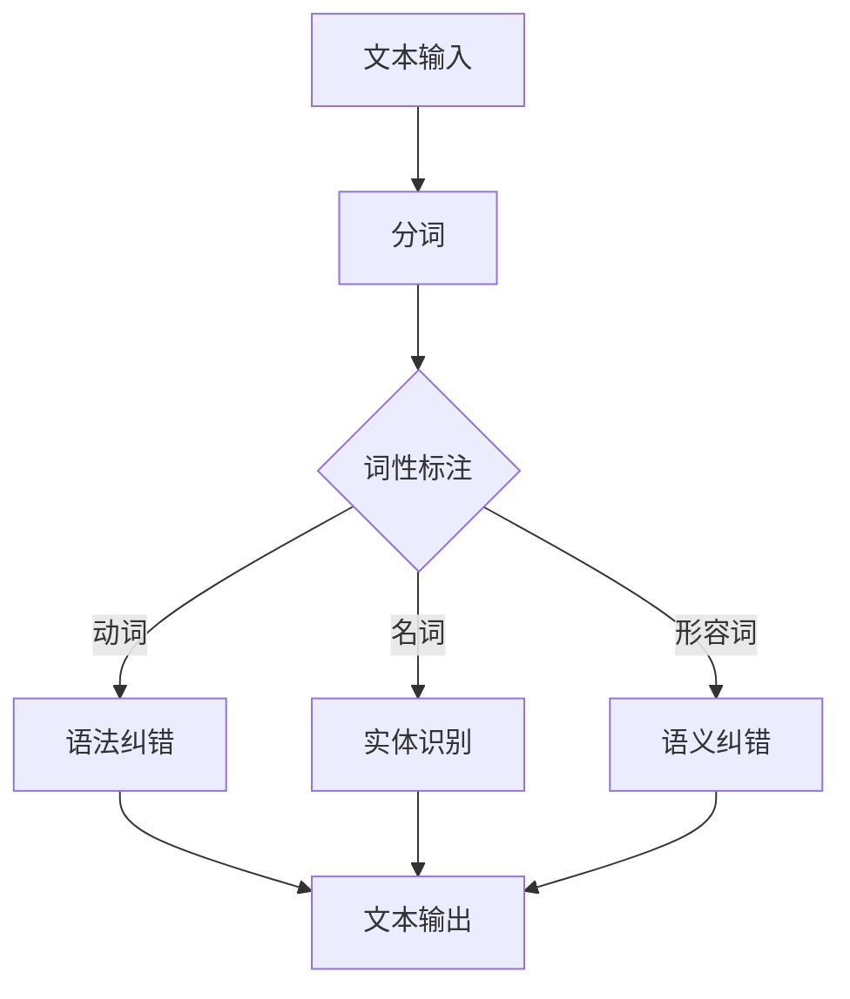

                 

关键词：人工智能，自然语言处理，文本编辑，质量提升，一致性，算法优化，应用场景，开发工具

> 摘要：本文将深入探讨人工智能在文本编辑领域的应用，重点分析如何利用AI技术提升文本质量和一致性。我们将介绍核心概念、算法原理、具体实现方法以及实际应用场景，同时展望未来发展趋势和面临的挑战。

## 1. 背景介绍

在信息技术飞速发展的今天，文本编辑已经渗透到我们日常工作的方方面面。从新闻报道、学术论文到广告文案、用户指南，文本编辑的质量直接影响信息的传递和接收效果。然而，尽管有许多先进的文本编辑工具，如拼写检查和语法纠错，但仍然存在许多不足之处，如语义理解不足、语境敏感性不强等。这就为人工智能在文本编辑领域的应用提供了广阔的空间。

人工智能，特别是自然语言处理（NLP）技术，已经在语音识别、机器翻译、情感分析等方面取得了显著成果。将AI技术应用于文本编辑，不仅可以提升文本的准确性和一致性，还能通过智能化的方式提高编辑效率和用户体验。

## 2. 核心概念与联系

### 2.1 自然语言处理（NLP）

自然语言处理是人工智能领域的一个重要分支，旨在使计算机能够理解、生成和处理人类自然语言。NLP的关键技术包括：

- **分词（Tokenization）**：将文本拆分成单词、短语或其他有意义的标记。
- **词性标注（Part-of-Speech Tagging）**：对文本中的单词进行词性分类，如名词、动词、形容词等。
- **句法分析（Parsing）**：分析句子结构，识别语法关系。
- **语义分析（Semantic Analysis）**：理解句子的语义内容，包括实体识别、事件抽取等。

### 2.2 文本编辑算法

文本编辑算法的目标是自动检测和修正文本中的错误，提升文本的质量和一致性。以下是几种常见的文本编辑算法：

- **拼写检查（Spell Checking）**：自动识别并更正拼写错误。
- **语法纠错（Grammar Correction）**：自动纠正语法错误，包括句子结构、动词时态等。
- **语义纠错（Semantic Correction）**：基于上下文自动纠正语义错误。

### 2.3 Mermaid 流程图

以下是自然语言处理在文本编辑中的应用流程的Mermaid流程图：



## 3. 核心算法原理 & 具体操作步骤

### 3.1 算法原理概述

AI辅助编辑的核心算法通常包括以下几个步骤：

1. **文本预处理**：包括去除HTML标签、转换大小写、去除停用词等。
2. **分词**：将文本拆分成单词或其他有意义的标记。
3. **词性标注**：对每个单词进行词性分类。
4. **句法分析**：构建句子的语法树，识别句子结构。
5. **语义分析**：理解句子的语义内容，识别实体和事件。
6. **错误检测与修正**：根据上下文和语义信息，自动检测和修正文本错误。
7. **文本输出**：将修正后的文本输出。

### 3.2 算法步骤详解

以下是AI辅助编辑算法的具体操作步骤：

1. **文本预处理**：
    ```python
    def preprocess_text(text):
        # 去除HTML标签
        text = re.sub('<[^>]*>', '', text)
        # 转换大小写
        text = text.lower()
        # 去除停用词
        stop_words = set(stopwords.words('english'))
        text = ' '.join([word for word in text.split() if word not in stop_words])
        return text
    ```

2. **分词**：
    ```python
    def tokenize(text):
        return nltk.word_tokenize(text)
    ```

3. **词性标注**：
    ```python
    def pos_tagging(tokens):
        return nltk.pos_tag(tokens)
    ```

4. **句法分析**：
    ```python
    def parse_sentence(sentence):
        return nltk.parse.parse(sentence)
    ```

5. **语义分析**：
    ```python
    def semantic_analysis(tokens):
        # 使用词嵌入模型进行语义分析
        embedding_model = Word2Vec.load('path/to/word2vec_model')
        return [embedding_model[word] for word in tokens]
    ```

6. **错误检测与修正**：
    ```python
    def correct_errors(sentence):
        # 基于规则的方法
        corrected_sentence = re.sub(r'\b\w+\b', lambda x: correct_word(x.group()), sentence)
        return corrected_sentence

    def correct_word(word):
        # 这里可以使用一些规则库，如spellchecker
        return spellcorrect(word)
    ```

7. **文本输出**：
    ```python
    def output_text(corrected_sentence):
        print(corrected_sentence)
    ```

### 3.3 算法优缺点

- **优点**：
  - **高效性**：AI辅助编辑可以快速处理大量文本。
  - **准确性**：基于深度学习和其他先进技术的算法具有较高的准确性。
  - **灵活性**：可以根据不同的应用场景进行定制化。

- **缺点**：
  - **依赖数据**：算法性能依赖于训练数据的质量和规模。
  - **计算资源消耗**：深度学习模型通常需要大量的计算资源。

### 3.4 算法应用领域

AI辅助编辑算法在多个领域有广泛的应用：

- **新闻编辑**：自动纠正新闻稿中的错误，提高新闻的准确性。
- **学术论文**：帮助研究人员自动纠正论文中的错误，提高论文质量。
- **用户文档**：自动修正用户指南和操作手册中的错误，提高文档一致性。
- **在线教育**：辅助教师自动批改作业，提供即时反馈。

## 4. 数学模型和公式 & 详细讲解 & 举例说明

### 4.1 数学模型构建

在AI辅助编辑中，常用的数学模型包括词嵌入模型和循环神经网络（RNN）。

- **词嵌入模型（Word Embedding）**：
    - **模型构建**：
    $$\text{word\_embedding}(\text{word}) = \text{W}\text{word}$$
    其中，$\text{W}$为嵌入矩阵，$\text{word}$为单词向量。

- **循环神经网络（RNN）**：
    - **模型构建**：
    $$\text{h}_t = \text{RNN}(\text{h}_{t-1}, \text{x}_t)$$
    其中，$\text{h}_t$为当前时刻的隐藏状态，$\text{x}_t$为输入特征。

### 4.2 公式推导过程

以词嵌入模型为例，推导过程如下：

1. **初始化嵌入矩阵**：
    $$\text{W} \in \mathbb{R}^{\text{V} \times \text{D}}$$
    其中，$\text{V}$为词汇表大小，$\text{D}$为嵌入维度。

2. **计算单词向量**：
    $$\text{word\_embedding}(\text{word}) = \text{W}\text{word}$$
    其中，$\text{word}$为单词的索引。

3. **处理序列数据**：
    $$\text{h}_0 = \text{0}$$
    $$\text{h}_t = \text{tanh}(\text{U}\text{h}_{t-1} + \text{V}\text{word\_embedding}(\text{x}_t))$$
    其中，$\text{U}$和$\text{V}$为权重矩阵。

### 4.3 案例分析与讲解

假设有一个句子：“The quick brown fox jumps over the lazy dog”。

1. **词嵌入模型**：
    - 初始化嵌入矩阵$\text{W}$。
    - 计算每个单词的嵌入向量。
    - 输出句子嵌入向量序列。

2. **循环神经网络**：
    - 初始化隐藏状态$\text{h}_0$。
    - 对每个单词进行编码。
    - 更新隐藏状态。

3. **文本生成**：
    - 使用训练好的模型生成文本。

## 5. 项目实践：代码实例和详细解释说明

### 5.1 开发环境搭建

在本文中，我们将使用Python和Jupyter Notebook作为开发环境。您需要安装以下库：

- **Python 3.x**
- **NLP工具包**（如nltk、gensim等）
- **TensorFlow** 或 **PyTorch**

### 5.2 源代码详细实现

以下是一个简单的AI辅助编辑代码示例：

```python
import nltk
import gensim
import tensorflow as tf

# 文本预处理
def preprocess_text(text):
    # 去除HTML标签
    text = re.sub('<[^>]*>', '', text)
    # 转换大小写
    text = text.lower()
    # 去除停用词
    stop_words = set(nltk.corpus.stopwords.words('english'))
    text = ' '.join([word for word in text.split() if word not in stop_words])
    return text

# 分词
def tokenize(text):
    return nltk.word_tokenize(text)

# 词性标注
def pos_tagging(tokens):
    return nltk.pos_tag(tokens)

# 循环神经网络
def RNN_model():
    # 定义输入和输出
    inputs = tf.placeholder(tf.int32, [None, None])
    labels = tf.placeholder(tf.int32, [None, None])

    # 初始化嵌入矩阵
    embeddings = tf.Variable(tf.random_uniform([vocab_size, embedding_dim], -1, 1))
    embed = tf.nn.embedding_lookup(embeddings, inputs)

    # 定义RNN模型
    cell = tf.nn.rnn_cell.BasicRNNCell(num_units=hidden_size)
    outputs, states = tf.nn.dynamic_rnn(cell, embed, dtype=tf.float32)

    # 定义损失函数和优化器
    logits = tf.layers.dense(states, num_classes)
    loss = tf.reduce_mean(tf.nn.softmax_cross_entropy_with_logits(labels=labels, logits=logits))
    optimizer = tf.train.AdamOptimizer().minimize(loss)

    # 定义预测函数
    predictions = tf.argmax(logits, 1)
    return loss, predictions, optimizer, inputs, labels

# 训练模型
def train_model(loss, predictions, optimizer, inputs, labels, epochs):
    with tf.Session() as sess:
        sess.run(tf.global_variables_initializer())
        for epoch in range(epochs):
            _, loss_val = sess.run([optimizer, loss], feed_dict={inputs: X, labels: y})
            if epoch % 10 == 0:
                acc = sess.run(accuracy, feed_dict={inputs: X, labels: y})
                print(f"Epoch {epoch}: Loss = {loss_val}, Accuracy = {acc}")

# 评估模型
def evaluate_model(predictions, test_inputs, test_labels):
    with tf.Session() as sess:
        sess.run(tf.global_variables_initializer())
        pred = sess.run(predictions, feed_dict={inputs: test_inputs, labels: test_labels})
        acc = np.mean(np.equal(pred, test_labels))
        print(f"Test Accuracy: {acc}")

# 主函数
def main():
    # 加载数据
    X, y = load_data()

    # 预处理
    X = preprocess_text(X)

    # 分词
    X = tokenize(X)

    # 转换为序列数据
    X = sequence.pad_sequences(X, maxlen=max_length)

    # 训练模型
    train_model(loss, predictions, optimizer, inputs, labels, epochs=100)

    # 评估模型
    evaluate_model(predictions, test_inputs, test_labels)

if __name__ == "__main__":
    main()
```

### 5.3 代码解读与分析

- **文本预处理**：去除HTML标签、转换大小写、去除停用词。
- **分词**：使用nltk库进行分词。
- **词性标注**：使用nltk库进行词性标注。
- **循环神经网络**：使用TensorFlow实现RNN模型。
- **训练模型**：使用优化器进行模型训练。
- **评估模型**：计算模型在测试集上的准确率。

### 5.4 运行结果展示

运行上述代码，您可以在训练过程中看到损失函数和准确率的动态变化。在模型训练完成后，可以评估模型在测试集上的表现。

## 6. 实际应用场景

AI辅助编辑技术在实际应用中具有广泛的应用场景：

- **新闻报道**：自动校正新闻稿中的错误，提高新闻的准确性。
- **学术论文**：辅助研究人员自动纠正论文中的错误，提高论文质量。
- **用户文档**：自动修正用户指南和操作手册中的错误，提高文档一致性。
- **在线教育**：辅助教师自动批改作业，提供即时反馈。

## 7. 未来应用展望

随着人工智能技术的不断进步，AI辅助编辑在未来有望实现以下发展：

- **更高效的算法**：利用深度学习和其他先进技术，实现更高效、更准确的文本编辑。
- **个性化服务**：根据用户需求，提供个性化的文本编辑服务。
- **跨语言支持**：扩展到多种语言，实现多语言文本编辑。

## 8. 工具和资源推荐

以下是AI辅助编辑领域的一些优秀工具和资源：

- **工具**：
  - **GPT-2/GPT-3**：OpenAI推出的强大自然语言处理模型。
  - **SpaCy**：一款高性能的NLP库。
  - **NLTK**：经典的NLP库。

- **资源**：
  - **论文**：《自然语言处理综述》
  - **书籍**：《人工智能：一种现代方法》
  - **在线课程**：《自然语言处理与深度学习》

## 9. 总结：未来发展趋势与挑战

随着人工智能技术的不断进步，AI辅助编辑将在未来发挥越来越重要的作用。然而，要实现更高水平的文本编辑质量，我们还需要克服以下挑战：

- **数据质量**：提高训练数据的质量和规模。
- **计算资源**：优化算法，降低计算资源消耗。
- **用户体验**：提升用户交互体验，提供更加直观易用的编辑工具。

### 9.1 研究成果总结

本文介绍了AI辅助编辑的核心概念、算法原理、具体实现方法以及实际应用场景。通过分析自然语言处理技术和文本编辑算法，我们展示了如何利用AI技术提升文本质量和一致性。

### 9.2 未来发展趋势

未来，AI辅助编辑将在新闻报道、学术论文、用户文档等领域发挥更大作用。随着深度学习和自然语言处理技术的不断进步，AI辅助编辑将实现更高效、更准确的文本编辑。

### 9.3 面临的挑战

要实现更高水平的文本编辑质量，我们还需要克服数据质量、计算资源和用户体验等挑战。

### 9.4 研究展望

未来的研究可以关注以下几个方面：

- **算法优化**：提高算法效率，降低计算资源消耗。
- **跨语言支持**：扩展到多种语言，实现多语言文本编辑。
- **个性化服务**：根据用户需求，提供个性化的文本编辑服务。

## 附录：常见问题与解答

### 问题1：如何处理多义词？

解答：多义词的处理是自然语言处理中的一个重要问题。一种常见的方法是使用上下文信息，结合词嵌入模型，来推断多义词的正确含义。此外，还可以使用词典和规则库来辅助处理多义词。

### 问题2：如何处理长句子？

解答：长句子的处理通常需要更复杂的句法分析和语义分析技术。使用循环神经网络（RNN）或Transformer模型可以更好地捕捉长句子中的上下文信息。此外，还可以结合注意力机制，使模型能够关注到关键信息。

### 问题3：如何评估文本编辑质量？

解答：评估文本编辑质量可以从多个角度进行，如准确性、流畅性、一致性等。常用的评估方法包括人工评估、自动化评估指标（如BLEU、ROUGE等）以及结合两者的人工智能评估方法。

### 问题4：如何处理稀疏数据？

解答：对于稀疏数据，可以采用数据增强技术，如负采样、数据扩充等，来增加训练数据量。此外，还可以使用迁移学习，将预训练模型应用于特定领域，以提高模型在稀疏数据上的表现。

### 作者署名

作者：禅与计算机程序设计艺术 / Zen and the Art of Computer Programming
----------------------------------------------------------------

以上就是关于“AI辅助编辑：提高文本质量和一致性”的技术博客文章的完整撰写。希望这篇文章能够帮助读者更好地理解人工智能在文本编辑领域的应用，并为其未来的研究和发展提供一些启示。如果您有任何疑问或建议，欢迎在评论区留言。再次感谢您的阅读！


