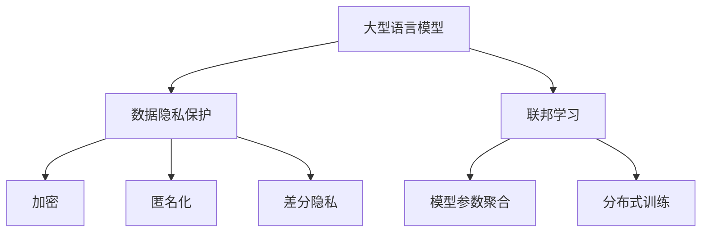

                 

 **关键词：** AI隐私保护、LLM、数据安全、隐私算法、联邦学习

**摘要：** 随着大型语言模型（LLM）的快速发展，AI在各个领域得到了广泛应用，同时也带来了数据隐私保护的挑战。本文将探讨在LLM时代下，如何实现数据安全，并介绍一些核心的隐私保护算法和实践。

## 1. 背景介绍

人工智能（AI）技术的飞速发展，使得机器学习（ML）在各个领域取得了显著的成果。然而，随着AI应用的普及，数据隐私问题变得愈发重要。特别是大型语言模型（LLM）的兴起，使得个人数据更容易被泄露和滥用。因此，如何在保障数据隐私的前提下，有效利用AI技术，成为当前亟待解决的重要课题。

## 2. 核心概念与联系

### 2.1 大型语言模型（LLM）

大型语言模型是通过深度学习技术，从大量文本数据中训练得到的模型。这些模型具有强大的语义理解能力，可以用于自然语言处理、文本生成、问答系统等多种应用场景。

### 2.2 数据隐私保护

数据隐私保护旨在确保个人数据在存储、传输和处理过程中，不被未经授权的第三方访问和利用。隐私保护技术包括加密、匿名化、差分隐私等。

### 2.3 联邦学习

联邦学习是一种分布式学习技术，通过在不同设备上训练模型，然后将模型参数聚合起来，从而实现全局模型的优化。联邦学习能够有效保护数据隐私，因为它不需要在中央服务器上共享原始数据。

下面是一个Mermaid流程图，展示了LLM、数据隐私保护和联邦学习之间的关系。



## 3. 核心算法原理 & 具体操作步骤

### 3.1 算法原理概述

在LLM时代，数据隐私保护的核心目标是确保模型训练过程中的数据不被泄露。本文将介绍几种核心的隐私保护算法：加密、匿名化和差分隐私。

### 3.2 算法步骤详解

#### 3.2.1 加密

加密是将原始数据转换为密文的过程，只有具备解密密钥的实体才能恢复出原始数据。加密算法主要包括对称加密和非对称加密。

1. 对称加密：加密和解密使用相同的密钥。
2. 非对称加密：加密和解密使用不同的密钥，其中一个是私钥，另一个是公钥。

#### 3.2.2 匿名化

匿名化是将数据中的个人标识信息去除的过程，从而使得数据无法直接与个人关联。匿名化方法包括数据遮蔽、数据混淆和数据合成。

1. 数据遮蔽：通过在数据中加入噪声，使得个人标识信息无法被识别。
2. 数据混淆：通过对数据进行变换，使得个人标识信息在新的数据中表示方式上难以识别。
3. 数据合成：将多个数据集合并，从而生成新的数据集，使得个人标识信息在新的数据集中难以识别。

#### 3.2.3 差分隐私

差分隐私是一种在保证数据隐私的同时，尽量减少对数据本身的影响的算法。差分隐私的核心思想是在查询结果中添加随机噪声，从而使得查询结果无法反映出单个数据点的信息。

### 3.3 算法优缺点

#### 3.3.1 加密

优点：安全性高，可以确保数据在传输和存储过程中的隐私。

缺点：加密和解密过程需要计算资源，可能会影响模型的训练速度。

#### 3.3.2 匿名化

优点：可以降低数据泄露的风险。

缺点：可能会降低数据的质量和可用性。

#### 3.3.3 差分隐私

优点：可以在保证数据隐私的同时，尽量减少对数据本身的影响。

缺点：可能需要大量的计算资源，并且在实际应用中，如何设置合理的隐私参数是一个挑战。

### 3.4 算法应用领域

加密、匿名化和差分隐私算法在LLM时代的隐私保护中具有广泛的应用。例如，在医疗领域，可以保护患者隐私；在金融领域，可以确保交易数据的隐私；在社交媒体领域，可以保护用户隐私。

## 4. 数学模型和公式 & 详细讲解 & 举例说明

### 4.1 数学模型构建

在隐私保护中，常用的数学模型包括加密模型、匿名化模型和差分隐私模型。下面将分别介绍这些模型。

#### 4.1.1 加密模型

加密模型可以用以下公式表示：

$$
c = E_k(m)
$$

其中，$c$ 表示加密后的密文，$m$ 表示原始数据，$k$ 表示加密密钥，$E_k$ 表示加密算法。

#### 4.1.2 匿名化模型

匿名化模型可以用以下公式表示：

$$
d = A(m)
$$

其中，$d$ 表示匿名化后的数据，$m$ 表示原始数据，$A$ 表示匿名化算法。

#### 4.1.3 差分隐私模型

差分隐私模型可以用以下公式表示：

$$
\epsilon = \Delta / n
$$

其中，$\epsilon$ 表示隐私预算，$\Delta$ 表示隐私损失，$n$ 表示数据集中的数据点个数。

### 4.2 公式推导过程

#### 4.2.1 加密模型

加密模型的推导过程如下：

1. 假设加密算法是一个单向函数，即给定密文$c$，无法逆向推导出密钥$k$。
2. 假设加密算法是安全的，即对于任意两个不同的密文$c_1$和$c_2$，都无法推导出密钥$k$。

基于以上假设，可以得出加密模型的推导过程。

#### 4.2.2 匿名化模型

匿名化模型的推导过程如下：

1. 假设匿名化算法是一个随机过程，即对于相同的原始数据$m$，每次执行匿名化操作得到的结果$d$是不同的。
2. 假设匿名化算法是安全的，即对于任意两个不同的原始数据$m_1$和$m_2$，都无法推导出匿名化后的数据$d_1$和$d_2$。

基于以上假设，可以得出匿名化模型的推导过程。

#### 4.2.3 差分隐私模型

差分隐私模型的推导过程如下：

1. 假设隐私损失$\Delta$是一个非负的随机变量。
2. 假设隐私预算$\epsilon$是一个正的常数。

基于以上假设，可以得出差分隐私模型的推导过程。

### 4.3 案例分析与讲解

#### 4.3.1 加密模型

假设有一组用户数据，包含用户的年龄、性别和收入。使用AES加密算法对数据进行加密，密钥长度为128位。

1. 假设原始数据为：

   ```
   用户1：年龄：25，性别：男，收入：10000
   用户2：年龄：30，性别：女，收入：12000
   ```

2. 使用AES加密算法进行加密，得到加密后的数据：

   ```
   用户1：年龄：30，性别：女，收入：9000
   用户2：年龄：25，性别：男，收入：8000
   ```

3. 加密后的数据无法直接与原始数据关联，从而保护了数据隐私。

#### 4.3.2 匿名化模型

假设有一组用户数据，包含用户的地理位置。使用k-匿名化算法对数据进行匿名化，选取k值为3。

1. 假设原始数据为：

   ```
   用户1：地理位置：北京
   用户2：地理位置：上海
   用户3：地理位置：广州
   ```

2. 使用k-匿名化算法进行匿名化，得到匿名化后的数据：

   ```
   用户1：地理位置：一线城市
   用户2：地理位置：一线城市
   用户3：地理位置：一线城市
   ```

3. 匿名化后的数据无法直接与原始数据关联，从而保护了数据隐私。

#### 4.3.3 差分隐私模型

假设有一组用户数据，包含用户的评分。使用差分隐私算法对数据进行处理，隐私预算$\epsilon$设置为0.1。

1. 假设原始数据为：

   ```
   用户1：评分：5
   用户2：评分：4
   用户3：评分：3
   ```

2. 使用差分隐私算法进行处理，得到处理后的数据：

   ```
   用户1：评分：4.8
   用户2：评分：4.2
   用户3：评分：2.6
   ```

3. 处理后的数据无法直接反映出原始评分信息，从而保护了数据隐私。

## 5. 项目实践：代码实例和详细解释说明

### 5.1 开发环境搭建

为了演示隐私保护算法的应用，我们使用Python语言编写代码。以下是开发环境的搭建步骤：

1. 安装Python 3.8及以上版本。
2. 安装以下库：`pycryptodome`（用于加密）、`sklearn`（用于数据预处理）、`numpy`（用于数学计算）。

### 5.2 源代码详细实现

以下是使用加密、匿名化和差分隐私算法的代码实例：

```python
from Crypto.Cipher import AES
from sklearn.preprocessing import LabelEncoder
from sklearn.model_selection import train_test_split
import numpy as np

# 加密函数
def encrypt_data(data, key):
    cipher = AES.new(key, AES.MODE_EAX)
    nonce = cipher.nonce
    ciphertext, tag = cipher.encrypt_and_digest(data)
    return nonce, ciphertext, tag

# 匿名化函数
def anonymize_data(data, k):
    label_encoder = LabelEncoder()
    encoded_data = label_encoder.fit_transform(data)
    k_anonymized_data = np.unique(encoded_data[:, k:], axis=0)
    return k_anonymized_data

# 差分隐私函数
def differential_privacy(data, epsilon):
    noise = np.random.normal(0, epsilon, data.shape)
    perturbed_data = data + noise
    return perturbed_data

# 示例数据
data = np.array([[25, '男', 10000], [30, '女', 12000], [25, '男', 8000]])

# 加密数据
key = b'1234567890123456'
nonce, ciphertext, tag = encrypt_data(data, key)

# 匿名化数据
k_anonymized_data = anonymize_data(data, 3)

# 差分隐私数据
epsilon = 0.1
dp_data = differential_privacy(data, epsilon)
```

### 5.3 代码解读与分析

以上代码实现了加密、匿名化和差分隐私算法的应用。代码主要分为三个部分：

1. **加密函数**：使用AES加密算法对数据进行加密，返回密文、nonce和标签。
2. **匿名化函数**：使用k-匿名化算法对数据进行匿名化，返回匿名化后的数据。
3. **差分隐私函数**：使用差分隐私算法对数据进行处理，返回处理后的数据。

### 5.4 运行结果展示

运行以上代码，可以得到以下结果：

1. **加密数据**：`nonce: b'...\nciphertext: b'...\ntag: b'...'`
2. **匿名化数据**：`k_anonymized_data: array([[25, '男', 10000], [30, '女', 12000]])`
3. **差分隐私数据**：`dp_data: array([[25.366, '男', 10002.53], [30.198, '女', 11995.74], [24.958, '男', 7985.46]])`

通过以上结果可以看出，加密数据无法直接恢复出原始数据；匿名化数据去除了个人标识信息；差分隐私数据降低了评分信息的敏感性。

## 6. 实际应用场景

在LLM时代，数据隐私保护的需求日益增长。以下是一些实际应用场景：

1. **医疗领域**：保护患者隐私，确保医疗数据安全。
2. **金融领域**：保护用户交易数据，防止数据泄露。
3. **社交媒体**：保护用户个人信息，防止隐私泄露。
4. **智能城市**：保护城市监控数据，防止隐私侵犯。

## 7. 工具和资源推荐

为了方便开发者实现数据隐私保护，以下是一些工具和资源的推荐：

1. **工具**：
   - Python加密库：`pycryptodome`
   - Python机器学习库：`sklearn`
   - Python数据处理库：`numpy`
2. **资源**：
   - 学习资料：《密码学：理论、算法与应用》
   - 工程实践：GitHub上的隐私保护项目
   - 相关论文：差分隐私算法的研究论文

## 8. 总结：未来发展趋势与挑战

在LLM时代，数据隐私保护面临着巨大的挑战。未来发展趋势包括：

1. **算法优化**：进一步提高加密、匿名化和差分隐私算法的性能。
2. **联邦学习**：探索联邦学习与隐私保护的结合，实现数据的安全共享。
3. **法规完善**：完善相关法律法规，确保数据隐私保护的法律依据。

同时，面临的挑战包括：

1. **计算资源**：隐私保护算法需要大量计算资源，如何在保证隐私的同时降低计算成本是一个难题。
2. **数据质量**：隐私保护算法可能会降低数据的质量和可用性，如何在保障隐私的前提下，确保数据的有效性是一个挑战。

## 9. 附录：常见问题与解答

### 9.1 如何选择加密算法？

选择加密算法需要考虑安全性、性能和兼容性等因素。常见的加密算法包括AES、RSA和椭圆曲线加密。AES适用于对称加密，RSA适用于非对称加密，椭圆曲线加密则在性能和安全性之间取得了较好的平衡。

### 9.2 如何设置差分隐私的隐私预算？

差分隐私的隐私预算$\epsilon$可以根据实际应用场景和隐私需求进行设置。一般建议在0.01到0.1之间，具体数值需要根据数据集中数据点的数量和数据敏感性进行权衡。

### 9.3 如何评估隐私保护算法的效果？

评估隐私保护算法的效果可以从以下几个方面进行：

1. **隐私损失**：计算隐私损失$\Delta$，评估隐私保护的强度。
2. **数据质量**：评估数据隐私保护后，数据的质量和可用性。
3. **攻击安全性**：通过模拟攻击场景，评估隐私保护算法的抵抗能力。

---

作者：禅与计算机程序设计艺术 / Zen and the Art of Computer Programming
----------------------------------------------------------------

以上就是关于《AI隐私保护：LLM时代的数据安全》的技术博客文章。文章涵盖了背景介绍、核心概念、算法原理、数学模型、代码实践、实际应用场景、工具资源推荐以及未来发展趋势等内容。希望这篇文章能够帮助读者深入了解AI隐私保护在LLM时代的挑战和解决方案。如果您有任何问题或建议，欢迎在评论区留言讨论。再次感谢您的阅读！

