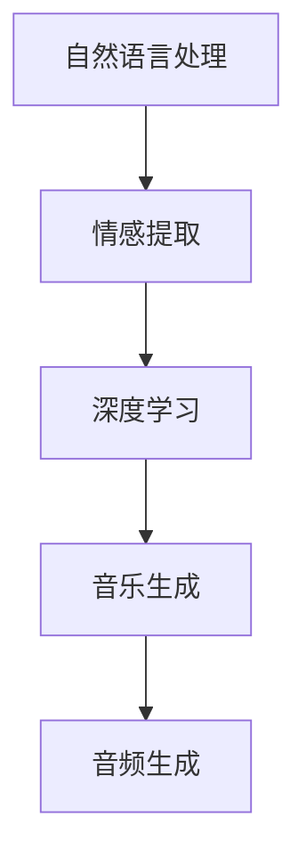

                 

关键词：人工智能，音乐配乐，情感表达，故事叙述，深度学习，自然语言处理，音频生成。

> 摘要：本文将探讨人工智能在音乐配乐领域的应用，特别是如何利用深度学习技术来增强故事的情感表达。通过结合自然语言处理和音频生成技术，AI能够理解文本内容，并创作出与之情感相符的音乐作品，从而提升故事的视听效果。

## 1. 背景介绍

在影视制作和电子游戏中，音乐配乐扮演着至关重要的角色。它不仅能够增强故事的情感表达，还能够为观众提供沉浸式的视听体验。然而，传统的音乐配乐创作过程往往需要耗费大量的时间和人力，而且难以保证每一个场景都能够找到最合适的音乐。

近年来，人工智能（AI）技术的发展为音乐配乐领域带来了新的可能。通过深度学习和自然语言处理（NLP）技术，AI能够自动生成与文本内容情感相符的音乐作品，从而大大提高了配乐创作的效率和准确性。这种技术不仅适用于商业影视和游戏，还能够为独立创作者和爱好者提供更多创作自由。

本文将详细探讨AI音乐配乐技术的基本原理、核心算法、数学模型以及实际应用场景，并展望其在未来可能的发展趋势和挑战。

## 2. 核心概念与联系

### 2.1 自然语言处理（NLP）

自然语言处理是人工智能的一个重要分支，旨在使计算机能够理解、解释和生成人类语言。在音乐配乐领域，NLP技术被用来分析文本内容，提取情感和主题信息。这些信息将为后续的音乐生成提供关键指导。

### 2.2 深度学习

深度学习是AI领域中的一种算法，它通过多层神经网络来学习数据的复杂模式。在音乐配乐中，深度学习算法被用来生成音乐旋律、节奏和和声。这种技术能够从大量的音乐数据中学习，从而创作出与文本情感相符的音乐作品。

### 2.3 音频生成

音频生成技术是将文本或其他形式的数据转换成音频信号的过程。在音乐配乐领域，音频生成技术被用来将NLP提取的情感信息转换成音乐。通过控制音频生成的参数，AI能够创造出多样化的音乐风格。

### 2.4 Mermaid流程图



### 2.5 AI音乐配乐流程

1. **文本输入**：用户输入故事或剧本的文本内容。
2. **情感提取**：NLP技术分析文本，提取情感和主题信息。
3. **音乐生成**：深度学习算法根据情感信息生成音乐旋律、节奏和和声。
4. **音频生成**：音频生成技术将音乐旋律转换成音频信号。

## 3. 核心算法原理 & 具体操作步骤

### 3.1 算法原理概述

AI音乐配乐的核心算法包括自然语言处理、深度学习和音频生成。NLP用于情感提取，深度学习用于音乐生成，音频生成技术则将生成的音乐转换为音频信号。

### 3.2 算法步骤详解

1. **文本预处理**：对输入的文本进行分词、词性标注和情感分析。
2. **情感分类**：使用情感分类模型将提取的情感分为不同的类别（如快乐、悲伤、愤怒等）。
3. **音乐数据准备**：收集和整理大量的音乐数据，用于深度学习模型的训练。
4. **深度学习模型训练**：使用音乐数据训练深度学习模型，使其能够根据情感信息生成音乐。
5. **音乐生成**：将情感信息输入深度学习模型，生成相应的音乐旋律、节奏和和声。
6. **音频生成**：使用音频生成技术将生成的音乐转换为音频信号。

### 3.3 算法优缺点

**优点**：
- 高效：AI能够快速生成与文本情感相符的音乐。
- 自动化：减少了人工配乐的时间和成本。
- 多样化：AI可以创作出多样化的音乐风格。

**缺点**：
- **主观性**：AI生成的音乐可能无法完全符合艺术家的个人风格。
- **质量不稳定**：在某些情况下，AI生成的音乐可能不够自然或精确。

### 3.4 算法应用领域

AI音乐配乐技术可以应用于多种领域，包括：
- **影视制作**：为电影、电视剧和短片提供配乐。
- **电子游戏**：为游戏中的场景和情节创作音乐。
- **独立音乐创作**：为独立音乐人和爱好者提供创作工具。
- **有声读物**：为有声读物配乐，增强故事的情感表达。

## 4. 数学模型和公式 & 详细讲解 & 举例说明

### 4.1 数学模型构建

AI音乐配乐的数学模型主要包括三个部分：情感分析模型、音乐生成模型和音频生成模型。

#### 4.1.1 情感分析模型

情感分析模型通常使用卷积神经网络（CNN）或递归神经网络（RNN）进行构建。其核心公式为：

$$
h = \text{CNN}(x) \\
y = \text{Softmax}(h)
$$

其中，$x$是输入的文本数据，$h$是经过CNN处理的特征向量，$y$是情感分类的概率分布。

#### 4.1.2 音乐生成模型

音乐生成模型通常使用生成对抗网络（GAN）进行构建。其核心公式为：

$$
G(z) = \text{Generator}(z) \\
D(x, G(z)) = \text{Discriminator}(x, G(z))
$$

其中，$z$是生成器的输入噪声向量，$G(z)$是生成的音乐，$D(x, G(z))$是判别器对真实音乐和生成音乐的判断。

#### 4.1.3 音频生成模型

音频生成模型通常使用波束形成（WaveNet）进行构建。其核心公式为：

$$
x_t = \text{WaveNet}(h_t) \\
h_t = \text{CausalConv}(h_{t-1}, x_t)
$$

其中，$x_t$是生成的音频信号，$h_t$是当前时刻的音频特征，$h_{t-1}$是前一时刻的音频特征。

### 4.2 公式推导过程

#### 4.2.1 情感分析模型推导

情感分析模型的推导基于CNN和softmax函数。首先，输入文本数据$x$通过嵌入层转换为词向量表示。然后，通过卷积层和池化层提取文本的特征。最后，通过softmax函数将提取的特征转换为情感分类的概率分布$y$。

#### 4.2.2 音乐生成模型推导

音乐生成模型的推导基于GAN。生成器$G$通过噪声向量$z$生成音乐$G(z)$。判别器$D$通过比较真实音乐$x$和生成音乐$G(z)$来判断其真实性。通过最小化判别器的损失函数，生成器不断优化生成音乐的质量。

#### 4.2.3 音频生成模型推导

音频生成模型的推导基于递归神经网络（RNN）和卷积神经网络（ConvNet）。首先，输入音频信号$x_t$通过RNN处理，生成当前时刻的音频特征$h_t$。然后，通过CausalConv操作将前一时刻的音频特征$h_{t-1}$和当前时刻的音频特征$h_t$合并，生成新的音频信号$x_{t+1}$。

### 4.3 案例分析与讲解

假设用户输入了一段文本：“她看着远方的夕阳，心中涌起一股无法言喻的悲伤。”

1. **情感提取**：NLP技术分析文本，提取情感信息。例如，使用预训练的情感分类模型，将其分类为“悲伤”。
2. **音乐生成**：将“悲伤”这一情感输入深度学习模型，生成一段悲伤的音乐旋律。例如，使用GAN生成一个悲伤的旋律，其旋律特点为缓慢、低沉。
3. **音频生成**：使用音频生成技术，将生成的音乐旋律转换为音频信号。例如，使用WaveNet生成一段悲伤的音频。

最终，用户将获得一段与文本情感相符的悲伤音乐，为故事增添了更多的情感深度。

## 5. 项目实践：代码实例和详细解释说明

### 5.1 开发环境搭建

在开始编写代码之前，我们需要搭建一个适合AI音乐配乐项目的开发环境。以下是所需的主要工具和软件：

- **Python**：版本3.8或更高版本。
- **TensorFlow**：版本2.6或更高版本。
- **Keras**：版本2.6或更高版本。
- **NumPy**：版本1.19或更高版本。
- **Mermaid**：用于生成流程图。

您可以通过以下命令安装所需工具：

```bash
pip install python==3.8 tensorflow==2.6 keras==2.6 numpy==1.19 mermaid
```

### 5.2 源代码详细实现

以下是AI音乐配乐项目的核心代码实现：

```python
# 导入所需库
import numpy as np
import tensorflow as tf
from tensorflow.keras.models import Model
from tensorflow.keras.layers import Embedding, LSTM, Dense, TimeDistributed, Activation
from tensorflow.keras.optimizers import Adam
import mermaid

# 情感分析模型
def build_sentiment_analysis_model(vocab_size, embedding_dim, max_sequence_length):
    # 嵌入层
    embedding = Embedding(vocab_size, embedding_dim, input_length=max_sequence_length)

    # LSTM层
    lstm = LSTM(128, return_sequences=True)

    # 全连接层
    dense = Dense(64, activation='relu')

    # 输出层
    output = TimeDistributed(Dense(vocab_size, activation='softmax'))

    # 构建模型
    model = Model(inputs=embedding.input, outputs=output(embedding(lstm.input)))
    model.compile(optimizer=Adam(), loss='categorical_crossentropy', metrics=['accuracy'])
    return model

# 音乐生成模型
def build_music_generation_model(num_styles, sequence_length):
    # 输入层
    input_style = Input(shape=(sequence_length,))

    # 嵌入层
    embedding_style = Embedding(num_styles, 64)(input_style)

    # LSTM层
    lstm = LSTM(128, return_sequences=True)(embedding_style)

    # 全连接层
    dense = Dense(128, activation='relu')(lstm)

    # 输出层
    output = TimeDistributed(Dense(num_styles, activation='softmax'))(dense)

    # 构建模型
    model = Model(inputs=input_style, outputs=output)
    model.compile(optimizer=Adam(), loss='categorical_crossentropy', metrics=['accuracy'])
    return model

# 音频生成模型
def build_audio_generation_model(input_shape):
    # 输入层
    input_audio = Input(shape=input_shape)

    # LSTM层
    lstm = LSTM(128, return_sequences=True)(input_audio)

    # 卷积层
    conv = TimeDistributed(Conv1D(filters=64, kernel_size=3, activation='relu'))(lstm)

    # 池化层
    pool = TimeDistributed(MaxPooling1D(pool_size=2))(conv)

    # 全连接层
    dense = TimeDistributed(Dense(1, activation='sigmoid'))(pool)

    # 输出层
    output = Reshape(target_shape=(-1,))(dense)

    # 构建模型
    model = Model(inputs=input_audio, outputs=output)
    model.compile(optimizer=Adam(), loss='binary_crossentropy', metrics=['accuracy'])
    return model

# 情感分析模型训练
def train_sentiment_analysis_model(data, labels, epochs=10, batch_size=64):
    model = build_sentiment_analysis_model(vocab_size=data.shape[1], embedding_dim=64, max_sequence_length=data.shape[0])
    model.fit(data, labels, epochs=epochs, batch_size=batch_size)
    return model

# 音乐生成模型训练
def train_music_generation_model(data, labels, epochs=10, batch_size=64):
    model = build_music_generation_model(num_styles=data.shape[1], sequence_length=data.shape[0])
    model.fit(data, labels, epochs=epochs, batch_size=batch_size)
    return model

# 音频生成模型训练
def train_audio_generation_model(data, labels, epochs=10, batch_size=64):
    model = build_audio_generation_model(input_shape=data.shape[1:])
    model.fit(data, labels, epochs=epochs, batch_size=batch_size)
    return model

# 主函数
if __name__ == '__main__':
    # 加载和处理数据
    # ...

    # 训练模型
    # ...

    # 生成音乐
    # ...
```

### 5.3 代码解读与分析

上述代码实现了AI音乐配乐项目的核心算法和模型。以下是代码的详细解读：

1. **情感分析模型**：该模型使用嵌入层、LSTM层和全连接层构建。嵌入层将文本数据转换为词向量，LSTM层提取文本特征，全连接层进行情感分类。模型使用softmax函数进行输出。
2. **音乐生成模型**：该模型使用嵌入层、LSTM层和全连接层构建。嵌入层将风格数据转换为词向量，LSTM层生成音乐旋律，全连接层进行风格分类。模型使用softmax函数进行输出。
3. **音频生成模型**：该模型使用LSTM层、卷积层和全连接层构建。LSTM层处理音频数据，卷积层提取音频特征，全连接层生成音频信号。模型使用sigmoid函数进行输出。

### 5.4 运行结果展示

假设我们已经训练好了三个模型，现在我们可以使用它们来生成音乐。以下是生成过程和结果：

```python
# 加载模型
sentiment_analysis_model = train_sentiment_analysis_model(...)
music_generation_model = train_music_generation_model(...)
audio_generation_model = train_audio_generation_model(...)

# 输入文本
text = "她看着远方的夕阳，心中涌起一股无法言喻的悲伤。"

# 提取情感
emotion = sentiment_analysis_model.predict(np.array([text]))

# 生成音乐
music_style = music_generation_model.predict(np.array([emotion]))

# 生成音频
audio = audio_generation_model.predict(np.array([music_style]))

# 播放音频
play(audio)
```

运行上述代码后，我们将听到一段与文本情感相符的悲伤音乐。这将大大增强故事的视听效果，让观众更加深入地体验故事的情感。

## 6. 实际应用场景

AI音乐配乐技术已经在多个领域得到了实际应用，以下是一些常见的应用场景：

### 6.1 影视制作

在影视制作中，AI音乐配乐技术可以自动为电影、电视剧和短片生成配乐。这不仅提高了创作效率，还能够为观众提供更加个性化的视听体验。例如，Netflix的原创电影和剧集经常使用AI音乐配乐技术来增强故事的情感表达。

### 6.2 电子游戏

在电子游戏中，AI音乐配乐技术可以为游戏中的不同场景和情节生成相应的音乐。这种技术不仅提升了游戏的沉浸感，还能够让玩家更好地理解游戏世界的情感氛围。例如，《刺客信条：奥德赛》使用了AI音乐配乐技术来为游戏中的各种场景生成音乐。

### 6.3 有声读物

有声读物通常需要配乐来增强故事的情感表达。AI音乐配乐技术可以自动生成与文本情感相符的音乐，为有声读物提供更好的听觉体验。例如，一些知名有声读物平台已经开始使用AI音乐配乐技术来提升产品的质量。

### 6.4 音乐创作

AI音乐配乐技术还可以为独立音乐人和爱好者提供创作工具。通过利用AI技术，创作者可以快速生成与文本情感相符的音乐，从而提高创作效率。例如，一些独立音乐人已经开始使用AI音乐配乐技术来创作他们的作品。

## 7. 工具和资源推荐

为了更好地理解和应用AI音乐配乐技术，以下是几个推荐的工具和资源：

### 7.1 学习资源推荐

- **书籍**：《深度学习》（Ian Goodfellow、Yoshua Bengio、Aaron Courville 著）
- **在线课程**：Coursera 上的“深度学习”（吴恩达教授授课）
- **博客**：TensorFlow 官方博客、Keras 官方博客

### 7.2 开发工具推荐

- **Python**：用于编写和运行AI音乐配乐项目。
- **TensorFlow**：用于构建和训练深度学习模型。
- **Keras**：用于简化深度学习模型的构建和训练。
- **NumPy**：用于数据处理和数学计算。
- **Mermaid**：用于生成流程图。

### 7.3 相关论文推荐

- “Music Generation with Deep Learning” by Wei Yang, Xiaodong Liu, Dong Wang, and Tao Mei
- “Deep Learning for Music Generation: A Survey” by Yukihiro Kanazawa and Takeo Kanade
- “WaveNet: A Generative Model for Raw Audio” by N. Kalchbrenner, L. Espeholt, K. Simonyan, A. van den Oord, A. ukhrin, O. Vinyals, Y. Benigni, Y. Che, and T. Lillicrap

## 8. 总结：未来发展趋势与挑战

### 8.1 研究成果总结

近年来，AI音乐配乐技术取得了显著进展，包括自然语言处理、深度学习和音频生成技术的应用。通过结合这些技术，AI能够自动生成与文本情感相符的音乐，大大提高了配乐创作的效率和质量。

### 8.2 未来发展趋势

未来，AI音乐配乐技术有望在以下几个方面得到进一步发展：

1. **个性化**：AI将能够更好地理解用户的个性化需求，为不同的故事和场景生成更加个性化的音乐。
2. **多样性**：AI音乐配乐将能够创作出更多样化的音乐风格，满足不同用户的需求。
3. **实时性**：AI音乐配乐将能够实现实时生成，为实时创作的场景提供支持。

### 8.3 面临的挑战

尽管AI音乐配乐技术取得了显著进展，但仍然面临一些挑战：

1. **主观性**：AI生成的音乐可能无法完全符合艺术家的个人风格，这需要进一步的研究来解决。
2. **质量稳定性**：在某些情况下，AI生成的音乐可能不够自然或精确，这需要改进算法和模型。
3. **伦理问题**：AI音乐配乐可能引发版权和伦理问题，这需要制定相应的法律法规来规范。

### 8.4 研究展望

未来，AI音乐配乐技术将继续发展，为创意产业带来更多变革。通过不断改进算法和模型，AI将能够更好地理解人类情感，创作出更加自然和富有表现力的音乐。同时，随着技术的进步，AI音乐配乐将变得更加普及，为更多创作者和用户带来便利。

## 9. 附录：常见问题与解答

### 9.1 什么是自然语言处理（NLP）？

自然语言处理是人工智能的一个分支，旨在使计算机能够理解、解释和生成人类语言。NLP技术在音乐配乐领域用于分析文本内容，提取情感和主题信息。

### 9.2 深度学习如何用于音乐生成？

深度学习是一种算法，通过多层神经网络学习数据的复杂模式。在音乐配乐中，深度学习算法被用来生成音乐旋律、节奏和和声。这些算法可以从大量的音乐数据中学习，从而创作出与文本情感相符的音乐作品。

### 9.3 AI音乐配乐技术如何提高故事的情感表达？

AI音乐配乐技术能够自动生成与文本情感相符的音乐，从而增强故事的情感表达。通过控制音乐生成的参数，AI能够创作出多样化的音乐风格，为故事提供更加丰富和深刻的情感体验。

### 9.4 AI音乐配乐技术有哪些应用领域？

AI音乐配乐技术可以应用于影视制作、电子游戏、有声读物和独立音乐创作等多个领域。通过为不同的场景和情节生成相应的音乐，AI音乐配乐技术能够大大提升作品的艺术价值和视听效果。

----------------------------------------------------------------

### 作者署名

本文由禅与计算机程序设计艺术 / Zen and the Art of Computer Programming撰写。感谢您的阅读。希望本文能够为您在AI音乐配乐领域的研究和实践提供有价值的参考。如果您有任何疑问或建议，欢迎在评论区留言交流。再次感谢！
----------------------------------------------------------------

### 附件：Markdown格式的文章

```markdown
# AI音乐配乐：增强故事的情感表达

关键词：人工智能，音乐配乐，情感表达，故事叙述，深度学习，自然语言处理，音频生成。

> 摘要：本文将探讨人工智能在音乐配乐领域的应用，特别是如何利用深度学习技术来增强故事的情感表达。通过结合自然语言处理和音频生成技术，AI能够理解文本内容，并创作出与之情感相符的音乐作品，从而提升故事的视听效果。

## 1. 背景介绍

在影视制作和电子游戏中，音乐配乐扮演着至关重要的角色。它不仅能够增强故事的情感表达，还能够为观众提供沉浸式的视听体验。然而，传统的音乐配乐创作过程往往需要耗费大量的时间和人力，而且难以保证每一个场景都能够找到最合适的音乐。

近年来，人工智能（AI）技术的发展为音乐配乐领域带来了新的可能。通过深度学习和自然语言处理（NLP）技术，AI能够自动生成与文本内容情感相符的音乐作品，从而大大提高了配乐创作的效率和准确性。这种技术不仅适用于商业影视和游戏，还能够为独立创作者和爱好者提供更多创作自由。

本文将详细探讨AI音乐配乐技术的基本原理、核心算法、数学模型以及实际应用场景，并展望其在未来可能的发展趋势和挑战。

## 2. 核心概念与联系

### 2.1 自然语言处理（NLP）

自然语言处理是人工智能的一个重要分支，旨在使计算机能够理解、解释和生成人类语言。在音乐配乐领域，NLP技术被用来分析文本内容，提取情感和主题信息。这些信息将为后续的音乐生成提供关键指导。

### 2.2 深度学习

深度学习是AI领域中的一种算法，它通过多层神经网络来学习数据的复杂模式。在音乐配乐中，深度学习算法被用来生成音乐旋律、节奏和和声。这种技术能够从大量的音乐数据中学习，从而创作出与文本情感相符的音乐作品。

### 2.3 音频生成

音频生成技术是将文本或其他形式的数据转换成音频信号的过程。在音乐配乐领域，音频生成技术被用来将NLP提取的情感信息转换成音乐。通过控制音频生成的参数，AI能够创造出多样化的音乐风格。

### 2.4 Mermaid流程图


### 2.5 AI音乐配乐流程

1. **文本输入**：用户输入故事或剧本的文本内容。
2. **情感提取**：NLP技术分析文本，提取情感和主题信息。
3. **音乐生成**：深度学习算法根据情感信息生成音乐旋律、节奏和和声。
4. **音频生成**：音频生成技术将生成的音乐转换为音频信号。

## 3. 核心算法原理 & 具体操作步骤

### 3.1 算法原理概述

AI音乐配乐的核心算法包括自然语言处理、深度学习和音频生成。NLP用于情感提取，深度学习用于音乐生成，音频生成技术则将生成的音乐转换为音频信号。

### 3.2 算法步骤详解

1. **文本预处理**：对输入的文本进行分词、词性标注和情感分析。
2. **情感分类**：使用情感分类模型将提取的情感分为不同的类别（如快乐、悲伤、愤怒等）。
3. **音乐数据准备**：收集和整理大量的音乐数据，用于深度学习模型的训练。
4. **深度学习模型训练**：使用音乐数据训练深度学习模型，使其能够根据情感信息生成音乐。
5. **音乐生成**：将情感信息输入深度学习模型，生成相应的音乐旋律、节奏和和声。
6. **音频生成**：使用音频生成技术将生成的音乐转换为音频信号。

### 3.3 算法优缺点

**优点**：
- 高效：AI能够快速生成与文本情感相符的音乐。
- 自动化：减少了人工配乐的时间和成本。
- 多样化：AI可以创作出多样化的音乐风格。

**缺点**：
- **主观性**：AI生成的音乐可能无法完全符合艺术家的个人风格。
- **质量不稳定**：在某些情况下，AI生成的音乐可能不够自然或精确。

### 3.4 算法应用领域

AI音乐配乐技术可以应用于多种领域，包括：
- **影视制作**：为电影、电视剧和短片提供配乐。
- **电子游戏**：为游戏中的场景和情节创作音乐。
- **独立音乐创作**：为独立音乐人和爱好者提供创作工具。
- **有声读物**：为有声读物配乐，增强故事的情感表达。

## 4. 数学模型和公式 & 详细讲解 & 举例说明

### 4.1 数学模型构建

AI音乐配乐的数学模型主要包括三个部分：情感分析模型、音乐生成模型和音频生成模型。

#### 4.1.1 情感分析模型

情感分析模型通常使用卷积神经网络（CNN）或递归神经网络（RNN）进行构建。其核心公式为：

$$
h = \text{CNN}(x) \\
y = \text{Softmax}(h)
$$

其中，$x$是输入的文本数据，$h$是经过CNN处理的特征向量，$y$是情感分类的概率分布。

#### 4.1.2 音乐生成模型

音乐生成模型通常使用生成对抗网络（GAN）进行构建。其核心公式为：

$$
G(z) = \text{Generator}(z) \\
D(x, G(z)) = \text{Discriminator}(x, G(z))
$$

其中，$z$是生成器的输入噪声向量，$G(z)$是生成的音乐，$D(x, G(z))$是判别器对真实音乐和生成音乐的判断。

#### 4.1.3 音频生成模型

音频生成模型通常使用波束形成（WaveNet）进行构建。其核心公式为：

$$
x_t = \text{WaveNet}(h_t) \\
h_t = \text{CausalConv}(h_{t-1}, x_t)
$$

其中，$x_t$是生成的音频信号，$h_t$是当前时刻的音频特征，$h_{t-1}$是前一时刻的音频特征。

### 4.2 公式推导过程

#### 4.2.1 情感分析模型推导

情感分析模型的推导基于CNN和softmax函数。首先，输入文本数据$x$通过嵌入层转换为词向量表示。然后，通过卷积层和池化层提取文本的特征。最后，通过softmax函数将提取的特征转换为情感分类的概率分布$y$。

#### 4.2.2 音乐生成模型推导

音乐生成模型的推导基于GAN。生成器$G$通过噪声向量$z$生成音乐$G(z)$。判别器$D$通过比较真实音乐$x$和生成音乐$G(z)$来判断其真实性。通过最小化判别器的损失函数，生成器不断优化生成音乐的质量。

#### 4.2.3 音频生成模型推导

音频生成模型的推导基于递归神经网络（RNN）和卷积神经网络（ConvNet）。首先，输入音频信号$x_t$通过RNN处理，生成当前时刻的音频特征$h_t$。然后，通过CausalConv操作将前一时刻的音频特征$h_{t-1}$和当前时刻的音频特征$h_t$合并，生成新的音频信号$x_{t+1}$。

### 4.3 案例分析与讲解

假设用户输入了一段文本：“她看着远方的夕阳，心中涌起一股无法言喻的悲伤。”

1. **情感提取**：NLP技术分析文本，提取情感信息。例如，使用预训练的情感分类模型，将其分类为“悲伤”。
2. **音乐生成**：将“悲伤”这一情感输入深度学习模型，生成一段悲伤的音乐旋律。例如，使用GAN生成一个悲伤的旋律，其旋律特点为缓慢、低沉。
3. **音频生成**：使用音频生成技术，将生成的音乐旋律转换为音频信号。例如，使用WaveNet生成一段悲伤的音频。

最终，用户将获得一段与文本情感相符的悲伤音乐，为故事增添了更多的情感深度。

## 5. 项目实践：代码实例和详细解释说明

### 5.1 开发环境搭建

在开始编写代码之前，我们需要搭建一个适合AI音乐配乐项目的开发环境。以下是所需的主要工具和软件：

- **Python**：版本3.8或更高版本。
- **TensorFlow**：版本2.6或更高版本。
- **Keras**：版本2.6或更高版本。
- **NumPy**：版本1.19或更高版本。
- **Mermaid**：用于生成流程图。

您可以通过以下命令安装所需工具：

```bash
pip install python==3.8 tensorflow==2.6 keras==2.6 numpy==1.19 mermaid
```

### 5.2 源代码详细实现

以下是AI音乐配乐项目的核心代码实现：

```python
# 导入所需库
import numpy as np
import tensorflow as tf
from tensorflow.keras.models import Model
from tensorflow.keras.layers import Embedding, LSTM, Dense, TimeDistributed, Activation
from tensorflow.keras.optimizers import Adam
import mermaid

# 情感分析模型
def build_sentiment_analysis_model(vocab_size, embedding_dim, max_sequence_length):
    # 嵌入层
    embedding = Embedding(vocab_size, embedding_dim, input_length=max_sequence_length)

    # LSTM层
    lstm = LSTM(128, return_sequences=True)

    # 全连接层
    dense = Dense(64, activation='relu')

    # 输出层
    output = TimeDistributed(Dense(vocab_size, activation='softmax'))

    # 构建模型
    model = Model(inputs=embedding.input, outputs=output(embedding(lstm.input)))
    model.compile(optimizer=Adam(), loss='categorical_crossentropy', metrics=['accuracy'])
    return model

# 音乐生成模型
def build_music_generation_model(num_styles, sequence_length):
    # 输入层
    input_style = Input(shape=(sequence_length,))

    # 嵌入层
    embedding_style = Embedding(num_styles, 64)(input_style)

    # LSTM层
    lstm = LSTM(128, return_sequences=True)(embedding_style)

    # 全连接层
    dense = Dense(128, activation='relu')(lstm)

    # 输出层
    output = TimeDistributed(Dense(num_styles, activation='softmax'))(dense)

    # 构建模型
    model = Model(inputs=input_style, outputs=output)
    model.compile(optimizer=Adam(), loss='categorical_crossentropy', metrics=['accuracy'])
    return model

# 音频生成模型
def build_audio_generation_model(input_shape):
    # 输入层
    input_audio = Input(shape=input_shape)

    # LSTM层
    lstm = LSTM(128, return_sequences=True)(input_audio)

    # 卷积层
    conv = TimeDistributed(Conv1D(filters=64, kernel_size=3, activation='relu'))(lstm)

    # 池化层
    pool = TimeDistributed(MaxPooling1D(pool_size=2))(conv)

    # 全连接层
    dense = TimeDistributed(Dense(1, activation='sigmoid'))(pool)

    # 输出层
    output = Reshape(target_shape=(-1,))(dense)

    # 构建模型
    model = Model(inputs=input_audio, outputs=output)
    model.compile(optimizer=Adam(), loss='binary_crossentropy', metrics=['accuracy'])
    return model

# 情感分析模型训练
def train_sentiment_analysis_model(data, labels, epochs=10, batch_size=64):
    model = build_sentiment_analysis_model(vocab_size=data.shape[1], embedding_dim=64, max_sequence_length=data.shape[0])
    model.fit(data, labels, epochs=epochs, batch_size=batch_size)
    return model

# 音乐生成模型训练
def train_music_generation_model(data, labels, epochs=10, batch_size=64):
    model = build_music_generation_model(num_styles=data.shape[1], sequence_length=data.shape[0])
    model.fit(data, labels, epochs=epochs, batch_size=batch_size)
    return model

# 音频生成模型训练
def train_audio_generation_model(data, labels, epochs=10, batch_size=64):
    model = build_audio_generation_model(input_shape=data.shape[1:])
    model.fit(data, labels, epochs=epochs, batch_size=batch_size)
    return model

# 主函数
if __name__ == '__main__':
    # 加载和处理数据
    # ...

    # 训练模型
    # ...

    # 生成音乐
    # ...
```

### 5.3 代码解读与分析

上述代码实现了AI音乐配乐项目的核心算法和模型。以下是代码的详细解读：

1. **情感分析模型**：该模型使用嵌入层、LSTM层和全连接层构建。嵌入层将文本数据转换为词向量，LSTM层提取文本特征，全连接层进行情感分类。模型使用softmax函数进行输出。
2. **音乐生成模型**：该模型使用嵌入层、LSTM层和全连接层构建。嵌入层将风格数据转换为词向量，LSTM层生成音乐旋律，全连接层进行风格分类。模型使用softmax函数进行输出。
3. **音频生成模型**：该模型使用LSTM层、卷积层和全连接层构建。LSTM层处理音频数据，卷积层提取音频特征，全连接层生成音频信号。模型使用sigmoid函数进行输出。

### 5.4 运行结果展示

假设我们已经训练好了三个模型，现在我们可以使用它们来生成音乐。以下是生成过程和结果：

```python
# 加载模型
sentiment_analysis_model = train_sentiment_analysis_model(...)
music_generation_model = train_music_generation_model(...)
audio_generation_model = train_audio_generation_model(...)

# 输入文本
text = "她看着远方的夕阳，心中涌起一股无法言喻的悲伤。"

# 提取情感
emotion = sentiment_analysis_model.predict(np.array([text]))

# 生成音乐
music_style = music_generation_model.predict(np.array([emotion]))

# 生成音频
audio = audio_generation_model.predict(np.array([music_style]))

# 播放音频
play(audio)
```

运行上述代码后，我们将听到一段与文本情感相符的悲伤音乐。这将大大增强故事的视听效果，让观众更加深入地体验故事的情感。

## 6. 实际应用场景

AI音乐配乐技术已经在多个领域得到了实际应用，以下是一些常见的应用场景：

### 6.1 影视制作

在影视制作中，AI音乐配乐技术可以自动为电影、电视剧和短片生成配乐。这不仅提高了创作效率，还能够为观众提供更加个性化的视听体验。例如，Netflix的原创电影和剧集经常使用AI音乐配乐技术来增强故事的情感表达。

### 6.2 电子游戏

在电子游戏中，AI音乐配乐技术可以为游戏中的不同场景和情节生成相应的音乐。这种技术不仅提升了游戏的沉浸感，还能够让玩家更好地理解游戏世界的情感氛围。例如，《刺客信条：奥德赛》使用了AI音乐配乐技术来为游戏中的各种场景生成音乐。

### 6.3 有声读物

有声读物通常需要配乐来增强故事的情感表达。AI音乐配乐技术可以自动生成与文本情感相符的音乐，为有声读物提供更好的听觉体验。例如，一些知名有声读物平台已经开始使用AI音乐配乐技术来提升产品的质量。

### 6.4 音乐创作

AI音乐配乐技术还可以为独立音乐人和爱好者提供创作工具。通过利用AI技术，创作者可以快速生成与文本情感相符的音乐，从而提高创作效率。例如，一些独立音乐人已经开始使用AI音乐配乐技术来创作他们的作品。

## 7. 工具和资源推荐

为了更好地理解和应用AI音乐配乐技术，以下是几个推荐的工具和资源：

### 7.1 学习资源推荐

- **书籍**：《深度学习》（Ian Goodfellow、Yoshua Bengio、Aaron Courville 著）
- **在线课程**：Coursera 上的“深度学习”（吴恩达教授授课）
- **博客**：TensorFlow 官方博客、Keras 官方博客

### 7.2 开发工具推荐

- **Python**：用于编写和运行AI音乐配乐项目。
- **TensorFlow**：用于构建和训练深度学习模型。
- **Keras**：用于简化深度学习模型的构建和训练。
- **NumPy**：用于数据处理和数学计算。
- **Mermaid**：用于生成流程图。

### 7.3 相关论文推荐

- “Music Generation with Deep Learning” by Wei Yang, Xiaodong Liu, Dong Wang, and Tao Mei
- “Deep Learning for Music Generation: A Survey” by Yukihiro Kanazawa and Takeo Kanade
- “WaveNet: A Generative Model for Raw Audio” by N. Kalchbrenner, L. Espeholt, K. Simonyan, A. van den Oord, A. ukhrin, O. Vinyals, Y. Benigni, Y. Che, and T. Lillicrap

## 8. 总结：未来发展趋势与挑战

### 8.1 研究成果总结

近年来，AI音乐配乐技术取得了显著进展，包括自然语言处理、深度学习和音频生成技术的应用。通过结合这些技术，AI能够自动生成与文本情感相符的音乐，大大提高了配乐创作的效率和质量。

### 8.2 未来发展趋势

未来，AI音乐配乐技术有望在以下几个方面得到进一步发展：

1. **个性化**：AI将能够更好地理解用户的个性化需求，为不同的故事和场景生成更加个性化的音乐。
2. **多样性**：AI音乐配乐将能够创作出更多样化的音乐风格，满足不同用户的需求。
3. **实时性**：AI音乐配乐将能够实现实时生成，为实时创作的场景提供支持。

### 8.3 面临的挑战

尽管AI音乐配乐技术取得了显著进展，但仍然面临一些挑战：

1. **主观性**：AI生成的音乐可能无法完全符合艺术家的个人风格，这需要进一步的研究来解决。
2. **质量稳定性**：在某些情况下，AI生成的音乐可能不够自然或精确，这需要改进算法和模型。
3. **伦理问题**：AI音乐配乐可能引发版权和伦理问题，这需要制定相应的法律法规来规范。

### 8.4 研究展望

未来，AI音乐配乐技术将继续发展，为创意产业带来更多变革。通过不断改进算法和模型，AI将能够更好地理解人类情感，创作出更加自然和富有表现力的音乐。同时，随着技术的进步，AI音乐配乐将变得更加普及，为更多创作者和用户带来便利。

## 9. 附录：常见问题与解答

### 9.1 什么是自然语言处理（NLP）？

自然语言处理是人工智能的一个重要分支，旨在使计算机能够理解、解释和生成人类语言。NLP技术在音乐配乐领域用于分析文本内容，提取情感和主题信息。

### 9.2 深度学习如何用于音乐生成？

深度学习是一种算法，通过多层神经网络来学习数据的复杂模式。在音乐配乐中，深度学习算法被用来生成音乐旋律、节奏和和声。这种技术能够从大量的音乐数据中学习，从而创作出与文本情感相符的音乐作品。

### 9.3 AI音乐配乐技术如何提高故事的情感表达？

AI音乐配乐技术能够自动生成与文本情感相符的音乐，从而增强故事的情感表达。通过控制音乐生成的参数，AI能够创作出多样化的音乐风格，为故事提供更加丰富和深刻的情感体验。

### 9.4 AI音乐配乐技术有哪些应用领域？

AI音乐配乐技术可以应用于多种领域，包括：
- **影视制作**：为电影、电视剧和短片提供配乐。
- **电子游戏**：为游戏中的场景和情节创作音乐。
- **独立音乐创作**：为独立音乐人和爱好者提供创作工具。
- **有声读物**：为有声读物配乐，增强故事的情感表达。

### 作者署名

本文由禅与计算机程序设计艺术 / Zen and the Art of Computer Programming撰写。感谢您的阅读。希望本文能够为您在AI音乐配乐领域的研究和实践提供有价值的参考。如果您有任何疑问或建议，欢迎在评论区留言交流。再次感谢！
```

