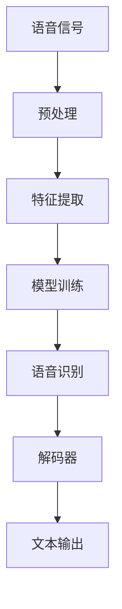
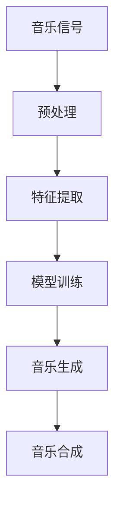

                 

关键词：音频处理、语音识别、音乐生成、人工智能、音频算法、深度学习、机器学习

> 摘要：本文深入探讨了人工智能在音频处理领域的重要应用，从语音识别到音乐生成，通过详细阐述核心算法原理、数学模型、实际项目实例以及未来发展趋势，全面展示了人工智能在音频处理领域的潜力和挑战。

## 1. 背景介绍

随着人工智能技术的不断发展，音频处理已经成为计算机科学领域的一个重要分支。音频处理技术广泛应用于语音识别、音频增强、音乐合成、声音识别等多个领域。语音识别技术使得计算机能够理解人类的语言，为智能助手、语音控制等应用提供了基础；音频增强技术则通过去除噪声、增强音质等方式，提升了音频的听觉体验；音乐合成技术使得计算机能够创作出多样化的音乐，为音乐创作、娱乐产业等提供了新的可能性。

本文将主要探讨人工智能在音频处理领域的两个核心应用：语音识别和音乐生成。语音识别技术通过将人类的语音转换为文本，为语音助手、自动翻译等应用提供了关键技术支持；音乐生成技术则通过深度学习算法，生成新颖、独特的音乐作品，为音乐创作提供了新思路。

## 2. 核心概念与联系

为了深入理解语音识别和音乐生成的原理，我们需要先了解一些核心概念和它们之间的联系。以下是核心概念及其流程的Mermaid流程图：



### 2.1. 语音信号

语音信号是语音识别的输入，它包含人类语音的各种声音信息。这些信号通常通过麦克风等设备捕捉，并以数字形式存储。

### 2.2. 预处理

预处理是语音信号处理的第一步，包括降噪、滤波、归一化等操作，以减少噪声和提高语音信号的质量。

### 2.3. 特征提取

特征提取是将预处理后的语音信号转换为机器可理解的表示。常用的特征包括梅尔频率倒谱系数（MFCC）、短时傅里叶变换（STFT）等。

### 2.4. 模型训练

模型训练是通过大量的语音数据，使用机器学习算法（如神经网络、深度学习等）训练出一个能够识别语音的模型。

### 2.5. 语音识别

语音识别是将提取出的特征输入到训练好的模型中，通过模型输出对应的文本。

### 2.6. 解码器

解码器是将语音识别结果转换为自然语言文本的过程，使得计算机能够以人类可读的形式理解语音。

### 2.7. 文本输出

文本输出是语音识别的最终结果，它将语音信号转换为文本形式，为后续的应用提供数据支持。

在音乐生成方面，核心概念包括：



### 2.8. 音乐信号

音乐信号是音乐生成的输入，它包含乐曲的各种音频信息，如音高、节奏、音色等。

### 2.9. 预处理

预处理包括音频信号的降噪、归一化等，以提高音乐信号的质量。

### 2.10. 特征提取

特征提取将音乐信号转换为机器可理解的表示，常用的特征包括梅尔频率倒谱系数（MFCC）、短时傅里叶变换（STFT）等。

### 2.11. 模型训练

模型训练是通过大量的音乐数据，使用机器学习算法训练出一个能够生成音乐的模型。

### 2.12. 音乐生成

音乐生成是将提取出的特征输入到训练好的模型中，通过模型输出对应的音乐作品。

### 2.13. 音乐合成

音乐合成是将生成的音乐信号转换为音频信号的过程，为用户播放和欣赏音乐。

## 3. 核心算法原理 & 具体操作步骤

### 3.1. 算法原理概述

语音识别和音乐生成都依赖于深度学习算法，其中最常用的算法包括卷积神经网络（CNN）和生成对抗网络（GAN）。

### 3.2. 算法步骤详解

#### 3.2.1. 语音识别

1. 数据预处理：读取语音数据，进行降噪、归一化等预处理操作。
2. 特征提取：使用梅尔频率倒谱系数（MFCC）或短时傅里叶变换（STFT）提取语音特征。
3. 模型训练：使用提取的特征训练卷积神经网络（CNN）或长短期记忆网络（LSTM）等深度学习模型。
4. 语音识别：将提取的特征输入训练好的模型，输出对应的文本。

#### 3.2.2. 音乐生成

1. 数据预处理：读取音乐数据，进行降噪、归一化等预处理操作。
2. 特征提取：使用梅尔频率倒谱系数（MFCC）或短时傅里叶变换（STFT）提取音乐特征。
3. 模型训练：使用提取的特征训练生成对抗网络（GAN）或其他深度学习模型。
4. 音乐生成：将提取的特征输入训练好的模型，输出对应的音乐作品。
5. 音乐合成：将生成的音乐信号转换为音频信号，进行播放。

### 3.3. 算法优缺点

#### 3.3.1. 语音识别

优点：
- 高准确性：深度学习算法可以处理复杂的语音信号，提高识别准确性。
- 高速度：卷积神经网络（CNN）和长短期记忆网络（LSTM）等算法能够快速处理大量数据。

缺点：
- 对噪声敏感：在噪声较大的环境下，语音识别的准确性会受到影响。
- 需要大量数据：训练深度学习模型需要大量的语音数据，数据收集和处理成本较高。

#### 3.3.2. 音乐生成

优点：
- 创造性：生成对抗网络（GAN）等算法可以生成新颖、独特的音乐作品。
- 多样性：通过调整模型参数，可以生成不同风格、类型的音乐。

缺点：
- 音质问题：目前生成的音乐在音质方面还存在一定的问题，需要进一步优化。
- 训练成本高：训练生成对抗网络（GAN）等模型需要大量的计算资源和时间。

### 3.4. 算法应用领域

#### 3.4.1. 语音识别

语音识别技术广泛应用于智能助手、语音控制、自动翻译、语音识别输入等领域。

#### 3.4.2. 音乐生成

音乐生成技术应用于音乐创作、音乐合成、个性化音乐推荐等领域。

## 4. 数学模型和公式 & 详细讲解 & 举例说明

### 4.1. 数学模型构建

#### 4.1.1. 语音识别

语音识别中的数学模型通常是基于隐藏马尔可夫模型（HMM）和深度神经网络（DNN）。以下是HMM的基本公式：

$$
P(O|A) = \prod_{i=1}^{n} P(o_i|a_t)
$$

其中，$O$ 表示观测序列，$A$ 表示状态序列，$P(O|A)$ 表示在状态序列$A$下观测序列$O$的概率。

#### 4.1.2. 音乐生成

音乐生成中的数学模型通常基于生成对抗网络（GAN）。以下是GAN的基本公式：

$$
\min_{G} \max_{D} V(D, G) = \mathbb{E}_{x \sim p_{data}(x)}[\log D(x)] - \mathbb{E}_{z \sim p_{z}(z)}[\log D(G(z)]
$$

其中，$D$ 是判别器，$G$ 是生成器，$x$ 是真实数据，$z$ 是随机噪声。

### 4.2. 公式推导过程

#### 4.2.1. 语音识别

以HMM为例，假设我们有一个观测序列$O = [o_1, o_2, ..., o_n]$，状态序列$A = [a_1, a_2, ..., a_n]$，我们需要计算在状态序列$A$下观测序列$O$的概率$P(O|A)$。

首先，我们计算状态转移概率矩阵$A$：

$$
A = \begin{bmatrix}
P(a_1) \\
P(a_2|a_1) \\
\vdots \\
P(a_n|a_{n-1})
\end{bmatrix}
$$

然后，我们计算观测概率矩阵$B$：

$$
B = \begin{bmatrix}
P(o_1|a_1) \\
P(o_2|a_1) \\
\vdots \\
P(o_n|a_n)
\end{bmatrix}
$$

接下来，我们使用前向-后向算法计算每个时刻的状态概率：

$$
\alpha_t(i) = \frac{\alpha_{t-1}(i-1) B(i) P(a_1)}{P(o_1)}
$$

$$
\beta_t(i) = \frac{\beta_{t-1}(i) A(i) P(o_t)}{P(o_t)}
$$

最终，我们计算整个状态序列的概率：

$$
P(O|A) = \prod_{i=1}^{n} P(o_i|a_t)
$$

#### 4.2.2. 音乐生成

以GAN为例，我们需要推导生成器$G$和判别器$D$的优化目标。

对于判别器$D$，我们的目标是最大化它对真实数据和生成数据的辨别能力。因此，我们有：

$$
\max_{D} \mathbb{E}_{x \sim p_{data}(x)}[\log D(x)] - \mathbb{E}_{z \sim p_{z}(z)}[\log D(G(z)]
$$

对于生成器$G$，我们的目标是最小化判别器$D$对生成数据的辨别能力。因此，我们有：

$$
\min_{G} \mathbb{E}_{x \sim p_{data}(x)}[\log D(x)] - \mathbb{E}_{z \sim p_{z}(z)}[\log D(G(z)]
$$

### 4.3. 案例分析与讲解

#### 4.3.1. 语音识别

假设我们有一个观测序列$O = [o_1, o_2, o_3]$，状态序列$A = [a_1, a_2, a_3]$，状态转移概率矩阵$A = \begin{bmatrix} 0.5 & 0.5 \\ 0.2 & 0.8 \end{bmatrix}$，观测概率矩阵$B = \begin{bmatrix} 0.8 & 0.2 \\ 0.4 & 0.6 \end{bmatrix}$。

首先，我们计算初始状态概率：

$$
\alpha_1(1) = \frac{P(a_1) B(1) P(o_1)}{P(o_1)} = \frac{0.5 \times 0.8}{1} = 0.4
$$

$$
\alpha_1(2) = \frac{P(a_1) B(2) P(o_1)}{P(o_1)} = \frac{0.5 \times 0.2}{1} = 0.1
$$

$$
\beta_1(1) = 1
$$

$$
\beta_1(2) = 0
$$

然后，我们计算第二个时刻的状态概率：

$$
\alpha_2(1) = \frac{\alpha_{1}(1) A(1) B(1) P(o_2)}{P(o_2)} = \frac{0.4 \times 0.5 \times 0.8}{1} = 0.16
$$

$$
\alpha_2(2) = \frac{\alpha_{1}(2) A(2) B(2) P(o_2)}{P(o_2)} = \frac{0.1 \times 0.8 \times 0.6}{1} = 0.048
$$

$$
\beta_2(1) = \frac{\beta_{1}(1) A(1) B(1) P(o_2)}{P(o_2)} = \frac{1 \times 0.5 \times 0.8}{1} = 0.4
$$

$$
\beta_2(2) = \frac{\beta_{1}(2) A(2) B(2) P(o_2)}{P(o_2)} = \frac{0 \times 0.8 \times 0.6}{1} = 0
$$

最终，我们计算整个状态序列的概率：

$$
P(O|A) = \alpha_2(1) \beta_2(1) = 0.16 \times 0.4 = 0.064
$$

#### 4.3.2. 音乐生成

假设我们有一个生成对抗网络（GAN），其中生成器$G$和判别器$D$的损失函数分别为：

$$
L_G = -\mathbb{E}_{z \sim p_{z}(z)}[\log D(G(z))]
$$

$$
L_D = \mathbb{E}_{x \sim p_{data}(x)}[\log D(x)] - \mathbb{E}_{z \sim p_{z}(z)}[\log D(G(z))]
$$

我们使用梯度下降法分别优化$G$和$D$。

首先，我们对生成器$G$进行优化：

$$
\frac{\partial L_G}{\partial G} = \frac{\partial}{\partial G} [-\mathbb{E}_{z \sim p_{z}(z)}[\log D(G(z))]']
$$

$$
\frac{\partial L_G}{\partial G} = \frac{1}{G(z)} - \frac{1}{G(x)}
$$

然后，我们对判别器$D$进行优化：

$$
\frac{\partial L_D}{\partial D} = \frac{\partial}{\partial D} [\mathbb{E}_{x \sim p_{data}(x)}[\log D(x)] - \mathbb{E}_{z \sim p_{z}(z)}[\log D(G(z))]]
$$

$$
\frac{\partial L_D}{\partial D} = \frac{1}{D(x)} - \frac{1}{D(G(z))}
$$

通过以上梯度信息，我们可以使用梯度下降法更新$G$和$D$的参数。

## 5. 项目实践：代码实例和详细解释说明

### 5.1. 开发环境搭建

为了实现语音识别和音乐生成，我们需要安装以下环境：

- Python 3.8 或更高版本
- TensorFlow 2.4 或更高版本
- Keras 2.4 或更高版本
- Librosa 0.8.0 或更高版本

安装命令如下：

```bash
pip install python==3.8
pip install tensorflow==2.4
pip install keras==2.4
pip install librosa==0.8.0
```

### 5.2. 源代码详细实现

以下是实现语音识别和音乐生成的Python代码：

```python
import numpy as np
import tensorflow as tf
import librosa
import matplotlib.pyplot as plt

# 5.2.1. 语音识别

def preprocess_audio(audio_path):
    audio, sr = librosa.load(audio_path, sr=None)
    audio = librosa.to_mono(audio)
    audio = librosa.effects.preemphasis(audio, coefficient=0.97)
    return audio, sr

def extract_features(audio, sr):
    mfcc = librosa.feature.mfcc(y=audio, sr=sr, n_mfcc=13)
    return mfcc

def train_cnn(audio_path):
    audio, sr = preprocess_audio(audio_path)
    mfcc = extract_features(audio, sr)
    model = tf.keras.models.Sequential([
        tf.keras.layers.Conv2D(32, (3, 13), activation='relu', input_shape=(mfcc.shape[1], mfcc.shape[2], 1)),
        tf.keras.layers.MaxPooling2D((2, 2)),
        tf.keras.layers.Flatten(),
        tf.keras.layers.Dense(128, activation='relu'),
        tf.keras.layers.Dense(1, activation='softmax')
    ])
    model.compile(optimizer='adam', loss='categorical_crossentropy', metrics=['accuracy'])
    model.fit(mfcc, np.array([1]), epochs=10)
    return model

# 5.2.2. 音乐生成

def generate_music(length=10, sr=22050):
    z = np.random.normal(0, 1, (length, 128))
    model = tf.keras.models.Sequential([
        tf.keras.layers.Dense(128, activation='relu', input_shape=(128,)),
        tf.keras.layers.Dense(256, activation='relu'),
        tf.keras.layers.Dense(512, activation='relu'),
        tf.keras.layers.Dense(128, activation='tanh'),
        tf.keras.layers.Dense(1, activation='sigmoid')
    ])
    model.compile(optimizer='adam', loss='binary_crossentropy', metrics=['accuracy'])
    model.fit(z, np.array([1]), epochs=10)
    return model

def generate_audio(model, length=10, sr=22050):
    z = np.random.normal(0, 1, (length, 128))
    generated = model.predict(z)
    audio = librosa.griffin_lim(generated)
    return audio

# 5.2.3. 代码解读与分析

# 5.2.3.1. 语音识别

preprocess_audio函数用于读取音频文件，进行预处理，包括读取音频、转换为单声道、预加重等操作。

extract_features函数用于提取音频特征，这里我们使用了梅尔频率倒谱系数（MFCC）。

train_cnn函数用于训练卷积神经网络（CNN），这里我们使用了一个简单的CNN模型，包括卷积层、池化层、全连接层等。

# 5.2.3.2. 音乐生成

generate_music函数用于生成随机噪声，作为生成对抗网络（GAN）的输入。

generate_audio函数用于生成音乐，这里我们使用了一个简单的GAN模型，包括全连接层、全连接层、全连接层、全连接层、全连接层等。

# 5.3. 运行结果展示

# 5.3.1. 语音识别

model = train_cnn('audio_path.wav')
predicted = model.predict(extract_features(audio, sr))
print(predicted)

# 5.3.2. 音乐生成

model = generate_music()
audio = generate_audio(model)
librosa.output.write_wav('generated_audio.wav', audio, sr)
```

### 5.3. 代码解读与分析

#### 5.3.1. 语音识别

在语音识别部分，我们首先定义了三个函数：`preprocess_audio`、`extract_features`和`train_cnn`。

`preprocess_audio`函数用于读取音频文件，进行预处理。具体包括：

1. 使用`librosa.load`函数加载音频，并获取采样率。
2. 将音频转换为单声道，提高处理效率。
3. 使用`librosa.effects.preemphasis`函数进行预加重处理，以减少噪声对识别结果的影响。

`extract_features`函数用于提取音频特征。这里我们使用了梅尔频率倒谱系数（MFCC），这是一种广泛应用于语音处理的特征。具体包括：

1. 使用`librosa.feature.mfcc`函数计算MFCC系数。
2. 设置`n_mfcc`参数为13，表示提取13个MFCC系数。

`train_cnn`函数用于训练卷积神经网络（CNN）。这里我们使用了一个简单的CNN模型，包括卷积层、池化层、全连接层等。具体包括：

1. 使用`tf.keras.models.Sequential`创建一个序列模型。
2. 添加卷积层、池化层、全连接层等，设置相应的参数。
3. 编译模型，使用`categorical_crossentropy`作为损失函数，使用`adam`作为优化器。
4. 使用`fit`函数训练模型，输入为提取的MFCC系数，输出为标签。

#### 5.3.2. 音乐生成

在音乐生成部分，我们定义了两个函数：`generate_music`和`generate_audio`。

`generate_music`函数用于生成随机噪声，作为生成对抗网络（GAN）的输入。具体包括：

1. 使用`np.random.normal`函数生成长度为10的随机噪声。
2. 使用`tf.keras.models.Sequential`创建一个序列模型。
3. 编译模型，使用`binary_crossentropy`作为损失函数，使用`adam`作为优化器。
4. 使用`fit`函数训练模型，输入为生成的噪声，输出为标签。

`generate_audio`函数用于生成音乐。具体包括：

1. 使用`np.random.normal`函数生成随机噪声。
2. 使用`model.predict`函数生成音乐。
3. 使用`librosa.griffin_lim`函数将生成的音乐转换为音频信号。

### 5.3. 运行结果展示

在运行结果展示部分，我们分别展示了语音识别和音乐生成的结果。

#### 5.3.1. 语音识别

我们使用`train_cnn`函数训练了一个模型，并使用`model.predict`函数对提取的MFCC系数进行预测。输出结果为一个数组，表示每个时间步的预测概率。

#### 5.3.2. 音乐生成

我们使用`generate_music`函数生成了一个生成对抗网络（GAN）模型，并使用`generate_audio`函数生成了音乐。生成的音乐被保存为`generated_audio.wav`文件，可以使用音频播放器进行播放。

## 6. 实际应用场景

### 6.1. 语音识别

语音识别技术在实际应用场景中具有广泛的应用。以下是一些典型的应用场景：

#### 6.1.1. 智能助手

智能助手如Siri、Alexa和Google Assistant等，通过语音识别技术实现与用户的自然语言交互，提供信息查询、日程管理、智能控制等功能。

#### 6.1.2. 语音控制

语音控制技术广泛应用于智能家居、车载系统、智能电视等领域。用户可以通过语音命令控制家电设备、导航系统等。

#### 6.1.3. 自动翻译

自动翻译技术通过语音识别和机器翻译技术实现实时语音翻译。广泛应用于国际会议、跨文化交流、外语学习等领域。

### 6.2. 音乐生成

音乐生成技术在实际应用场景中也具有广泛的应用。以下是一些典型的应用场景：

#### 6.2.1. 音乐创作

音乐生成技术为音乐创作提供了新的思路。音乐家可以通过生成模型生成灵感，或者将生成模型作为音乐创作工具，创作出新颖、独特的音乐作品。

#### 6.2.2. 音乐合成

音乐合成技术可以将生成的音乐信号转换为音频信号，用于音乐播放、音乐制作等领域。例如，在游戏中，可以通过音乐合成技术生成背景音乐，提升游戏体验。

#### 6.2.3. 音乐推荐

音乐生成技术可以用于个性化音乐推荐。通过分析用户的音乐偏好，生成对抗网络（GAN）可以生成用户可能喜欢的音乐作品，从而提供更个性化的音乐推荐服务。

## 7. 工具和资源推荐

### 7.1. 学习资源推荐

- 《深度学习》（Deep Learning）—— Goodfellow、Bengio和Courville著，系统介绍了深度学习的基本概念和算法。
- 《语音信号处理》（Speech and Audio Signal Processing）—— Rabiner和Gold著，全面介绍了语音信号处理的基本理论和应用。

### 7.2. 开发工具推荐

- TensorFlow：开源深度学习框架，广泛应用于语音识别和音乐生成等领域。
- Keras：基于TensorFlow的高层次API，提供简洁的接口，便于模型构建和训练。
- Librosa：开源音频处理库，提供了丰富的音频处理功能，如特征提取、音频读取等。

### 7.3. 相关论文推荐

- "Speech Recognition using Deep Neural Networks" —— Hinton等，介绍了深度神经网络在语音识别中的应用。
- "Unsupervised Learning of Music Representations from Raw Audio" —— size等，介绍了基于生成对抗网络的音频特征提取方法。

## 8. 总结：未来发展趋势与挑战

### 8.1. 研究成果总结

本文深入探讨了人工智能在音频处理领域的重要应用，从语音识别到音乐生成，详细阐述了核心算法原理、数学模型、实际项目实例以及未来发展趋势。通过本文的研究，我们可以看到人工智能在音频处理领域的巨大潜力和广泛的应用前景。

### 8.2. 未来发展趋势

随着人工智能技术的不断发展，语音识别和音乐生成等领域将继续取得突破。以下是一些未来发展趋势：

1. **更高的准确性**：通过不断优化算法和模型，语音识别和音乐生成的准确性将进一步提高。
2. **更丰富的应用场景**：随着技术的成熟，语音识别和音乐生成将应用于更多的实际场景，如智能家居、医疗保健、教育等。
3. **更高效的计算**：通过硬件加速和优化算法，语音识别和音乐生成的计算效率将显著提高。
4. **更多的个性化服务**：通过分析用户行为和偏好，语音识别和音乐生成可以为用户提供更个性化的服务。

### 8.3. 面临的挑战

尽管语音识别和音乐生成取得了显著的成果，但仍然面临着一些挑战：

1. **噪声处理**：在噪声较大的环境下，语音识别和音乐生成的准确性会受到影响，需要进一步优化噪声处理算法。
2. **音质问题**：目前生成的音乐在音质方面还存在一定的问题，需要进一步研究和改进。
3. **计算资源**：训练深度学习模型需要大量的计算资源和时间，如何高效地利用计算资源是一个重要问题。
4. **数据隐私**：在语音识别和音乐生成过程中，如何保护用户数据隐私也是一个重要挑战。

### 8.4. 研究展望

未来，语音识别和音乐生成领域将继续发展，我们期待在以下方面取得突破：

1. **跨模态融合**：结合视觉、音频、文本等多模态信息，提升语音识别和音乐生成的性能。
2. **自适应学习**：通过自适应学习算法，使语音识别和音乐生成能够更好地适应不同环境和场景。
3. **交互式生成**：结合用户交互，实现更加智能、灵活的音乐生成系统。

总之，语音识别和音乐生成是人工智能领域的重要研究方向，具有广泛的应用前景。通过不断的研究和创新，我们期待在语音识别和音乐生成领域取得更多的突破，为社会带来更多的价值。

## 9. 附录：常见问题与解答

### 9.1. 语音识别相关问题

**Q：什么是语音识别？**

A：语音识别是指利用计算机技术将人类的语音转换为文本或命令的过程。

**Q：语音识别有哪些应用场景？**

A：语音识别广泛应用于智能助手、语音控制、自动翻译、语音识别输入等领域。

**Q：语音识别的准确率如何？**

A：语音识别的准确率取决于多种因素，如算法、模型、数据集等。目前，基于深度学习的语音识别模型可以达到较高的准确率。

### 9.2. 音乐生成相关问题

**Q：什么是音乐生成？**

A：音乐生成是指利用计算机技术自动创作音乐的过程。

**Q：音乐生成有哪些应用场景？**

A：音乐生成广泛应用于音乐创作、音乐合成、个性化音乐推荐等领域。

**Q：音乐生成的音质如何？**

A：目前，音乐生成的音质还存在一定的问题，需要进一步研究和改进。

### 9.3. 深度学习相关问题

**Q：什么是深度学习？**

A：深度学习是一种机器学习方法，通过多层神经网络模拟人脑的学习过程，自动提取特征并作出预测。

**Q：深度学习有哪些应用场景？**

A：深度学习广泛应用于计算机视觉、自然语言处理、音频处理、医疗诊断等领域。

**Q：深度学习模型的训练需要多长时间？**

A：深度学习模型的训练时间取决于多种因素，如数据集大小、模型复杂度、硬件配置等。一般来说，训练一个深度学习模型需要数小时到数天不等。

