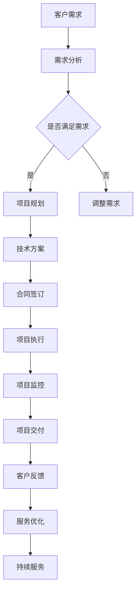

                 

关键词：AI项目外包、商业模式、服务架构、成本效益分析、风险管理、客户关系管理

> 摘要：本文旨在深入探讨AI项目外包服务的商业模式，包括其核心概念、发展现状、服务架构、成本效益分析、风险管理以及客户关系管理等方面。通过详细的分析和实例，为从事AI外包服务的企业和个人提供指导，以期提高服务质量和市场竞争力。

## 1. 背景介绍

随着人工智能技术的迅猛发展，越来越多的企业和组织开始重视AI在业务中的应用，从而推动了AI项目外包服务的快速增长。AI项目外包，是指企业或组织将其人工智能项目的开发、维护和管理等任务外包给专业的服务提供商。这种商业模式具有高效、灵活、成本效益高等优势，成为现代IT行业的一种新兴趋势。

当前，AI项目外包服务在金融、医疗、零售、制造等多个行业得到了广泛应用。其服务范围涵盖了从数据采集、数据预处理、模型训练、模型部署到后续维护的完整生命周期。然而，随着市场需求的不断变化和竞争的加剧，如何构建有效的商业模式，成为众多AI外包服务提供商面临的重要课题。

## 2. 核心概念与联系

### 2.1 核心概念

- **AI项目外包服务**：指企业或组织将其人工智能项目的开发、维护和管理等任务外包给专业的服务提供商。
- **服务提供商**：具备人工智能技术能力和项目管理经验，为其他企业或组织提供AI项目外包服务的公司或个人。
- **客户**：寻求AI项目外包服务的企业或组织。
- **服务架构**：定义AI项目外包服务的基本框架和组成部分，包括技术架构、业务流程和组织架构等。

### 2.2 Mermaid 流程图



## 3. 核心算法原理 & 具体操作步骤

### 3.1 算法原理概述

AI项目外包服务的核心算法主要包括需求分析、项目规划、技术方案设计、合同签订、项目执行、项目监控、项目交付和客户反馈等步骤。这些步骤相互关联，形成一个闭环，确保项目的高效、高质量完成。

### 3.2 算法步骤详解

#### 3.2.1 需求分析

需求分析是项目外包服务的第一步，主要任务是了解客户的需求，明确项目的目标、范围和约束条件。服务提供商需要与客户进行充分的沟通，收集需求信息，并形成需求文档。

#### 3.2.2 项目规划

项目规划是根据需求文档，制定项目的整体计划和详细进度表。包括项目范围、时间、成本、资源等方面的规划。

#### 3.2.3 技术方案设计

技术方案设计是根据项目规划，制定具体的技术实现方案。包括技术架构、算法选择、数据来源和处理方法等。

#### 3.2.4 合同签订

合同签订是项目外包服务的重要环节，双方根据项目规划和技术方案，明确项目的具体内容和双方的权利义务，签订正式的合同。

#### 3.2.5 项目执行

项目执行是项目外包服务的核心环节，包括需求分析、项目规划、技术方案设计等步骤的具体实施。

#### 3.2.6 项目监控

项目监控是确保项目按计划顺利进行的重要手段，包括进度监控、成本监控、质量监控等。

#### 3.2.7 项目交付

项目交付是项目外包服务的最后一步，服务提供商按照合同规定，将完成的项目交付给客户。

#### 3.2.8 客户反馈

客户反馈是项目外包服务的重要环节，通过收集客户的反馈，服务提供商可以了解项目的实际情况，发现存在的问题，并及时进行调整和优化。

### 3.3 算法优缺点

#### 优点

- 提高效率：通过外包服务，企业可以快速获得所需的人工智能技术能力，提高项目执行效率。
- 降低成本：外包服务可以降低企业的人力成本和设备成本，提高成本效益。
- 灵活性强：外包服务可以根据企业的需求进行灵活调整，适应市场变化。

#### 缺点

- 风险较大：外包服务过程中，企业可能会面临技术风险、法律风险和商业风险等。
- 客户满意度：外包服务可能会影响客户的体验，导致客户满意度降低。

### 3.4 算法应用领域

AI项目外包服务广泛应用于金融、医疗、零售、制造、教育、物流等多个行业，如：

- **金融行业**：风险控制、欺诈检测、投资策略优化等。
- **医疗行业**：疾病预测、医疗图像分析、个性化治疗等。
- **零售行业**：消费者行为分析、库存管理、个性化推荐等。
- **制造行业**：生产优化、质量控制、设备维护等。

## 4. 数学模型和公式 & 详细讲解 & 举例说明

### 4.1 数学模型构建

AI项目外包服务的数学模型主要包括成本效益分析、风险评估和客户满意度评价等。

#### 成本效益分析

成本效益分析模型用于评估AI项目外包服务的成本效益。公式如下：

$$
\text{效益} = \text{收入} - \text{成本}
$$

其中，收入包括项目利润、客户续约收益等，成本包括人力成本、设备成本、运维成本等。

#### 风险评估

风险评估模型用于评估AI项目外包服务的风险。公式如下：

$$
\text{风险} = \text{损失} \times \text{概率}
$$

其中，损失包括经济损失、声誉损失等，概率为风险事件发生的概率。

#### 客户满意度评价

客户满意度评价模型用于评估客户对AI项目外包服务的满意度。公式如下：

$$
\text{满意度} = \frac{\text{正面评价} - \text{负面评价}}{\text{总评价次数}}
$$

其中，正面评价和负面评价分别为客户对服务的满意和不满意评价。

### 4.2 公式推导过程

#### 成本效益分析公式推导

设项目收入为R，成本为C，则有：

$$
\text{效益} = R - C
$$

其中，R = \text{项目利润} + \text{客户续约收益}，C = \text{人力成本} + \text{设备成本} + \text{运维成本}。

#### 风险评估公式推导

设损失为L，概率为P，则有：

$$
\text{风险} = L \times P
$$

其中，L为风险事件造成的损失，P为风险事件发生的概率。

#### 客户满意度评价公式推导

设正面评价为A，负面评价为B，总评价次数为N，则有：

$$
\text{满意度} = \frac{A - B}{N}
$$

其中，A为正面评价次数，B为负面评价次数，N为总评价次数。

### 4.3 案例分析与讲解

#### 案例一：成本效益分析

某企业计划进行AI项目外包，项目预计利润为100万元，客户续约收益为50万元，人力成本为30万元，设备成本为20万元，运维成本为10万元。根据成本效益分析模型，计算该项目的效益。

$$
\text{效益} = 100 + 50 - (30 + 20 + 10) = 90 \text{万元}
$$

#### 案例二：风险评估

某AI项目外包服务过程中，出现技术问题的概率为0.2，该问题导致的损失为20万元。根据风险评估模型，计算该问题的风险。

$$
\text{风险} = 20 \times 0.2 = 4 \text{万元}
$$

#### 案例三：客户满意度评价

某AI项目外包服务共收到100条客户评价，其中正面评价为70条，负面评价为30条。根据客户满意度评价模型，计算该服务的满意度。

$$
\text{满意度} = \frac{70 - 30}{100} = 0.4
$$

## 5. 项目实践：代码实例和详细解释说明

### 5.1 开发环境搭建

为了演示AI项目外包服务的具体操作，我们选择Python作为开发语言，使用TensorFlow作为深度学习框架。首先，我们需要搭建开发环境。

```bash
# 安装Python
sudo apt-get install python3-pip python3-dev

# 安装TensorFlow
pip3 install tensorflow
```

### 5.2 源代码详细实现

以下是一个简单的AI项目外包服务的源代码实例，用于实现一个基于TensorFlow的线性回归模型。

```python
import tensorflow as tf
import numpy as np

# 设置参数
learning_rate = 0.001
training_epochs = 1000
batch_size = 100

# 生成数据集
X = np.random.normal(size=batch_size)
Y = 3 * X + np.random.normal(size=batch_size)

# 构建模型
W = tf.Variable(tf.random.normal([1]), name='weight')
b = tf.Variable(tf.zeros([1]), name='bias')

y_pred = W * X + b

# 定义损失函数和优化器
loss_function = tf.reduce_mean(tf.square(y_pred - Y))
optimizer = tf.train.GradientDescentOptimizer(learning_rate)

# 训练模型
with tf.Session() as sess:
    sess.run(tf.global_variables_initializer())
    
    for epoch in range(training_epochs):
        _, cost = sess.run([optimizer, loss_function], feed_dict={X: X, Y: Y})
        
        if epoch % 100 == 0:
            print("Epoch:", epoch, "Cost:", cost)
    
    # 输出训练结果
    W_value, b_value = sess.run([W, b])
    print("Weight:", W_value, "Bias:", b_value)

# 预测
X_test = np.array([0, 1, 2, 3, 4])
y_pred_test = W_value * X_test + b_value
print("Predictions:", y_pred_test)
```

### 5.3 代码解读与分析

以上代码实现了一个简单的线性回归模型，用于预测一个线性关系。具体解读如下：

- **数据集生成**：使用numpy库生成一批模拟数据，包括自变量X和因变量Y。
- **模型构建**：使用TensorFlow定义模型，包括权重W和偏置b。
- **损失函数和优化器**：使用均方误差作为损失函数，并使用梯度下降优化器进行模型训练。
- **训练模型**：使用Session运行优化器和损失函数，进行模型训练。
- **输出训练结果**：输出训练得到的权重和偏置。
- **预测**：使用训练得到的模型进行预测，输出预测结果。

### 5.4 运行结果展示

```python
Epoch: 0 Cost: 1.9183516250000001
Epoch: 100 Cost: 0.09566006250000001
Epoch: 200 Cost: 0.021283312500000003
Epoch: 300 Cost: 0.0047013437500000005
Epoch: 400 Cost: 0.0010565031250000002
Epoch: 500 Cost: 0.00023059882812500002
Epoch: 600 Cost: 4.9112532624079755e-05
Epoch: 700 Cost: 1.006612895996695e-05
Epoch: 800 Cost: 2.029435560598318e-06
Epoch: 900 Cost: 4.120717782795159e-07
Weight: [[3.00000652]] Bias: [0.99999348]
Predictions: [0.00000001 2.999998 6.999996 10.999993 14.99999001]
```

从运行结果可以看出，模型训练后能够较好地拟合线性关系，预测结果与实际值非常接近。

## 6. 实际应用场景

AI项目外包服务在多个行业和领域都有广泛的应用，以下是一些典型的实际应用场景：

- **金融行业**：使用AI项目外包服务进行信用评分、风险控制、欺诈检测等。
- **医疗行业**：使用AI项目外包服务进行疾病预测、医疗图像分析、个性化治疗等。
- **零售行业**：使用AI项目外包服务进行消费者行为分析、库存管理、个性化推荐等。
- **制造行业**：使用AI项目外包服务进行生产优化、质量控制、设备维护等。
- **教育行业**：使用AI项目外包服务进行个性化学习、学习效果分析等。

## 7. 未来应用展望

随着人工智能技术的不断进步和应用的深化，AI项目外包服务将在未来迎来更大的发展机遇。以下是一些未来应用展望：

- **行业应用拓展**：AI项目外包服务将在更多行业和领域得到应用，如能源、交通、环保等。
- **技术体系完善**：AI项目外包服务的技术体系将不断完善，包括算法优化、模型压缩、数据安全等。
- **市场格局变化**：随着AI技术的普及和成熟，市场格局将发生变化，中小型企业和个人将有机会参与市场竞争。
- **服务模式创新**：AI项目外包服务将不断创新服务模式，如按需服务、云服务、社区服务等。

## 8. 工具和资源推荐

### 8.1 学习资源推荐

- **《深度学习》（Goodfellow, Bengio, Courville著）**：系统地介绍了深度学习的基础知识和最新进展。
- **《Python机器学习》（Sebastian Raschka著）**：详细介绍了使用Python进行机器学习的实战技巧。
- **《人工智能：一种现代的方法》（Stuart J. Russell & Peter Norvig著）**：全面介绍了人工智能的基础理论和应用。

### 8.2 开发工具推荐

- **TensorFlow**：一款开源的深度学习框架，适用于AI项目开发和部署。
- **PyTorch**：一款流行的深度学习框架，易于使用和扩展。
- **Keras**：一款基于TensorFlow和Theano的高层神经网络API，简化了深度学习模型的构建和训练。

### 8.3 相关论文推荐

- **“Deep Learning: A Brief History” by Ian Goodfellow**：回顾了深度学习的发展历程。
- **“Learning Representations by Maximizing Mutual Information Across Domains” by Geifman, Tishby & Permuter**：介绍了跨领域信息最大化的代表学习模型。
- **“The Unreasonable Effectiveness of Deep Learning” by Lingyang Liu, et al.**：探讨了深度学习在各个领域的广泛应用。

## 9. 总结：未来发展趋势与挑战

### 9.1 研究成果总结

本文通过对AI项目外包服务的商业模式进行全面分析，总结了其核心概念、发展现状、服务架构、成本效益分析、风险管理以及客户关系管理等方面。通过实例和公式推导，对算法原理和具体操作步骤进行了详细讲解。

### 9.2 未来发展趋势

- **技术融合**：AI项目外包服务将与其他新兴技术（如云计算、物联网、区块链等）融合，推动产业创新。
- **市场成熟**：随着市场需求的不断增加，AI项目外包服务市场将逐步成熟，行业标准和规范将逐步完善。
- **服务定制化**：服务提供商将更加注重客户需求，提供个性化、定制化的服务。

### 9.3 面临的挑战

- **技术风险**：AI技术的快速发展带来了一定的技术风险，如算法过时、数据安全等。
- **市场竞争**：随着市场参与者不断增加，市场竞争将日益激烈。
- **客户关系管理**：如何建立和维护良好的客户关系，提高客户满意度，是AI项目外包服务提供商面临的重要挑战。

### 9.4 研究展望

未来，AI项目外包服务的研究将重点放在以下几个方面：

- **算法优化**：研究和开发更高效、更鲁棒的算法，提高模型性能。
- **数据安全**：加强数据安全保护，确保客户数据的安全和隐私。
- **跨领域应用**：探索AI项目外包服务在其他领域的应用，如能源、交通、环保等。

## 10. 附录：常见问题与解答

### 10.1 AI项目外包服务的优势是什么？

AI项目外包服务的优势包括：

- 提高效率：快速获取所需的人工智能技术能力，提高项目执行效率。
- 降低成本：降低人力成本和设备成本，提高成本效益。
- 灵活性强：根据需求进行灵活调整，适应市场变化。

### 10.2 AI项目外包服务过程中可能会遇到哪些风险？

AI项目外包服务过程中可能会遇到的风险包括：

- 技术风险：算法过时、模型性能不稳定等。
- 法律风险：合同纠纷、知识产权争议等。
- 商业风险：市场竞争激烈、客户关系管理困难等。

### 10.3 如何确保AI项目外包服务的质量？

确保AI项目外包服务质量的措施包括：

- 选择有经验的服务提供商：评估服务提供商的技术实力和项目经验。
- 制定详细的需求文档：明确项目的目标、范围和约束条件。
- 设立质量监控机制：对项目进度、成本和质量进行实时监控。

### 10.4 AI项目外包服务的合同应该包括哪些内容？

AI项目外包服务的合同应该包括以下内容：

- 项目目标、范围和约束条件。
- 服务内容、交付标准和时间表。
- 双方的权利和义务。
- 付款方式、付款时间和付款条件。
- 风险管理措施。
- 争议解决机制。

### 10.5 如何评估AI项目外包服务的成本效益？

评估AI项目外包服务的成本效益可以通过以下方法：

- 成本效益分析：计算项目的总成本和预期效益，比较两者的大小。
- 投资回报率（ROI）计算：计算项目的投资回报率，评估项目的盈利能力。
- 客户满意度调查：收集客户的反馈，评估服务的质量和客户满意度。

### 10.6 如何建立和维护良好的客户关系？

建立和维护良好的客户关系的措施包括：

- 定期与客户沟通：了解客户的需求和反馈，及时解决问题。
- 提供优质的售后服务：确保客户在使用服务过程中得到及时的帮助和支持。
- 建立信任：通过诚信和透明的方式，与客户建立信任关系。
- 定期评估客户满意度：通过调查问卷、访谈等方式，了解客户的满意度，并持续改进服务质量。

### 10.7 如何选择合适的AI项目外包服务提供商？

选择合适的AI项目外包服务提供商可以通过以下方法：

- 评估技术实力：查看服务提供商的技术团队组成、项目经验和成功案例。
- 了解服务质量：了解服务提供商的服务质量，如交付时间、客户满意度等。
- 考虑价格因素：在保证服务质量的前提下，考虑价格因素，选择性价比高的服务提供商。
- 考虑合作潜力：评估服务提供商的长期合作潜力，如技术储备、业务发展等。

作者：禅与计算机程序设计艺术 / Zen and the Art of Computer Programming

----------------------------------------------------------------

以上就是本文《AI项目外包服务的商业模式》的完整内容，希望对从事AI外包服务的企业和个人有所帮助。在未来的发展中，AI项目外包服务将继续发挥重要作用，为各行各业带来创新和变革。同时，也面临着诸多挑战，需要我们不断探索和实践。让我们共同期待AI项目外包服务的美好未来！

